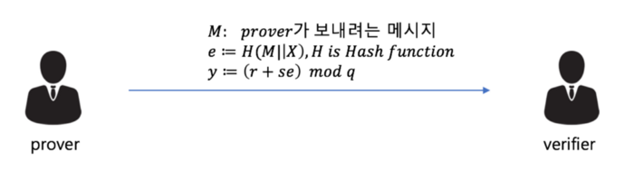

## The Key: Non-Interactive

이전 포스팅에서 알아 보았듯이, 블록체인의 특성을 고려할 때 영지식 증명 중에서도 비대화형 시스템 (NIZKP; Non-Interactive Zero-Knowledge Proof) 이 적합하다. NIZKP의 핵심은 결국 Prover와 Verifier의 메시지 교환이 **최소화**되어야 한다는 것을 의미한다. 즉, Prover가 특정 메시지를 Verifier에게 보내고 난 다음, 차후의 작업을 처리할 때 추가로 메시지가 필요하다면 이는 Non-Interactive 방식이 아니다. Prover가 증명에 필요한 메시지를 보내고 난 후 연결이 끊어진다고 하더라도 결국에는 그 메시지가 검증되어야 하는 것이 NIZKP의 핵심이다.

## Schnorr Identification Protocol

암호학에서 Schnorr Protocol은 Prover가 자신의 Private Key를 공개하지 않고 이를 소유하고 있음을 증명할 수 있는 방법이다. 키 교환 프로토콜이기 때문에 실제 블록체인에 적용될 수 있는 NIZKP 개념과 유사하다.

먼저 Prover만 알고 있는 변수와, Prover 및 Verifier가 공유하는 변수들은 다음과 같다. 각 변수의 값을 선택 혹은 도출하는 방식은 아래를 참고하길 바란다.

- Global Variables
  - $$p: \ prime \ num$$
  - $$q: \ (p-1) \ factor \ (인수)$$
  - $$a: \ a^{q} \equiv 1 \ (mod \ p)$$
  - $$v: \ public \ key \ (v=a^{-s} \ mod \ p)$$
- Prover's Side
  - $$s: \ private \ key \ (0<s<q)$$
  - $$r: \ random \ num$$
  - $$X=a^{r} \ mod \ p$$

여기서 Prover는 $$s$$의 값을 Verifier에게 공개하지 않고, 자신이 $$s$$를 알고 있다는 것을 납득시키려 한다.

1. Prover는 Random Value $$r \ (0<r<q)$$을 하나 선택하여 그에 따른 $$X$$ 값을 계산한다.
2. Prover가 보내고자 하는 메시지 $$M$$ 과 $$X$$ 값을 이어 붙인 후, 이를 해시하여 새러운 서명 $$e$$ 를 만든다.
3. 만든 서명 $$e$$ 를 토대로, 또 다른 서명 $$y$$ 값을 도출해낸다.
4. Prover는 메시지 $$M$$ 과 도출해낸 서명 $$e, \ y$$ 를 Verifier에게 보낸다.

Verifier는 Prover로 부터 받은 정보를 통해 수행해야 하는 것은, $$M, \ e, \ y$$ 를 통해 계산해낸 $$X'$$ 와 Prover가 가지고 있는 $$X$$ 와 일치하는 지를 확인하는 것이다. 하지만 $$X$$ 는 Prover만 알고 있는 정보이기 때문에, 다음과 같은 과정을 통해 $$X'$$ 를 도출해낸다.
$$
X=a^{r} \ mod \ p \newline
r=y-s * e \newline
\Downarrow \newline
X'=a^{y-se} \ mod \ p = a^{y}*a^{-se} \ mod \ p \newline
v = a^{-s} \ mod \ p \newline
\Downarrow \newline
X'=a^{y}*v^{e} \ mod \ p
$$
위와 같은 과정에 따라 $$X=X'$$ 임을 확인할 수 있다. 하지만 Verifier가 $$X'$$ 값을 도출하였어도, 실제 $$X$$ 값을 Prover로 부터 전달받지 못하기 때문에 직접 확인할 수 없다. 그래서 Verifier는 도출한 $$X'$$ 를 이용하여 $$e'$$ 값을 계산한다.
$$
e'=H(M||X')
$$
실제로 $$X=X'$$ 가 만족한다면, $$e=e'$$ 가 되어 Verifier는 납득할 수 있고, 결국 Verifier는 Private Key $$s$$ 값이 무엇인 지는 모르지만  Prover가 이를 알고 있다는 사실을 수학적으로 납득할 수 있게 된다.

## Add Property Succinctness: zk-SNARKs

## Reference

- 

