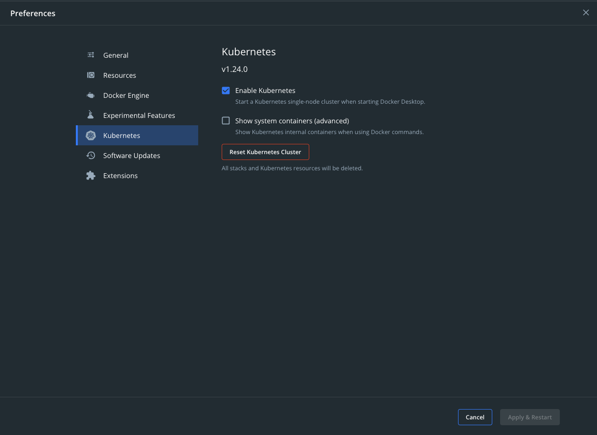

## Sample Application

도커 이미지로 배포해 볼 예제 Go언어 서버는 아래와 같다.

```go
func main() {
	server := echo.New()
	server.Use(middleware.Logger())
	server.Use(middleware.Recover())

	server.GET("/", func(c echo.Context) error {
		return c.JSON(http.StatusOK, "Hello Log Env")
	})

	server.GET("/env", func(c echo.Context) error {
		return c.JSON(http.StatusOK, os.Environ())
	})

	server.GET("/my-env", func(c echo.Context) error {
		return c.JSON(http.StatusOK, os.Getenv("MY_ENV"))
	})

	port := os.Getenv("PORT")
	err := server.Start(":" + port)
	if err != nil {
		panic(err)
	}
}
```

아래와 같은 동작을 하는 서버를 구동시켜서 Postman 등으로 정상 동작을 확인해보자.

- `/` 요청에 대해 Heart Beat 응답을 보낸다.
- `/env` 요청에 대해 환경변수 목록을 반환한다.
- `/my-env` 요처에 대해 `MY_ENV` 환경변수 값을 반환한다.

```
go run main.go
```

## Create Dockerfile

Dockerfile은 Docker Image를 만들기 위한 명령어들을 담고 있는 텍스트 문서이다. `docker build` 명령어를 입력할 때 Docker는 Dockerfile 내의 명령어들을 수행하여 이미지를 만든다. 기본 파일 이름은 확장자 없이 `Dockerfile`이다. 만약 다른 이름으로 한다면, `docker build --file "filename" ` 명령어를 입력해야 한다. 

### Parser Directives

Dockerfile 첫 줄에는 Directive들을 명시해야 한다. Directive는 Docker에게 아래의 명령어들을 수행할 때 어떻게 수행하라고 지시하는 목적이다. `# directive=value` 형식으로 작성되어야 한다. 아래는 잘못된 형식 예시들이다.

```dockerfile
# direc \
tive=value
```

- Single Line으로 작성되어야 한다.

```dockerfile
# directive=value1
# directive=value2

FROM ImageName
```

- 동일한 Directive가 2번 이상 사용되면 안된다.

```dockerfile
FROM ImageName
# directive=value
```

- Directive는 가장 상단에 위치해야 한다.

```dockerfile
# About my dockerfile
# directive=value
FROM ImageName
```

- 마찬가지로 Directive는 가장 상단에 위치해야 한다. 이 경우 `# directive=value`는 주석으로 처리된다.

```dockerfile
#directiveA=valueA
# directiveB1 =valueB1
#	directiveB2= valueB2
# directiveC1=valueC1
#		directiveC2=valueC2
```

- Line-Breaking이나 Whitespace를 구분하지 않는다.

아래는 올바른 형태의 예시다.

```dockerfile
# syntax=docker/dockerfile:1
```

- Dockerfile Syntax를 Version1의 최신 Stable로 사용하겠다는 의미다.

### Base Image

그 다음으로는 새로 생성할 Docker Image가 어떤 Image를 토대로 생성될 지 설정한다. Docker Image는 다른 Image들로부터 상속받을 수 있는 구조이기 때문에, 대부분의 툴과 패키지들이 담겨있는 Official Go Image를 토대로 하는 편이 좋다.

```dockerfile
FROM golang:1.17-alpine
```

- `golang` 뒷 부분은 Tag로, 어떤 버전의 Image를 사용할 지 명시한다. [Docker Hub](https://hub.docker.com/_/golang?tab=tags)에서 Tag를 확인할 수 있다.

### Arguments

Dockerfile 내에서 사용될 변수를 설정한다. 이 명령만이 오직 `FROM` 명령 전에 위치할 수 있다.

```dockerfile
ARG CODE_VERSION=1.17-alpine
FROM golang:${CODE_VERSION}
```

### Working Directory

그 다음으로는 향후 실행될 명령어들의 편의를 위해 작업할 디렉터리를 명시한다. 생성하고자 하는 Image 내부에 디렉터리를 만든다. Docker는 이 디렉터리를 Default Destination으로 설정해서 향후 명령어들을 수행한다.

```dockerfile
WORKDIR /app
```

### Instructions

보통 다운로드한 Go언어 서버를 구동하기 전에 `go mod download` 명령어를 통해 필요한 의존성을 다운받는다. 이 과정을 Docker Image 생성 시에도 수행하도록 하기 위해, 먼저 `go.mod`와 `go.sum` 파일을 생성할 Image에 복사한다.

```dockerfile
COPY go.mod .
COPY go.sum .
```

- 첫번째 파라미터는 복사할 파일이며, 두번째 파라미터는 복사할 대상이다.

그리고 생성할 이미지가 빌드될 때 수행되어야 할 명령어를 적는다.

```dockerfile
RUN go mod download
```

`RUN` 명령은 아래의 두가지 형태를 지원한다.

- `RUN <command>`
- `RUN ["executable", "param1", "param2"]`

의존성 설치를 마친 후, `*.go` 파일들을 복사하여 Image로 복사한다.

```dockerfile
COPY *.go ./
```

이제 소스 코드들을 빌드할 명령어를 적는다.

```dockerfile
RUN go build -o /hello-log-env
```

- `-o` 옵션은 생성되는 Executable 파일 이름을 명시한다.

### Label

생성할 Image에 Metadata를 `key=value` 형태로 추가할 수 있다.

```dockerfile
LABEL "com.example.vendor"="ACME Incorporated"
LABEL com.example.label-with-value="foo"
LABEL version="1.0"
LABEL description="This text illustrates \
that label-values can span multiple lines."
LABEL multi.label1="value1" \
      multi.label2="value2" \
      other="value3"
```

### Listen Port

생성된 Image가 Listen할 포트를 지정한다.

```dockerfile
EXPOSE 8080
```

이 값은 기본값으로 설정되고, 만약 Image 실행 시 포트 옵션이 사용된다면, 그 값으로 오버라이딩된다.

```bash
docker run -p 8080:8080 ...
```

### Environment Replacement

Dockerfile에서 사용될 환경변수를 명시할 수 있다.

```dockerfile
ENV port=8080
```

보통 `$variable_name` 또는 `${variable_name}` 형태로 사용되는데, 주로 Brace (`{`, `}`) 를 포함한다.

```dockerfile
EXPOSE ${port}
```

그리고 `${variable_name}`은 몇가지 bash Modifier를 지원한다.

- `${variable:-word}`

  만약 `variable`이 설정되었다면, 그 설정된 값이 결과 값이 되며, 설정되지 않았다면 `word`로 결과 값이 설정된다.

- `{$variable:+word}`

  만약 `variable`이 설정되었다면, 결과 값은 `word`가 되며, 설정되지 않았다면 빈 문자열로 결과 값이 설정된다.

설정된 환경변수는 아래의 명령어들에서 사용할 수 있다.

```
| ADD        | COPY | ENV    | EXPOSE  | FROM    | LABEL |
| STOPSIGNAL | USER | VOLUME | WORKDIR | ONBUILD |
```

### CMD

위 과정들로 준비한 것들을 Docker Image 첫 구동 시에 동작하도록 설정해야 하며, Dockerfile 내에는 오직 하나의 `CMD` 명령만이 허용된다. Binary Executable 파일 경로와 이름을 이용하여 명시한다.

```dockerfile
CMD ["/hello-log-env"]
```

아래의 세가지 형태를 지원한다.

- `CMD ["executable", "param1", "param2"]`
- `CMD ["param1", "param2"]`
- `CMD command param1 param2`

### Entry Point

생성된 이미지로 구동 중인 컨테이너를 Executable 형태로 구동시킬 수 있도록 해준다. 아래의 두가지 형태를 지원한다.

- `ENTRYPOINT ["executable", "param1", "param2"]` (recommend)
- `ENTRYPOINT command param1 param2`

### Example Dockerfile

```dockerfile
# syntax=docker/dockerfile:1

ARG CODE_VERSION=1.17-alpine
FROM golang:${CODE_VERSION}

WORKDIR /app

COPY go.mod .
COPY go.sum .
RUN go mod download

COPY *.go ./

RUN go build -o /hello-log-env

ENV port=8080
EXPOSE ${port}

CMD [ "/hello-log-env" ]
```

## Build Image

이제 생성한 Dockerfile을 이용해 Docker Image를 빌드해보자.

```bash
docker build --tag hello-log-env .
```

- `--tag` 옵션은 생성된 Docker Image의 Default Label를 명시한다.

`docker image ls` 명령어로 로컬에 존재하는 Docker Image를 확인해보자.

```
REPOSITORY       TAG       IMAGE ID       CREATED          SIZE
hello-log-env    latest    8e3114563b54   17 seconds ago   550MB
```

## Versioning

보통 Docker Image는 여러 개의 Tag를 통해 Version 관리 등을 하기 때문에, 생성한 Docker Image의 Tag를 명시해두는 편이 좋다.

```bash
docker image tag hello-log-env:latest hello-log-env:v1.0
```

`docker image ls` 명령어로 확인해보자.

```
REPOSITORY       TAG       IMAGE ID       CREATED         SIZE
hello-log-env    latest    8e3114563b54   6 minutes ago   550MB
hello-log-env    v1.0      8e3114563b54   6 minutes ago   550MB
```

## Multi-Stage Build

위에서 빌드한 Image의 크기를 보면 500 MB가 넘어간다. 이는 Image 내부에 Go언어 사용을 위한 컴파일러 등의 각종 툴을 포함하고 있기 때문이다. 그러나 Image를 빌드한 목적은 개발한 서버를 구동시키기 위함이며, Go언어의 경우 하나의 Binary Executable만으로도 프로그램 구동이 가능하기 때문에 Image 크기를 줄일 수 있는 여지가 있다.

여기서 사용되는 개념이 Multiple Staging Build이다. 쉽게 말해, Binary Executable 파일을 만들기 위해 Go언어의 각종 툴들이 필요한 Build 과정과 만들어진 Executable 파일을 하나의 Image로 배포하는 과정으로 나누어 진행하는 것이다.

```dockerfile
# syntax=docker/dockerfile:1

##
## Build
##
ARG CODE_VERSION=1.17-alpine
FROM golang:${CODE_VERSION} AS build

WORKDIR /app

COPY go.mod .
COPY go.sum .
RUN go mod download

COPY *.go ./

RUN go build -o /hello-log-env

##
## Deploy
##
FROM alpine

WORKDIR /

COPY --from=build /hello-log-env /hello-log-env

ENV port=8080
ENV MY_ENV=1234

EXPOSE ${port}

ENTRYPOINT ["/hello-log-env"]
```

위처럼 새로운 Dockerfile을 만들고 Image 빌드할 때 새로운 Dockerfile을 사용하겠다고 명시하면 된다.

```bash
docker build -t hello-log-env:multistage -f Dockerfile.multistage .
```

그리고 `docker image ls`로 확인해보면 확연히 Image 크기가 줄어든 것을 확인할 수 있다.

```
REPOSITORY       TAG          IMAGE ID       CREATED         SIZE
hello-log-env    multistage   8574ec30891d   4 seconds ago   12.3MB
hello-log-env    v1.0         8e3114563b54   7 hours ago     550MB
```

## With Kubernetes

### Set Up

로컬 상에 구동해서 테스트 용도로 사용할 수 있는 작은 규모의 쿠버네티스는 꽤나 여러 종류가 있다. Minikube, Microk8s, 그리고 Docker-Desktop에서 지원하는 쿠버네티스 등. 이번에 단순히 쿠버네티스에 배포하고 ConfigMap 혹은 Secret 등의 동작 과정만 확인하기 위함이므로, 가장 구축이 간단한 (사실 이미 설치가 되어 있는 거와 마찬가지인) Docker-Desktop을 통해 진행하였다.



위와 같이 `Enable Kubernetes` 옵션을 선택하고 터미널에 아래와 같이 입력해서 정상 동작하는지 확인한다.

```bash
kubectl config get-contexts
```

명령어 결과가 아래와 같이 `docker-desktop`이 `*`으로 선택되어 있으면 된다.

```
joon@Joon-Air % kubectl config get-contexts
CURRENT   NAME             CLUSTER          AUTHINFO         NAMESPACE
*         docker-desktop   docker-desktop   docker-desktop
```

혹시라도 다른 Context로 설정되어 있다면 아래의 명령어로 변경해주면 된다.

```bash
kubectl config set current-context docker-desktop
```

### 배포

쿠버네티스를 이용해 배포하기 위해서는 `deployment.yaml`라는 환경 구성을 위한 설정 파일이 필요하다. 해당 파일을 통해 어떤 설정과 환경으로 도커 이미지를 실행시켜 구동할 것인지 정할 수 있다.

```yaml
apiVersion: apps/v1
kind: Deployment
metadata:
  labels:
    app: hello-log-env
  name: hello-log-env
spec:
  replicas: 1
  selector:
    matchLabels:
      app: hello-log-env
  strategy:
    type: Recreate
  template:
    metadata:
      labels:
        app: hello-log-env
    spec:
      containers:
        - image: tmdgh0221/hello-log-env:latest
          name: hello-log-env
          ports:
            - containerPort: 4040
              protocol: TCP
          resources: {}
      restartPolicy: Always
status: {}
---
apiVersion: v1
kind: Service
metadata:
  name: hello-log-env
spec:
  ports:
    - name: hello-log-env
      port: 4040
      targetPort: 4040
      protocol: TCP
  selector:
    app: hello-log-env
  type: LoadBalancer
status:
  loadBalancer: {}
```

- `deployment` 이름과 `service` 이름을 동일하게 명시해 두어야 잘 인식해서 배포된다.
- 배포할 도커 이미지 태그 명에 유의해서 적어야 한다. 위 예시의 경우 `tmdgh0221/hello-log-env`으로 되어 있는데, 도커 이미지를 빌드할 때 위와 같이 태그 이름을 설정하고 `docker push` 해놓은 상태여야 이미지를 잘 받아온다.

그리고 아래 명령어를 입력해서 배포를 한다.

```bash
kubectl create -f deployment.yaml
```

잘 되었는 지 확인하려면 아래의 명령어들로 알아볼 수 있다.

```bash
kubectl get all	# 배포된 pod, service, 그리고 deployment 목록을 확인할 수 있다.
kubectl get events --sort-by=.metadata.creationTimestamp -A	# 배포 중 발생한 이벤트를 시간 순으로 보여준다.
```

### ConfigMap

ConfigMap은 애플리케이션을 배포할 때 환경에 따라서 다른 설정값을 사용하는 경우를 위해 사용된다. 애플리케이션 이미지는 같지만 환경 변수가 차이날 때, 매번 다른 이미지를 배포하기에는 번거롭기에 설정값들을 변수로 관리해서 Pod이 생성될 때 이 값을 넣어줄 수 있다.

아래와 같이 `yaml`파일로 ConfigMap을 생성할 수 있다. 그리고 생성한 ConfigMap을 이용해 배포할 때, 환경변수로 값을 가져오기 위해 배포 `yaml`도 일부 수정해준다.

```yaml
apiVersion: v1
kind: ConfigMap
metadata:
  name: hello-config-map
data:
  language: go
```

```yaml
apiVersion: apps/v1
kind: Deployment
metadata:
  labels:
    app: hello-log-env
  name: hello-log-env
spec:
  replicas: 1
  selector:
    matchLabels:
      app: hello-log-env
  strategy:
    type: Recreate
  template:
    metadata:
      labels:
        app: hello-log-env
    spec:
      containers:
        - image: tmdgh0221/hello-log-env:latest
          name: hello-log-env
          imagePullPolicy: Always
          ports:
            - containerPort: 4040
              protocol: TCP
          env:
            - name: LANGUAGE
              valueFrom:
                configMapKeyRef:
                  name: hello-config-map
                  key: language
          resources: {}
      restartPolicy: Always
status: {}
```

이후에는 마찬가지로 `kubectl create -f deployment.yaml` 명령어로 배포하고 잘 동작하는 지 확인해보면 된다.

### Secret

ConfigMap이 일반적인 환경설정 정보 등을 저장하도록 디자인되었다면, 보다 보안이 중요한 패스워드나 API Key 등은 Secret에 저장하면 된다. 전반적인 사용 방법은 ConfigMap과 유사하며, 다른 점 한 가지는 저장하는 값을  base64 포맷으로 인코딩해야 한다는 점이다. 이는 인코딩 방법 중 하나인데, 바이너리 파일 등도 Secret으로 저장할 수 있도록 인코딩하는 것이다. 다만 암호화가 아닌 단순 인코딩이기 때문에, 보안 수준이 많이 떨어진다는 점을 유의해야 한다.

아래와 같이 `yaml`파일로 ConfigMap을 생성할 수 있다. 그리고 생성한 ConfigMap을 이용해 배포할 때, 환경변수로 값을 가져오기 위해 배포 `yaml`도 일부 수정해준다.

```yaml
apiVersion: v1
kind: Secret
metadata:
  name: hello-secret
data:
  function: bG9nCg==
```

```yaml
apiVersion: apps/v1
kind: Deployment
metadata:
  labels:
    app: hello-log-env
  name: hello-log-env
spec:
  replicas: 1
  selector:
    matchLabels:
      app: hello-log-env
  strategy:
    type: Recreate
  template:
    metadata:
      labels:
        app: hello-log-env
    spec:
      containers:
        - image: tmdgh0221/hello-log-env:latest
          name: hello-log-env
          imagePullPolicy: Always
          ports:
            - containerPort: 4040
              protocol: TCP
          env:
            - name: LANGUAGE
              valueFrom:
                configMapKeyRef:
                  name: hello-config-map
                  key: language
            - name: FUNCTION
              valueFrom:
                secretKeyRef:
                  name: hello-secret
                  key: function
          resources: {}
      restartPolicy: Always
status: {}
```

base64 인코딩된 값은 아래의 명령어로 쉽게 구할 수 있다.

```bash
echo -n java | base64
```

이후에는 마찬가지로 `kubectl create -f deployment.yaml` 명령어로 배포하고 잘 동작하는 지 확인해보면 된다.

## Reference

- [Docker Official Golang Docs](https://docs.docker.com/language/golang/build-images/)
- [Docker Official Dockerfile Docs](https://docs.docker.com/engine/reference/builder/)
- [조대협님 블로그 배포 포스팅](https://bcho.tistory.com/1266?category=731548)
- [조대협님 블로그 ConfigMap 포스팅](https://bcho.tistory.com/1267?category=731548)
- [조대협님 블로그 Secrete 포스팅](https://bcho.tistory.com/1268?category=731548)

