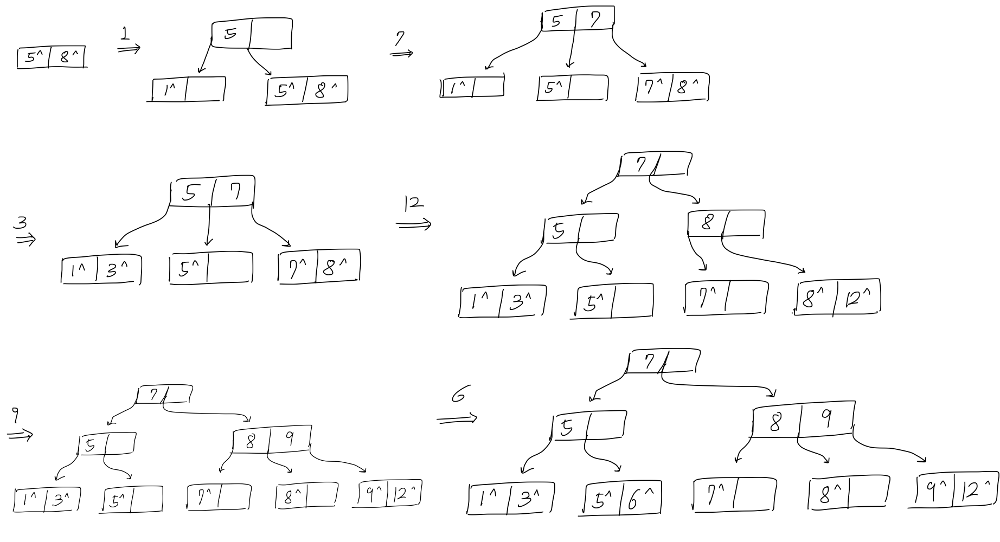
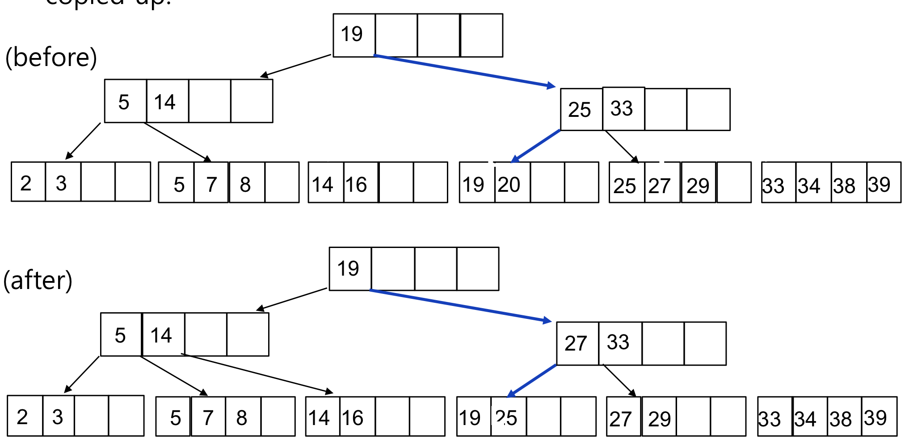

## Basic Concept

- Index는 데이터베이스에서 데이터 검색 속도를 향상시키기 위해 사용

  > 마치, 두꺼운 책의 목차와 같아고 생각하면 편하다.

- Index File은 Data File과 Index File로 나뉘어 구성

- Index File은 많은 Index Entry들로 이루어짐

- 각 Index Entry는 기본적으로 <Field Value, Block Pointer> 구조를 띰

- Index File은 항상 정렬되어 있는 특성을 가짐

  그러나 Data File은 그렇지 않을 수 있음

## Primary Index

- Data File이 Key 값에 의해 정렬되어 있음

- Index Entry 구조는 $<Key \ Field \ Value, \ Block \ Pointer>$

  여기서 Key Field Value는 Block 내의 첫번째 Record를 위한 값임

  이를 Block Anchor라고 칭함

- Sparse한 특징을 가짐

  Block의 모든 Record를 포함하는 것이 아닌 첫 Entry를 포함하기 때문

- 만약 Key 값이 $K$인 Record를 찾는다면, Index File에서 $K$보다 작거나 같은 것들 중 가장 큰 Key를 찾아가는 흐름

  Index Entry들은 정렬되어 있기 때문에 Binary Search를 이용

  Index File 크기는 충분히 작기 때문에 메인 메모리으로도 커버 가능

## Clustering Index

- Data File이 Non-Key 값에 의해 정렬되어 있음

- Index Entry 구조는 $<Non-Key \ Value, \ Block \ Pointer>$

  Primary Index와 유사하게 Block의 첫번째 Record를 가리킴

- Sparse한 특징을 가짐

## Secondary Index

- Data File이 Key 값에 대해 정렬되어 있지 않음

  여전히 Index Entry들은 Key 값에 의해 정렬되어 있음

- Index Entry 구조는 $<Key \ Field \ Value, \ Block \ Pointer>$

  모든 Record를 가리키는 형태

- Dense한 특징을 가짐

## Multi-Level Index

- Index는 항상 정렬된 상태이기 때문에 그 Index를 가리키는 또 다른 Primary Index를 만드는 것이 가능

- Fan-out ($f_o$; 분기율) 이 주요한 결정 요소

  각 Block에 저장되는 Index Entry 수를 칭함

  - Single Level 탐색시간: $log_2b$
  - Multi-Level 탐색시간: $log_{f_o}b$

  결국 $\# \ Level$이 탐색시간을 결정함

- Search Tree 구조와 유사

  k-th Tree의 탐색시간은 $log_kN$이므로 k값이 엄청 커야만 대용량 데이터를 핸들링할 수 있음

  따라서 대용량 데이터를 탐색하기에 한계가 있음

  이를 해결하기 위해 Tree의 높이를 낮게 해야함

## Multi-Way Searching Tree

- Tree를 이루는 Node의 Fan-out 을 증가시킴으로써 Tree 높이는 낮춤

- Tree 모양을 Balanced 형태로 유지해야 함

  각 Leaf Node의 Level을 갖도록 하여 $O(log_{f_o})$ 로 탐색할 수 있음

## B- Tree

- Binary Tree와 다르게 하나의 Node에 많은 정보를 가지거나 2개보다 많은 Child Node를 가질 수 있음
- 각 Node는 최소 $\frac{f_o}{2}$ 최대 $f_o$ 만큼의 Data Pointer를 가짐
- 모든 Leaf Node는 같은 Tree Level에 위치

## B+ Tree

- Million/Billion 단위의 대용량 데이터 관리에 적합

  얕고 넓은 구조인 특징으로, 일반적으로 Million 단위 데이터를 위한 트리의 높이가 Single Digit (3~5) 정도

- Internal Node

  $<Pointer_1, Key_1, Pointer_2, Key_2, ..., Pointer_{q-1}, Key_{q-1}, Pointer_q>$

  Key Field Value는 정렬되어 있음

  Tree Pointer는 또 다른 노드를 가리킴

  각 Internal Node는 $\frac{f_o}{2}$ 최대 $f_o$ 만큼의 Tree Pointer를 가짐

- Leaf Node

  $<(Key_1, Pointer_1), (Key_2, Pointer_2), ..., (Key_{q-1}, Pointer_{q-1}), Pointer_{next}>$

  Key Field Value는 정렬되어 있음

  Data Pointer는 Key에 해당하는 Record가 포함된 Page를 가리킴

  $Pointer_{next}$는 다음 Leaf Node를 가리킴

  각 Leaf Node는 최소 $\frac{f_o}{2}$ 최대 $f_o$ 만큼의 Data Pointer를 가짐

  모든 Leaf Node는 동일한 Tree Level에 위치

### Search

- 동등 탐색 시간: $log_{f_o}N$
- 탐색 범위: $log_{f_o}N + \# \ Matching \ Leaf \ Nodes$

### Insert

- Leaf Node $L$에 새로운 Index Entry에 삽입

  - $L$에 충분한 공간이 있다면 그대로 삽입

  - $L$에 공간이 없다면 $L, \ L'$으로 Split

    1. 기존 $L$의 Index Entry들을 동등하게 나눈 후, Middle Key를 Copy Up

    2. $L'$를 가리키는 Index Entry를 $L$의 Parent Node에 삽입

    3. 위 과정이 Internal Node에서도 재귀적으로 발생 가능

       그러나 Internal Node에서는 Middle Key가 Push Up

- 최악의 경우 Root Node에 Split이 발생하여 트리 높이가 1 증가

1. No Split Insert: 15

   

2. Leaf Split Insert: 8

   

3. Non-Leaf Split Insert: 8

   

- Exercise: $f_o$이 3인 B+ Tree에 {8, 5, 1, 7, 3, 12, 9, 6} 순서로 Insert

  

### Delete

- Leaf Node $L$에서 Entry 삭제

  - 이후 $L$의 Entry 수가 $\frac{f_o}{2}$ 이상이라면 종료

  - 이후 $L$의 Entry 수가 $\frac{f_o}{2}$ 보다 작아진다면

    1. Sibling Node $L'$으로부터 Entry를 Redistribute

    2. Redistribute를 실패하면 $L$과 $L'$를 Merge

       Merge할 경우 Parent Node에서 $L'$ Entry를 제거해야 함

1. Simple Deletion: 27

   

2. Redistribution Deletion: 20

   

3. Merge Deletion: 20

   

   

## B* Tree

- 각 Node의 최소 제약 조건이 $\frac{2f_o}{3}$일 때 Insert 과정에서 Split, Delete 과정에서 Merge 현상이 덜 발생하고 안정적

  이를 B* Tree라고 함

## Wrap up

### Cons

- Index도 비용이다

  Index는 두 번 탐색하도록 강요하므로 관련 읽기 비용이 추가로 들게 됨

- Index Update Overhead

  데이터의 Insert, Update, Delete 변경 작업이 발생할 때마다 해당 Index를 업데이트 해야함

  변경 작업이 자주 일어나는 경우, 성능에 악영향을 미칠 수 있음

- 한 Page를 동시에 수정할 수 있는 병행성 감소

### Caution

- 사용하면 좋은 경우
  1. Where 절에서 자주 사용되는 Column
  2. 외래키가 사용되는 Column
  3. Join에 자주 사용되는 Column
- 사용을 피해야 하는 경우
  1. Data 중복도가 높은 Column
  2. DML이 자주 발생하는 Column