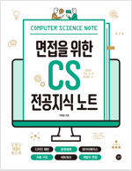

## 전체 목차

1. Index

   - 인덱스(Index)란? 어떤 상황에서 사용하면 좋을까?

   - 어떤 종류의 인덱스가 있는가?
   - 인덱스를 관리하는 자료구조는 무엇이 있는가?
2. Type Concentrating on NoSQL

   - NoSQL 데이베이스와 관계형 데이터베이스의 차이점은?

   - 어떤 상황에서 NoSQL을 선택해야 하는가?

   - NoSQL을 호율적으로 사용할 수 있는 방법은 무엇이 있는가?

   - 대표적인 NoSQL 데이터베이스로는 무엇이 있는가?
3. Join
   - Join 종류로는 어떠한 것들이 있는가?
   - Join은 어떤 과정을 거쳐 처리되는가?
   - Index와 Join은 어떤 연관 관계를 가지는가?
   - Subquery와 Join은 어떤 차이가 있는가?
   - Join시 Null 값은 어떻게 처리할 수 있는가?
   - 항상 Join을 사용하는 것이 바람직한가?
4. Normalization
   - 정규화(Normalization)란? 왜 정규화가 필요한가?
   - 데이터베이스의 이상(Anomaly) 현상이란?
   - 정규화 과정은 어떻게 이뤄지는가?
   - 비정규화는 어떨 때 유용한가?
5. Transaction
   - 트랜잭션(Transaction)의 개념과 특징은?
   - ACID 속성이 무엇을 의미하는가?

   - 트랜잭션 격리 수준과 발생할 수 있는 문제는?

   - DBMS에서 트랜잭션을 관리하는 방법은?
6. Key
   - 키(Key) 종류와 각각의 역할이 무엇인가?
   - 키를 선정할 때 고려해야 할 점은 어떤 게 있는가?
   - 키와 인덱스는 어떤 관련이 있는가?

## 선정 이유

### 집단지성

선택과 집중을 위해 유명한 [면접 준비를 위해 Gyoogle Repo](https://github.com/gyoogle/tech-interview-for-developer/tree/master)를 참고해 중요 포인트를 잡았다.

1. Key 개념 정리
2. Join SQL
3. SQL Injection
4. SQL과 NoSQL
5. Normalization, 정규화
6. Anomaly, 이상
7. Index
8. Transaction
9. Transaction Isolation Level
10. Stored Procedure, 저장 프로시저
11. Redis

### 서적 참고

위 책을 참고하여 목차와 내용을 작성했다.

### ChatGPT와 함께

그리고 ChatGPT 이용해서 가이드라인을 뽑아왔다. "데이터베이스 관련해서 채용 면접 때 나올 수 있는 질문 20가지를 중요한 순서대로 알려줘" 라고 물어봤을 때 작성일 기준 아래와 같은 대답을 받았다.

1. 데이터베이스의 인덱스(Index)란 무엇인가요? 어떤 상황에서 사용하면 좋을까요?
2. 데이터베이스 정규화(Normalization)에 대해 설명해주세요. 왜 정규화가 필요한가요?
3. 트랜잭션(Transaction)의 개념과 특징은 무엇인가요? ACID 속성이 무엇을 의미하나요?
4. 데이터베이스의 키(Key) 종류와 각각의 역할에 대해 설명해주세요.
5. 데이터베이스의 다양한 조인(Join) 유형에 대해 설명해주세요.
6. 데이터베이스 트리거(Trigger)란 무엇인가요? 어떤 상황에서 트리거를 사용하면 좋을까요?
7. 데이터베이스의 락(Lock)에 대해 설명해주세요. 락의 종류와 사용 시 주의할 점은 무엇인가요?
8. 데이터베이스에서 성능 튜닝을 위해 어떤 접근 방법을 사용할 수 있을까요?
9. 데이터베이스 복제(Replication)의 개념과 장점은 무엇인가요?
10. SQL Injection이란 무엇이며, 어떻게 방지할 수 있을까요?
11. 데이터베이스의 스키마(Schema)와 테이블(Table)의 차이점은 무엇인가요?
12. 데이터베이스 샤딩(Sharding)이 무엇인가요? 어떤 상황에서 샤딩을 사용하면 좋을까요?
13. 데이터베이스의 인덱스 선택(selectivity)이 무엇인가요? 왜 중요한 요소일까요?
14. NoSQL 데이터베이스와 관계형 데이터베이스의 차이점은 무엇인가요? 어떤 상황에서 NoSQL을 선택해야 할까요?
15. 데이터베이스의 백업과 복구 전략에 대해 설명해주세요.
16. 데이터베이스 성능을 향상시키기 위한 쿼리 최적화(Query Optimization) 기법은 어떤 것이 있나요?
17. 데이터베이스의 ACID 속성을 보장하기 위한 방법은 무엇인가요?
18. 데이터베이스 테이블 간 관계(Relationship)의 종류와 차이점에 대해 설명해주세요.
19. 데이터베이스 보안(Security)에 대해 어떤 점을 고려해야 할까요?
20. 데이터베이스의 성능 이슈를 해결하기 위한 접근 방법은 어떤 것들이 있을까요?

