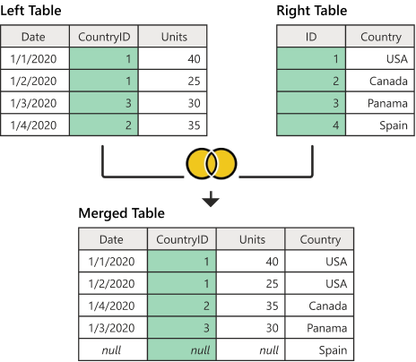

Join은 두 개 이상의 테이블을 묶어서 하나의 결과물을 만드는 것

보통 Primary Key 혹은 Foreign Key로 두 테이블을 연결

- MySQL: JOIN

- MongoDB: lookup

  되도록이면 lookup은 사용을 지양해야 함


## 종류

### Inner Join


```sql
SELECT * FROM TableA A
INNER JOIN TableB B ON
A.key = B.key
```

왼쪽 테이블과 오른쪽 테이블의 두 행이 모두 일치하는 행이 있는 부분만 표기


### Left Outer Join


```sql
SELECT * FROM TableA A
LEFT JOIN TableB B ON
A.key = B.key
```

왼쪽 테이블의 모든 행이 결과 테이블에 표기

만약 오른쪽 테이블에 일치하는 항목이 없으면 해당 값은 null 값으로


### Right Outer Join


```sql
SELECT * FROM TableA A
RIGHT JOIN TableB B ON
A.key = B.key
```

오른쪽 테이블의 모든 행이 결과 테이블에 표기

만약 왼쪽 테이블에 일치하는 항목이 없으면 해당 값은 null 값으로


### Full Outer Join


```sql
SELECT * FROM TableA A
FULL OUTER JOIN TableB B ON
A.key = B.key
```

두 개의 테이블을 기반으로 조인 조건에 만족하지 않는 행까지 모두 표기

만약 일치하는 항목이 없으면 누락된 쪽에 null 값으로



### Cross Join


```sql
SELECT * FROM TableA A
CROSS JOIN TableB B
```

조인 조건을 만족하는 모든 경우의 수를 표기

기준 테이블의 한 데이터 행을 조인 테이블 전체와 Join하는 방식


### Self Join


```sql
SELECT * FROM TableA A
INNER JOIN TableA B ON
A.key = B.key
```

자기 자신과 자기 자신 테이블을 기반으로 조인 조건에 만족하는 행 표기

하나의 테이블을 여러번 복사해서 Join하는 것과 유사

주로 사용되는 상황

- 부모-자식 관계를 표현하는 테이블

  예를 들어, 조직 구조를 나타내는 테이블에서 각 직원이 속한 부서와 부서 간의 상위 부서와 하위 부서 관계를 확인할 때

- 계층 구조

  예를 들어, 트리 형태의 카테고리 구조나 포럼에서 쓰레드와 리플 관계를 나타내는 테이블에서 계층 구조를 확인할 때

- 자기 참조하는 테이블

  예를 들어, 한 테이블에 사원 정보가 있을 때 각 사원의 상사 정보가 같은 테이블의 다른 행에 저장되어 있는 경우 각 사원과 상사 정보를 함께 조회할 때


## 원리

### Nested Loop (중첩 루프)

- 중첩 for문과 같은 원리로 조건에 맞는 조인을 하는 방법

- 랜덤 접근에 대한 비용이 많이 증가하므로 대용량 테이블에서는 사용하지 않음


1. 선행 테이블에서 주어진 조건을 만족하는 행을 찾음
   - 이때 선행 테이블에서 주어진 조건을 만족하지 않는 데이터의 경우 필터링됨
2. 선행 테이블의 조인 키를 가지고 후행 테이블에 조인 키가 존재하는지 찾으러 감
   - 조인 시도
3. 후행 테이블의 인덱스에 선행 테이블의 조인 키가 존재하는지 확인
   - 선행 테이블의 조인 값이 후행 테이블에 존재하지 않으면 선행 테이블 데이터는 필터링되어 조인 작업을 하지 않음
4. 인덱스에서 추출한 Record 식별자를 이용하여 테이블에 접근
   - 인덱스 스캔을 통한 테이블 접근
5. ~ 11. 반복 수행

### Sort Merge (정렬 병합)

- 각각의 테이블을 조인할 필드 기준으로 정렬하고 정렬이 끝난 이후에 조인 작업을 수행하는 방법

- 랜덤 엑세스로 부담이 되는 넓은 범위의 데이터를 처리할 때 사용
- 조인 필드의 인덱스가 존재하지 않는 경우에도 가능
- 동등 조인 뿐만 아니라 비동등 조인에 대해서도 조인 작업 가능


1. 선행 테이블에서 주어진 조건을 만족하는 행을 찾음
2. 선행 테이블의 조인 키를 기준으로 정렬 작업을 수행
   - 1~2번 작업을 선행 테이블의 조건을 만족하는 모든 행에 대해 반복 수행
3. 후행 테이블에서 주어진 조건을 만족하는 행을 찾음
4. 후행 테이블의 조인 키를 기준으로 정렬 작업을 수행
   - 3~4번 작업을 후행 테이블의 조건을 만족하는 모든 행에 대해 반복 수행
5. 정렬된 결과를 이용하여 조인을 수행하며 조인에 성공하면 추출버퍼에 넣음

### Hash (해시)

- 해시 테이블을 기반으로 조인하는 방법
- Nested Loop에서의 랜덤 액세스와 Sort Merge에서의 정렬 작업의 부담을 해결하기 위한 대안으로 등장
- 둘 중 하나의 테이블이 메모리에 온전히 들어간다면 보통 Nested Loop Join보다 더 효율적
- 조인 필드의 인덱스가 존재하지 않아도 가능
- 동등 조인에서만 가능


1. 선행 테이블에서 주어진 조건을 만족하는 행을 찾음
2. 선행 테이블의 조인 키를 기준으로 해시 함수를 적용하여 해시 테이블을 생성
   - 1~2번 작업을 선행 테이블의 조건을 만족하는 모든 행에 대해 반복 수행
3. 후행 테이블에서 주어진 조건을 만족하는 행을 찾음
4. 후행 테이블의 조인 키를 기준으로 해시 함수를 적용하여 해당 버킷을 찾음
   - 조인 키를 이용해서 실제 조인될 데이터를 찾음
5. 조인에 성공하면 추출 버퍼에 넣음
   - 3~5번 작업을 후행 테이블의 조건을 만족하는 모든 행에 대해서 반복 수행


## JOIN과 INDEX

### 빠른 검색

- 데이터베이스 엔진은 인덱스를 사용하여 특정 값을 빠르게 찾아갈 수 있기 때문에, JOIN에서 조인 조건에 해당하는 열을 인덱스로 사용하면 매우 빠른 검색이 가능

### 정렬 우선순위 설정

- 인덱스의 해당 열을 기준으로 데이터를 사전적 정렬이 가능
- 이를 통해 ORDER BY 절을 사용하는 쿼리의 성능도 향상 가능

### 유니크 제약 조건

- 인덱스를 사용하여 특정 열에 Unique Constraint 설정 가능
- 이를 통해 중복 데이터를 허용하지 않고 빠르게 중복 여부를 확인 가능


## SUBQUERY와 JOIN

- SUBQUERY
  - 하위 쿼리의 결과를 이용하여 주 쿼리에서 조건을 만족하는 데이터를 선택
  - 주로 WHERE, HAVING, FROM 절과 함께 사용
  - 보통 하나의 테이블에서 데이터를 가져오는데 사용
  - 주 쿼리의 결과가 하위 쿼리의 결과보다 작을 수 있음
  
- JOIN
  - 둘 이상의 테이블에서 데이터를 연결하여 하나의 결과를 얻는 데 사용
  - 관련된 데이터를 가진 여러 테이블을 조인 조건에 따라 결합하여 하나의 더  큰 결과 테이블을 만듦
  - 부통 두 개 이상의 테이블이 서로 관계를 맺고 있을 때 사용
  - 테이블 간의 공통 열을 기반으로 조인 작업을 수행하며, 결과는 모든 관련 정보를 포함

- SUBQUERY를 JOIN으로 대체할 수 없는 경우

  - GROUP BY를 사용한 SUBQUERY가 FROM 절에 있을 때

    ```sql
    SELECT city, sum_price
    FROM (
        SELECT city, SUM(price) AS sum_price
        FROM sale
        GROUP BY city
    ) AS s
    WHERE sum_price < 2100
    ```
    
  - 집계된 값을 반환하는 SUBQUERY가 WHERE 절에 있을 때
  
    ```sql
    SELECT name
    FROM product
    WHERE cost < (
      SELECT AVG(price) FROM sale
    )
    ```
  
  - SUBQUERY가 ALL 연산자에 있을 때
  
    ```sql
    SELECT name
    FROM product
    WHERE cost > ALL(
        SELECT price FROM sale
    )
    ```


## Null-Safe JOIN

JOIN 작업에서 Null 값을 적절하게 처리하여 원하는 결과를 얻는 방법

- Null-Safe Equality Operator <=>
  - 두 값이 같거나 둘 다 Null인 경우를 True로 간주
  - 즉, Null 값과 비교하여도 결과가 Null이 아니라 True 또는 False로 반환됨
  
  ```sql
  CREATE TABLE ex_table (
      a INT,
      b VARCHAR(10)
  );
  
  INSERT INTO ex_table VALUES (1,'a'),(2,'b'),(3,null);
  
  SELECT b,
         b = 'a',
         b <=> 'a',
         b <=> null
  FROM ex_table;
  
  +------+---------+-----------+------------+
  | b    | b = 'a' | b <=> 'a' | b <=> null |
  +------+---------+-----------+------------+
  | a    |       1 |         1 |          0 |
  | b    |       0 |         0 |          0 |
  | NULL |    NULL |         0 |          1 |
  +------+---------+-----------+------------+
  ```
  
- COALESCE 함수
  - 여러 인수 중 Null이 아닌 첫 번째 값을 반환
  - 이를 사용하여 JOIN시 Null 값이 있는 열을 다른 값으로 대체하여 조인 조건을 만족시킬 수 있음
  
  ```sql
  +-----+-----+----------------+
  |  A  |  B  | COALESCE(A, B) |
  +-----+-----+----------------+
  |  1  | Null|        1       |
  |  2  |  3  |        2       |
  | Null|  4  |        4       |
  | Null| Null|       Null     |
  +-----+-----+----------------+
  ```


## JOIN 없이

### 중복 데이터

- 특정 테이블에 모든 정보가 포함되어 있고 다른 테이블과 중복되는 정보가 거의 없는 경우, JOIN 없이 데이터를 처리하는 것이 더 효율적일 수 있음

### 인덱싱과 부분 집합

- 테이블이 작은 경우에는 데이터베이스 엔진이 메모리에 해당 테이블을 캐시하는 데 더 적은 시간 & 자원 소요

  작은 테이블은 디스크 I/O를 줄이고 캐시 메모리를 잘 활용하여 빠르게 조회 가능

  이로 인해 JOIN 없이도 빠른 처리 가능

- 작은 테이블이며 인덱스를 잘 구성하면 JOIN 없이도 빠르게 데이터를 검색할 수 있음

- 메인 테이블에 있는 일부 데이터를 참조 테이블에서 찾는 경우 JOIN 없이도 원하는 결과를 얻을 수 있음

### 애플리케이션에서의 데이터 조합

- 애플리케이션에서 데이터를 필요한 형태로 직접 조합할 수 있음
- 다만 데이터를 메모리에 불러와야 하므로, 대량의 데이터 처리에는 한계가 존재