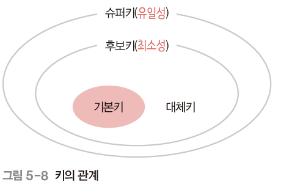

## Definition

- 데이터베이스 테이블에서 각 행을 고유하게 식별하거나 정렬하는 데 사용되는 필드
- 데이터의 무결성을 유지하고 데이터를 효율적으로 조작하는 데에 목적

## Types

- Uniqueness

  키로 하나의 튜플을 유일하게 식별할 수 있음

- Minimality

  꼭 필요한 필드로만 구성됨

### Primary Key

- 유일성과 최소성을 만족하는 키
- Null 값을 가질 수 없음
- 동일한 값이 중복될 수 없음

#### Natural Key

- 데이터의 본질적인 속성이나 의미를 나타내는 실제 데이터 값을 구성된 키
- 예를 들어 학생 테이블에서 학번이 자연키가 될 수 있음

#### Surrogate Key

- 데이터베이스에서 자동으로 생성되는 인위적인 식별자
- 비즈니스적 의미가 없기 때문에 데이터베이스 성능과 관리 측면에 유리함
- 자연키에 비해 데이터 변경에 덜 민감
- 예를 들어 Auto Incremental 하는 정수형 숫자나 GUID (Globally Unique Identifier)

### Candidate Key

- 기본키가 될 수 있는 후보들
- 유일성과 최소성을 만족해야 함

### Alternate Key

- 후보키가 두 개 이상일 경우 어느 하나를 기본키로 지정하고 남은 후보키들

### Super Key

- 유일성은 만족하지만 최소성은 갖추지 못한 키

### Foreign Key

- 다른 테이블의 기본키를 그대로 참조하여 설정

- 개체와의 관계를 설정하는 데 사용

  부모 테이블의 기본키를 참조하는 자식 테이블의 필드로서 외래키가 사용됨

- 참조 무결성 유지하는 데 사용

  부모 테이블에 존재하지 않는 값을 참조하는 오류 방지하여 데이터 무결성을 유지함

- 조인 작업하는 데 사용

### Composite Key

- 테이블에서 두 개 이상의 필드를 조합하여 고유한 식별자로 사용하는 키

- 단일 필드로 고유성을 보장하기 어려운 경우 사용

- 관계를 구성하는 데 사용

  두 개 이상의 테이블 간에 관계를 형성할 때 사용함

  예를 들어 학생 테이블과 강의 테이블이 있을 때, 학번과 강의 번호를 조합하여 복합키를 생성하여 두 테이블 간의 수강 관계를 구성할 수 있음

- 성능 향상을 위해 사용

  두 개 이상의 필드로 구성되어 단일 필드보다 더 많은 데이터를 고려하여 인덱스를 생성하기에 데이터 검색과 조인 작업에서 성능이 향상될 수 있음

## Considerations

- Uniqueness

  기본키로 선택되는 필드는 중복된 값을 허용하지 않아야 함

- Immutability

  기본키 값은 변경되지 않아야 하며, 튜플의 식별자로서 변하지 않아야 함

- Minimality

  최소한의 필드 조합으로 튜플의 고유성을 보장해야 함

- 논리적 의미

- Performance

  기본키는 인덱스로 사용되므로 인덱스 생성 및 데이터 검색하는 경우를 고려해야 함

- Natural Key vs. Surrogate Key

  데이터의 논리적 의미를 갖도록 하거나, 데이터의 안정성을 확보하거나 등의 선택을 해야 함

- Relational Design

  다른 테이블과의 관계를 맺을 때 외래키로 활용하므로 관계도 고려해야 함

## Key와 Index

- 인덱스는 테이블의 키 필드를 대상으로 생성
- 키 필드의 값들이 정렬
- 빠른 데이터 검색이 가능함
- 조인 작업의 성능을 향상 시킴