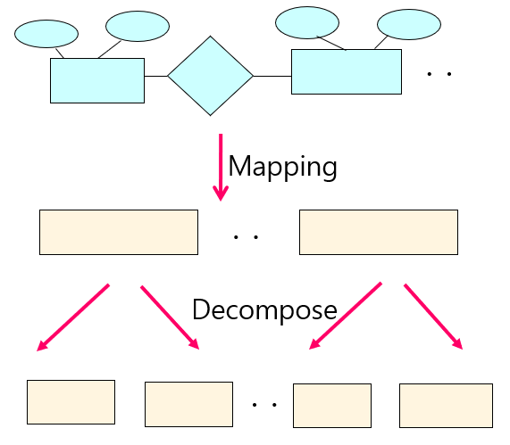
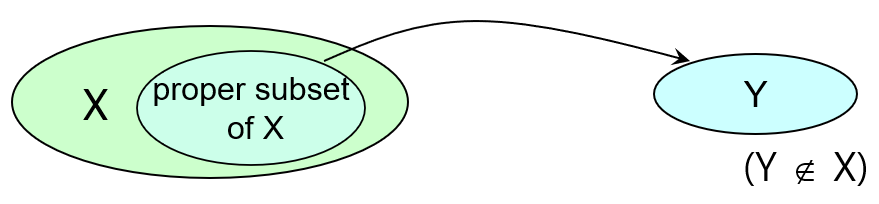
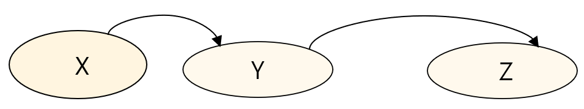

## Relational Design

### Process

1. ER Schema
2. Relational Schema
3. Normalized Relations
   - Redundancy와 Anomaly 제거

### Problems

"Bad" Relational Schema는 아래의 문제를 가짐

- Redundancy

  동일한 Information이 반복됨

- Insert Anomaly

  새로운 Information을 삽입할 수 없음

- Delete Anomaly

  의도치 않은 Information을 잃게 됨

- Update Anomaly

  많은 곳에서의 Information을 변경해야 함

#### Example

|  SSN  | Name | Age  | DNo  |  DName   | Budget |
| :---: | :--: | :--: | :--: | :------: | :----: |
| 11111 | abe  |  45  |  d1  | network  |  500k  |
| 22222 | eve  |  28  |  d3  | big data |  900k  |
| 33333 | jim  |  37  |  d2  | security |  700k  |
| 44444 | bob  |  35  |  d2  | security |  700k  |
| 55555 | paul |  25  |  d3  | big data |  900k  |
| 66666 | dick |  35  |  d2  | security |  700k  |
| 77777 | eva  |  60  |  d3  | big data |  900k  |
| 88888 | jane |  40  |  d2  | security |  700k  |

$PK=\{SSN\}$

- Redundancy?

  부서 정보가 해당 Department에 속한 Employee 수 만큼 중복 발생

- Insert Anomaly?

  새로운 부서를 만들고 Employee가 안 뽑힌 경우 PK에 null 값이 들어가기 때문에 삽입 불가

- Delete Anomaly?

  부서 정보만 지우고 싶지만 Employee 정보도 같이 삭제됨

- Update Anomaly?

  부서명을 바꾸려하면 해당 Department에 속한 Employee 수만큼 반복해야 함

## Base Notion

### Functional Dependency

- FD는 Relational Design의 "Goodness"를 평가하는 측정 지표로 사용

- FD $X \rightarrow Y$ in Relation $R$ 는 아래와 같이 정의됨

  For Any Tuple $t1$ and $t2$,

  If $t1[X]=t2[X]$ 성립한다면,

  Then $t1[Y]=t2[Y]$ 도 성립해야 함

- 즉, $X$의 값은 유일하게 (Functionally) $Y$ 값을 결정함

### Inference Rules

1. Reflexive

   If $Y \subseteq X$, then $X \rightarrow Y$

   - $\{name, age\} \rightarrow name$
   - $\{name, age\} \rightarrow age$

2. Augment

   If $X \rightarrow Y$, then $\{X,Z\} \rightarrow \{Y,Z\}$

   - If $ID \rightarrow age$, then $\{ID, name\} \rightarrow \{age, name\}$

3. Transitive

   If $X \rightarrow Y$ and $Y \rightarrow Z$, then $X \rightarrow Z$

   - If $ID \rightarrow name$ and $name \rightarrow age$, then $ID \rightarrow age$

4. Decompose

   If $X \rightarrow \{Y, Z\}$, then $X \rightarrow Y$ and $X \rightarrow Z$

   - If $ID \rightarrow \{name, age\}$, then $ID \rightarrow name$ and $ID \rightarrow age$

5. Union

   If $X \rightarrow Y$ and $X \rightarrow Z$, then $X \rightarrow \{Y, Z\}$

   - If $ID \rightarrow name$ and $ID \rightarrow age$, then $ID \rightarrow \{name, age\}$

#### Basic Rules

- IR4 (Decompose) 와 IR5 (Union) 은 IR1 (Reflexive), IR2 (Union), IR3 (Transitive) 에 의해 도출될 수 있음

- IR1, IR2, IR3 를 "Sound" and "Complete" 성질을 가졌다고 칭함

  - Sound

    성립하는 True FD만을 도출

  - Complete

    성립하는 True FD 모두를 도출

### Closure of FDs

- $F^+$ (Closure of Set of FDs $F$)

  $F$로 부터 추론할 수 있는 FDs를 포함하는 Set

#### Example

Given $F$, Closure Set을 구해라

$$
R=\{A,B,C,D,E,F\} \\
F: \\
1) \ A \rightarrow B \\
2) \ C \rightarrow D, E \\
3) \ \{A,C\} \rightarrow F
$$

1. $\{A\}^+ = \{A,B\}$
   - Start from $\{A\}^+=\{A\}$
   - By Rule 1, $\{A\}^+ = \{A,B\}$
2. $\{C\}^+=\{C,D,E\}$
   - Start from $\{C\}^+=\{C\}$
   - By Rule 2, $\{C\}^+=\{C,D,E\}$
3. $\{A,C\}^+=\{A,C,B,D,E,F\}$
   - Start from $\{A,C\}^+=\{A,C\}$
   - By Rule 1, $\{A,C\}^+=\{A,C,B\}$
   - By Rule 2, $\{A,C\}^+=\{A,C,B,D,E\}$
   - By Rule 3, $\{A,C\}^+=\{A,C,B,D,E,F\}$

### Key in terms of FDs

$R=\{A_1, A_2, ..., A_n\}$ and $X \subseteq R$ 라고 할 때 아래 두 조건을 만족하면 $X$를 Key라고 하며, 첫번째 조건인 Uniqueness만을 만족하면 $X$를 Super Key라고 함

1. Uniqueness

   $X \rightarrow \{A_1, A_2, ..., A_n\} = R \in F^+$

   즉, $\{X\}^+=R$

   즉, $X$가 $R$을 구성하는 모든 Attribute를 결정하는 경우

2. Minimality

   $Y \rightarrow \{A_1, A_2, ..., A_n\}=R=F^+$을 만족하는 $Y \subseteq X$인 $Y$가 존재하지 않음

   즉, $\{Y\}^+ \neq R$

   즉, $X$의 어떤 진부분집합도 Super Key가 아닌 경우

#### Example

FD $F$로 부터 Key를 구해라
$$
R=\{A,B,C,G,H,I\} \\
F: \\
1) \ A \rightarrow B \\
2) \ B \rightarrow C \\
3) \ \{C,G\} \rightarrow H \\
4) \ \{C,G\} \rightarrow I \\
5) \ B \rightarrow H
$$

1. $\{A, G\}$는 Super Key 인가?

   즉, $\{A,G\}^+=R$ 인가?

   - Start from $\{A,G\}^+=\{A,G\}$
   - By Rule 2 and Rule 1, $\{A,G\}^+=\{A,B,C,G\}$
   - By Rule 3, $\{A,G\}^+=\{A,B,C,G,H\}$
   - By Rule 4, $\{A,G\}^+=\{A,B,C,G,H,I\}$

   따라서 성립함

2. $\{A, G\}$의 진부분집합 중 Super Key가 있는가?

   - $\{A\}^+=\{A,B,C,H\}$이므로 $A \nrightarrow R$
   - $\{G\}^+=\{G\}$이므로 $G \nrightarrow R$

   따라서 성립함

두 조건을 모두 만족하므로, $\{A,G\}$는 Key

## Decomposition

### Example

- 문제가 있는 Relation

  |  SSN  | Name | Age  | DNO  |  DName   | Budget |
  | :---: | :--: | :--: | :--: | :------: | :----: |
  | 11111 | abe  |  45  |  d1  | network  |  500k  |
  | 22222 | eve  |  28  |  d3  | big data |  900k  |
  | 33333 | jim  |  37  |  d2  | security |  700k  |
  | 44444 | bob  |  35  |  d2  | security |  700k  |
  | 55555 | paul |  25  |  d3  | big data |  900k  |
  | 66666 | dick |  35  |  d2  | security |  700k  |
  | 77777 | eva  |  60  |  d3  | big data |  900k  |
  | 88888 | jane |  40  |  d2  | security |  700k  |

  $PK=\{SSN\}$

- Decomposed Relation 1
  |  SSN  | Name | Age  | DNo  |
  | :---: | :--: | :--: | :--: |
  | 11111 | abe  |  45  |  d1  |
  | 22222 | eve  |  28  |  d3  |
  | 33333 | jim  |  37  |  d2  |
  | 44444 | bob  |  35  |  d2  |
  | 55555 | paul |  25  |  d3  |
  | 66666 | dick |  35  |  d2  |
  | 77777 | eva  |  60  |  d3  |
  | 88888 | jane |  40  |  d2  |

  $PK=\{SSN\}$

- Decomposed Relation 2
  | DNo  |  DName   | Budget |
  | :--: | :------: | :----: |
  |  d1  | network  |  500k  |
  |  d3  | big data |  900k  |
  |  d2  | security |  700k  |
  |  d2  | security |  700k  |
  |  d3  | big data |  900k  |
  |  d2  | security |  700k  |
  |  d3  | big data |  900k  |
  |  d2  | security |  700k  |

  $PK=\{DNo\}$

기존에 발생하는 문제들이 해결됨

- No Redundancy

  부서 정보가 오직 한 번만 존재

- No Insert Anomaly

  새로운 부서 삽입 가능

- No Delete Anomaly

  부서 정보만 삭제 가능

- No Update Anomaly

  부서명 변경시 반복없이 가능

### Lossless Join

- 분해된 Relation로부터 원래 Relation $R$의 Information이 정확히 복구되어야 함
- Required

### Functional Dependency Preservation

- Relation $R$의 FD가 분해된 Relation에서 보존되어야 함

- Recommend

- FD 보존이 보장되지 않는다면, 분해된 Relation에 Update 혹은 Insert 할 경우 FD 위반을 검증해야 함

  이때 FD가 누락된 상태이므로 매번 여러 Relation Join해야 하므로 비용 발생

## Normalization

### Purpose

- 데이터의 중복을 없애면서 불필요한 데이터를 최소화
- 무결성을 지키고, Anomaly 현상을 방지
- 테이블 구성을 논리적 & 직관적으로
- 데이터베이스 구조를 확장에 용이하도록

### First Normal Form

아래 두 조건을 만족하면 Relation $R$은 1NF를 만족함

1. 각 Tuple은 PK에 의해 식별될 수 있어야 함
2. 각 Attribute는 Atomic Value를 가져야 함

#### Example

- Before

  | SSN  | Name | Age  |       Phones       |
  | :--: | :--: | :--: | :----------------: |
  | 100  | abe  |  57  | {1234, 2345, 3456} |
  | 200  | bob  |  27  |        4567        |
  | 300  | eve  |  45  |    {5678, 6789}    |

  $$
  PK=\{SSN\} \\
  F: \ SSN \rightarrow \{name, age\}
  $$

- After 1NF

  | SSN  | Name | Age  |
  | :--: | :--: | :--: |
  | 100  | abe  |  57  |
  | 200  | bob  |  27  |
  | 300  | eve  |  45  |
  
  $PK=\{SSN\}$
  
  | SSN  | Phone |
  | :--: | :---: |
  | 100  | 1234  |
  | 100  | 2345  |
  | 100  | 3456  |
  | 200  | 4567  |
  | 300  | 5678  |
  | 300  | 6789  |
  
  $PK=\{SSN, Phone\}$

### Second Normal Form

- Prime Attribute

  Key의 구성원인 경우

- Non-Prime Attribute

  Key의 구성원이 아닌 경우

- Partial Dependency (부분 종속)

  Given FD $X \rightarrow Y$,

  If $Y$가 $X$의 진부분집합에 Dependent한 FD가 존재한다면,

  Then $Y$는 $X$에 대해 Partial Dependent

  

아래 조건을 만족하면 Relation $R$은 2NF를 만족함

1. 어떠한 Non-Prime Attribute도 어느 Key에 대해 Partial Dependent 않아야 함

#### Example

- Before 2NF
  $$
  R=\{SSN, PNo, EName, PName, Location, Hours\} \\
  Key=\{SSN, PNo\} \\
  F: \\
  1) \ \{SSN,Pno\} \rightarrow Hours \\
  2) \ SSN \rightarrow EName \\
  3) \ PNo \rightarrow \{PName,Location\}
  $$

  - Non-Prime Attribute $EName$이 Key $\{SSN, PNo\}$에 대해 Partial Dependent 이므로 2NF 성립하지 않음
  - Non-Prime Attribute $\{PName, Location\}$이 Key $\{SSN, PNo\}$에 대해 Partial Dependent 이므로 2NF 성립하지 않음

- After 2NF
  $$
  R_1=\{SSN,PNo,Hours\} \\
  PK_1=\{SSN,PNo\} \\
  \\
  R_2=\{SSN,EName\} \\
  PK_2=\{SSN\} \\
  \\
  R_3=\{PNo,PName,Location\} \\
  PK_3=\{PNo\}
  $$

### Third Normal Form

- Transitive Dependent (이행 종속)

  Given FD $X \rightarrow Z$,

  If $X \rightarrow Y$ and $Y \rightarrow Z$을 만족하는 FD가 존재한다면,

  Then $Z$는 $X$에 대해 Transitive Dependent

  

아래 조건을 만족하면 Relation $R$은 3NF를 만족함

1. 어떠한 Non-Prime Attribute도 어느 Key에 대해 Transitive Dependent 않아야 함

#### Example

- Before 3NF
  $$
  R=\{SSN,EName,Age,DNo,DName\} \\
  Key=\{SSN\} \\
  F: \\
  1) \ SSN \rightarrow DNo \\
  2) \ DNo \rightarrow DName
  $$

  - Non-Prime Attribute $DName$이 Key $SSN$에 대해 Transitive Dependent 이므로 3NF 성립하지 않음

- After 3NF
  $$
  R_1=\{SSN,EName,Age,DNo\} \\
  PK_1=\{SSN\} \\
  \\
  R_2=\{DNo, DName\} \\
  PK_2=\{DNo\}
  $$

### Boyce-Codd Normal Form

아래 조건을 만족하면 Relation $R$은 BCNF를 만족함

1. 모든 FD $X \rightarrow A$에 대해 $X$가 Super Key이어야 함

#### Example

- Before BCNF
  $$
  R=\{Student,Course,Prof\} \\
  Key=\{\{Student,Course\}, \ \{Student,Prof\}\} \\
  F: \\
  1) \ \{Student,Course\} \rightarrow Prof \\
  2) \ Prof \rightarrow Course
  $$

  - Rule 2 $Prof \rightarrow Course$에서 $Prof$는 Super Key가 아니므로 BCNF 성립하지 않음

- After BCNF
  $$
  R_1=\{Student,Prof\} \\
  PK_1=\{Student,Prof\} \\
  \\
  R_2=\{Prof,Course\} \\
  PK_2=\{Prof\}
  $$

### Exercise

- Before
  $$
  R_{student}=\{ID,Course,Grade,Dept,College\} \\
  Key=\{ID,Course\} \\
  F: \\
  1) \ \{ID,Course\} \rightarrow Grade \\
  2) \ ID \rightarrow Dept \\
  3) \ Dept \rightarrow College
  $$

  - Non-Prime Attribute $Dept$가 Key인 $\{ID,Course\}$에 Partial Dependent 이므로 2NF 성립하지 않음

- After 2NF
  $$
  R_{enroll}=\{ID,Course,Grade\} \\
  Key_{enroll}=\{ID,Course\} \\
  F_{enroll}: \\
  1) \ \{ID,Course\} \rightarrow Grade \\
  \\
  R_{student}=\{ID,Dept,College\} \\
  Key_{student}=\{ID\} \\
  F_{student}: \\
  1) \ ID \rightarrow Dept \\
  2) \ Dept \rightarrow College
  $$

  - Non-Prime Attribute $College$가 Key인 $\{ID\}$에 Transitive Dependent 이므로 3NF 성립하지 않음

- After 3NF
  $$
  R_{enroll}=\{ID,Course,Grade\} \\
  Key_{enroll}=\{ID,Course\} \\
  F_{enroll}: \\
  1) \ \{ID,Course\} \rightarrow Grade \\
  \\
  R_{student}=\{ID,Dept\} \\
  Key_{student}=\{ID\} \\
  F_{student}: \\
  1) \ ID \rightarrow Dept \\
  \\
  R_{dept}=\{Dept,College\} \\
  Key_{dept}=\{Dept\} \\
  F_{dept}: \\
  1) \ Dept \rightarrow College
  $$

### Comparison

더 높은 정규화 수준일수록

- Less Redundancy
- Less Anomalies
- Lower Performance

주로 3NF vs BCNF 중 Trade-Off를 고려하게 됨

|           Problem            |       2NF       |      3NF       |     BCNF      |
| :--------------------------: | :-------------: | :------------: | :-----------: |
|    Eliminate Redundancy?     | Some Redundancy | May Redundancy | No Redundancy |
|  FD Preserve Decomposition?  |    Preserved    |   Preserved    | Not Preserved |
| Lossless Join Decomposition? |  Lossless Join  | Lossless Join  | Lossless Join |

## De-Normalization

- 의도적으로 Redundancy를 증가시키며 Relation들을 Composing하는 Process

### Advantages

- 성능 향상

  데이터를 하나의 컬렉션에 중복 저장하여 Join을 피하면 응답 시간이 단축될 수 있음

  정규화된 데이터베이스는 데이터를 검색할 때 여러 테이블을 조인해야 하므로 성능에 영향을 미침

- 복잡성 감소

  데이터 모델을 단순화할 수 있음

  정규화는 데이터를 여러 테이블로 나누므로 데이터베이스의 구조를 복잡하게 만들 수 있음

- 읽기 성능 향상

  NoSQL 데이터베이스는 읽기 중심 작업을 위해 데이터를 캐싱하는데 하나의 컬렉션 안에 데이터를 저장하면서 읽기 쿼리의 복잡성이 줄어들게 되고, 더 작은 I/O 작업이 수행되므로 캐시 메모리를 더 효과적으로 활용할 수 있게 됨

### Disadvantages

- 데이터 중복

  비정규화로 인해 데이터 중복이 발생

  이로 인해 더 많은 저장 공간을 차지하고, 데이터 일관성 유지에 어려움을 겪게 됨

- 쓰기 성능 저하

  일부 엔티티를 업데이트할 때 다수의 Document나 Record를 동시에 업데이트해야 함

  이는 쓰기 작업의 복잡성을 증가시키고, 동시성 제어 문제를 야기할 수 있음

- 데이터 불일치 가능성

  중복된 데이터가 여러 곳에 저장되므로 데이터를 갱신하는 과정에서 일관성을 유지하지 못할 가능성이 존재함

- 용량 증가

  중복된 데이터로 인해 데이터베이스의 용량이 증가할 수 있음

- 스키마 변경의 어려움

  스키마 변경은 중복된 데이터의 모든 인스턴스에 적용되어야 하기 때문에 비정규화된 데이터의 구조를 변경하는 것은 어려움
