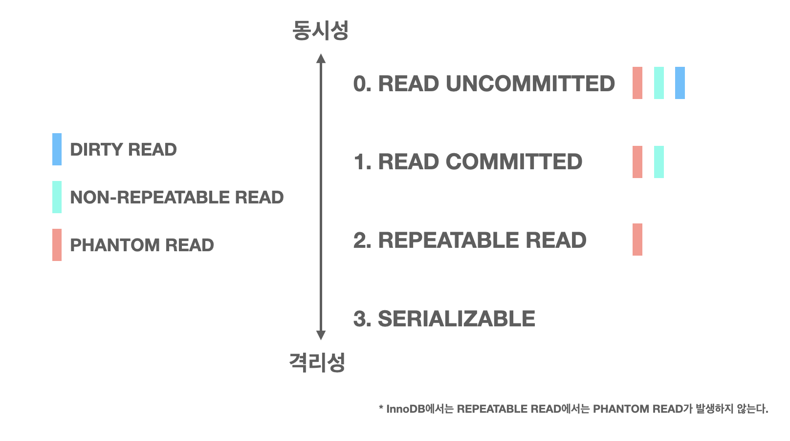
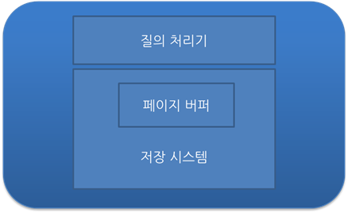

## Definition

- 데이터베이스에 접근하는 방법은 쿼리

  ```
  - SELECT
  - INSERT
  - DELETE
  - UPDATE
  ```

- 트랜잭션은 여러 개의 쿼리들을 하나로 묶는 단위

  즉, 데이터베이스에서 하나의 논리적 기능을 수행하기 위한 작업 단위

  ```
  ex) 사용자 A가 사용자 B에게 1만원을 송금
  
  수행되어야 하는 DB 작업
  1. 사용자 A의 계좌에서 1만원을 차감 (UPDATE 쿼리)
  2. 사용자 B의 계좌에서 1만원을 추가 (UPDATE 쿼리)
  
  현재 작업 단위: 출금 UPDATE 쿼리 + 입금 UPDATE 쿼리
  - 이를 통틀어서 하나의 트랜잭션이라 칭함
  - 두 쿼리문 모두 성공적으로 완료되어야만 하나의 작업이 완료되는 것 (Commit)
  - 쿼리 중 하나라도 실패하면 모든 쿼리문을 취소하고 이전 상태로 돌려놓아야 함 (Rollback)
  ```


## Property

- ACID 특징을 가짐

### Atomicity

- 트랜잭션과 관련된 일이 모두 수행되었거나 되지 않았거나를 보장

- Commit

  여러 쿼리가 성공적으로 처리되었다고 확정하는 명령어

- Rollback

  에러나 여러 이슈 때문에 트랜잭션으로 처리한 하나의 묶음 과정을 일어나기 전으로 돌리는 명령어

### Consistency

- "허용된 방식"으로만 데이터를 변경해야 함

### Isolation

- 트랜잭션 수행 시 서로 끼어들지 못해야 함
- 복수의 병렬 트랜잭션은 서로 격리되어 마치 순차적으로 실행되는 것처럼 작동해야 함
- 또한 데이터베이스는 여러 사용자가 같은 데이터에 접근할 수 있어야 함

### Durability

- 성공적으로 수행된 트랜잭션은 영원히 반영되어야 함
- 즉, 데이터베이스에 시스템 장애가 발생해도 원래 상태로 복구하는 회복 기능이 있어야 함


## Isolation Level

- 트랜잭션에서 일관성 없는 데이터를 허용하도록 하는 수준
- 동시성과 데이터 무결성에 직접적인 연관을 가짐

### Needs

- 데이터베이스는 ACID 특징과 같이 트랜잭션의 독립적인 수행을 필요로 함
- Locking을 통해 트랜잭션이 DB에 접근하는 동안 타 트랜잭션이 관여하지 못하도록 막아야 함
- 이 정도에 따라 성능에도 영향을 미치기 때문에 효율적인 방법이 필요함

### Problems

- Dirty Read

  한 트랜잭션이 실행 중일 때 다른 트랜잭션에 의해 수정되었지만 아직 Commit 되지 않은 행의 데이터를 읽을 수 있는 경우

- Non-Repeatable Read

  한 트랜잭션 내의 같은 행에 두 번 이상 조회가 발생했는데 그 값이 다른 경우

- Phantom Read

  한 트랜잭션 내에서 동일한 쿼리를 보냈을 때 해당 조회 결과가 다른 경우

### Levels



0. Read Uncommitted
   - SELECT 쿼리가 수행되는 동안 해당 데이터에 Shared Lock이 걸리지 않는 Level
   - 트랜잭션 처리 중이거나 아직 Commit 되지 않은 데이터를 다른 트랜잭션이 읽는 것을 허용
   - 데이터베이스의 일관성을 유지하는 것이 불가능
   - 거대한 양의 데이터를 "어림잡아" 집계하는 데에 활용 가능
1. Read Committed
   - SELECT 쿼리가 수행되는 동안 해당 데이터에 Shared Lock이 걸리는 Level
   - Commit 완료 된 데이터에 대해서만 조회를 허용
   - 하지만 한 트랜잭션이 접근한 행을 다른 트랜잭션이 수정할 수 있음
   - 대부분의 SQL 서버가 기본값으로 사용하는 Level
2. Repeatable Read
   - SELECT 쿼리가 사용하는 모든 데이터에 트랜잭션이 완료될 때까지 Shared Lock이 걸리는 Level
   - 트랜잭션이 범위 내에서 조회한 데이터 내용이 항상 동일함을 보장
   - 다른 사용자는 트랜잭션 영역에 해당되는 데이터에 대한 수정이 불가능
   - 그러나 새로운 행을 추가하는 것은 막지 않음
3. Serializable
   - 완벽한 읽기 일관성 수준을 제공
   - 다른 사용자는 트랜잭션 영역에 해당되는 데이터에 대한 수정 및 추가 불가능
   - 교착 상태가 발생할 확률이 높고 가장 성능이 떨어짐

### Comparison

| Isolation Level  | Lost Updates | Dirty Reads | Non-Repeatable Reads | Phantom Reads |
| :--------------: | :----------: | :---------: | :------------------: | :-----------: |
| Read Uncommitted | Don't Occur  |  May Occur  |      May Occur       |   May Occur   |
|  Read Committed  | Don't Occur  | Don't Occur |      May Occur       |   May Occur   |
| Repeatable Read  | Don't Occur  | Don't Occur |     Don't Occur      |   May Occur   |
|   Serializable   | Don't Occur  | Don't Occur |     Don't Occur      |  Don't Occur  |


## Managing on DBMS

### Structure



- 디스크에 데이터를 저장하며, 전체 데이터베이스의 일부분을 메인 메모리에 유지
- 데이터를 디스크에 읽거나 쓸 때에 고정된 길이의 Page로 입출력이 이루어짐
- 메인 메모리에 유지하는 Page들을 관리하는 모듈을 Page Buffer Manager라고 칭함
- 버퍼 관리 정책에 따라 트랜잭션 관리에 매우 중요한 결정을 가져오게 됨

### UNDO

- 작업 수행 중에 수정된 Page들이 버퍼 관리자의 버퍼 교체 알고리즘에 따라서 디스크에 출력될 수 있음
- 버퍼 교체는 전적으로 버퍼의 상태에 따라서 결정되며, 일관성 관점에서 봤을 때는 임의의 방식으로 일어남
- 즉, 아직 완료되지 않은 트랜잭션이 수정한 Page들도 디스크에 출력될 수 있음
- 해당 트랜잭션이 어떤 이유든 정상적으로 종료될 수 없게 되면 변경된 Page들을 원상 복구되어야 함
- 이러한 복구를 UNDO라고 함

### REDO

- Commit 완료된 트랜잭션의 수정은 어떤 경우에도 유지되어야 함
- 이미 Commit한 트랜잭션의 수정을 재반영하는 복구 작업을 REDO라고 함

