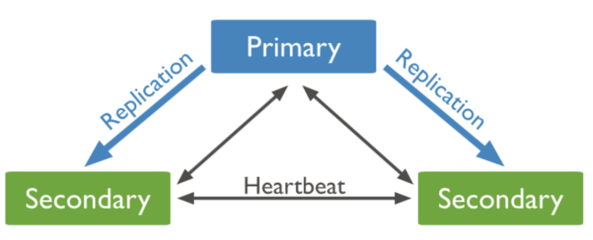
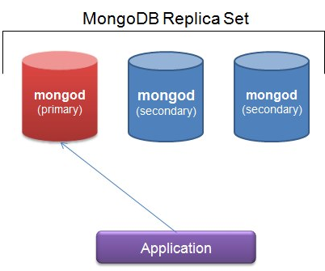
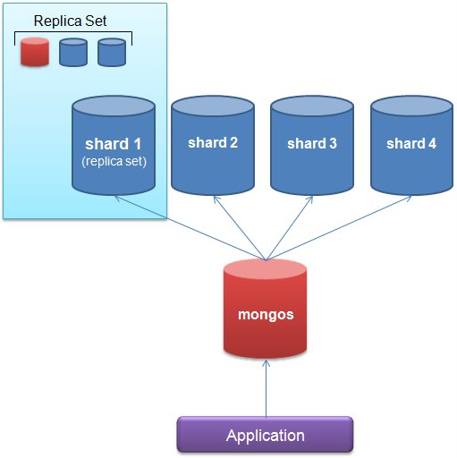
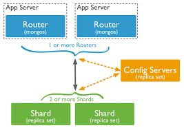
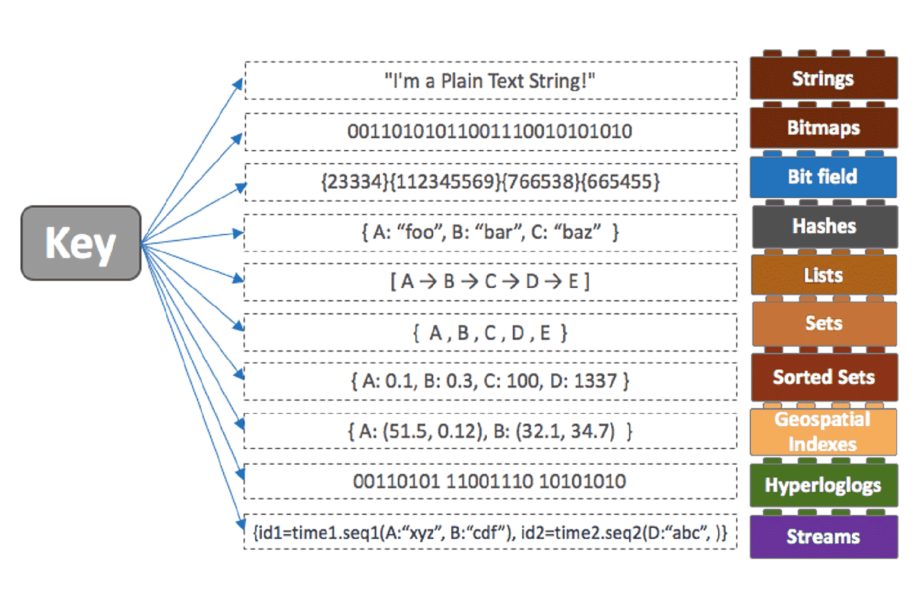

## RDB

- 관계형 데이터베이스

- 행 & 열 구조의 표 형식 데이터를 저장하는 형태

  정해진 Schema를 따라야 함

-  Relationship을 통해 데이터를 여러 테이블에 분산

  Join SQL 적극적 활용

- MySQL, PostreSQL, 오라클 등

## NoSQL

- NoSQL은 Not only SQL 또는 Non-Relational 의미

- 대량의 분산된 데이터를 저장하고 조회하는 데 특화
- 스키마 없이 사용 가능하거나 느슨한 스키마를 제공
- 사용자 트래픽에 따라 수평적 확장이 손쉬움

- MongoDB, Redis, Neo4j 등

### CAP 이론

분산 데이터베이스 속성에 관한 이론, "적절한 응답 시간 내 세 가지 속성을 모두 만족시키는 분산 시스템을 구성할 수 없다"

1. Consistency (일관성)

   다중 클라이언트에서 같은 시간에 조회하는 데이터는 항상 동일한 데이터임을 보증하는 것

   RDB에서 지원하는 가장 기본적인 기능이지만 NoSQL의 경우 데이터의 일관성이 느슨하게 처리 (데이터의 변경을 시간의 흐름에 따라 여러 노드에 전파) 됨

   - 데이터의 저장 결과를 클라이언트로 응답하기 전에 모든 노드에 데이터를 저장하는 동기식 방법

     느린 응답시간, 높은 데이터 정합성

   - 특정 이벤트 또는 프로세스를 이용하여 다른 노드의 데이터를 동기화하는 비동기식 방법

     빠른 응답시간, 쓰기 노드에 장애가 생길 경우 데이터가 손실될 위험이 있음

2. Availability (가용성)

   모든 클라이언트의 읽기와 쓰기 요청, 심지어는 실패한 작업에 대하여 항상 응답이 가능함을 보증하는 것

   NoSQL의 경우 클러스터 내에서 몇 개의 노드가 망가지더라도 정상적인 서비스가 가능

   이때 사용하는 기법이 Replication (데이터 복제) 인데, 동일한 데이터를 다중 노드에 중복 저장하여 일부 노드가 고장나도 데이터가 유실되지 않도록 함

   - Master-Slave 복제 방법
   - Peer-to-Peer 복제 방법

3. Partition Tolerance (분할 허용성)

   한 노드가 다른 노드와 통신할 수 없을 때 시스템이 여전히 작동함을 보증하는 것

- MongoDB를 통해 CP 시스템 이해

  

  - 각 Primary 노드는 로그를 이용해 비동기적으로 업데이트되는 Replication Secondary 노드를 가짐
  - 각 노드는 다른 모든 노드와 통신하며 서로의 상태를 확인하며, 몇 초동안 응답을 받지 못하면 해당 노드는 접근 불가 상태로 지정됨
  - Primary 노드가 중단되었다면 Secondary 노드 중 하나가 승격되어야 하는데, 그 동안 시스템의 모든 쓰기 작업은 잠시 사용 불가능한 상태가 됨

### 확장성

- 변화무쌍한 작업 부하에 대한 요구 사항을 효율적으로 충족시키는 능력

- 필요에 따라 서버를 추가하는 동적인 스케일 아웃 가능

  NoSQL은 애초에 클러스터 하나에서 서버 여러개를 이용하도록 설계됨

### 유연성

- 엄격한 테이블 구조의 제약을 받지 않음

  비정형, 반정형 데이터를 쉽게 처리 가능

- RDB 해결 가능한 문제의 범위 내에서는 유연한 편

### 효율적인 쿼리

- 적절한 인덱싱

  NoSQL은 RDB처럼 자동으로 모든 필드에 대해 인덱스를 생성해주지 않으므로 수동으로 정의하여 설정해야 함

- 데이터 Partitioning

  대용량 데이터베이스에서는 데이터를 파티션으로 나누어 여러 노드에 분산 저장하는 것이 중요

  확장성 향상 및 병렬 처리로 인한 빠른 쿼리 처리 가능

- 분산 쿼리 처리

  데이터베이스는 여러 노드에서 병렬로 쿼리를 처리하여 시스템 성능 향상 가능

- 캐싱

- 데이터 모델링

### 데이터 모델링

#### Denormalization (비정규화)

비정규화는 "데이터 중복 허용"이라 할 수 있음

어떻게 질의할 것이냐가 아닌 어떻게 응답할 것인가, 어떤 데이터를 줄 것인가에 중점을 두기 때문에 비정규화를 통해 데이터를 모델링

- 쿼리 데이터 사이즈 vs 전체 데이터 사이즈

  비정규화시 모든 데이터를 한 곳에 모아놓고 쿼리를 수행

  쿼리 수행을 위한 I/O가 줄어 성능을 향상시킬 수 있지만, 중복이 허용되므로 전체 데이터 사이즈는 증가

- 쿼리 수행 복잡도 vs 전체 데이터 사이즈

  비정규화를 하면 필요한 데이터들을 한 곳에 쿼리 친화적인 구조로 쌓을 수 있음

  전반적인 쿼리 프로세싱이 단순화되고 실행 시간도 단축 가능

  데이터가 다른 Document, Collection에 중복되어 저장되기 때문에 전체 데이터 사이즈는 필연적으로 증가

#### Aggregates

유연한 스키마 속성으로 인해, 다양한 구조의 요소를 포함한 데이터 구성 가능

예를 들어 List 구조의 데이터가 있을 때, 한 List 속성 안에 또 다른 List를 중첩하여 구성할 수 있음

- Join 연산 감소

  1:N 관계를 최소화하여 Join 연산을 줄일 수 있음

  수행 시간 단축과 저렴한 비용의 대용량 데이터 지원 가능

- 복잡하고 다양한 비즈니스 요소 반영

#### Application Side Join

필요하다면 애플리케이션 상에서 Join을 사용할 수 있음

- N:M 관계

  기본적인 1:N 관계라면 필요없지만 다대다 관계의 경우 참조를 사용하기 때문에 애플리케이션 상에서 Join이 필요

- Join 대상 데이터의 수시 변동

  모델링 단계에서 비정규화와 Aggregation을 통해 데이터 중복을 여러 군데에서 이미 허용

  이후 데이터 변경 시, 전부 찾아서 업데이트해야 함

  많은 비용 발생을 방지하여 변경이 잦은 데이터를 따로 추려 애플리케이션 상에서 Join이 필요

### 트랜잭션

NoSQL 데이터베이스의 트랜잭션 처리 방식은 전통적인 것과 다소 다름

ACID 속성 대신 BASE 모델을 채택하여 데이터 일관성과 내구성에 대한 Trade-Off를 고려하여 설계

#### ACID Model

1. Atomicity (원자성)

   트랜잭션은 모두 성공하거나 모두 실패해야 함

   트랜잭션 중간에 어떠한 문제가 발생하면 이전 상태로 롤백되어야 함

2. Consistency (일관성)

   트랜잭션이 실행되기 전과 후의 데이터베이스 상태는 항상 일관성을 유지해야 함

3. Isolation (고립성)

   여러 트랜잭션이 동시에 실행될 때 각 트랜잭션은 서로 영향을 미치지 않고 독립적으로 실행되어야 함

4. Durability (지속성)

   트랜잭션이 성공적으로 완료된 후에는 영구적으로 데이터가 보존되어야 함

#### BASE Model

1. Basically Available (기본 가용성)

   시스템이 항상 가용성을 유지하려는 성질

   시스템 장애 또는 파티션 분리 상황에서도 데이터베이스가 응답을 계속 제공해야 함

2. Soft State (소프트 상태)

   데이터 일관성을 즉시 보장하지는 않음

   변경된 데이터는 일정 시간 내에 동기화되지 않을 수 있으나 시간이 지남에 따라 데이터는 최종적으로 일광성을 유지

3. Eventual Consistency (최종 일관성)

   시스템의 모든 노드 간에 데이터의 복제와 동기화를 보장하지 않음

   시간이 지남에 따라 시스템은 모든 노드에서 동일한 데이터 상태를 가지게 됨

### MongoDB

- Document Model

  Binary JSON 형태로 데이터 저장

- Document ID에 대한 인덱스를 사용하여 O(1) 시간으로 조회 가능

- 하나의 Collection에 다양한 구조의 Document를 추가하는 체계

#### Replica Set

여러 개의 동일한 데이터베이스를 만들어서 데이터를 백업해두는 방식

Read 요청의 경우 메인 서버가 아닌 복제된 서버에 하도록하여 메인 서버의 부하를 낮출 수 있음

- Arbiter

  각 인스턴스 상태를 지속적으로 확인하고 Primary Server를 선출하는 역할

  직접적으로 데이터 저장 기능을 가지지 않음

- Primary (Master)

  데이터 기록 권한을 가진 서버

- Secondary (Slave)

  복제된 서버로 장애 발생 시 Primary Server로 역할 전환 가능

  N개 존재할 수 있음

  쓰기 요청은 수행할 수 없지만 읽기 작업은 가능

#### Shard

데이터를 여러 서버에 분산해서 저장하고 처리할 수 있도록 함

MongoDB에서 샤딩을 적용하기 위해서는 샤드 클러스터를 구축해야함

- Mongos

  라우터 역할을 하는 서버로, Config Server를 이용하여 애플리케이션이 MongoDB에 접근할 수 있도록 함

  쿼리 수행에 있어서 Proxy 역할을 하여 요청을 어떤 샤드로 전달할지 저장하고 각 샤드로부터 받은 쿼리 결과 데이터를 병합해서 사용자에게 돌려주는 역할

  별도의 데이터를 가지지 않음

- Shard

  데이터 저장 서버의 집합으로 Replica Set이 될 수 있음

- Config

  클러스터에 대한 메타데이터 및 구성 설정을 저장하는 서버

  파티션된 데이터의 위치와 샤드 위치를 저장 및 조회

### Redis (Remote Dictionary Server)

- Key-Value Model

- In-Memory 데이터베이스

- 복잡한 조회 연산 지원 X, 고속 읽기/쓰기에 최적화

- 하나의 서비스 요청에 다수의 데이터 조회/수정 연산이 발생하면 트랜잭션 처리가 불가능하여 데이터 정합성 보장 X

- ex) 사용자의 프로필 정보, 장바구니 정보, URL 단축 정보 저장 등

- 메시지 브로커로써도 활용

  메시지를 클라이언트에게 전달한 후 바로 삭제하는 Pub/Sub 기능

### Neo4j

- Graph Model

- 데이터 관계를 그래프 형태로 저장 및 처리

  Node와 Edge를 사용하여, 복잡한 관계를 쿼리하고 분석하는 데 유용

## RDB vs NoSQL 의사결정

- 유연성과 확장성의 요구

  NoSQL 데이터베이스는 다양한 데이터 모델과 수평적 확장을 지원하므로, 대량의 데이터나 변동이 심한 환경에서 유용

- 데이터 스키마의 불확실성

  데이터의 형식이나 구조가 자주 변경되는 경우, NoSQL의 느슨한 스키마가 유용

- 읽기/쓰기 중심의 애플리케이션

  NoSQL은 특히 읽기/쓰기 중심의 애플리케이션에 적합

- 클라우드 환경과 분산 시스템

- 향후 사용자 트래픽에 따른 서버의 확장이 예상되는가

