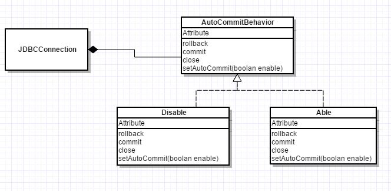

## State

### Intent

이 패턴은 객체의 내부 상태가 변화로 인해 동작 방식이 변해야할 때 사용한다.

### Problem

State 패턴은 **Finite-State Machine** 컨셉과 관련이 깊다.

![Finite-State Machine[^1]](images/state-problem1.png)

주요 아이디어는 어느 한 시점에서 프로그램이 처할 수 있는 상태의 종류가 한정되어 있으며, 각각의 상태에서는 서로 다르게 동작하고 다른 상태로 변할 수 있다는 점이다. 여기서 다른 상태로 넘어가는 과정을 **Transition**이라고 하며, 이는 사전에 정의되어 있다.

![Example Problem[^1]](images/state-problem2-en.png)

이 컨셉을 Draft, Moderation, Published 상태가 있는 글쓰기에 빗대어 보자. 각 상태에 맞게 동작하려면 `publish()`라는 메서드는 각종 if문이나 switch문이 남발할 것이다. 이렇게 되면 각 상태에 취해야 하는 동작들이 외부에 노출되며, 상태의 종류가 늘어나면 코드 관리가 어려워진다.

### Solution Structure

![Example Solution[^1]](images/state-solution-en.png)

State 패턴은 가능한 상태의 객체들을 별도의 클래스로 생성하고 그에 관한 동작들을 생성한 클래스 안에서 취하도록 만든다.

![Solution Structure[^1]](images/state-structure-en.png)

1. `Context`는 `Concrete State`를 참조할 수 있어야 하며, 각 상태에 따른 동작을 위임한다. 이때에는 `State` 인터페이스를 통해 소통한다.
2. `State` 인터페이스는 상태에 따른 행동을 취하는 메서드를 정의한다.
3. `Concrete State`들은 각 동작들의 세부 구현 로직이 담겨있다. 더불어 `Context` 객체에 대한 역참조 필드를 갖고 있어서 필요한 정보를 가져올 수 있다.

### Code Example - [Go](https://github.com/joonparkhere/records/tree/main/design-pattern/project/hello-behavioral-pattern/state)

자판기에서 물건을 뽑아내는 과정에 State 패턴을 적용한 예제이다.

```go
type state interface {
	AddItem(int) error
	RequestItem() error
	InsertMoney(int) error
	DispenseItem() error
}
```

```go
type VendingMachine struct {
	noItem   state
	hasItem  state
	itemReq  state
	hasMoney state

	curState state

	itemCnt   int
	itemPrice int
}

func NewVendingMachine(itemCnt, itemPrice int) *VendingMachine {
	machine := &VendingMachine{
		itemCnt:   itemCnt,
		itemPrice: itemPrice,
	}

	machine.noItem = NewNoItemState(machine)
	machine.hasItem = NewHasItemState(machine)
	machine.itemReq = NewItemRequestState(machine)
	machine.hasMoney = NewHasMoneyState(machine)

	machine.SetState(machine.hasItem)
	return machine
}

func (m *VendingMachine) SetState(s state) {
	m.curState = s
}

func (m *VendingMachine) RequestItem() error {
	return m.curState.RequestItem()
}

func (m *VendingMachine) AddItem(count int) error {
	return m.curState.AddItem(count)
}

func (m *VendingMachine) InsertMoney(money int) error {
	return m.curState.InsertMoney(money)
}

func (m *VendingMachine) DispenseItem() error {
	return m.curState.DispenseItem()
}

func (m *VendingMachine) IncrementItemCount(count int) {
	m.itemCnt += count
	fmt.Printf("Adding %d items\n", count)
}
```

아래는 자판기가 처할 수 있는 상태들이다.

```go
type NoItemState struct {
	machine *VendingMachine
}

func NewNoItemState(m *VendingMachine) *NoItemState {
	return &NoItemState{
		machine: m,
	}
}

func (s *NoItemState) RequestItem() error {
	return fmt.Errorf("Item out of stock")
}

func (s *NoItemState) AddItem(count int) error {
	s.machine.IncrementItemCount(count)
	s.machine.SetState(s.machine.hasItem)
	return nil
}

func (s *NoItemState) InsertMoney(money int) error {
	return fmt.Errorf("Item out of stock")
}

func (s *NoItemState) DispenseItem() error {
	return fmt.Errorf("Item out of stock")
}
```

```go
type HasItemState struct {
	machine *VendingMachine
}

func NewHasItemState(m *VendingMachine) *HasItemState {
	return &HasItemState{
		machine: m,
	}
}

func (s *HasItemState) RequestItem() error {
	if s.machine.itemCnt == 0 {
		s.machine.SetState(s.machine.noItem)
		return fmt.Errorf("No item present")
	}

	fmt.Println("Item requested")
	s.machine.SetState(s.machine.itemReq)
	return nil
}

func (s *HasItemState) AddItem(count int) error {
	fmt.Printf("%d items addes\n", count)
	s.machine.IncrementItemCount(count)
	return nil
}

func (s *HasItemState) InsertMoney(money int) error {
	return fmt.Errorf("Please select item first")
}

func (s *HasItemState) DispenseItem() error {
	return fmt.Errorf("Please select item first")
}
```

```go
type ItemRequestState struct {
	machine *VendingMachine
}

func NewItemRequestState(m *VendingMachine) *ItemRequestState {
	return &ItemRequestState{
		machine: m,
	}
}

func (s *ItemRequestState) RequestItem() error {
	return fmt.Errorf("Item already requested")
}

func (s *ItemRequestState) AddItem(count int) error {
	return fmt.Errorf("Item dispense in progress")
}

func (s *ItemRequestState) InsertMoney(money int) error {
	if money < s.machine.itemPrice {
		return fmt.Errorf("Inserted money is less. Please insert %d", s.machine.itemPrice)
	}

	fmt.Println("Money entered is ok")
	s.machine.SetState(s.machine.hasMoney)
	return nil
}

func (s *ItemRequestState) DispenseItem() error {
	return fmt.Errorf("Please insert money first")
}
```

```go
type HasMoneyState struct {
	machine *VendingMachine
}

func NewHasMoneyState(m *VendingMachine) *HasMoneyState {
	return &HasMoneyState{
		machine: m,
	}
}

func (s *HasMoneyState) RequestItem() error {
	return fmt.Errorf("Item dispense in progress")
}

func (s *HasMoneyState) AddItem(count int) error {
	return fmt.Errorf("Item dispense in progress")
}

func (s *HasMoneyState) InsertMoney(money int) error {
	return fmt.Errorf("Money already entered")
}

func (s *HasMoneyState) DispenseItem() error {
	fmt.Println("Dispensing item")
	s.machine.itemCnt -= 1

	if s.machine.itemCnt == 0 {
		s.machine.SetState(s.machine.noItem)
	} else {
		s.machine.SetState(s.machine.hasItem)
	}
	return nil
}
```

다음은 테스트 케이스다.

```go
func TestAfter(t *testing.T) {
	machine := NewVendingMachine(1, 10)

	if err := machine.RequestItem(); err != nil {
		log.Fatalf(err.Error())
	}

	if err := machine.InsertMoney(10); err != nil {
		log.Fatalf(err.Error())
	}

	if err := machine.DispenseItem(); err != nil {
		log.Fatalf(err.Error())
	}

	fmt.Println()

	if err := machine.RequestItem(); err != nil {
		log.Fatalf(err.Error())
	}

	if err := machine.InsertMoney(10); err != nil {
		log.Fatalf(err.Error())
	}

	if err := machine.DispenseItem(); err != nil {
		log.Fatalf(err.Error())
	}
}
```

### Real Example

JDBC API의 Connection 객체는 트랜잭션의 `commit()`와 `rollback()` 메서드를 제공한다. 해당 객체에는 `setAutoCommit()` 메서드가 있는데 기본값이 `true`로, 각 쿼리당 자동 Begin ~ Commit이 일어난다.



```java
public class JdbcConnection extends TraceObject implements Connection, JdbcConnectionBackwardsCompat, CastDataProvider {
    @Override
    public synchronized void setAutoCommit(boolean autoCommit) throws SQLException {
        try {
            checkClosed();
            synchronized (session) {
                /* ... */
                session.setAutoCommit(autoCommit);
            }
        } catch (Exception e) { /* .. */ }
    }
    
    @Override
    public synchronized void commit() throws SQLException {
        try {
            checkClosedForWrite();
            if (SysProperties.FORCE_AUTOCOMMIT_OFF_ON_COMMIT && getAutoCommit()) {
                throw DbException.get(ErrorCode.METHOD_DISABLED_ON_AUTOCOMMIT_TRUE, "commit()");
            }
            commit = prepareCommand("COMMIT", commit);
            commit.executeUpdate(null);
        } catch (Exception e) { /* ... */ }
    }
    
    @Override
    public synchronized void rollback() throws SQLException {
        try {
            checkClosedForWrite();
            if (SysProperties.FORCE_AUTOCOMMIT_OFF_ON_COMMIT && getAutoCommit()) {
                throw DbException.get(ErrorCode.METHOD_DISABLED_ON_AUTOCOMMIT_TRUE, "rollback()");
            }
            rollbackInternal();
        } catch (Exception e) { /* ... */ }
    }
}
```

### Note

- 객체가 처한 각 상태에 따라 다르게 행동할 때 사용
- 객체가 처할 수 있는 상태의 종류가 다양하며, 코드가 자주 변할 수 있을 때 사용

> 몇 종류의 상태가 없는데 이 패턴을 적용하는 것은 과한 조치일 수 있다.

[^1]: [State Origin](https://refactoring.guru/design-patterns/state)