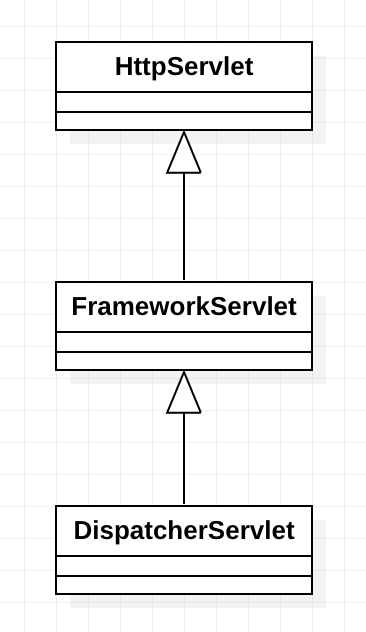

## Template Method

### Intent

이 패턴은 Super-Class에서 알고리즘의 스켈레톤 코드를 정의해서 구조를 짜고, Sub-Class에서는 구조를 유지하며 세부 사항을 Override하는 방법이다.

### Problem

![Example Problem[^1]](images/template-problem.png)

데이터 마이닝을 하는 서비스가 있다. 여러 파일을 받아들여서 결과 리포트를 추출하는 과정인데, 각 파일마다 어느 정도 공통된 과정을 거치며, 중복된 과정도 존재한다.

### Solution Structure

Template Method 패턴은 일련의 알고리즘을 세부 과정의 연속으로 나누어 구조를 잡아주고, 그 과정들을 호출하는 `template method`가 존재한다. 각 과정들은 `abstract` 메서드일 수 있고, 혹은 `default` 메서드일 수도 있다. 더불어 주어진 틀 이외에 해야하는 작업이 있다면 `hook`이라고 하는 추가 스텝을 정의할 수 있다.

![Example Solution[^1]](images/template-solution-en.png)

예제 문제 사항을 위처럼 구조를 짤 수 있다. `mine()` 메서드가 Template Method 역할을 수행한다. 해당 메서드가 내부 일련의 과정들을 호출한다. 더불어 `analyzeData()`와 `sendReport()` 메서드는 동일한 로직이기 때문에 `abstract` 메서드가 아닌 `default` 메서드이다.

![Solution Structure[^1]](images/template-structure.png)

1. `AbstractClass`는 Template Method와 각 단계별 메서드들을 정의한다.
2. `ConcreteClass`들은 Template Method를 제외한 다른 메서드들을 Override해서 세부 구현 로직에 맞게 수정한다.

### Code Example - [Go](https://github.com/joonparkhere/records/tree/main/design-pattern/project/hello-behavioral-pattern/template)

SMS와 Email 방식의 OTP를 간단히 관리하는 예제이다.

```go
type iOTP interface {
	GenRandomOTP(int) string
	SaveOTPCache(string)
	GetMessage(string) string
	SendNotification(string) error
	PublishMetric()
}

type OTP struct {
	otp iOTP
}

func NewOTP(o iOTP) *OTP {
	return &OTP{
		otp: o,
	}
}

func (o *OTP) GenAndSendOTP(limit int) error {
	code := o.otp.GenRandomOTP(limit)
	o.otp.SaveOTPCache(code)

	message := o.otp.GetMessage(code)
	if err := o.otp.SendNotification(message); err != nil {
		return err
	}

	o.otp.PublishMetric()
	return nil
}
```

```go
type sms struct {
}

func NewSMS() *sms {
	return &sms{}
}

func (s *sms) GenRandomOTP(limit int) string {
	code := rand.Intn(limit)
	fmt.Printf("SMS: generating random code %d\n", code)
	return strconv.Itoa(code)
}

func (s *sms) SaveOTPCache(code string) {
	fmt.Printf("SMS: saving code %s to cache\n", code)
}

func (s *sms) GetMessage(code string) string {
	return "SMS Code for login is " + code
}

func (s *sms) SendNotification(message string) error {
	fmt.Printf("SMS: sending sms %s\n", message)
	return nil
}

func (s *sms) PublishMetric() {
	fmt.Println("SMS: publishing metrics")
}
```

```go
type email struct {
}

func NewEmail() *email {
	return &email{}
}

func (e *email) GenRandomOTP(limit int) string {
	code := rand.Intn(limit)
	fmt.Printf("Email: generating random code %d\n", code)
	return strconv.Itoa(code)
}

func (e *email) SaveOTPCache(code string) {
	fmt.Printf("Eamil: saving code %s to cacahe\n", code)
}

func (e *email) GetMessage(code string) string {
	return "Email code for login is " + code
}

func (e *email) SendNotification(message string) error {
	fmt.Printf("Email: sending email %s\n", message)
	return nil
}

func (e *email) PublishMetric() {
	fmt.Println("Email: publishing metrics")
}
```

아래는 테스트 케이스다.

```go
func TestAfter(t *testing.T) {
	smsOTP := NewSMS()
	otp := NewOTP(smsOTP)
	otp.GenAndSendOTP(9999)

	fmt.Println()

	emailOTP := NewEmail()
	otp = NewOTP(emailOTP)
	otp.GenAndSendOTP(999999)
}
```

### Real Example

스프링의 `DispatcherServlet`에서 HTTP 요청 처리할 때 사용된다.



`FrameworkServlet`의 `processRequest()`가 호출되면 Template Method으로써 정해진 틀 내의 로직을 타다 하위 클래스에서 구현해놓은 `doService()`로 넘어가서 `DispatcherServlet`의 로직을 타게 된다.

```java
public abstract class FrameworkServlet extends HttpServletBean implements ApplicationContextAware {
    protected final void processRequest(HttpServletRequest request, HttpServletResponse response) throws ServletException, IOException {
        /* .. */
        
        initContextHolders(request, localeContext, requestAttributes);

		try {
			doService(request, response);
		}
		
        /* ... */
    }
    
    protected abstract void doService(HttpServletRequest request, HttpServletResponse response) throws Exception;
    
    // ...
}
```

```java
public class DispatcherServlet extends FrameworkServlet {
    @Override
	protected void doService(HttpServletRequest request, HttpServletResponse response) throws Exception {
        // log request
        logRequest(request);

		// Keep a snapshot of the request attributes
		Map<String, Object> attributesSnapshot = null;
		if (WebUtils.isIncludeRequest(request)) { /* ... */ }

		// Make framework objects available to handlers and view objects.
		request.setAttribute(WEB_APPLICATION_CONTEXT_ATTRIBUTE, getWebApplicationContext());

        /* ... */

		try {
			doDispatch(request, response);
		}
		finally {
			if (!WebAsyncUtils.getAsyncManager(request).isConcurrentHandlingStarted()) {
				// Restore the original attribute snapshot, in case of an include.
				if (attributesSnapshot != null) {
					restoreAttributesAfterInclude(request, attributesSnapshot);
				}
			}
			ServletRequestPathUtils.setParsedRequestPath(previousRequestPath, request);
		}
	}
    // ...
}
```

### Note

- 세부 구현 중, 클라이언트가 일부만 수정할 수 있도록 해야할 때 사용

> Super-Class에서 짜놓은 일련의 과정을 Sub-Class에서 일부분 무시하게 되면 리스코프 치환 원칙을 위반할 수 있다.

[^1]: [Template Method Origin](https://refactoring.guru/design-patterns/template-method)