# 2021년 한 해동안의 이더리움

이 글은 [The Year in Ethereum 2021](https://stark.mirror.xyz/q3OnsK7mvfGtTQ72nfoxLyEV5lfYOqUfJIoKBx7BG1I)을 토대로 작성한 글임을 알린다.

## 들어가며

이더리움은 Digital Civilization의 기반을 목적으로 하기에, 강건하고 안전하며 신뢰할 수 있어야 한다. 기반 위에서 세워지고 있는 여러 서비스들은 매우 빠르게 성장하고 변화하고 있다. 더불어 8~9년 전에 등장했지만 빛을 보지 못한 `web3`라는 용어가 비로소 트랜드에 올라타게 되었다.

- 금융 인프라로써의 시장이 형성되었다.
- 창작자는 자신들의 작품에 소유권 혹은 온전한 통제권을 부여한다. (e.g., NFT)
- 일종의 합의 계층으로써 자산이 사용된다.
- 커뮤니티는 공용 리소스를 관리하는 용도로 사용한다. (e.g., DAO Governance)

[2018](https://stark.mirror.xyz/w5DBtrkxEl2lI3P1RxmkVhqIhrp19g5zqU-RcZMR3ZQ), [2019](https://stark.mirror.xyz/32hW-yLR6riSmzQuuDDMX6XZhSh-k-RB7w5mvW0Vy9U), [2020](https://stark.mirror.xyz/ywsx9-AsGR83LOyRUdDx2NpfaLEQdS0lKxHpHYwvzTI)에 그랬듯이, 2021년 한 해동안의 일들을 리뷰하며 나아갈 방향을 정리해보려 한다.

### 유저들은 어떤 블록체인을 사용했을까

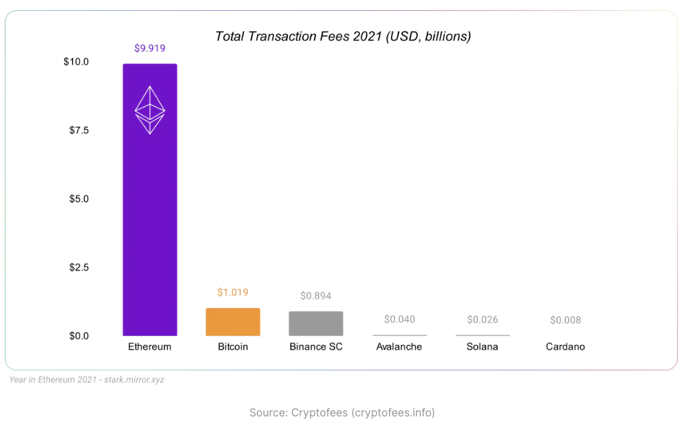

이 그래프는 Layer1 블랙체인의 총 트랜잭션 Fee를 나타낸 것이다. 한 번이라도 이더리움에 트랜잭션을 보내본 유저라면 알겠지만, 타 Layer1 블록체인에 비해 이더리움의 트랜잭션 Fee는 어마어마하게 높다. (이를 해결하기 위해 타 블록체인이 등장했다고도 볼 수 있다.) 따라서 단순히 트랜잭션 Fee가 다른 블록체인들에 비해 이더리움의 수치가 월등히 높다고 해서 이더리움이 대부분의 트랜잭션을 담당하고 있다고는 보기 어렵다.

즉, 이 수치는 단순히 하나의 Metric에 불과하므로 이것만 가지고 유의미한 해석을 하기는 어렵다. 그럼에도 이는 유저들이 해당 블록체인에 사용료를 지불하면서 사용했다는 경향 정도는 알 수 있다. 다른 관점으로 보자면, 각각의 트랜잭션 Fee가 높더라도 이더리움의 수요가 여전하다고도 볼 수 있다. (물론 이더리움 개발진은 이 문제를 인지하고 확장성을 높이기 위해 여러 시도를 하고 있다.)

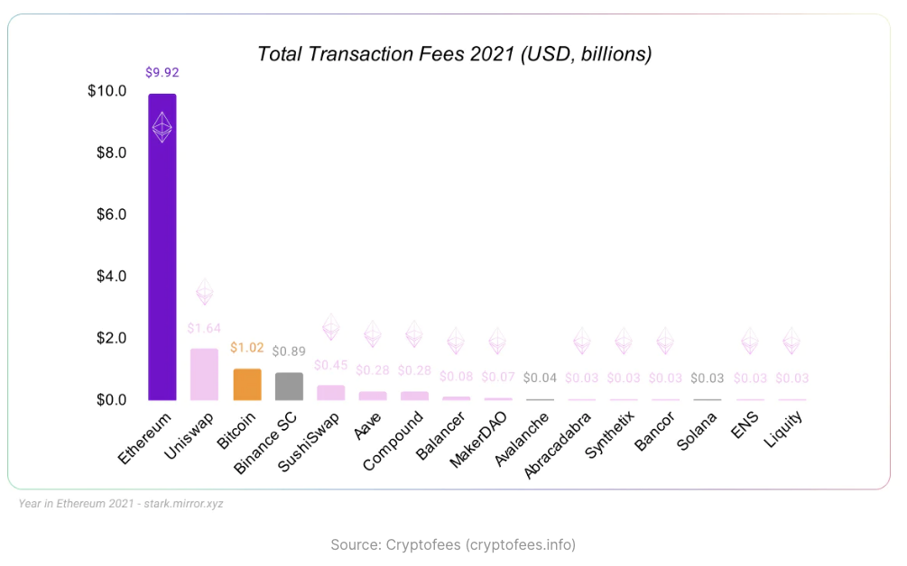

비교 폭을 Layer2와 서비스 애플리케이션으로 넓혀보면 위와 같다. 핑크색으로 표시된 것들은 이더리움 위에서 구동되는 앱이다. 이들에게 있어서 Tx Fees는 블록체인 트랜잭션 Fee가 아닌 서비스 수수료를 의미한다.

그리고 Layer1 블록체인들간의 비교를 해보면, 이더리움만의 트랜잭션 Fee가 다른 Layer1 블록체인 트랜잭션 Fee들의 총 합보다 크다는 걸 알 수 있다. 그렇다면 블록체인들만의 비교가 아닌 실생활에서 접할 수 있는 타 트랜잭션 결제 서비스와 비교를 해보면 어떨까?

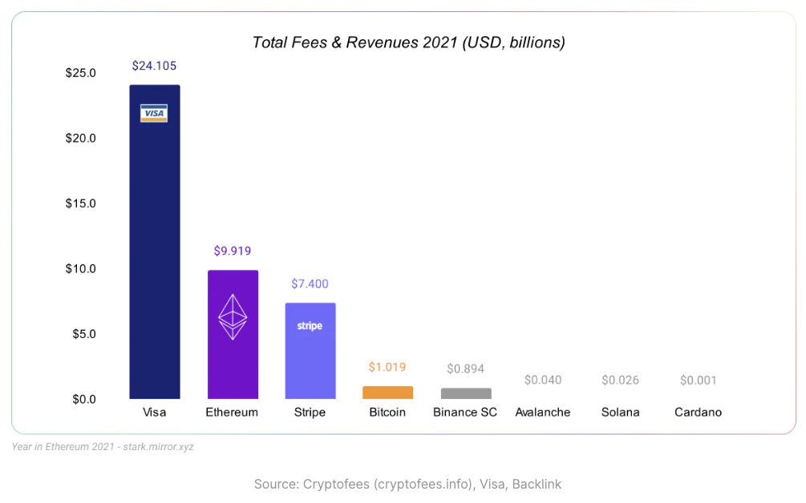

아직 Visa와 같은 기존 서비스와 비교하기에는 턱없이 모자란 수치다. 그럼에도 이더리움의 가능성과 확장성을 엿볼 수 있는 수치다.

### 이더는 얼마나 사용되었을까

블록체인을 사용하는 가장 단순한 방법은 자산을 전송하는 것이다. 그렇다면 이더는 한 해동안 얼마나 많이 전송되었을까?

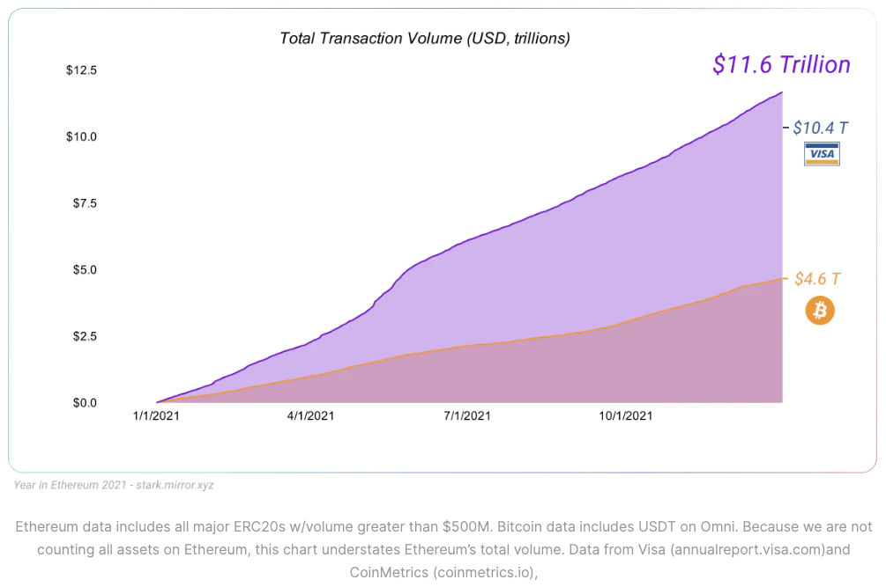

위 그래프를 통해, 이더는 비트코인과 Visa를 제치고 가장 큰 자산 흐름 정도를 보여주고 있음을 알 수 있다.

### 디파이에 Lock된 가치는 어느 정도일까

이번에는 디파이 프로토콜에 Lock된 자산의 정도를 알아보려 한다. 프로토콜에 자산을 Lock했다는 것은 자신들의 자산을 프로토콜에 제공하는 대신, 그로 인해 발생한 수수료 혹은 수익을 가져가겠다는 것을 의미한다. 다음은 블록체인 뿐만 아니라 외부 서비스와도 비교한 그래프다.

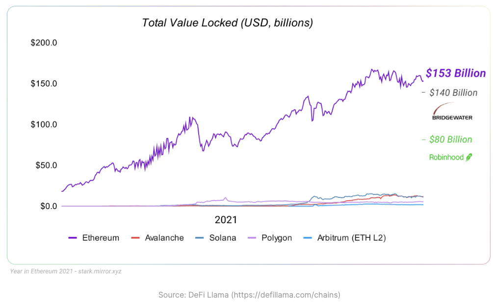

타 블록체인과는 비교가 어려울 정도로 이더리움에 Lock된 자산의 정도가 압도적이며 로빈후드과의 비교에도 꽤나 큰 격차가 나는 것을 알 수 있다.

---

## Layer 2의 등장

오랜 시간 동안 진행된 R&D 덕택에, 2021년 이더리움의 트랜잭션 Capacity은 단순히 Layer1에 그치지 않고 Layer2까지 확장되기 시작했다.

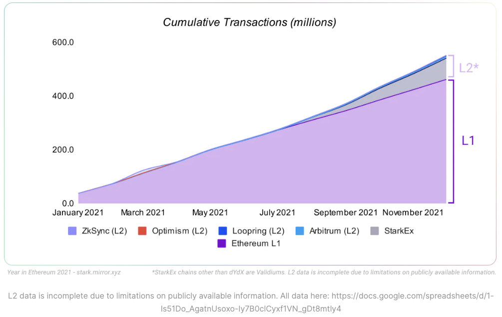

이더리움의 L1은 대략 초당 15개의 트랜잭션을 처리할 수 있다. 그러나 L2이 본격적으로 사용되기 시작한 이후, 이더리움이 처리 가능한 총 트랜잭션의 정도는 증가하고 있으며 증가 폭도 증가하고 있다는 것을 알 수 있다. 모든 L2 프로토콜들은 아직 개발의 초기 단계이기에 성장 가능성은 충분하며, 개인적으로 볼 때는 이더리움 PoS 전환과 함께 시너지를 낼 수 있는 것이 L2이고, 가까운 미래에 이더리움의 성장 동력이 될 것이라고 생각한다. Layer2의 대시보드는 [여기](https://l2beat.com/)에서 확인해 볼 수 있다.

### ZK Rollups

현재로서는 StarkEx가 많은 비중을 차지하고 있는데, 이는 Validium 개념을 구현한 프로토콜로 Off-Chain 상에서 동작하는 방식이다. 이는 ZK Rollup라고 불리는 카테고리에 속하는 L2인데, 아래와 같이 Validium 외에도 여기에 속하는 다양한 프로토콜이 있다.

- **Loopring**

  2021년 초에 온전한 zkRollup을 런칭했으며, 8월에는 NFT Mint 및 트레이딩을 지원하기 시작했다.

- Matter Labs

  **zkSync**라고 하는 Payment 용도로 시작해, 현재는 EVM과 호환되는 zkEVM을 개발 중이다.

- Aztec

  **zk.money**라는 프라이빗한 Payment 용도의 Rollup을 제공하며, 4월에는 DAI를 지원하기 시작했다.

- Starkware

  DeversiFi, ImmutableX, dYdX, Sorare 등 많은 앱이 **StarkEx** 플랫폼 상에서 구동되고 있다.

사이드 체인 형태의 Validium 솔루션은 비교적 단순한 특정 목적의 애플리케이션에서 사용된다. 그러나 ZK Rollup은 이더리움의 EVM처럼 다양한 용도의 애플리케이션이 구동되도록 개발되고 있기 때문에, 기술 개발이 지속되면 ZK Rollup 형태도 많이 사용되어 이더리움의 트랜잭션 Capacity를 많이 높여줄 것이다.

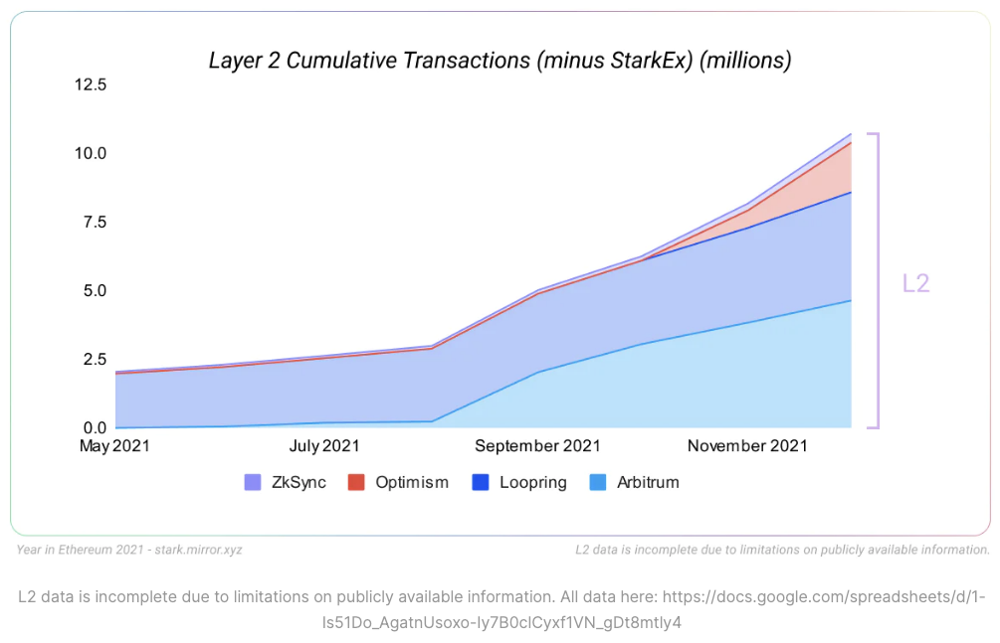

이외에도 Optimistic Rollup 개념의 구현체인 **Arbitrum**과 **Optimism**도 있다. 이들은 실질적으로 다양한 애플리케이션에서 L2의 본 목적을 이룰 수 있도록 EVM 호환성을 지닌 프로토콜이다. 이더리움 상의 모든 자산들이 Optimistic Rollup으로 옮겨져서, L2 위에서 스마트 컨트랙트를 이용해 또 다른 애플리케이션이 구동될 수 있다. 현재로서는 유일하게 EVM 호환 가능한 L2 솔루션이다.

### Rollup의 흐름

Vitalik과 Joseph Poon이 처음에는 Plasma라고 하는 확장성 솔루션을 제안했다. 이는 이더리움 블록체인 외에 별도의 블록체인을 구동하면서도 이더리움 블록체인에 Anchor하여 보안성은 유지하는 방식이다. 그러나 데이터 가용성 문제 등 여러 한계로 인해 Rollup의 개념이 등장했다.

Rollup이라는 용어에서 미루어볼 수 있듯이, 이더리움 블록체인 L1에 Anchor하여 필수 데이터만을 올리고, 실제 동작은 별도의 L2 체인에서 일어나는 방식이다. L2에 발생한 트랜잭션이라도 필수 데이터가 모두 L1에 저장되므로 보안성은 유지될 수 있다. 이에 대한 구현체로 Optimistic Rollups과 Zero-Knowledge Rollups 두 가지가 있다.

Optimistic 방식은 역시 이름에서 알 수 있듯이, 별다른 문제가 없다는 가정 하에 L2 체인을 구동시키는 형태다. 그러던 중 검증자가 수상한 트랜잭션을 발견할 경우, 이를 심사하여 문제 유무를 판단함으로써 악의적인 공격을 막는다. 다시 말해 L2 상의 데이터를 L1으로 올릴 때, 검증자들이 충분히 감시하고 심사할 수 있도록 대략 1주일 정도의 대기시간이 발생한다. 변동성이 높고 제약을 극도로 싫어하는 성향의 Crypto 필드에서 이는 엄청난 마이너스 요소다. 그리고 개인적으로 철저히 자신의 이득을 위해 행동하도록 유도되는 이 필드에서 Optimistic한 방식은 위험하다고 생각하며, 단지 이 Optimistic Rollup은 과도기적인 성격의 확장성 솔루션이라고 생각한다.

Zero-Knowledge 방식은 영지식 증명이라는 암호학을 이용해 악의적인 공격을 막는다. 암호학을 이용하기에 특정 연산을 통해 수상한 데이터를 곧바로 추려낼 수 있기에, L1에서 L2로 데이터를 올릴 때 별도의 대기 시간이 없다. 다만 이 솔루션의 핵심 요소인 영지식 증명의 처리 비용이 하나의 허들이 될 수 있으며, 아직까지 EVM과 호환되는 기술 구현체가 없다는 것 또한 하나의 약점이다. 그럼에도 Matter Labs에서 zkEVM을 개발 중이며, 이 기술이 충분한 시간을 갖고 검증되면 이더리움의 L2 솔루션은 ZK Rollups이 많은 파이를 가져갈 것이라고 생각한다.

Layer 2의 Rollup은 이제 시작이다. 중장기적인 관점에서 관심을 갖고 팔로우할만한 주제이며, 기대되는 영역이다.

---

## 크리에이터들은 이제 MainStream으로

생략.

---

## 코어 프로토콜 개선

2021년 한 해 동안, PoS로의 전환을 위해 새로운 Fee Market을 비롯한 두 번의 메인넷 업그레이드가 진행되었다.

이더리움 클라이언트의 다양성은 내부 커뮤니티에서도 가장 우선으로 따져야할 것 중 하나라고 여겨지며, 동시에 실질적으로 유지하기 가장 챌린징한 것이라고도 한다. 구현 클라이언트가 다양할 수록 특정 클라이언트에서 발생하는 버그에 대한 방어에 유리하며, 더불어 몇몇 클라이언트 개발자들에게 프로토콜이 지배당하는 것을 방지할 수 있기도 하다. 이더리움은 **Specification First** 블록체인으로, 특정 소프트웨어 구현 및 유지/보수에 의존성을 갖지 않는다. 인터페이스가 먼저 확정되고, 클라이언트 개발자 혹은 팀이 그에 맞춰 구현해나가는 식이다.

한 해 동안 4월에 진행된 [Berlin](https://ethereum.org/en/history/#berlin) 하드포크, 8월에 진행된 [London](https://ethereum.org/en/history/#london) 하드포크 두 번의 메인넷 업그레이드가 일어났다. 그로 인해 여러 변화들이 생겼지만, 가장 주목할 점은 [EIP-1559](https://github.com/ethereum/EIPs/blob/master/EIPS/eip-1559.md)에 명세된 Ethereum Fee Market Reform 이다. 그 외에도 이더리움의 DOS 공격 방지를 위한 EIP-2929 업그레이드 등이 이다.

위의 두 번의 하드포크는 기존의 Ethereum Execution Chain에 영향을 미친 것이라면, Consensus Chain인 비콘 체인에 변화를 준 [Altair](https://ethereum.org/en/history/#altair) 하드포크도 진행되었다. 이 업그레이드로 인해, 비콘 체인 상의 Light Client들도 Slashing & Incentive 대상이 되도록 변경되었다. 이를 비롯해서 앞으로도 계속 PoS로의 전환을 위해, PoW을 끝내기 위해 업그레이드는 계속 예정되어 있다.

### EIP-1559: Fee Market Reform

21년 8월, EIP-1559 스펙이 이더리움 메인넷에 반영되었다. 이로 인해 유저들이 이더리움 프로토콜을 사용하기 위해 지불하는 Fee Market의 여러 규칙들을 재정의한다. EIP-1559는 아래와 같은 목표를 이루고자 한다.

- 우저들이 트랜잭션을 Submit할 때 되도록 Over-Pay 하지 않도록 한다.
- Stuck 트랜잭션의 비율을 줄인다.
- 프로토콜 보안성을 높이고, DOS 공격의 비용을 높인다.
- Fee의 일부분을 Burn (소각) 하여 ETH의 가치를 확보함으로써 이더리움의 경제적 안보를 높인다.

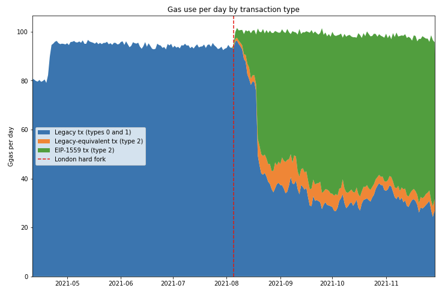

위 그래프는 EIP-1559 적용 이후, Ethereum **Type 2**과 **Legacy** 트랜잭션의 비율을 보여준다. 2021년 말에는 대략 35% 정도의 트랜잭션이 여전히 EIP-1559 적용 전의 트랜잭션 타입임을 알 수 있다. 그리고 아래 그래프를 통해 EIP-1559의 목표 중 하나였던, 트랜잭션 Fee 감소가 실제로 적용되었음을 알 수 있다.

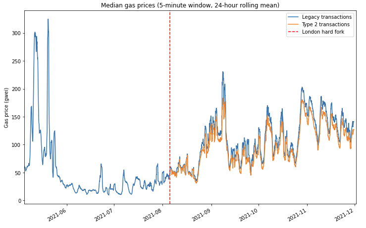

파란색이 Legacy 트랜잭션, 주황색이 Type 2 트랜잭션이다. 두 타입 간의 지출된 트랜잭션 Fee의 차이가 나는 것을 알 수 있다. 아래 그래프는 둘의 차이를 나타낸 것이다.

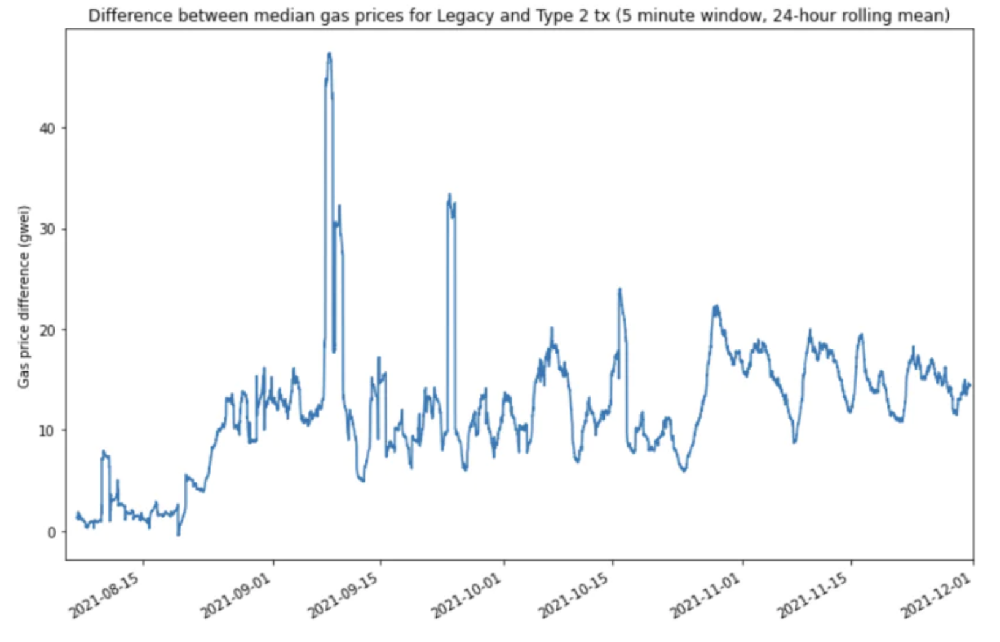

전반적으로 보자면, Legacy 트랜잭션들이 10~20 Gwei를 더 많이 소비하는 것을 알 수 있다.

### Feel the BURN

EIP-1559는 트랜잭션 Fee의 일부분을 소각시키는 메커니즘을 새롭게 적용하기도 했다. 이는 이더리움 프로토콜에서 수행된 모든 트랜잭션마다 일부분의 ETH가 총 공급에서 줄어드는 것을 의미한다. 이는 화폐의 디플레이션 정책으로, ETH 가치를 조금 더 안정적으로 확보할 수 있다. 이더리움 프로토콜에서의 합의에 있어서 중요한 것 중 하나는 ETH의 가치이다. PoW 환경에서는 채굴자들이 지불하는 비용으로 인해 네트워크가 안전하게 유지될 수 있지만, PoS 환경에서는 검증자들이 ETH를 스테이킹함으로써 네트워크를 안전하게 유지할 수 있기 때문에 ETH의 가치가 더욱 중요해진다.

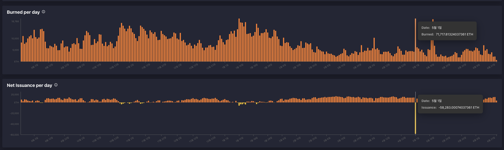

### The MERGE

PoW에서 PoS로의 전환 [초기](https://blog.ethereum.org/2014/01/15/slasher-a-punitive-proof-of-stake-algorithm/)부터 꾸준히 거론되어왔다. PoW 방식이 초기 블록체인 디자인에 필수적인 것은 맞으나 PoW가 동작한 12년 동안, 불필요한 에너지를 과도하게 소비하며 보안 및 안정성에도 불안한 모습을 보여주기도 했다. 이더리움의 PoS 전환은 약 7년 이상 리서치했고, 현재도 진행 중이다. 결국의 목표는 PoS로 전환 시 탈중앙성 결여와의 타협을 하지 않기 위해서이다. 많은 타 블록체인들은 PoS 방식을 채택했지만, 대부분 DPoS 형태로 매우 중앙화된 형태이다. 일부 특정 몇 명에게 권한을 위임해서, 그 사람들이 네트워크의 실질적인 결정권자가 되는 것이다.

이더리움은 그렇게 되지 않기 위해, PoS 연구를 지속적으로 진행 중이다. 네트워크 검증자가 되는 장벽을 낮춰서 노트북을 가진 누구나 참여할 수 있도록 해야 한다. 20년 12월 첫 발을 내딘 [Beacon Chain](https://ethereum.org/en/upgrades/beacon-chain/) 업그레이드를 시작으로, 이더리움은 과도기에 놓여있다.

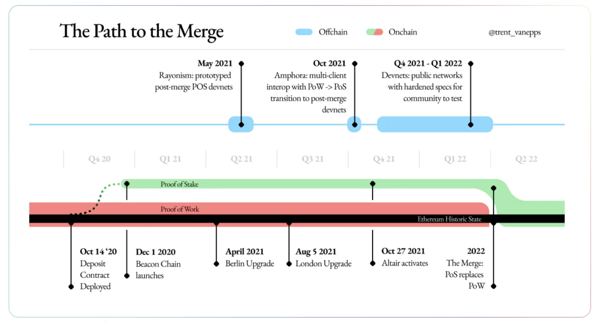

### Client Diversity

아래 그래프에서 알 수 있듯이, 이더리움에는 다양한 클라이언트 구현체들이 있다.

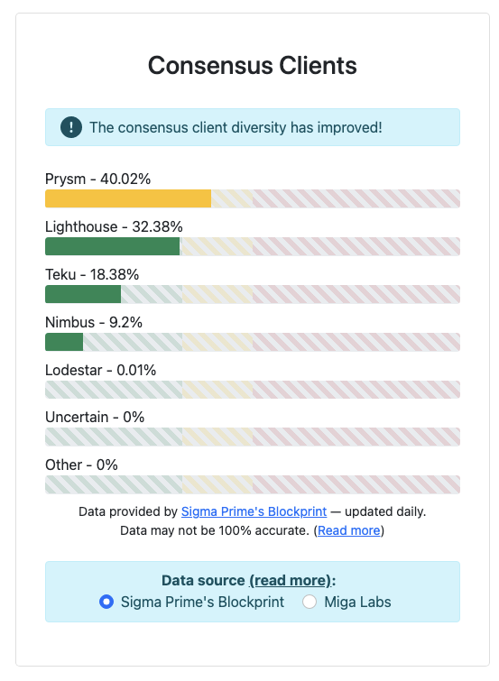

이상적으로는 하나의 클라이언트가 33% 이상의 Share를 차지하면 안된다. 어느 한 곳에서 버그가 발생하더라도 네트워크가 마비되지 않기 위함이다. 가장 많은 비율을 차지하는 Prysm에서도 이를 인지하고 [성명문](https://medium.com/prysmatic-labs/prysmatic-labs-statement-on-client-diversity-c0e3c2f05671)을 내기도 했다. 22년 초 대략 68%였던 비율이, 22.06에는 40%까지 내려온 것을 보면 나름 선방 중임을 알 수 있다.

---

## DAO는 Tpping Point를 넘어섰다

이더리움 프로토콜은 사용자 중 누구나 임의의 규칙을 코드로 표현하고 하나의 조직을 디자인하기 위해 존재하기 때문에, DAO의 활성화가 주요 목표 중 하나였다. 지난 몇 년동안 주요 활용처 중 하나는 DeFi 프로토콜의 완전한 탈중앙화 목표이었다. 이러한 구조는 [Compound in 2020](https://medium.com/compound-finance/compound-governance-decentralized-b18659f811e0)에서 처음 제안된 것이고, 이후 사실상의 표준이 되었다.

아래 그래프를 보면 2021년 동안 DAO 생태계는 급성장했음을 알 수 있다.

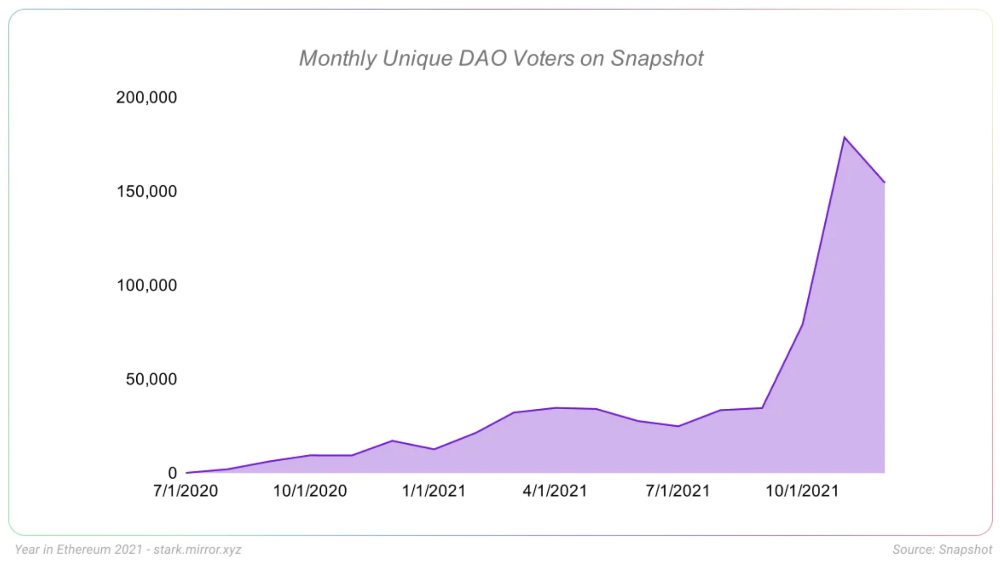

사실 DAO 개념은 더 넓은 활용처에서 쓰일 수 있기에, 앞으로가 더 기대되는 컨셉이다.

---

## Onwards!

위에서 소개한 주제들 외에도, 많이 성장한 분야들이 있다.

- **Identiy**: 이더리움 계정 기반 도메인 서비스인 [ENS (Ethereum Name Service)](https://app.ens.domains/)
- **Gaming**: Axie Infinity
- **Public Goods Funding**: CLRRund

