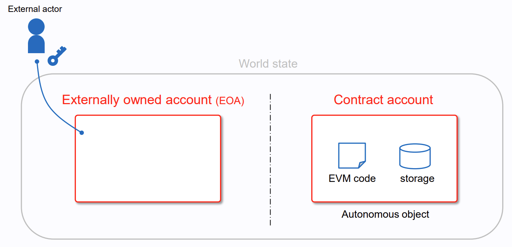
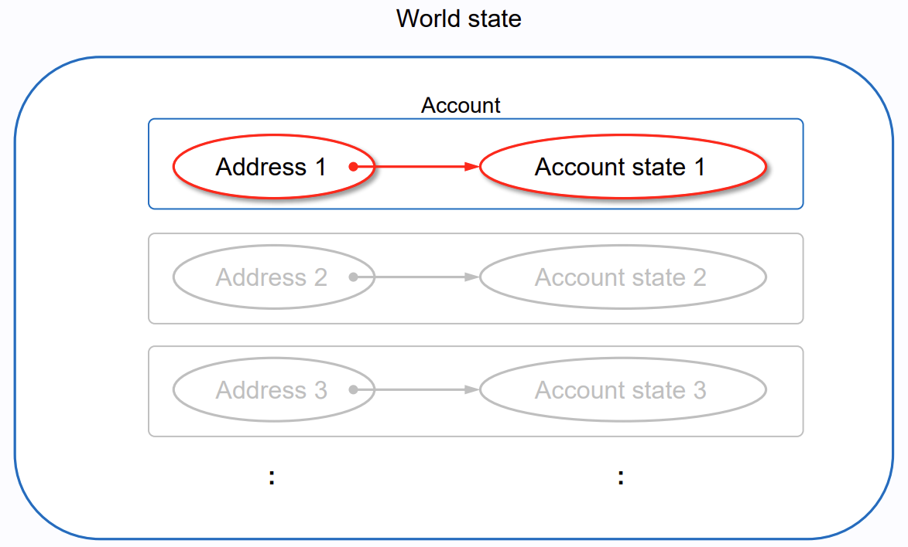
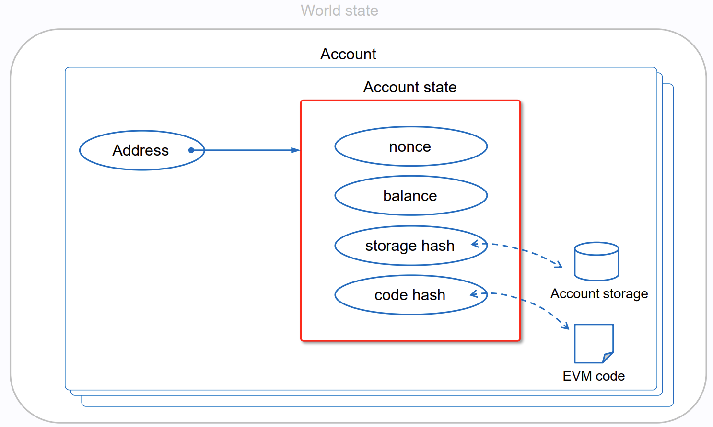
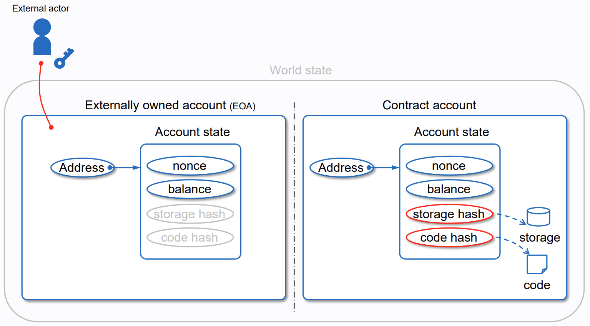
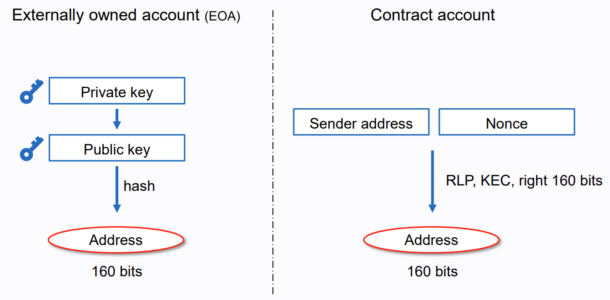

## Account Types



- EOA, Externally Owned Account

  Private Key를 통해 통제

- CA, Contract Account

  Code에 의해 통제, 네트워크에 Smart Contract가 배포된 상태

### Commons

- Receive / Hold / Send ETH or Tokens
- Interact with Smart Contracts

### Differences

- EOA
  - Account Creating 비용 없음
  - Transaction Initiate 가능
  - EOA 간의 Transaction은 ETH or Token 전송만 가능
  - Private Key와 Public Key 쌍으로부터 암호학적으로 생성됨
- CA
  - 네트워크 저장 공간을 사용하므로 Creating 비용 발생
  - Transaction을 Receive해야만 이후 Transaction Send 가능
  - From EOA To CA Transaction인 경우 Smart Contract를 실행시켜 다양한 Action 가능
  - 별도의 Private Key 존재하지 않고 Smart Contract Logic에 의해 통제됨


## Account State



- Account는 Address와 State 사이의 Mapping 존재



- `nonce`

  아래 사항에 대한 Counter

  - Number of Sent Transactions from EOA
  - Number of Created Transactions from CA

  이는 Signed Transaction이 반복 실행되는 Replay Attack을 방지하기 위함

  1. 각 Transaction에 고유한 Nonce 할당
  2. 노드는 당시 World State에서 해당 주소의 현재 Nonce와 Transaction의 Nonce가 일치하는지 확인
  3. 두 값이 일치하지 않다면 Transaction을 실행 거부

- `balance`

  해당 Address가 보유한 Number of WEI ($1 \ ETH = 10^{18} \ wei$)

- `storage hash`

  해당 Account의 Storage Content를 Encoding한 Merkle Patricia Trie Root Node의 256-bit Hash

  `storage root`라고도 불림

- `code hash`

  EVM 상에서 Account가 가리키는 Code의 Hash

  다른 Account Field와는 달리 이 값은 수정될 수 없음




## Account Creation

1. Private Key Creation

   보통 Random하게 256-bit Private Key가 만들어짐

   - Example

     ```
     fffffffffffffffffffffffffffffffebaaedce6af48a03bbfd25e8cd036415f
     ```

2. Public Key Creation

   Private Key를 사용하여 ECDSA (타원 곡선 디지털 서명 알고리즘) 암호학 연산 수행으로 512-bit Public Key가 만들어짐

3. Address Creation

   Public Key를 사용하여 Keccak-256 Hash의 마지막 160-bit만을 추출하고 Prefix 0x를 붙여서 Address가 만들어짐




## References

- [Ethereum Accounts](https://ethereum.org/en/developers/docs/accounts/)
- [Takenobu Tani, "ethereum-evm-illustrated"](https://takenobu-hs.github.io/downloads/ethereum_evm_illustrated.pdf)

