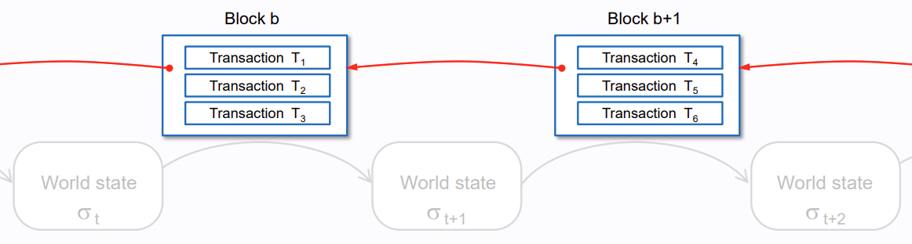

## Block Work

- To Maintain Synchronized State & Agree History of Transactions
- Batch Transactions into Block
- Strictly Ordered Blocks & Strictly Ordered Transactions into Block

## Block Properties

### Block Time

- 매 12초마다 "Slot"이라 불리는 Partition으로 구분
- 각 Slot마다 Block을 제안하는 Validator가 배정되며 상황에 따라 Slot에 Block 제안이 안될 수 있음

### Block Size

- Default 15M Gas 크기

  네트워크 상황에 따라 최대 30M Gas까지 늘어날 수 있음

- 크기 제한이 없다면 Computing Power 요구 수준이 높아지므로 노드의 중앙화 현상이 나타날 수 있음

