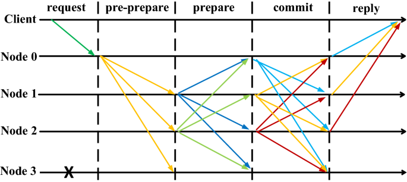

## A Consensus

- General Agreement에 도달한 것
- Ethereum에서는 적어도 66% 노드가 Global State에 Agree한 것

### Safety

- Consensus에 도달한 경우, 어느 노드라도 그 값은 동일해야 함
- Blockchain Finality와 유사한 개념

### Liveness

- Consensus Target에 문제 없는 경우, 반드시 Consensus에 도달해야 함

## Mechanism

- Protocol & Incentive & Idea의 집합체

### Sybil Resistance

- Sybil Attack

  악의적인 노드가 여러 가짜 노드를 생성하여 네트워크를 혼란시키거나 조작하려는 시도

- Sybil Attack 발생을 위한 비용을 높여 Resistance

### Chain Selection

- 무엇이 Correct Chain인지 결정하는 Rule

### Byzantine Fault Tolerance

- Byzantine General Problem

  네트워크에 배신자가 있더라도 합의 내용에 문제가 없으려면 어떻게 해야하는가

- FLP Impossibility

  비동기 네트워크 내에서는 Safety와 Liveness를 모두 완벽히 만족하는 합의 알고리즘을 설계하는 것이 불가능하다는 것에 대한 증명

## Proof of Work

### Block Creation

- Miner가 New Block을 생성해내면 새로 발행되는 ETH를 보상 받음
- Mine Competition은 이전 Block과 현재 Block을 Cryptographically 잇는 Computing 과정
- Fork Chain 중 누적된 Work Difficulty를 기준으로 선택, "Longest Chain"

### Security

- To Defraud Chain, Need 51% Network Computing Power

## Proof of Stake

### Block Creation

- Randomly Selected Validator Propose Block in Each Slot
- Fork Chain 중 Greatest Weight of Attestation를 기준으로 선택, "Heaviest Chain"

### Security

- 정직하게 활동할 경우 Incentive를, 악의적으로 활동할 경우 Disincentive를 부여
- Crypto-Economically Secure

## Practical Byzantine Fault Tolerance

- Safety를 확보하고 Liveness를 일부 희생하며, 비동기 네트워크 내에서도 합의를 이루는 알고리즘
- 비동기 네트워크에서 배신자 노드가 n개 있을 때, 총 노드 개수가 3n+1개 이상이면 해당 네트워크에서 이루어지는 합의는 신뢰할 수 있다는 것을 증명함

### Process

1. Request
   - 상태 변환 Request Message $M$을 Client가 Node에 전송
   - 처음 Request를 받은 Node를 Primary로, 이외 Node를 Backup이라고 칭함
2. Pre-Prepare
   - 해당 Request에 대응하는 Sequential Number $N$을 생성
   - 나머지 모든 Node에게 메시지 $<Pre-Prepare, \ V, \ N, \ D(M)>$ 전송
     - $V$: 메시지가 전송되는 View
     - $N$: Sequential Number
     - $D(M)$: Request Message $M$의 요약본
3. Prepare
   - Backup $i$가 Pre-Prepare 메시지를 받고 올바른 값인지 검증
   - 검증 결과가 참이면, 자신을 제외한 모든 Node에게 메시지 $<Prepare, \ V, \ N, \ D(M), \ i>$ 전송
     - $i$: Pre-Prepare 메시지를 검증한 Backup Node Index
4. Commit
   - 각 Node는 Pre-Prepare 메시지와 Prepare 메시지를 수집
   - Pre-Prepare 메시지가 2n+1개이며 Prepare 메시지가 2n개 이상인 경우 "Prepared Certificate"
   - 해당 Node는 Commit 메시지 $<Commit, \ V, \ N, \ i>$ 전송
5. Reply
   - 각 Node는 Commit 메시지를 수집
   - Commit 메시지가 2n+1개 모이면 "Commit Certificate"
   - Prepared Certificate & Commit Certificate 모두 만족하는 Node는 "Committed Certificated"
   - 해당 Node는 Client가 요청한 상태 변환 Request를 수용

## Reference

- [Ethereum Consensus Mechanisms](https://ethereum.org/en/developers/docs/consensus-mechanisms/)
- [kblock, "[케블리] #48. 합의 알고리즘 이해하기 - PBFT Consensus Algorithm"](https://steemit.com/consensus/@kblock/48-pbft-consensus-algorithm)