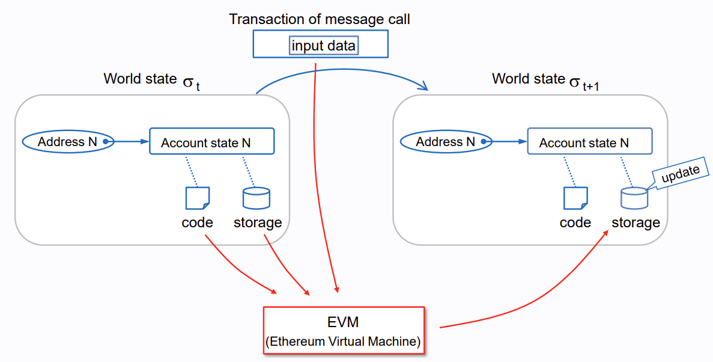
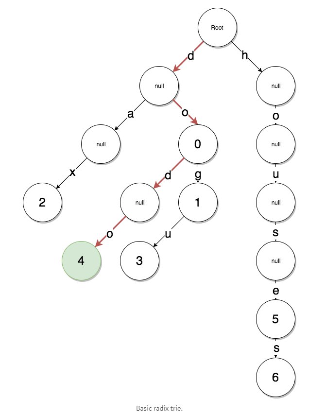
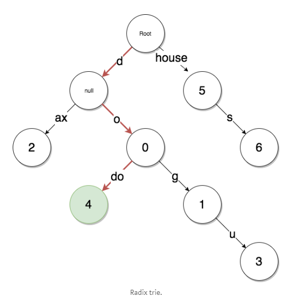
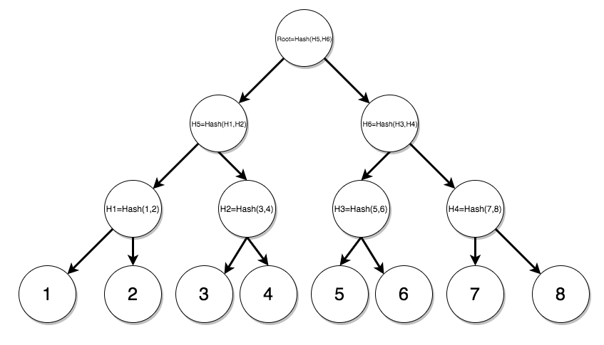
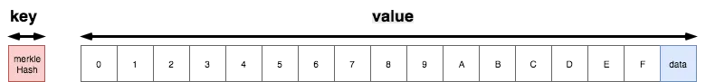
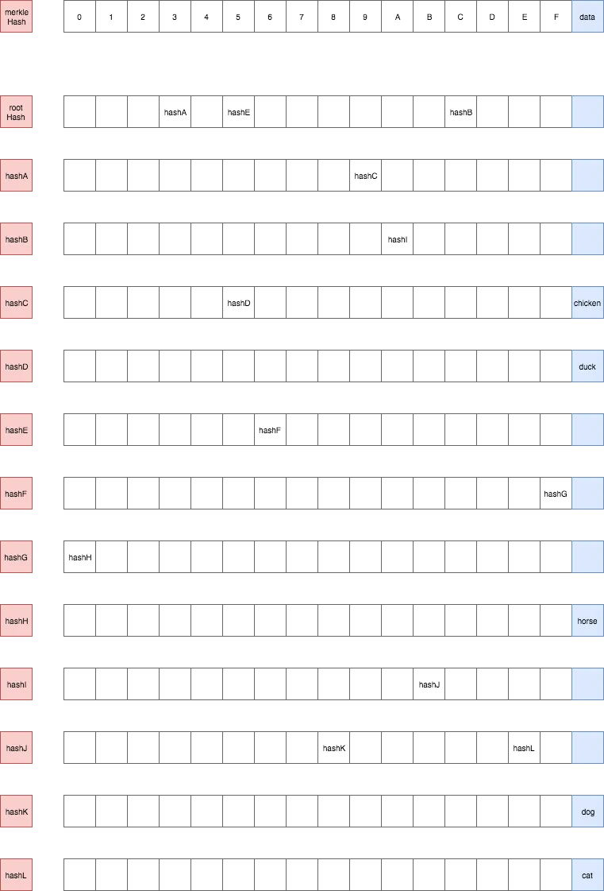

## From Ledger To State Machine

- Bitcoin은 Distributed Ledger, Records of Activities adhered to Set of Rules
- Ethereum은 Distributed State Machine, Ledger with Smart Contracts
  - Deterministic $Y(S,T)=S'$
    - $S$: Old Valid State
    - $T$: Set of Valid Transactions
    - $Y$: Ethereum State Transition Function
    - $S'$: New Valid Output State




## About a EVM

### Elements


- Stack
  - Stack Memory
  - 256-bit, 1024 Elements
- Memory
  - Volatile Memory
- Storage
  - Persistent Memory
  - 256-bit to 256-bit Key-Value

### Execution Model


- Message Call Limits Less Than 1024 Levels


## Trie Data Structure

### Radix Trie

- Dataset

  ```
  {
    do: 0,
    dog: 1,
    dax: 2,
    dogu: 3,
    dodo: 4,
    house: 5,
    houses: 6
  }
  ```

- Basic Structure

  

  - Key `houses`를 통해 Value `6`을 표현하기 위해서 너무 많은 `null` 노드가 존재하게 됨

- Optimized Structure

  

### Merkle Trie



- Leaf Node 해시하여 Parent Node에 전달
- Parent Node는 Child Node 해시값을 더하여 해시한 후 다시 Parent Node에 전달
- 이 과정을 반복하여 Root Hash 생성

### Merkle Patricia Trie

- Dataset

  ```
  {
    'cab8': 'dog',
    'cabe': 'cat',
    '39': 'chicken',
    '395': 'duck',
    '56f0': 'horse'
  }
  ```

- Terminology

  

  - `key`는 Hash of `value`

    Node가 저장된 Database Lookup에 이용

  - `value`는 16개의 Hex Number와 Node Data, 총 17개 Elements

    Path를 찾기 위해 Trie Lookup에 이용

- Basic Structure

  

  - `'395': 'duck'`을 찾는 예시
    1. Key `395`를 각각의 Path `3`, `9`, `5`로 분리하여 사용
    2. `rootHash`에서 시작하며 이에 대응되는 `rootNode`를 찾음
    3. 첫번째 Path는 `3`이므로 `rootNode`의 `3`에 해당하는 `hashA`를 찾음
    4. 두번째 Path는 `9`이므로 `hashA`의 `9`에 해당하는 `hashC`를 찾음
    5. 세번째 Path는 `5`이므로 `hashC`의 `5`에 해당하는 `hashD`를 찾음
    6. `hashD`의 Data는 `duck`


## Trie in Ethereum

- Block Header에는 아래 세 가지 Trie Root를 포함
  1. State Root
  2. Transactions Root
  3. Receipts Root

### State Trie

- Global State Trie

- 하나의 Block을 처리할 때마다 Update

- `path`는 `keccak256(ethereumAddress)`

- `value`는 `rlp(ethereumAccount)`

  이때 `account`는 `[nonce, balance, storageRoot, codeHash]`로 구성

### Storage Trie

- Smart Contract Data가 보관되는 자료구조

- 각 Account마다 고유한 Trie를 보유

  EOA인 경우 `storageRoot`는 Empty

### Transactions Trie

- 각 Block마다 포함된 Transaction이 담긴 Trie

- `path`는 `rlp(transactionIndex)`

- `value`는

  ```pseudocode
  if legacyTx:
      value = rlp(tx)
  else:
      value = TxType | encode(tx)
  ```

### Receipts Trie

- 각 Block마다 고유한 Trie를 보유
- 한 번 생성된 후로는 Update될 일 없음
- `path`는 `rlp(transactionIndex)`


## References

- [Ethereum EVM](https://ethereum.org/en/developers/docs/evm/)
- [Ethereum Merkle Patricia Tree](https://ethereum.org/en/developers/docs/data-structures-and-encoding/patricia-merkle-trie/)
- [니르바나, "머클 패트리시아 트리"](https://ihpark92.tistory.com/48)
- [Phan Son Tu, "Data Structure in Ethereum Episode 3: Patricia Trie"](https://medium.com/coinmonks/data-structure-in-ethereum-episode-3-patricia-trie-b7b0ccddd32f)
- [Seulgi Kim, "Modified Merkle Patricia Trie - ethereum이 상태를 저장하는 방법"](https://medium.com/codechain/modified-merkle-patricia-trie-ethereum%EC%9D%B4-%EC%83%81%ED%83%9C%EB%A5%BC-%EC%A0%80%EC%9E%A5%ED%95%98%EB%8A%94-%EB%B0%A9%EB%B2%95-e385f7d6bf84)