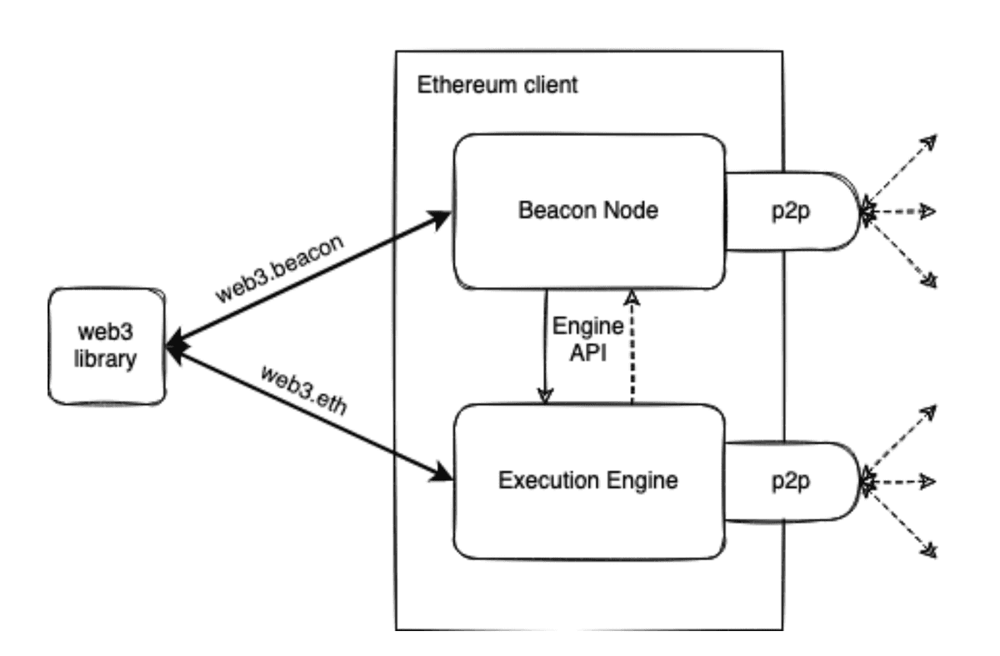
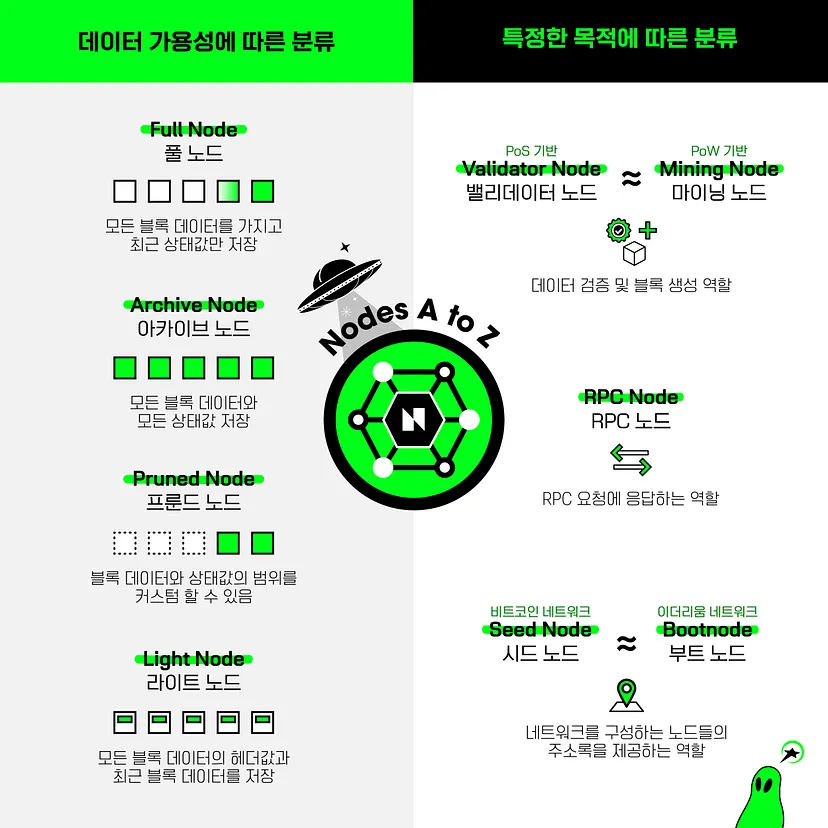

## About a Node

- Node는 Ethereum Software을 구동하여 네트워크를 형성하는 Instance of Ethereum Client

- Beacon Node는 데이터 합의를 위함
- Execution Engine은 새로운 Transaction 구동 및 검증을 위함

## Node Types

### Light Node

- Block Header만 보관함
- 이외의 데이터는 Full Node로 부터 요청해서 전달받아야 함
- 외부로부터 받은 데이터를 Header에 담긴 정보를 이용하여 스스로 검증할 수 있음

### Full Node

- 각 Block의 Body와 State를 하나하나 검증

- Local Copy는 상대적으로 최신 데이터만을 유지하며, 오래된 데이터는 삭제함 (Pruning)

  이때 주기적으로 Checkpoint를 기록해놓으며 추후 State 정보가 필요할 경우 Snapshot을 이용하여 재구성함

### Archive Node

- Genesis Block부터 모든 데이터를 보관하며 삭제하지 않음

## Synchronization Modes

### Execution Layer Sync Modes

- Light Sync

  최근의 'Trusted' Checkpoint에서 시작하여 Block 정보를 Download함

- Full Snap Sync

  최근의 'Trusted' Checkpoint에서 시작하여 Block 정보를 Sync 및 검증함

- Full Archive Sync

  Genesis Block에서 시작하여 Block Headers, Transactions, Receipts 모두 Sync 및 검증하며 Ethereum State를 관리

### Consensus Layer Sync Modes

- Optimistic Sync
- Checkpoint Sync

## Client Types

### Execution Client

| Client                                          | Language | Operating Systems     | Networks                           | Sync Strategies                    | State Pruning   |
| ----------------------------------------------- | -------- | --------------------- | ---------------------------------- | ---------------------------------- | --------------- |
| [Geth](https://geth.ethereum.org/)              | Go       | Linux, Windows, macOS | Mainnet, Sepolia, Goerli           | Snap, Full                         | Archive, Pruned |
| [Nethermind](http://nethermind.io/)             | C#, .NET | Linux, Windows, macOS | Mainnet, Sepolia, Goerli, and more | Snap (without serving), Fast, Full | Archive, Pruned |
| [Besu](https://besu.hyperledger.org/en/stable/) | Java     | Linux, Windows, macOS | Mainnet, Sepolia, Goerli, and more | Snap, Fast, Full                   | Archive, Pruned |
| [Erigon](https://github.com/ledgerwatch/erigon) | Go       | Linux, Windows, macOS | Mainnet, Sepolia, Goerli, and more | Full                               | Archive, Pruned |

- 네트워크 상에서 브로드캐스트된 새로운 Transaction을 수신하고, EVM 상에서 구동시키며, State를 최신 상태로 유지시킴

### Consensus Client

| Client                                                       | Language | Operating Systems     | Networks                                                     |
| ------------------------------------------------------------ | -------- | --------------------- | ------------------------------------------------------------ |
| [Lighthouse](https://lighthouse.sigmaprime.io/)              | Rust     | Linux, Windows, macOS | Beacon Chain, Goerli, Pyrmont, Sepolia, Ropsten, and more    |
| [Nimbus](https://nimbus.team/)                               | Nim      | Linux, Windows, macOS | Beacon Chain, Goerli, Sepolia, Ropsten, and more             |
| [Prysm](https://docs.prylabs.network/docs/getting-started/)  | Go       | Linux, Windows, macOS | Beacon Chain, Gnosis, Goerli, Pyrmont, Sepolia, Ropsten, and more |
| [Teku](https://consensys.net/knowledge-base/ethereum-2/teku/) | Java     | Linux, Windows, macOS | Beacon Chain, Gnosis, Goerli, Sepolia, Ropsten, and more     |

- Execution Client로부터 전달받은 데이터를 토대로 서로 다른 Node 간의 합의를 위해 Proof of Stake 수행함

## Client Diversity

- Execution Clients와 Consensus Clients 모두 서로 다른 팀이 다양한 언어로 개발한 구현체 존재
- 최종 목표는 어느 Client도 네트워크를 Dominate하지 않도록 유지하는 것

### Why Important

- Resilience to Bugs

- Resilience to Attacks

- Proof of Stake Finality

  $\frac{2}{3}$ 이상 Majority를 가진 Client에 Bug가 존재할 경우 Chain이 Incorrectly Split 및 Finalize될 가능성이 있음

### Current Status

- https://clientdiversity.org/
- https://ethernodes.org/

## References

- [Ethereum Nodes and Clients](https://ethereum.org/en/developers/docs/nodes-and-clients/)
- [Ethereum Client Diversity](https://ethereum.org/en/developers/docs/nodes-and-clients/client-diversity/)
- [DSRV, "노드:A to Z"](https://medium.com/dsrv/%EB%85%B8%EB%93%9C-a-to-z-a0d79f5d125c)