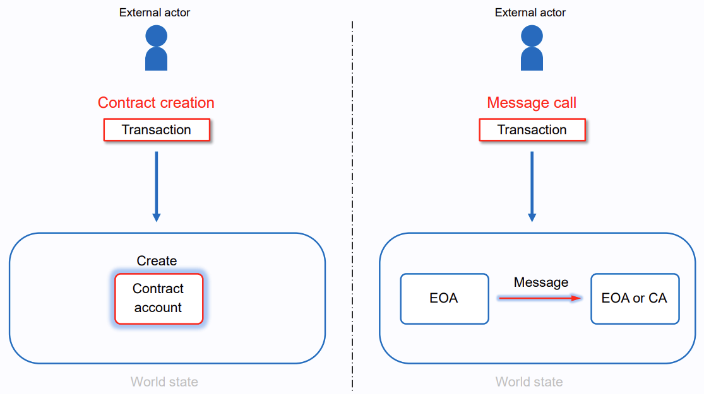
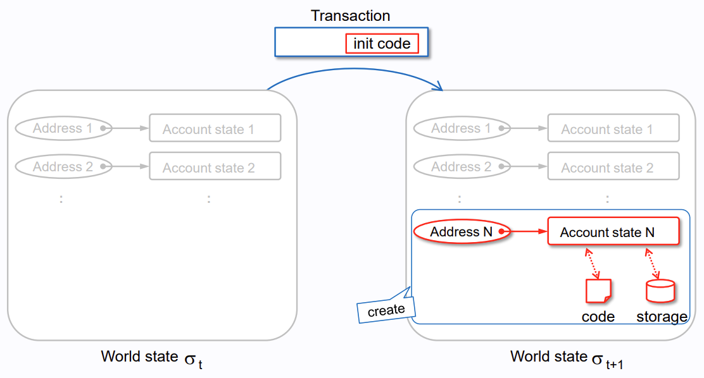
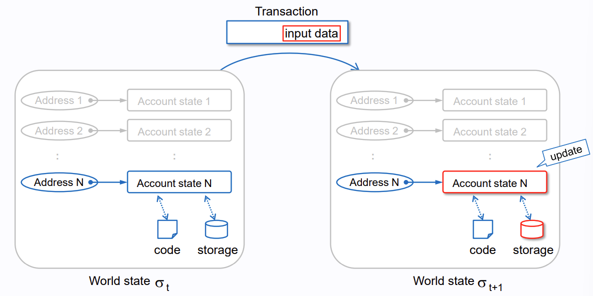
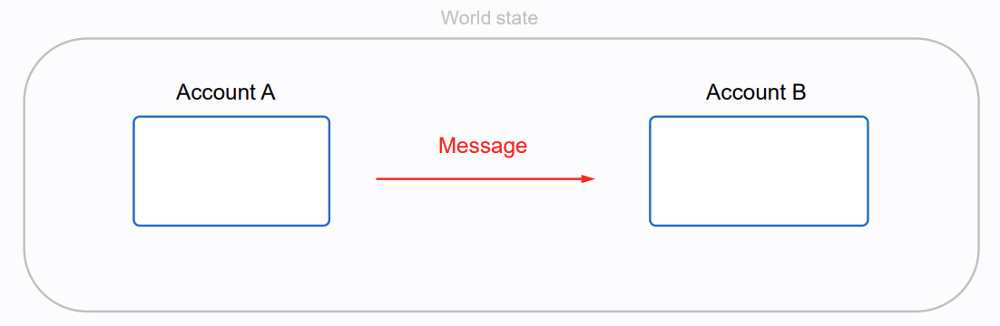
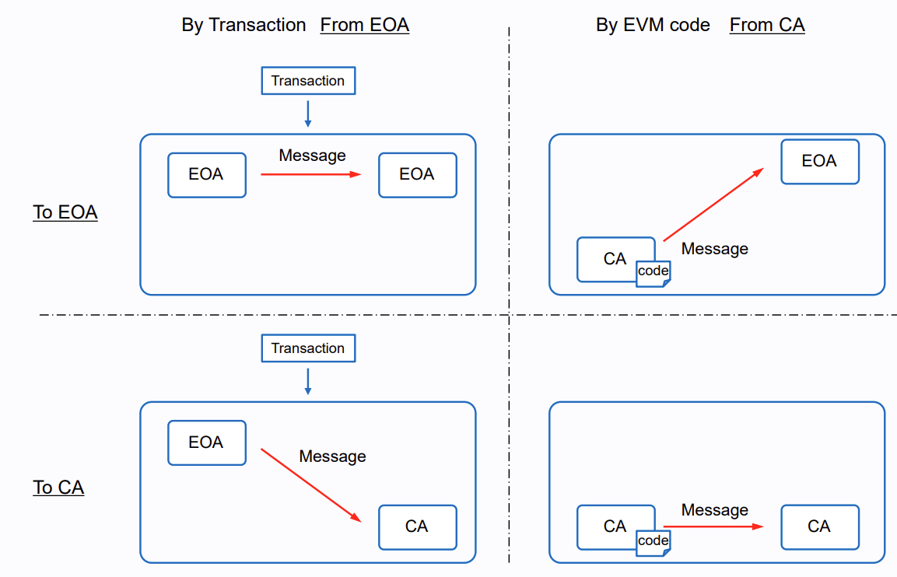

## What's a Transaction

- A Single Cryptographically Signed Instruction
- Initiated By EOA, not CA

### Lifecycle

1. Transaction Creation
   - 필요한 경우 `input data`와 `gas`를 설정함
2. Transaction Signing
   - Account Private Key로 서명함
   - 서명은 Transaction의 무결성을 보장하고 `from`을 인증하는 역할을 함
3. Transaction Propagation
   - Signed Transaction을 네트워크에 Broadcasting
   - 노드들에게 전파되어 Pending Transaction Pool에서 처리를 기다림
4. Transaction Inclusion
   - 새로운 Block에 Transaction이 포함되어야 함
5. Transaction Confirmation
   - 안전성과 신뢰성 보장을 위해 시간이 지난 후 Block State가 "justified"에서 "finalized"로 되어야 함
6. Transaction Completion
   - Transaction 수행이 실패하더라도 Gas 비용은 소모됨

 

## Transaction Fields

- `from`

  Address of Sender

  Not CA, Only EOA

- `recipient`

  Receiving Address

  Either CA or EOA

- `signature`

  Identifier of Sender

  Generated and Authorized by Sender's Private Key Sign

- `nonce`

  Sequentially Incrementing Counter

- `value`

  Amount of WEI

- `input data`

  Optionally Arbitrary Data for Code Execution

- `gas limit`

  Maximum Amount of Gas Units

- `max priority fee per gas`

  Maximum Price of Consumed Gas as Tip to Validator

- `max fee per fas`

  Maximum Fee Per Unit of Gas

```
{
  "jsonrpc": "2.0",
  "id": 2,
  "result": {
    "raw": "0xf88380018203339407a565b7ed7d7a678680a4c162885bedbb695fe080a44401a6e4000000000000000000000000000000000000000000000000000000000000001226a0223a7c9bcf5531c99be5ea7082183816eb20cfe0bbc322e97cc5c7f71ab8b20ea02aadee6b34b45bb15bc42d9c09de4a6754e7000908da72d48cc7704971491663",
    "tx": {
      "nonce": "0x0",
      "maxFeePerGas": "0x1234",
      "maxPriorityFeePerGas": "0x1234",
      "gas": "0x55555",
      "to": "0x07a565b7ed7d7a678680a4c162885bedbb695fe0",
      "value": "0x1234",
      "input": "0xabcd",
      "v": "0x26",
      "r": "0x223a7c9bcf5531c99be5ea7082183816eb20cfe0bbc322e97cc5c7f71ab8b20e",
      "s": "0x2aadee6b34b45bb15bc42d9c09de4a6754e7000908da72d48cc7704971491663",
      "hash": "0xeba2df809e7a612a0a0d444ccfa5c839624bdc00dd29e3340d46df3870f8a30e"
    }
  }
}
```


## Transaction Types



### Regulars

- From One Account to Another

### Contract Deployment



- Without `to` Field
- `data` Field for Contract Code

### Message Call



- `to` Field is Smart Contract Address


## Message



- Consisting of Data and Value

  - Data as Set of Bytes
  - Value as ETH

- Four Cases

  


## Properties

### Atomicity

- All (Complete Done) or Nothing (Zero Effect)
- Cannot Divide of Interrupt

### Order

- Executed Sequentially
- Cannot be Overlapped
- Miner Determines Order of Transactions


## References

- [Ethereum Transactions](https://ethereum.org/en/developers/docs/transactions/)
- [Takenobu Tani, "ethereum-evm-illustrated"](https://takenobu-hs.github.io/downloads/ethereum_evm_illustrated.pdf)

