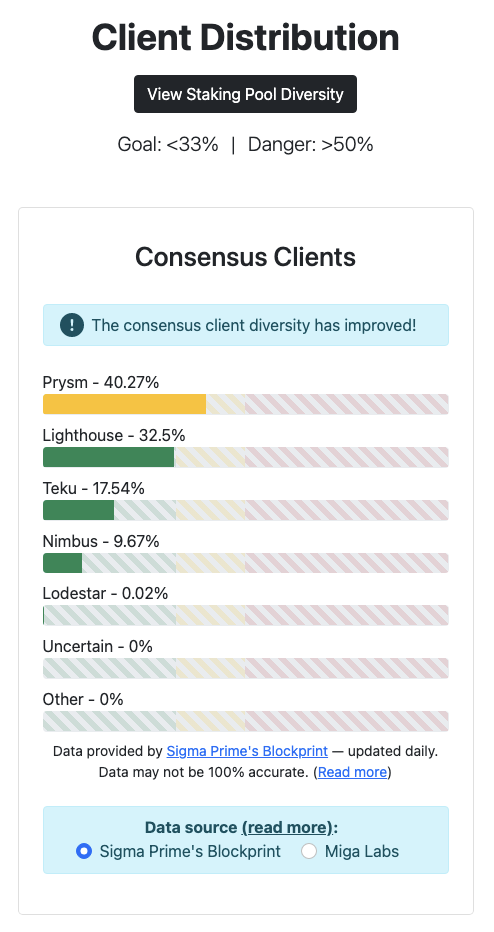
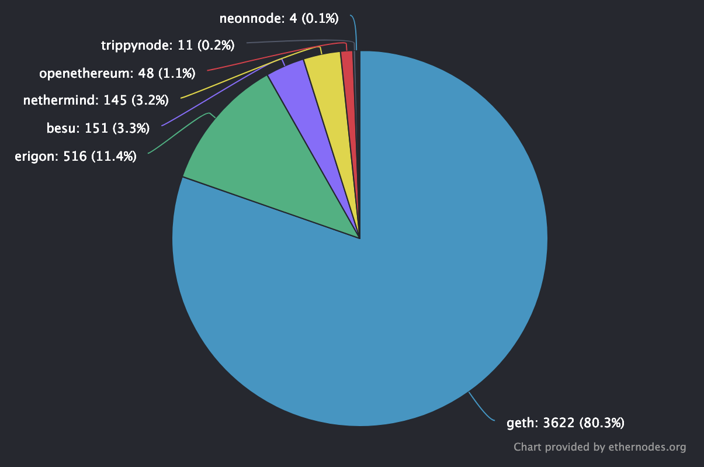

## 이더리움 클라이언트

2020.12.01 The Beacon Chain 업데이트 후, 이더리움은 Consensus Client와 Execution Client로 나뉜다. 하지만 아직 Beacon Chain의 실질적인 사용이 안되고 있으므로, 이전과 동일하게 Execution Client가 대부분의 역할을 도맡는다.

2022.07 기준 Consensus Client ([clientdiversity](https://clientdiversity.org)), Execution Client ([ethernodes](https://ethernodes.org/)) 현황은 아래와 같다.

### 1. [Geth](https://github.com/ethereum/go-ethereum)

- 이더리움 프로토콜의 Original 구현체 Go, C++, Python 중 하나
- Go언어로 구현되어 있으며, 가장 많이 사용되는 클라이언트

### 2. [Erigon](https://github.com/ledgerwatch/erigon)

- Turbo-Geth를 지향하는, Geth의 Fork된 것으로 또 다른 Go언어 구현체
- 구현 언어를 Go에서 다른 언어로 변경될 예정

### 3. [Besu](https://github.com/hyperledger/besu)

- Java로 구현된 이더리움 클라이언트
- Hyperledger에서 담당하는 프로젝트, Enterprise를 위한 Commercial 기능 존재

### 4. [Nethermind](https://github.com/NethermindEth/nethermind)

- C#로 구현된 이더리움 클라이언트

### 5. [Openethereum](https://github.com/openethereum/openethereum)

- Rust로 구현된 이더리움 클라이언트
- 깃허브에 들어가면 알 수 있듯이 Deprecated 상태이므로, 향후 사용될 일이 거의 없을 듯

## Geth Intro

이더리움 프로토콜의 보다 깊은 이해를 위해, 구현체의 코드를 살펴보며 어떻게 동작하는 지 알아볼 생각이다. Geth가 구현 클라이언트 중 가장 많이 사용되는 이유가 있을 거라고 생각하기 때문에 Geth를 토대로 살펴볼 것이다.

~~직접 Geth를 동작 시켜놓고 돌아가는 흐름을 파악하고도 싶었지만, 이더리움 노드를 구동하기 위해서는 4 Core CPU, 16GB RAM, 최소 1TB, 권장 2TB 용량이 필요하다길래.. 현재로서는 생각을 접었다.~~

Geth Github을 보면 상당히 많은 Sub-Repository들이 있다. 각각이 하나의 기능을 도맡는데, 이들 중에서도 주요한 것들을 위주로 살펴볼 생각이다. (e.g., `consensus`, `p2p` etc) [공식 Github](https://github.com/ethereum/go-ethereum)과 더불어 [Sigmoid님 Korean Geth](https://github.com/NAKsir-melody/go-ethereum-korean)도 같이 참고하였다.

