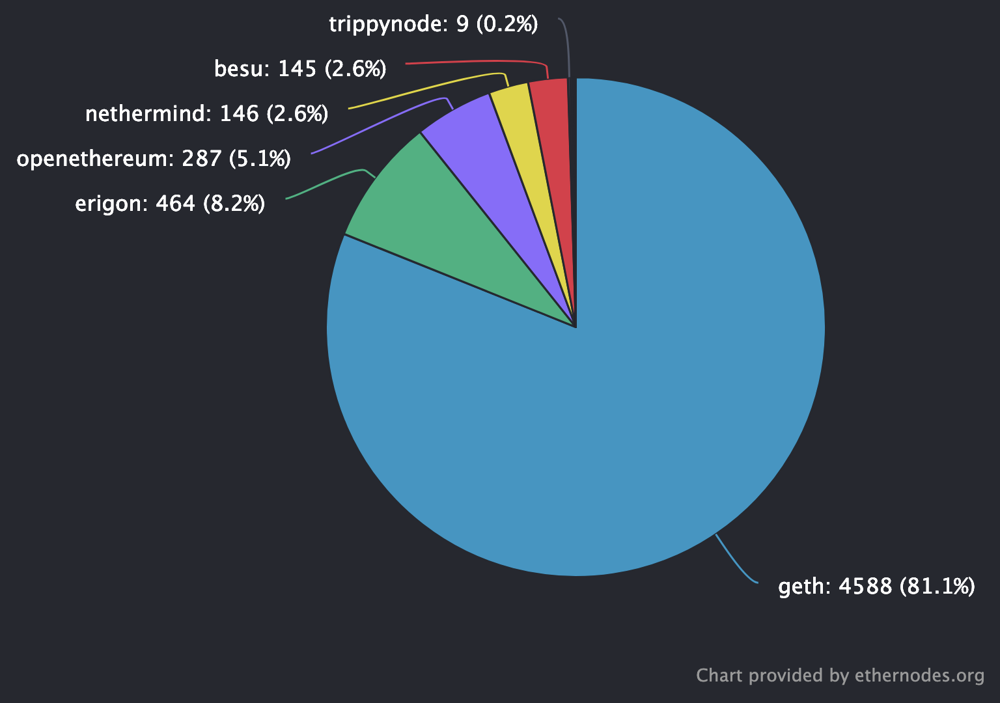
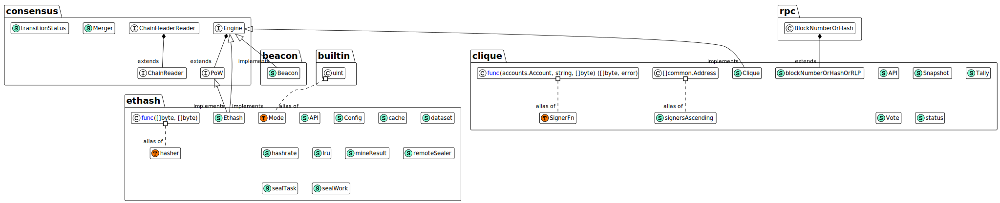
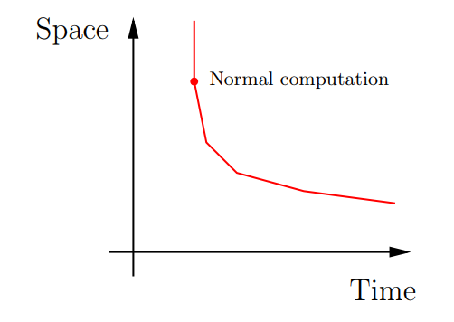
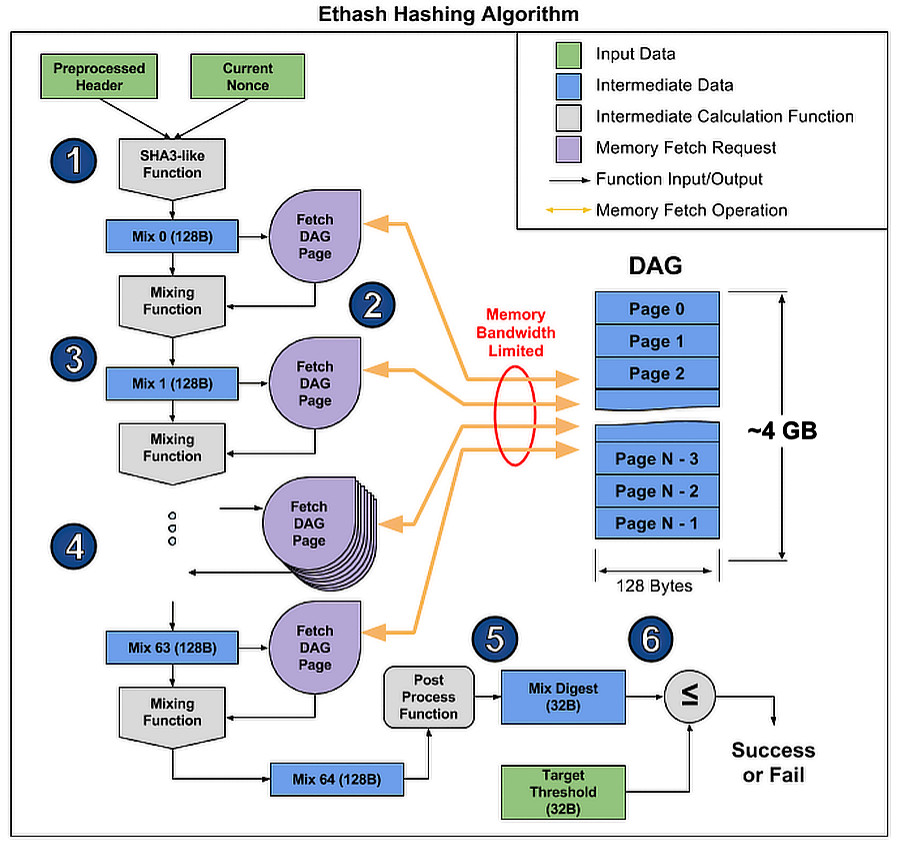

> 본 포스팅에서 사용되는 각종 자료와 코드들은 이해를 돕기 위해 간략화 된 데이터임을 미리 밝힌다.

## 이더리움 클라이언트

2020.12.01 The Beacon Chain 업데이트 후, 이더리움은 Consensus Client와 Execution Client로 나뉜다. 하지만 아직 Beacon Chain의 실질적인 사용이 안되고 있으므로, 이전과 동일하게 Execution Client가 대부분의 역할을 도맡는다.

2022.06 기준 Execution Client 현황은 아래와 같다. 출처는 [ethernodes](https://ethernodes.org/)이다.



### 1. [Geth](https://github.com/ethereum/go-ethereum)

- 이더리움 프로토콜의 Original 구현체 Go, C++, Python 중 하나
- Go언어로 구현되어 있으며, 가장 많이 사용되는 클라이언트

### 2. [Erigon](https://github.com/ledgerwatch/erigon)

- Turbo-Geth를 지향하는, Geth의 Fork된 것으로 Go언어 구현체
- 구현 언어를 Go에서 다른 언어로 사용될 예정

### 3. [Openethereum](https://github.com/openethereum/openethereum)

- Rust로 구현된 이더리움 클라이언트
- 깃허브에 들어가면 알 수 있듯이 Deprecated 상태이므로, 향후 사용될 일이 거의 없을 듯

### 4. [Nethermind](https://github.com/NethermindEth/nethermind)

- C#로 구현된 이더리움 클라이언트

### 5. [Besu](https://github.com/hyperledger/besu)

- Java로 구현된 이더리움 클라이언트
- Hyperledger에서 담당하는 프로젝트, Enterprise를 위한 Commercial 기능 존재

## Geth Intro

이더리움 프로토콜의 보다 깊은 이해를 위해, 구현체의 코드를 살펴보며 어떻게 동작하는 지 알아볼 생각이다. Geth가 구현 클라이언트 중 가장 많이 사용되는 이유가 있을 거라고 생각하기 때문에 Geth를 토대로 살펴볼 것이다.

직접 Geth를 동작 시켜놓고 돌아가는 흐름을 파악하고도 싶었지만, 이더리움 노드를 구동하기 위해서는 4 Core CPU, 16GB RAM, 최소 1TB, 권장 2TB 용량이 필요하다길래.. 현재로서는 생각을 접었다.

Geth Github을 보면 상당히 많은 Sub-Repository들이 있다. 각각이 하나의 기능을 도맡는데, 이들 중에서도 주요한 것들을 위주로 살펴볼 생각이다. (e.g., `consensus`, `p2p` etc) [공식 Github](https://github.com/ethereum/go-ethereum)과 더불어 [Sigmoid님 Korean Geth](https://github.com/NAKsir-melody/go-ethereum-korean)도 같이 참고하였다.

## Consensus

Consensus Package에는 여러 종류의 이더리움 합의 엔진에 대한 구현 모델이 있다.



합의 엔진에 대한 인터페이스인 `Engine`이 있고, 이에 대한 구현체가 3가지가 존재한다.

- Beacon

  Beacon은 기본적으로 PoS (Proof-of-Stake) 를 기반으로 한다. 다만 아직 본격적인 이더리움 2.0 동작 이전이기 때문에, 현재의 Consensus Engine과 PoS 알고리즘이 합쳐져 상황에 맞게 사용된다.

  그리고 Beacon은 자체적으로 특정 Consensus 알고리즘을 갖고 있지 않고, 외부로부터 주입받는다. 이더리움 2.0 이후에는 Consensus Client들이 될 것이고, 현재로서는 곧바로 설명할 Clique, 혹은 Ethash 둘 중 하나를 이용한다.

  ```go
  // The beacon here is a half-functional consensus engine with partial functions which
  // is only used for necessary consensus checks. The legacy consensus engine can be any
  // engine implements the consensus interface (except the beacon itself).
  type Beacon struct {
  	ethone consensus.Engine // Original consensus engine used in eth1, e.g. ethash or clique
  }
  ```

- Clique

  Clique라는 용어는 그래프 개념에서 온 것으로 생각되는데, [그래프의 Clique (클릭)](https://ko.wikipedia.org/wiki/%ED%81%B4%EB%A6%AD_(%EA%B7%B8%EB%9E%98%ED%94%84_%EC%9D%B4%EB%A1%A0)) 이란 Sub-Graph이면서 그래프 상의 임의의 두 노드가 서로 연결된 것이라고 정의한다. 즉 Complete-Graph인 Sub-Graph를 Clique이라고 한다.

  Consensus Engine 중 하나인 [Clique](https://eips.ethereum.org/EIPS/eip-225)은 PoA (Proof-of-Authority) 를 기반으로 한다. 실제 이더리움 메인넷에서는 사용하지 않지만, 테스트넷이나 프라이빗 네트워크를 구축할 때 합의 알고리즘으로 사용되곤 한다.

- Ethash

  Ethash는 현재 이더리움 메인넷에서 사용 중인 PoW (Proof-of-Work) 합의 알고리즘이다. 비트코인의 그것과 유사하지만, Ethash는 특정 회로를 가진 반도체에 유리하게 동작하지 않도록, 즉 ASIC 저항성을 갖게 하여 전문 GPU 채굴 장비를 견제한다. 이는 가능한 채굴자들이 참여할 수 있는 장벽을 낮추고, 채굴 풀을 확장시켜 탈중앙시키기 위함이다. (비트코인 Mining Power의 경우 대략 1년 전만 하더라도 51% 이상이 중국이었다. - 중국 정부가 채굴을 금지시키기 이전)


### Ethash

`Ethash` 객체는 `Engine` 인터페이스를 구현한다. 구현체를 살펴보기에 앞서서, 어떤 메서드들을 구현하는지 인터페이스를 알아보려 한다.

```go
// Engine is an algorithm agnostic consensus engine.
type Engine interface {
	// Author retrieves the Ethereum address of the account that minted the given
	// block, which may be different from the header's coinbase if a consensus
	// engine is based on signatures.
	Author(header *types.Header) (common.Address, error)

	// VerifyHeader checks whether a header conforms to the consensus rules of a
	// given engine. Verifying the seal may be done optionally here, or explicitly
	// via the VerifySeal method.
	VerifyHeader(chain ChainHeaderReader, header *types.Header, seal bool) error

	// VerifyHeaders is similar to VerifyHeader, but verifies a batch of headers
	// concurrently. The method returns a quit channel to abort the operations and
	// a results channel to retrieve the async verifications (the order is that of
	// the input slice).
	VerifyHeaders(chain ChainHeaderReader, headers []*types.Header, seals []bool) (chan<- struct{}, <-chan error)

	// VerifyUncles verifies that the given block's uncles conform to the consensus
	// rules of a given engine.
	VerifyUncles(chain ChainReader, block *types.Block) error

	// Prepare initializes the consensus fields of a block header according to the
	// rules of a particular engine. The changes are executed inline.
	Prepare(chain ChainHeaderReader, header *types.Header) error

	// Finalize runs any post-transaction state modifications (e.g. block rewards)
	// but does not assemble the block.
	//
	// Note: The block header and state database might be updated to reflect any
	// consensus rules that happen at finalization (e.g. block rewards).
	Finalize(chain ChainHeaderReader, header *types.Header, state *state.StateDB, txs []*types.Transaction,
		uncles []*types.Header)

	// FinalizeAndAssemble runs any post-transaction state modifications (e.g. block
	// rewards) and assembles the final block.
	//
	// Note: The block header and state database might be updated to reflect any
	// consensus rules that happen at finalization (e.g. block rewards).
	FinalizeAndAssemble(chain ChainHeaderReader, header *types.Header, state *state.StateDB, txs []*types.Transaction,
		uncles []*types.Header, receipts []*types.Receipt) (*types.Block, error)

	// Seal generates a new sealing request for the given input block and pushes
	// the result into the given channel.
	//
	// Note, the method returns immediately and will send the result async. More
	// than one result may also be returned depending on the consensus algorithm.
	Seal(chain ChainHeaderReader, block *types.Block, results chan<- *types.Block, stop <-chan struct{}) error

	// SealHash returns the hash of a block prior to it being sealed.
	SealHash(header *types.Header) common.Hash

	// CalcDifficulty is the difficulty adjustment algorithm. It returns the difficulty
	// that a new block should have.
	CalcDifficulty(chain ChainHeaderReader, time uint64, parent *types.Header) *big.Int

	// APIs returns the RPC APIs this consensus engine provides.
	APIs(chain ChainHeaderReader) []rpc.API

	// Close terminates any background threads maintained by the consensus engine.
	Close() error
}
```

> Uncle Block은 비트코인에서의 Orphan Block (고아 블록) 에 해당하는 것이다. 비트코인에서 해당 블록은 무효화되지만, 이더리움에서는 메인 체인의 구성 요소 중 하나로 다뤄지며 채굴에 대한 보상도 주어진다. 이에 대한 자세한 설명은 GHOST Protocol에서 살펴볼 수 있다.

`Ethash`의 주요 메서드로는 `VerifyHeader`, `VerifyUncles`, `Finalize`, `Seal` 등이 있다. 여기서 실질적으로 PoW 역할을 수행하는, Ethash 알고리즘을 사용하여 블록을 채굴하는 메서드는 `Seal`에 해당한다.

대강의 동작 구조를 아래와 같이 나타낼 수 있다.

1. 채굴할 Block Number를 토대로 Keccak256 알고리즘을 통해 Seed 값을 계산
2. 이 Seed 값을 통해 Pseudo-Random하게 Cache Data 생성
3. 이 Cache Data를 통해 Data Set 생성
4. 이 Data Set 일부를 해싱할 때 사용하여 Mining 수행

그럼 Mining하기 위해 필요한 Data Set을 생성해야 한다. 그러기 위해서는 먼저 Seed Hash Value, Cache Size, Data Set Size을 구해야 한다.

```go
const (
	datasetInitBytes   = 1 << 30 // Bytes in dataset at genesis
	datasetGrowthBytes = 1 << 23 // Dataset growth per epoch
    
	cacheInitBytes     = 1 << 24 // Bytes in cache at genesis
	cacheGrowthBytes   = 1 << 17 // Cache growth per epoch
    
	epochLength        = 30000   // Blocks per epoch
    
	mixBytes           = 128     // Width of mix
	hashBytes          = 64      // Hash length in bytes
)

// seedHash is the seed to use for generating a verification cache and the mining
// dataset.
func seedHash(block uint64) []byte {
	seed := make([]byte, 32)
	if block < epochLength {
		return seed
	}
    
    epoch := int(block / epochLength)
	keccak256 := makeHasher(sha3.NewLegacyKeccak256())
	for i := 0; i < epoch; i++ {
		keccak256(seed, seed)
	}
	return seed
}

// cacheSize returns the size of the ethash verification cache that belongs to a certain
// block number.
func cacheSize(block uint64) uint64 {
	epoch := int(block / epochLength)
	return calcCacheSize(epoch)
}

// calcCacheSize calculates the cache size for epoch. The cache size grows linearly,
// however, we always take the highest prime below the linearly growing threshold in order
// to reduce the risk of accidental regularities leading to cyclic behavior.
func calcCacheSize(epoch int) uint64 {
	size := cacheInitBytes + cacheGrowthBytes*uint64(epoch) - hashBytes
	for !new(big.Int).SetUint64(size / hashBytes).ProbablyPrime(1) { // Always accurate for n < 2^64
		size -= 2 * hashBytes
	}
	return size
}

// datasetSize returns the size of the ethash mining dataset that belongs to a certain
// block number.
func datasetSize(block uint64) uint64 {
	epoch := int(block / epochLength)
	return calcDatasetSize(epoch)
}

// calcDatasetSize calculates the dataset size for epoch. The dataset size grows linearly,
// however, we always take the highest prime below the linearly growing threshold in order
// to reduce the risk of accidental regularities leading to cyclic behavior.
func calcDatasetSize(epoch int) uint64 {
	size := datasetInitBytes + datasetGrowthBytes*uint64(epoch) - mixBytes
	for !new(big.Int).SetUint64(size / mixBytes).ProbablyPrime(1) { // Always accurate for n < 2^64
		size -= 2 * mixBytes
	}
	return size
}
```

> Cache Size와 Data Set Size의 값은 각각 Linear하게 증가하는데, 채굴하는 Block Number에 따라 설정된 Linearly Growing Threshold 값보다 작은 Highest Prime 수를 Size로 사용한다.

> 채굴하려는 Block Number가 5,660,000 일 때의 Cacahe Size를 구해보자.
>
> 1. Epoch
>    Block_Number / Epoch_Length(30000) = 188
> 2. Size Threshold
>    Cache_Init_Bytes(1 << 24) + Cache_Growth_Bytes(1 << 17) * Epoch(188) - Hash_Bytes(64) = 41,418,688
> 3. Size / Hash_Bytes == Prime Number 될 때까지
>    2 * Hash_Bytes 값만큼  Size를 감소시키며 반복
> 4. Final Size = 41,286,208 (39.37 MB)
>
> 비슷한 과정으로 Data Set Size도 구해보면 2,642,407,552 (2.46GB) 이다.

다음으로는 위에서 구한 Cache Size만큼의 Cache Data를 생성한다. 여기서  [Strict Memory Hard Hashing Functions (2014)](http://www.hashcash.org/papers/memohash.pdf) 알고리즘, 그 중에서도 RandMemoHash를 사용한다.

```pseudocode
# s: 사이즈가 D (SHA3-512인 경우 512bit) 인 Master-Secret, SHA3-512(seed)가 이에 해당
# R: 라운드 수
# N: Cache Size / Hash Bytes
# M[i]: 0 <= i <= N 인 배열, 각 셀당 D (64bytes) 만큼 저장 가능
# H: 고정된 길이의 Input 2개를 같은 길이인 하나의 Output으로 출력하는 함수 (One-Way Compression Function)

RandMemoHash(s, R, N)
(1) Set M[0] := s
(2) For i:=1 to N-1 do set M[i] := H(M[i-1])
(3) For r:=1 to R do
	(a) For b:=0 to N-1 do
		(i) p := (b-1+N) mod N
	   (ii) q := Int(M[p]) mod (N-1)
	  (iii) j := (b+1) mod N
	 (iiii) M[b] := H(M[p] || M[j])
```

실제 구현 코드는 아래와 같다.

```go
const (
	hashBytes	= 64      // Hash length in bytes
	cacheRounds	= 3       // Number of rounds in cache production
)

// generateCache creates a verification cache of a given size for an input seed.
// The cache production process involves first sequentially filling up 32 MB of
// memory, then performing two passes of Sergio Demian Lerner's RandMemoHash
// algorithm from Strict Memory Hard Hashing Functions (2014). The output is a
// set of 524288 64-byte values.
// This method places the result into dest in machine byte order.
func generateCache(dest []uint32, epoch uint64, seed []byte) {
    // Convert our destination slice to a byte buffer
	var cache []byte
	cacheHdr := (*reflect.SliceHeader)(unsafe.Pointer(&cache))
	dstHdr := (*reflect.SliceHeader)(unsafe.Pointer(&dest))
	cacheHdr.Data = dstHdr.Data
	cacheHdr.Len = dstHdr.Len * 4
	cacheHdr.Cap = dstHdr.Cap * 4
    
	// Calculate the number of theoretical rows (we'll store in one buffer nonetheless)
	size := uint64(len(cache))
	rows := int(size) / hashBytes

	// Create a hasher to reuse between invocations
	keccak512 := makeHasher(sha3.NewLegacyKeccak512())

	// Sequentially produce the initial dataset
	keccak512(cache, seed)
	for offset := uint64(hashBytes); offset < size; offset += hashBytes {
		keccak512(cache[offset:], cache[offset-hashBytes:offset])
	}
    
	// Use a low-round version of randmemohash
	temp := make([]byte, hashBytes)
	for i := 0; i < cacheRounds; i++ {
		for j := 0; j < rows; j++ {
			var (
				srcOff = ((j - 1 + rows) % rows) * hashBytes
				dstOff = j * hashBytes
				xorOff = (binary.LittleEndian.Uint32(cache[dstOff:]) % uint32(rows)) * hashBytes
			)
			bitutil.XORBytes(temp, cache[srcOff:srcOff+hashBytes], cache[xorOff:xorOff+hashBytes])
			keccak512(cache[dstOff:], temp)
		}
	}
}
```

> 위에서 계산한 Cache Size 41,286,208 (39.37 MB) 로 대략적인 흐름을 파악해보면,
>
> 1. rows
>    size / Hash_Bytes(64) = 645,097
>
> 2. 29행에서 Cache의 첫 부분을 64바이트의 해시값으로 세팅
>
> 3. 30~32행에서 1~(rows-1) 횟수만큼 Cache의 마지막 요소로 Append, 이 과정을 마치면 Cache Size가 39.37MB로 채워짐
>
> 4. 37~47행에서 RandMemoHash 알고리즘을 사용, 계산 수행에 필요한 메모리 크기에 비해, 계산에 사용할 수 있는 메모리 크기를 줄이면, 연산 속도가 기하급수적으로 증가하도록 구성
>
>    이 방법을 사용하게 되면 데이터를 생성할 때 일정량 이상의 메모리를 사용하지 않으면, 소모되는 시간이 아래 그래프처럼 기하급수적으로 증가한다. 이는 연산 비교 횟수가 급격하게 증가하게 되고, 메모리가 부족하면 디스크에 저장해야 하는데, 메모리보다 Storage에 Store & Load 하는 소요 시간이 오래 걸리기 때문이다.
>
>    

이제 이 Cache Data를 이용해서 DAG (Directed Acyclic Graph) 파일을 만든다. 한번에 큰 파일이 만들어지는 것이 아니라 Cache Data를 이용해 한번에 64bytes 데이터를 만들어 내고, 이를 앞에서 구한 Data Set Size만큼 생성하도록 반복하는 과정을 거친다. 

```go
const (
    hashBytes		   = 64      // Hash length in bytes
	hashWords          = 16      // Number of 32 bit ints in a hash
	datasetParents     = 256     // Number of parents of each dataset element
)

// generateDatasetItem combines data from 256 pseudorandomly selected cache nodes,
// and hashes that to compute a single dataset node.
func generateDatasetItem(cache []uint32, index uint32, keccak512 hasher) []byte {
	// Calculate the number of theoretical rows (we use one buffer nonetheless)
	rows := uint32(len(cache) / hashWords)

	// Initialize the mix
	mix := make([]byte, hashBytes)
	binary.LittleEndian.PutUint32(mix, cache[(index%rows)*hashWords]^index)
    
	for i := 1; i < hashWords; i++ {
		binary.LittleEndian.PutUint32(mix[i*4:], cache[(index%rows)*hashWords + uint32(i)])
	}
	keccak512(mix, mix)

	// Convert the mix to uint32s to avoid constant bit shifting
	intMix := make([]uint32, hashWords)
	for i := 0; i < len(intMix); i++ {
		intMix[i] = binary.LittleEndian.Uint32(mix[i*4:])
	}
    
	// fnv it with a lot of random cache nodes based on index
	for i := uint32(0); i < datasetParents; i++ {
		parent := fnv(index^i, intMix[i%16]) % rows
		fnvHash(intMix, cache[parent*hashWords:])
	}
    
	// Flatten the uint32 mix into a binary one and return
	for i, val := range intMix {
		binary.LittleEndian.PutUint32(mix[i*4:], val)
	}
	keccak512(mix, mix)
	return mix
}

// fnv is an algorithm inspired by the FNV hash, which in some cases is used as
// a non-associative substitute for XOR. Note that we multiply the prime with
// the full 32-bit input, in contrast with the FNV-1 spec which multiplies the
// prime with one byte (octet) in turn.
func fnv(a, b uint32) uint32 {
	return a*0x01000193 ^ b
}

// fnvHash mixes in data into mix using the ethash fnv method.
func fnvHash(mix []uint32, data []uint32) {
	for i := 0; i < len(mix); i++ {
		mix[i] = mix[i]*0x01000193 ^ data[i]
	}
}
```

> 1. 26행까지는 파라미터로 전달받은 Index에 맞춰 초기 Data Set Item을 세팅한다.
> 2. Data_Set_Parents 수 만큼 반복하면서 30행에서 FNV라는 함수로 Cache Data에 대한 Index를 Pseudo-Random하게 만든다.
> 3. 31행에서는 위에서 구한 Index를 이용해 FNV_Hash라는 함수로 Data Set Item을 만들어낸다.
> 4. 35~39행에서 위에서 구한 Data Set Item을  KECCAK-512로 해싱하여 64bytes 데이터를 반환한다.
>
> 위에서 사용된 [FNV(Fowler-Noll-Vo)](https://en.wikipedia.org/wiki/Fowler%E2%80%93Noll%E2%80%93Vo_hash_function#FNV-1a_hash) 함수는 간단하고 결과가 상대적으로 빠르게 생성되어 비암호화 해시라고 불린다. 두 개의 파라미터를 결합해 빠르게 해시를 생성하는 과정이라고 생각하면 될 것 같다.
>
> ```pseudocode
> FNV-1a:
> (1) hash := FNV_offset_basis
> (2) for byte_of_data to be hashed do
> 	(i) hash := hash * FNV_prime
>    (ii) hash := hash XOR byte_of_data
> (3) return hash
> ```
>
> - FNV_offset_basis는  `fav(a, b)` 함수에서 첫번째 파라미터를 의미
> - FNV_prime은 32bits의 경우 0x01000193 (16,777,619) 를 의미
> - byte_of_data는 함수의 두번째 파라미터를 의미

이제 Data Set Item을 이용해 전체 Data Set을 생성한다.

```go
// generateDataset generates the entire ethash dataset for mining.
// This method places the result into dest in machine byte order.
func generateDataset(dest []uint32, epoch uint64, cache []uint32) {
	// Convert our destination slice to a byte buffer
	var dataset []byte
	datasetHdr := (*reflect.SliceHeader)(unsafe.Pointer(&dataset))
	destHdr := (*reflect.SliceHeader)(unsafe.Pointer(&dest))
	datasetHdr.Data = destHdr.Data
	datasetHdr.Len = destHdr.Len * 4
	datasetHdr.Cap = destHdr.Cap * 4

	// Generate the dataset on many goroutines since it takes a while
	threads := runtime.NumCPU()
	size := uint64(len(dataset))

	var pend sync.WaitGroup
	pend.Add(threads)

	var progress uint64
	for i := 0; i < threads; i++ {
		go func(id int) {
			defer pend.Done()

			// Create a hasher to reuse between invocations
			keccak512 := makeHasher(sha3.NewLegacyKeccak512())

			// Calculate the data segment this thread should generate
			batch := (size + hashBytes*uint64(threads) - 1) / (hashBytes*uint64(threads))
			first := uint64(id) * batch
			limit := first + batch
			if limit > size/hashBytes {
				limit = size / hashBytes
			}
            
			// Calculate the dataset segment
			for index := first; index < limit; index++ {
				item := generateDatasetItem(cache, uint32(index), keccak512)
				copy(dataset[index*hashBytes:], item)
			}
		}(i)
	}
    
	// Wait for all the generators to finish and return
	pend.Wait()
}
```

> 병렬 처리를 위해 복잡하게 표현되어 있지만, 20~41행까지는 결국 Data_Set_Size / Hash_Bytes 만큼 Data Set Item 생성을 반복하는 것이다. 위에서 사용한 예시로 계산을 해보면, Data_Set_Size (2,642,407,552) / Hash_Bytes (64) = 41,287,619 만큼 반복한다. 즉  64bytes X 41,287,619, 약 2.46GB 크기의 DAG (Directed Acyclic Graph) 를 생성한다.

다음으로 Mining하는 과정을 살펴보자.

```go
// mine is the actual proof-of-work miner that searches for a nonce starting from
// seed that results in correct final block difficulty.
func (ethash *Ethash) mine(block *types.Block, id int, seed uint64, abort chan struct{}, found chan *types.Block) {
	// Extract some data from the header
	var (
		header  = block.Header()
		hash    = ethash.SealHash(header).Bytes()
		target  = new(big.Int).Div(two256, header.Difficulty)
		number  = header.Number.Uint64()
		dataset = ethash.dataset(number, false)
	)
    
	// Start generating random nonces until we abort or find a good one
	var (
		attempts  = int64(0)
		nonce     = seed
		powBuffer = new(big.Int)
    )
search:
	for {
		select {
		case <-abort:
			// Mining terminated, update stats and abort
			ethash.hashrate.Mark(attempts)
			break search

		default:
			attempts++
            
			// Compute the PoW value of this nonce
			digest, result := hashimotoFull(dataset.dataset, hash, nonce)
			if powBuffer.SetBytes(result).Cmp(target) <= 0 {
				// Correct nonce found, create a new header with it
				header = types.CopyHeader(header)
				header.Nonce = types.EncodeNonce(nonce)
				header.MixDigest = common.BytesToHash(digest)

				// Seal and return a block (if still needed)
				select {
				case found <- block.WithSeal(header):
				case <-abort:
				}
                
				break search
			}
            
			nonce++
		}
	}
    
	// Datasets are unmapped in a finalizer. Ensure that the dataset stays live
	// during sealing so it's not unmapped while being read.
	runtime.KeepAlive(dataset)
}
```

> - 전달받은 파라미터를 토대로 Block Header, Header Hash Value, PoW Target Value, Data Set 등을 추출해낸다.
> - 31~32행에서 찾고자 하는 Target Value 보다 작은 값이 나올 때까지 Nonce 값을 하나씩 증가시키며 `hashimotoFull` 함수를 호출한다.

여기까지만 보면 일반적인  PoW처럼 Target Value보다 작은 Nonce를 찾는 것처럼 보인다. 호출되는 `hashimotFull` 함수를 보면 왜 Ethash는 일반적인 Pow와 다른지 알 수 있다.

```go
const (
	mixBytes           = 128     // Width of mix
	loopAccesses       = 64      // Number of accesses in hashimoto loop
)

// hashimotoFull aggregates data from the full dataset (using the full in-memory
// dataset) in order to produce our final value for a particular header hash and
// nonce.
func hashimotoFull(dataset []uint32, hash []byte, nonce uint64) ([]byte, []byte) {
	lookup := func(index uint32) []uint32 {
		offset := index * hashWords
		return dataset[offset : offset+hashWords]
	}
	return hashimoto(hash, nonce, uint64(len(dataset))*4, lookup)
}

// hashimoto aggregates data from the full dataset in order to produce our final
// value for a particular header hash and nonce.
func hashimoto(hash []byte, nonce uint64, size uint64, lookup func(index uint32) []uint32) ([]byte, []byte) {
	// Calculate the number of theoretical rows (we use one buffer nonetheless)
	rows := uint32(size / mixBytes)

	// Combine header+nonce into a 64 byte seed
	seed := make([]byte, 40)
	copy(seed, hash)
	binary.LittleEndian.PutUint64(seed[32:], nonce)

	seed = crypto.Keccak512(seed)
	seedHead := binary.LittleEndian.Uint32(seed)

	// Start the mix with replicated seed
	mix := make([]uint32, mixBytes/4)
	for i := 0; i < len(mix); i++ {
		mix[i] = binary.LittleEndian.Uint32(seed[i%16*4:])
	}
    
	// Mix in random dataset nodes
	temp := make([]uint32, len(mix))
	for i := 0; i < loopAccesses; i++ {
		parent := fnv(uint32(i)^seedHead, mix[i%len(mix)]) % rows
		for j := uint32(0); j < mixBytes/hashBytes; j++ {
			copy(temp[j*hashWords:], lookup(2*parent+j))
		}
		fnvHash(mix, temp)
	}
    
	// Compress mix
	for i := 0; i < len(mix); i += 4 {
		mix[i/4] = fnv(fnv(fnv(mix[i], mix[i+1]), mix[i+2]), mix[i+3])
	}
	mix = mix[:len(mix)/4]

	digest := make([]byte, common.HashLength)
	for i, val := range mix {
		binary.LittleEndian.PutUint32(digest[i*4:], val)
	}
	return digest, crypto.Keccak256(append(seed, digest...))
}
```

> 
>
> 1. 35행까지의 과정으로, 전처리된 Header와 Nonce를 해싱하고, 그 값을 토대로 초기 Mix를 세팅한다.
> 2. 40~43행까지의 과정으로, 전체 DAG Data Set에서 128bytes (연속된 두 개의  DAG Page) 크기의 랜덤한 페이지를 불러온다. 이때 `lookup`함수가 사용된다.
> 3. 44행의 과정으로, Mix와 불러온 DAG Page를 FNV_Hash를 이용해 결합한다.
> 4. 위 과정을 Loop_Accesses(64) 만큼 반복한다.
> 5. 48~51행까지의 과정으로, Compress하여 32bits 결과를 생성한다.
> 6. 32bits Mix Digest 값과 Target 값을 비교하여, Target 값보다 크면 Fail로 판단하고 Nonce를 증가시켜 위의 과정을 반복한다.

다시 처음의 `Engine` 인터페이스의 `Seal` 메서드로 돌아와 구현체를 확인해보자.

```go
// Seal implements consensus.Engine, attempting to find a nonce that satisfies
// the block's difficulty requirements.
func (ethash *Ethash) Seal(chain consensus.ChainHeaderReader, block *types.Block, results chan<- *types.Block, stop <-chan struct{}) error {
	abort := make(chan struct{})
	var (
		pend   sync.WaitGroup
		locals = make(chan *types.Block)
	)
	for i := 0; i < threads; i++ {
		pend.Add(1)
		go func(id int, nonce uint64) {
			defer pend.Done()
			ethash.mine(block, id, nonce, abort, locals)
		}(i, uint64(ethash.rand.Int63()))
	}
    
	// Wait until sealing is terminated or a nonce is found
	go func() {
		var result *types.Block
		select {
		case <-stop:
			// Outside abort, stop all miner threads
			close(abort)
            
		case result = <-locals:
			// One of the threads found a block, abort all others
			select {
			case results <- result:
			default:
				ethash.config.Log.
                	Warn(
                        "Sealing result is not read by miner", 
                        "mode", "local", "sealhash", 
                        ethash.SealHash(block.Header())
                    )
			}
			close(abort)
            
		case <-ethash.update:
			// Thread count was changed on user request, restart
			close(abort)
			if err := ethash.Seal(chain, block, results, stop); err != nil {
				ethash.config.Log.Error("Failed to restart sealing after update", "err", err)
			}
		}
        
		// Wait for all miners to terminate and return the block
		pend.Wait()
	}()
    
	return nil
}
```

> - 가용한 Thread 수 만큼 `ethash.mine(id, nonce)`을 Async Call, 파라미터 중 Nonce값으로써 Int63 랜덤 Value가 전달
> - 이후 Mining 결과 값 또한 Async Call한 함수에서 받아서 전달

### Reference

- [bero님 Ethash 연구 포스팅](https://medium.com/tomak/%EC%9D%B4%EB%8D%94%EB%A6%AC%EC%9B%80-ethash-%EC%97%B0%EA%B5%AC-16677ed7da50)


