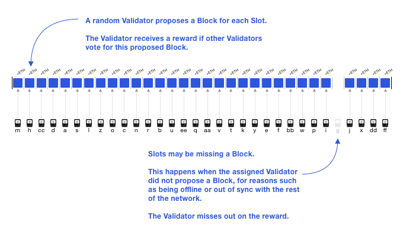

# 이더리움 2.0 : Phase 0 비콘 체인

## 이더리움 네트워크 현주소

### 네 단계의 로드맵

이더리움은 2015년에 런칭된 후, EIP (Ethereum Improvement Proposal) 를 통해 개발되고 있다. 그 중 주요한 EIP를 크게 네 가지 단계로 나누어 볼 수 있다.

1. **Frontier** Stage

   이더리움 네트워크의 첫 Live 버전을 수행하게 되는 제안으로, 네트워크 참여자가 Ether를 채굴하고, 개발자들이 Dapp과 각종 툴을 구축하는 등의 것들을 가능하도록 했다.

2. **Homestead** Stage

   네트워크의 더 나은 성능 개선을 위해, 각종 프로토콜에 대해 많은 개선이 이뤄졌고 이는 향후 남은 Stage들을 수월히 진행하기 위한 목적도 있었다.

3. **Metropolis** Stage

   현 이더리움의 단계로, Byzantium과 Constantinople 두 가지로 나뉜다.

   **Byzantium**은 네트워크에 부하가 걸리지 않고 안전하지만 더 빠르게 함을 목표로 했다. 가스비 예측이 조금 더 예측 가능해졌고, zk-SNARKs (일종의 영지식 증명 방식) 을 도입해 보안성을 강화했다.

   **Constantinople**은 위의 항목들을 더욱 개선해나갔다.

4. **Serenity** Stage

   이더리움 2.0 으로 불리는 단계로, 가장 대규모의 업데이트이다. 주로 Phase 0, 1, 2로 나뉘어 구분된다. 키워드로 간략히 설명하면, 다음과 같다.

   - Phase 0 - 비콘 체인의 도입
   - Phase 1 - 샤드 체인의 도입
   - Phase 2 - 개선안의 실제 운영

   이를 사람의 몸과 오케스트라로 비유하자면,

   - Phase 0 - 심장 / 지휘자
   - Phase 1 - 팔과 다리 / 악기
   - Phase 2 - 두뇌 / 연주자

### 현 이더리움의 한계

흔히 블록체인 기술의 트릴레마라고 칭하는 문제로, **Decentralization**, **Security**, **Scalability** 세 가지를 동시에 충족할 수 없고 한 가지는 포기해야 한다는 문제가 있다. 세 가지 특성을 모두 만족한다고 주장하는 블록체인들이 많이 개발되고 운용되고 있으나 아직 검증이 부족한 상태이다.

이더리움 또한 위의 세 가지 특성 중 확장성이 부족한 상태이다. 이더리움 네트워크 상에서 다양한 Dapp들이 동작하고 더 많은 트랜잭션이 발생하고 있어서, 초당 트랜잭션 처리 속도가 보다 빨려져야 한다. 이를 해결하기 위해 제시되는 두 가지 방안이 있다.

1. Scaling Vertically

   네트워크를 이루는 각 노드들을 더욱 고성능으로 만들어, 네트워크의 처리율을 높이는 방법

2. Scaling Horizontally

   네트워크를 이루는 노드의 수를 늘려서, 네트워크 부하를 줄이는 방법

블록체인의 탈중앙화 특성을 살리기 위해서는 Scaling Vertically의 방법은 위험하다. 각 노드들의 힘이 더욱 강력해지면 네트워크가 일부 노드들에 의해 좌지우지 될 수 있기 때문이다. 이는 PoW (Proof of Work) 채굴 방식의 문제점과도 연관이 깊다.

따라서 두 번째 방법을 채택해야 하는데, 이더리움의 구조로는 한계가 있다. 기본적으로 모든 노드가 각각의 트랜잭션을 검증하고 실행시켜야 하는 현재로서는 단순히 노드의 수를 늘린다고 해서 네트워크의 부하가 줄지 않을 것이다. 이 구조를 개선하여 확장성을 높이고, 동시에 탈중앙화와 보안성도 강화하고자 하는 개선안이 바로 이더리움 2.0 업데이트이다.

## TL;DR

- Phase 0는 오직 비콘 체인을 도입하는데 집중한다. 이를 통해 PoS (Proof of Stake) 기반으로 완전히 전환하게 된다.
- 비콘 체인은 모든 샤드 체인들의 허브 역할을 하게 되며, 연결된 모든 샤드 체인들의 합의를 책임진다.
- 샤드 체인은 이더리움 1.0 메인 체인과 같이 스마트 컨트랙트를 실행하고 자산을 전송하는 등의 실질적인 연산 기능을 수행한다.
- 비콘 체인의 블록은 Block Height 가 아니라 슬롯을 기준으로 한다. 슬롯 (Slot) 은 일종의 시간 개념으로 해당 슬롯에 블록이 있을 수도 없을 수도 있다.
- 비콘 체인을 운영하는 주체는 검증인 (Validator) 으로, 검증인들은 각 슬롯의 위원회 (Committee) 로서 랜덤하게 배정된다.
- 비콘 체인의 새로운 합의 알고리즘은 Gasper로 LMD GHOST와 Casper FFG를 결합 및 수정하였다.
- LMD GHOST는 가장 최근의 메시지를 바탕으로 하여 가장 많은 지지 (투표) 를 받은 블록이 올바른 블록으로 간주되는 Fork-choice 규칙이다.
- Casper FFG는 여러 개의 블록을 에폭 단위로 묶고, 각 에폭마다 체크 포인트를 기준으로 투표를 하여 체인의 완결성 (Finalization) 을 결정하는 알고리즘이다.
- Gasper의 블록 제안 및 검증 투표는 LMD GHOST의 방식을 따르고, Finality 부여 방식은 Casper FFG를 따른다.

## Phase 0 - Beacon Chain

### Introduction

이더리움 2.0의 첫 단계인 Phase 0의 핵심은 비콘 체인 (Beacon Chain) 의 도입이다. 향후 수 많은 샤드 체인 (Shard Chain) 들로 확장될 이더리움 2.0 체인들의 중추적인 허브 역할을 하는 비콘 체인을 성공적으로 동작시키는 것이 Phase 0의 주요 목표이다. Phase 0에서는 아래와 같이 비콘 체인의 운영과 관련된 부분들만 포함되어 있다.

- 검증자 (Validator) 들과 보증금 (Stake) 관리
- 위원회 (Committee) 와 제안자 (Proposer) 구성
- 합의 알고리즘 (Consensus Rules) 적용
- 검증자에 대한 보상과 처벌

따라서 Phase 0을 이해하기 위해서는 비콘 체인의 구조와 역할, 그리고 사용되는 합의 알고리즘에 대한 이해가 필요하다.

### Sharding

Phase 0의 주요 포인트인 비콘 체인을 설명하기 앞서, 간략히 샤딩에 대해 알고 있으면 수월하다.

Sharding은 DB 분야에서 사용되는 용어로, 규모가 큰 데이터에 접근할 때 마치 파티션을 나누듯이 여러 조각으로 나누어 데이터를 더 빠르게 접근하고 처리하여 효율성을 높이는 데에 사용한다.

이더리움에서도 위의 특성을 살려 샤드 체인을 도입하고자 한다. 샤드 체인은 마치 우리 몸의 손과 발 역할과 유사하게, 이더리움 1.0 체인에서 수행하던 자산의 전송이나 임의의 프로그램 실행 역할을 각 샤드 체인이 수행하게 된다. 즉, 샤드 체인은 트랜잭션을 처리하는 노드들의 일부로서, 이더리움 1.0 체인 상에서 모든 트랜잭션을 모든 노드가 처리하는 기존 구조를 개선하여, 트랜잭션들을 여러 조각으로 나누어 일부 노드들이 처리하도록 만드는 것이다.

이렇게 트랜잭션을 처리하는 체인을 여러 체인들로 나누어 운영하게 되면 아무래도 보안에 취약해질 수 있다. 하나의 큰 체인이었던 기존의 이더리움 1.0 체인에 비해, 샤드 체인의 규모가 비교적 작으므로 악의적인 블록 검증자가 하나의 샤드 체인을 조정하는 것이 수월해 질 수 있기 때문이다. 이를 해결하는 역할을 비콘 체인에서 수행하며, 그 구현체가 Gasper 합의 알고리즘과 지분 증명의 도입이다.

### Beacon Chain

비콘 체인은 이더리움 2.0의 심장으로, Phase 0 이후 도입될 수 많은 샤드 체인들의 합의를 책임지는 시스템 체인이자 중심 체인 (Spine Chain) 이다. 기존의 이더리움 1.0의 체인과 달리 PoS 기반으로 운영되며, 이에 참여하는 검증인들은 비콘 체인 및 샤드 체인의 블록들을 검증하는 역할을 수행한다. 이 과정에서 비콘 체인은 검증인들을 랜덤하게 배정하기 위한 난수 생성 프로토콜을 수행하기도 한다. 물론 비콘 체인은 합의 구성하고 책임지는 목적이기 때문에 이더리움 1.0과 달리 임의의 프로그램을 실행할 수 있는 것들은 다루지 않는다.

### Slot and Epoch

기존의 이더리움 1.0의 경우 블록 높이 (Block Height) 라는 개념을 사용했다. 높이는 말 그대로 일련의 블록들을 제네시스 블록의 높이를 0으로 기준하여 하나씩 증가시켜 기록하는 것을 말한다. 반드시 차례대로 증가하기 때문에 특정 높이를 건너뛴 상태에서 다음 높이의 블록이 생길 수 없다. 하지만 이더리움 2.0 부터는 슬롯과 에폭이라는 개념을 사용한다.

슬롯 (Slot) 은 블록의 제안자 (Block Proposer) 가 검증 (Attestation) 을 받기 위해 블록을 제출할 수 있는 일정 기간을 의미한다. 따라서 슬롯은 얼마든지 비어있을 수도 있고, 검증된 블록으로 채워 질 수도 있다.

에폭 (Epoch) 은 여러 개의 슬롯으로 이뤄진 하나의 큰 주기이며, 각 에폭마다 검증인들이 랜덤하게 여러 위원회 (Committee) 로 구분되어 선정된다.

각 슬롯은 약 12초 동안의 시간이며, 한 에폭당 슬롯의 수는 32개 (약 6.4분) 이다.

### Validator and Attestation

기존 이더리움의 PoW에서는 하드웨어를 이용해 블록을 생성하는 채굴자가  주요 역할을 수행했다면, 이더리움 2.0에서는 검증자 (Validator) 가 PoS에서의 가상의 채굴자 (Virtual Miner) 로서 참여한다. **가상**인 이유는 각 검증인은 실제로 하드웨어 연산에 의해 채굴을 하는 것이 아닌 맡긴 보증금 (Stake) 를 토대로 블록 생성 과정에 참여하기 때문이다.

검증인으로 참여하기 위해서는 이더리움 1.0 메인 체인의 예치 컨트랙트 (Deposit Contract) 에 32 ETH를 예치해야 한다. 예치한 32 ETH 마다 하나의 검증인 자격이 활성화되는 구조다. 각 검증인은 비콘 체인을 운영하는 핵심 주체로서, 랜덤하게 블록 제안자, 위원회 등으로 선정되어 블록 제안 및 검증을 수행한다.

검증자 중 블록 제안자로 선정된 자는 할당된 슬롯에서 블록을 제안할 수 있다. 블록이 제안되면, 나머지 검증자들이 투표 (Attestation) 를 함으로써 지지를 표한다. 그리고 블록 제안자가 오프라인이거나 네트워크 싱크를 맞추고 있거나 하는 등의 어떤 이유로 인해, 어느 슬롯에는 제안된 블록이 없을 수 있다.

### Crosslink

크로스링크는 샤드 체인 블록의 상태들이 주기적으로 비콘 체인에 기록되기 위한 참조 (Reference) 역할을 하는 데이터이다. 만약 크로스링크가 없다면 해당 샤드 체인의 블록들은 비콘 체인에서 기록된 것이 아니기 때문에 완결성 (Finality) 가 보장되지 않는다. 하지만 정상적으로 크로스링크가 비콘 블록에 기록되고, 해당 비콘 블록이 완결되면 크로스링크에 해당되는 모든 샤드 블록들 또한 완결된다.

### Randomness - RANDAO

이더리움 2.0에서는 검증자를 배정하는 과정에서 예측하지 못하도록 랜덤하게 선정하는 것이 중요하다. 그래서 Phase 0에서 편향되지 않은 랜덤값을 생성하기 위해 Commit-Reveal 방식인 RANDAO (Random Decentralized Autonomous Organization) 을 이용한다.

RANDAO에 참여하는 참가자들은 비밀값을 해싱한 해시값만을 우선적으로 등록 (Commit) 한다. 이어서 차례대로 해시값과 일치하는 비밀값을 공개 (Reveal) 하여, 비밀값들을 XOR 연산하여 랜덤값을 생성한다.

여기서 마지막 공개자는 자신의 비밀값을 공개하거나 비공개하여 자신에게 유리한 값이 생성되도록 유도할 수 있다. 이를 방지하기 위해 추후 Phase에서 VDF (Verifiable Delay Function, 검증 가능한 지연 함수) 를 도입하여 랜덤값을 산출하는 연산을 지연시켜 마지막 공개자도 예측할 수 없도록 하는 방법이 도입될 예정이다. 하지만 Phase 0 에서는 오직 RANDAO만 적용된다.

### Block Propser and Committee

RANDAO를 이용해 블록 제안자와 블록 검증을 위한 위원회가 구성된다.

매 에폭마다 검증자들은 슬롯들에 균등하게 배정되고, 각 슬롯에서 검증자들은 여러 위원회 중 하나에 속하게 된다. 즉, 하나의 에폭에서 각 검증자들은 오직 하나의 위원회에만 속할 수 있다. (각 위원회는 보안 및 공격 방지를 위해, 비콘 체인과 샤드 체인의 각 슬롯마다 적어도 128 명 이상의 검증자로 이뤄져야 한다.)

블록 제안자 (Block Propser) 는 랜덤하게 검증자 중의 한 명으로 배정되어, 검증 대상 블록을 제안하는 역할을 수행한다. 비콘 체인과 각 샤드 체인의 슬롯마다 하나의 제안자가 배정된다. 위원회 (Committee) 는 랜덤하게 선정된 검증자들로 이뤄진 집단으로, 비콘 체인과 샤드 체인 블록의 유효성을 검증하는 역할을 수행한다. 그리고 각 비콘 체인의 위원회는 랜덤하게 하나의 샤드에 배정되어 해당 샤드를 비콘 블록에 크로스링크 해야 한다.

예를 들어 16384 명의 검증자가 있다고 해보자. 하나의 에폭은 32개의 슬롯으로 이뤄져 있으므로 각 슬롯에는 512 명의 검증자가 랜덤하게 배정된다. 그리고 하나의 슬롯에 배정된 검증자들은 위원회 최소 인원 기준에 맞춰, 4개의 위원회로 랜덤하게 배정된다. 이 슬롯이 샤드 33, 55, 22, 11을 담당한다면, 첫 번째 위원회는 샤드 33을 크로스링크하도록 시도할 것이고, 두 번째 위원회는 샤드 55를, 다음 위원회는 샤드 22를, 마지막 위원회는 샤드 11을 크로스링크할 것이다.

### Consensus Introduction

위에서 검증자의 역할을 분배하는 부분을 살펴봤다면, 이제부터는 각 검증자가 맡은 역할을 수행하는 과정을 살펴보자.

이더리움 2.0 비콘 체인의 합의 알고리즘으로 사용될 Gasper는 완전한 지분 증명 기반의 합의 프로토콜이다. 기존에 논의되었던 Casper FFG의 경우 블록을 제안하는 과정에서 작업 증명 방식이 사용되었으나, Gasper는 모든 과정에서 작업 증명 과정을 필요로 하지 않는다.

Gasper는 완결성 (Finality) 를 보장하기 위한 Casper FFG와 포크 선택 규칙 (Fork-Choice Rule) 을 위한 LMD GHOST를 수정 및 결합했다. 본격적으로 Gasper를 살펴보기 전에 먼저 핵심 구성 요소인 LMD GHOST와 Casper FFG를 먼저 알아보자.

### LMD GHOST

LMD GHOST (Latest Message Driven Greedies Heaviest Observed Sub Tree) 는 가장 최근의 메시지를 기반으로 하여 가장 많은 참가자가 선택한 체인을 따르도록 하는 것이 핵심이다.

먼저 검증인 A, B, C, D, E 가 있고 각 검증인들은 순서대로 0번째 슬롯부터 블록을 제안할 수 있다. LMD GHOST를 따르는 클라이언트는 각 검증인이 서명한 가장 최근의 메시지, 즉 가장 높은 슬롯의 블록을 기준으로만 판단한다. 다음 그림에서는 최근의 메시지를 파란색을 띄고 있다.

제네시스 블록부터 시작해서 최근 메시지 중 가장 많은 수가 지지하는 쪽의 분기를 선택하고, 이를 계속해서 자식 블록이 없을 때까지 반복한다. 이 과정을 통해 현재 체인의 헤드 (Head) 가 무엇인지 결정할 수 있다. 가장 왼쪽에 검증인 A가 제안한 블록이 슬롯 `k`에 속한다고 한다면, 위 그림은 슬롯 `k` 부터 `k+9`까지를 표현한 것이다. 위 블록들 중에서 제니시스 블록에 가장 가까운 슬롯 `k`에 속한 블록부터 따져보면, 가장 먼저 분기가 발생하는 곳은 슬롯 `k+1` 직후이다. 여기서 가장 최근의 메시지를 기준으로, 위쪽 분기는 검증인 1명이 지지하고, 아래쪽 분기는 검증인 4명이 지지하고 있으므로 클라이언트는 아래쪽 분기를 선택한다. 이어서 슬롯 `k+4` 이후의 분기에서는 가운데 분기가 가장 많은 검증인이 지지하므로 클라이언트는 해당 분기를 선택한다.

사실 잘 작동하는 네트워크, 즉 고아 블록의 발생률 (Orphan Rate) 가 낮은 경우에는 LMD GHOST와 Longest Chain Rule (비트코인이 사용 중인 규칙으로, 가장 긴 체인이 올바른 것으로 간주) 의 적용 결과가 거의 동일하다. 하지만 네트워크 상황이 좋지 않을 경우 결과는 많이 달라진다.

체인의 길이를 기준으로 분기를 결정할 경우, 가장 위쪽의 체인이 높이가 6으로 가장 길기 때문에 올바른 체인이 된다.

LMD GHOST를 적용할 경우, 아래 체인이 최근의 메시지 중 가장 많은 지지를 받고 있기 때문에 올바른 것으로 간주된다. 예시처럼 LMD GHOST는 지연율이 높은 네트워크 상황에서 올바른 포크를 보다 올바르게 선택할 수 있다는 점에서 이점이 있다.

### Casper FFG

Casper FFG (Casper the Friendly Finality Gadget) 는 PoS 기반의 하이브리드 합의 알고리즘이다. 기존에 이더리움 2.0의 합의 알고리즘으로 채택 예정이었던 만큼 Gasper의 핵심적인 완결성 부여 방식 등은 모두 Casper FFG를 바탕으로 하고 있다.

Casper FFG의 전체적인 동작 과정은 다음과 같다. 여러 개의 블록들로 구성된 에폭이 존재하고, 각 에폭의 마지막 블록은 체크 포인트가 된다. 검증인들은 이 체크 포인트에 대한 합의를 위해 투표를 진행하고, 2/3 보다 많은 투표가 모이면 해당 체크 포인트는 Justified 되고, 부모 체크 포인트까지의 블록들은 모두 Finalized 되는 구조이다.

검증인의 투표 (Casper FFG Vote) 메시지는 다음과 같이 구성된다.

- `source`: Justified 된 체크 포인트
- `target`: `source`의 자식 블록으로, 검증인이 지지하는 체크 포인트
- `height(source)`: 체크 포인트 트리에서 `source`의 높이
- `height(target)`: 체크 포인트 트리에서 `target`의 높이
- `Signature`: 위 네 가지 요소를 검증인이 서명한 값

이때 `source`와 `target`은 반드시 인접한 체크 포인트이어야만 하는 것은 아니다.

### Supermajority Link

만약 두 체크 포인트 `(source, target)` 간에 검증인들 중 2/3 보다 많은 수가 투표했을 경우, `(source, target)`는 Supermajority Link가 되며, 이때 `target`은 Justified된다.

그리고 `source`가 Finalized 되기 위해서는 이미 `source`가 Justified 된 상태이고, `source`와 `target`이 인접한 에폭의 체크 포인트이며, `(source, target)`이 Supermajority Link 가 되어야 한다. 즉, `height(target) = height(source) + 1` 을 만족해야 한다.

### Slashing Condition

Casper FFG의 삭감 조건은 두 가지다. 첫째는 동일한 높이에 충돌하는 두 개의 다른 체크 포인트를 투표할 수 없다는 것이다. 둘째는 하나의 체크 포인트 쌍 `(source1, target1)`의 높이 `height(source1)`와 `height(target1)` 사이에 있는 쌍 `(source2, target2)`에 투표할 수 없다는 것이다.

일부 검증인이 위의 조건을 위반하여 보증금을 삭감당하는 것을 무릎쓰지 않는 이상, 두 개의 다른 분기에 있는 체크 포인트가 모두 Finalized 되는 것은 불가능하다. 이를 통해 항상 새로운 체크 포인트가 Finalized 될 수 있고, 새로운 블록이 계속해서 생성될 수 있기 때문에 Liveness 도 보장된다.

### Gasper

앞서 설명한 LMD GHOST 와 Casper FFG 를 활용하여 새로운 합의 프로토콜인 Gasper 가 어떻게 동작하는지 살펴보자.

### Epoch Boundary Blocks

비콘 체인의 경우 체크 포인트는 각 에폭의 첫 번째 슬롯에 속한 블록이 된다. 만약 해당 슬롯에 블록이 없다면, 그보다 앞선 슬롯 중에서 가장 최근의 블록이 체크 포인트가 된다. 여기서 에폭의 체크 포인트 블록은 하나이어야 하지만, 어느 블록은 여러 에폭의 체크 포인트가 될 수 있다.

위 그림에서 슬롯 65 부터 128 까지는 제안된 블록 없이 비어있는 상황이다. 에폭 2의 체크 포인트는 슬롯 128에 속한 블록이어야 하지만, 블록이 없으므로 그보다 앞선 블록 중 가장 최근 블록인 슬롯 64 에 속한 블록이 체크 포인트가 된다. 에폭 3도 비슷하게, 슬롯 192 가 비어있으므로 가장 최근 블록인 슬롯 180 에 속한 블록이 체크 포인트가 된다. 각 에폭 당 체크 포인트는 하나이지만, 슬롯 64에 속한 블록처럼 해당 블록이 여러 에폭의 체크 포인트가 될 수 있다.

EBB (Epoch Boundary Blocks, 에폭 경계 블록) 은 해당 에폭의 체크 포인트를 가르키는 용어이다. EBP (Epoch Boudary Pairs, 에폭 경계 페어) 는 EBB와 해당 블록이 포함된 에폭 위치를 순서쌍 형태로 표현하는 용어이다. EBP 는 Casper FFG의 체크 포인트와 같은 역할을 수행한다. 블록 기준이 아닌 페어를 기준으로 하는 이유는 Gasper에서 한 에폭에 블록이 하나도 존재하지 않을 수도 있기 때문이다.

### Hybrid LMD GHOST

Gasper에서 블록을 제안하고 검증하는 과정에서 모두 동일한 포크 선택 규칙인 Hybrid LMD GHOST를 따른다. HLMD GHOST는 기존의 LMD GHOST를 소폭 변경한 버전이다.

먼저 현재까지 확인한 Justified 된 페어 중에서 가장 높은 에폭의 페어를 선택한다. 이를 기준으로 하여, 가장 최근의 메시지들을 취합하여 해당 블록의 자식 블록이 없을 때까지 가장 많은 수의 메시지가 지지하는 블록을 찾는 과정을 반복한다.

### Block Proposal

에폭 `j` 의  `k` 번째 위원회에 속한 첫 번째 검증인인 제안자 P 는 슬롯 `i`에서 HLMD GHOST 를 통해 블록 Bp를 계산한다. 이 경우 제안자 P 의 관점에서 Bp가 올바른 체인의 헤드일 것이다. 이어서 새로운 블록 B 를 제안하는데, 해당 제안 메시지가 포함하는 내용은 다음과 같다.

- `slot(B) = i`

  블록 B의 슬롯 넘버가 `i`임을 의미한다.

- `Parent(B) = Bp`

  블록 B의 부모 블록을 의미한다. (즉, 제안하는 블록 B의 부모 블록이 HLMD GHOST 결과 선택된 블록)

- `newattests(B)`

  제안자 P가 받은 블록 B에 대한 모든 검증 투표 (Attestations) 의 포인터들을 의미한다.

- 구현과 관련된 임의의 데이터

### Block Attestation

슬롯 `i`에서 `i+1`로 넘어가기 전 제안자 P를 제외한 해당 위원회에 속한 나머지 검증인들은 모두 HLMD GHOST를 통해 각자의 블록 B'를 계산한다. 그리고 검증 투표 `α`를 전파한다. Attestation `α`는 다음과 같이 구성된다.

- `slot(α) = j * C + k` (`C`는 에폭에 포함된 슬롯의 수)

  위 수식은 `에폭 넘버 * 에폭 당 슬롯 수 * 위원회가 할당된 슬롯 넘버`이므로, 해당 검증인이 검증을 하느 시점의 슬롯을 의미한다.

- `block(α) = B'`

  검증 투표 대상이 되는 블록을 의미한다. 블록 B'은 각 검증인마다 다를 수 있고, 해당 슬록의 제안자가 제안한 블록 B와도 다를 수 있다.

여기서 `slot(block(α)) <= slot(α)`를 만족하는데, 그 이유는 검증 투표 대상이 되는 블록이 항상 해당 슬롯에 제안된 블록이 아닐 수도 있기 때문이다. 만약 지연율이 매우 낮고 네트워크에 문제가 없다면 두 값은 같을 것이다.

### Justification

앞서 다룬 검증 메시지 `α`에서 다음과 같은 두 가지 페어를 알 수 있다.

- Last Justified Pair of `α` (`LJ(α)`)

  `α`를 바탕으로 마지막 에폭 경계 블록을 계산할 수 있다. 계산된 블록의 Justified 된 Parent 블록 중 마지막 Justified 페어를 의미한다.

- Last Epoch Boundary Pair of `α` (`LE(α)`)

이제 `α`를 통해 체크 포인트 쌍 `(LJ(α), LE(α))` 을 구성할 수 있다. `α`는 `block(α)`을 검증하는 메시지이자만, 동시에 체크 포인트 검증을 하는 것이기도 하다.

### Finalization

어떤 페어 `(B0, j)`에 대해 다음과 같은 조건을 만족할 때 `(B0, j)`는 Finalized 되었다고 정의한다. (`k`는 1 이상의 정수)

- `(B0, j), (B1, j+1), ... , (Bk, j+k)`가 모두 인접한 에폭 경계 페어이다.
- `(B0, j), (B1, j+1), ... , (Bk, j+k)`가 모두 Justified 된 상태이다.
- `(B0, j)`에서 `(Bk, j+k)`로 Supermajority Link가 성립한다.

즉, 에폭 경계 페어 `(B0, j)`와  `(Bk, j+k)`를 포함한 그 사이의 인접한 에폭 경계 페어들이 모두 Justified 되었고, Supermajority Link가 성립했을 때 `(B0, j)`가 Finalized 되었다고 할 수 있다.

기존의 Casper FFG의 경우 `k=1`인 경우만을 고려했지만, Gasper에서는 이외의 경우들도 고려한다. 이를 `k-Finality Rule`이라고 지칭하는데, 지연율이 높거나 특정 에폭에서 검증 투표의 전파에 지연이 발생하는 경우 등 다양한 상황들을 모두 반영하기 위함이다.

다음 그림은 Justification 과 Finalization 과정을 간략히 설명하는 그림이다.

### Wrap Up

매 에폭마다 검증인들은 균등하게 슬롯으로 나눠지고, 각 슬롯에서 적당한 규모의 위원회로 배정된다. 에폭 기준으로, 검증인은 오직 하나의 슬롯과 하나의 위원회에만 속할 수 있다. 그리고 각 검증인이 수행하는 역할은 다음과 같다.

- 각 에폭에 속한 모든 검증인들이 동일한 체크 포인트를 Finalized (FFG Vote)
- 각 슬롯에 속한 모든 검증인들이 동일한 비콘 체인 헤드를 지지 (LMD GHOST Vote)
- 각 위원회에 속한 모든 검증인들이 개별의 샤드 체인을 Crosslink

이러디움 2.0의 Phase 0은 지분 증명으로의 전환이 본격적으로 시작되는 매우 중요한 단계이다. 이더리움 2.0의 본격적인도입이 초읽기에 들어온 만큼, 이후 생태계가 어떤한 모습으로 변할지 살펴보면 좋을 것 같다.

## Reference

[Onther Medium Post](https://medium.com/onther-tech/%EC%9D%B4%EB%8D%94%EB%A6%AC%EC%9B%802-0-%EA%B9%8A%EC%9D%B4%EB%B3%B4%EA%B8%B0-%EC%8B%9C%EB%A6%AC%EC%A6%88-eth-2-0-explained-phase-0-1%ED%8E%B8-74ee5659a40a)

[Consensys Blog](https://consensys.net/blog/news/the-ethereum-2-0-beacon-chain-explained/)

[ChainSafe Medium Post](https://medium.com/chainsafe-systems/ethereum-2-0-a-complete-guide-d46d8ac914ce)

[Ethereum 2.0 Devs Handbook](https://notes.ethereum.org/@serenity/handbook?type=view#-Ethereum-20-Devs-Handbook-and-FAQs)

[Ethereum 2.0 Info](https://hackmd.io/e4cNiocFTiS67j6yJ_XHPw?view)

