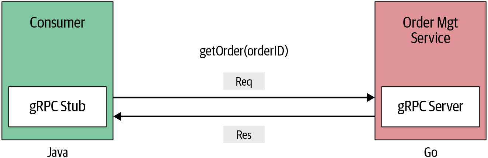
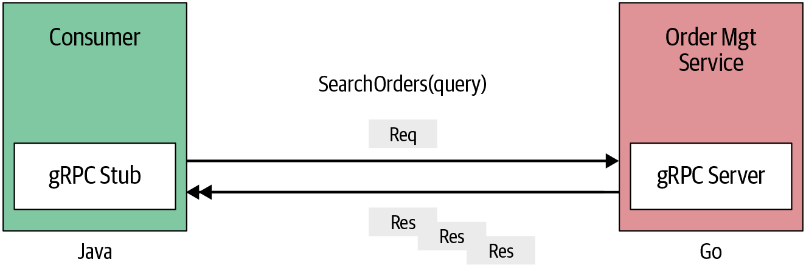
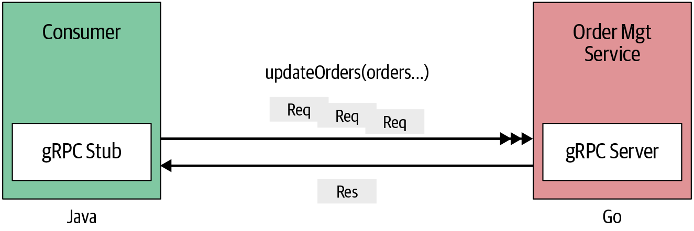
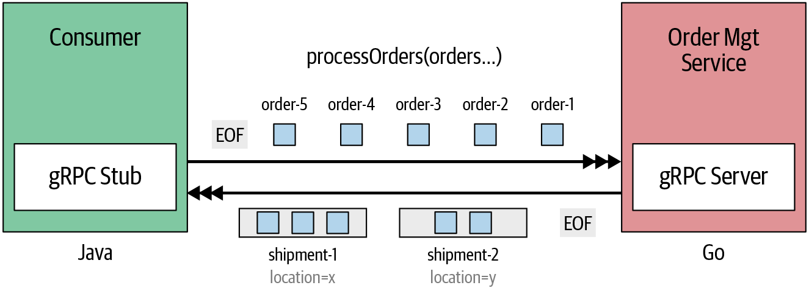
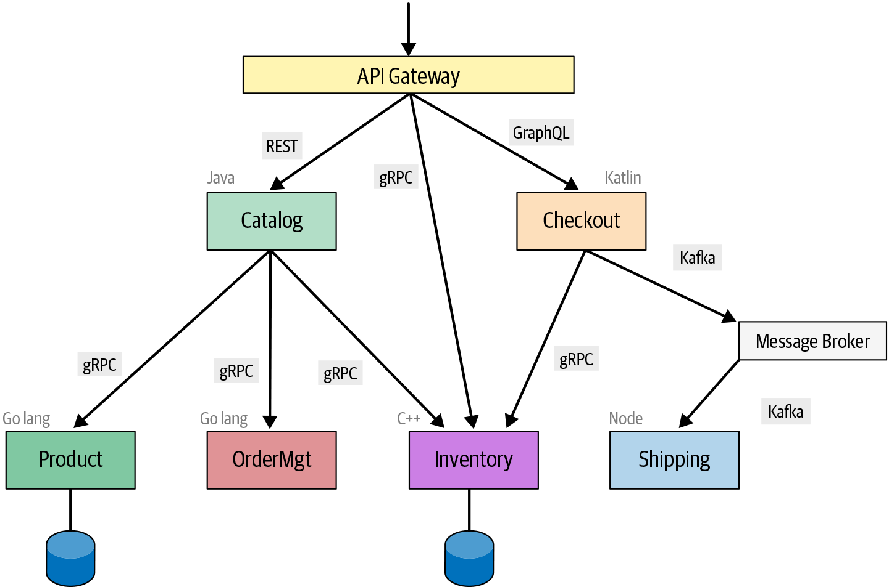
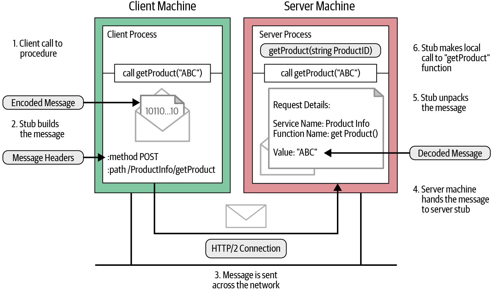
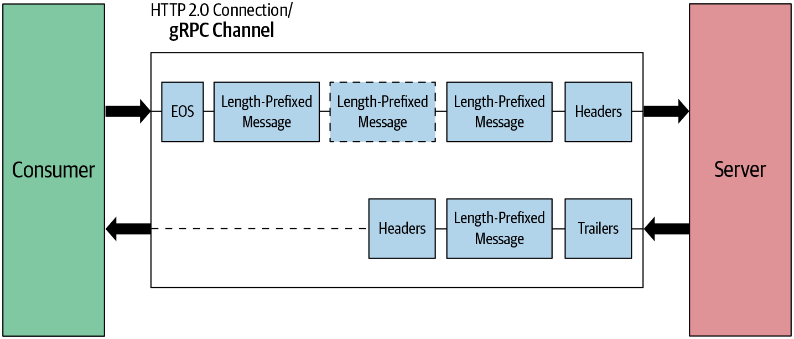

# gRPC Concept

## gRPC 통신 패턴

일반적으로 클라이언트와 서버 건의 통신 패턴은 간단한 요청-응답 스타일의 통신으로, 하나의 요청에 대해 단일 응답을 수신 받는다. 그러나 gRPC를 사용한다면 다른 프로세스 간 통신 패턴을 활용할 수 있다.

### 단일 RPC

이 패턴에서는 클라이언트가 서버의 리모트 메서드를 호출하고자 단일 요청을 서버로 보내고, State에 대한 세부 사항 및 Trailing 메타데이터를 단일 응답으로 받는다. 단순 RPC 패턴은 간단하여 대부분의 프로세스 간 통신 Use Case에 적합하다.



```protobuf
syntax = "proto3";

import "google/protobuf/wrappers.proto";

package ecommerce;

service OrderManagement {
    rpc getOrder(google.protobuf.StringValue) returns (Order);
}

message Order {
    string id = 1;
    repeated string items = 2; 4
    string description = 3;
    float price = 4;
    string destination = 5;
}
```

- 외부 패키지를 Import하여 `StringValue`와 같은 Known-Type을 사용한다.

### 서버 스트리밍 RPC

이 패턴에서는 서버가 클라이언트의 요청 메시지를 받은 후, 일련의 응답 (a.k.a. Stream) 을 보낸다. 모든 응답을 보낸 후에 서버는 클라이언트에 서버의 상태 정보를 Trailing 메타데이터로 전송하여 스트림의 끝을 알린다.

이번 예제는 주문 검색 기능인데, 소비자가 요청을 보내면 서버는 요청에 맞는 주문을 찾는대로 응답을 보내는 형식이다.



```protobuf
syntax = "proto3";

import "google/protobuf/wrappers.proto";

package ecommerce;

service OrderManagement {
    ...
    rpc searchOrders(google.protobuf.StringValue) returns (stream Order);
    ...
}

message Order {
    string id = 1;
    repeated string items = 2;
    string description = 3;
    float price = 4;
    string destination = 5;
}
```

```go
/* Server */
func (s *server) SearchOrders(searchQuery *wrappers.StringValue, stream pb.OrderManagement_SearchOrdersServer) error {
	for key, order := range orderMap {
		for _, item := range order.Items {
			if strings.Contains(item, searchQuery.Value) {
				err := stream.Send(&order) // Send the matching orders in a stream
				if err != nil {
				   return fmt.Errorf("error sending message to stream : %v", err)
				}
				break
			}
		}
	}
	return nil
}
```

- 메서드의 두번째 파라미터가 스트림 객체에 대한 Reference 역할을 한다. 이 객체를 통해 여러 응답을 보낼 수 있다.

```go
/* Client */
// Setting up a connection to the server.
...
	c := pb.NewOrderManagementClient(conn)
...
     searchStream, _ := c.SearchOrders(ctx, &wrapper.StringValue{Value: "Google"})

	for {
		searchOrder, err := searchStream.Recv()
		if err == io.EOF {
			break
		}
		log.Print("Search Result : ", searchOrder)
	}
```

### 클라이언트 스트리밍 RPC

이 패턴에서는 클라이언트가 하나의 요청이 아닌 여러 메시지를 서버로 보내고, 서버는 클라이언트에게 단일 응답을 보낸다. 그러나 서버는 모든 요청 메시지를 수신할 때까지 기다릴 필요는 없다. 구현 로직에 따라 하나 또는 여러 개의 메시지를 읽은 후 응답을 보내면 된다.

이번 예제에서는 소비자가 주문 정보 일부에 대해 변경 요청을 보내면 서버는 요청에 맞게 주문을 업데이트하고 갱신된 주문 목록을 응답으로 반환한다.



```protobuf
syntax = "proto3";

import "google/protobuf/wrappers.proto";

package ecommerce;

service OrderManagement {
...
    rpc updateOrders(stream Order) returns (google.protobuf.StringValue);
...
}

message Order {
    string id = 1;
    repeated string items = 2;
    string description = 3;
    float price = 4;
    string destination = 5;
}
```

```go
/* Server */
func (s *server) UpdateOrders(stream pb.OrderManagement_UpdateOrdersServer) error {
	ordersStr := "Updated Order IDs : "
	for {
		order, err := stream.Recv()
		if err == io.EOF { // Finished reading the order stream.
			return stream.SendAndClose(&wrapper.StringValue{Value: "Orders processed " + ordersStr})
		}
        
		orderMap[order.Id] = *order
		ordersStr += order.Id + ", "
	}
}
```

- 이 경우 클라이언트가 보낸 요청을 모두 수신하고 `SendAndClose` 메서드를 호출하여 스트림 끝을 표시한다.

  만약 스트림 중간에 서버가 중단하고자 한다면, 클라이언트가 메시지 전송을 멈출 수 있도록 서버는 스트림을 취소해야 한다.

```go
// Setting up a connection to the server.
...
	c := pb.NewOrderManagementClient(conn)
...
    updateStream, err := client.UpdateOrders(ctx)
	if err != nil {
		log.Fatalf("%v.UpdateOrders(_) = _, %v", client, err)
	}

	// Updating order 1
	if err := updateStream.Send(&updOrder1); err != nil {
		log.Fatalf("%v.Send(%v) = %v", updateStream, updOrder1, err)
	}

	// Updating order 2
	if err := updateStream.Send(&updOrder2); err != nil {
		log.Fatalf("%v.Send(%v) = %v", updateStream, updOrder2, err)
	}

	// Updating order 3
	if err := updateStream.Send(&updOrder3); err != nil {
		log.Fatalf("%v.Send(%v) = %v", updateStream, updOrder3, err)
	}

	updateRes, err := updateStream.CloseAndRecv()
	if err != nil {
		log.Fatalf("%v.CloseAndRecv() got error %v, want %v", updateStream, err, nil)
	}

	log.Printf("Update Orders Res : %s", updateRes)
```

### 양방향 스트리밍 RPC

이 패턴에서 클라이언트는 메시지 스트림으로 서버에 요청을 보내고, 서버는 메시지 스트림으로 응답한다. 최초 호출은 클라이언트에서 시작하고, 그 이후의 통신은 구현하기 나름이다.

이 예제에서는 소비자가 여러 주문으로 요청 메시지를 보내면 서비스는 요청 받은 주문들 중 배송 위치 기준으로 주문들을 결합하여 응답한다.



- 서비스는 요청받은 주문 ID에 대해 각 주문을 처리하고 주문의 배송 정보에 따라 주문을 결합한 Shipment로 구성한다.

- 주문은 배치 방식으로 처리되는데, 배치 크기에 도달하면 현재 생성된 모든 Shipment들을 클라이언트에 전송한다.

  예를 들어 위치 X로 보내져야할 두 개의 주문과 위치 Y로 보내질 두 개의 주문이 `X X Y X Y` 순서로 스트림되고 배치 크기가 2이라고 하면, 주문은 배송 [X, X, X], 배송 [Y, Y]로 결합된다.

```protobuf
syntax = "proto3";

import "google/protobuf/wrappers.proto";

package ecommerce;

service OrderManagement {
    ...
    rpc processOrders(stream google.protobuf.StringValue) returns (stream CombinedShipment);
}

message Order {
    string id = 1;
    repeated string items = 2;
    string description = 3;
    float price = 4;
    string destination = 5;
}

message CombinedShipment {
    string id = 1;
    string status = 2;
    repeated Order ordersList = 3;
}
```

```go
/* Server */
func (s *server) ProcessOrders(stream pb.OrderManagement_ProcessOrdersServer) error {
	batchMarker := 1
    combinedShipmentMap := make(map[string]pb.CombinedShipment)
    
	for {
		orderId, err := stream.Recv()
		if err == io.EOF {
			for _, comb := range combinedShipmentMap {
				stream.Send(&comb)
			}
			return nil
		}
		if err != nil {
			return err
		}

		// Logic to organize orders into shipments,
		// based on the destination.

		if batchMarker == orderBatchSize {
			// Stream combined orders to the client in batches
			for _, comb := range combinedShipmentMap {
				// Send combined shipment to the client
				stream.Send(&comb)
			}
			batchMarker = 0
			combinedShipmentMap = make(map[string]pb.CombinedShipment)
		} else {
			batchMarker++
		}
	}
}
```

```go
/* Client */
func main() {
    ...
    streamProcOrder, _ := c.ProcessOrders(ctx)

	if err := streamProcOrder.Send(&wrapper.StringValue{Value:"102"}); err != nil {
		log.Fatalf("%v.Send(%v) = %v", client, "102", err)
	}

	if err := streamProcOrder.Send(&wrapper.StringValue{Value:"103"}); err != nil {
		log.Fatalf("%v.Send(%v) = %v", client, "103", err)
	}

	if err := streamProcOrder.Send(&wrapper.StringValue{Value:"104"}); err != nil {
		log.Fatalf("%v.Send(%v) = %v", client, "104", err)
	}

	signal := make(chan struct{})
    go asncClientBidirectionalRPC(streamProcOrder, channel)
    time.Sleep(time.Millisecond * 1000)

	if err := streamProcOrder.Send(&wrapper.StringValue{Value:"101"}); err != nil {
		log.Fatalf("%v.Send(%v) = %v", client, "101", err)
	}

	if err := streamProcOrder.CloseSend(); err != nil {
		log.Fatal(err)
	}

    signal <- struct{}{}
    ...
}

func asncClientBidirectionalRPC (streamProcOrder pb.OrderManagement_ProcessOrdersClient, signal chan struct{}) {
	for {
		combinedShipment, errProcOrder := streamProcOrder.Recv()
		if errProcOrder == io.EOF {
			break
		}
		log.Printf("Combined shipment : ", combinedShipment.OrdersList)
	}
	<-signal
}
```

- 클라이언트와 서비스가 동일한 스트림에 대해 순서와 상관없이 읽고 쓸 수 있다는 점이 핵심이다.

  다시 말해 초기 연결이 설정된 후에는 클라이언트와 서비스 간의 통신 패턴을 결정하는 것은 전적으로 구현에 달려있다는 것이다.

### 마이크로서비스 통신을 위한 gRPC

gRPC의 주요 활용처 중 하나는 마이크로서비스들 간의 통신을 구현하는 것이다. 일반적으로 gRPC는 다른 통신 프로토콜과 함께 사용된다.



- `Catalog`와 `Checkout` 같은 서비스는 `API Gateway`에 의해 RESTful 혹은 GraphQL를 기반으로 인터페이스를 노출한다.
- gRPC 인터페이스를 외부에 노출하는 경우는 흔하지 않지만, 가능은 하다.

## gRPC 동작 원리

### RPC 흐름

RPC 시스템에서 서버는 리모트 호출 메서드의 기능을 구현하며, 클라이어언트는 서버에서 제공하는 메서드에 대해 추상화된 Stub을 생성해 호출한다.



1. 클라이언트 프로세스는 Stub에 있는 `getProduct` 메서드를 호출한다.

2. 클라이언트 Stub은 인코딩 메시지로 HTTP POST 요청을 생성한다.

   gRPC에서는 모든 요청이 `application/grpc` Content Type을 가지며, 호출하는 리모트 메서드에 대한 정보 `/ProductInfo/getProduct`를 별도의 HTTP 헤더에 담는다.

3. POST 요청은 네트워크를 통해 서버 머신으로 전송된다.

4. 서버는 메시지 헤더를 검사해 어떤 서비스 메서드를 호출해야 하는지 확인하고, 메시지를 서비스 Stub에 넘긴다.

5. 서비스 Stub은 메시지 바이트를 언어별 데이터 구조로 파싱한다.

6. 파싱된 메시지를 사용해 `getProduct` 메서드를 로컬로 호출한다.

7. 해당 메서드의 반환 값이 인코딩되어 다시 클라이언트로 전송된다.

위의 절차는 CORBA, 자바 RMI 등과 같은 대부분의 RPC 시스템과 매우 유사하다. 주요한 gRPC 차이점은 프로토콜 버퍼를 이용해 메시지를 인코딩한다는 점이다.

### 메시지 Encoding

아래의 예제처럼, gRPC는 프로토콜 버퍼를 사용해 서비스 정의를 작성하며, 해당 정의에 따라 각 언어별 컴파일러로 메시지를 인코딩하고 바이트로 변환한다.

```protobuf
syntax = "proto3";

package ecommerce;

service ProductInfo {
   rpc getProduct(ProductID) returns (Product);
}

message Product {
   string id = 1;
   string name = 2;
   string description = 3;
   float price = 4;
}

message ProductID {
    string value = 1;
}
```

각 메시지는 여러 필드들 가지는데, 각각은 필드 식별자 (a.k.a. `tag`) 와 인코딩된 값으로 이루어져 있다. 아래 이미지는 메시지의 바이트 구성을 나타낸 것이다.


1. 메시지 필드의 태그들은 Field Index와 Wire Type으로 구성된다. Field Index는 프로토 파일에서 메시지를 정의할 때 각 메시지 필드에 할당한 고유 번호를 의미한다. Wire Type은 필드가 가질 수 있는 데이터 타입인 필드 타입을 기반으로 한다. ([참고](https://developers.google.com/protocol-buffers/docs/encoding))

   | Wire Type | Category         | Field Types                                              |
   | --------- | ---------------- | -------------------------------------------------------- |
   | 0         | Varint           | int32, int64, uint32, uint64, sint32, sint64, bool, enum |
   | 1         | 64-bit           | fixed64, sfixed64, double                                |
   | 2         | Length-delimited | string, bytes, embedded messages, packed repeated fields |
   | 3         | Start group      | groups (deprecated)                                      |
   | 4         | End group        | groups (deprecated)                                      |
   | 5         | 32-bit           | fixed32, sfixed32, float                                 |

   위 표를 참고하여, 메시지 필드의 태그 값은 아래의 식을 통해 계산된다.

   ```
   Tag_value = (Field_index << 3) | Wire_type
   ```

   

2. 메세지 필드의 Tag 값을 구하는 방법은 알아봤으니, 이제 Value 값을 알아볼 차례다. 프로토콜 버퍼는 여러 데이터 타입에 따라 다른 인코딩 기술을 사용한다.

   - Signed Integer
   - Variable Length Integers
   - No Variable Length Integers
   - Length Delimited

### 메시지 Framing

일반적으로 메시지 Framing 방식은 통신하는 상대가 정보를 쉽게 파악할 수 있도록 데이터를 패키징하는 것이다. gRPC에서는 네트워크를 통해 전송할 메시지를 패키지화하고자 Length-Prefix Framing 기술을 사용한다.


인코딩된 바이너리 메시지 앞에 메시지 크기를 지정하고자 4바이트가 할당된다. 이를 통해 메시지 크기를 명시할 수 있고, 최대 4GB 크기의 메시지를 처리할 수 있음을 알 수 있다.

메시지 크기 외에도 데이터의 압축 여부를 나타내기 위해 1바이트도 할당된다. Compressed-Flag 값이 1인 경우는 HTTP Transport에서 선언된 헤더 중 Message-Endcoding에 선언된 메커니즘을 사용해 바이너리 데이터가 압축되었음을 나타낸다.

### HTTP/2를 통한  gRPC

gRPC는 HTTP/2를 전송 프로토콜로 사용해 네트워크를 통해 베시지를 보내는데, 이는 gRPC가 고성능 RPC 프레임워크인 이유 중 하나다.

> HTTP/2에서 클라이언트와 서버 간의 모든 통신은 단일 TCP 연결을 통해 처리된다. 더불어 프로세스를 이해하기 위해서는 아래와 같은 HTTP/2 용어를 알고 있어야 한다.
>
> - 프레임
>
>   HTTP/2에서 가장 작은 통신 단위로, 각 프레임에는 프레임 헤더가 포함돼 있으며 헤더를 통해 프레임이 속한 스트림을 식별한다.
>
> - 메시지
>
>   하나 이상의 프레임으로 구성된 논리적 HTTP 메시지에 매핑되는 프레임 시퀀스다. 이는 클라이언트와 서버가 메시지를 독립 프레임으로, 그리고 다시 조립할 수 있는 Interleave와 Multiplexing을 지원한다.
>
> - 스트림
>
>   설정된 연결에서의 양방향 바이트 흐름이며, 스트림은 하나 이상의 메시지를 전달할 수 있다.


위 그림에서 gRPC 채널은 HTTP/2 연결인 엔드포인트에 대한 연결을 나타낸다. 클라이언트 애플리케이션이 gRPC 채널을 만들면 내부적으로 서버와 HTTP/2 연결을 맺고, 채널 생성 후에는 여러 개의 리모트 메서드 호출을 할 수 있도록 재사용된다. 이러한 리모트 호출은 HTTP/2 스트림으로 처리되며, 더 Low-Level로는 HTTP/2 프레임으로 전송된다. 그리고 프레임은 하나 이상의 gRPC DATA 메시지를 보낸다.

- Request Message

  요청 메시지는 리모트 호출을 시작하는 메시지며, gRPC에서 요청 메시지는 항상 클라이언트 애플리케이션에 의해 트리거 된다.

  

  위와 같이 주요 요소는 요청 헤더, 고정 길이 메시지, 스트림 종료 플래그이다. 클라이언트가 요청 헤더를 보내면 리모트 호출이 시작되고, 고정 길이 메시지들이 해당 호출로 전송 (HTTP/2 DATA 프레임) 된다. 마지막 메시지에는 스트림 종료 플래그가 함께 전송되어, 메시지의 끝을 알린다.

  ```
  HEADERS (flags = END_HEADERS)
  :method = POST
  :scheme = http
  :path = /ProductInfo/getProduct
  :authority = abc.com
  te = trailers
  grpc-timeout = 1S
  content-type = application/grpc
  grpc-encoding = gzip
  authorization = Bearer xxxxxx
  ```

  ```
  DATA (flags = END_STREAM)
  <Length-Prefixed Message>
  ```

- Response Message

  

  대부분의 경우 요청 메시지와 유사하게 응답 헤더, 길이 지정 메시지, 트레일러의 세 가지 주요 요소로 구성된다. 서버가 응답 헤더를 보낸 후, 해당 호출의  HTTP/2 DATA 프레임으로 길이 지정 메시지들이 전송된다. 그리고 요청 메시지와는 달리, 스트림의 끝을 알리는 플래그는 DATA 프레임에 함께 보내지지 않으며, 별도의 헤더 Trailer로 전송된다. 결국 Trailer는 클라이언트에게 응답 메시지 전송이 완료되었음을 알리고자 사용된다.

  ```
  HEADERS (flags = END_HEADERS)
  :status = 200
  grpc-encoding = gzip
  content-type = application/grpc
  ```

  ```
  DATA
  <Length-Prefixed Message>
  ```

  ```
  HEADERS (flags = END_STREAM, END_HEADERS)
  grpc-status = 0 # OK
  grpc-message = xxxxxx
  ```

### gRPC 통신 패턴에서의 메시지 흐름

- 단일 RPC

  

  이 패턴에서는 항상 단일 요청과 단일 응답이 일어난다. 클라이언트 측에서 Half-Close Connection하려면 요청 메시지 끝에 스트림 종료 플래그를 추가한다. 이 상태에서 클라이언트는 더이상 서버로 메시지를 보낼 수 없지만, 서버에서 들어오는 메시지는 수신한다. 서버는 클라이언트로부터 전체 메시지를 받은 후에만 응답 메시지를 전송하며, 트레일러 헤더를 끝으로 통신이 종료된다.

- 서버 스트리밍 RPC

  

  이 패턴은 클라이언트 관점에서는 위 패턴과 별반 다를게 없으나, 서버 입장에서는 요청 메시지 전부를 수신한 후 응답 헤더와 여러 개의 길이 지정 메시지들을 전송하는 점이 다르다.

- 클라이언트 스트리밍 RPC

  

  이 패턴은 위와 반대로 클라이언트가 여러 메시지를 보내고, 서버는 응답으로하나의 응답 메시지만을 보낸다.

- 양방향 스트림 RPC

  

  이 패턴에서는 최초 클라이언트가 헤더 프레임을 전송해 연결을 맺는다. 그 이후 클라이언트와 서버는 모두 상대방이 전송한 메시지를 끝날 때까지 기다리지 않고, 각자 길이 지정 메시지들을 보낸다.

### gRPC 구현 아키텍처

아래와 같이 gRPC 구현은 여러 레이어로 구성되고, 기반이 되는 곳은 gRPC Core 레이어다. 이 레이어는 상위 레이어의 모든 네트워크 작업을 추상화하여, 애플리케이션 개발자는 Transparent하게 RPC 호출을 할 수 있도록 도와준다.


gRPC는 C/C++, Go, Java 언어를 기본적으로 지원하고 파이썬, 루비, PHP 등에 대한 바인딩을 지원한다. 이런 언어 바인딩은 Low-Level C API에 대한 Wrapper를 의미한다.

