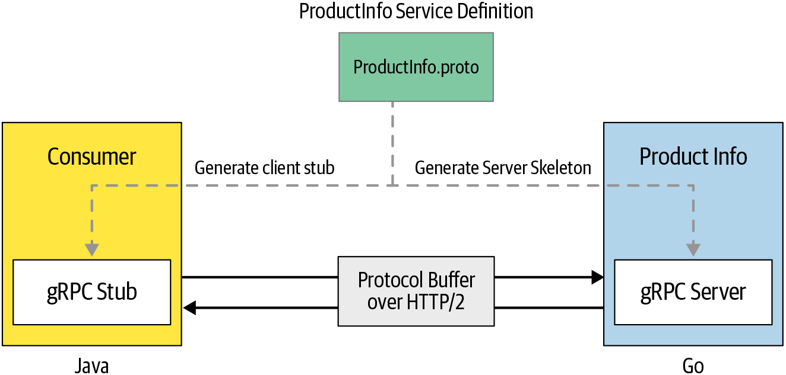
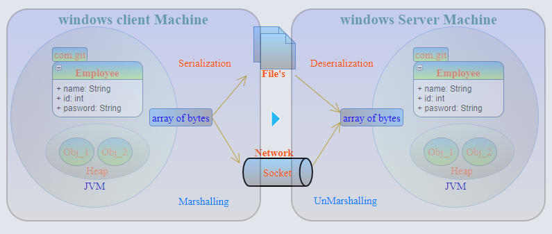
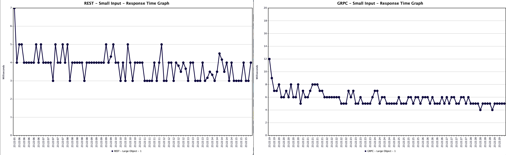
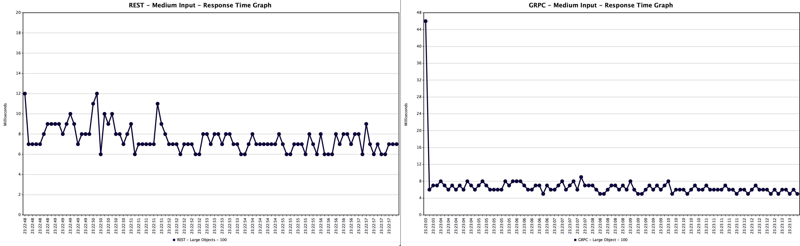
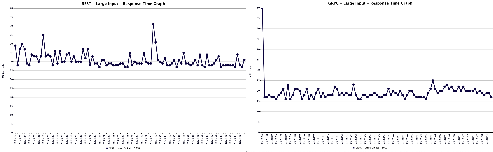
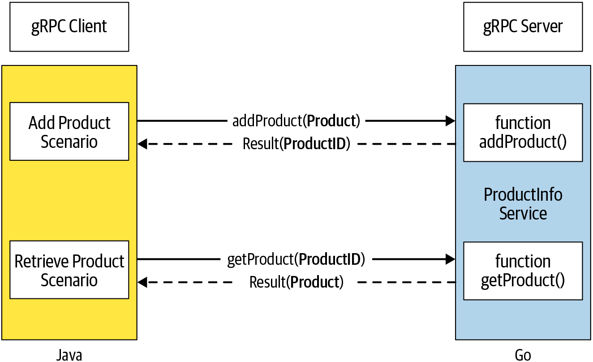

# gRPC Intro

현대 SW 애플리케이션은 여러 네트워크 위치에서 실행되고 다양한 통신 프로토콜을 사용한 분산 애플리케이션으로 이루어진다. 이러한 마이크로서비스 기반으로 구축되는 시스템은 프로세스간 통신 기술을 사용해 네트워크로 연결되어야 한다. (e.g., 커머스 앱에 주문 관리, 검색, 결제 등의 여러 서비스로 구성) 프로세스 간 통신은 두 가지 스타일이 있다.

- 동기적 요청-응답 스타일

  클라이언트 프로세스가 서버에 요청 메시지를 보내고 응답을 기다림

- 비동기적 방식의 이벤트 기반 스타일

  이벤트 브로커라는 중개자를 통해 메시지를 비동기적으로 전달함

주로 동기식 통신 방식은 RESTful 서비스로 구축되지만, 메시지의 부피가 크고 비효율적이며 에러가 쉽게 발생하는 한계가 있다. 이로인해 보다 효율적이고 확장성이 높은, 느슨하게 결합되는 통신 기술에 대한 니즈가 생겼고 gRPC가 탄생한 배경이다. (세밀한 비교는 뒤에서 다룬다.) gRPC는 주로 통신에 동기적 방식을 사용하지만, 초기 커넥션이 설정되면 비동기식이나 스트림 기반 모드로도 작동할 수 있다.

## gRPC 통신 구조

gRPC ([`g`는 릴리스마다 다른 의미를 갖는다.](https://github.com/grpc/grpc/blob/master/doc/g_stands_for.md)) 는 로컬 함수를 호출하는 것만큼 쉽게 리모트 애플리케이션 연결, 호출, 운영, 디버깅할 수 있는 프로세스 간 통신 기술이다. 대략적인 gRPC 애플리케이션 구조는 아래와 같다.



1. **서비스 인터페이스** 정의

   `ProductInfo.proto` 파일에 정의, 이는 통신 계층의 추상화로, 특정 언어나 서비스에 의존적이지 않음

2. 서비스 정의를 토대로 **서버 스켈레톤**과 **클라이언트 스텁** 생성

   `proto` 파일에 명시된 정의에 맞춰 구현

3. 메시지 전송 (요청 및 응답)

   서버와 클라이언트 간의 통신은 HTTP/2를 통해 이루어짐

### 서비스 정의

gRPC는 Protocol Buffers를 IDL (Interface Definition Language) 로 사용해 서비스 인터페이스를 정의한다. 이 프로토콜 버퍼는 플랫폼 중립적으로, 구조화된 데이터를 직렬화하고자 사용된다. 서비스 정의는 `*.proto`라는 일반 텍스트 파일에 표현되며, 이를 통해 프로토콜 버퍼 형식으로 사용된다.

```proto
// ProductInfo.proto
syntax = "proto3";
package ecommerce;

service ProductInfo {
    rpc addProduct(Product) returns (ProductID);
    rpc getProduct(ProductID) returns (Product);
}

message Product {
    string id = 1;
    string name = 2;
    string description = 3;
}

message ProductID {
    string value = 1;
}
```

- 프로토콜 버퍼의 버전을 지정 - `proto3`

- 프로토콜 메시지 타입 사이의 이름 충돌을 방지하고자 패키지 이름을 사용 - `ecommerce`

- gRPC 서비스 인터페이스 정의 - `ProductInfo`

  인터페이스는 리모트 호출될 메서드를 포함한다.

- 서비스에 사용될 커스텀 타입을 정의 - `Product`, `ProductID`

인터페이스의 메서드 파라미터는 [Well-Known 타입](https://cloud.google.com/dotnet/docs/reference/Google.Protobuf/latest/Google.Protobuf.WellKnownTypes), 커스텀 타입 모두 가능하다. 이런 타입들은 메시지로 구조화되는데, 각 메시지는 필드라고 하는 일련의 이름-값 형태의 레코드이다. 이때 메시지 바이너리 형식에서 필드를 식별하기 위한 고유 필드 번호가 필요하기에 `string id = 1`과 같이 명시해 주어야 한다.

### gRPC 서버

서비스 정의가 완료되면 이를 토대로, 프로토콜 버퍼 컴파일러인 `protoc`를 사용해 서버 측이나 클라이언트 측 코드를 생성할 수 있다. 서버 측에서는 서비스 정의에 맞춰 서비스 스켈레톤을 생성 후, gRPC 서버를 실행해 클라이언트 요청을 수신하고 응답해야 한다.

```go
import (
   ...
   "context"
   pb "github.com/grpc-up-and-running/samples/ch02/productinfo/go/proto"
   "google.golang.org/grpc"
   ...
)

// ProductInfo implementation with Go

// Add product remote method
func (s *server) AddProduct(ctx context.Context, in *pb.Product) (*pb.ProductID, error) {
    // ...business logic
}

// Get product remote method
func (s *server) GetProduct(ctx context.Context, in *pb.ProductID) (*pb.Product, error) {
    // ...business logic
}
```

```go
func main() {
    lis, _ := net.Listen("tcp", port)
    s := grpc.NewServer()
    pb.RegisterProductInfoServer(s, &server{})
    if err := s.Serve(lis); err != nil {
        log.Fatalf("failed to serve: %v", err)
    }
}
```

### gRPC 클라이언트

서버 측과 마찬가지로 서비스 정의를 사용해 클라이언트 스텁을 생성한다. 이 스텁은 서버와 동일한 메서드로 이루어지는데, 클라이언트 코드에서 메서드들의 호출을 네트워크 상의 리모트 함수 호출로 변환하는 과정을 담당한다.

```java
// Create a channel using remote server address
ManagedChannel channel = ManagedChannelBuilder.forAddress("localhost", 8080)
    .usePlaintext(true)
    .build();

// Initialize blocking stub using the channel
ProductInfoGrpc.ProductInfoBlockingStub stub = ProductInfoGrpc.newBlockingStub(channel);

// Call remote method using the blocking stub
StringValue productID = stub.addProduct(Product.newBuilder()
        .setName("Apple iPhone 11")
        .setDescription("Meet Apple iPhone 11." +
            "All-new dual-camera system with " +
            "Ultra Wide and Night mode.")
        .build());
```

### 클라이언트-서버 메시지 흐름

gRPC 클라이언트가 gRPC 서비스를 호출할 때 클라이언트의 gRPC 라이브러리는 프로토콜 버퍼를 사용해 원격 프로시저 호출 프로토콜 버퍼 형식으로 마샬링하고, HTTP/2를 통해 전송된다. 서버 측에서는 요청을 언마샬링하고 각 프로시저 호출은 프로토콜 버퍼에 의해 실행한다. 응답도 마찬가지의 과정을 거친다. 전송 프로토콜로는 고성능 바이너리 프로토콜인 HTTP/2를 사용한다. (이 둘의 관계에 대해서는 이어지는 포스팅에서 다루려 한다.)

> **Serialization vs Marshalling** [Reference](https://donghyeon.dev/2020/11/07/%EC%A7%81%EB%A0%AC%ED%99%94%EC%99%80-%EB%A7%88%EC%83%AC%EB%A7%81/)
>
> 이 둘의 공통점은 객체를 다른 곳으로 전송하거나, 저장하기 위해 사용된다는 것이다. 둘은 거의 비슷하지만, 마샬링이 직렬화보다 더 큰 범위를 나타내며, 직렬화는 마샬링의 한 부분이다.
>
> 
>
> 직렬화는 객체의 필드를 바이너리 형식이나 바이트 스트림으로 바꾸는 작업을 말한다. 굳이 바이트 스트림이 아니어도 파일이나, 메모리, 데이터베이스 등으로 바꾸는 작업도 포함한다. 여기서 중요한 점은 직렬화되는 대상이 객체의 값 혹은 컨텐츠라는 것이며, 클래스 정의는 포함되지 않는다. 그러므로 메서드 같은 정보는 직렬화되지 않는다.
>
> 마샬링은 직렬화와 거의 비슷한데, 다른 점은 코드베이스를 포함하여 객체를 직렬화한다. 코드베이스는 객체를 받는 이에게 해당 객체의 구현을 어디서 찾을 수 있는지에 관한 정보를 말한다. 만약 다른 프로그램에 객체를 전달했는데 이 객체를 다시 사용하려면 데이터 타입에 관한 정보가 존재해야 한다.

## 프로세스 간 통신의 역사

### 기존 RPC

RPC를 통해 클라이언트는 로컬 메서드를 호출하는 것처럼 원격으로 메서드의 기능을 호출할 수 있다. 이전에는 CORBA (Common Object Request Broker Architecture) 나 Java RMI (Remote Method Invocation) 같은 인기 있는 구현체들이 있었지만, 이들은 구현이 복잡하고 타 서비스와의 상호 운용성이 떨어져 오랫동안 사용되지 않았다.

### SOAP

기존 RPC 구현의 한계로, SOAP (Single Object Access Protocol) 를 MS나 IBM 등의 기업에서 사용하기 시작했다. 이는 서비스 지향 아키텍처 (SOA, Service Oriented Architecture) 로, XML 기반의 구조화된 데이터를 교환하는 표준 통신 기술이며, 일반적으로 HTTP 프로토콜을 통해 통신한다. 그러나 이도 규격의 복잡성과 메시지 포맷의 복잡성으로 인해 분산 애플리케이션 구축에 장애물로 자리 잡아, 레거시 기술이 되었다. 대부분은 이제 REST 아키텍처 스타일을 사용한다.

### REST

REST (Representational State Transfer) 는 리소스 지향 아키텍처 (ROA, Resource Oriented Architecture) 으로, 분산된 애플리케이션을 리소스 모음으로 모델링하며 특정 리소스에 액세스하는 클라이언트가 해당 리소스의 상태를 변경한다. REST의 실질적인 구현은 HTTP이며, 특정 URL과 HTTP 메서드로 리소스에 접근한다. HTTP와 JSON을 활용한 REST 아키텍처 스타일이 대표적인 방안이 되었지만 아래와 같은 제한 사항이 있다.

- 텍스트 기반 메시지 프로토콜의 비효율성

  본질적으로 RESTful 서비스는 텍스트 기반 전송 프로토콜인 HTTP/1와 Human-Readable한 JSON 포맷을 활용한다. 아래와 같은 과정을 거쳐 통신한다.

  1. 클라이언트는 바이너리 컨텐츠를 만든 후, 해당 구조체를 텍스트로 변환
  2. HTTP/1를 통해 전송
  3. 서버에서 다시 바이너리 구조로 변환

  하지만 서비스 간 통신의 경우 텍스트 기반 포맷을 사용할 필요가 없기 때문에 JSON 형태를 사용하는 것은 비효율적이다.

- 엄격한 타입 점검 결여

  분산 애플리케이션 구축에 많은 비호환성, 런타임 에러, 상호호환성 이슈 등의 문제가 야기된다. 기본적으로 RESTful 서비스에는 서비스 정의나 애플리케이션 사이에 공유되는 데이터 타입 정의가 따로 요구되지 않는다. 이런 한계로, OpenAPI나 Swagger와 같은 서드파티 API 정의 프레임워크를 사용하곤 한다.

- REST 아키텍처 스타일 강제의 어려움

  아키텍처 스타일로서 REST는 구축에 좋은 사례가 많다. 그러나 HTTP와 같은 구현 프로토콜 일부로 통합되지 않아, REST 규칙을 구현할 때 준수하는 것이 쉽지 않다. 대부분 REST API 형태를 가진다고 하지만, 사실 단순 HTTP 서비스인 경우가 매우 많다.

  > **REST와 gRPC 성능**
  >
  > 아래는 [한 포스팅](https://medium.com/analytics-vidhya/grpc-vs-rest-performance-comparison-1fe5fb14a01c)에서 Google Cloud run을 REST와 gRPC로 비교한 결과이다. 클라이언트는 10개의 스레드로 구성되고, 10K 숫자들을 포함한 큰 크기의 메시지를 주고 받는 작업을 5000번 반복한다.
  >
  > |                    | REST   | gRPC   |
  > | ------------------ | ------ | ------ |
  > | Req/s (Throughput) | 4.00   | 48.00  |
  > | Req latency [ms]   | 8.00   | 6.15   |
  > | CPU Time [ms/s]    | 404.00 | 832.00 |
  > | CPU/Req            | 101.00 | 17.33  |
  >
  > [또 다른 포스팅](https://medium.com/sahibinden-technology/benchmarking-rest-vs-grpc-5d4b34360911)에서도 비교한 자료가 있어서 가져왔다.
  >
  > 
  >
  > 
  >
  > 
  >
  > 다만 주의해서 봐야할 점이 있다면 REST 통신은 대부분 HTTP/1.1 위에서, gRPC 통신은 HTTP/2 위에서 동작하기 때문에 기반 네트워크 프로토콜 성능 차가 분명히 존재한다는 점이다. [한 StackOverFlow 글](https://stackoverflow.com/questions/44877606/is-grpchttp-2-faster-than-rest-with-http-2)에서 gRPC는 HTTP/2 상에서의 REST에 비해 기본적으로 성능 상 이점은 없으나, 더 빠르게 만들 수 있는 여러 기능을 사용할 수 있다고 하기도 한다.

### gRPC

구글은 Stubby라는 범용 RPC 프레임워크를 사용해 여러 데이터세너에 있는 수천 개의 마이크로서비스를 연결했는데, 초당 수천억 건의 인터넷상 요청을 처리하도록 설계됐다. 하지만 Studbby는 구글 내부 인프라에 종속적이라 표준화되지는 못했다. 이후 오픈소스 RPC 프레임워크로 gRPC를 출시했다.

gRPC는 기존 프로세스 간 통신 기술의 대부분 단점을 극복할 수 있는 통신 기술로 설계되었고, gRPC의 이점으로 인 통신 프로토콜을 대체하는 경우가 늘어나고 있다.

- 프로세스 간 통신 효율성

  JSON, XML 같은 텍스트 형식 대신 프로토콜 버퍼 기반 바이너리 프로토콜을 사용한다. 또한 HTTP/2 위에 구현되기에 속도가 매우 빠르고 효율적이다.

- 간단 명확한 서비스 인터페이스와 스키마

  서비스 인터페이스를 먼저 정의한 후 구현 세부 사항을 작업하며, OpenAPI, Swagger와 달리 간단하지만 일관되고 확장 가능한 스키마를 제공한다.

- 엄격한 타입 점검 형식

  프로토콜 버퍼를 사용하기에 통신에 사용할 데이터 타입을 명확하게 정의한다.

- Polyglot

  gRPC는 여러 프로그래밍 언어로 작동 가능하도록 설계되었고, 프로토콜 버퍼를 기반하는 서비스 정의는 특정 언어에 구애 받지 않는다.

  > **Polygot**
  >
  > 단일 언어로 제공되지 않는 추가 기능과 효율성을 극대홯 ㅏ기 위해 여러 언어로 코드를 작성하는 것을 의미한다.

- Duplex Streaming

  클라이언트와 서버 측 스트리밍을 지원한다.

- 유용한 내장 기능 지원

  인증, 암호화, 복원력 (e.g., Deadline, Timeout), 메타데이터 교환, 압축, 로드밸런싱 등와 같은 필수 기능을 기본적으로 지원한다.

- 클라우드 네이티브 생태계와 통합

- 널리 사용되며 검증됨

  구글 내부 서비스들 사이의 테스트를 통해 완성되었으며, 스퀘어, 리프트, 넷플리스, 도커, 시스코 등의 회사에 채택되었다.

이어서 다음은 단점들이다.

- 외부 서비스 부적합

  외부 클라이언트에 제공하려는 경우, 대부분 사용자는 gRPC가 익숙하지 않기 때문에 적합하지 않을 수 있다. 더불어 현재 브라우저에서 직접 gRPC 서비스를 호출하는 것은 불가능하다.

- 서비스 정의 급격한 변경에 따른 개발 프로세스 복잡성

  스키마 수정이 필요한 경우, gRPC 서비스 정의가 변경되어야 한다. 그로 인해 클라이언트와 서버 코드 모두 다시 생성해야 한다. 이는 CI 프로세스에 추가되어야 하고, 전체 개발 주기를 복잡하게 할 수 있다. (물론 대부분은 코드 재성성 없이 변경할 수 있다.)

- 상대적으로 작은 생태계

  기존 REST나 HTTP 프로토콜에 비해 상대적으로 생태계가 작고, 브라우저와 모바일 애플리케이션에서 gRPC의 지원도 여전히 초기 단계다.

## gRPC 맛보기

이번에는 GO언어와 자바를 사용해 간단한 gRPC 서비스와 클라이언트 애플리케이션 (`ProductInfo`) 을 만들어보며 직접 경험해보려 한다.



### 서비스 정의 작성

gRPC 애플리케이션을 개발할 때에 가장 먼저 해야할 일 은 서비스 인터페이스를 정의하는 것이다. 모든 서비스 정의는 gRPC에서 사용되는 프로토콜 버퍼로 작성된다.

```protobuf
syntax = "proto3";
package ecommerce;

service ProductInfo {
    rpc addProduct(Product) returns (ProductID);
    rpc getProduct(ProductID) returns (Product);
}

message Product {
    string id = 1;
    string name = 2;
    string description = 3;
    float price = 4;
}

message ProductID {
    string value = 1;
}
```

1. 메시지 정의

   메시지는 클라이언트와 서비스 간에 교환되는 데이터 구조다. 이 예제에서는 `Product`와 `ProductID`가 이에 해당한다. 각 메시지 필드에 지정된 번호는 고유 식별용으로 사용되기 때문에 같은 메시지 정의 안에서는 중복하여 사용할 수 없다.

2. 서비스 정의

   서비스는 클라이언트에 제공되는 원격 메서드의 모임이며, 이 예제에서는 `addProduct(product)`와 `getProduct(productId)`가 이에 해당한다. 프로토콜 버퍼 규칙에 따라, 이러한 메서드는 하나의 파라미터만 전달할 수 있고, 반환 값도 하나이어야 한다. 여러 값을 전달해야 할 경우 메시지 타입을 정의하여 그룹화해야 한다.

직접 정의하는 것 외에도 다른 프로토 파일을 가져오는 방법도 있다.

```protobuf
syntax = "proto3";

import "google/protobuf/wrappers.proto";

package ecommerce;
...
```

### 구현

이제 서비스 정의에서 설정한 원격 메서드들로 gRPC 서비스를 구현해보려 한다. 서비스 정의로부터 소스 코드를 생성하고자 할 때 프로토콜 버퍼 컴파일러를 사용해 프로토 파일을 수동으로 컴파일할 수 있고, 또는 Maven이나 Gradle 등의 빌드 자동화 도구를 사용할 수도 있다. 


1. 서버 Skeleton 생성

   Go언어로 서버 개발을 해볼텐데, 자동 빌드 도구가 아닌 수동으로 프로토 파일을 컴파일할 예정이다. 이를 위해서는 라이브러리 설치가 필요하다.

   ```shell
   go install google.golang.org/grpc
   go install google.golang.org/protobuf
   ```

   그리고 환경변수 설정이 `~/.bashrc` 혹은 `~/.zshrc` 경로에 아래와 같이 되어있어야 한다.

   ```shell
   export GOROOT=/usr/local/go
   export GOPATH=$HOME/go
   export GOBIN=$GOPATH/bin
   export PATH=$PATH:$GOROOT:$GOPATH:$GOBIN
   ```

   그리고 위에서 작성한 `product_info.proto` 파일이 있는 디렉터리에서 아래 명령어로 프로토 파일을 컴파일한다. 만약 `option go_package`가 존재하지 않는다는 에러가 나면, 프로토 파일에 `option go_package = "./";`를 추가하면 된다.

   ```shell
   protoc --proto_path=./ecommerce ./ecommerce/product_info.proto --go-grpc_out=./ecommerce --go_out=./ecommerce
   ```

2. 비즈니스 로직 구현

   이제 서버 Skeleton을 비즈니스 로직에 맞춰 구현할 차례다. 예제 코드는 아래와 같으며, 주의할 점은 Skeleton 코드가 있는 디렉터리를 `imoprt pb "hello-grpc-server/ecommerce"`처럼 수동으로 Import 해주어야 한다.

   ```go
   type server struct {
   	productMap map[string]*pb.Product
   	pb.UnimplementedProductInfoServer
   }
   
   func (s *server) AddProduct(ctx context.Context, in *pb.Product) (p *pb.ProductID, err error) {
   	id, err := uuid.NewUUID()
   	if err != nil {
   		err = status.Errorf(codes.Internal, "Error while generating Product ID", err)
   		return
   	}
   
   	in.Id = id.String()
   
   	if s.productMap == nil {
   		s.productMap = make(map[string]*pb.Product)
   	}
   	s.productMap[in.Id] = in
   
   	p = &pb.ProductID{
   		Value: in.Id,
   	}
   	return
   }
   
   func (s *server) GetProduct(ctx context.Context, in *pb.ProductID) (p *pb.Product, err error) {
   	product, ok := s.productMap[in.Value]
   	if ok && product != nil {
   		log.Printf("Product %v: %v - Retrieved", product.Id, product.Name)
   		p = product
   		return
   	}
   
   	err = status.Errorf(codes.NotFound, "Product does not exist", in.Value)
   	return
   }
   ```

3. 서버 생성

   이제 포트를 열어 서버를 동작시키고, 클라이언트 요청이 올 때까지 기다리기만 하면 된다.

   ```go
   func main() {
   	listen, err := net.Listen("tcp", ":50051")
   	if err != nil {
   		log.Fatalf("failed to listen: %v", err)
   	}
   
   	s := grpc.NewServer()
   	pb.RegisterProductInfoServer(s, &server{})
   
   	err = s.Serve(listen)
   	if err != nil {
   		log.Fatalf("failed to serve: %v", err)
   	}
   }
   ```

4. 클라이언트 Stub 생성

   클라이언트는 Java & Gradle로 자동 빌드 툴을 이용해 구현해 볼 예정이다. 이를 위해 아래와 같이 `build.gradle`을 구성하고, `src/main/proto/product_info.proto`와 같이 프로토 파일을 놓고 Gradle 빌드했을 때, `build/generated` 경로에 코드가 잘 생성되는 지 확인한다.

   ```gradle
   buildscript {
       repositories {
           mavenCentral()
       }
       dependencies {
           classpath 'com.google.protobuf:protobuf-gradle-plugin:0.8.18'
       }
   }
   
   plugins {
       id 'java'
       id 'com.google.protobuf' version '0.8.18'
   }
   
   group 'org.example'
   version '1.0-SNAPSHOT'
   
   repositories {
       mavenCentral()
   }
   
   dependencies {
       implementation 'io.grpc:grpc-netty:1.45.1'
       implementation 'io.grpc:grpc-protobuf:1.45.1'
       implementation 'io.grpc:grpc-stub:1.45.1'
       implementation 'javax.annotation:javax.annotation-api:1.3.2'
       compileOnly 'org.apache.tomcat:annotations-api:6.0.53'
   
       testImplementation 'org.junit.jupiter:junit-jupiter-api:5.8.2'
       testRuntimeOnly 'org.junit.jupiter:junit-jupiter-engine:5.8.2'
   }
   
   protobuf {
       protoc {
           artifact = 'com.google.protobuf:protoc:3.19.2'
       }
       plugins {
           grpc {
               artifact = 'io.grpc:protoc-gen-grpc-java:1.45.1'
           }
       }
       generateProtoTasks {
           all()*.plugins {
               grpc {}
           }
       }
   }
   
   sourceSets {
       main {
           java {
               srcDirs 'build/generated/source/proto/main/grpc'
               srcDirs 'build/generated/source/proto/main/java'
           }
       }
   }
   
   test {
       useJUnitPlatform()
   }
   
   ```

5. 클라이언트 요청 작성

   ```java
   public class ProductInfoClient {
   
       private static final Logger logger = Logger.getLogger(ProductInfoClient.class.getName());
   
       public static void main(String[] args) {
           ManagedChannel channel = ManagedChannelBuilder.forAddress("localhost", 50051)
                   .usePlaintext()
                   .build();
   
           ProductInfoGrpc.ProductInfoBlockingStub stub = ProductInfoGrpc.newBlockingStub(channel);
   
           ProductInfoOuterClass.ProductID productID = stub.addProduct(
                   ProductInfoOuterClass.Product
                           .newBuilder()
                           .setName("Samsung S22")
                           .setDescription("Samsung S20 is the latest smart phone")
                           .setPrice(700.0f)
                           .build()
           );
           logger.info("Product ID: " + productID.getValue() + " added successfully");
   
           ProductInfoOuterClass.Product product = stub.getProduct(productID);
           logger.info("Product: " + product.toString());
           channel.shutdown();
       }
   
   }
   ```

6. 통신 확인

   ```
   // Go gRPC Server
   2022/04/25 23:52:31 Product 5576eb16-c4a7-11ec-bd94-f2c87f0830a0: Samsung S22 - Retrieved
   
   // Java gRPC Client
   Apr 25, 2022 11:52:31 PM ecommerce.ProductInfoClient main
   INFO: Product ID: 5576eb16-c4a7-11ec-bd94-f2c87f0830a0 added successfully
   
   // Java gRPC Client
   Apr 25, 2022 11:52:31 PM ecommerce.ProductInfoClient main
   INFO: Product: id: "5576eb16-c4a7-11ec-bd94-f2c87f0830a0"
   name: "Samsung S22"
   description: "Samsung S20 is the latest smart phone"
   price: 700.0
   ```

