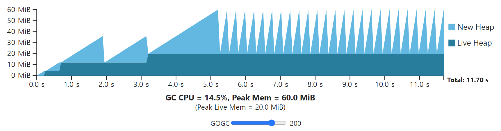

## Intro

- Go 언어는 메모리 관리를 런타임에서 하는 프로그래밍 언어
- 일반적으로 Heap 영역에서 더 이상 사용하지 않는 메모리, 즉 Dangling Object를 반환하는 과정
- GC는 Garbage Collector를 지칭하기도 하고, Garbage Collection 과정을 가리키기도 함

### Known Methods

- Reference Counting

  Python, PHP에서 사용

- Mark and Sweep

  Go, JVM, JS에서 사용


## Go GC

```go
// Garbage collector (GC).
//
// The GC runs concurrently with mutator threads, is type accurate (aka precise), allows multiple
// GC thread to run in parallel. It is a concurrent mark and sweep that uses a write barrier. It is
// non-generational and non-compacting. Allocation is done using size segregated per P allocation
// areas to minimize fragmentation while eliminating locks in the common case.
```

- 다음 내용은 [Go 1.20 버전 소스 코드](https://github.com/golang/go/blob/release-branch.go1.20/src/runtime/mgc.go)에 주석으로 설명되어 있는 부분 일부를 발췌한 것
- 세 가지 주요 포인트
  - Run Concurrently with Mutator Threads
  - Non-Generational Collection
  - Non-Compacting Collection


## Concurrent Mark and Sweep

- 아래의 Phase를 수행
  1. Sweep Termination
  2. Marking
  3. Mark Termination
  4. Sweeping

### Sweep Termination

```go
// 1. GC performs sweep termination.
//
//    a. Stop the world. This causes all Ps to reach a GC safe-point.
//
//    b. Sweep any unswept spans. There will only be unswept spans if
//    this GC cycle was forced before the expected time.
```

1. Stop The World

   GC 수행 중 Mutator Thread가 Heap에 Object 참조를 변경할 경우 정합성 위반이 되기 때문에 해당 Thread들을 중지시킴

   실행 중이던 모든 프로그램은 GC Safe Point에 도달하여 중단됨

2. 메모리 반환해야 하는 대상을 마저 Sweep

### Mark Phase

```go
// 2. GC performs the mark phase.
//
//    a. Prepare for the mark phase by setting gcphase to _GCmark
//    (from _GCoff), enabling the write barrier, enabling mutator
//    assists, and enqueueing root mark jobs. No objects may be
//    scanned until all Ps have enabled the write barrier, which is
//    accomplished using STW.
//
//    b. Start the world. From this point, GC work is done by mark
//    workers started by the scheduler and by assists performed as
//    part of allocation. The write barrier shades both the
//    overwritten pointer and the new pointer value for any pointer
//    writes (see mbarrier.go for details). Newly allocated objects
//    are immediately marked black.
//
//    c. GC performs root marking jobs. This includes scanning all
//    stacks, shading all globals, and shading any heap pointers in
//    off-heap runtime data structures. Scanning a stack stops a
//    goroutine, shades any pointers found on its stack, and then
//    resumes the goroutine.
//
//    d. GC drains the work queue of grey objects, scanning each grey
//    object to black and shading all pointers found in the object
//    (which in turn may add those pointers to the work queue).
//
//    e. Because GC work is spread across local caches, GC uses a
//    distributed termination algorithm to detect when there are no
//    more root marking jobs or grey objects (see gcMarkDone). At this
//    point, GC transitions to mark termination.
```

1. Stop The World 상태에서 Mark Phase를 준비

   - Write Barrier 활성화

     Write Barrier는 Concurrent GC Marking 과정에서 Heap 영역의 데이터 정합성을 유지해주는 장치

     Marking Phase는 GC 고루틴과 프로그램 고루틴이 동시에 동작하므로 도중에 변경된 Object에 대한 적절한 조치를 취하기 위함

   - Mutator Assist 활성화

     Heap 메모리 할당 속도가 너무 빨라서 GC가 끝나기 전에 한계에 도달하는 것을 막기 위해 할당 속도를 제어할 필요가 있음

2. Start The World

3. Marking from Root

   - Root Objects

     - 고루틴 Stack

       각 Stack을 스캔하는 과정은 해당 고루틴을 멈추고 진행

     - Heap 참조 포인터

       프로그램 고루틴과 동시에 동작

   - Tri-Color Mark
     1. 모든 Object를 White 상태로 설정 후 시작
     2. Root Object를 방문하고 Grey 상태로 변경

4. Tri-Color 알고리즘 기준, Grey 색상인 Object를 스캔

   - Tri-Color Mark
     3. Grey Object를 순회하면서 참조하고 있는 Object를 Grey 상태로 변경
     4. 순회를 마친 Grey Object는 Black 상태로 변경
     5. Grey Object가 없을 때까지 반복

5. Root Set 혹은 Grey Object 등 Mark 대상이 없을 경우 Mark Termination으로 Transition

   - Tri-Color Mark
     6. 여전히 White 상태인 Object에 대해 메모리 공간을 회수하여 메모리 확보 가능


### Mark Termination

```go
// 3. GC performs mark termination.
//
//    a. Stop the world.
//
//    b. Set gcphase to _GCmarktermination, and disable workers and
//    assists.
//
//    c. Perform housekeeping like flushing mcaches.
```

1. Stop The World

   Stop 하지 않아도 동작할 수 있으나, 구현 시 코드 복잡성이 과하게 증가하는 반면 그에 비해 얻는 이점이 너무 작아 이 상태로 진행됨

2. Mark를 위해 활성화 한 Worker 비활성화

   - Mutator Assist 종료

3. Housekeeping

### Sweep Phase

```go
// 4. GC performs the sweep phase.
//
//    a. Prepare for the sweep phase by setting gcphase to _GCoff,
//    setting up sweep state and disabling the write barrier.
//
//    b. Start the world. From this point on, newly allocated objects
//    are white, and allocating sweeps spans before use if necessary.
//
//    c. GC does concurrent sweeping in the background and in response
//    to allocation.
```

1. Sweep 준비
   - Write Barrier 종료
2. Start The World
3. Concurrent Sweeping
   - 프로그램에서 Heap 영역에 할당을 요청했을 때 필요한 경우 삭제 처리된 Object를 Lazy 할당 해제
   - 즉, 할당 시점에 Sweep 발생하고 GC 수행 시간과는 무관하여 GC Cycle과 조금 독립적으로 동작하는 경향이 있음


## Non-Generational GC

- Generational Collection은 Object 수명에 따라 Minor와 Major로 구분지어 GC를 수행

### Write Barrier Not Fast Enough


- Minor GC의 경우 Young Generation Object만 확인

- 이때 Old Generation Object가 Young Generation Object를 가리키고 있는 경우, 참조를 잃게 됨

- 이 문제를 막기 위해 Write Barrier 사용

- Go 언어에서는 Generation 간 참조 기록 작업에서 발생하는 오버헤드를 허용할 수 없었다고 설명

  [The Write Barrier was fast but it simply wasn't fast enough](https://go.dev/blog/ismmkeynote)

### Good Escape Analysis

- Escape Analysis

  Object 참조가 Subroutine 밖으로 전파되는지를 분석하는 기술

  이를 통해 컴파일러가 최적화를 수행할 때 Stack과 Heap 메모리 중 한 곳에 Object를 할당

- Example

  ```go
  type user struct {
      name  string
  }
  
  func stayOnStack() user {
      // Allocate to Stack
      u := user{
        name:  "Gump",
      }
  
      return u
  }
  
  func escapeToHeap() *user {
      // Allocate to Heap
      u := user{
          name:  "Gump",
      }
  
      // By Escape Analysis, Detect that the pointer is returned and Allocate the object to the Heap not Stack
      return &u
  }
  ```

- 우수한 Go 언어 컴파일링을 통해 Escape Analysis로 더 많은 Object가 Heap 영역이 아닌 Stack 영역 메모리가 할당됨

- 이로 인해 Generational Collection으로 얻을 수 있는 성능 개선이 다른 언어의 Runtime에 비해 적음


## Non-Compacting GC

- Compacting은 Alive Object를 Heap 한 곳으로 재배치하여 압축하여 Fragmentation을 방지

### Under Time Restraints

- 2014년에 Compacting 방식으로 GC를 개선할 계획이 있었음
- 그러나 당시 Go 언어 Runtime을 C에서 Go 언어로 재작성하는 일이 진행되고 있었기 때문에 일정 문제로 Concurrent Mark and Sweep으로 진행

### Use TCMAlloc

- Thread Caching Memory Allocation

  구글에서 개발한 메모리 할당 라이브러리

  각 스레드 별로 Local Cache 영역이 있어서 메모리 할당 시 불필요한 동기화가 줄어들어 Lock 비용 감소

- 간단한 흐름 및 구조

  

  

  - Thread Cache (mcache)
    - 각 Thread에 대한 개별 메모리 Cache를 보유
    - 해당 Thread에서 자주 할당되고 해제되는 작은 크기의 Object를 관리
    - Central Cache와 비교해 상대적으로 빠른 속도로 동작하며, Lock 경합을 회피하여 성능이 향상됨
  - Central Heap (mcentral)
    - Thread Cache에 충분한 공간이 없거나, 보다 큰 Object를 할당하는 경우 Central Heap 활용
    - 다수의 Thread가 Object를 교환하고 재활용함으로써 메모리 사용을 최적화
  - Page Heap (mheap)
    - 보다 큰 메모리 할당 관리는 Page Heap 활용
    - OS의 가상 메모리 관리 기능을 이용하여 큰 메모리 Block을 할당 및 해제

- TCMAlloc은 Fragmentation 문제 자체를 없애주는 것이 아닌 최소화해주어 문제 상황이 덜 중요한 문제로 여겨지도록 도와주는 것


## Tuning

### Intuition

- Base

  프로그램이 일정한 시간만큼 동작 후  GC가 실행된다면, 각 GC Cycle은 동일한 Cost를 소요

  1. Fixed Amount of Time Passed
  2. Fixed Rate of Heap Memory Allocation By Application
  3. Fixed Amount of New Heap Memory Will Be Allocated
  4. Memory Usage to be the same
  5. Marginal GC CPU Cost to be the same
  6. Fixed Cost

- GC run Later

  특정 시점에 이전보다 조금 더 늦게 GC가 동작하게 된다면, 할당된 메모리 크기는 증가하고 CPU 부하는 감소함

  1. More Memory be Allocated
  2. Fewer GC Cycles due to Other Fixed Window of Time
  3. Lower Overall CPU Cost

- GC run Earlier

  특정 시점에 이전보다 조금 더 빠르게 GC가 동작한다면, 할당된 메모리 크기는 감소하고 CPU 부하는 증가함

  1. Less Memory be Allocated
  2. More GC Cycles due to Other Fixed Window of Time
  3. Higher Overall CPU Cost

- GC Frequency에 따라 CPU Time과 Memory 사이의 Trade-Off 발생

### GOGC Variable

- GC의 목표는 $TotalHeapSize > TargetHeapSize$ 이전에 GC Cycle을 마치는 것

  - $TotalHeapMemory=LiveHeap+NewHeapMemory$

  - $TargetHeapMemory=LiveHeap+(LiveHeap+GC Roots)*GOGC/100$

    예를들어 $LiveHeap$이 $8 MiB$, 고루틴 Stack이 $1 MiB$, 전역 변수 포인터가 $1 MiB$인 경우 $GOGC$가 $100$이라면, $TargetHeapMemory$는 $18 MiB$이다

- Target이 커질수록, GC는 오랫동안 기다릴 수 있게 됨

- 즉, $GOGC$를 2배한다면 Heap Memory 오버헤드가 2배로 증가하고, GC CPU Cost는 절반으로 감소함

- Example

  

  

  

### GOMEMLIMIT Variable

- Go 1.19 버전까지는 GOGC 환경변수가 GC를 최적화할 수 있는 유일한 파라미터이었음

  CPU와 Memory 간의 Trade-Off 설정에는 알맞았지만, 이용 가능한 총 Memory 크기에 대한 고려는 없었음

  

  

  - 프로그램 실행 환경 컨테이너가 최대 $60 MiB$ Memory까지 이용 가능하다면 GOGC 값은 100을 초과할 수 없음

    GOGC 값을 높일 경우 Memory Cost가 증가하기 때문

  - 여기서 순간적으로만 높은 Memory 사용량 때문에 다른 GC Cycle에서 이용 가능한 Memory를 활용하지 못하는 문제 발생

  - 더불어 애플리케이션 동작 시 이러한 일시적인 Peak 현상은 예측이 어렵기 때문에 피할 수 없는 Out-Of-Memory 상황이 발생하기도 함

- GOMEMLIMIT 환경변수로 $TotalOfAmountOfMemory$를 설정하도록 함

  

  

  - GOGC 환경변수에 의해 결정된 $TotalHeapMemory$ 보다 $MemoryLimit$이 낮은 경우, GC가 더욱 자주 동작하며 허용된 Memory 사용량 수준으로 돌아오도록 작동함
  - 프로그램 동작 중에 $MemoryLimit$ 만큼의 Memory 사용량에 도달하면 할당을 멈추고 GC를 자주 작동시켜 Memory 확보를 하려하며, 다른 구간에서는 여전히 GOGC 환경변수로 결정된 $TotalHeapMemory$에 따라 동작함


## Reference

- [Google Go GitHub Repository](https://github.com/golang/go/blob/release-branch.go1.20/src/runtime/mgc.go)
- ["Getting to Go: The Journey of Go's Garbage Collector", Rick Hudson](https://go.dev/blog/ismmkeynote)
- ["A Guide to the Go Garbage Collector"](https://tip.golang.org/doc/gc-guide)
- ["Go GC", Changhoi Kim](https://changhoi.kim/posts/go/go-gc/)
- ["Go 언어의 GC", kineo2k](https://velog.io/@kineo2k/Go-%EC%96%B8%EC%96%B4%EC%9D%98-GC)
- ["Go 언어의 GC에 대해", Haruki Okada](https://engineering.linecorp.com/ko/blog/go-gc)