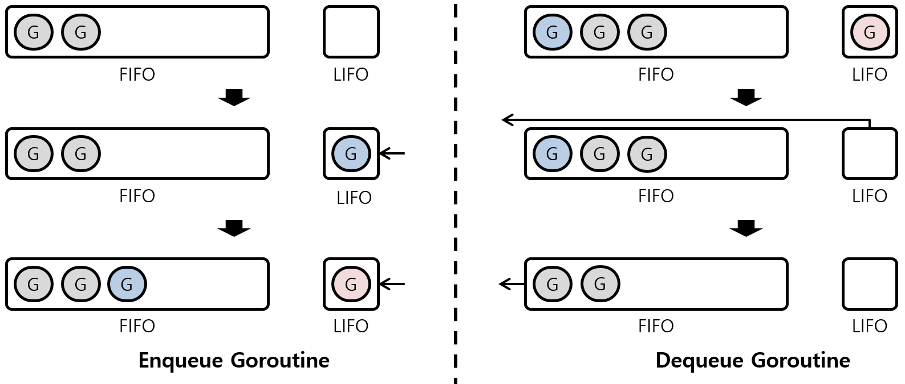
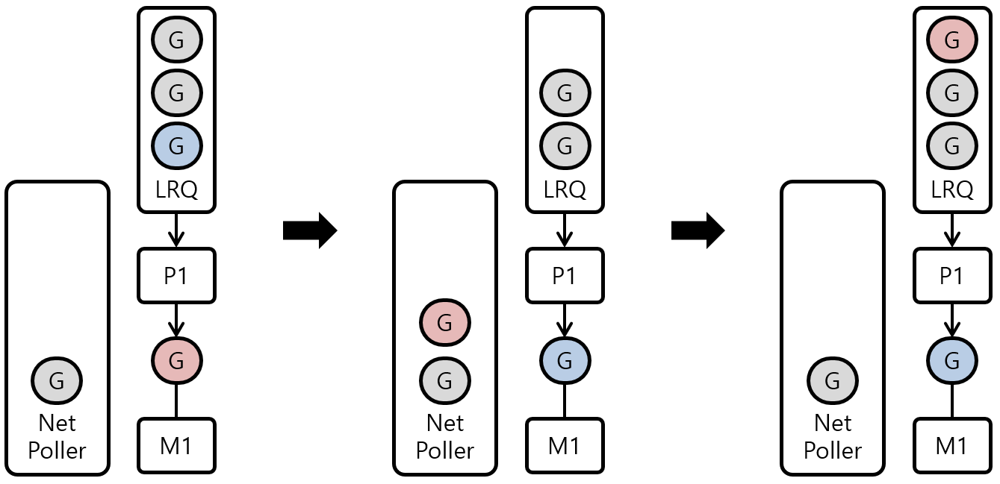

## Go Runtime Scheduler

- Go언어는 OS에서 제공하는 Thread보다 더 경량화된 Go-Routine을 제공
- Go-Routine은 Go Runtime에 포함되어 있는 Go Scheduler가 수행하는 Thread Scheduling을 통해서 실행

### Principles

아래의 원칙을 기준으로 고루틴들을 적절히 스케줄링 함

- OS Thread는 비싼 자원이기에 되도록 적은 수를 유지하고자 함
- 많은 수의 고루틴을 실행해 높은 동시성을 유지하고자 함
- N코어 머신에서 N개의 고루틴이 병렬적으로 동작할 수 있도록 함

### Operation Events

아래의 이벤트을 스케줄러가 마주하면 스케줄링할 기회를 얻게 됨

- `go` 키워드를 통해 새로운 고루틴을 만들고자 할 때
- GC가 동작할 때
- System Call을 사용할 때
- Synchronization Call (e.g., Mutex, Atomic, Channel) 가 동작할 때


## Threading Model

- Diagram

  

  - G: Go-Routine

  - M: Machine (OS Thread)

  - P: Processor (Virtual CPU Core)

- P가 M과 Gs사이에서 스케줄링 역할을 담당하고 OS Thread가 코드를 동작할 수 있도록 함


## Go-Routine

### State

1. Waiting
   - 외부의 이벤트 대기하고 있는 상태
   - System Call, Synchronization Call에 의한 정지 상태
2. Runnable
   - 실행할 수 있는 상태
   - M 상에서 돌아가길 원하는 상태
   - 예를 들어 위 다이어그램에서 Local Run Queue에 들어가있는 고루틴이 Runnable 상태
3. Executing
   - 실행 중인 상태
   - G가 P와 M에 붙어있는 상태
   - 예를 들어 위 다이어그램에서 M과 연결된 고루틴이 Executing 상태

### Parking Thread

- 생성한 Thread는 `pthread_exit` (Thread 종료 System Call) 을 수행하지 않기 위해 유휴 상태로 남겨둠

- 이렇게 유지한 Thread를 활용해 고루틴을 빠르게 Thread에 스케줄링할 수 있게 함

- Example

  ```go
  // 1. main-goroutine 실행
  func main() {
      ...
      go g1() // 2. g1-goroutine 실행
      ...
      // 충분한 시간이 흐름 (g1 고루틴이 종료될 정도의 시간)
      ...
      go g2() // 3. g2-goroutine 실행
  }
  ```

  1. 메인 고루틴을 제외하고 다른 고루틴은 없는 상태이므로, 현재 OS Thread는 `m-main` 한 개
  2. `g1` 고루틴을 생성한 후 Local Run Queue에 담음
     1. 런타임은 `g1`을 실행할 OS Thread인 `m1` Thread를 생성
     2. P는 Run Queue에 있는 `g1`을`m1`과 연결함
     3. `m1`은 `g1` 프로세스가 종료되더라도 사라지지 않고 Parking 상태가 됨
  3. 새로운 `g2` 고루틴을 Local Run Queue에 담음
     1. 런타임은 Parking 상태인 `m1`을 Unparking 후 `g2`를 연결함

### Limit Thread

- 동시 실행되는 고루틴이 아주 많이 생기면 OS Thread를 계속해서 생성하는 상황 발생 가능
- `GOMAXPROCS` 환경변수로 Thread 수 제한을 설정 가능
  - 기본값은 머신의 CPU 코어 수
- 목적은 OS Thread 수 조절이지만, 실제 동작은 가상 프로세서 P 수 제어를 가리킴


## Run Queues

### Local Run Queue

- 각 P마다 존재하는 Run Queue

- P는 자신이 소유한 LRQ로부터 고루틴을 하나씩 가져와 구동시킴

- 이를 통해 GRQ에서 발생하는 Race Condition 가능성을 줄임

- Example

  

  - LRQ는 FIFO (First In First Out) 과 LIFO (Last In First Out) 이 결합된 형태

  - LIFO 부분은 크기가 1이기 때문에 하나의 고루틴만 저장됨

  - LRQ에 고루틴 Enqueue할 시, LIFO 부분에 먼저 고루틴을 저장하고, 이후 FIFO 부분에 고루틴을 저장함

  - LRQ에 고루틴 Dequeue할 시. LIFO 부분에서 고루틴이 먼저 나오고, 이후 FIFO 부분의 고루틴이 나옴

- 고루틴의 Locality를 부여하기 위해 FIFO & LIFO 결합 형태를 채택

- 예를 들어 한 고루틴에서 새로운 다른 고루틴을 생성하고 생성한 고루틴이 종료되기를 기다리는 경우, 새로 생성된 고루틴이 빠르게 실행되고 종료되어야 높은 성능을 얻을 수 있음

- Cache 관점에서 고려해보면 새로 생성된 고루틴은 동일한 프로세서에서 실행되어야 좋음

### Global Run Queue

- LRQ에 할당되지 못한 대부분의 고루틴이 모여있는 Run Queue
- GRQ로 할당되는 경우
  1. Executing 상태가 된 고루틴은 한번에 최대 10ms까지 동작, 이후 고루틴은 Waiting 상태가 되어 GRQ로 이동
  2. 고루틴을 생성한 프로세서의 LRQ가 가득찬 경우, 생성된 고루틴은 GRQ에 저장


## System Call

### Sync System Call

- 고루틴 내부에서 Sync System Call을 호출하는 경우, 고루틴을 동작시키던 OS Thread는 고루틴 동작을 일시 중지하고 Sync System Call 처리를 수행
- 즉 Sync System Call 처리하는 동안 해당 OS Thread는 다른 고루틴도 동작시키지 못함
- 이는 CPU Core를 제대로 활용하지 못하게 만드는 원인이 될 수 있음
- Go Scheduler는 이러한 문제를 해결하기 위해 별도의 OS Thread를 이용함


- 고루틴에서 Sync System Call 호출 시 Go Scheduler에서 해당 고루틴을 처리하는 예제
- Sync System Call을 호출한 고루틴이 실행되었던 P1에는 새로운 M2가 할당되고, P1이 소유하고 있는 LRQ의 다음 고루틴을 싱행
- 이후 기존 고루틴의 Sync System Call이 완료되었다면 해당 고루틴은 다시 LRQ에 들어가 실행 차례를 기다림
- 남은 OS Thread M1은 다른 고루틴에서 Sync Thread Call 호출을 위해서 남겨둠

### Async System Call



- 고루틴에서 Async System Call 호출 시 Go Scheduler에서 해당 고루틴을 처리하는 예제
- Async System Call을 호출한 고루틴은 Net Poller에 들어가서 Async System Call 완료 Event 수신을 대기
- 이후 Net Poller는 Async System Call 완료 Event를 수신하고 Event의 대상이 되는 고루틴은 다시 LRQ로 들어가 실행 차례를 기다림
- Net Poller는 별도의 Background Thread에서 동작

## Work Stealing

- 작업을 고르게 분산하기 위해 활용
- 전반적인 과정
  1. Go Scheduler는 LRQ에 고루틴이 존재하지 않을 경우, 다른 P로부터 고루틴이 존재하는지 확인하고 절반의 고루틴을 가져옴
  2. 다른 LRQ에도 고루틴이 존재하지 않는다면 GRQ에 고루틴이 존재하는지 확인하고 고루틴을 가져옴
  3. GRQ에도 고루틴이 존재하지 않는다면 Net Poller에 고루틴이 존재하는지 확인하고 고루틴을 가져옴
  4. 여전히 고루틴이 존재하지 않는다면 M과 P는 Parking 됨
- 단, 고루틴의 Locality를 위해서 새로 생성된 고루틴은 3ms동안 Stealing되지 않도록 제한함


## Fairness

- 스케줄링의 공평성 보장을 위해 여러 기법을 적용함

  1. OS Thread

     - 고루틴이 이용중인 OS Thread를 반환하지 않고 계속 이용할 수 있음
     - 고루틴의 OS Thread 동적음 막기 위해 고루틴이 한번 실행될 때 10ms 이상 실행되지 않도록 함
     - Time Span을 넘기면 Preemption되어 강제로 GRQ로 이동시킴

  2. LRQ

     - 두 개의 고루틴이 LRQ에 번갈아가면서 저장되고 실행된다면 LRQ의 LIFO 부분에 의해서 FIFO 부분에 있는 고루틴은 실행되지 않을 수 있음
     - LIFO 부분에 저장된 고루틴은 OS Thread를 반납하더라도 Time Span이 초기화되지 않고 상속됨

     - 따라서 한 고루틴이 LIFO 부분을 10ms 이상 점유하지 못함

  3. GRQ

     - P가 고루틴을 찾는 과정의 마지막 순서가 GRQ이기 때문에 GRQ의 고루틴이 Orphan 상태에 빠질 수 있음
     - 스케줄러는 61번마다 한번씩 LRQ보다 GRQ를 우선해서 확인함
     - 61은 소수 숫자들 중 경험적 테스트를 통해 도출된 값

  4. Network Poller

     - Net Poller 같은 경우에는 Event 수신을 위한 별도의 OS Thread를 사용
     - OS Scheduler에 의해 동작을 보장받음


## Overall


- 4개의 CPU Core 존재
- OS Scheduler에 의해 다수의 OS Thread가 스케줄링되어 동작
- Net Poller는 네트워크를 처리하는 별도의 독립된 OS Thread를 의미
- `GOMAXPROCS` 환경 변수의 값은 3


## M:P:N Threading

- Go는 M:P:N 멀티 스레딩 모델이라고도 불림


## Reference

- ["Go Scheduler", Changhoi](https://changhoi.kim/posts/go/go-scheduler/)
- ["Golang Goroutine Schduleing", ssup2](https://ssup2.github.io/theory_analysis/Golang_Goroutine_Scheduling/)
- ["The Go Memory Model"](https://go.dev/ref/mem)

