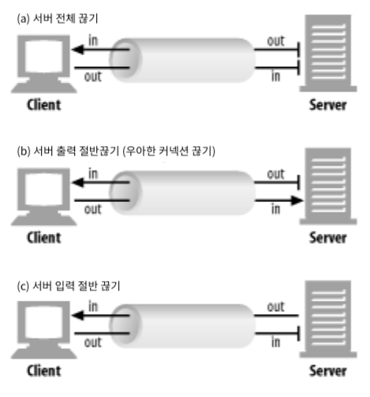

# HTTP/2 로의 전환

HTTP/2가 웹 분야에서 붐을 일으키는 이유를 이해하려면 무엇을 해결하고자 하는 지 살펴봐야 한다. 따라서 이 포스팅에서는 HTTP/1이 무엇이고 어떻게 동작하는지 알아보고 버전 2가 필요한 이유를 설명한다.

## 웹의 동작 방식

일반적으로 웹 브라우저를 사용해 원격 웹 애플리케이션과 리소스에 접근을 요청한다. 이때의 주요 방식이 HTTP (Hypertext Transfer Protocol) 인데, 이것이 왜 웹의 핵심인지, 또는 다음 버전이 어느 정도 개선이 될 수 있는지에 대해 알아보고자 한다.

### Internet 과 WWW (World Wide Web)

먼저 인터넷은 Internet Protocol (IP) 을 공유해 메시지를 라우팅하는 방식으로 연결된 공용 컴퓨터의 모음이다. 인터넷은 WWW, E-mail, FTP, VoIP 등의 여러 서비스로 구성된다. 따라서 WWW (또는 웹) 은 인터넷에서 가장 눈에 띠는 요소이지만, 일부분일 뿐이다.

HTTP는 웹 브라우저가 웹 페이지를 요청하는 방식이다. 이는 Unique Identifiers for Resources (리소스 유일 식별자, URL의 기원), HTML (Hypertext Markup Language) 과 함께 웹을 발명했을 때 정의한 세 가지 주요 기술 중 하나였다. HTTP를 살펴볼 때 주로 웹을 다루게 되지만, 최근에는 프론트엔드 없이도 HTTP 기반으로 구축 (e.g., REST) 되기 때문에 경계선이 흐려지고 있다.

### 웹을 돌아다닐 때 일어나는 일

웹 브라우저에서 `www.google.com` 으로 이동하는 예제를 통해 웹 탐색이 동작하는 방식을 이해하고자 한다.


1. 브라우저는 www.google.com 의 실제 주소 (현재, IPv4 주소) 를 DNS (Domain Name System) 서버에 요청한다.

   인터넷을 본질적으로 세계적이기 때문에 큰 회사들은 보통 여러 나라에 다수의 서버를 둔다. 예를 들어 미국에 있는 사람과 유럽에 있는 사람이 받는 www.google.com에 대한 IP 주소는 다르다.

2. 웹 브라우저가 해당 IP 주소로 표준 웹 포트인 80, 혹은 표준 보안 웹 포트인 443에 TCP (Transmission Control Protocol) 연결을 요청한다.

   IP는 인터넷을 통해 트래픽을 보내는 데 사용되지만, TCP는 연결을 안정적으로 만드는 안정성과 재전송 기능을 더한다. 보통 이 두 기술이 함께 사용되기 때문에 대개 TCP/IP 로 줄여 말하곤 한다.

   - IP

     호스트 to 호스트 Network 계층을 위한 전송 프로토콜이다. Unreliable && Connectionless한 특성을 가지며, Error Control과 Flow Control을 하지 않고 오로지 Error Dection만 한다.

   - TCP

     프로세스 to 프로세스 Transport 계층을 위한 전송 프로토콜이다. Bytes-Stream 형태로 전송하며, Realiable && Connection-Oriented 특성을 갖는다.

     클라이언트와 서버 간의 연결을 맺을 경우, Three-Way Handshake를 통해 이루어진다.

     

3. 브라우저가 웹 서버와 연결을 맺고 있으면 웹 사이트를 요청할 수 있다.

   이 단계에서 HTTP가 관여한다. HTTPS가 사용되면 연결 보호를 위한 추가 암호화 단계가 필요하다.

4. 구글 서버가 요청받은 URL에 응답한다.

   일반적으로 첫 페이지에서 돌려받는 것은 웹 페이지를 구성하는 HTML 형식의 텍스트다. 그러나 HTML 페이지가 아니라 다른 위치로 가라는 리디렉션 명령일 수도 있다. 예를 들어 구글은 HTTPS로만 운영되며 HTTP로 요청을 보낼 경우 HTTPS인 새로운 주소로 리디렉션하는 특수한 명령으로 응답한다. 이외에도 무언가 잘못된 경우에는 4xx HTTP 응답 코드를 받기도 한다.

5. 웹 브라우저가 반환된 응답을 처리한다.

   응답이 HTML 페이지라면, 브라우저는 HTML 코드 해석을 하여 DOM (Document Object Model) 을 구축한다. 이 과정 도중에 브라우저는 페이지를 표시하는 데 필요한 다른 리소스 (e.g., CSS, JS, Image) 를 발견한다.

6. 웹 브라우저가 추가로 필요한 리소스를 요청한다.

   구글의 경우 상당히 간결한 첫 페이지를 갖고 있지만, 네이버의 경우는 그렇지 않다. 크롬의 개발자 도구 - 네트워크 탭을 켜놓고 각 사이트에 접속해보면 확인해볼 수 있다. 이러한 리소스 각각이 위의 여섯 단계를 따라 유사한 방식으로 요청된다. 이 부분이 웹 탐색을 느리게 만드는 주요 문제 중 하나이며, 이 요청을 더 효율적으로 만드는 것이 주 목적인 HTTP/2의 핵심 근거 중 하나다.

7. 브라우저가 중요한 리소스를 충분히 얻으면 화면에 페이지를 렌더링하기 시작한다.

8. 페이지를 처음 표시한 후 웹 브라우저는 백그라운드에서 페이지에 필요한 다른 리소스를 계속 다운로드하고, 처리하는 대로 페이지를 업데이트한다. (e.g., 광고 추적 스크립트) 때떄로 인터넷 연결이 느린 상황에서는 처음에 이미지 없는 웹 페이지를 보이다가 시간이 조금 흐르면 이미지가 채워지는 현상이 이 과정 때문이다.

9. 페이지가 완전히 로드되면 브라우저는 로딩 아이콘을 멈추고, JS 코드에서 Onload 이벤트를 발생시킨다.

10. 페이지는 완전히 로드됐지만 브라우저는 요청 전송을 멈추지 않는다.

    이제 많은 웹 페이지는 계속해서 추가 콘텐츠를 보내거나 다른 서버와 통신하는 기능이 많은 애플리케이션이 되었다. 예를 들어 구글 홈페이지의 검색 바에 요청을 입력할 때 검색 버튼을 클릭하지 않고도 곧 바로 보이는 추천 검색어가 보이는 기능이 있다. 이러한 작업은 대개 백그라운드에서 잉러나 사용자에게 보이지 않는다.

이 포스팅에서는 HTTP가 직접 관여된 3~8단계에 집중하려 한다.

## HTTP란

HTTP는 이름에서 알 수 있듯이, 다른 문서로의 링크를 담은 문서를 전송할 의도로 만들어졌고 첫 번째 버전은 이러한 형태만 지원했다. 그러나 개발자들은 이 프로토콜이 다른 유형을 전송하는 데 사용될 수 있음을 알고 오늘날처럼 발전해왔다. 이제 HTTP에서 Hyphertext 부분이 더 이상 적절하지는 않지만, 널리 사용되는 현 시점에서 바꾸기에는 늦었다.

HTTP는 보통 TCP/IP가 제공하는 안정적인 네트워크 연결에 의존한다. 통신 프로토콜은 여러 계층으로 나누어져 있기 때문에 각 계층은 자신이 맡은 바에 충실한다. 즉, HTTP는 네트워크 연결이 설정되는 방법의 하부 수준 세부 사항을 다루지 않는다. 단지 네트워크 오류와 연결 종료를 어떻게 다룰지에 대해 염두에 둘 뿐이다.

> 구글이 개발한 비표준 네트워크 프로토콜로 **SPDY**라는 것도 존재한다. TCP 위에 하나의 계층을 더해 HTTP 요청 및 응답들을 Multiplexed-Stream으로 핸들링할 수 있도록 한다.
>
> 

계층적 접근을 설명하는 데 자주 사용되는 것이 OSI (Open Systems Interconnection) 모델이다. HTTP가 어디에 들어맞는지, HTTP가 동작하려면 저수준 프로토콜에 어떻게 의존하는지를 고수준에서 이해하는 데에 계층화가 도움이 된다.


HTTP는 본질적으로 요청 및 응답을 위한 프로토콜이다. 웹 브라우저가 HTTP 문법을 사용해 요청을 만들고 웹 서버로 보내면, 서버는 요청받은 리소스를 포함한 메시지로 응답한다. HTTP의 성공 비결은 단순함에 있다. 하지만 HTTP/2는 효율성을 위해 단순성을 조금 희생시켰기 때문에 약간의 우려를 받기도 한다.

연결을 맺은 다음, 즉 TCP/IP와 같은 기술을 이용해 적절한 서버에 연결된 다음 HTTP 요청의 기본 문법은 아래와 같다.

```http
GET /page.html↲
```

HTTP 첫 버전 0.9는 간단한 문법만 허용했으며 GET 메서드 뿐이었다. 구글 서버로 HTTP/0.9 요청을 보내더라도 HTTP/1.0 응답 코드 200 또는 302를 받을 가능성이 높고, (대부분의 서버는 HTTP/0.9를 지원하지 않음) 이어서 연결이 종료된다. 다음은 MacOS에서의 요청 및 응답 예제이다.

```bash
$ echo "GET /" | nc www.google.com 80
```

```
HTTP/1.0 200 OK
Date: Sat, 19 Mar 2022 10:48:10 GMT
Expires: -1
Cache-Control: private, max-age=0
Content-Type: text/html; charset=ISO-8859-1
P3P: CP="This is not a P3P policy! See g.co/p3phelp for more info."
Server: gws
X-XSS-Protection: 0
X-Frame-Options: SAMEORIGIN
Set-Cookie: 1P_JAR=2022-03-19-10; expires=Mon, 18-Apr-2022 10:48:10 GMT; path=/; domain=.google.com; Secure
Set-Cookie: NID=501=prZmqK82lspH_Ulva0WfuSL0BbiJBoooB4K1cTCvyIQyj-XUpZxzONniCiriw1mNZ3ggSfCp41a2IlW39zaGessUAiSVznDzzx-vYHH9km4V5jF4Sia6S3_UCQjvmrBmu_ydZ0rhDfwLNZxMyPdIiIIXByMz740i1EhmaDHudAQ; expires=Sun, 18-Sep-2022 10:48:10 GMT; path=/; domain=.google.com; HttpOnly
Accept-Ranges: none
Vary: Accept-Encoding

<!doctype html> ... 중략
```

이처럼 HTTP 문법은 텍스트 기반 요청 및 응답 형식이며, HTTP의 성공 비결은 서비스 수준에서 비교적 구현하기 쉽게 만들어준 간결함이다. 이에 따라 애플리케이션이 수많은 독립적인 웹 서비스로 쪼개지는 MSA (Micro Service Architecture) 의 대유행이 이어졌다.

## HTTP 문법과 역사

처음 HTTP가 시작되었을 때는 연구 팀에서 접근을 제공하고 컴퓨터를 연결해서 실시간으로 쉽게 서로를 참조할 수 있게 하는 상호 연결된 컴퓨터의 네트워크를 구현하는 것이었다. 링크를 클릭하면 관련된 문서가 열리는 방식이었다. 이를 토대로 첫 웹 브라우저를 구축하기 시작했다.

### HTTP/0.9

이 스펙에는 간략하게 필요한 것들만 명시되어 있다. 그 중 하나는 연결이 TCP/IP로 맺어져야 한다는 점이며, 또 다른 하나는 각 메시지는 서버의 연결 종료로 끝나야 한다는 점이다. 이외에도 각 요청은 멱등성 (여러 번 적용하더라도 결과가 달라지지 않는 것을 의미) 을 지켜야한다고 적혀있다. 이 점으로 인해 서버는 연결 종료 후 요청에 대한 어떤 정보도 저장할 필요가 없게 된다. 이런 특성은 Stateless한 관점으로는 간결함을 적극 활용할 수 있게 된 것임과 동시에, 상태 추적이 필요한 복잡한 애플리케이션의 경우 추가적인 기능 (e.g., HTTP 쿠키) 을 덧붙여야 하는 저주이기도 하다.

위에서 보았듯이 HTTP/0.9에서는 오직 다음과 같은 명령만 가능하다.

```http
GET /section/page.html↲
```

HTTP 헤더 필드라는 개념이나 이미지와 같은 다른 미디어의 개념이 존재하지 않았다. 오로지 연구 기관에서 쉽게 정보에 접근할 수 있도록 하는 것이 목적이었기 때문이다.

### HTTP/1.0

월드와이드웹은 곧바로 널리 쓰이기 시작했으며, 그와 동시에 대다수의 웹 서버는 단순한 0.9 프로토콜의 한계를 넘어선 확장을 구현했다. 이렇게 먼저 확장이 된 후 HTTP/1.0 작업이 시작되어, 1.0 버전은 프로토콜의 일반적인 사용법을 문서화하려는 시도이다. 다음과 같은 몇 가지 주요 기능이 추가되었다.

- 더 많은 요청 메서드

  이전에 정의된 GET에 새로운 HEAD와 POST가 추가되었다.

- 선택적인 HTTP 버전 번호가 모든 메시지에 추가됨

  이전 버전과의 호환성을 위해, HTTP/0.9가 기본으로 가정됐다.

- 요청 및 응답 모두에 같이 보내질 수 있는 HTTP 헤더

  요청받은 리소스와 전송하는 응답에 대한 더 많은 정보를 제공한다.

- 응답이 성공적인지 등의 정보를 표시하는 3자리 응답 코드

  이 코드는 리디렉션 요청, 조건부 요청, 오류 상태를 표현할 수 있게 됐다.

**메서드**

GET 메서드에 HTTP 헤드를 추가함으로써 조건적인 GET을 가능하게 했다. 예를 들어 클라이언트가 마지막으로 얻어왔을 때와 다를 때만 리소스를 가져오고, 그렇지 않으면 클라이언트에게 변경되지 않았음을 알려주고 과거의 사본을 계속 사용하게 하는 것, 혹은 하이퍼텍스트 뿐만 아니라 여러 종류의 미디어를 다운로드하는 데에도 HTTP를 사용할 수 있게 되었다.

HEAD 메서드는 리소스 자체를 다운로드 받지 않고도 클라이언트가 리소스에 대한 모든 메타정보를 얻을 수 있도록 허용한다. (엔티티 본문은 반환되지 않음) 예를 들어 구글과 같은 웹 크롤러는 리소스 변경 여부를 확인해 필요에 따라 리소스를 다운로드하여, 크롤러와 웹 서버 모두의 리소스를 아낄 수 있다.

POST 메서드는 클라이언트가 웹 서버에 데이터를 전송할 수 있게 해준다. 단순 파일 전체를 보내는 것에만 한정하지 않고, `Key: Value` 쌍의 웹 사이트 Form으로도 사용되어, 처음으로 HTTP 요청이 응답과 같이 본문을 가질 수 있게 되었다. 이전에도 GET을 사용해서 URL 끝 `?` 뒤에 파라미터를 붙여서 데이터를 보낼 수 있으나, 이는 웹 서버에 데이터를 업로드하는 용도라기 보다는 URI를 명확하게 하고자 함이다. 더불어 전체 URL 길이에 제한이 있으므로 이 방법으로는 한계가 존재한다.

또 다른 차이점은 GET 요청이 멱등한 반면, POST 요청은 그렇지 않다는 점이다. 즉, 같은 URL에 대해 여러 번의 GET 요청은 언제나 동일한 결과를 반환하지만 POST의 경우 그렇지 않다. 종종 특정 사이트에서 새로 고침하면 브라우저가 데이터를 다시 제출할지 묻는 메시지가 뜨는 이유다.

**요청 헤더**

HTTP/1.0부터는 요청 헤더를 도입 (HEAD 메서드와 다른 것임) 하여 서버가 요청을 처리할 방법을 결정하는 데 사용할 수 있는 추가 정보를 제공할 수 있게 되었다. 예를 들어 GET 요청이 다음과 같이 변경되었다.

```http
GET /page.html HTTP/1.0
Header1: Value1
Header2: Value2, Value3↲↲
```

선택적인 버전 섹션 (기본값은 HTTP/0.9) 과 선택적인 HTTP 헤더 섹션이 추가됐다. 여기서 헤더 이름은 대소문자를 구분하지 않는다. 그리고 HTTP/1.0에 표준 헤더 몇 종류가 정의되어 있지만, 버전 업데이트 없이도 사용자 정의 헤더를 사용할 수 있다.

```http
GET /page.html HTTP/1.0
Accept: text/html,application/xhtml+xml,image/jxr/,*/*
Accept-Encoding: gzip, deflate, br
Accept-Langauge: en-GB,en-US; q=0.8,en;q=0.6
Connection: keep-alive
Host: www.example.com
User-Agent: MyAwesomeWebBrowser 1.1↲↲
```

**응답 코드**

전형적인 HTTP/1.0 서버 응답의 앞 부분은 다음과 같다.

```
HTTP/1.0 200 OK
Date: Sun, 25 JUN 2017 13:30:24 GMT
... etc.
```

첫 줄에 응답 메시지의 HTTP 버전, 세 자릴수 응답 코드, 그리고 코드의 텍스트 설명이 온다. [HTTP 상태 코드 위키피디아](https://en.wikipedia.org/wiki/List_of_HTTP_status_codes)의 코드들 설명을 훑어보다 보면, 종종 응답 코드 사용 정의가 모호하다고 생각할 수 있다. 응답 코드는 일반적인 분류로 설계되었기 때문에, 가장 적합한 상태 코드를 사용하는 것은 애플리케이션 각자에서 결정해야할 문제다.

**응답 헤더**

첫 응답 줄 다음에는 HTTP/1 헤더 응답 줄이 위치한다. 요청 헤더와 동일한 형식으로, `Key: Value` 꼴이다.

```
HTTP/1.0 200 OK
Date: Sat, 19 Mar 2022 10:48:10 GMT
Expires: -1
Cache-Control: private, max-age=0
Content-Type: text/html; charset=ISO-8859-1
P3P: CP="This is not a P3P policy! See g.co/p3phelp for more info."
Server: gws
X-XSS-Protection: 0
X-Frame-Options: SAMEORIGIN
Set-Cookie: 1P_JAR=2022-03-19-10; expires=Mon, 18-Apr-2022 10:48:10 GMT; path=/; domain=.google.com; Secure
Set-Cookie: NID=501=prZmqK82lspH_Ulva0WfuSL0BbiJBoooB4K1cTCvyIQyj-XUpZxzONniCiriw1mNZ3ggSfCp41a2IlW39zaGessUAiSVznDzzx-vYHH9km4V5jF4Sia6S3_UCQjvmrBmu_ydZ0rhDfwLNZxMyPdIiIIXByMz740i1EhmaDHudAQ; expires=Sun, 18-Sep-2022 10:48:10 GMT; path=/; domain=.google.com; HttpOnly
Accept-Ranges: none
Vary: Accept-Encoding

<!doctype html> ... 중략
```

이처럼 HTTP 문법은 크게 확장되어 단순한 문서 저장소 불러오기 이상의 동적이고 풍부한 기능의 애플리케이션을 생성할 수 있게 됐다. 그리고 앞서 언급했던 것처럼 HTTP/1.0은 새로운 구문을 정의하기보다는 일부 표준과 구현을 정리하는 느낌으로 발표됐다.

### HTTP/1.1

버전 번호가 암시하듯이 1.1 버전은 급진적인 변경을 포함하지 않아, HTTP 프로토콜을 더 최적화해 사용할 수 있도록 몇 가지 사항을 개선함에 초점을 맞춘다. 어쩌면 이보다 더 중요한 점은 미래 WWW가 기반을 둘 공식 표준을 제공하다는 것이다. HTTP의 기본은 쉽게 이해할 만큼 충분히 단순하지만, 다른 관점으로 보면 이는 약간씩 서로 다른 방법으로 구현될 수 있는 복잡성이 잠재하며 이는 공식 표준이 없다면 확장하기 어렵기 때문이다.

**필수적인 호스트 헤더**

HTTP 요청 행에서 제공된 URL은 Absolute URL이 아니라 Relative URL이다. 즉, 이는 웹 서버 하나가 하나의 웹 사이트만 호스팅한다고 가정한다. 그러나 오늘날 많은 웹 서버는 여러 사이트를 동일한 서버에서 호스팅 (가상 호스팅) 하며, 이에 따라 서버에게 어떤 사이트를 원하는지 알려주는 것이 중요하다. 이 기능은 HTTP 요청의 URL을 Absolute 형태로 변경하는 것으로 구현될 수도 있었지만, 하위 호환성을 위해 Host 헤더를 추가하는 방식으로 구현됐다.

```http
GET / HTTP/1.1
Host: www.google.com
```

이 Host 헤더는 HTTP/1.1 부터는 필수적이다. 이 덕분에 하나의 서버가 가상 호스팅을 더 많이 사용할 수 있게 되어서, 복잡한 과정 없이 웹 서버의 개발이 가능해지게 되었다. 더불어 이 스펙이 없었다면 IPv4 주소 한계에 더욱 빨리 도달했을 것이다. (반대로 생각하면, IPv6 적용이 더욱 빨라졌을 수도 있겠다.)

**지속적인 연결**

처음 HTTP는 클라이언트가 연결을 맺고, 리소스를 요청하고 받으면 연결이 종료되었다. 하지만 웹에 미디어가 더 풍부해짐에 따라 이 연결 종료는 점차 낭비, 내지는 지연으로 자리 잡았다. 새로운 **Connection** 헤더에 **Keep-Alive** 값을 명시함으로써 클라이언트는 서버에 추가적인 요청 전송을 허용하고자 연결을 맺은 채로 그대로 두라고 요청한다. HTTP/1.1에서는 Connection 헤더의 기본값은 Keep-Alive이다.

```http
GET /page.html HTTP/1.0
Connection: Keep-Alive
```

응답에서도 마찬가지로 지속적인 연결을 지원할 경우 `Connection: Keep-Alive` 헤더를 응답에 포함시킨다. 지속적인 연결을 사용하는 경우 명시적인 연결 종료가 없으므로, 언제 응답이 완료됐는지 알기가 어려울 수 있다. 대신 응답 본문의 길이를 정의하는 **Content-Length** 헤더를 사용한다.

그리고 지속적인 연결이 사용되기 시작하며, HTTP 연결은 클라이언트나 서버 어느 편에서든 종료할 수 있게 되었다. 우연히 혹은 의도적으로 일어날 수도 있기 때문에, 클라이언트와 서버 모두 연결을 감시하고 있어야 하고 예기치 않게 종료된 연결에 대한 예외 처리를 할 수 있어야 한다.

> 우아한 커넥션 끊기
>
> 애플리케이션은 TCP 입력 채널과 출력 채널 중 한 개만 끊거나 둘 다 끊을 수 있다. `close()`를 호출하면 양방향 커넥션을 모두 끊으며, 이를 **전체 끊기**라고 한다. 입력 채널이나 출력 채널 중 하나를 개별적으로 끊으려면 `shutdown()`를 호출하면 되며, 이를 **절반 끊기**라고 한다.
>
> 
>
> 보통 커넥션의 출력 채널을 끊는 것이 안전하다. 커넥션의 반대편에 있는 기기는 모든 데이터를 버퍼로부터 읽고 나서 데이터 전송이 끝남과 동시에 상대방이 커넥션을 끊었다는 것을 알게 된다.
>
> 클라이언트에서 더 이상 데이터를 보내지 않을 것임을 확신할 수 없는 이상, 커넥션의 입력 채널을 끊는 것은 위험하다. 만약 클라이언트에서 이미 끊긴 서버의 입력 채널에 데이터를 전송하면, `connection reset by peer` 메시지를 클라이언트에게 반환한다. 대부분의 OS에서는 이를 심각한 에러로 취급하여, 아직 읽히지 않고 버퍼에 저장된 데이터를 모두 삭제한다.
>
> 일반적으로 애플리케이션이 우아한 커넥션 끊기를 구현하는 것은 자신이 출력 채널을 먼저 끊고 다른 쪽에 있는 기기의 출력 채널이 끊기는 것을 기다리는 것이다. 양쪽에서 더는 데이터를 전송하지 않을 것이라고 알려주면, 커넥션은 리셋의 위험 없이 온전히 종료된다. 그러나 상대방이 절반 끊기를 구현했다는 보장도 없고, 절반 끊기를 했는지 검사해준다는 보장도 없다. 따라서 주기적으로 상대방의 입력 채널에 대한 상태 검사를 해야하며, 만약 입력 채널이 특정 타임아웃 시간 내에 끊어지지 않으면 애플리케이션은 리소스를 보호하기 위해 커넥션을 강제로 끊을 수도 있다.
>
> 

**기타 새로운 기능**

- PUT, OPTIONS, CONNECT, TRACE, DELETE 메서가 추가되었다.

  PUT 메서드는 서버에 데이터를 쓰는 역할을 수행한다. POST 메서드는 서버에 데이터를 보내기 위함이며, PUT 메서드는 서버에 있는 리소스에 데이터를 입력하기 위해 사용된다.

  OPTIONS 메서드는 웹 서버에게 특정 리소스에 대해 어떤 메서드를 지원하는지 물어볼 때 사용된다.

  TRACE 메서드는 HTTP 요청이 서버까지 가는 경로 상에서 방화벽, 프락시, 게이트웨이 등 다양한 애플리케이션을 통과해 어떻게 도달했는 지 진단할 때 사용된다. TRACE 요청이 서버에 도착하면 Loopback 진단을 시작하여, 자신이 받은 요청 메시지를 본문에 넣어 응답한다. 클라이언트는 자신과 서버 사이에 있는 모든 HTTP 애플리케이션의 요청 및 응답 연쇄를 따라가며 메시지를 추적할 수 있다.

  DELETE 메서드는 서버에게 URL로 지정한 리소스 삭제를 요청할 때 사용된다. 그러나 서버가 클라이언트에게 알리지 않고 요청을 무시하는 것을 허용하기에, 삭제를 보장하지는 못한다.

- **Cache-Control** 헤더를 이용해, 서버가 리소스를 브라우저의 캐시에 저장하여 필요하면 나중에 재사용할 수 있도록 지시할 수 있게 되었다.

- 기본적으로 Stateless 성질인 HTTP가 상태를 가질 수 있도록 HTTP 쿠키를 도입했다.

- HTTP 응답에서 Character Set과 Language 항목을 도입했다.

- 프록시 지원 기능을 도입했다.

- 인증 기능을 도입했다.

- 새로운 상태 코드를 도입했다.

- 후행 헤더를 도입했다.

HTTP는 지속적으로 새로운 헤더를 추가했는데, 이들 중 상당수는 보안 상의 이유이다. 이 헤더들은 웹 사이트가 웹 브라우저에게 특정한 보안 보호 기능을 켜라고 알리는 데 사용되며, 동시에 공식적으로 표준화되지 않았음을 나타내고자 **X**를 포함시키는 관례 (e.g., `X-Content-Type`, `X-Frame-Options`, `X-XSS-Protection`) 가 있었으나 현재는 중단되었다.

## HTTPS 개론

HTTP 메시지는 인터넷을 통해 암호화되지 않은 상태로 전송됐으며, 따라서 메시지가 목적지로 라우팅될 때 메시지를 보는 모든 참여자가 읽을 수 있다. 인터넷은 메시지가 라우팅되는 방법을 제어할 수 없으며, 인터넷 사용자는 얼마나 많은 참여자가 메시지를 볼지 알 수 없다. 그리고 메시지는 일반 텍스트이기 때문에 도중에 가로채고, 읽고, 고쳐 쓰기까지 할 수 있다.

HTTPS는 전송 중의 메시지를 TLS (Transport Layer Security) 프로토콜을 사용해 암호화하는 HTTP 보안 버전으로, 다음과 같은 세 가지 중요한 개념을 추가했다.

- 암호화

  메시지는 제 3자에게 읽힐 수 없다.

- 무결성

  암호화된 메시지가 디지털 서명되고 서명이 복호화되기 전에 암호학적으로 검증되기 때문에 메시지는 전송 중에 변경되지 않는다.

- 인증

  서버는 클라이언트가 메시지를 주고받으려던 바로 그 서버다.

HTTPS는 공개키 암호화 (Aymmetric Key) 를 사용해 동작하므로 사용자가 처음 연결할 때 서버가 디지털 인증서 형태의 공개키를 제공한다. 브라우저는 이 공개키를 사용해 메시지를 암호화한다. 짝이 되는 개인키는 서버만이 가지고 있으므로 서버에서만 메시지를 복호화할 수 있다. 디지털 인증서는 브라우저가 신뢰하는 다양한 CA (Certificate Authority) 에 의해 발행되고 디지털 서명되기 때문에 해당 키가 연결하려는 서버에 대한 것인지 인증할 수 있다. 다만 주의할 점은 상대 서버에 연결 중임을 나타내는 것이 그 서버를 신뢰할 수 있음을 나타내는 것이 아니라는 것이다.

클라이언트가 HTTPS 서버에 접속하면 TLS Handshake를 거치게 된다. 이 과정에서 서버는 공개키를 제공하고, 클라이언트와 서버는 사용할 암호화 방식에 합의하고, 그 다음 클라이언트와 서버가 미래에 사용할 공유 암호화 키를 결정한다. (이는 공개키 암호화는 느리기 때문에 공유 비밀키를 만드는 데만 사용된다.)


---

> ==지속 커넥션 vs 병렬 커넥션==