# HTTP/2 로의 전환

HTTP/2가 웹 분야에서 붐을 일으키는 이유를 이해하려면 무엇을 해결하고자 하는 지 살펴봐야 한다. 따라서 이 포스팅에서는 HTTP/1이 무엇이고 어떻게 동작하는지 알아보고 버전 2가 필요한 이유를 설명한다.

## 웹의 동작 방식

일반적으로 웹 브라우저를 사용해 원격 웹 애플리케이션과 리소스에 접근을 요청한다. 이때의 주요 방식이 HTTP (Hypertext Transfer Protocol) 인데, 이것이 왜 웹의 핵심인지, 또는 다음 버전이 어느 정도 개선이 될 수 있는지에 대해 알아보고자 한다.

### Internet 과 WWW (World Wide Web)

먼저 인터넷은 Internet Protocol (IP) 을 공유해 메시지를 라우팅하는 방식으로 연결된 공용 컴퓨터의 모음이다. 인터넷은 WWW, E-mail, FTP, VoIP 등의 여러 서비스로 구성된다. 따라서 WWW (또는 웹) 은 인터넷에서 가장 눈에 띠는 요소이지만, 일부분일 뿐이다.

HTTP는 웹 브라우저가 웹 페이지를 요청하는 방식이다. 이는 Unique Identifiers for Resources (리소스 유일 식별자, URL의 기원), HTML (Hypertext Markup Language) 과 함께 웹을 발명했을 때 정의한 세 가지 주요 기술 중 하나였다. HTTP를 살펴볼 때 주로 웹을 다루게 되지만, 최근에는 프론트엔드 없이도 HTTP 기반으로 구축 (e.g., REST) 되기 때문에 경계선이 흐려지고 있다.

### 웹을 돌아다닐 때 일어나는 일

웹 브라우저에서 `www.google.com` 으로 이동하는 예제를 통해 웹 탐색이 동작하는 방식을 이해하고자 한다.


1. 브라우저는 www.google.com 의 실제 주소 (현재, IPv4 주소) 를 DNS (Domain Name System) 서버에 요청한다.

   인터넷을 본질적으로 세계적이기 때문에 큰 회사들은 보통 여러 나라에 다수의 서버를 둔다. 예를 들어 미국에 있는 사람과 유럽에 있는 사람이 받는 www.google.com에 대한 IP 주소는 다르다.

2. 웹 브라우저가 해당 IP 주소로 표준 웹 포트인 80, 혹은 표준 보안 웹 포트인 443에 TCP (Transmission Control Protocol) 연결을 요청한다.

   IP는 인터넷을 통해 트래픽을 보내는 데 사용되지만, TCP는 연결을 안정적으로 만드는 안정성과 재전송 기능을 더한다. 보통 이 두 기술이 함께 사용되기 때문에 대개 TCP/IP 로 줄여 말하곤 한다.

   - IP

     호스트 to 호스트 Network 계층을 위한 전송 프로토콜이다. Unreliable && Connectionless한 특성을 가지며, Error Control과 Flow Control을 하지 않고 오로지 Error Dection만 한다.

   - TCP

     프로세스 to 프로세스 Transport 계층을 위한 전송 프로토콜이다. Bytes-Stream 형태로 전송하며, Realiable && Connection-Oriented 특성을 갖는다.

     클라이언트와 서버 간의 연결을 맺을 경우, Three-Way Handshake를 통해 이루어진다.

     

3. 브라우저가 웹 서버와 연결을 맺고 있으면 웹 사이트를 요청할 수 있다.

   이 단계에서 HTTP가 관여한다. HTTPS가 사용되면 연결 보호를 위한 추가 암호화 단계가 필요하다.

4. 구글 서버가 요청받은 URL에 응답한다.

   일반적으로 첫 페이지에서 돌려받는 것은 웹 페이지를 구성하는 HTML 형식의 텍스트다. 그러나 HTML 페이지가 아니라 다른 위치로 가라는 리디렉션 명령일 수도 있다. 예를 들어 구글은 HTTPS로만 운영되며 HTTP로 요청을 보낼 경우 HTTPS인 새로운 주소로 리디렉션하는 특수한 명령으로 응답한다. 이외에도 무언가 잘못된 경우에는 4xx HTTP 응답 코드를 받기도 한다.

5. 웹 브라우저가 반환된 응답을 처리한다.

   응답이 HTML 페이지라면, 브라우저는 HTML 코드 해석을 하여 DOM (Document Object Model) 을 구축한다. 이 과정 도중에 브라우저는 페이지를 표시하는 데 필요한 다른 리소스 (e.g., CSS, JS, Image) 를 발견한다.

6. 웹 브라우저가 추가로 필요한 리소스를 요청한다.

   구글의 경우 상당히 간결한 첫 페이지를 갖고 있지만, 네이버의 경우는 그렇지 않다. 크롬의 개발자 도구 - 네트워크 탭을 켜놓고 각 사이트에 접속해보면 확인해볼 수 있다. 이러한 리소스 각각이 위의 여섯 단계를 따라 유사한 방식으로 요청된다. 이 부분이 웹 탐색을 느리게 만드는 주요 문제 중 하나이며, 이 요청을 더 효율적으로 만드는 것이 주 목적인 HTTP/2의 핵심 근거 중 하나다.

7. 브라우저가 중요한 리소스를 충분히 얻으면 화면에 페이지를 렌더링하기 시작한다.

8. 페이지를 처음 표시한 후 웹 브라우저는 백그라운드에서 페이지에 필요한 다른 리소스를 계속 다운로드하고, 처리하는 대로 페이지를 업데이트한다. (e.g., 광고 추적 스크립트) 때떄로 인터넷 연결이 느린 상황에서는 처음에 이미지 없는 웹 페이지를 보이다가 시간이 조금 흐르면 이미지가 채워지는 현상이 이 과정 때문이다.

9. 페이지가 완전히 로드되면 브라우저는 로딩 아이콘을 멈추고, JS 코드에서 Onload 이벤트를 발생시킨다.

10. 페이지는 완전히 로드됐지만 브라우저는 요청 전송을 멈추지 않는다.

    이제 많은 웹 페이지는 계속해서 추가 콘텐츠를 보내거나 다른 서버와 통신하는 기능이 많은 애플리케이션이 되었다. 예를 들어 구글 홈페이지의 검색 바에 요청을 입력할 때 검색 버튼을 클릭하지 않고도 곧 바로 보이는 추천 검색어가 보이는 기능이 있다. 이러한 작업은 대개 백그라운드에서 잉러나 사용자에게 보이지 않는다.

이 포스팅에서는 HTTP가 직접 관여된 3~8단계에 집중하려 한다.

## HTTP란

HTTP는 이름에서 알 수 있듯이, 다른 문서로의 링크를 담은 문서를 전송할 의도로 만들어졌고 첫 번째 버전은 이러한 형태만 지원했다. 그러나 개발자들은 이 프로토콜이 다른 유형을 전송하는 데 사용될 수 있음을 알고 오늘날처럼 발전해왔다. 이제 HTTP에서 Hyphertext 부분이 더 이상 적절하지는 않지만, 널리 사용되는 현 시점에서 바꾸기에는 늦었다.

HTTP는 보통 TCP/IP가 제공하는 안정적인 네트워크 연결에 의존한다. 통신 프로토콜은 여러 계층으로 나누어져 있기 때문에 각 계층은 자신이 맡은 바에 충실한다. 즉, HTTP는 네트워크 연결이 설정되는 방법의 하부 수준 세부 사항을 다루지 않는다. 단지 네트워크 오류와 연결 종료를 어떻게 다룰지에 대해 염두에 둘 뿐이다.

> 구글이 개발한 비표준 네트워크 프로토콜로 **SPDY**라는 것도 존재한다. TCP 위에 하나의 계층을 더해 HTTP 요청 및 응답들을 Multiplexed-Stream으로 핸들링할 수 있도록 한다.
>
> 

계층적 접근을 설명하는 데 자주 사용되는 것이 OSI (Open Systems Interconnection) 모델이다. HTTP가 어디에 들어맞는지, HTTP가 동작하려면 저수준 프로토콜에 어떻게 의존하는지를 고수준에서 이해하는 데에 계층화가 도움이 된다.


HTTP는 본질적으로 요청 및 응답을 위한 프로토콜이다. 웹 브라우저가 HTTP 문법을 사용해 요청을 만들고 웹 서버로 보내면, 서버는 요청받은 리소스를 포함한 메시지로 응답한다. HTTP의 성공 비결은 단순함에 있다. 하지만 HTTP/2는 효율성을 위해 단순성을 조금 희생시켰기 때문에 약간의 우려를 받기도 한다.

연결을 맺은 다음, 즉 TCP/IP와 같은 기술을 이용해 적절한 서버에 연결된 다음 HTTP 요청의 기본 문법은 아래와 같다.

```http
GET /page.html↲
```

HTTP 첫 버전 0.9는 간단한 문법만 허용했으며 GET 메서드 뿐이었다. 구글 서버로 HTTP/0.9 요청을 보내더라도 HTTP/1.0 응답 코드 200 또는 302를 받을 가능성이 높고, (대부분의 서버는 HTTP/0.9를 지원하지 않음) 이어서 연결이 종료된다. 다음은 MacOS에서의 요청 및 응답 예제이다.

```bash
$ echo "GET /" | nc www.google.com 80
```

```
HTTP/1.0 200 OK
Date: Sat, 19 Mar 2022 10:48:10 GMT
Expires: -1
Cache-Control: private, max-age=0
Content-Type: text/html; charset=ISO-8859-1
P3P: CP="This is not a P3P policy! See g.co/p3phelp for more info."
Server: gws
X-XSS-Protection: 0
X-Frame-Options: SAMEORIGIN
Set-Cookie: 1P_JAR=2022-03-19-10; expires=Mon, 18-Apr-2022 10:48:10 GMT; path=/; domain=.google.com; Secure
Set-Cookie: NID=501=prZmqK82lspH_Ulva0WfuSL0BbiJBoooB4K1cTCvyIQyj-XUpZxzONniCiriw1mNZ3ggSfCp41a2IlW39zaGessUAiSVznDzzx-vYHH9km4V5jF4Sia6S3_UCQjvmrBmu_ydZ0rhDfwLNZxMyPdIiIIXByMz740i1EhmaDHudAQ; expires=Sun, 18-Sep-2022 10:48:10 GMT; path=/; domain=.google.com; HttpOnly
Accept-Ranges: none
Vary: Accept-Encoding

<!doctype html> ... 중략
```

이처럼 HTTP 문법은 텍스트 기반 요청 및 응답 형식이며, HTTP의 성공 비결은 서비스 수준에서 비교적 구현하기 쉽게 만들어준 간결함이다. 이에 따라 애플리케이션이 수많은 독립적인 웹 서비스로 쪼개지는 MSA (Micro Service Architecture) 의 대유행이 이어졌다.

## HTTP 문법과 역사

처음 HTTP가 시작되었을 때는 연구 팀에서 접근을 제공하고 컴퓨터를 연결해서 실시간으로 쉽게 서로를 참조할 수 있게 하는 상호 연결된 컴퓨터의 네트워크를 구현하는 것이었다. 링크를 클릭하면 관련된 문서가 열리는 방식이었다. 이를 토대로 첫 웹 브라우저를 구축하기 시작했다.

### HTTP/0.9

이 스펙에는 간략하게 필요한 것들만 명시되어 있다. 그 중 하나는 연결이 TCP/IP로 맺어져야 한다는 점이며, 또 다른 하나는 각 메시지는 서버의 연결 종료로 끝나야 한다는 점이다. 이외에도 각 요청은 멱등성 (여러 번 적용하더라도 결과가 달라지지 않는 것을 의미) 을 지켜야한다고 적혀있다. 이 점으로 인해 서버는 연결 종료 후 요청에 대한 어떤 정보도 저장할 필요가 없게 된다. 이런 특성은 Stateless한 관점으로는 간결함을 적극 활용할 수 있게 된 것임과 동시에, 상태 추적이 필요한 복잡한 애플리케이션의 경우 추가적인 기능 (e.g., HTTP 쿠키) 을 덧붙여야 하는 저주이기도 하다.

위에서 보았듯이 HTTP/0.9에서는 오직 다음과 같은 명령만 가능하다.

```http
GET /section/page.html↲
```

HTTP 헤더 필드라는 개념이나 이미지와 같은 다른 미디어의 개념이 존재하지 않았다. 오로지 연구 기관에서 쉽게 정보에 접근할 수 있도록 하는 것이 목적이었기 때문이다.

### HTTP/1.0

월드와이드웹은 곧바로 널리 쓰이기 시작했으며, 그와 동시에 대다수의 웹 서버는 단순한 0.9 프로토콜의 한계를 넘어선 확장을 구현했다. 이렇게 먼저 확장이 된 후 HTTP/1.0 작업이 시작되어, 1.0 버전은 프로토콜의 일반적인 사용법을 문서화하려는 시도이다. 다음과 같은 몇 가지 주요 기능이 추가되었다.

- 더 많은 요청 메서드

  이전에 정의된 GET에 새로운 HEAD와 POST가 추가되었다.

- 선택적인 HTTP 버전 번호가 모든 메시지에 추가됨

  이전 버전과의 호환성을 위해, HTTP/0.9가 기본으로 가정됐다.

- 요청 및 응답 모두에 같이 보내질 수 있는 HTTP 헤더

  요청받은 리소스와 전송하는 응답에 대한 더 많은 정보를 제공한다.

- 응답이 성공적인지 등의 정보를 표시하는 3자리 응답 코드

  이 코드는 리디렉션 요청, 조건부 요청, 오류 상태를 표현할 수 있게 됐다.

**메서드**

GET 메서드에 HTTP 헤드를 추가함으로써 조건적인 GET을 가능하게 했다. 예를 들어 클라이언트가 마지막으로 얻어왔을 때와 다를 때만 리소스를 가져오고, 그렇지 않으면 클라이언트에게 변경되지 않았음을 알려주고 과거의 사본을 계속 사용하게 하는 것, 혹은 하이퍼텍스트 뿐만 아니라 여러 종류의 미디어를 다운로드하는 데에도 HTTP를 사용할 수 있게 되었다.

HEAD 메서드는 리소스 자체를 다운로드 받지 않고도 클라이언트가 리소스에 대한 모든 메타정보를 얻을 수 있도록 허용한다. (엔티티 본문은 반환되지 않음) 예를 들어 구글과 같은 웹 크롤러는 리소스 변경 여부를 확인해 필요에 따라 리소스를 다운로드하여, 크롤러와 웹 서버 모두의 리소스를 아낄 수 있다.

POST 메서드는 클라이언트가 웹 서버에 데이터를 전송할 수 있게 해준다. 단순 파일 전체를 보내는 것에만 한정하지 않고, `Key: Value` 쌍의 웹 사이트 Form으로도 사용되어, 처음으로 HTTP 요청이 응답과 같이 본문을 가질 수 있게 되었다. 이전에도 GET을 사용해서 URL 끝 `?` 뒤에 파라미터를 붙여서 데이터를 보낼 수 있으나, 이는 웹 서버에 데이터를 업로드하는 용도라기 보다는 URI를 명확하게 하고자 함이다. 더불어 전체 URL 길이에 제한이 있으므로 이 방법으로는 한계가 존재한다.

또 다른 차이점은 GET 요청이 멱등한 반면, POST 요청은 그렇지 않다는 점이다. 즉, 같은 URL에 대해 여러 번의 GET 요청은 언제나 동일한 결과를 반환하지만 POST의 경우 그렇지 않다. 종종 특정 사이트에서 새로 고침하면 브라우저가 데이터를 다시 제출할지 묻는 메시지가 뜨는 이유다.

**요청 헤더**

HTTP/1.0부터는 요청 헤더를 도입 (HEAD 메서드와 다른 것임) 하여 서버가 요청을 처리할 방법을 결정하는 데 사용할 수 있는 추가 정보를 제공할 수 있게 되었다. 예를 들어 GET 요청이 다음과 같이 변경되었다.

```http
GET /page.html HTTP/1.0
Header1: Value1
Header2: Value2, Value3↲↲
```

선택적인 버전 섹션 (기본값은 HTTP/0.9) 과 선택적인 HTTP 헤더 섹션이 추가됐다. 여기서 헤더 이름은 대소문자를 구분하지 않는다. 그리고 HTTP/1.0에 표준 헤더 몇 종류가 정의되어 있지만, 버전 업데이트 없이도 사용자 정의 헤더를 사용할 수 있다.

```http
GET /page.html HTTP/1.0
Accept: text/html,application/xhtml+xml,image/jxr/,*/*
Accept-Encoding: gzip, deflate, br
Accept-Langauge: en-GB,en-US; q=0.8,en;q=0.6
Connection: keep-alive
Host: www.example.com
User-Agent: MyAwesomeWebBrowser 1.1↲↲
```

**응답 코드**

전형적인 HTTP/1.0 서버 응답의 앞 부분은 다음과 같다.

```
HTTP/1.0 200 OK
Date: Sun, 25 JUN 2017 13:30:24 GMT
... etc.
```

첫 줄에 응답 메시지의 HTTP 버전, 세 자릴수 응답 코드, 그리고 코드의 텍스트 설명이 온다. [HTTP 상태 코드 위키피디아](https://en.wikipedia.org/wiki/List_of_HTTP_status_codes)의 코드들 설명을 훑어보다 보면, 종종 응답 코드 사용 정의가 모호하다고 생각할 수 있다. 응답 코드는 일반적인 분류로 설계되었기 때문에, 가장 적합한 상태 코드를 사용하는 것은 애플리케이션 각자에서 결정해야할 문제다.

**응답 헤더**

첫 응답 줄 다음에는 HTTP/1 헤더 응답 줄이 위치한다. 요청 헤더와 동일한 형식으로, `Key: Value` 꼴이다.

```
HTTP/1.0 200 OK
Date: Sat, 19 Mar 2022 10:48:10 GMT
Expires: -1
Cache-Control: private, max-age=0
Content-Type: text/html; charset=ISO-8859-1
P3P: CP="This is not a P3P policy! See g.co/p3phelp for more info."
Server: gws
X-XSS-Protection: 0
X-Frame-Options: SAMEORIGIN
Set-Cookie: 1P_JAR=2022-03-19-10; expires=Mon, 18-Apr-2022 10:48:10 GMT; path=/; domain=.google.com; Secure
Set-Cookie: NID=501=prZmqK82lspH_Ulva0WfuSL0BbiJBoooB4K1cTCvyIQyj-XUpZxzONniCiriw1mNZ3ggSfCp41a2IlW39zaGessUAiSVznDzzx-vYHH9km4V5jF4Sia6S3_UCQjvmrBmu_ydZ0rhDfwLNZxMyPdIiIIXByMz740i1EhmaDHudAQ; expires=Sun, 18-Sep-2022 10:48:10 GMT; path=/; domain=.google.com; HttpOnly
Accept-Ranges: none
Vary: Accept-Encoding

<!doctype html> ... 중략
```

이처럼 HTTP 문법은 크게 확장되어 단순한 문서 저장소 불러오기 이상의 동적이고 풍부한 기능의 애플리케이션을 생성할 수 있게 됐다. 그리고 앞서 언급했던 것처럼 HTTP/1.0은 새로운 구문을 정의하기보다는 일부 표준과 구현을 정리하는 느낌으로 발표됐다.

### HTTP/1.1

버전 번호가 암시하듯이 1.1 버전은 급진적인 변경을 포함하지 않아, HTTP 프로토콜을 더 최적화해 사용할 수 있도록 몇 가지 사항을 개선함에 초점을 맞춘다. 어쩌면 이보다 더 중요한 점은 미래 WWW가 기반을 둘 공식 표준을 제공하다는 것이다. HTTP의 기본은 쉽게 이해할 만큼 충분히 단순하지만, 다른 관점으로 보면 이는 약간씩 서로 다른 방법으로 구현될 수 있는 복잡성이 잠재하며 이는 공식 표준이 없다면 확장하기 어렵기 때문이다.

**필수적인 호스트 헤더**

HTTP 요청 행에서 제공된 URL은 Absolute URL이 아니라 Relative URL이다. 즉, 이는 웹 서버 하나가 하나의 웹 사이트만 호스팅한다고 가정한다. 그러나 오늘날 많은 웹 서버는 여러 사이트를 동일한 서버에서 호스팅 (가상 호스팅) 하며, 이에 따라 서버에게 어떤 사이트를 원하는지 알려주는 것이 중요하다. 이 기능은 HTTP 요청의 URL을 Absolute 형태로 변경하는 것으로 구현될 수도 있었지만, 하위 호환성을 위해 Host 헤더를 추가하는 방식으로 구현됐다.

```http
GET / HTTP/1.1
Host: www.google.com
```

이 Host 헤더는 HTTP/1.1 부터는 필수적이다. 이 덕분에 하나의 서버가 가상 호스팅을 더 많이 사용할 수 있게 되어서, 복잡한 과정 없이 웹 서버의 개발이 가능해지게 되었다. 더불어 이 스펙이 없었다면 IPv4 주소 한계에 더욱 빨리 도달했을 것이다. (반대로 생각하면, IPv6 적용이 더욱 빨라졌을 수도 있겠다.)

**지속적인 연결**

처음 HTTP는 클라이언트가 연결을 맺고, 리소스를 요청하고 받으면 연결이 종료되었다. 하지만 웹에 미디어가 더 풍부해짐에 따라 이 연결 종료는 점차 낭비, 내지는 지연으로 자리 잡았다. 새로운 **Connection** 헤더에 **Keep-Alive** 값을 명시함으로써 클라이언트는 서버에 추가적인 요청 전송을 허용하고자 연결을 맺은 채로 그대로 두라고 요청한다. HTTP/1.1에서는 Connection 헤더의 기본값은 Keep-Alive이다.

```http
GET /page.html HTTP/1.0
Connection: Keep-Alive
```

응답에서도 마찬가지로 지속적인 연결을 지원할 경우 `Connection: Keep-Alive` 헤더를 응답에 포함시킨다. 지속적인 연결을 사용하는 경우 명시적인 연결 종료가 없으므로, 언제 응답이 완료됐는지 알기가 어려울 수 있다. 대신 응답 본문의 길이를 정의하는 **Content-Length** 헤더를 사용한다.

그리고 지속적인 연결이 사용되기 시작하며, HTTP 연결은 클라이언트나 서버 어느 편에서든 종료할 수 있게 되었다. 우연히 혹은 의도적으로 일어날 수도 있기 때문에, 클라이언트와 서버 모두 연결을 감시하고 있어야 하고 예기치 않게 종료된 연결에 대한 예외 처리를 할 수 있어야 한다.

> 우아한 커넥션 끊기
>
> 애플리케이션은 TCP 입력 채널과 출력 채널 중 한 개만 끊거나 둘 다 끊을 수 있다. `close()`를 호출하면 양방향 커넥션을 모두 끊으며, 이를 **전체 끊기**라고 한다. 입력 채널이나 출력 채널 중 하나를 개별적으로 끊으려면 `shutdown()`를 호출하면 되며, 이를 **절반 끊기**라고 한다.
>
> 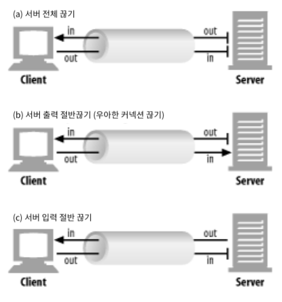
>
> 보통 커넥션의 출력 채널을 끊는 것이 안전하다. 커넥션의 반대편에 있는 기기는 모든 데이터를 버퍼로부터 읽고 나서 데이터 전송이 끝남과 동시에 상대방이 커넥션을 끊었다는 것을 알게 된다.
>
> 클라이언트에서 더 이상 데이터를 보내지 않을 것임을 확신할 수 없는 이상, 커넥션의 입력 채널을 끊는 것은 위험하다. 만약 클라이언트에서 이미 끊긴 서버의 입력 채널에 데이터를 전송하면, `connection reset by peer` 메시지를 클라이언트에게 반환한다. 대부분의 OS에서는 이를 심각한 에러로 취급하여, 아직 읽히지 않고 버퍼에 저장된 데이터를 모두 삭제한다.
>
> 일반적으로 애플리케이션이 우아한 커넥션 끊기를 구현하는 것은 자신이 출력 채널을 먼저 끊고 다른 쪽에 있는 기기의 출력 채널이 끊기는 것을 기다리는 것이다. 양쪽에서 더는 데이터를 전송하지 않을 것이라고 알려주면, 커넥션은 리셋의 위험 없이 온전히 종료된다. 그러나 상대방이 절반 끊기를 구현했다는 보장도 없고, 절반 끊기를 했는지 검사해준다는 보장도 없다. 따라서 주기적으로 상대방의 입력 채널에 대한 상태 검사를 해야하며, 만약 입력 채널이 특정 타임아웃 시간 내에 끊어지지 않으면 애플리케이션은 리소스를 보호하기 위해 커넥션을 강제로 끊을 수도 있다.
>
> 

**기타 새로운 기능**

- PUT, OPTIONS, CONNECT, TRACE, DELETE 메서가 추가되었다.

  PUT 메서드는 서버에 데이터를 쓰는 역할을 수행한다. POST 메서드는 서버에 데이터를 보내기 위함이며, PUT 메서드는 서버에 있는 리소스에 데이터를 입력하기 위해 사용된다.

  OPTIONS 메서드는 웹 서버에게 특정 리소스에 대해 어떤 메서드를 지원하는지 물어볼 때 사용된다.

  TRACE 메서드는 HTTP 요청이 서버까지 가는 경로 상에서 방화벽, 프락시, 게이트웨이 등 다양한 애플리케이션을 통과해 어떻게 도달했는 지 진단할 때 사용된다. TRACE 요청이 서버에 도착하면 Loopback 진단을 시작하여, 자신이 받은 요청 메시지를 본문에 넣어 응답한다. 클라이언트는 자신과 서버 사이에 있는 모든 HTTP 애플리케이션의 요청 및 응답 연쇄를 따라가며 메시지를 추적할 수 있다.

  DELETE 메서드는 서버에게 URL로 지정한 리소스 삭제를 요청할 때 사용된다. 그러나 서버가 클라이언트에게 알리지 않고 요청을 무시하는 것을 허용하기에, 삭제를 보장하지는 못한다.

- **Cache-Control** 헤더를 이용해, 서버가 리소스를 브라우저의 캐시에 저장하여 필요하면 나중에 재사용할 수 있도록 지시할 수 있게 되었다.

- 기본적으로 Stateless 성질인 HTTP가 상태를 가질 수 있도록 HTTP 쿠키를 도입했다.

- HTTP 응답에서 Character Set과 Language 항목을 도입했다.

- 프록시 지원 기능을 도입했다.

- 인증 기능을 도입했다.

- 새로운 상태 코드를 도입했다.

- 후행 헤더를 도입했다.

HTTP는 지속적으로 새로운 헤더를 추가했는데, 이들 중 상당수는 보안 상의 이유이다. 이 헤더들은 웹 사이트가 웹 브라우저에게 특정한 보안 보호 기능을 켜라고 알리는 데 사용되며, 동시에 공식적으로 표준화되지 않았음을 나타내고자 **X**를 포함시키는 관례 (e.g., `X-Content-Type`, `X-Frame-Options`, `X-XSS-Protection`) 가 있었으나 현재는 중단되었다.

## HTTPS 개론

HTTP 메시지는 인터넷을 통해 암호화되지 않은 상태로 전송됐으며, 따라서 메시지가 목적지로 라우팅될 때 메시지를 보는 모든 참여자가 읽을 수 있다. 인터넷은 메시지가 라우팅되는 방법을 제어할 수 없으며, 인터넷 사용자는 얼마나 많은 참여자가 메시지를 볼지 알 수 없다. 그리고 메시지는 일반 텍스트이기 때문에 도중에 가로채고, 읽고, 고쳐 쓰기까지 할 수 있다.

HTTPS는 전송 중의 메시지를 TLS (Transport Layer Security) 프로토콜을 사용해 암호화하는 HTTP 보안 버전으로, 다음과 같은 세 가지 중요한 개념을 추가했다.

- 암호화

  메시지는 제 3자에게 읽힐 수 없다.

- 무결성

  암호화된 메시지가 디지털 서명되고 서명이 복호화되기 전에 암호학적으로 검증되기 때문에 메시지는 전송 중에 변경되지 않는다.

- 인증

  서버는 클라이언트가 메시지를 주고받으려던 바로 그 서버다.

HTTPS는 공개키 암호화 (Aymmetric Key) 를 사용해 동작하므로 사용자가 처음 연결할 때 서버가 디지털 인증서 형태의 공개키를 제공한다. 브라우저는 이 공개키를 사용해 메시지를 암호화한다. 짝이 되는 개인키는 서버만이 가지고 있으므로 서버에서만 메시지를 복호화할 수 있다. 디지털 인증서는 브라우저가 신뢰하는 다양한 CA (Certificate Authority) 에 의해 발행되고 디지털 서명되기 때문에 해당 키가 연결하려는 서버에 대한 것인지 인증할 수 있다. 다만 주의할 점은 상대 서버에 연결 중임을 나타내는 것이 그 서버를 신뢰할 수 있음을 나타내는 것이 아니라는 것이다.

클라이언트가 HTTPS 서버에 접속하면 TLS Handshake를 거치게 된다. 이 과정에서 서버는 공개키를 제공하고, 클라이언트와 서버는 사용할 암호화 방식에 합의하고, 그 다음 클라이언트와 서버가 미래에 사용할 공유 암호화 키를 결정한다. (이는 공개키 암호화는 느리기 때문에 공유 비밀키를 만드는 데만 사용된다.)


## HTTP/1.1과 현재의 월드 와이드 웹

대부분의 인터넷이 HTTP/1.1에 기반을 두고 있고, 20년 된 기술치고는 상당히 잘 동작하고 있다. 인터넷 가용성과 속도는 인터넷 출시 때보다 몇 배나 빨라졌다. 다운로드 속도가 인상적으로 빨라졌음에도, 더 빠른 다운로드 속도의 수요가 다운로드 속도 증가보다 빠르게 늘어났다.

최근의 평균적인 웹 사이트는 80~90개의 리소스를 요청하고 거의 1.8MB 데이터를 다운로드한다. 웹 사이트의 성장은 주로 미디어가 풍부해지고 대부분의 웹 사이트에서 이미지와 비디오가 표준이 되는 데 따라 이뤄지며, 더불어 웹 사이트는 콘텐츠를 올바르게 표시하는 데 여러 프레임워크와의 의존성이 필요해지면서 더욱 복잡해진다. 이렇게 흘러가며 이를 해결하도록 설계 및 예측되지 않은 HTTP 프로토콜은 근본적인 성능 문제가 있다.

### HTTP/1.1의 근본적인 성능 문제


위의 HTTP 요청 및 처리 예제 과정을 살펴보면, 전체 페이지를 그리는 데 필요한 시간 중 1/6만이 클라이언트나 서버 측에서 요청을 처리하는 데 소모된다. 다시 말해 대부분의 시간이 인터넷을 통해 메시지가 전송되기를 기다리는 데 소모됐다. 그리고 브라우저가 이미지 1을 요청하고 이미지 2도 필요하다는 것을 알지만, 이전에 보낸 요청에 대한 응답이 올 때까지 기다리는 것도 비효율적이다. 이렇듯 현대 인터넷의 최대 문제 중 하나는 대역폭보다는 대기시간이다. 새로운 기술은 대역폭을 증가시키지만, 대기시간은 물리학, 광속에 의해 제약된다.

### HTTP/1.1에 대한 파이프라이닝


위에서 보았듯이 HTTP/1.1에서 병렬적 요청이 필요한 경우, 이전 요청의 응답을 수신하기 전에 동시적인 요청을 보내어 파이프라이닝을 도입하려고 시도했다. 파이프라이닝은 HTTP 성능을 크게 개선했어야 하지만 여러 이유 때문에 구현하기 어려웠고, 문제를 일으키기 쉬웠으며, 웹 브라우저와 서버에서 잘 지원되지 않았다. 결과적으로 거의 사용되지 않았다.

> **HTTP 파이프라이닝은 모든 브라우저에서 기본적으로 활성화되어 있지 않다**: [Link](https://developer.mozilla.org/ko/docs/Web/HTTP/Connection_management_in_HTTP_1.x#http_%ED%8C%8C%EC%9D%B4%ED%94%84%EB%9D%BC%EC%9D%B4%EB%8B%9D)
>
> 아래와 같은 이유들로 파이프라이닝은 더 나은 알고리즘은 멀티플렉싱 (HTTP/2에서 사용) 으로 대체되었다.
>
> - 버그가 있는 프록시들로 인해, 웹 개발자들이 예상치 못한 혹은 분석하기 힘든 이상하고 오류가 나는 동작이 야기된다.
>
> - 파이프라이닝을 정확히 구현해내기 복잡하다.
>
>   전송 중인 리소스의 크기, 사용될 효과적인 RTT (Round-Trip Delay), 효과적인 대역폭은 파이프라이닝이 제공하는 성능 향상에 직접적인 영향을 미친다. 이런 내용을 모른다면, 메시지의 중요성과 부합하지 않는 순서로 처리될 수 있다. 그로 인해 파이프라이닝은 대부분의 경우 미미한 수준의 향상만을 가져다 준다.
>
> - 파이프라이닝은 HOL (Head-of-Line Bloking) 문제에 영향을 받는다.
>
>   순차적으로 응답을 받아야 하다보니 먼저 받은 요청에서 지연이 발생하면 그 뒤에 있는 요청의 처리가 아무리 빨리 끝나도 먼저 온 요청이 끝날 때까지 기다려야 한다.

## HTTP/1.1 성능 문제의 우회적 해결 방법

앞서 얘기한 것처럼 HTTP/1.1은 전송한 다음 블록킹되고 응답을 기다리기 때문에 사실상 동기적 방식의 효율적이지 않은 프로토콜이다. 시간이 지나면서 HTTP/1.1의 성능 한계를 극복하는 다양한 해결책 및 팁이 만들어졌는데 아래와 같은 두 부류로 나뉜다.

- 여러 HTTP 연결을 사용한다.
- 적지만 잠재적으로 큰 HTTP 요청을 만든다.

### 여러 HTTP 연결 사용

HTTP/1.1의 블로킹 문제를 회피하는 가장 쉬운 방법 중 하나는 여러 개의 연결을 맺어 병렬로 여러 개의 HTTP 요청이 끊임없이 동작하게 하는 것이다. 도메인 당 HTTP 커넥션은 동시에 최대 6개까지만 허용되므로, 웹 사이트는 이미지와 CSS, JS와 같은 정적 리소스를 하위 도메인에서 제공해 연결 수를 늘렸다. 이 방법을 **도메인 샤딩**이라고 한다.

여러 개의 HTTP 연결이 사용되는 경우, TCP 연결 시작에 시간이 들고 연결 유지에 추가적인 메모리와 처리를 필요로하므로 클라이언트와 서버 모두에게 추가적인 부담이 있다. 그러나 주요 이슈는 TCP 프로토콜에서의 비효율성이다. TCP는 고유 시퀀스 번호가 있는 패킷을 전송하고 누락된 시퀀스 번호를 검사해서 도중에 손실된 패킷을 다시 요청하는 것이 보장된 프로토콜이다.


TCP는 위처럼 초기 연결을 맺을 때 3 Way Handshake가 수반된다. 즉, HTTP 요청 하나를 보내기도 전에 3개의 네트워크 요청이 필요하다는 것이다.

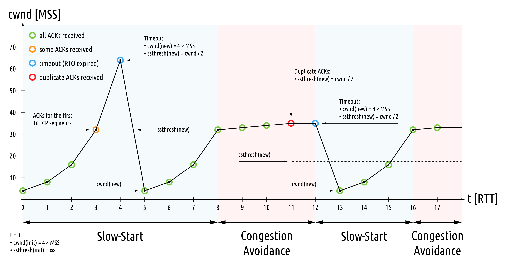

게다가 TCP는 상대와의 연결이 온전히 맺어지기 전에 적은 수의 패킷을 전송하면서 조심스럽게 시작한다. 이를 **Slow Start** 현상이라고 한다. TCP는 네트워크에 과부하를 주지 않으려고 보장된 프로토콜이기 때문인데, 그러나 가장 빠르고 대역폭이 큰 네트워크에서조차 언제나 인위적으로 억압된 상태로 시작된다.

이외에도 여러 개의 독립된 연결로 인해 대역폭 문제가 야기될 수 있다. 예를 들어 모든 대역폭이 사용되면 TCP 시간 초과와 다른 연결의 재전송이 될 수 있다. 그리고 보안 웹 사이트는 HTTPS 설정을 요구하기에, 추가적은 네트워크 이동이 필요하여 시간이 더 든다.

이렇듯 여러 개의 TCP 연결은 사용할 수 있는 더 나은 해결책이 없는 경우에 성능 향상을 할 수 있기는 하지만, HTTP/1 문제에 따른 정말 좋은 해결책은 아니다. 그렇기 때문에 브라우저에서 연결을 도메인 당 6개로 제한한 것이다. 개수를 늘릴 수는 있겠지만, 연결마다 필요한 비용을 감안하면 한계 수익 체감이 있다.

### 요청 수 줄이기

불필요한 요청을 줄이거나 (e.g., 브라우저에 리소스를 캐싱하는 등) 적은 수의 HTTP 요청을 통해 동일한 양의 데이터를 요청하는 방법이 있다. 전자의 방법은 HTTP 캐싱 헤더 사용과 관련 있으며, 후자의 방법은 리소스를 결합된 파일로 묶는 일이 수반된다.

이미지에 대한 번들링 기법은 **Spriting**이라고 한다. 여러 이미지들을 하나의 큰 이미지 파일로 묶은 다음 CSS를 사용해 이미지의 구획을 꺼내 개별 이미지를 효과적으로 다시 만드는 방식이다. CSS와 JS에 대해 많은 웹 사이트는 동일한 양의 코드를 포함하면서도 생성된 파일의 수는 줄어들도록 여러 파일을 연결한다. 이 방법은 성능 상의 이점을 제공하지만 설정하는 데 추가 과정이 필요하다. 다른 기법으로는 리소스를 다른 파일에 인라인시키는 것이 있다.

이러한 방법의 단점은 야기되는 낭비와 복잡성이다. 웹 페이지마다 커다란 스프라이트 이미지 파일을 다운로드할 수 있고, 하나 또는 둘만 사용할 수도 있다. 스프라이트 파일 중에서 얼마나 많이 사용하는지와 언제 잘라내야 하는지 추적하기는 복잡하다. 또한 너무 많은 파일을 연결해서 매우 큰 파일을 다운로드한다면 JS도 부풀려져서 필요 이상의 크기가 될 수 있다. 이 기법은 네트워크 계층 (특히 TCP의 Slow Start 때문) 과 처리 (웹 브라우저가 사용하지 않을 데티어를 처리해야 하기 때문) 의 측면에서 모두 비효율적이다.

## HTTP/1.1의 기타 이슈

HTTP/1.1의 텍스트 기반 프로토콜이라는 단순성이 문제를 가져왔다. 텍스트 형식은 사람에게는 정말 좋지만 기계에게 최적의 형식은 아니다. HTTP 텍스트 메시지 처리는 복잡하고 오류에 취약할 수 있으며, 보안 문제를 가져온다.

그리고 HTTP가 데이터를 효율적으로 인코딩하지 않기 때문에 HTTP 메시지가 필요 이상으로 크다. 점점 늘어난 요청의 수는 HTTP 헤더 사용이 증가해 많은 중복이 발생했다. 예를 들어 메인 페이지 요청만 쿠키를 필요로 하더라도, 도메인으로의 모든 HTTP 요청과 함께 쿠키가 전송된다. 이로 인해 HTTP 응답도 커지고 있고, 매우 큰 HTTP 헤더를 생성하는 `Content-Security-Policy`와 같은 보안 헤더 때문에 텍스트 기반 프로토콜의 결함이 더 분명해지고 있다.

성능 제한은 개선될 수 있는 HTTP/1.1의 한 측면일 뿐이다. 그 외의 문제는 일반 텍스트 프로토콜의 보안 및 개인 정보 문제, 상태 없음 등이 있다.

## HTTP/1.1 실제 사례

[WebPageTest](www.webpagetest.org)를 통해서 사이트의 웹 페이지 요청 및 응답 테스트를 할 수 있다. 최근의 대형 웹 사이트들은 HTTP/2를 지원하는 곳이 있으므로, 테스트를 실행하기 전 `--disable-http2` 옵션을 지정하고 진행했다.

### amazon.com

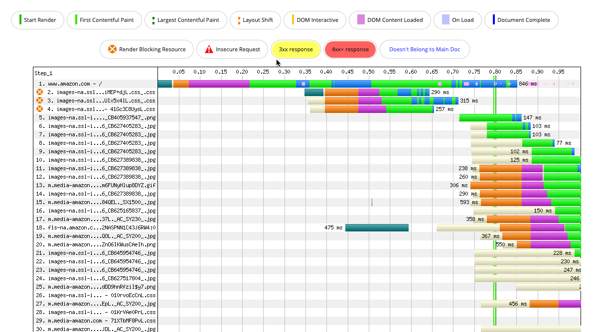

- 첫 번째 요청에서는 단일 요청을 전송하기 전에 DNS 조회, SSL/TLS HTTPS Handshake 시간이 필요하다. 이 요청은 아무리 HTTPS 암호화 프로토콜 개선을 하더라도, 현실적으로 네트워크 지연의 영향이 미치는 비중이 크다.
- CSS 파일들은 성능 상의 이유로 주 도메인에서 분리된 다른 도메인에서 호스팅된다. 다른 도메인이기 때문에 해당 요청에 대해 또 다른 DNS 조회, HTTPS Handshake를 수행해야 한다.이 설정 시간은 HTTP/1.1 성능 문제를 회피하고자 발생한 낭비이다. 1번 요청 진행과 2번 요청 시작점을 비교해보면, 2번 요청은 1번 요청이 끝나기 전 HTML 페이지가 완전히 다운로드되기 전에 시작됐다.

### imgur.com

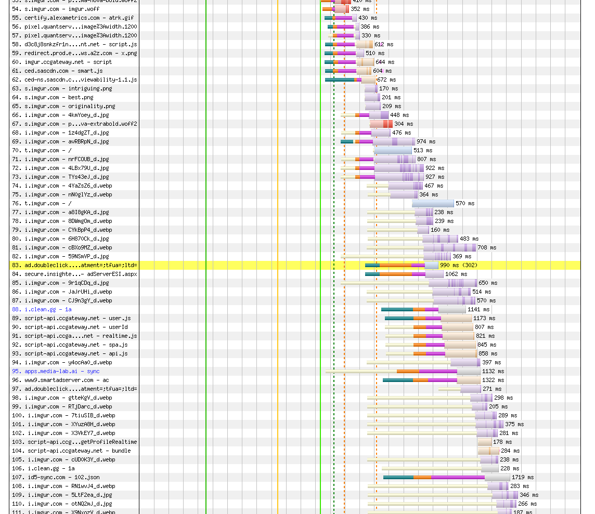

- 이 사이트의 경우 이미지 공유 사이트이기 때문에 홈페이지에서 많은 수의 이미지를 로드하지만 단일 파일로 스포트라이트하지 않는다.
- 점점 요청 수가 많아 지면서, 커넥션 수 제한으로 인해 70번대 요청부터는 대기 시간이 길어지고 있음을 알 수 있다.

## HTTP/1.1에서 HTTP/2로의 이동

HTTP는 HTTP/1.1이 현업에 등장한 1999년 이후 크게 변경되지 않았다. 물론 표준화 작업은 2014년까지도 진행되었지만, 이는 포로토콜의 어떠한 변경보다는 문서화 활동이었다.

### SPDY

SPDY (스피디라고 발음하며, 약자가 아님) 는 2009년에 구글이 만든 새로운 프로토콜이다. HTTP를 기반으로 구축됐지만 근본적인 용도를 변경하지 않고, Low-Level에서 동작하여 웹 개발자나 서버 운용자, 사용자에게는 거의 Transparent했다 (그만큼 HTTP와 겉으로 보기에는 유사함). SPDY의 주된 목적은 HTTP/1.1의 성능 한계를 해결하는 것으로, 다음과 같은 몇 가지 중요 개념을 도입했다.

- 다중화된 스트림

  요청 및 응답은 단일 TCP 연결을 사용했으며, 분리된 스트림들의 그룹으로 나눠진 패킷으로 쪼개졌다.

- 요청 우선순위 지정

  모든 요청을 동시에 보내는 것으로 인한 또 다른 성능 문제를 발생시키지 않기 위해 요청의 우선순위 개념이 도입됐다.

- HTTP 헤더 압축

  HTTP 본문과 같이, 헤더도 압축하도록 했다.

텍스트 기반의 요청 및 응답 프로토콜이었던 HTTP로는 이러한 기능을 도입할 수 없었으나, SPDY는 바이너리 프로토콜이다. 이 변경을 통해 여러 개의 HTTP 메시지가 동시에 하나의 연결에서 전송될 수 있도록 HTTP 계층 상에서 TCP 개념을 구현했다.

구글은 주요 브라우저 크롬과 인기 웹 사이트 구글 양쪽을 모두 관리하고 있으므로, 연결의 양 끝에서 새로운 프로토콜을 구현해 실생활에서의 실험이 가능했다. SPDY는 2010년 9월 크롬에 적용되었고, 2011년 1월에 모든 구글 서비스에서 활성화되었으며, 이어서는 다른 웹 브라우저와 서버들에서도 지원하기 시작했다. HTTP/2가 나온 시점부터는 브라우저가 SPDY 지원을 중단하기 시작했다.

### HTTP/2

SPDY의 성공은 자연스레 HTTP의 다음 버전에 자연스럽게 기반이 되었다. 2014년 표준이 제출되고, 2015년 말에는 주요 웹 서버가 HTTP/2를 구현하면서 점점 파이가 커져갔다.

## 웹 성능에서 HTTP/2의 의미

### 극단적인 사례

[이 페이지](https://https.tunetheweb.com/performance-test-360/)에서는 보안 설정이 되지않은 HTTP/1.1, 보안 설정된 HTTP/1.1, HTTP/2 세 가지 경우를 비교해볼 수 있다.

- HTTP/1.1 without HTTPS: 8.341s
- HTTP/1.1 with HTTPS: 8.873s
- HTTP/2: 1.695s

HTTP/2에서는 이미지들이 함께 요청되고, 한번에 받아온다. 그러나 대역폭이나 클라이언트, 서버 제한으로 인해 HTTP/2에서의 요청이 더 오래 걸리 수 있다. HTTP/1에서는 최대 6개 요청에 대한 큐 메커니즘을 사용하지만, HTTP/2는 스트림을 사용한 단일 연결을 사용한다. 이론적으로는 요청 제한 수가 없지만, 동시에 많은 요청을 보내면 사용 가능한 리소스를 공유하고 제공하는 데 더 오랜 시간이 걸리게 된다. 다만 이러한 상황은 대부분의 경우 일어나기 쉽지 않다.

### HTTP/2 성능 개선에 대한 기대치 설정

HTTP/2를 적용한다고 해서 모든 부하가 해결한다고 생각하면 안된다.  HTTP/1.1 성능 해결을 위한 우회 방법이 잘 조정되어 있는 경우, HTTP/2를 적용하더라도 눈에 띄는 차이가 없을 수 있다. (물론 성능 우회 방법 구현을 위한 노력은 HTTP/2 구현보다 더 힘들 것이다.) 이외에도 고품질 이미지 다수를 보여주는 웹 사이트의 경우, 다운로드 시간과 처리 시간이 주요 포인트인데 다운로드의 경우 HTTP/2가 도움될 수 있지만, 다운로드한 리소스를 처리하는 부분은 별개의 문제이다.  따라서 사이트 자체의 성능 문제를 이해하고 HTTP/2를 적용할지 말지를 결정해야 한다.

### 잠재적인 안티패턴

HTTP/2가 HTTP/1.1의 성능 문제를 이론적으로 해결했기 때문에, 이전에 적용한 우회적 성능 해법은 더 이상 필요가 없어야 하며, 실제로 많은 사람들이 이러한 우회적 해결책이 HTTP/2에서는 안티패턴이 되어 간다고 보고 있다. 예를 들어 웹 사이트 소유자가 도메인 샤딩을 사용함에 따라 TCP 연결을 여러 개로 강제하면, 웹 사이트를 로드하는데 단일 TCP 연결을 사용하는 이득은 무효화 된다. 그렇지만 HTTP/2가 단단히 자리 잡을 때까지는 이러한 기법의 적용을 완전히 중단하기 어려울 수 있다.

## HTTP/2 지원

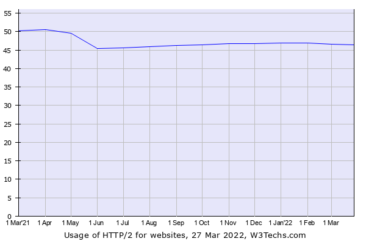

현재 웹 사이트 중 약 45%정도가 HTTP/2를 사용하고 있다. 사이트에 새로운 웹 기술을 사용할 수 있는지의 여부는 다음과 같은 사항을 고려해 봐야한다.

- 웹 브라우저가 그 기술을 지원하는가
- Infrastructure가 그 기술을 지원하는가
- 그 기술이 지원되지 않는 경우, 견고한 대비책을 존재하는가

### 브라우저 측면에서의 HTTP/2 지원

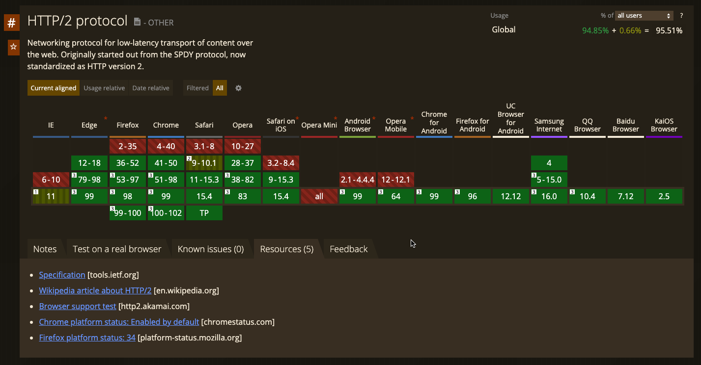

위의 표에서 알 수 있듯이 거의 모든 최신 브라우저가 HTTP/2를 지원한다. 이를 상대적 사용량으로 표현하면 아래와 같다.

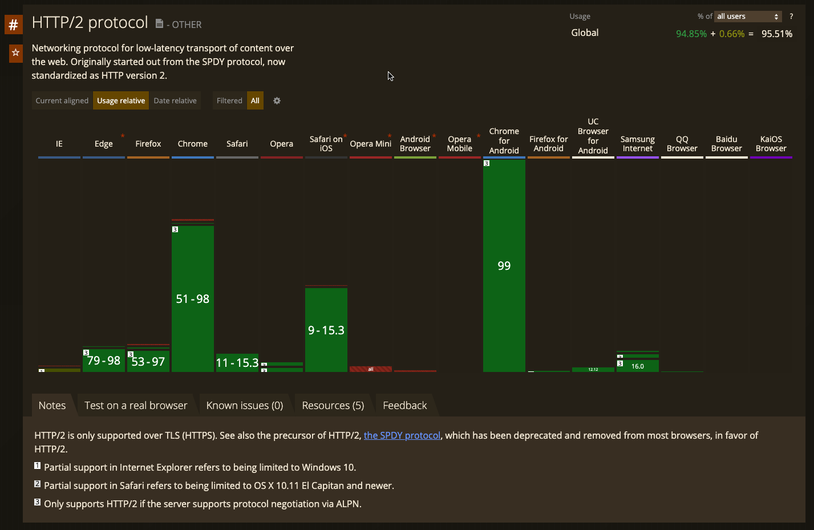

한 가지 주의해야할 점은 HTTP/2가 TLS를 통해서만 지원한다는 점이다. 즉 HTTPS를 사용하지 않는 웹 사이트는 HTTP/2가 적용될 수 없는 제한이 있다. 이러한 한계가 있음에도 HTTP/2가 HTTPS를 표준으로 강제한 이유는 그렇지 않았을 때보다 실용적이고 더 이념이기 때문이다.

HTTPS만을 통해 HTTP/2를 사용하도록 한다면, 인터넷 상의 HTTP를 인식하는 인프라는 HTTP/2 메시지 처리 방법을 모르더라도 HTTPS에 의해 암호화된 HTTP 메시지가 내부 구현과 내용을 감춰 호환성 문제를 막을 수 있다. 그리고 많은 브라우저 제공 업체들은 모든 웹사이트가 암호화된 HTTPS로 반드시 옮겨져야 한다고 생각한다. 이러한 점들 때문에 HTTPS는 HTTP/2의 스펙에 강제되었다.

### 서버 측면에서의 HTTP/2 지원

[HTTP/2 Github](https://github.com/httpwg/http2-spec/wiki/Implementations)에서 클라이언트와 서버 양 측에 대한 구현 정보를 확인할 수 있는데, 인터넷 사이트의 80%이상을 차지하는 4개의 서버, 아파치, 엔진엑스, 구글, MS IIS 모두 HTTP/2를 지원한다. 하지만 웹 서버 구현에 사용된 서버 소프트웨어 버전이 HTTP/2 지원하는가가 주요 이슈다.

더불어서 앞서 언급했듯이, HTTP/2의 엄격한 HTTPS 요구 사항이 또 다른 문제이다. 종종 웹 서버는 SSL/TLS 구현을 별도의 라이브러리, 일반적으로는 OpenSSL에 맡긴다. 이로 인해 OpenSSL 라이브러리 지원 여부로 인해 HTTP/2 허용 여부가 결정되기도 한다.

### HTTP/2가 지원되지 않는 경우의 대비책

HTTP/2가 지원되지 않는 웹 사이트가 있더라도 HTTPS를 통한 HTTP/1.1 사용으로 대체되어 여전히 동작될 수 있다. 다만 초반에 살펴본 바와 같이 성능 상으로 발생할 수 있는 문제들이 존재할 수 있다.

## 웹 사이트에서 HTTP/2를 활성화시키는 방법

HTTP/2로 옮겨가는 확실한 방법은 웹 서버에서 이를 활성화하는 것이지만, 이 절차는 업그레이드를 수반한다. 이 방법외에도 웹 서버 앞에 HTTP/2 연결을 처리하는 인프라를 추가하거나, CDN (Content Delivery Network) 서비스를 적용하는 등의 옵션이 있다.

### 웹 서버상의 HTTP/2

서버 운영 환경 중 다수는 안정성을 새로운 기능보다 우선시하는 경향이 있다. 이로 인해 HTTP/2를 지원하지 않는 버전의 웹 서버가 구동되는 곳이 많을 것이다. 그럼에도 새로운 기능을 서버에서 사용하고 싶은 경우, 서드파티에서 빌드된 애플리케이션을 설치하곤 한다. 다만 이 경우 서드파티 패키지의 제공자에 대한 신뢰와 거기에서 사용된 라이브러리에 대한 이해가 확실히 이해한 후 진행하여야 예상치 못한 리스크를 줄일 수 있다.

### 역방향 프록시를 사용한 HTTP/2

> **프록시**
>
> 프록시는 클라이언트와 서버 사이에 위치하여 그들 사이의 HTTP 메시지를 정리하는 중개인처럼 동작한다. 웹 프록시가 없다면 클라이언트는 서버와 직접 통신하여 클라이언트가 웹 트랜잭션을 완료한다. 프록시가 있다면 여전히 클라이언트가 트랜잭션을 마치지만, 추가로 프록시 서버가 제공하는 여러 기능을 이용할 수 있게 된다.
>
> - 출구 (Egress) 프록시
>
>   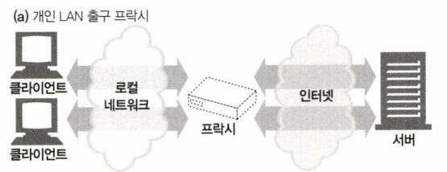
>
>   로컬 네트워크와 외부 인터넷 사이를 오가는 트래픽을 제어하기 위해 프록시를 로컬 네트워크의 출구에 박아 넣은 형태 회사 밖의 악의적인 해커들을 막는 방화벽을 제공하기 위해, 혹은 인터넷 트래픽의 성능을 개선하기 위해 사용될 수 있다.
>
> - 입구/접근 프록시
>
>   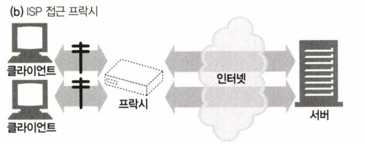
>
>   고객으로부터의 모든 요청을 종합적으로 처리하기 위해 프록시 ISP (Internet Service Provider, e.g., KT, SK BroadBand, U+) 접근 지점에 위치하기도 한다. ISP는 사용자들의 다운로드 속도를 개선하고 인터넷 대역폭 비용을 줄이기 위해 캐시 프록시를 사용해 많이 찾는 리소스들의 사본을 저장한다.
>
> - 리버스 (Reverse) 프록시
>
>   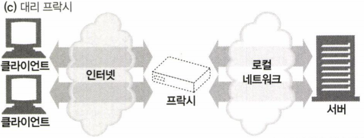
>   
>   네트워크의 가장 끝에 있는 웹 서버들의 바로 앞에 위치하여 웹 서버로 향하는 모든 요청을 처리하고 필요할 때만 웹 서버에게 리소스를 요청할 수 있다. 또한 웹 서버에 보안 기능을 추가하는 등으로 사용된다.
>   
> - 네트워크 교환 프록시
>
>   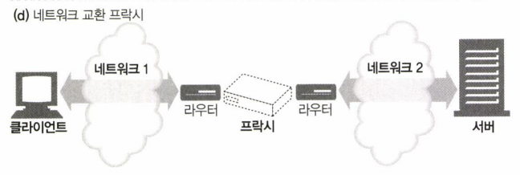
>   
>   캐시를 이용해 인터넷 교차로의 혼잡을 완화하고 트래픽 흐름을 감시하기 위해, 충분한 처리 능력을 갖춘 프록시가 네트워크 사이의 인터넷 피어링 교환 지점들에 놓일 수 있다.
>

> **프록시 vs 게이트웨이**
>
> 엄밀히 구분하자면, 프록시는 같은 프로토콜을 사용하는 둘 이상의 애플리케이션을 연결하고 게이트웨이는 서로 다른 프로토콜을 사용하는 둘 이상을 연결한다. 즉 게이트웨이는 클라이언트와 서버가 다른 프로토콜로 말하더라도 서로 간의 트랜잭션을 완료할 수 있도록 변환기처럼 동작한다. 실질적으로는 둘의 차이점은 모호하다. 브라우저와 서버는 다른 버전의 HTTP를 구현하기 때문에 프록시는 약간의 프로토콜 변환을 처리하기도 한다.

웹 서버 앞에 HTTP/2로 소통하는 역방향 프록시 서버를 둠으로써 HTTP/2를 구현할 수 있다.역방향 프록시는 인터넷으로부터 내부로 들어오는 트래픽을 처리해 외부에서 직접 이용할 수 없는 서버에 접근할 수 있도록 한다. 주로 다음과 같은 이유로 사용된다.

- 로드밸런서 (부하분산) 로 동작

  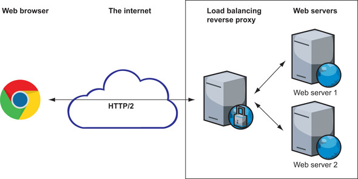

  로드밸런서는 설정에 따라 둘 중 하나의 웹 서버로 트래픽을 보낸다.

- HTTPS나 HTTP/2와 같은 기능을 오프로드 (떠넘김)

  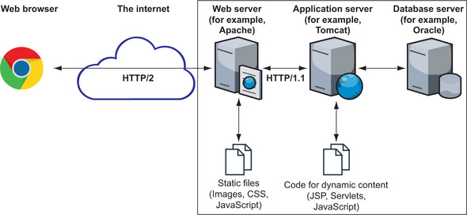

  웹 서버를 Tomcat이나 Node.js와 같은 백엔드 애플리케이션 서버 앞에 두고, 웹 서버가 프록시를 통해 요청의 일부만을 백엔드 서버로 전달하도록 하는 경우도 있다. 이 기법으로 정적 리소스 효율적 제공과 과도한 부하를 오프로드하고, HTTPS를 오프로드하고, HTTP/2를 오프로드할 수 있다. 애플리케이션 서버에 대한 부하를 경감해 서버가 맡은 본 역할에 집중하게끔 한다.

  더불어 1차 접점이 웹 서버이므로 악의적인 요청이 더 민감한 애플리케이션 서버나 백엔드 DB에 도달하지 못하도록 막을 수 있다. 따라서 HTTP/2를 활성화하기 어려운 애플리케이션 서버를 사용하고 있다면, HTTP/2를 지원하는 다른 웹 서버를 그 앞단에 두어 HTTP/2를 지원하도록 할 수 있다.

> **처음부터 끝까지 HTTP/2로 통신해야 하는가**
>
> 역방향 프록시에 HTTP/2를 구현하면 HTTP/2연결은 프록시상에서 종료되며, 이후에는 HTTP/1.1를 사용한 별도의 연결로 이어진다. 즉 HTTPS가 역방향 프록시에서 종료되고 인프라의 나머지에서 HTTP가 사용되는 꼴이다. 그렇다면 처음부터 끝까지 HTTP/2로 통신해야 할까, 그렇지 않다면 백엔드 연결을 HTTP/1.1로 함으로써 잃는 것은 무엇일까
>
> HTTP/2의 주요 이득이 최종 유저에서 말단 서버 (이 경우 역방향 프록시) 와 같이, 높은 대기시간과 낮은 대역폭 연결에서의 속도 개선이다. 역방향 프록시에서 나머지 Infrastructure로의 트래픽은 낮은 대기시간과 높은 대역폭 네트워크 링크를 통해 짧은 거리를 이동할 가능성이 크므로, HTTP/1.1 성능 문제는 대부분 별문제가 아니다.
>
> HTTP/2 트래픽에 대한 단일 연결 사용 또한 역방향 프록시에서 실제 서버로의 과정에서 이득이 별로 없다. 주로 브라우저가 설정하는 여섯 개의 연결 제약 때문에 HTTP/2 단일 스트림 연결이 이득이었지만, 역방향 프록시 - 실제 서버 사이에는 그러한 제약이 없기 때문이다.
>
> 이러한 이유로, 기본적인 HTTP/2 지원을 위해 처음부터 끝까지 통실할 잠재적인 필요성이 없다.

### CDN을 통한 HTTP/2

CDN은 웹 사이트에 대한 지역적으로 지점 역할을 하는 일련의 서버다. 웹 사이트의 방문자들은 가장 가까운 CDN 서버에 연결되고, 요청은 웹 서버로 다시 라우팅되며 다음에 동일한 요청이 들어롤 때 더 빠르게 응답할 수 있도록 사본이 CDN에 캐싱될 수 있다. 대부분의 CDN은 이미 HTTP/2를 지원하므로 원본 서버를 HTTP/1.1로 두고 CDN을 사용해 HTTP/2로 전환할 수 있다.

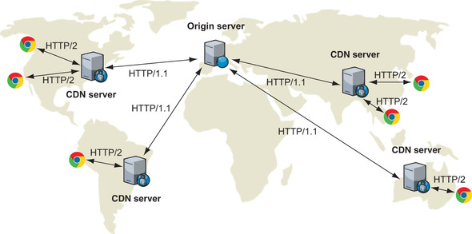

지역 서버가 클라이언트를 위해 일부 연결 설정 요청 (e.g., 초기 TCP 연결 및 HTTPS Handshake) 을 처리하여, 추가적인 인프라를 더하는 데도 CDN은 상당히 빠를 수 있다. 즉 이는 요청에 포함되는 추가적인 서버 Network Hop의 손해보다, 유저에 인접한 서버가 이러한 클라이언트 설정 요청을 처리하게 만드는 이득이 크다는 의미다. 더불어 추가 요청이 원본 서버가 아니라 지역 서버에서 직접 처리되도록 CDN 서버마다 캐싱될 수 있으므로, 시간 및 대역폭이 절약된다.

