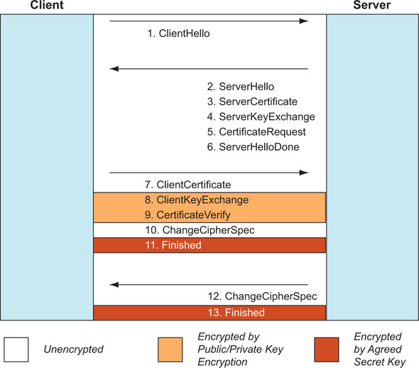

# HTTP/2 사용

HTTP/2가 제공하는 모든 이점을 사용하려면 프로토콜을 더 깊이 이해할 필요가 있다. 이번 포스팅에서는 웹 사이트 소유자와 개발자가 HTTP/2의 대부분을 활용할 수 있게 하는 프로토콜의 기술적인 세부 사항을 다룬다.

## HTTP/1.2가 아닌 HTTP/2

HTTP/2는 이전 버전의 성능 문제를 해결하고자 탄생했고, 다음의 개념을 추가했다는 차이가 있다.

- 텍스트 기반이 아닌 바이너리 프로토콜
- 동기 방식이 아닌 다중화 (Multiplexed)
- 흐름 제어
- 스트림 우선 순위화
- 헤더 압축
- 서버 푸시

이 개념들은 프로토콜이 다른 구조와 형식을 갖게 되며 하위 호환을 깨뜨리는 변경이다. 대부분은 클라이언트와 서버 사이의 네트워크에서 전송되는 방식에 대한 사항들이며, 웹 개발자가 다루는 수준 혹은 그 이상에서 HTTP/2는 HTTP/1처럼 작동한다. 동일한 메서드, 응답 상태 코드, 헤더를 사용한다. 다만 그럼에도 HTTP/2를 견실하게 이해하면 웹 개발자가 더 나은 사이트를 만드는 최적화를 할 수 있을 것이다.

### 텍스트 대신 바이너리

텍스트 기반 프로토콜은 사람이 이해하기 쉽지만 컴퓨터가 해석하기는 어렵다. 이로 인해 현대 인터넷에서 HTTP/1 프로토콜의 사용이 점점 더 제한되고 있다. HTTP/2에서는 HTTP 메시지가 분명하게 정의된 프레임으로 나눠지고 전송되는, 바이너리 프로토콜로 옮겨간다. 여기서의 프레임은 TCP 패킷과 비슷하다. TCP에서 Fragment된 패킷이 그렇듯이, 모든 프레임이 수신되면 완전한 HTTP 메시지가 재구성된다.

그리고 HTTP/2의 바이너리 표현은 메시지의 전송과 송신을 위한 것이며, 메시지 자체는 이전의 HTTP 메시지와 유사하다. 바이너리 프레임으로 나누는 것은 보통 Low-Level에서 처리되기 때문에 JS 애플리케이션과 같은 High-Level에서는 메시지가 전송되는 방식을 신경 쓸 필요가 없다. 다만, 프레임을 이해하고 보는 것은 예기치 못한 오류를 디버깅하는 데에 도움이 될 수 있다.

### 동기적이기보다는 다중화된 프로토콜

HTTP/2에서는 각각의 HTTP 요청이나 응답에 대해 다른 스트림을 사용해 단일 연결 상에서 여러 개의 요청을 동시에 진행할 수 있다. 동시에 발생하는 여러 개의 독립적인 요청이라는 개념은 프레임 각각이 스트림 식별자 (레이블) 를 갖는 바이너리 프레임 계층으로 되면서 가능해졌다. 이는 대부분의 브라우저가 허용하는 6개의 병렬적 HTTP/1 연결과는 대조적으로 다수의 메시지가 동시에 동일한 Multiplexed 연결에서 송신/수신되도록 한다.


위 예제는 세 개의 HTTP 요청을 단일 TCP 연결에 하니씩 전송되고 응답은 섞여 돌아오며, 각 요청을 보낸 다음 응답을 받기까지 블록킹되지 않는다. 클라이언트가 요청의 우선 순위를 표시할 수 있는 있지만, 응답을 전송하는 순서는 완전히 서버에게 달렸다.

각 요청은 Ascending Sequence 성질의 스트림 ID를 가지며, 응답 또한 동일한 스트림 ID로 돌아온다. 스트림은 버려지고 재사용되지 않는 반면, HTTP/1.1 연결은 열린 채로 유지하고 다른 요청을 보내는 데 재사용되기 때문에 HTTP/2 스트림과 HTTP/1.1 연결은 직접적으로 유사하지 않다. 스트림 ID 충돌을 피하고자 클라이언트가 시작하는 요청은 홀수 ID를 사용하고, 서버가 시작한 요청은 짝수를 사용한다. 스트림 ID 0은 연결을 관리하고자, 클라이언트와 서버 양측이 모두 사용하는 제어 스트림이다.

### 스트림 우선 순위화와 흐름 제어

이전의 HTTP에서 메시지를 보낼 때 사용한 우선 순위화는 보통 중요한 리소스 (e.g., HTML, Render Blocking CSS) 를 먼저 요청하고 블로킹하지 않는 항목 (e.g., Image, Async JS) 을 나중에 요청하는데 필요했다. 요청은 브라우저가 관리하는 큐에 Push되며 우선 순위가 정해지고, HTTP/1 연결을 기다린다.

HTTP/2에서는 동시에 전송될 수 있는 요청의 최대 수 제한이 훨씬 크기 때문에 (보통 100개의 Active 스트림이 기본), 더 이상 브라우저가 많은 요청을 큐로 관리할 필요없이 바로 전송할 수 있다. 큐에서 관리했던 우선 순위 대신 스트림에 우선 순위가 매겨져 중요 리소스를 먼저 전송되도록 한다.

흐름 제어는 동일한 연결에 여러 개의 스트림을 사용하는 데 따라 필연적으로 필요한 것이다. 메시지를 송신자가 보내는 만큼 수신자가 빠르게 처리할 수 없다면 버퍼 처리되어야 하며, 결국 패킷이 버려지고 다시 전송되게 만드는 백로그가 존재한다. TCP는 Connection 수준에서 연결의 속도를 낮출 수 있지만, HTTP/2는 스트림 수준에서 할 수 있어야 한다. 예를 들어 생방송 중인 동영상이 있는 웹 페이지의 경우, 사용자가 영상을 일시 정지한다면 그 HTTP/2 스트림에 대해서만 다운로드를 정지하면서도 다른 스트림을 통해 웹 사이트가 사용하는 다른 모든 리소스를 최대 수용량으로 계속 다운로드하도록 하는 식이다.

### 헤더 압축

HTTP 헤더는 요청 및 응답에 대한 추가적 정보를 보내는 데 사용되는데, 종종 모든 리소스에 대해 동일하게 보내지기 때문에 반복이 많이 발생한다. 주로 자주 반복되는 헤더는 아래와 같다.

- Cookie

  쿠키는 해당 도메인에 대한 모든 요청에 전송된다.

- User-Agent

  일반적으로 사용하는 웹 서버를 명시한다. 하나의 세션 동안 변경되지 않지만, 모든 요청에 대해 전송된다.

- Host

  요청 URL을 특정하는데 사용하며, 동일한 호스트에 대한 요청 각각에 대해 항상 동일하다.

- Accept

  기대하는 응답의 형식을 정의한다. 브라우저가 지원하는 형식은 대부분 변하지 않기 때문에 각 인스턴스에서 동일하다.

- Accept-Encoding

  압축 형식을 정의한다. 위와 비슷하게 세션 내내 변하지 않는다.

이러한 헤더는 중복되며 낭비다. HTTP/1에서는 HTTP 본문 압축을 허용 (Accept-Encoding 헤더가 생긴 이유) 했지만, HTTP 헤더 압축은 아니었다.

### 서버 푸시

HTTP/2에서는 서버가 하나 이상의 응답으로 요청에 답할 수 있는 푸시 개념이 추가되었다. 이전에는 브라우저는 반환된 홈페이지를 읽고 페이지를 렌더링하기 전에 필요한 다른 리소스를 요청해야 했지만, HTTP/2에서는 서버 푸시로 첫 응답과 함께 전송될 수 있다. 이는 주의해서 사용하지 않으면 대역폭을 낭비할 수 있기 때문에, 언제 그리고 어떻게 푸시할지 결정하는 것이 이 기능을 최대로 활용하는데 중요한 포인트다. 이에 관해서는 뒤에서 설명한다.

## HTTP/2 연결이 설정되는 방식

HTTP/1에서 HTTP/2로의 전환을 위해 새로운 스킴과 포트를 사용해야 한다면 아래와 같은 문제가 발생할 수 있다.

- HTTP에서 HTTPS로의 전환이 그랬듯이, 웹 사이트들에 접속할 수 있도록 HTTP/2를 적용한 주소로 리디렉션해야하며 이는 속도 저하를 야기한다.
- 웹 사이트의 링크를 새 체계로 바꿔야 한다.
- 비표준 포트를 막는 방화벽이 존재하는 것과 같이, 기존 네트워크 인프라와 호환성 문제가 발생한다.

이러한 이유로 HTTP/2는 새로운 체계를 사용하지 않고 대안을 모색했으며, 다음과 같다.

- HTTPS 협상을 사용한다.
- HTTP Upgrade 헤더를 사용한다.
- 사전 지식을 사용한다.

### HTTPS 협상 사용

HTTPS 연결은 본격적으로 HTTP 메시지가 교환되기 전에 사용할 SSL/TLS 프로토콜, 암호화 방식, 그 외의 다양한 설정을 합의한다. 이 단계는 유연해서 클라이언트와 서버가 서로 합의만 하면 새로운 HTTPS 프로토콜과 암호화 방식이 도입되고 사용될 수 있다. 즉, HTTP/2 지원이 HTTPS Handshake 과정에서 이뤄질 수 있다. HTTPS Handshake는 아래와 같은 4 세트의 메시지를 포함한다.



- 클라이언트는 암호화 능력을 열거하는 `ClientHello` 메시지를 전송한다. 아직 암호화 방식 합의 전이므로, 이 메시지는 평문으로 전송된다.
- 서버는 비슷한 `ServerHello` 메시지로 답하는데, 클라이언트가 어떤 걸 지원하는 가를 기반으로 HTTPS 프로토콜 (e.g., TLSv1.2) 을 선택한다. 그리고 HTTPS 인증서를 가리키는 `ServerCertificate`, 암호화 방식을 나타내는 `ServerKeyExchange`, 클라이언트 HTTPS 인증서 요청 여부를 나타내는 `CertificateRequest`도 보내며, 마지막으로 `ServerHelloDone`을 보낸다.
- 클라이언트는 서버 인증서를 검증하고, 요청받은 경우 클라이언트 인증서 `ClientCertificate`를 보내며, 서버 인증서의 공개키로 암호화하여 서버의 개인키만으로 복호화될 수 있도록 하는 `ClientKeyExchange`도 보낸다. 더불어 클라이언트 인증서가 사용되고 있다면, 클라이언트 개인키로 서명된 `CertificateVerify` 메시지가 전송되어 소유권을 증명한다. 그리고 클라이언트가 `ServerKeyExchange`와 `ClientKeyExchange`를 이용해 암호화된 대칭키를 정의하고 `ChangeCipherSpec` 메시지를 보내 암호화가 시작됨을 알린다.
- 서버도 암호화된 연결로 전환함을 알리는 `ChangeCipherSpec`과 함께 `Finished` 메시지를 보낸다.

위 과정은 신원 확인에도 사용된다. 서버가 개인키로 메시지를 서명하면 해당 메시지를 클라이언트가 서버의 공개키로 풀어볼 수 있기에 해당 인증서가 서버의 소유임을 확인할 수 있다. 또한 SSL/TLS 인증서 각각은 신뢰하는 제3자 인증 기관이 암호화하여 서명한다.

적어도 두 번의 Round Trip을 거쳐야 비로소 HTTPS 세션이 설정되고, 이후에는 합의된 대칭키로 암호화된다. 그럼에도  HTTPS의 이점이 초기 연결의 성능 비용을 넘어선다고 판단하기에 사용되고 있다.


ALPN (Application-Layer Protocol Negotiation) 은 `ClientHello` 메시지에 확장 기능을 더해 클라이언트가 애플리케이션 프로토콜 지원을 알릴 수 있도록 했고, `ServerHello` 메시지에도 추가해 서버가 HTTPS 협상 이후에 어떤 프로토콜을 사용할지 확정할 수 있도록 했다. 즉, 이는 추가적인 Round Trip 혹은 업그레이드 사항을 추가하지 않고도 HTTP/2 사용 여부를 합의할 수 있다. 다만 ALPN은 비교적 새로운 프로토콜이기 때문에 지원하는 서버가 적다. 이러한 경우 클라이언트가 HTTP/2를 지원하지 않는다고 가정하여 HTTP/1.1을 사용한다.

다음은 `curl`을 이용해 페이스북과 초기 합의하는 예제이다.

```bash
curl -vso /dev/null --http2 https://www.facebook.com
*   Trying 31.13.76.35:443...
* Connected to www.facebook.com (31.13.76.35) port 443 (#0)
* ALPN, offering h2
* ALPN, offering http/1.1
* successfully set certificate verify locations:
*  CAfile: /etc/ssl/cert.pem
*  CApath: none
* TLSv1.2 (OUT), TLS handshake, Client hello (1):
} [230 bytes data]
* TLSv1.2 (IN), TLS handshake, Server hello (2):
{ [102 bytes data]
* TLSv1.2 (IN), TLS handshake, Certificate (11):
{ [2905 bytes data]
* TLSv1.2 (IN), TLS handshake, Server key exchange (12):
{ [149 bytes data]
* TLSv1.2 (IN), TLS handshake, Server finished (14):
{ [4 bytes data]
* TLSv1.2 (OUT), TLS handshake, Client key exchange (16):
} [70 bytes data]
* TLSv1.2 (OUT), TLS change cipher, Change cipher spec (1):
} [1 bytes data]
* TLSv1.2 (OUT), TLS handshake, Finished (20):
} [16 bytes data]
* TLSv1.2 (IN), TLS change cipher, Change cipher spec (1):
{ [1 bytes data]
* TLSv1.2 (IN), TLS handshake, Finished (20):
{ [16 bytes data]
* SSL connection using TLSv1.2 / ECDHE-ECDSA-AES128-GCM-SHA256
* ALPN, server accepted to use h2
* Server certificate:
*  subject: C=US; ST=California; L=Menlo Park; O=Facebook, Inc.; CN=*.facebook.com
*  start date: Jan  8 00:00:00 2022 GMT
*  expire date: Apr  8 23:59:59 2022 GMT
*  subjectAltName: host "www.facebook.com" matched cert's "*.facebook.com"
*  issuer: C=US; O=DigiCert Inc; OU=www.digicert.com; CN=DigiCert SHA2 High Assurance Server CA
*  SSL certificate verify ok.
* Using HTTP2, server supports multi-use
* Connection state changed (HTTP/2 confirmed)
```

- 클라이언트가 ALPN을 사용해 HTTP/2와 HTTP/1.1 지원을 명시
- 여러 Handshake 단계를 거쳐, TLSv1.2 / ECDHE-ECDSA-AES128-GCM-SHA256 암호화와 h2 ALPN 설정으로 연결
- 서버 인증서 표시
- `curl`이 HTTP/2로 전환

### HTTP Upgrade 헤더 사용

클라이언트는 HTTP Upgrade 헤더를 보내 기존 HTTP/1.1 연결을 HTTP/2로 전환하도록 요청할 수 있다. 이 헤더는 HTTP without HTTPS 연결에서만 사용되어야 한다. HTTP with HTTPS의 경우에는 ALPN을 사용해야 한다.

- 예제 1: 실패한 Upgrade 요청

  클라이언트가 HTTP/2를 지원하기에 HTTP Upgrade 헤더가 있는 HTTP/1.1 요청을 전송했다.

  ```http
  GET / HTTP/1.1
  Host: www.example.com
  Upgrade: h2c
  HTTP2-Settings: <나중에 설명>
  ```

  그러나 HTTP/2를 지원하지 않는 서버는 평소와 같이 HTTP/1.1 메시지로 응답한다.

  ```http
  HTTP/1.1 200 OK
  ...생략
  ```

- 예제 2: 성공한 Upgrade 요청

  HTTP/2를 지원하는 서버의 경우, 프로토콜을 전환할 것이라는 HTTP/1.1 101 응답을 보낸다.

  ```http
  HTTP/1.1 101 Switching Protocols
  Connection: Upgrade
  Upgrade: h2c
  ```

  이후 서버는 곧바로 HTTP/2로 전환해 원본 메시지에 대한 응답을 HTTP/2 형식으로 보낸다.

- 예제 3: 서버가 제안한 Upgrade

  클라이언트는 서버가 HTTP/2를 지원하지 않는다고 가정해서 Upgrade 헤더를 전송하지 않는다.

  ```http
  GET / HTTP/1.1
  Host: www.example.com
  ```

  HTTP/2를 지원하는 서버는 HTTP Upgrade 헤더를 사용함으로써 클라이언트에게 알릴 수 있다.

  ```http
  HTTP/1.1 200 OK
  Date: Sun, 25 Jun 2017 13:30:24 GMT
  Connection: Keep-Alive
  Content-Type: text/html
  Server: Apache
  Upgrade: h2c, h2
  ...생략
  ```

  이는 업그레이드 요청이 아닌 제안이다. 이 메시지를 받은 클라이언트는 앞선 두 예제에서처럼 다음 요청에 Upgrade 헤더를 포함시켜 HTTP/2 전환 요청을 보낼 수 있다.

### 사전 지식 사용

서버가 이미 HTTP/2를 지원한다는 사실을 클라이언트가 알고 있을 때, 어떤 업그레이드 요청도 없이 바로  HTTP/2로 통신을 시작할 수 있다. 다만 사전 지식이 잘못된 경우에 대비해, HTTP/2 요청에 대한 거절 메시지를 적절히 처리할 수 있도록 유의해야 한다. 따라서 이 방식은 클라이언트와 서버를 모두 관리하는 경우에만 주로 사용된다.

### HTTP/2 Preface 메시지

HTTP/2 연결을 통해 처음으로 반드시 전송되어야 하는 메시지를 HTTP/2 연결 Preface 또는 매직 문자열이라고 한다. 클라이언트가 이 메시지를 HTTP/2 연결의 첫 메시지로 보내게 되는데, 24개의 Octet 시퀀스이다. 아래는 16진수로 표현한 Preface 메시지다.

```
0x505249202a20485454502f322e300d0a0d0a534d0d0a0d0a
```

이를 다시 ASCII 메시지로 변환하면 아래와 같다.

```http
PRI * HTTP/2.0\r\n\r\nSM\r\n\r\n
```

즉, 이는 아래와 같다.

```http
PRI * HTTP/2.0

SM

```

PRI라는 HTTP 메서드가 위치하고, 리소스는 *이며, HTTP 버전 번호가 2.0, 본문은 SM이라는 의미다. 이 메시지의 의도는 HTTP/2를 지원하지 않는 서버에 HTTP/2로 통신하려고 시도하려는 것이다. HTTP/2를 지원하지 않는 서버는 이 메시지를 이해하지 못하고 거부할 것이고, 지원하는 서버는 SETTINGS 프레임을 보낸다.

## HTTP/2 프레임

비록 프레임은 많은 웹 개발자가 알 필요는 없는 저수준의 개념이지만, HTTP/2를 프레임 수준에서 살펴보면 디버깅하기 쉬우므로 이론적인 면과 함께 실용적이기도 하다.

### HTTP/2 프레임 뷰어 도구

크게 3가지 도구가 있다.

- 크롬 net-export

  크롬 브라우저에서 `chrome://net-export`에 접속한 후 로깅을 시작하고, 다른 탭에서 HTTP/2 사이트를 열고 로딩이 끝나면 로깅을 중단한다. `json`형태의 로그 파일이 생성되는데, NetLog 뷰어를 이용해 로그 파일을 정돈해 분석할 수 있다.

- Nghttp

- Wireshark

  기본적으로 와이어샤크는 컴퓨터가 보내고 받는 모든 트래픽을 들여다 볼 수 있게 해주는 도구이다. 따라서 브라우저에서 서버로 전송되는 트래픽을 스니핑하기 때문에 암호화된 메시지를 가져온다. 메시지의 세부 내용을 보기 위해서는 키값을 명시해주어야 한다. `SSLKEYLOGFILE` 환경변수에 키 파일을 설정하여 크롬 브라우저에서 사용하도록 하고, 동일한 파일을 와이어샤크 설정의 SSL 탭에 등록한다.

### HTTP/2 프레임 형식

HTTP/2 프레임 각각은 Fix-Length 헤더와 그에 이어지는 Payload로 구성된다.

```
+-----------------------------------------------+
|                 Length (24)                   |
+---------------+---------------+---------------+
|   Type (8)    |   Flags (8)   |
+-+-------------+---------------+-------------------------------+
|R|                 Stream Identifier (31)                      |
+=+=============================================================+
|                   Frame Payload (0...)                      ...
+---------------------------------------------------------------+
```

- Length: 24 bits

  프레임의 길이를 나타내며, 최대 크기는 2^24-1 옥텟이다. 이는 `SETTING_MAX_FRAME_SIZE`에 의해 제한되는데, 기본값은 더 작은 2^14 옥텟이다.

- Type: 8 bits

  현재 14개의 프레임 유형이 정의되어있다.

  ```
  | Data(0x0) | HEADERS(0x1) | PRIORITY(0x2) | RST_STREAM(0x3) | SETTINGS(0x4) |
  | PUSH_PROMISE(0x5) | PING(0x6) | GOAWAY(0x7) | WINDOW_UPDATE(0x8) | CONTINUATION(0x9) |
  | ALTSVC(0xa) | (0xb) | ORIGIN(0xc) | CACHE_DIGEST(0xd) |
  ```

  HTTP/2는 확장 가능하도록 작성되었기 때문에, 향후에 계속해서 프레임 유형이 늘어날 것이다.

- Flags: 8 bits

  프레임 유형에 따라 사용되는 특화 플래그

- Reserved Bit: 1 bit

  현재 사용되지 않으며 반드시 0으로 설정되어야 한다.

- Stream Identifier: 31 bits

  프레임을 식별하는 부호 없는 31비트 정수이다.

### HTTP/2 메시지 흐름 예제

```
nghttp -nv https://www.facebook.com | more
```

위와 같이 페이스북과의 HTTP/2 통신을 통해 메시지들을 프레임 별로 적절히 쪼개어 살펴보려 한다.

> **들어가기 전 용어 정리**
>
> - Frame
>
>   HTTP/2 통신 상의 제일 작은 정보 단위이다.
>
> - Message
>
>   HTTP/1.1과 마찬가지로 요청 혹은 응답의 단위이며, 다수의 Frame Sequence로 이루어진다.
>
> - Stream
>
>   클라이언트와 서버 사이에 맺어진 연결을 통해 양방향으로 주고받는 하나 혹은 복수 개의 Mesaage다.
>
> 즉 Frame 여러 개가 모여 Message, Mesaage 여러 개가 모여 Stream이 되는 구조다.

```
[  0.047] Connected
The negotiated protocol: h2
[  0.059] send SETTINGS frame <length=12, flags=0x00, stream_id=0>
          (niv=2)
          [SETTINGS_MAX_CONCURRENT_STREAMS(0x03):100]
          [SETTINGS_INITIAL_WINDOW_SIZE(0x04):65535]
```

먼저 HTTPS를 통한 HTTTP/2 (h2) 로 연결하고 협의하는 과정을 거친다. `nghttp` 는 HTTPS 설정이나 HTTP/2 Preface 메시지를 출력하지 않으므로, `SETTINGS` 프레임을 최초로 받는다.

**PRIORITY 프레임**

```
[  0.059] send PRIORITY frame <length=5, flags=0x00, stream_id=3>
          (dep_stream_id=0, weight=201, exclusive=0)
[  0.059] send PRIORITY frame <length=5, flags=0x00, stream_id=5>
          (dep_stream_id=0, weight=101, exclusive=0)
[  0.059] send PRIORITY frame <length=5, flags=0x00, stream_id=7>
          (dep_stream_id=0, weight=1, exclusive=0)
[  0.059] send PRIORITY frame <length=5, flags=0x00, stream_id=9>
          (dep_stream_id=7, weight=1, exclusive=0)
[  0.059] send PRIORITY frame <length=5, flags=0x00, stream_id=11>
          (dep_stream_id=3, weight=1, exclusive=0)
```

위 프레임들은 `nghttp`가 사용할 다양한 우선 순위의 스트림 몇 개를 생성한다. 이 `PRIORITY` 프레임 (0x2) 은 고정 길이이며 어떤 플래그도 사용하지 않는다. 그리고 각 스트림에는 1~256 사이의 Weight 값이 할당될 수 있고, 다른 스트림에 대한 Dependency가 부여될 수 있다. 아래는 `PRIORITY` 프레임 형식이다.

| Field             | Length  | Description                                  |
| ----------------- | ------- | -------------------------------------------- |
| E (Exclusive)     | 1 bit   | 스트림이 Exclusive한지 나타낸다.             |
| Stream Dependency | 31 bits | 이 헤더가 어떤 스트림과 관련있는지 나타낸다. |
| Weight            | 8 bits  | 이 스트림의 가중치를 나타낸다.               |

위의 내용만으로는 쓰임이 잘 이해되지 않아서 [Google Developers](https://developers.google.com/web/fundamentals/performance/http2?hl=ko#%EC%8A%A4%ED%8A%B8%EB%A6%BC_%EC%9A%B0%EC%84%A0%EC%88%9C%EC%9C%84_%EC%A7%80%EC%A0%95)를 참고해 알아보려 한다.

`PRIORITY` 프레임를 통해, 스트림의 Dependency와 Weight를 이용하여 클라이언트가 우선 순위 지정 트리를 구성하고 통신할 수 있다. 여기서 트리는 클라이언트가 선호하는 응답 수신 방식이며, 서버는 이를 참고해 CPU, Memory 등 기타 리소스 할당을 제어하여 스트림 처리를 한다.

스트림 Dependency는 또 다른 스트림을 상위 요소로 참조할 때 사용되며, 이 값이 생략될 경우에는 루트 스트림에 종속된다. 이를 통해, 상위 요소에 위치한 스트림에 보다 먼저 리소스가 할당되어야 함을 나타낸다. 그리고 동일한 레벨의 스트림이 여러 개 있는 경우 (즉, 동위 요소 스트림) , Weight에 비례하여 리소스가 할당되어야 한다. 예를 들어 스트림 A의 Weight가 12이고 스트림  B의 Weight이 4인 경우, 각 비율은 3/4, 1/4 이므로 스트림 A는 가용 리소스의 3/4을 B는 1/4를 할당받는다.


- Case A

  스트림 A, B는 상위 Dependency가 없이 루트에 종속된다. 따라서 두 스트림의 Weight에 따라 리소스를 상대적으로 할당받아야 한다.

- Case B

  스트림 D가 상위 Dependency며, 스트림 C는 하위 요소다. 따라서 우선 D가 리소스 전체를 먼저 할당받으며, 이 경우 동위 요소가 아니므로 Weight 값은 무시된다. 

- Case C

  스트림 D, C 순서로 우선적으로 처리된 후, 가용한 리소스를 스트림 A, B의 Weight에 따라 상대적으로 할당받아 처리된다.

- Case D (설명 생략)

그리고 Exclusive Field가 사용된 스트림의 경우, 기존 우선 순위 트리에서 새로운 레벨을 만들어내게 된다.

```
                         A
       A                 |
      / \      ==>       D
     B   C              / \
                       B   C
```

기존에 왼쪽과 같은 트리 구조에서 스트림 A에 Dependent하며 Exclusive한 스트림 D가 있는 경우, 오른쪽과 같은 트리 구조가 된다.

위의 예제들을 통해 알 수 있듯이, 스트림의 Dependency와 Weight는 리소스의 우선 순위를 지정하기 위한 기능이다. 더불어 HTTP/2는 클라이언트의 요청에 의해 설정 값을 업데이트할 수 있기 때문에, 외부 상황에 맞춰 스트림 우선 순위를 동적으로 재할당할 수 있다.

**HEADERS 프레임**

```
[  0.059] send HEADERS frame <length=40, flags=0x25, stream_id=13>
          ; END_STREAM | END_HEADERS | PRIORITY
          (padlen=0, dep_stream_id=11, weight=16, exclusive=0)
          ; Open new stream
          :method: GET
          :path: /
          :scheme: https
          :authority: www.facebook.com
          accept: */*
          accept-encoding: gzip, deflate
          user-agent: nghttp2/1.47.0
```

HTTP/2 요청 하나를 `HEADERS` 프레임 (0x1) 으로 전송하며, 콜론으로 시작하는 Pseudo 헤더를 통해 요청하는 바를 명시한다. HTTP 헤더들을 마음대로 `Key: Value` 형태로 커스텀할 수 있었던 이전 버전과 달리, 미리 정의된 스펙만 허용한다. 앱에 특정한 헤더에 대해서는 일반 HTTP 헤더를 계속 사용해야 한다.

그리고 HTTP/2는 헤더 이름은 소문자로 해야한다. 헤더 값은 대소문자가 섞여도 상관없지만 이름은 그렇지 않다. 더불어 HTTP/2는 헤더 형식에 엄격해서, 잘못된 형식 (e.g., 예상치 못한 공백, 중복 콜론, 줄 바꿈) 의 헤더들이 문제를 일으킬 수 있다.

HTTP 헤더가 단일 프레임보다 큰 경우 추가 `HEADERS` 프레임보다는 `CONTINUATION` 프레임이 사용된다. 이는 추가 `HEADERS` 프레임으로 인한 요청 혼돈을 방지하고자 한다. 실제로는 `CONTINUATION` 프레임은 거의 사용되지 않고, 대부분의 요청은 `HEADERS` 프레임에 들어간다. 아래는 `HEADERS` 프레임 형식이다.

| Field                 | Length                                         | Description                                                  |
| --------------------- | ---------------------------------------------- | ------------------------------------------------------------ |
| Pad Length            | 8 bits (Optional)                              | Padding 필드의 길이를 나타낸다. 이 프레임에 대해 Padded 플래그가 설정된 경우에만 사용된다. |
| E (Exclusive)         | 1 bit                                          | Exclusive한 스트림인지 나타낸다. 이 프레임에 대해 Priority 플래그가 설정된 경우에만 사용된다. |
| Stream Dependency     | 31 bits                                        | 이 헤더와 관련있는 스트림을 나타낸다. 이 프레임에 대해 Priority 플래그가 설정된 경우에만 사용된다. |
| Weight                | 8 bits                                         | 이 스트림의 가중치를 나타낸다. 이 프레임에 대해 Priority 플래그가 설정된 경우에만 사용된다. |
| Header Block Fragment | (프레임 길이) - (이 테이블의 나머지 필드 길이) | 가상 헤더를 포함한 요청 헤더이다.                            |
| Padding               | Pad Length로 인해 결정 (Optional)              | Padding 바이트가 0으로 설정된다. 이 프레임에 대해 Padded 플래그가 설정된 경우에 사용된다. |

`Pad Length`와 `Padding` 필드는 보안 상의 이유로 선택적으로 메시지의 실제 길이를 숨길 수 있게 하고자 추가 되었다. `Header Block Fragment` 필드는 Pseudo 헤더를 포함한 모든 헤더가 전송되는 곳이다.

`HEADERS` 프레임은 네 개의 플래그를 사용한다.

- `END_STREAM (0x1)`

  다음에 어떤 프레임도 오지 않는 경우에 설정된다.

- `END_HEADERS (0x4)`

  모든 HTTP 헤더가 이 프레임에 포함되어 있으며, 추가 헤더가 있는 `CONTINUATION` 프레임이 따라오지 않음을 나타낸다.

- `PADDED (0x8)`

  Padding이 사용되는 경우에 설정된다.

- `PRIORITY (0x20)`

  `E`, `Stream Dependency`, `Weight` 필드가 이 프레임에 설정됨을 나타낸다.

이후 요청에 대한 응답이 `HEADERS` 프레임으로 오며, 가장 먼저 3자리 숫자 코드로만 표현된 `status` Pseudo 헤더가 위치한다.

```
[  0.272] recv (stream_id=13) :status: 200
[  0.272] recv (stream_id=13) vary: Accept-Encoding
[  0.272] recv (stream_id=13) content-encoding: gzip
[  0.272] recv (stream_id=13) set-cookie: fr=0E3OUsxFhbAuoysjd..BiSQhr.5S.AAA.0.0.BiSQhr.AWU89xTtbbo; expires=Sat, 02-Jul-2022 02:37:30 GMT; Max-Age=7775999; path=/; domain=.facebook.com; secure; httponly
[  0.272] recv (stream_id=13) set-cookie: sb=awhJYvDk518_Rs86CcmjBHXG; expires=Tue, 02-Apr-2024 02:37:31 GMT; Max-Age=63072000; path=/; domain=.facebook.com; secure; httponly
[  0.272] recv (stream_id=13) x-fb-rlafr: 0
[  0.272] recv (stream_id=13) document-policy: force-load-at-top
[  0.272] recv (stream_id=13) pragma: no-cache
[  0.272] recv (stream_id=13) cache-control: private, no-cache, no-store, must-revalidate
[  0.272] recv (stream_id=13) expires: Sat, 01 Jan 2000 00:00:00 GMT
[  0.272] recv (stream_id=13) x-content-type-options: nosniff
[  0.272] recv (stream_id=13) x-xss-protection: 0
[  0.272] recv (stream_id=13) x-frame-options: DENY
[  0.272] recv (stream_id=13) strict-transport-security: max-age=15552000; preload
[  0.272] recv (stream_id=13) content-type: text/html; charset="utf-8"
[  0.272] recv (stream_id=13) x-fb-debug: ughpZ7n5TUDlDQj2JXLW8PDAz0mNTRcnEaDH5uSTcybXfJtiZvlclBU5TG+2jaGczEWP/OXGpQQVUAAHXCo9lw==
[  0.272] recv (stream_id=13) date: Sun, 03 Apr 2022 02:37:31 GMT
[  0.272] recv (stream_id=13) priority: u=3,i
[  0.272] recv (stream_id=13) alt-svc: h3=":443"; ma=86400, h3-29=":443"; ma=86400
[  0.272] recv HEADERS frame <length=616, flags=0x04, stream_id=13>
          ; END_HEADERS
          (padlen=0)
          ; First response header
```

**SETTINGS 프레임**

```
[  0.059] send SETTINGS frame <length=12, flags=0x00, stream_id=0>
          (niv=2)
          [SETTINGS_MAX_CONCURRENT_STREAMS(0x03):100]
          [SETTINGS_INITIAL_WINDOW_SIZE(0x04):65535]
... etc
[  0.068] recv SETTINGS frame <length=36, flags=0x00, stream_id=0>
          (niv=6)
          [SETTINGS_HEADER_TABLE_SIZE(0x01):4096]
          [SETTINGS_MAX_FRAME_SIZE(0x05):16384]
          [SETTINGS_MAX_HEADER_LIST_SIZE(0x06):81920]
          [SETTINGS_ENABLE_CONNECT_PROTOCOL(0x08):1]
          [SETTINGS_MAX_CONCURRENT_STREAMS(0x03):100]
          [SETTINGS_INITIAL_WINDOW_SIZE(0x04):65536]
```

`SETTINGS ` 프레임 (0x4) 은 서버와 클라이언트가 보내야만 하는 첫 프레임이다. 이 프레임은 빈 Payload나 필드/값 쌍들로 구성된다. `SETTINGS` 프레임의 경우 플래그 값을 0 또는 1로 설정하는데, 연결 상에서 설정을 알려주는 경우에는 0으로, 이미 보내진 설정에 대한 응답인 경우에는 1이다.

위에서 두번째 프레임은 플래그가 설정되지 않은 36 옥텟 길이의 Payload를 가졌으며, 스트림 ID 0을 사용한다. 그런 다음 6개 (`niv=6`) 설정이 명시되어 있으며, 각각은 식별자 (16 bits) 와 값 (32 bits) 로 이뤄진다. 예제에서 알 수 있듯이, 각 설정은 반드시 식별자 순서로 정렬되지 않아도 된다. 아래는 `SETTINGS` 프레임 형식이다.

| Field      | Length  | Description                                                  |
| :--------- | ------- | ------------------------------------------------------------ |
| Identifier | 16 bits | 8가지 설정이 정의되어 있으며 계속해서 추가될 수 있다.<br />SETTINGS_HEADER_TABLE_SIZE (0x1)<br/>SETTINGS_ENABLE_PUSH (0x2)<br/>SETTINGS_MAX_CONCURRENT_STREAMS (0x3)<br/>SETTINGS_INITIAL_WINDOW_SIZE (0x4)<br/>SETTINGS_MAX_FRAME_SIZE (0x5)<br/>SETTINGS_MAX_HEADER_LIST_SIZE (0x6)<br/>SETTINGS_ACCEPT_CACHE_DIGEST (0x7)<br />SETTINGS_ENABLE_CONNECT_PROTOCOL(0x8) |
| Value      | 32 bits | 각 설정에 대한 값들이 위치한다. 설정이 정의되지 않았다면 기본값이 사용된다. |

이어서 예제에서 설정된 각각을 살펴보자.

1. 4096 옥텟의 `SETTINGS_HEADER_TABLE_SIZE`를 사용한다.
2. 16384 옥텟의 `SETTINGS_MAX_FRAME_SIZE`를 사용한다. 클라이언트는 연결에서 이보다 큰 Payload를 전송해서는 안된다.
3. 81920 옥텟의 `SETTINGS_MAX_HEADER_LIST_SIZE`를 사용한다. 이보다 큰 압축되지 않은 헤더를 전송해서는 안된다.
4. `SETTINGS_MAX_CONCURRENT_STREAMS`를 100개의 스트림으로 설정한다.
5. 65536 옥텟의 `SETTINGS_INITIAL_WINDOW_SIZE`를 사용한다. 이는 흐름 제어를 위해 사용된다.

**WINDOW_UPDATE 프레임**

```
[  0.068] recv WINDOW_UPDATE frame <length=4, flags=0x00, stream_id=0>
          (window_size_increment=20905985)
[  0.068] recv SETTINGS frame <length=0, flags=0x01, stream_id=0>
          ; ACK
          (niv=0)
[  0.068] recv WINDOW_UPDATE frame <length=4, flags=0x00, stream_id=13>
          (window_size_increment=10420224)
[  0.068] send SETTINGS frame <length=0, flags=0x01, stream_id=0>
          ; ACK
          (niv=0)
```

서버는 `WINDOWS_UPDATE` 프레임도 전송한다. `WINODWS_UPDATE` 프레임 (0x8) 은 수신자가 감당할 수 있는 만큼만 전송하도록 데이터의 양을 제한하는 등 흐름 제어에 사용된다. HTTP/1에서는 한 번에 하나의 요청만 진행 가능한데, 그러던 중 클라이언트가 데이터에 압도되면 TCP 패킷 처리를 중단한다. 그러면 TCP 흐름 제어가 동작하고 데이터를 더 처리할 준비가 될 때까지 데이터의 전송 속도를 늦춘다.

그러나 HTTP/2에서는 동일한 연결에 여러 스트림이 존재하므로 TCP 흐름 제어에 의존할 수 없고, 스트림 별로 속도를 늦출 방식을 구현해야 한다. 이 예제의 경우 스트림 ID 0에 대해 해당 프레임이 설정되었으므로 전체 스트림에 대해 적용된다. 그리고 이후 위의 설정에 대한 응답으로 ACK가 온다. 아래는 `WINDOWS_UPDATE` 프레임 형식이다.

| Field                 | Length  | Description                                                  |
| --------------------- | ------- | ------------------------------------------------------------ |
| Reserved Bit          | 1 bit   | 사용되지 않음                                                |
| Window Size Increment | 31 bits | 다음 `WINDOW_UPDATE` 프레임이 수신 되기 전까지 전송될 수 있는 옥텟의 수 |

**DATA 프레임**

```
[  0.273] recv DATA frame <length=6479, flags=0x00, stream_id=13>
[  0.278] recv DATA frame <length=6905, flags=0x00, stream_id=13>
[  0.282] recv DATA frame <length=6901, flags=0x00, stream_id=13>
[  0.283] recv DATA frame <length=6029, flags=0x01, stream_id=13>
          ; END_STREAM
```

`HEADERS` 프레임 이후, 메시지 본문을 보내는 데 사용되는 `DATA` 프레임 (0x0) 이 온다. HTTP/1에서 메시지의 본문은 헤더 다음에 이어지는 두 개의 줄 바꿈 이후 전송되었지만, HTTP/2에서 데이터는 별도의 메시지 유형이다.

이 프레임에는 어떤 데이터든 요청에 맞게 필요한 것을 담을 수 있다. (e.g., UTF-8로 인코딩됐거나, gzip으로 압축됐거나, HTML 코드이거나, JPEG 이미지를 구성하는 바이트이거나 등등) 그리고 `HEADERS` 프레임과 마찬가지로 보안 상의 이유로 Padding을 허용한다. 아래는 `DATA` 프레임 형식이다.

| Field      | Length                           | Description                                                  |
| ---------- | -------------------------------- | ------------------------------------------------------------ |
| Pad Length | 8 bits (Optional)                | Padding 필드의 길이를 나타낸다. 이 프레임에 대해 Padded 플래그가 설정된 경우에만 사용된다. |
| Data       | (프레임의 길이) - (Padding 필드) | 데이터를 나타낸다.                                           |
| Padding    | Pad Length 필드로 결정           | Padding 바이트를 0으로 설정한다. 이 프레임에 대해 Padded 플래그가 설정된 경우에만 사용된다. |

`DATA` 프레임은 두 개의 플래그를 사용한다.

- `END_STREAM` (0x1)

  해당 프레임이 스트림의 마지막 프레임일 때 설정된다.

- `PADDED` (0x8)

  Padding이 사용되는 경우에 설정된다.

**GOAWAY 프레임**

```
[  0.283] send GOAWAY frame <length=8, flags=0x00, stream_id=0>
          (last_stream_id=0, error_code=NO_ERROR(0x00), opaque_data(0)=[])
```

`GOAWAY` 프레임은 더 이상 보낼 메시지가 없거나 심각한 오류가 발생한 경우 연결을 종료하는 데 사용되며, 별도의 플래그를 사용하지 않는다. 이 예제에서 `nghttp`는 하나의 응답을 받은 다음 종료되기 때문에 작업을 마치지 전에 연결을 닫기 위해 이 프레임을 전송했다. 아래는 `GOAWAY` 프레임 형식이다.

| Field                 | Length               | Description                                                  |
| --------------------- | -------------------- | ------------------------------------------------------------ |
| Reserved Bit          | 1 bit                | 사용되지 않는다.                                             |
| Last-Stream-ID        | 31 bits              | 마지막으로 처리되어 돌어온 스트림 ID를 나타낸다. 클라이언트가 최근에 시작된 스트림을 놓쳤는지 알 수 있도록 하기 위한 값이다. |
| Error Code            | 32 bits              | `GOAWAY` 프레임이 오류 때문에 전송된 경우 오류 코드는 아래와 같다.<br />NO_ERROR (0x0)<br />PROTOCOL_ERROR (0x1)<br />INTERNAL_ERROR (0x2)<br />FLOW_CONTROL_ERROR (0x3)<br />SETTINGS_TIMEOUT (0x4)<br />STREAM_CLOSED (0x5)<br />FRAME_SIZE_ERROR (0x6)<br />REFUSED_STREAM (0x7)<br />CANCEL (0x8)<br />COMPRESSION_ERROR (0x9)<br />CONNECT_ERROR (0xa)<br />ENHANCE_YOUR_CALM (0xb)<br />NADEQUATE_SECURITY (0xc)<br />HTTP_1_1_REQUIRED (0xd) |
| Additional Debug Data | 프레임 길이의 나머지 | 각 구현에 특화되어 별도로 정의된 바는 없다.                  |

지금까지 살펴본 프레임 유형들 외에도 몇 가지 유형이 더 있다. 또한 HTTP/2는 프레임 유형의 확장이 가능하기 때문에 계속해서 늘어날 수 있다.

**CONTINUATION 프레임**

`CONTINUATION` 프레임 (0x9) 은 크기가 큰  HTTP 헤더를 위해 사용되며, `HEADERS` 프레임이나 `PUSH_PROMISE` 프레임 바로 다음에 온다. 이 프레임이 여전히 남아있기는 하지만, 현재 그리고 앞으로도 많이 사용될 것으로 예상되지는 않는다. 아래는 `CONTINUATION` 프레임 형식이다.

| Field                 | Length                           | Description      |
| --------------------- | -------------------------------- | ---------------- |
| Header Block Fragment | (프레임 길이) - (이 필드의 길이) | 데이터를 담는다. |

`CONTINUATION` 프레임은 단 하나의 플래그를 사용한다. `END_HEADERS` (0x4) 는 모든 HTTP 헤더가 이 프레임에서 종료되며 추가 헤더가 있는 또 다른 `CONTINUAION` 프레임이 따라오지 않음을 나타낸다.

**PING 프레임**

`PING` 프레임 (0x6) 은 전송자로부터의 라운드 트립을 측정하는 데 사용되며, 수신자가 이 프레임을 수신하면 곧바로 이와 유사한 `PING` 프레임으로 응답해야 한다. 이 프레임들은 반드시 스트림  ID 0으로만 전송되어야 한다. 아래는 `PING` 프레임 형식이다.

| Field       | Length  | Description                                    |
| ----------- | ------- | ---------------------------------------------- |
| Opaque Data | 64 bits | 돌아올 PING 요청에서 전송될 데이터를 나타낸다. |

`PING` 프레임은 하나의 플래그를 사용한다. `ACK` (0x1) 는 첫 `PING` 프레임에서는 설정되어서는 안 되지만, 돌아오는 `PING` 프레임에는 설정되어야 한다.

**PUSH_PROMISE 프레임**

`PUSH_PROMISE` 프레임 (0x5) 은 서버가 클라이언트에게 명시적으로 요청받지 않은 리소스를 푸시하려고 한다고 알려주려는 경우에 사용된다. 이 프레임은 클라이언트에게 푸시될 리소스의 정보를 제공해야 하므로, 일반적으로 `HEADERS` 프레임 요청에 포함될 모든 HTTP 헤더를 포함한다. 아래는 `PUSH_PROMISE` 프레임 형식이다.

| Field                 | Length                                      | Description                                                  |
| --------------------- | ------------------------------------------- | ------------------------------------------------------------ |
| Pad Length            | 8 bits (Optional)                           | Padding 필드의 길이를 나타낸다. 이 프레임에 대해 Padded 플래그가 설정된 경우메나 사용된다. |
| Reserved Bit          | 1 bit                                       | 사용되지 않는다.                                             |
| Promised Stream ID    | 31 bits                                     | 푸시 약속이 전송될 스트림을 나타낸다.                        |
| Header Block Fragment | (프레임의 길이) - (테이블의 기타 필드 길이) | 푸시되는 리소스의 HTTP 헤더를 나타낸다.                      |
| Padding               | Pad Length에 의해 결정 (Optional)           | Padding 바이트를 0으로 설정한다.                             |

`PUSH_PROMISE` 프레임은 두 개의 플래그를 사용한다.

- `END_STREAMS` (0x4)

  모든 HTTP 헤더가 이 프레임에 포함되어 있으며, 추가 헤더가 있는 `CONTINUATION` 프레임이 따라오지 않음을 나타낸다.

- `PADDED` (0x8)

  Padding이 사용되는 경우 설정된다.

**RST_STREAM 프레임**

`RST_STREAM` 프레임 (0x3) 은 스트림을 즉시 취소 또는 재설정하는 데 사용하며, 별도의 플래그를 사용하지 않는다. HTTP/1.1은 연결을 종료하지 않는 이상 시작한 리소스 다운로드는 취소되지 않지만, HTTP/2에서 이 프레임이 사용될 때는 오류 발생 혹은 더 이상 필요없는 요청으로 인해 스트림 처리를 멈출 수 있다. 아래는 `RST_STREAM` 프레임 형식이다.

| Field      | Length  | Description                                                  |
| ---------- | ------- | ------------------------------------------------------------ |
| Error Code | 32 bits | 스트림이 종료되는 이유를 설명하는 오류 코드를 나타낸다.<br /> NO_ERROR (0x0)<br />PROTOCOL_ERROR (0x1)<br />INTERNAL_ERROR (0x2)<br />FLOW_CONTROL_ERROR (0x3)<br />SETTINGS_TIMEOUT (0x4)<br />STREAM_CLOSED (0x5)<br />FRAME_SIZE_ERROR (0x6)<br />REFUSED_STREAM (0x7)<br />CANCEL (0x8)<br />COMPRESSION_ERROR (0x9)<br />CONNECT_ERROR (0xa)<br />ENHANCE_YOUR_CALM (0xb)<br />INADEQUATE_SECURITY (0xc)<br />HTTP_1_1_REQUIRED (0xd) |

공식 사양에서 오류 코드가 의미하는 바에 대해 명확한 기준을 주지 않는다. 결국 어떤 오류 코드를 언제 사용할 지 결정하는 것은 구현자에게 달려 있다.

**ALTSVC 프레임**

`ALTSVC` 프레임 (0xa) 은 서버가 특정 리소스를 얻기 위해 사용될 수 있는 대안 서비스를 알릴 때 사용하며, 별도의 플래그를 사용하지 않는다. 아래는 `ALTSVC` 프레임 형식이다.

| Field               | Length                                         | Description                    |
| ------------------- | ---------------------------------------------- | ------------------------------ |
| Origin-Len          | 16 bits                                        | Origin 필드의 길이를 나타낸다. |
| Origin              | Origin-Len에 의해 결정                         | 대안 URL을 나타낸다.           |
| Alt-Svc-Field-Value | (프레임의 길이) - (이 테이블의 기타 필드 길이) | 대안 서비스 유형을 나타낸다.   |

**ORIGIN 프레임**

`ORIGIN` 프레임 (0xc) 은 어는 Origin들을 허용하는 지 나타내기 위해 사용하며, 별도의 플래그를 사용하지 않는다. 이 프레임은 클라이언트가 연결들을 HTTP/2 연결로 병합할지 여부를 결정하는 데 유용하다. 아래는 `ORIGIN` 프레임 형식이다.

| Field      | Length                      | Description                    |
| ---------- | --------------------------- | ------------------------------ |
| Origin-Len | 16 bits                     | Origin 필드의 길이를 나타낸다. |
| Origin     | Origin-Len 필드에 의해 결정 | 대안 URL을 나타낸다.           |

**CACHE_DIGEST 프레임**

`CACHE_DIGEST` 프레임 (0xd) 은 어떤 리소스가 캐싱되었는 지를 클라이언트가 나타낼 수 있다. 이 프레임은 클라이언트가 이미 특정 리소스를 갖고 있기 때문에 서버가 해당 리소스를 푸시하지 않아야 함을 알려줄 때 사용된다. 아래는 `CACHE_DIGEST` 프레임 형식이다.

| Field        | Length                                    | Description                             |
| ------------ | ----------------------------------------- | --------------------------------------- |
| Origin-Len   | 16 bits                                   | Origin 필드의 길이를 나타낸다.          |
| Origin       | Origin-Len 필드에 의해 결정               | 이 Digest가 참조하는 Origin을 나타낸다. |
| Digest-Value | (프레임의 길이) - (이 테이블의 기타 필드) | Cache-Digest 값을 나타낸다.             |

`CACHE_DIGEST` 프레임은 두 개의 플래그를 사용한다.

- `RESET` (0x1)

  클라이언트가 서버에게 현재 유지된 `CACHE_DIGEST` 정보를 재설정 요청할 때 설정된다.

- `COMPLETE` (0x2)

## HTTP/2 서버 푸시란?

HTTP/2 서버 푸시를 사용하면 클라이언트가 요청하지 않은 추가 리소스를 보낼 수 있다. 이전 HTTP에서는 첫 리소스 요청에 대한 응답을 받은 후, 추가로 필요한 리소스를 다시 요청하고 응답받는 방식이어서 하나 이상의 라운드 트립이 더 소요된다. 한 웹 사이트를 렌더링할 때 필요한 HTML, CSS, JS 파일들 (이미지를 제외하더라도) 을 모두 응답받을 때까지 꽤나 많은 시간이 소요되는데, 이는 분명한 낭비이다.

이런 현상을 조금이나마 막기 위해 필수적인 CSS 혹은 JS 코드를  HTML에 인라인시키기도 한다. 이는 대개 첫 요청 및 응답에 대해서는 괜찮은 성능상 이점이 있지만, 어디까지나 임시방편적인 해결책이다. 보다 나은 해결책을 제시하는 것이 HTTP/2 푸시가 하려는 일이다.

HTTP/2 푸시는 기존의 패러다임 `하나의 요청 == 하나의 응답`을 깨뜨린다. 서버가 하나의 요청에 대해 여러 응답으로 답할 수 있게 된다. 이를 올바르게 사용하면 로드 시간을 개선할 수 있지만, 클라이언트가 사용하지 않거나 이미 캐싱하고 있는 리소스를 과다하게 푸시하라면 로드 시간을 오히려 저해할 수도 있다. 즉, 적절한 서버 푸시가 주요 포인트다.

> **HTTP/2 푸시와 웹소켓**
>
> HTTP/2 푸시는 클라이언트가 요청을 보내야만 서버가 여러 응답을 할 수 있다. 서버가 자의적으로 클라이언트 측에서 어떤 리소스를 필요로 할 것이라고 예상하여 푸시하는 것은 불가능하다. 즉 웹소켓과는 달리, HTTP/2는 엄밀히 양방향은 아니다. 모든 것은 여전히 클라이언트 측의 요청에서 시작된다.

## 푸시 방식

특정 웹 서버는 HTTP `link` 헤더를 이용하는 등, 푸시 방식은 각 웹 서버마다 다르다.

### HTTP link 헤더를 사용한 푸시

많은 웹 서버와 일부 CDN은 HTTP `link` 헤더를 사용해서 클라이언트가 웹 서버에게 푸시하라고 알린다. 웹 서버가 이 헤더를 보면 헤더에 참조된 리소스를 푸시하는 방식이다.

```
Header add Link "</assets/css/common.css>;as=style;rel=preload"
```

혹은 특정 경로나 파일 유형에 대해서만 푸시를 적용하고자 한다면, 아래와 같이 사용된다.

```
<FilesMatch "index.html">
    Header add Link "</assets/css/common.css>;as=style;rel=preload"
</FilesMatch>
```

`as=style` 속성은 리소스의 유형을 나타내며 (Optional), `rel=preload` 속성은 웹 서버에게 해당 리소스가 푸시되어야 함을 보여주고자 설정된다.

> **프리로드 HTTP 헤더와  HTTP/2 푸시**
>
> 프리로드 링크 헤더는 HTTP/2보다 전에 등장했으며, 원래는 클라이언트에게 주는 힌트 용도였다. 이 헤더를 사용하면 브라우저가 리소스의 다운로드 필요성 유무를 판단하기까지 기다리지 않고 리소스를 곧 바로 가져올 수 있다. HTTP/2에서 프리로드 링크 헤더는 더 나아가 리소스를 선행적으로 보내도록 서버 푸시를 구현하는 것으로 목적이 변경되었다. 만약 원본 프리로드 헤더를 사용하며 리소스를 푸시하고 싶지 않다면 `nopush` 속성을 사용할 수 있다.
>
> ```
> Header add Link "</assets/css/common.css>;as=style;rel=preload;nopush"
> ```

### HTTP/2 푸시 보기

푸시된 리소스는 크롬 개발자 도구 Network 탭에서 Initiator 항목 열에 표시된다.


> 푸시된 리소스는 페이지에서 사용되는 경우에만 크롬 개발자 도구의 네트워크 탭에 표시된다. HTTP 링크 헤더 방식으로 리소스가 푸시되었다면 프리로더 사용으로 간주되므로 모두 표시되겠지만, 다른 방식으로 푸시했다면 사용된 리소스만 나타난다.

`nghttp`를 이용해서는 아래의 명령어로 가능하다.

```bash
nghttp -anv https://www.tunetheweb.com/performance/
# -a: 페이지가 필요로 하는 모든 리소스를 요청
# -n: 다운로드한 데이터를 스크린에 표시하지 않음
# -v: HTTP/2 프레임을 보여주는 장황한 출력
```

연결을 맺고 `SETTING`와 `PRIORITY` 프레임으로 설정을 한 다음, `HEADERS` 프레임을 사용해 페이지를 요청한다.

```
[  0.336] send HEADERS frame <length=53, flags=0x25, stream_id=13>
          ; END_STREAM | END_HEADERS | PRIORITY
          (padlen=0, dep_stream_id=11, weight=16, exclusive=0)
          ; Open new stream
          :method: GET
          :path: /performance/
          :scheme: https
          :authority: www.tunetheweb.com
          accept: */*
          accept-encoding: gzip, deflate
          user-agent: nghttp2/1.47.0
```

그리고 요청한 페이지를 받기 전에 서버에서 푸시한 리소스를 가리키는 `PUSH_PROMISE` 프레임을 수신한다.

```
[  0.486] recv (stream_id=13) :scheme: https
[  0.486] recv (stream_id=13) :authority: www.tunetheweb.com
[  0.486] recv (stream_id=13) :path: /assets/css/common.css
[  0.486] recv (stream_id=13) :method: GET
[  0.486] recv (stream_id=13) accept: */*
[  0.486] recv (stream_id=13) accept-encoding: gzip, deflate
[  0.486] recv (stream_id=13) user-agent: nghttp2/1.47.0
[  0.486] recv (stream_id=13) host: www.tunetheweb.com
[  0.486] recv PUSH_PROMISE frame <length=73, flags=0x04, stream_id=13>
          ; END_HEADERS
          (padlen=0, promised_stream_id=2)
[  0.486] recv (stream_id=13) :scheme: https
[  0.486] recv (stream_id=13) :authority: www.tunetheweb.com
[  0.486] recv (stream_id=13) :path: /assets/js/common.js
[  0.486] recv (stream_id=13) :method: GET
[  0.486] recv (stream_id=13) accept: */*
[  0.486] recv (stream_id=13) accept-encoding: gzip, deflate
[  0.486] recv (stream_id=13) user-agent: nghttp2/1.47.0
[  0.486] recv (stream_id=13) host: www.tunetheweb.com
[  0.486] recv PUSH_PROMISE frame <length=27, flags=0x04, stream_id=13>
          ; END_HEADERS
          (padlen=0, promised_stream_id=4)
```

`PUSH_PROMISE` 프레임은 `HEADERS` 프레임과 유사하지만, 다음과 같은 2가지 차이점이 있다.

- 이 프레임은 서버가 브라우저에게 보낸 것으로, 클라이언트에게 추가 리소스를 보낸다고 알려주는 것이다.
- 푸시된 리소스에 대한 스트림 ID인 `promised_stream_id`가 포함된다. 서버가 보낸 스트림에 대해서는 짝수 ID가 할당되므로, 위 예제의 경우 ID가 2와 4인 스트림에 대해 추가 리소스가 푸시될 것임을 알 수 있다.

이후 서버는 원래 요청받은 리소스를 `HEADERS` 프레임과 `DATA` 프레임을 사용해 반환한다. 그런 다음 푸시된 리소스를 보내는데, 마찬가지로 `HEADERS` 프레임과 `DATA` 프레임을 사용한다.

```
[  0.486] recv (stream_id=13) :status: 200
[  0.486] recv (stream_id=13) date: Fri, 08 Apr 2022 12:19:10 GMT
[  0.486] recv (stream_id=13) server: Apache
...etc
[  0.486] recv (stream_id=13) content-type: text/html; charset=utf-8
[  0.486] recv (stream_id=13) push-policy: default
[  0.486] recv HEADERS frame <length=1424, flags=0x04, stream_id=13>
          ; END_HEADERS
          (padlen=0)
          ; First response header
[  0.486] recv DATA frame <length=1291, flags=0x00, stream_id=13>
[  0.486] recv DATA frame <length=1291, flags=0x00, stream_id=13>
[  0.487] recv DATA frame <length=1291, flags=0x00, stream_id=13>
[  0.487] recv DATA frame <length=1291, flags=0x00, stream_id=13>
[  0.487] recv DATA frame <length=1291, flags=0x00, stream_id=13>
[  0.626] recv DATA frame <length=1291, flags=0x00, stream_id=13>
[  0.627] recv DATA frame <length=989, flags=0x01, stream_id=13>
          ; END_STREAM
```

```
[  0.627] recv (stream_id=2) :status: 200
[  0.627] recv (stream_id=2) date: Fri, 08 Apr 2022 12:19:10 GMT
[  0.627] recv (stream_id=2) server: Apache
...etc
[  0.627] recv (stream_id=2) content-type: text/css; charset=utf-8
[  0.627] recv HEADERS frame <length=62, flags=0x04, stream_id=2>
          ; END_HEADERS
          (padlen=0)
          ; First push response header
[  0.627] recv (stream_id=4) :status: 200
[  0.627] recv (stream_id=4) date: Fri, 08 Apr 2022 12:19:10 GMT
[  0.627] recv (stream_id=4) server: Apache
...etc
[  0.627] recv (stream_id=4) content-type: application/javascript; charset=utf-8
[  0.627] recv HEADERS frame <length=71, flags=0x04, stream_id=4>
          ; END_HEADERS
          (padlen=0)
          ; First push response header
[  0.627] recv DATA frame <length=1291, flags=0x00, stream_id=2>
[  0.627] recv DATA frame <length=1291, flags=0x00, stream_id=4>
[  0.628] recv DATA frame <length=1291, flags=0x00, stream_id=2>
[  0.628] recv DATA frame <length=22, flags=0x01, stream_id=4>
          ; END_STREAM
[  0.628] recv DATA frame <length=1291, flags=0x00, stream_id=2>
[  0.628] recv DATA frame <length=1291, flags=0x00, stream_id=2>
[  0.629] recv DATA frame <length=739, flags=0x01, stream_id=2>
          ; END_STREAM
```

꼼꼼하게 살펴보면 클라이언트의 원본 요청에 대해서는 동일한 스트림 ID (13) 상으로 응답이 보내졌고, 서버 푸시에 대해서는 별도의 스트림 ID (2, 4) 로 응답이 보내졌다.

### 링크 헤더를 이용한 다운스트림 시스템에서의 푸시


애플리케이션 서버가 HTTP/2 푸시를 지원하는 웹 서버를 통해 프록시되는 경우 위의 그림처럼 클라이언트는 웹 서버에게 리소스를 푸시해달라고 요청하고, 웹 서버는 필요한 리소스들을 애플리케이션 서버로부터 받아서 전달해주게 된다. 링크 헤더를 사용하면 애플리케이션이 웹 서버에게 어떤 것을 푸시해야하는 지 알 수 있기에 가능하다.

### 이른 시점에 푸시

HTTP 링크 헤더를 설정하는 것 외에도, 웹 서버 푸시 구현에 따라서 다른 방식도 존재한다. 예를 들어 아파치와 엔진엑스는 아래와 같이 사용한다.

```
H2PushResource add /assets/css/common.css # 아파치
```

```
http2_push /assets/css/common.css; # 엔진엑스
```

HTTP 링크 헤더 방식보다 직접 푸시하는 것이 갖는 이점은 서버가 링크된 헤더를 체크하려고 요청을 기다린 다음에야 푸시할 필요가 없다는 점이다. 그 대신 서버가 원본 요청을 처리하는 동안 의존된 리소스를 푸시한다. 여기서 발생할 수 있는 문제는, 푸시되는 리소스가 서버 내에서 혹은 다른 백엔드 애플리케이션으로부터 전달받는데 오래 걸리는 경우다.


첫번째 과정은 HTTP가 보였던 HOL (Head-of-Line) 블로킹 문제를 연상시킨다. 따라서 이보다는 웹 서버가 먼저 리소스를 푸시하는 방식의 이른 푸시 방식으로 개선하여 사용된다.

`H2PushResource`와 같은 웹 서버의 이른 푸시 명령 사용의 단점은 백엔드 애플리케이션으로부터 푸시할 리소스를 전달받는 경우를 컨트롤할 수 없다는 것이다. 이를 해결하고자 새로운 HTTP 상태 코드 103을 사용해서, 프리로드 HTTP 링크 헤더를 통한 리소스 요구 사항을 알려줄 수 있도록 한다. 다만 100번대의 상태 코드가 그렇듯이, 웹 서버에 따라 무시될 수 있다.

```
HTTP/1.1 103 Early Hints
Link: </assets/css/common.css>;rel=preload;as=style

HTTP/1.1 200 OK
Content-Type: text/html
Link: </assets/css/common.css>;rel=preload;as=style

<!DOCTYPE html>
...etc
```


### 다른 방식의 푸시

꼭 웹 서버를 사용해야만 푸시가 가능한 것은 아니다. 일부 백엔드 애플리케이션 서버를 이용하더라도 개발자가 푸시할 수 있다.

## HTTP/2가 브라우저에서 동작하는 방식

브라우저로 푸시된 리소스는 웹 페이지에 직접 푸시되는 것이 아니라 캐시로 푸시된다. 페이지에 어떤 리소스가 필요하다고 확인되면, 서버에 바로 요청하지 않고 먼저 캐시에서 찾아본 다음 로드하는 방식이다. 여기서 사용되는 캐시는 일반 HTTP 캐시와는 다른 특수한 HTTP/2 푸시 캐시 (별도의 메모리) 를 사용해 구현된다.

### 푸시 캐시 동작 방식 확인

푸시된 리소스는 브라우저가 리소스를 요청할 때 사용되는 별도 메모리에 보관된다. 크로미움 기반 브라우저 (e.g., 크롬, 오페라 등) 의 경우, 신뢰할만한 인증서를 갖추지 않은 서버에서 푸시된 리소스는 캐싱하지 않는다.

푸시 캐시는 브라우저가 리소스를 탐색하는 첫 우선 순위가 아니다. 보통 브라우저는 푸시 캐시보다 HTTP 캐시에 먼저 접근하여 확인한다. 더불어 푸시된 리소스가 캐시된 리소스보다 더 새로운 경우에도 브라우저는 여전히 캐시된 리소스를 선호한다. 아래는 페이지가 요청되고 [1] 반환될 때 [2] 모든 푸시된 리소스는 HTTP/2 푸시 캐시에 들어가고 [3] 웹 서버로의 다른 요청이 일어나기 전에 캐시를 체킹한다 [4] 과정의 예시이며, 각 캐시의 간략한 설명을 적어놓았다.


- 이미지 캐시

  수명이 짧은 메모리상의 캐시로, 페이지에 대한 캐시다. 사용자가 페이지에서 다른 곳으로 브라우징하면 이 캐시는 없어진다.

- 프리로드 캐시

  수명이 짧은 메모리상의 캐시로, 프리로드된 캐시를 저장하는 데 사용된다.

- 서비스 워커

  웹 페이지와 별개로 실행되고 웹 페이지와 웹 사이트의 중개자 역할을 하는 백그라운드 애플리케이션이다. 서비스 워커는 도메인에 따라 별도의 캐시를 갖는다.

- HTTP 캐시

  디스크 기반의 지속성 캐시로, 브라우저에서 공유되고 모든 도메인에 대해 사용된다.

- HTTP/2 푸시 캐시

  수명이 짧은 메모리상의 캐시로, HTTP 요청이 발생할 때 체킹되며 가장 낮은 우선 순위를 갖는다.

### RST_STREAM 프레임으로 푸시 거부

클라이언트는 `CANCEL`이나 `REFUSED_STREAM` 코드를 설정한 `RST_STREAM` 프레임을 푸시 스트림에 송신해서 푸시되는 리소스를 거절할 수 있다. 이는 브라우저가 이미 푸시되는 리소스를 갖고 있는 경우나 유저가 페이지 로딩 중 다른 페이지로 이동하여 더 이상 리소스를 필요로 하지 않는 경우 등에 사용될 수 있다.

불필요한 리소스가 과도하게 푸시되는 것을 막는 목적으로는 `RST_STREAM` 프레임을 사용하는 게 좋은 방법이지만, 이 프레임을 서버로 보내는 데 시간이 걸려 즉각적인 대응이 어렵다는 문제가 있다. 따라서 `RST_STREAM` 프레임을 잘못 푸시된 리소스를 제어하는 방법으로 사용하면 안된다.

## 조건부로 푸시하는 방법

HTTP/2 푸시를 사용하는 데 큰 리스크 중 하나는 리소스를 불필요하게 푸시할 수 있다는 점이다. 예를 들어 CSS 파일을 푸시하도록 정책이 정해진 경우 첫 요청에 대한 페이지 로드 시간이 개선될 수 있지만, 유저가 사이트를 둘러보는 내내 모든 페이지 요청에서 CSS 파일이 계속 푸시되어 이미 리소스를 갖고 있음에도 불필요하게 푸시될 수 있다.

### 서버 측에서 푸시 추적

서버가 특정 클라이언트 연결에 대해 푸시된 리소스가 무엇인지 기록하는 방식을 도입해 조건부로 푸시하도록 만들 수 있다. 이 방식의 문제는 서버가 푸시해야 하는지 아닌지를 불완전한 상태로 추측해야 한다는 것이다. 예를 들어 브라우저 캐시가 지워졌다면 리소스를 사용할 수 없겠지만, 서버는 여전히 해당 리소스를 푸시하지 않을 것이다. 또한 리소스 추적도 하나의 비용이므로 예상치 못한 문제가 발생할 수 있다. 즉, 이 방법은 Stateless한 HTTP 프로토콜에 상태를 기록하는 시도로, 최선의 방법은 아닐 것이다.

### 쿠키 기반 푸시 사용

리소스가 푸시되었다면 쿠키를 이용해, 클라이언트 측 (`LocalStorage`, `SessionStorage` 등) 에 기록하여 푸시 여부를 결정하도록 할 수 있다. 리소스를 푸시할 때 해당 세션에 유효한 쿠키를 설정하거나, 푸시된 리소스와 동일한 기간동안 유효한 쿠키를 설정하는 식이다. 페이지 요청이 들어오면 먼저 쿠키 존재 여부를 확인하고, 쿠키가 없으면 해당 리소스는 캐싱되지 않았을 확률이 높으므로 푸시하고 쿠키를 설정한다.

이 방식은 서버 측에 어떤 것도 기록될 필요가 없고, 조금 더 브라우저 상태에 기반을 두고 추적한다는 면에서 나은 대안이다. 그러나 쿠키는 독립적으로 재설정될 수 있기에 여전히 문제가 있다.

### Cache Digest 사용

캐시 다이제스트는 브라우저 캐시에 무엇이 있는지를 브라우저가 서버에게 알려줄 수 있게 함을 목적으로 한다. 연결이 맺어지면 브라우저는 `CACHE_DIGEST` 프레임을 보내는데, 여기에는 현재 도메인에 따라 HTTP 캐시에 저장되어 있는 모든 리소스가 나열되어 있다. 서버는 연결 별로 클라이언트의 캐시 내용을 기억하여, 리소스를 보내는 데에 따라 갱신도 할 수 있기에 위의 방식들보다 훨씬 개선된 방안이다.

## 푸시할 대상

### 무엇을 푸시할 수 있는가

다음은 HTTP/2 푸시에 대한 기본 원칙 일부이다.

- 클라이언트는 `SETTINGS` 프레임에서 `SETTINGS_ENABLE_PUSH` 옵션을 0으로 설정해서 푸시를 불가능하게 할 수 있다.
- 푸시된 요청은 캐시 가능한 메서드이어야 한다. (`GET`, `HEAD`, 일부 `POST` 요청)
- 푸시된 요청은 안전해야 한다. (보통 `GET`이나 `HEAD`)
- 푸시된 요청은 요청 본문을 포함해서는 안된다.
- 푸시도니 요청은 서버가 권한을 갖는 도메인에만 보내져야 한다.
- 클라이언트는 푸시할 수 없다.
- 리소스는 현재 요청의 응답으로만 푸시될 수 있다. 즉, 요청이 진행되고 있지 않다면 서버가 푸시를 시작할 수 없다.

이러한 규칙 때문에 사실 `GET` 요청만 푸시된다.

### 무엇을 푸시해야 하는가

이상적으로는 페이지가 필요로 하는 핵심 리소스만을 푸시해야 한다. 페이지가 필요로 하는 모든 것을 푸시한다면, 푸시에 대한 처리 때문에 클라이언트가 요청한 다른 중요한 리소스 응답이 늦어질 것이다. 또한 리소스가 클라이언트의 캐시에 있는지 여부를 고려하여, 캐싱되지 않았을 확률이 높은 경우에만 푸시되어야 한다.

HTTP/2 푸시를 사용해 유휴 네트워크 시간을 최대한 활용해야 한다. 크롬 팀의 경우 유휴 네트워크 시간을 채우는 데 필요한 최소한의 리소스만 푸시하라고 권고한다. 요컨대 과하게 푸시하기보다는 덜 하는 편이 낫다. 리소스를 푸시하지 않아서 일어날 수 있는 최악의 상황이라고 해봤자 하나의 라운드 트립만큼의 시간이 추가 소요되어 해당 리소스의 요청이 일어날 뿐이다.

### 어떻게 푸시해야 하는가

웹 사이트 개발자가 무엇을 푸시할지 결정했다면, 푸시를 어떻게 할지 전략을 고민해봐야 한다. 자바 서블릿 엔진인 Jetty는 푸시 전략으로 푸시 자동화를 시도한다. 요청의 `Referer` 헤더로 현재 요청과 다음 요청을 체킹하여, 다른 클라이언트에서 유사한 요청이 들어오면 추천 푸시 리소스를 구축한다.

## HTTP/2 푸시 문제 해결

푸시된 리소스를 확인할 수 없는 이유는 보통 아래와 같다.

- 서버가 다른 Infrastructure 뒤에 위치해 있는가

- 정상적으로 푸시되고 있는가

  문제가 있는지 확인하기 위해서는 `nghttp`로 `PUSH_PROMISE` 프레임과 푸시 리소스를 확인해봐야 한다.

- 리소스가 페이지에 필요한가

- 사용하는 서버에 맞는 푸시 방법을 사용하고 있는가

- 서버가 리소스를 푸시하지 않도록 명시적인 설정을 했는가

- 올바른 리소스를 푸시 요청했는가

## HTTP/2 푸시의 성능 영향

푸시를 효과적으로 사용하는 주요 포인트는 연결이 사용되지 않을 때 대역폭의 공백을 사용하는 것이다. 특히 처리 시간이 오래 걸리는 동적 페이지의 경우, 이득이 더 클 수 있다.

한편으로 크롬 팀은 현재 적은 수의 사이트만이 HTTP/2 푸시를 사용하고 있으며, 푸시가 성능을 오히려 더 해칠 수 있는 잠재적인 위험성이 있다고 주장한다. 가장 큰 문제는 푸시 기능의 낮은 사용률이며, 그 이유는 아마도 구현과 기대한 대로 동작하기까지의 설정 및 최적화가 복잡하기 때문일 것이다.

## 푸시와 프리로드


- 백엔드 애플리케이션 서버가 상태 코드 103 응답을 사용해 웹 서버에게 특정 리소스를 먼저 푸시하라고 알려준다.
- 웹 서버는 클라이언트에게 리소스를 푸시한다.
- HTTP/2 푸시 기능을 활용하므로, 대역폭 낭비 가능성이 존재한다.


- 백엔드 애플리케이션 서버가 응답한 상태 코드 103을 그대로 클라이언트에게 전달한다.
- 103 응답을 받은 클라이언트는 프리로드 HTTP 링크 헤더를 사용해 리소스를 프리로드한다.
- 물론 위의 푸시를 사용할 때보다 조금 더 소요 시간이 크지만, 여전히 프리로드를 사용하지 않는 경우보다는 훨씬 빠르다.
- 무엇보다 큰 이점은 푸시의 대역폭 낭비에 대한 우려를 하지 않아도 된다는 것이다.

