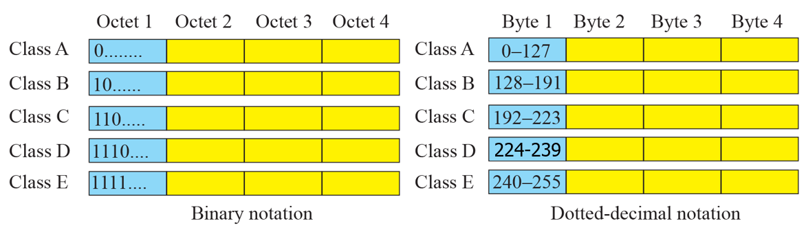
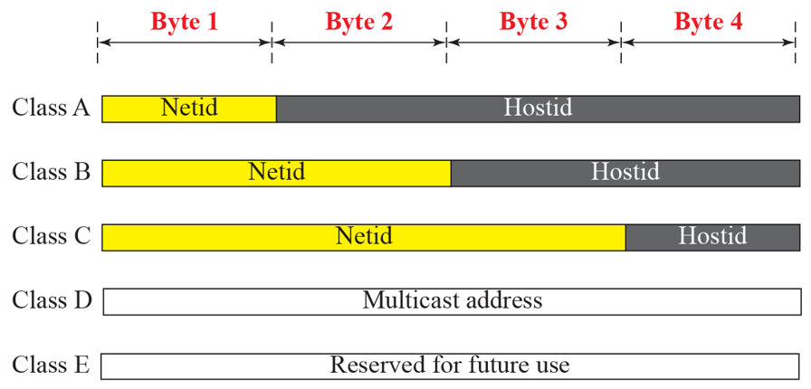
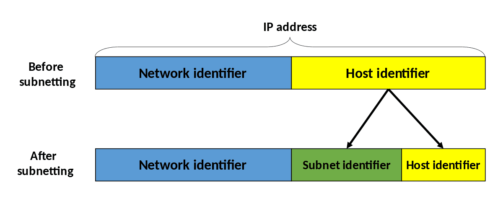
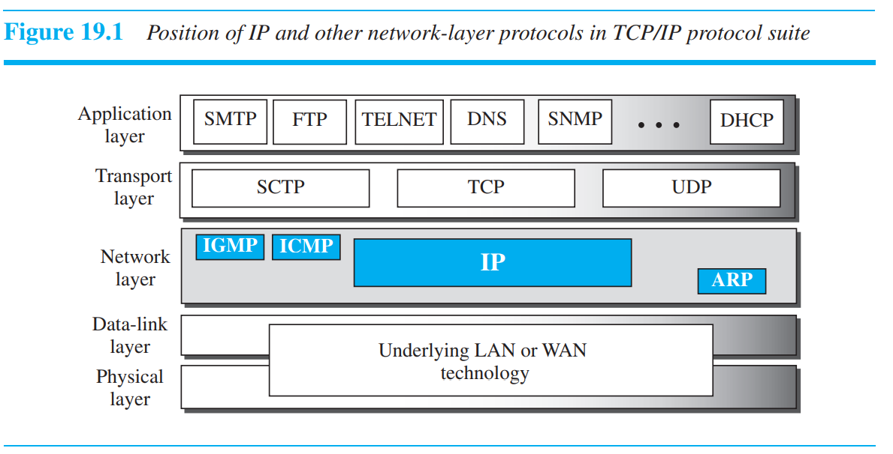
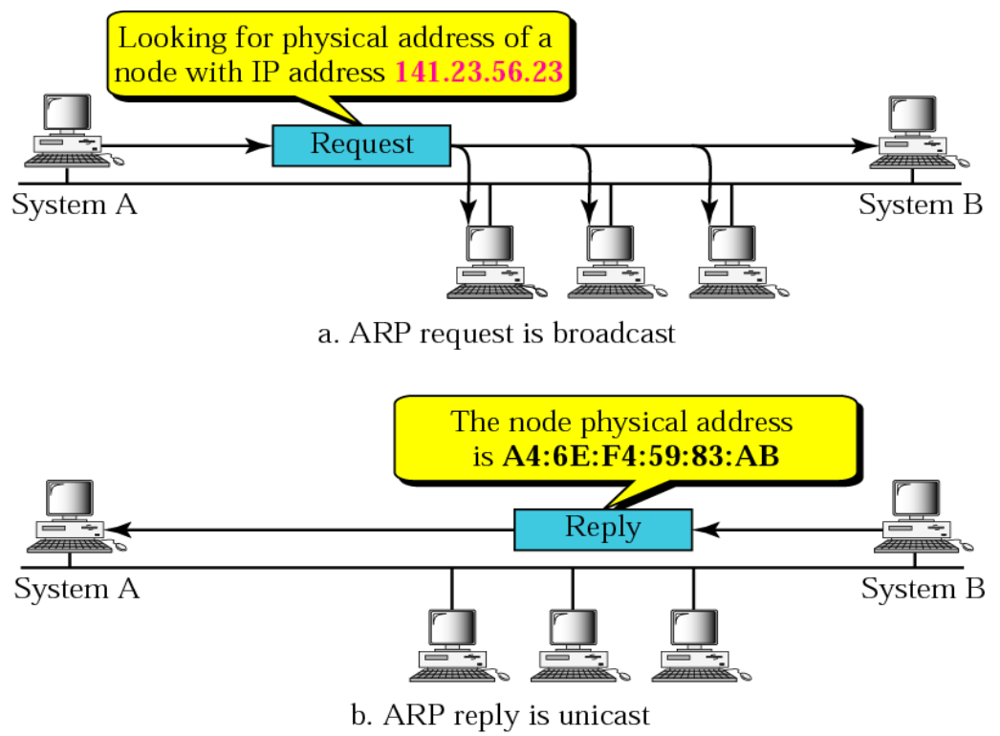
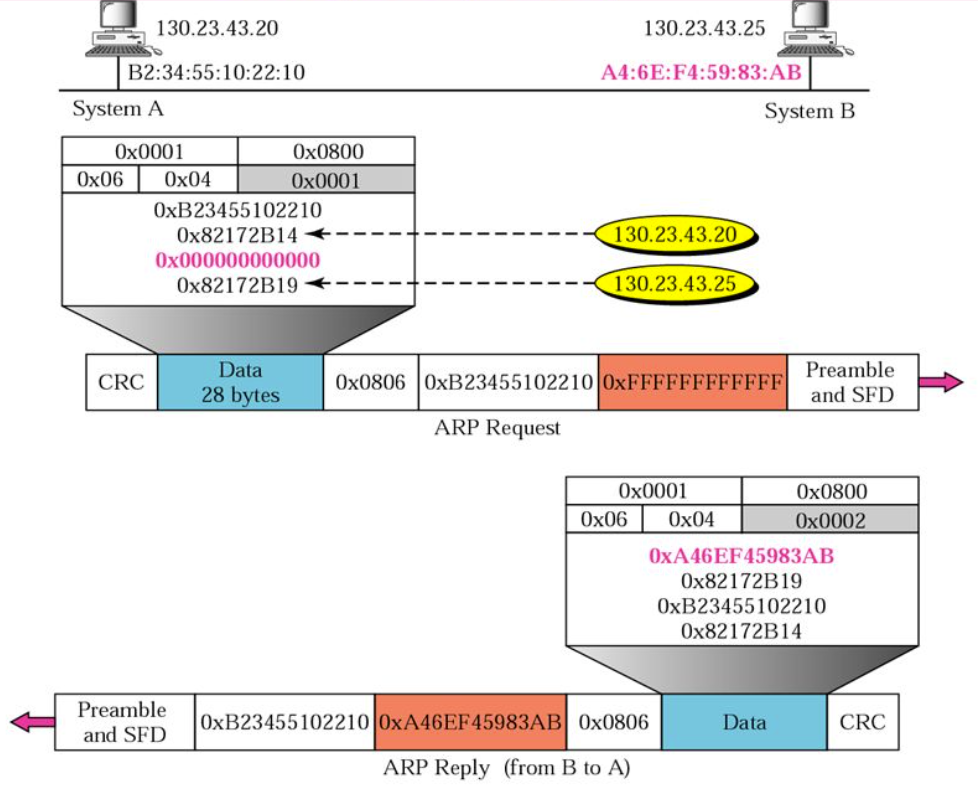
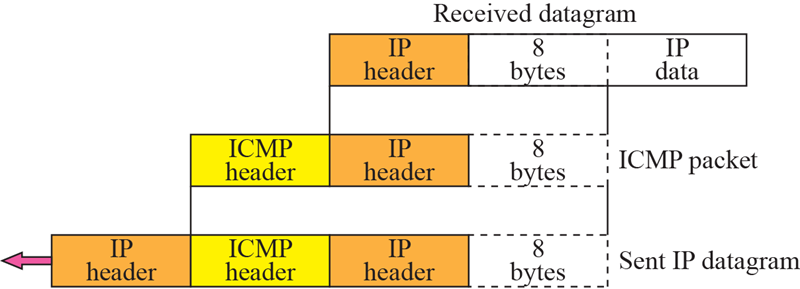
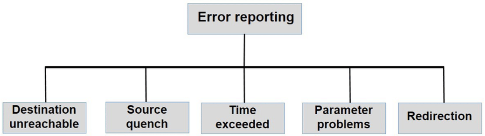
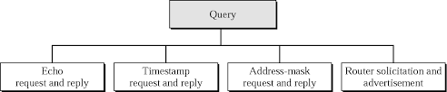
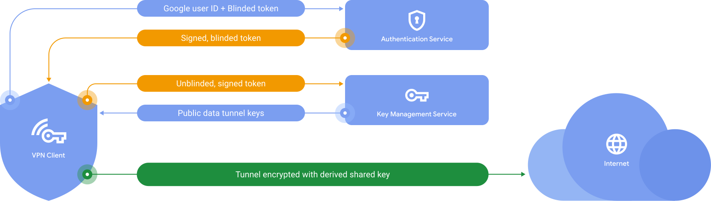

## Addressing

### Classful

- Class A, B, C for Unicast
- Class D for Multicast
- Class E for Future Use
- 2 Layer Hierarchy
  - Network Address
  - Host Address
- Classful IP Example
  - IP: 115.140.170.13
    - Class A
    - NetID: 115.0.0.0
  - IP: 203.225.212.167
    - Class C
    - NetID: 203.225.212.0

- 라우터가 IP로부터 Network Address를 찾을 때는 Default Mask를 이용

- Mask Example

  | Class |              In Binary              | In Dotted-Decimal | Using Slash |
  | :---: | :---------------------------------: | :---------------: | :---------: |
  |   A   | 11111111 00000000 00000000 00000000 |     255.0.0.0     |     /8      |
  |   B   | 11111111 11111111 00000000 00000000 |    255.255.0.0    |     /16     |
  |   C   | 11111111 11111111 11111111 00000000 |   255.255.255.0   |     /24     |

- 하나의 Network를 여러 개의 작은 Network들로 나눌 때 Subnetting 이용
- 3 Layer Hierarchy
  - Network Address
  - Subnet Address
  - Host Address
- 라우터가 IP로부터 Subnetwork Address를 찾을 때는 Subnet Mask를 이용
- 이때 Subnet Mask는 Network Administrator가 사전에 알려주어야 함
- Subnet Mask Example
  - IP: 190.240.33.91, Subnet Mask: /19
    - Subnet Address: 190.240.32.0

### Classless Inter-Domain Routing, CIDR

- Class B에 해당하는 Network Address 소진

  반면 Class C에 해당하는 Network Address는 최대 254 Host만 포함할 수 있기에 잘 사용되지 않음

- Supernetting을 이용하여 여러 개의 Class Address를 Aggregate하여 조금 더 많은 Host를 포함할 수 있는 Network Address 생성

  - 기존대로라면 여러 개의 Routing Table Entry를 차지할 Address가 하나로 통합되어 Routing 비용 절감 효과
  - 잘 사용되지 않던 일부 Class의 IP 주소를 효율적으로 사용할 수 있음

- Classless 방식의 경우 Mask를 필히 같이 명시해주어야 함

- Supernetting Example

  - Before Supernetting
    1. 193.0.32.0/24
    2. 193.0.33.0/24
    3. 193.0.34.0/24
    4. 193.0.35.0/24
  - After Supernetting
    1. 193.0.32.0/22

### Dynamic Host Configuration Protocol, DHCP

- 일시적이고 요구에 맞춰 IP를 할당
- 애플리케이션 Layer 프로그램
- Client-Server 구조로 동작
- Plug-and-Play Protocol
- 전체의 $\frac{1}{4}$ 이상이 인터넷을 사용하지 않는 상황을 가정으로 함

### Network Address Translation, NAT

- Private Address와 Global Address 간의 매핑을 수행
- Router단에서 지원하는 기능
- When Outgoing Packets
  - NAT Router가 SRC Address를 Global NAT Address로 교체함
- When Incoming Packets
  - NAT Router가 DST Address를 Private Address로 교체함
- Packet 전송 간에 SRC와 DST Address는 손대지 않는 것이 원칙이나, NAT는 IP 고갈로 인해 예외적 허용

### Special Address

- This-Host
  - 0.0.0.0/32
- Limited-Broadcast
  - 255.255.255.255/32
- Private
  - 10.0.0.0/8
  - 172.16.0.0/12
  - 192.168.0.0/16
  - 169.254.0.0/16
- Loopback
  - 127.0.0.0/8
- Multicast
  - 224.0.0.0/4

## Network Layer Protocols

### Address Resolution Protocol, ARP

- Host와 Router의 식별 기준

  - Network Layer에서 IP Address를 기준으로

    IP Address는 Universally Unique

  - Data-Link Layer에서 MAC Address를 기준으로

    MAC Address는 Locally Unique

- Packet을 SRC에서 DST로 보내는 과정에서의 차이

  - IP Address는 목적지까지의 Path를 찾기 위해 이용
  - MAC Address는 Host와 Router 사이에 Packet 이동을 위해 이용
  - 따라서 Routing Table은 IP Address로부터 MAC Address 매핑이 되어있어야 함

- Routing Table에서 필요한 매핑을 동적으로 수행하기 위해 ARP 존재

- ARP Request는 Broadcast로 전송됨

  - DST MAC Address는 FF:FF:FF:FF:FF:FF로 세팅됨

- ARP Reply은 Unicast로 전송됨

- ARP가 매번 일어나지는 않고, 캐싱해서 저장해놓은 값을 이용함

- ARP Example

  

### Internet Protocol, IP

- Host-to-Host Network Layer Delivery Protocol
- Best-Effort Delivery Service
- Unreliable & Connectionless Datagram Protocol
  - IP Layer에 속한 Packet을 Datagram이라 칭함
- No Error Control, No Flow Control, Only Error Detection

### Internet Control Message Protocol, ICMP

- IP Mechanism에는 Error를 알리거나 고치려는 방안이 없기 때문에 ICMP를 이용하여 SRC에게 알려줌

- IP Datagram을 한번 더 캡슐화해서 ICMP Header를 추가함

## Network Services

### Virtual Private Network, VPN

- 공용망을 사설망처럼 활용할 수 있는 것

- 원격 서버로 들어오는 트래픽을 Re-Routing하여 실제 IP Address를 가상 IP Address로 대체

- 일반적으로 통신하는 Packet이 전부 암호화가 되어있어서 VPN 서버의 로그를 보지 않는 이상, 사용자의 정확한 IP 추적 등은 어려움

- IP Packet을 또 다른 IP로 캡슐화하여 Tunnel을 형성

  여기서 IP-in-IP Tunnel을 Virtual Connection이라 칭함

- Google One VPN Example

  

- Proxy와의 비교

  - 보안성

    Proxy는 단순 Network Routing을 처리하는 등 단순 목적으로 활용하기에 암호화하지 않음

    VPN은 송수신 트래픽 전체를 암호화함

  - 동작하는 체계의 수준

    Proxy는 애플리케이션 수준에서 동작하여 특정 앱 혹은 브라우저에 대해서만 Routing 가능

    VPN은 OS 수준에서 동작하여 모든 트래픽을 라우팅함

  - 동작 속도

    Proxy는 암호화하지 않고 단순 Routing을 처리하거나, 오히려 트래픽 분할을 위해 캐시 서버 등을 활용하여 속도를 높이는 데에 사용될 수 있음

    VPN은 모든 데이터를 암호화하여 송수산하기 때문에 속도가 현저히 느림

## Reference

- ["Google One VPN 설명"](https://one.google.com/about/vpn/howitworks)
- ["VPN, Proxy와 Tor - VPN", David](https://velog.io/@emrrbs9090/VPN-Proxy%EC%99%80-Tor-VPN)
