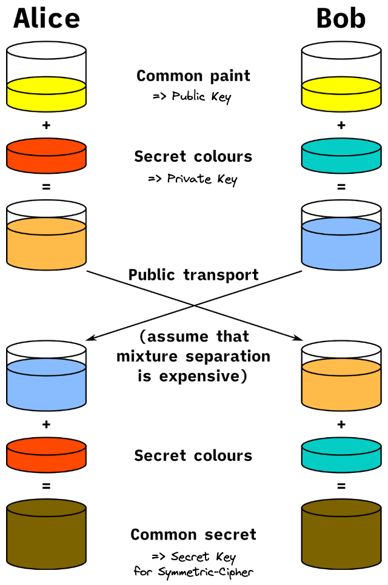
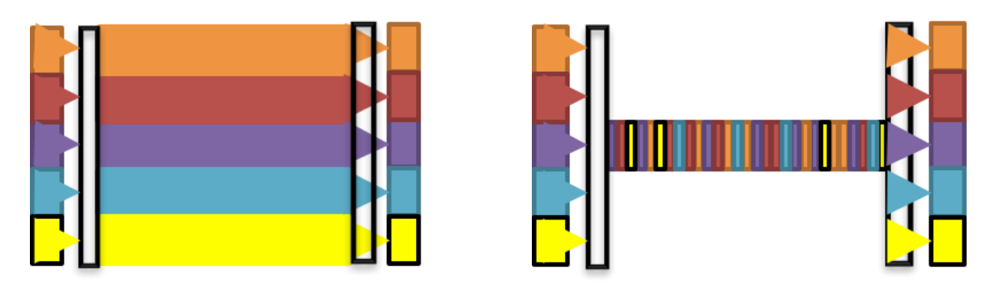
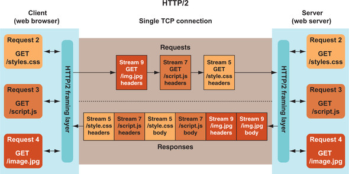
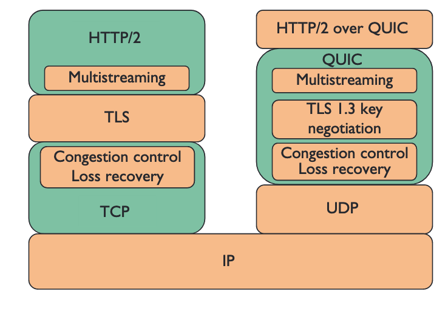
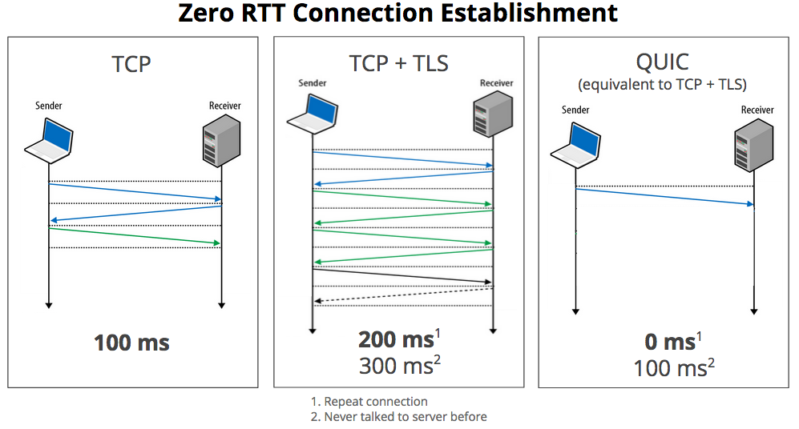

## How Web Works

- 웹 브라우저로 원격 웹 애플리케이션과 리소스에 접근 요청
- 이때 주요 방식이 HTTP

### Internet and WWW

- Internet은 IP, Internet Protocol을 공유해 메시지를 라우팅하는 방식으로 연결된 컴퓨터의 모음

- Internet은 WWW, E-mail, FTP, VoIP 등 여러 서비스로 구성

  따라서 WWW은 가장 눈에 띠지만 Internet의 일부분일 뿐

### Flow of Web Search


1. 브라우저는 `www.google.com`의 실제 주소를 DNS, Domain Name System 서버에 요청

   글로벌 회사의 경우 보통 여러 나라에 다수의 서버를 구축하기 때문에 미국에 있는 사람과 유럽에 있는 사람이 받는 IP 주소는 다를 수 있음

2. 웹 브라우저가 해당 IP 주소와 표준 웹 포트인 80 혹은 표준 보안 웹 포트인 443으로 TCP 연결을 요청

3. 브라우저가 웹 서버와 연결을 맺고 있으면 웹 사이트 요청 가능

   이 단계에서 HTTP가 관여하며 HTTPS가 사용되면 연결 보호를 위한 추가 암호화 단계 필요

4. 구글 서버가 요청받은 URL에 응답

   일반적으로 첫 페이지에서의 응답은 HTML 페이지이지만, 리디렉션 응답일 수 있음

   예를 들어 구글은 HTTPS로만 운영되어 HTTP로 요청을 보낼 경우 HTTPS인 새로운 주수로 리디렉션하라는 명령으로 응답함

5. 웹 브라우저가 반환된 응답을 처리

   응답이 HTML 페이지라면, 브라우저는 DOM, Document Object Model을 구축

   이 과정에서 브라우저는 페이지를 표시하는 데 필요한 다른 리소스를 발견

6. 웹 브라우저가 추가로 필요한 리소스를 요청

   이러한 리소스 각각이 위의 여섯 단계를 따라 유사한 방식으로 요청됨

   이 부분이 웹 탐색을 느리게 만드는 주요 문제 중 하나

7. 브라우저가 중요한 리소르를 충분히 얻으면 화면에 페이지를 렌더링

8. 브라우저가 페이지를 처음 표시한 후 백그라운드에서 추가로 필요한 다른 리소스를 계속 다운로드하며 완료되는 대로 페이지를 업데이트

9. 페이지가 완전히 로드되면 브라우저는 로딩 상태를 멈추고, JS 코드에서 Onload 이벤트 발생

10. 페이지는 완전히 로드되었지만 브라우저는 계속해서 추가 콘텐츠 요청을 전송


## Basic Concept

### HTTP

- 초기에는 다른 문서로의 링크를 담은 문서를 전송할 의도로 만들어졌으나, 다른 리소스 유형을 전송하는 데 사용되고 있음

- TCP/IP가 제공하는 안정적인 네트워크 연결에 의존

- 본질적으로 요청 및 응답을 위한 프로토콜

  브라우저가 HTTP 문법으로 요청을 만들고 웹 서버에 보내면, 서버는 요청받은 리소스를 포함한 메시지로 응답

### HTTPS

- HTTP 메시지는 암호화되지 않은 상태로 Internet을 통해 전송

  메시지는 일반 텍스트이기 때문에 도중에 가로채고, 읽고, 고쳐쓰기까지 벌어질 수 있음

- HTTPS는 메시지를 TLS, Transport Layer Security 프로토콜을 사용해 암호화하는 HTTP 보안 버전

  - 암호화

    메시지는 제 3자에게 읽힐 수 없음

  - 무결성

    암호화된 메시지가 디지털 서명되고 서명이 복호화되기 전에 암호학적으로 검증되기 때문에 메시지는 전송 중에 변경되지 않음

  - 인증

    서버는 클라이언트가 메시지를 주고 받으려던 바로 그 서버임을 알 수 있음



- 서버는 자신의 Public Key를 신뢰할 수 있는 CA, Certificate Authority에 디지털 인증서 형태로 등록
- 클라이언트가 서버에 처음 연결할 때 디지털 인증서 형태의 Public Key를 제공 받음
- 디지털 인증서는 클라이언트가 신뢰하는 CA의 디지털 서명이 되어있기 때문에 제대로된 서버의 Public Key임을 확인할 수 있음
- 클라이언트와 서버가 사용할 암호화 방식에 대해 합의
- 클라이언트와 서버가 앞으로 사용할 공유 암호화 키를 결정


## Story of HTTP

### HTTP/0.9

```http
GET /section/page.html
```

- 연결이 TCP/IP로 맺어져야 함

- 각 메시지는 서버의 연결 종료로 끝나야 함

- 각 요청은 멱등성을 지켜야 함

  멱등성: 여러 번 적용하더라도 결과가 달라지지 않는 것을 의미

- HTTP Header 필드 개념이나 이미지 등의 다른 미디어의 개념이 존재하지 않음

### HTTP/1.0

```http
GET /page.html HTTP/1.0
Accept: text/html,application/xhtml+xml,image/jxr/,*/*
Accept-Encoding: gzip, deflate, br
Accept-Langauge: en-GB,en-US; q=0.8,en;q=0.6
Connection: keep-alive
Host: www.example.com
User-Agent: MyAwesomeWebBrowser 1.1↲↲
```

```http
HTTP/1.0 200 OK
Date: Sat, 19 Mar 2022 10:48:10 GMT
Expires: -1
Cache-Control: private, max-age=0
Content-Type: text/html; charset=ISO-8859-1
P3P: CP="This is not a P3P policy! See g.co/p3phelp for more info."
Server: gws
X-XSS-Protection: 0
X-Frame-Options: SAMEORIGIN
Set-Cookie: 1P_JAR=2022-03-19-10; expires=Mon, 18-Apr-2022 10:48:10 GMT; path=/; domain=.google.com; Secure
Set-Cookie: NID=501=prZmqK82lspH_Ulva0WfuSL0BbiJBoooB4K1cTCvyIQyj-XUpZxzONniCiriw1mNZ3ggSfCp41a2IlW39zaGessUAiSVznDzzx-vYHH9km4V5jF4Sia6S3_UCQjvmrBmu_ydZ0rhDfwLNZxMyPdIiIIXByMz740i1EhmaDHudAQ; expires=Sun, 18-Sep-2022 10:48:10 GMT; path=/; domain=.google.com; HttpOnly
Accept-Ranges: none
Vary: Accept-Encoding

<!doctype html> ... 중략
```

- 새로운 메서드 HEAD, POST 추가

  POST 요청은 멱등적이지 않음

- 사용할 HTTP 버전을 명시해야 하며, HTTP/0.9가 기본값

- 요청 및 응답에 HTTP Header를 추가하여 더 많은 정보 제공

  `Key: Value1, Value2` 형태

- 응답 성공 정보를 알 수 있는 3자리 응답 코드

  코드는 일반적인 분류로 설계되었기 때문에 적합한 상태 코드를 사용하는 것은 애플리케이션 단에서 결정해야 할 사안

### HTTP/1.1

- 새로운 메서드 PUT, OPTIONS, CONNECT, TRACE, DELETE 추가

- 필수적인 `Host` Header 필드

  ```http
  GET / HTTP/1.1
  Host: www.google.com
  ```

  기존 요청 URL은 Relative URL이기 때문에 서버가 하나의 웹 사이트만 호스팅한다는 가정

  그러나 동일 서버에서 가상 호스팅으로 여러 사이트를 운영하기도 하므로, 서버에게 어떤 사이트를 요청하는 것인지 알려줘야 함

- `Connection: Keep-Alive` Header로 지속적인 연결 가능

  ```http
  GET /page.html HTTP/1.1
  Connection: Keep-Alive
  ```

  웹에 미디어가 풍부해짐에 따라 매 요청마다 연결을 맺고 종료하는 과정이 낭비 및 지연으로 여겨짐

  이 필드를 명시함으로써 클라이언트는 서버에 추가적인 요청을 전송하고자 연결을 맺은 채 그대로 두라고 요청할 수 있음

  명시적인 연결 종료가 없으므로 응답 본문의 길이를 정의하는 `Content-Length` Header를 이용해 응답 완료 여부를 확인함

  따라서 HTTP 연결은 클라이언트나 서버 어느 편에서든 종료할 수 있게 됨

- HTTP가 State를 제어할 수 있도록 Cookie 도입

### HTTP/1.1 Problems


- 페이지를 렌더링하는 데까지 필요한 시간 중 대부분이 Internet을 통해 메시지가 전송되기를 기다리는 데 소모됨
- 브라우저가 이미지 1을 요청하고 이미지 2도 필요하다는 것을 알지만 이전에 보낸 요청에 대한 응답이 올 때까지 기다려야하는 비효율성


- 병렬적 요청이 필요한 경우 이전 요청의 응답을 수신하기 전에 동시적으로 다른 요청도 전송하는 파이프라이닝을 도입하려 시도함

- 그러나 성공적으로 HOL, Head of Line Blocking 문제를 해결하지 못하여 모든 브라우저에서 기본적으로 활성화되어 있지 않음

  - 파이프라이닝을 정확히 구현해내기 복잡합

    전송 중인 리소스의 크기, 적절한 RTT, Round Trip Time, 적절한 대역폭은 파이프라이닝 성능에 직접적인 영향을 미침

    이를 충분히 알지 못한다면, 메시지의 중요성과 부합하지 않는 순서로 처리되어 미미한 수준의 성능 향상만을 가져다줌

  - 파이프라이닝은 HOL 문제에 영향을 받음

    응답은 여전히 순차적으로 받아야 하다보니 먼저 받아야 하는 요청에서 지연이 발생하면 뒤의 요청 처리가 아무리 빨라도 기다려야 함

### HTTP/1.1 Indirect Solutions

- 여러 HTTP 연결을 사용

  - 연결 자체를 여러 개를 맺어서 HTTP 요청을 끊임없이 동작하게 함

    하나의 도메인 당 HTTP 연결은 최대 6개까지 허용

  - 이미지, CSS, JS 등과 같은 정적 리소스는 하위 도메인을 통해 제공하는 도메인 샤딩으로, 보다 빠르게 페이지를 렌더링하도록 함
  - 여러 TCP 연결이 사용되는 경우 초기 연결을 맺을 때 3 Way Handshake가 수반되어 HTTP 요청 하나를 보내기도 전에 3개의 네트워크 요청이 처리되어야 함
  - TCP 연결이 온전히 맺어지기 전에 Slow Start 단계를 거치기 때문에 억압된 상태로 연결이 맺어짐

- 잠재적으로 큰 HTTP 요청을 생성

  - 필요한 리소스를 결합하여 파일로 묶는 것

    이미지에 대한 번들링 기법은 Spriting이라고 함

  - 이로 인한 낭비와 복잡성이 증가

### SPDY


- HTTP 기반으로 구글이 만든 새로운 프로토콜

  - Binary 기반 프로토콜

  - Multiplexed Stream

    

    

    요청 및 응답은 단일 TCP 연결만을 사용하고, 분리된 스트림 그룹으로 패킷을 구분

  - 요청 우선순위 지정

    다수 요청을 동시에 보내는 것으로 인한 네트워크 혼잡 문제를 발생시키지 않기 위해 우선순위 개념 도입

  - HTTP Header 압축

  - Server Push

### HTTP/2.0

- 버전이 1.x가 아닌 2.x임에 따라 하위 호환을 깨뜨리는 변경 포함

  - Binary-Based Protocol, Not Text-Based

    TCP 패킷과 유사한 Frame으로 메시지가 나뉘어 전송

    모든 Frame이 수신되면 완전한 HTTP 메시지로 재구성

  - Multiplexed Stream

    

    각각의 HTTP 요청 및 응답에 대해 다른 스트림을 사용하여 단일TCP 연결 상에서 여러 개의 요청을 동시에 진행

    각 요청을 보낸 다음 해당 응답을 받기까지 블로킹되지 않으며, 응답은 여러 스트림들이 섞여 돌아옴

    여전히 낮은 품질의 네트워크에서는 HOL Blocking 문제를 해결하지 못함

  - Prioritize Streams

    기존에는 HTML, CSS과 같은 중요한 리소스를 먼저 요청하고 Image와 같은 블로킹하지 않는 항목을 나중에 요청하는 데에 우선순위 구분이 필요로 했음

    HTTP/2에서는 동시에 전송될 수 있는 요청 최대 수 제한이 훨씬 크기 때문에 요청 우선순위 대신 스트림에 우선순위가 매겨져 먼저 전송되도록 함

  - Compress Headers

  - Server Push

    서버가 하나 이상의 응답으로 요청에 답할 수 있도록 함

    이전에는 브라우저가 페이지를 렌더링하기 전에 필요한 다른 리소스를 요청해야 했지만, HTTP/2에서는 서버 푸시로 첫 응답과 함께 전송 가능

### QUIC



- Quick UDP Internet Connections

- TCP 대신 UDP 기반 프로토콜

  

  - TCP Establish 3 Way Handshake로 인해 필요했던 RTT 없음

- HOL Blocking 문제를 해결함

  - UDP는 패킷의 손실이나 순서를 보장하지 않기 떄문에 QUIC도 스트림을 블로킹하지 않음
  - 손실된 패킷은 스트림을 블로킹하지 않은 채로 독립적으로 재전송됨

- HTTP/2 유용한 기능들 그대로 계승

  - Multiplexing
  - Stream
  - Server Push
  - Header Compression

