## Transport Layer Duty

### Packetizing

- Application로 부터의 Message를 작은 Segment들로 구분함

### Connection Control

- Connection-Oriented
  - First Establishment between Sender & Receiver
  - Virtual Connection
  - TCP
- Connectionless
  - Each Packet Independently
  - UDP

### Addressing

- 예를 들어, HTTP Client는 HTTP Server에게 요청을 보낼 때 Port 80을 이용
- Client는 Randomly & Temporally Port Number
- Server는 Well-Known & Fixed Port Number

### Reliability

- Error Control
- Flow Control
- Congestion Control
- Quality of Service

## Data Delivery

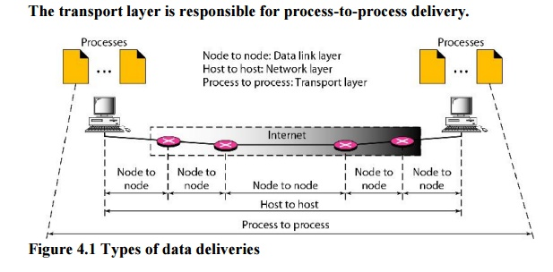

- Data-Link Layer
  - For Delivery of Frames
  - Node-to-Node
- Network Layer
  - For Delivery of Datagrams
  - Host-to-Host
- Transport Layer
  - For Delivery of Segments
  - Process-to-Process

## TCP

- TCP, Transmission Control Protocol
- Byte-Oriented & Reliable
  - Connection Establishment
  - Connection Release
  - Numbered Transferred Bytes
  - Flow Control
  - Error Control
  - Congestion Control

### Stream Delivery

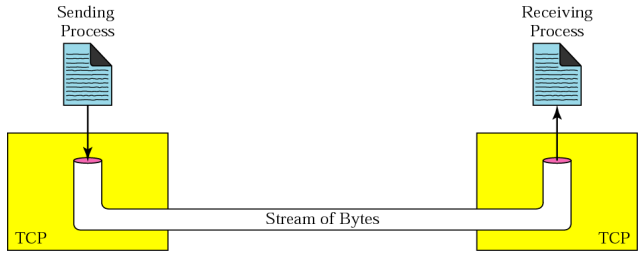

- Sender측의 Sending Buffer는 Process가 채우고 TCP/IP가 소모함
- Receiver측의 Receiving Buffer는 TCP/IP가 채우고 Process가 소모함

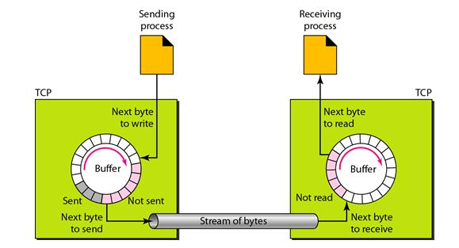

- Sending & Receiving Buffers For Flow Control
- Each Side마다 Sending Buffer와 Receiving Buffer를 각각 존재함

### Numbering Bytes

- Not Numbering on Segments, but Numbering on Bytes

  TCP is Byte-Oriented

- Send & Receive 방향마다 독립적인 Numbering

- Connection Establishment 단계에서 ISN, Initial Sequence Number를 랜덤하게 설정

- ACK Number는 다음으로 수신할 Byte를 가리키는 수

  예를 들어 Receiver가 Sender로부터 Sequence Number가 1010까지 수신했다면, ACK Number가 1011인 ACK Segment를 Sender에게 전송

### 3 Way Handshake

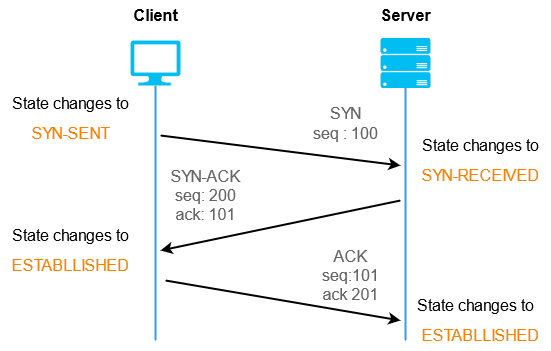

1. Client가 SYN Segment 전송
   - Client ISN은 100
2. Server가 SYN Segment 전송 및 Client's SYN에 대한 ACK Segment 전송
   - Server ISN은 200
   - ACK Number은 ISN+1
3. Client가 Server's SYN에 대한 ACK Segment 전송
   - ACK Number은 ISN+1

### 4 Way Handshake

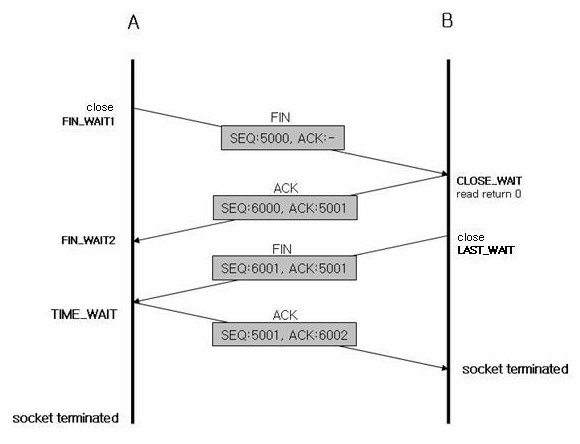

1. Client가 FIN Segment 전송

2. Server가 Client's FIN에 대한 ACK 전송

3. Server는 남은 데이터 전송을 마친 후, FIN Segment 전송

   - 상황에 따라서 한쪽만 Close된 Half-Close 상황이 될 수도 있음

     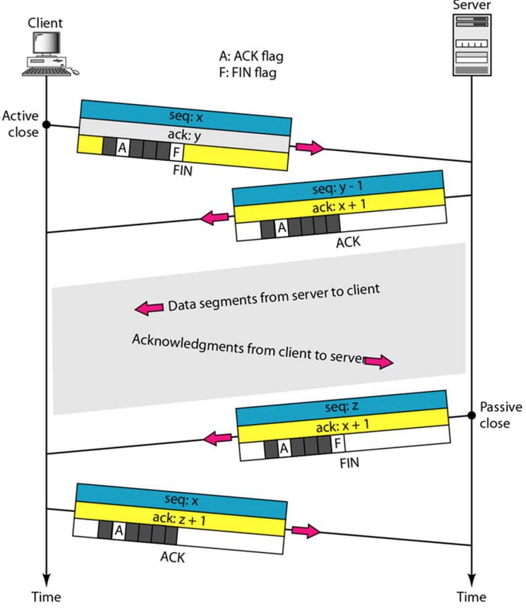

4. Client가 Server's FIN에 대한 ACK 전송

### Flow Control

- Receiver Buffer가 Overrun하지 않도록 Sender를 제어하는 것

- Byte-Oriented Sliding Window Protocol

  - Receiver는 Sender에게 두 개의 파라미터를 알려줌
    1. ACK Number
    2. AWND, Advertised Window

  

  - Sender Buffer Snapshot

- Set Window Example

  1. Sender Buffer

     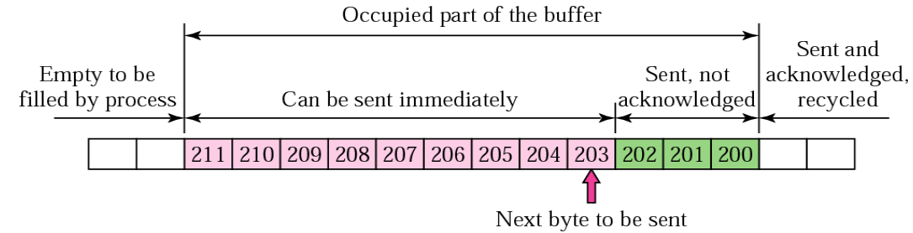

  2. Receiver Buffer

     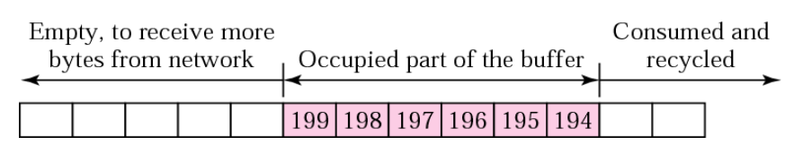

     - ACK Number: 200, AWND: 7

  3. Sender Buffer

     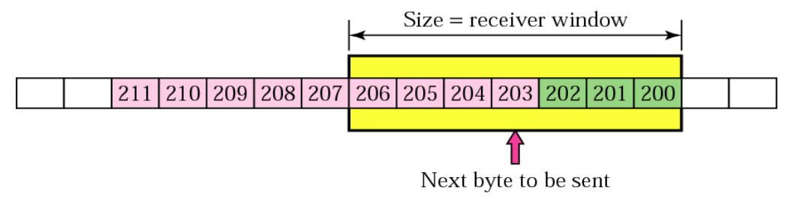

- Sliding Window Example

  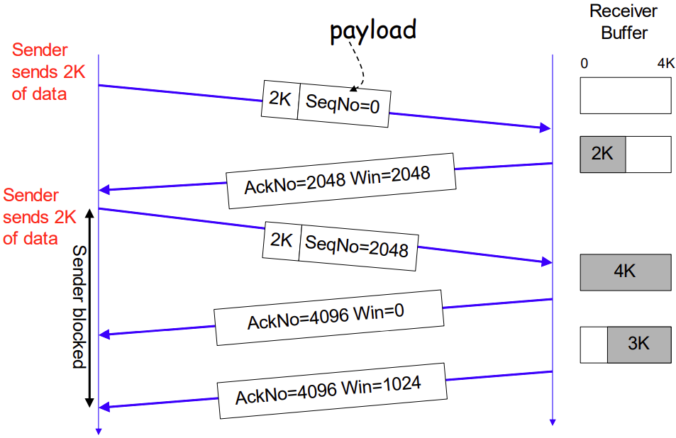

- Delayed ACK

  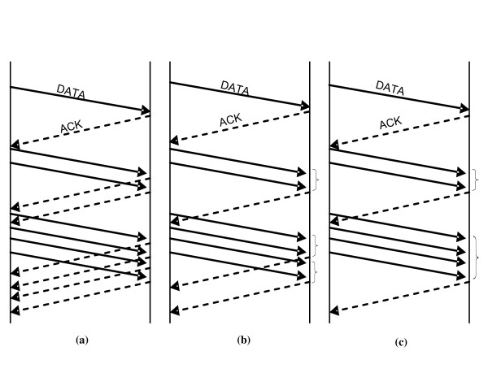

  - 트래픽을 줄이기 위해 각 Segment마다 ACK를 보내지 않음
  - Incoming Buffer가 아래와 같은 공간이 생길 때까지 ACK 전송을 지연시킴
    - Half of Receiver Buffer Size
    - 1 MSS, One Maximum Segment Size
  - Segment Timeout이 될 정도로 지연시킬 수는 없음
  - 다른 ACK가 Pending 상태이면 지연시킬 수 없음

### Error Control

- Control Tools
  
  - Checksum
  
    Discard Corrupted Segments
  
  - Acknowledgement
  
    Use to Confirm Receipt
  
  - Retransmission Timer
  
    Exceed Timer Expiration, Consider to be Lost
  
- Error Cases
  
  - Corrupted Segments
  
  - Out of Order Segments
  
    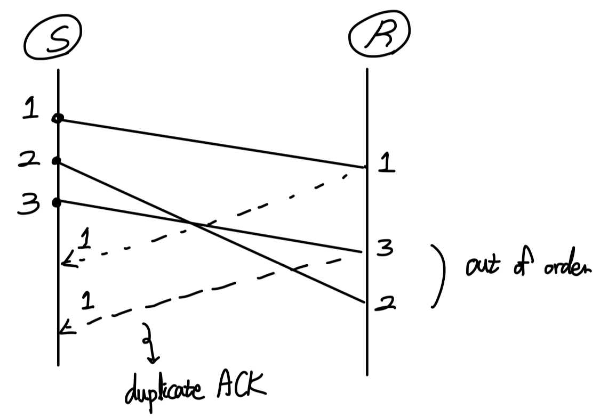
  
    - IP가 Connectionless & Best-Effort Service이기 때문에 발생
  
    - Receiver가 Out of Order Segments를 받으면 곧바로 Duplicate ACK를 전송
  
      Duplicate ACK는 지연시킬 수 없음
  
    - Duplicate ACK를 받은 Sender는 Lost Segment 때문인지 단순 Re-ordering 과정 때문인지 확신할 수 없음
  
  - Duplicate Segments
  
    - Receiver가 ACK를 Sender에게 보냈음에도 Time-out 이전에 도착하지 않았을 경우 Duplicate 발생
  
      Receiver 측에서 단순히 Discard Duplicate Segments
  
  - Lost Segments
  
    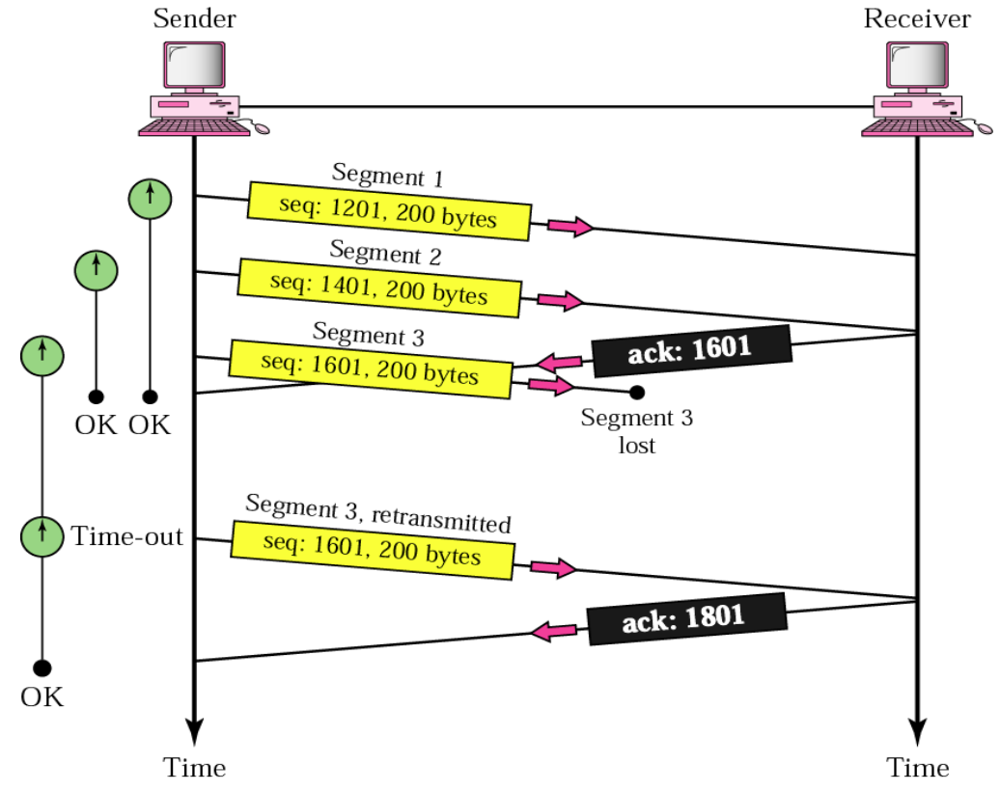
  
    - Segment 3 Lost 이후 Time-out Value가 기존보다 증가함

- Adaptive Retransmission Timer Mechanism

  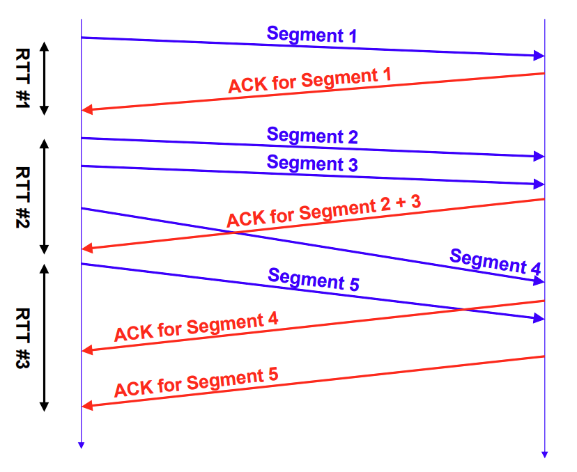

  - RTT, Round-Trip Time 활용

### Congestion Control

- Control Tools

  - Retransmission Timer Management
  - Window Management

- Congestion Cases

  - Router에서의 Buffer Overflow로 인한 Packet Lost
  - Router에서의 Buffer Queueing로 인한 Long Delay

- Sender 측에서 Control 하도록 구현됨

  - Parameters

    1. Congestion Window Size, CWND

       초기값은 1 MSS Bytes

    2. Slow Start Threshold, SSTHRESH

       초기값은 65,536 Bytes

  - AIMD Algorithm Idea

    - Less Congestion, Increase Additively CWND

      Linear Increasing

    - More Congestion, Decrease Multiplicatively CWND

      Multiplicative Decreasing

  1. Slow Start

     - To Reach Available Capacity as fast as possible

     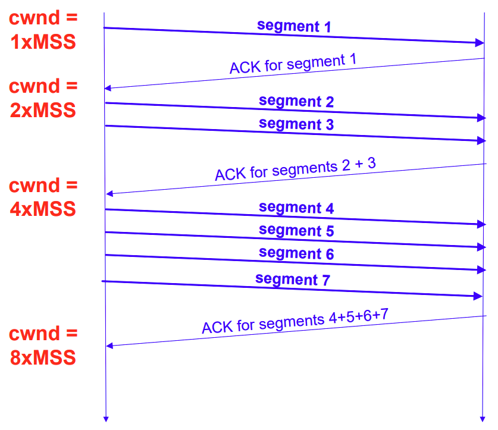

     - Start $CWND = 1 MSS$
     - Increase Doubly CWND for Each RTT
     - Until $CWND \le SSTHRESH$
     - When Timeout, $SSTHRESH = \frac{CWND}{2}$ and $CWND = 1 MSS$

  2. Congestion Avoidance

     - To Remain High Capacity as long as possible
     - When $CWND > SSTHRES$, Phase Starts
     - Update $CWND = CWND + \frac{MSS^2}{CWND} + \frac{MSS}{8}$

     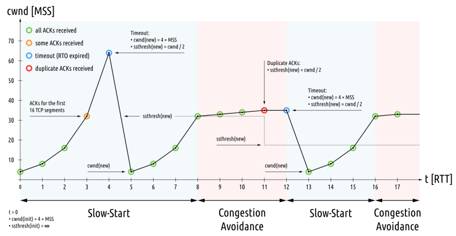

  3. Fast Retransmit

     - To Detect Packets Drop Earlier than RTO, Retransmission Time-Out
     - When Sender Receives Three Duplicate ACKs, Phase Starts

     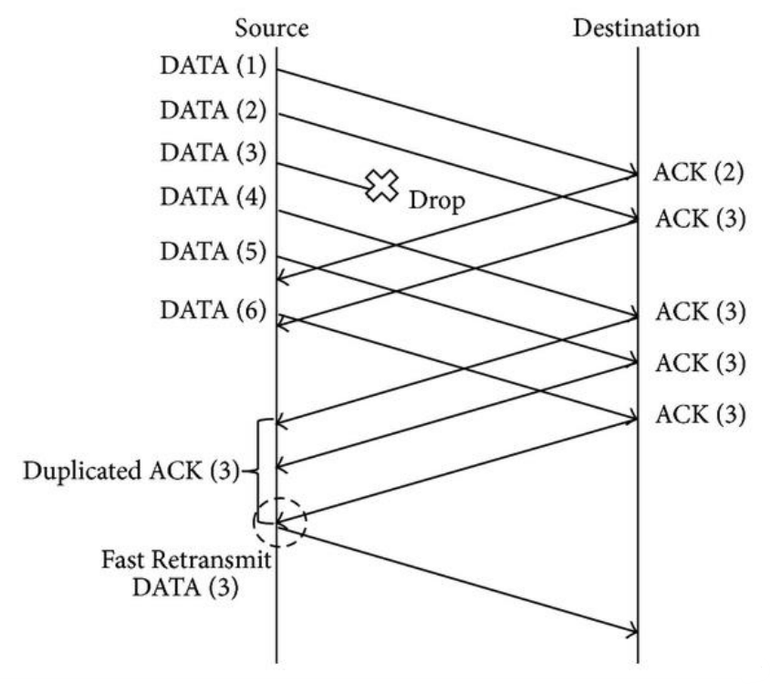

  4. Fast Recovery

     - Due to too Aggressively Drop Down CWND ($CWND=1MSS$) When Timeout Occurs
     - Sender가 3번째 Duplicate ACK를 받으면 $SSTHRES = min( CWND, \frac{AWND}{2} )$ and $CWND=SSTHRESH+3$
     - Until Sender Receives a Higher ACK
     - When Sender Receives New ACK, $CWND=SSTHRES + 1$ and transit in Congestion Avoidance Phase

## UDP

- UDP, User Datagram Protocol
  - IP Delivery Service를 Process단으로 확장시킨 것
- Message-Oriented & Unreliable
  - No Connection Establishment
  - No Connection Release
  - Not Numbered Segments
  - No Flow Control
  - No Error Control
- Real-time Transfer Protocol에 적합
  - Overhead 최소화 가능
  - 소량의 Packet Loss는 허용 가능함
- File Transfer Protocol에 부적합
  - 어떠한 Packet Loss도 허용되지 않음

