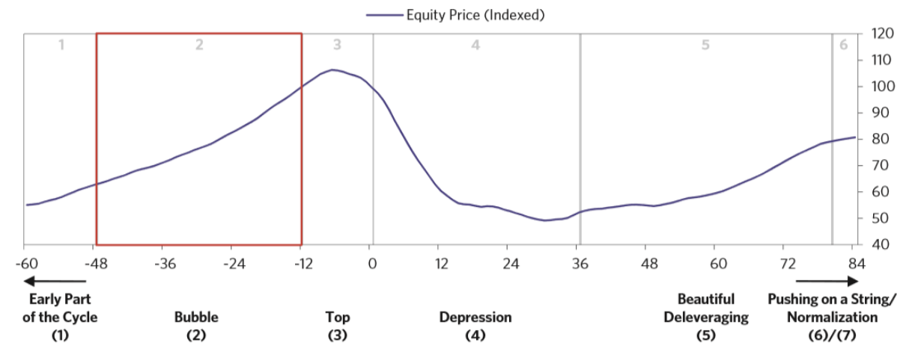
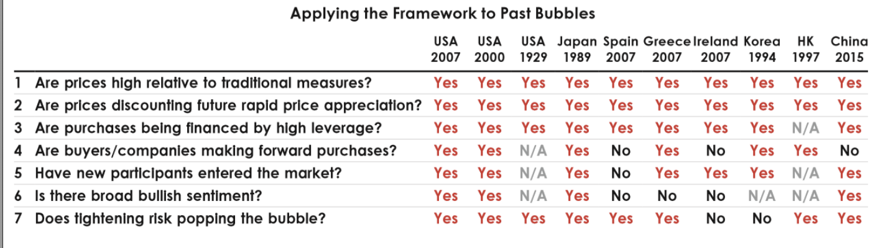
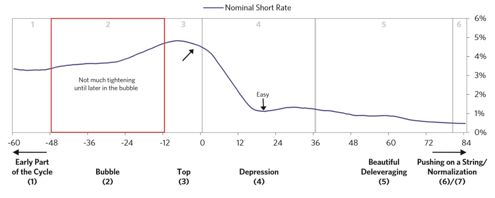
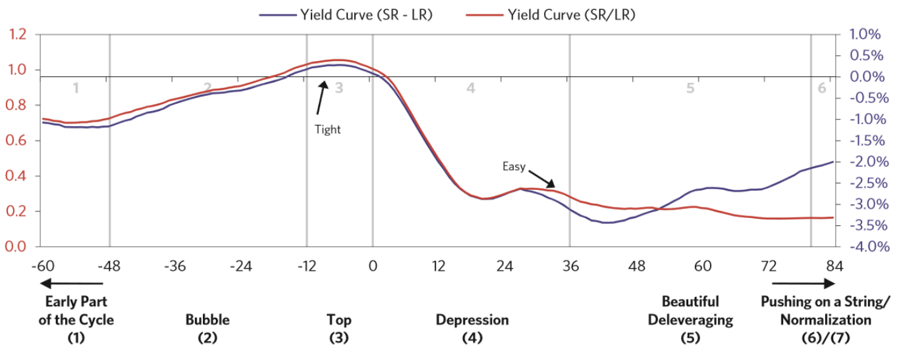
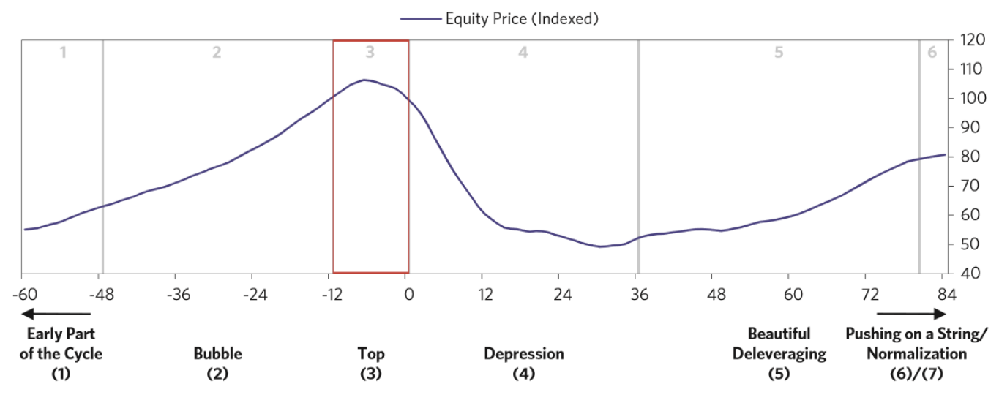

## 대형 금융 위기를 이해하는 기본 템플릿

### 신용 (Credit) 과 부채 (Debt)

신용이란 구매력을 제공하는 것. 그 대가로 나중에 상환하겠다는 약속이 부채.

신용을 통해 구매력을 제공하는 행위 그 자체는 문제 X.
신용으로 인한 휴유증과 부채 상환의 적절성에 따라 결정.
이는 **부채가 생산적인 일에 사용**되어 충분한 수익이 창출되느냐의 여부.

악성 부채 손실은 정책 입안자의 두 가지 요건에 따라 결정.
첫째, **부채 표시 화폐가 정책 입안자가 통제 가능한 화폐**일 것.
둘째, **채권자와 채무자의 상호 행태에 정책 입안자가 영향력 행사가 가능**할 것.

대출은 자기 강화적인 (Self-reinforcing) 성향.
상승기에는 대출에 힘입어 소비 && 투자 증가 => 소득 && 자산 상승 => 대출 증가  => ...
하강기에는 완벽한 역방향으로 동작.

아래는 부채 비중 && 상환 금액을 낮추는 데 정책 입안자가 활용 가능한 네가지 수단.

1. 긴축 (Austerity; 지출 축소)
2. 채무 불이행 (Debt Default) 과 채무 재조정 (Debt Restructuring)
3. 중앙은행의 화폐 찍어내기와 부채 인수 (또는 보증)
4. 돈과 신용: 많이 가진자 => 그렇지 못한 자 (부의 재분배)

위 정책들의 균형 => 소득 대비 부채 비율 감소 && 적정한 인플레이션과 경제 성장 유지 => 올바른 디레버리징 (Deveraging)

### 전형적인 장기 / 대형 부채 사이클 템플릿

실질 GDP 3% 이상 하락 => 불황 (Depression) 이라 정의

두 집단으로 분류
1. 외화 부채가 많지 않고, 인플레이션형 불황이 아닌 국가
2. 외화 부채가 상당하고, 인플레이션형 불황인 국가

(부채 & 상환 비용 증가세 >>> 소득 증가세) & (디레버리징) => 부채 위기 발생
실질 금리 && 명목 금리 인하 => 단기 부채 위기 완화
금리 인하 불가 => 장기 부채 위기 (불황)

### 사이클 분석

부채 사이클 템플릿 (불황의 정점 5년 전부터 불황 후 7년, 총 12년 흐름)
- 불황에 이르는 기간
- 불황기
- 불황의 바닥
- 디레버리징 기간

미국의 경우 두 번의 장기 부채 위기
- 1920년대 호황 이후 1930년대 대공황 발생
- 2000년대 초 호황 이후 2008년 금융 위기

단기 부채 사이클마다 이전보다 경제 활동 활발 && 부채 증가
인간의 본성이 빚을 갚는 대신 돈을 더 빌려 소비하려는 성향
그 결과 장긱간에 걸쳐 부채 >>> 소득 => 장기 부채 사이클

사이클의 상승 국면에 신용의 증가 => 소비의 증가 => 소득 && 순자산 증가 => 소비 && 부채 증가
따라서 대출기관은 채무자에게 기꺼이 신용 연장
한계에 도달: 부채 증가율 >>> 소득 증가율 => 부채 상환의 어려움 => 유동성 문제 => 금리 인하
그러나 심한 불황기에는 이미 금리가 0%에 가까우므로, 금리 인하 불가 => 장기 부채 사이클

대형 부채 사이클의 두 종류
- 디플레이션형 불황 (Deflationary Depression)
  경기 침체 초기, 금리 인하 (경기 부양) => 점차 금리가 0% 수준에 도달
  채무 재조정 && 긴축 재정 정책 => 부채 상환, 소득 감소율 >>> 채무 상환율 => 부채 부담 증가
  지속 불가능한 부채 => 디플레이션
  자산 강매, 채무 불이행 등의 문제 발생, 통화나 국제수지 관련 문제는 발생 X
- 인플레이션형 불황 (Inflationary Depression)
  상당량의 부채를 외화로 조달 => 화폐화할 수 없는 부채 축적
  외국 자본 유입 감소 => 유동성 증발 => 통화 가치 하락 및 인플레이션

## 전형적인 디플레이션형 부채 사이클 국면

### 부채 사이클 초기

소득 성장하는 경제 활동의 재원으로 부채가 활용
- 견고한 부채 증가세
- 부채 증가율 >>> 소득 증가율

적절한 부채 증가율, 경제 성장률, 인플레이션
이러한 시기 == Goldilocks 기간 

### 버블

저금리로 인한 투자자산 매력 강화 => 강세장에 대한 낙관적 기대
=> 경제 여건 향상 => 기업 이윤 증가

버블 초기, 부채 증가 >>> 소득 증가 => 급격한 자산 수익률 상승 && 자산 가격 상승
=> 소득, 순자산, 자산 가치 증가 => 더 많은 돈 대출 => ...

소득의 증가로 이자를 상환하기 보다, 빌린 돈으로 이자를 상환
이는 부채 성장이 지속 불가능한 수준이라는 시그널

호황은 기회를 놓치고 싶지 않는 신규 (주린이, 코린이 등) 을 시장으로 끌어들임
이 시기에는 새로운 대출 상품이 개발, 다양한 금융 공학 기법이 활용
결과적으로 모든 경제 주체가 롱 포지션을 취함

버블의 징후
- 가격이 통상의 기준보다 높음
- 만연한 낙관적인 심리
- 높은 레버리지 비율
- 미래의 가격 상승에 투기하기 위해, 선물 거래를 이례적으로 확대
- 주린이 + 코린이 시장 진입

통화 정책은 오히려 버블을 키우는 경우가 많음
중앙은행은 인플레이션 && 경제 성장률에 집중 => 통화 긴축 정책 시행 타이밍을 놓침
- 1980년 말 일본
- 2000년대 중반 세계 곳곳

지나친 인플레이션 && 경제 성장률 과열 => 통화 시축 정책 시행 => 단기 금리 상승
그러나 버블은 특정 부문에서 존재하기에, 일반적인 통화 정책으로 제대로 관리 어려움

중앙은행의 점진적인 금리 인하 => 자산 현재 가치 상승 => 부채 상환 부담 감소
그러나 금리 인하가 영원히 지속될 수는 없음 => 디레버리징 시작

주식 && 담보 가치 하락 => 채권자의 상환 압박 => 채무자의 자산 매각 => 자산 가격 하락
채권자 && 투자자는 금융 중개 기관으로부터 자금 인출 => 유동성 문제

연소득 5만 달러인 사람이 수년 동안 연간 6만 달러를 소비했다면,
향후 같은 기간동안 연간 4만 달러로 소비를 줄여야 함

### 정점

지금보다 좋을 수 없을 만큼 모든 게 완벽하게 돌아가고,
모든 사람이 앞으로 상황이 더 좋아질 거라고 믿게 되는 순간

정점의 계기는 대개 중앙은행이 금리를 인하하며 긴축 정책을 시행할 때
- 경제 성장률 && 인플레이션률 상승하지만, 생산 능력에 따른 제약이 경제를 옥죄기 때문
- 외국 자본에 대한 의존도가 높은 경우, 외부적 요인에 의해 대출 상환 요청 때문

> - SR: Short Range (단기)
> - LR: Long Range (장기)

정점 초기, 단기 금리 상승 => 장단기 금리 차 감소 또는 0에 가까워짐
=> 현금 보유 유인 증가 => 신용 성장 둔화 (버블 터지기 직전)

버블 붕괴 직후, 사람들은 주가가 하락해도 실적은 양호하다는 이유로 매수 적기로 여김
이는 다가올 경기 침체와 실적 감소 가능성을 미처 생각 못하는 것

### 불황

### 아름다운 디레버리징

### 무리한 확장 정책

## 정상화

## 인플레이션형 불황과 통화 위기

## 전형적인 인플레이션형 부채 사이클 국면

### 부채 사이클 초기

### 버블

### 정점과 환율 방어

### 불황 (환율 방어 포기)

### 정상화

