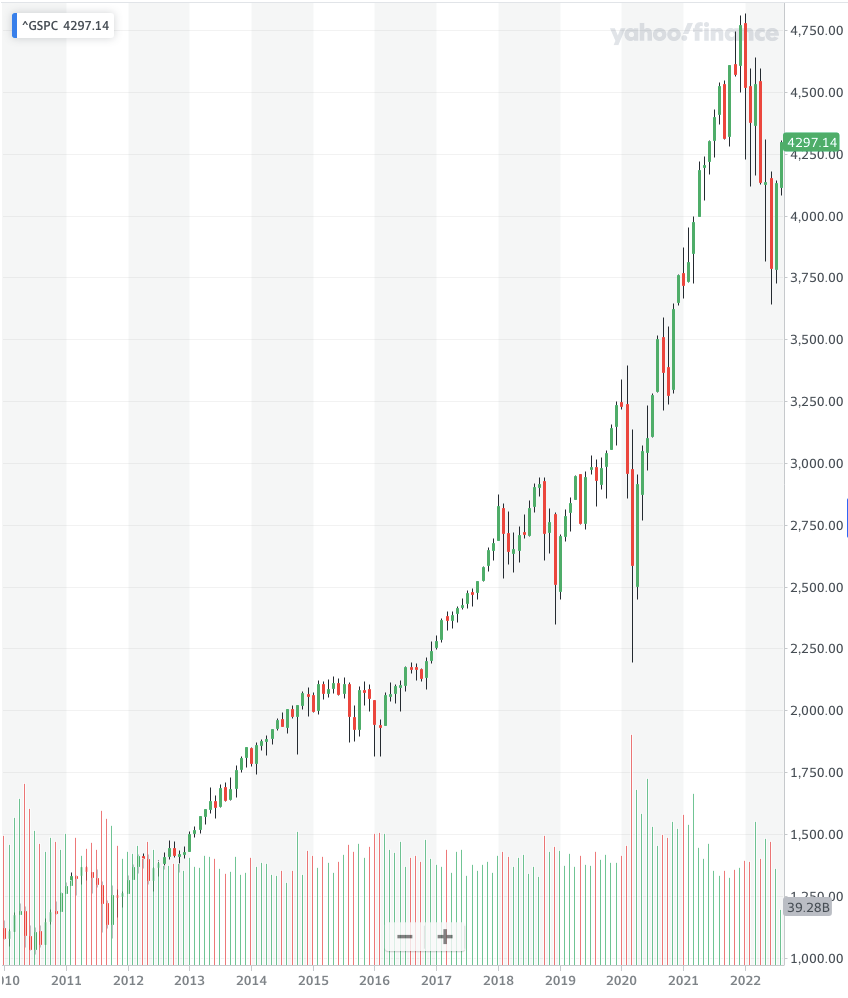
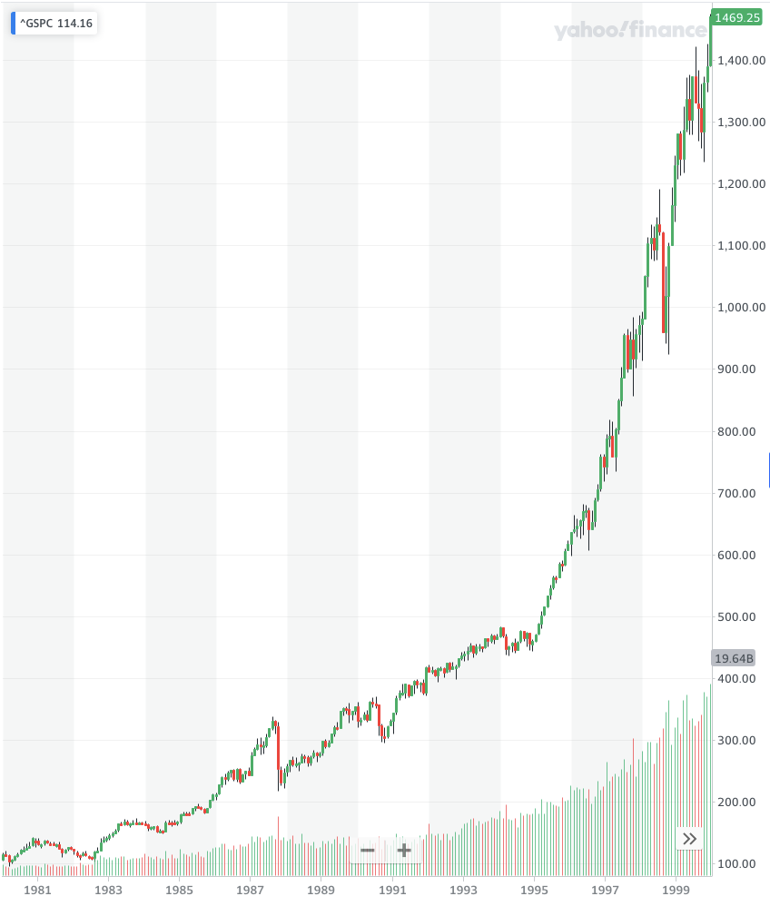
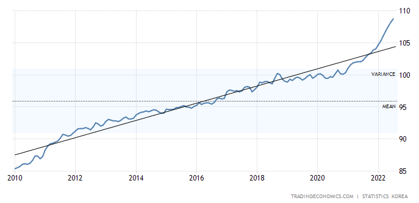
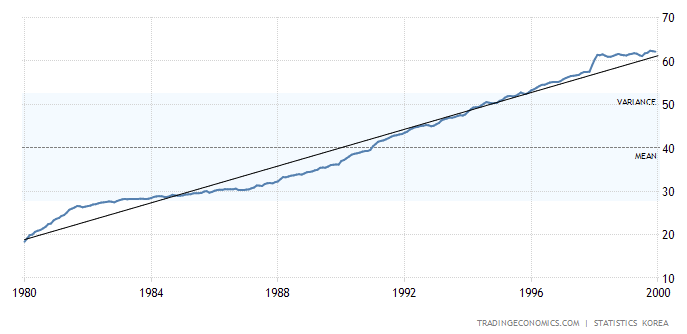

먼저 이 책을 선물해주신 전 직장의 KMS 님께 감사 인사를 드린다.

## 들어가며

시골에서 태어나 주유소에서 25년간 자동차를 수리하고, 백화점에서 17년간 바닥을 쓸어온 환경의 사람이 하버드 대학교를 졸업한 의사보다 심장이식 수슬을 잘했다는 이야기는 상상할 수 없다. 최고의 교육을 받은 건축가보다 고층 빌딩을 더 잘 설계했다는 스토리 역시 마찬가지다. 잡역부가 세계 최고의 원자력 엔지니어보다 나은 성과를 냈다는 뉴스는 절대 나오지 않을 것이다. 그러나 투자의 세계에서는 이런 것이 가능하다.

사람과 환경에 따라 여러 결과가 공존할 수 있다는 사실은 두 가지로 설명해 볼 수 있다. 하나는 금융 성과가 지능, 노력과 상관없이 운에 좌우된다는 것이다. (어느 정도 맞는 말) 두 번째는 금융 성공은 대단한 과학이 아니라는 사실이다. **금융은 소프트 스킬이고, 소프트 스킬에서는 아는 것보다 행동이 더 중요**하다.

이런 소프트 스킬을 저자는 '돈의 심리학' 이라 부른다. 이 책으로 하여금 돈의 기술적 측면보다 소프트 스킬이 더 중요함을 전달하고자 한다. 금융을 수학 기반의 분야로 배우는 경우가 많다. 공식에 데이터를 넣으면 공식이 우리에게 뭘 해야하는 지 알려주고, 우리는 그대로 해야 하는 것으로 알고 있다. 다만 '뭘 해야 할지 아는 것'만으로는 그것을 시도할 때 머릿속에서 일어나는 일을 전혀 알 수가 없다.

사람들은 그동안 집단적 시행착오를 통해 더 훌륭한 농부, 더 발전된 과학자가 되는 법을 알아냈다. 그러나 시행착오가 개인금융을 개선하는 법을 알려주었을까? 만약을 대비해 더 많이 저축하고 있을까? 이에 설득력 있는 증거는 아마 없을 것이다. 그 이유는 **우리가 돈을 물리학과는 비슷하다고 생각하는 반면, 심리학과는 비슷하지 않다고 여기기 때문**이다.

공학자들이 다리가 붕괴된 원인을 규명할 수 있는 것은 특정 부위에 어느 정도의 힘이 가해지면 그 부위가 부러질 거라는 데 일치된 의견이 있기 때문이다. 물리학은 논란을 일으키지 않는다. 법칙을 따른다. 하지만 금융은 사람들의 행동을 따른다. 나의 행동이 스스로에게는 합리적으로 보여도 당신에게는 미친 것처럼 보일 수 있다.

> 역사가 반복되는 것이 아니다.
> 사람이 반복하는 것이다. - 볼테르

## No One's Crazy: 아무도 미치지 않았다

사람들은 세상의 원리에 대해 저마다의 경험을 갖고 있다. 내가 겪은 일은 간접적으로 아는 내용보다 훨씬 더 강한 설득력을 가진다. 우리 모두는 돈의 원리에 대한 일련의 관점을 닻으로 삼아 인생을 갈아가는데, 이 관점은 사람마다 크게 다르다. 당신한테는 미친 짓처럼 보이는 일이 나에게는 이해가 되는 일일 수도 있다.

> 돈에 대한 당신의 경험은 세상에서 실제로 일어난 일 0.000000001%와
> 당신이 머릿속으로 세상의 원리라고 '생각하는' 내용 80%로 구성되어 있을 것이다.

사람들의 투자 의사결정은 본인 세대의 경험, 특히 성인기 초기의 경험에 크게 좌우된다는 연구 결과가 있다. 인플레이션이 높을 때 성장한 사람은 인플레이션이 낮을 때 성장한 사람에 비해 인생 후반에 가서도 채권에 크게 투자하지 않았다. 우연히도 주식 시장이 강세일 때 성장한 사람은 주식 시장이 약세일 때 성장한 사람에 비해 인생 후반에 가서도 주식에 더 많이 투자했다.

아래의 두 그래프는 S&P 500 지수이다. 하나는 90년대 말 태생인 사람의 10-20대 기간 동안을, 다른 하나는 60년대 말 태생인 사람의 10-20대 기간 동안을 보여준다. 즉 자식과 부모 정도의 차이인데, 자식의 경우 약 4배정도 올랐고 부모의 경우 10배 넘게 올랐다.

이번에는 소비자 물가 지수이다. 마찬가지로 하나는 90년대 말 태생인 사람의 10-20대 기간 동안을, 다른 하나는 60년대 말 태생인 사람의 10-20대 기간 동안을 보여준다. 자식의 경우 약 30% 증가, 부모의 경우 300% 증가했다. (다만 자식의 경우, 현재 인플레이션이 가속화되고 있으므로 조금 더 지켜보아야 할 것 같다.)

이렇듯 각 개인마다, 하물며 가족 간이라도, 사람들은 남은 평생 인플레이션에 대해 같은 생각을 가졌을 리는 만무할 것이며 주식 시장, 취업 및 실업, 일반적인 돈에 대해서도 마찬가지이다.

모든 금융 의사결정은 그 순간 판단을 내리는 그 사람에게는 타당한 것이다. 미국의 최저소득 가구는 1년간 복권을 사는 데 평균 412달러를 쓴다. 최고소득 집단과 비교하면 4배나 많은 금액이다. 미국인의 40%는 비상금 400달러도 없다. 이는 미친 짓이라고 보여질 수 있다. 하지만 나는 최저소득 집단이 아니기에, 그 사람들의 무의식적인 추론 과정을 직관적으로 이해하기 어렵다.

> 당신은 투자에 있어 안전지향적인가, 위험선호형인가?
>
> 두 경제학자가 발견한 사실에 따르면 사람들의 투자 결정은 본인 세대의 경험, 특히 성인기 초기의 경험에 크게 좌우된다고 한다. (지능과 교육이 아니었다.)
> 순전히 언제, 어디서 태어났느냐 하는 우연에 좌우될 뿐이다.

## Luck & Risk: 어디까지가 행운이고, 어디부터가 리스크일까

> 성공은 형편없는 스승이다.
> 똑똑한 사람들을 꾀어내어 자신은 절대 실패하지 않는다고 믿게 만든다. - 빌 게이츠
>
> 멋있게 대담했다. vs. 바보같이 무모했다.
>
> 어느 순간 당신 앞에 행운의 지렛대가 움직일지 리스크의 지렛대가 움직일지는 아무도 알 수 없다.

## Never Enough: 결코 채워지지 않는 것

> 당신에게 중요하지 않은 무언가를 위해
> 당신에게 중요한 무언가를 건다는 것은
> 그냥 말도 안되는 짓이다.
>
> 가장 어려운 것은 멈출 수 있는 골대를 세우는 일이다.
>
> 잠재적 이익이 있더라도, 위험을 감수할 가치가 없는 것도 있다.
>
> 라스베이거스에서 이기는 유일한 방법은
> 들어오자마자 나가는 것이다.

## Confounding Compounding: 시간이 너희를 부유케 하리니

워렌 버핏의 성공 요인을 해부한 2000여권의 책 중에 '이 남자는 75년간이나 꾸준히 투자를 해왔다'라는 제목의 책은 없다. 그러나 사람들은 그의 성공 대부분이 무엇 때문인지를 알고 있다. 다만 이런 수학적 사실이 직관적이지 않기 때문에 헤아리기가 어려울 뿐이다.

많은 사람들이 복리 이자표를 처음 보고 나서 인생이 바뀌었다고 말한다. 하지만 아마 실제로 인생이 바뀌지는 않았을 것이다. '놀라긴' 했을 것이다. 직관적으로 보면 마치 잘못된 결과처럼 보이기 때문이다.

사람들이 최고의 투자 수익률을 올리려고 온갖 노력을 쏟아붓는 것을 비난할 수 없다. 직관적으로 보면 그게 부자가 되는 최선의 길처럼 보인다. '최고'라는 단어 그대로, 그 수익률은 일회성이어서 반복할 수 없는 경향이 있다. 꽤 괜찮은 수익률을 계속해서 올리는 게 더 훌륭한 투자다. 여기서 힘을 발휘하는 것이 복리의 원리다.

> 사람들은 언제나 최고 수익률을 원한다.
> 그러나 오랜 시간 성공을 '유지'한 사람들은 최고 수익률을 내지 않았다.
> 그들은 꾸준한 투자율을 보였다.
>
> 오랫동안 괜찮은 수준의 수익률을 유지하는 것이 훨씬 더 나은 결과를 낳는다.
> 그러니 '닥치고 기다려라.'
> 시간의 힘이, 복리의 힘이 너희를 부유케 할 것이다.

## Getting Wealthy vs. Staying Wealthy: 부자가 될 것인가, 부자로 남을 것인가

자본주의는 녹록지 않다. 그 이유 중 하나는 돈을 버는 것과 돈을 잃지 않는 것이 전혀 다른 별개이기 때문이다. 돈을 버는 것에는 리스크를 감수하고, 낙천적 사고를 하고, 적극적 태도를 갖는 등의 요건이 필요하다. 그러나 돈을 잃지 않는 것은 리스크를 감수하는 것과는 정반대의 재주를 요한다. 겸손해야 하고, 또한 돈을 벌 때 만큼이나 빨리 돈이 사라질 수 있음을 두려워할 줄 알아야 한다.

돈 문제에 있어 **'생존'이라는 사고방식**이 중요한 데는 두 가지 이유가 있다. 첫 번째는 당연히, 아무리 큰 이익도 전멸을 감수할 만한 가치는 없다. 두 번째 이유는 앞에서 본 것처럼 복리의 수학적 원리가 직관적이지 않다는 점이다.

> 파국은 피해야 한다. 무슨 일이 있더라도.

큰 수익을 바라는 것 이상으로 중요하게 생각해야 하는 것이 있다. 파산하는 일이 없기를 바라는 것이다. 그러나 사람들의 마음은 그렇지 않다. 강세장에서 현금을 보유하고 싶은 사람은 아무도 없다. 가격이 크게 오를 자산을 보유하고 싶지, 현금을 보유하여 보수적으로 보여지고 스스로도 그렇게 느끼고 싶지 않다. 훌륭한 자산들을 소유하지 않음으로 인해 내가 포기하는 수익이 얼마인지 예리하게 의식하게 되기 때문이다. 현금이 1년에 1%를 번다면, 주식 수익률은 10%다. 이 9% 격차 때문에 매일이 괴롭다.

그러나 바로 그 현금 덕분에 약세장에서 주식을 팔지 않아도 된다면, 그 현금으로 인한 실제 수익률은 연간 1%가 아니라 그 몇 배일 수 있다. 좋지 않은 시기에 절박함 때문에 어쩔 수 없이 주식 파는 일을 한 번 막는 것이, 크게 성공할 주식 수십 가지를 고르는 것보다 평생 수익률에는 더 큰 도움이 될 수 있다.

> 계획이 계획대로 되지 않을 때를 대비한 계획을 세워두어야 한다.
>
> 누구나 부자가 될 수 있다.
> 하지만 누구나 부자로 남지는 않는다.
>
> 부자가 되는 것보다 중요한 것은 부자로 남는 것이다.
> 바로 살아남는 일, 생존이다.

## Tails, You Win: 꼬리가 몸통을 흔든다

투자 회사 중 하나는 "가장 훌륭한 투자자들은 막대한 양의 예술품을 산다. 컬렉션의 일부가 훌륭한 투자로 밝혀졌고, 충분히 오랫동안 보유하고 있었기 때문에 포트폴리오의 수익률은 포트폴리오 내에 있는 최고 작품들의 수익률에 수렴됐다. 그게 전부였다."고 말한다. 살 수 있는 건 모두 산다. 자신이 좋아하는 개별 작품만 구매한 것이 아니라 포트폴리오 단위로 구매한다. 그런 다음 몇몇 챔피언이 나올 때까지 앉아서 기다린다.

사업이나 투자에서 많은 것들이 이런 식으로 작동한다. 금융에서는 롱테일, 즉 결과 분포표에서 가장 멀리 떨어져 있는 끝단이 어마어마한 영향력을 지닌다. 몇 안되는 소수의 사건이 결과의 대부분을 책임지는 것이다. 

나폴레옹은 전쟁의 천재를 이렇게 정의했다. "주변 사람들이 모두 미쳐갈 때 평범한 것을 할 수 있는 사람". 투자에서도 마찬가지다. 금융에 관련한 조언은 대부분 '현재'에 대한 것이다. '지금' 매수하기에 좋아 보이는 주식은 어느 것인가? 그러나 대부분의 경우 '현재'는 그리 중요하지 않다. 당신이 오늘 또는 내일 또는 다음 주에 내리는 의사결정은 별로 중요하지 않다. 정말로 중요한 것은, 남들이 모두 미쳐가는 몇 안되는 날에 당신이 어떤 의사결정을 내리는가 하는 점이다.

투자자로서 당신이 2008년 말과 2009년 초의 몇 달 동안 어떻게 행동했느냐는, 2000년에서 2008년 사이에 했던 모든 일보다 당신의 평생 수익률에 더 큰 영향을 미칠 가능성이 크다. 투자자로서 당신이 성공할 수 있느냐를 가름하는 것은 자동주행 모드로 유유히 달리던 수많은 세월이 아니라, 간간이 끼어드는 공포의 순간에 당신이 보이는 반응이 될 것이다.

> 유명 투자자 피터 린치조차 이렇게 말했다.
> "이 업계에서 끝내주는 사람이라면 열 번 중에 여섯 번을 맞히겠죠."

매번 완벽해야 하는 분야, 그리고 거의 항상 꽤 괜찮은 성과를 내고 싶은 분야도 있다. 그러나 투자, 금융은 이들 분야와는 다르다. 아마존만 봐도 그렇다. 대형 회사에서 출시한 제품이 실패했는데 그게 정상이고 괜찮다고 생각한다는 것은 언뜻 이해하기 어렵다. 직관적으로 생각하면 CEO가 주주들에게 사과해야 한다고 생각할 수도 있다. 그러나 제프 베조스는 파이어폰 출시가 참사로 끝난 직후에 다음과 같이 말했다.

> 그게 대실패라고 생각한다면 저희는 그보다 훨씬 더 큰 실패작들도 지금 작업하고 있습니다. 농담이 아니고요. 그중 어떤 것들은 파이어폰을 작디작은 점처럼 보이게 만들어버릴 겁니다.

아마존은 파이어폰에 큰 돈을 잃어도 문제가 없다. 그 출혈은 수백억 달러를 벌어들이는 아마존 웹서비스 같은 것들로 상쇄될 것이기 때문이다. 꼬리가 구조하러 올 것이다.

>중요한 것은 이길 때 크게 이기고, 질 때 작게 지는 것이다.
>크게 이기는 그 순간에 집중하라.
>꼬리가 전체를 흔든다.

## Freedom: '돈이 있다'는 것의 의미

> 선택지가 있는데 안 좋은 결정 했대
> 난 돈은 그럴 때 쓰려고 버는 건데
> 난 지켜야만 하는 게 너의 자존심인데
> 다 지키면서 살 수만은 없기에
> 답이 없네 아무 답이 없네 - 김승민, '내 기쁨은 너가 벤틀리를 끄는 거야' 중 일부

돈이 내재하는 가장 큰 가치는 내 시간을 내 마음대로 쓸 수 있게 해준다는 점이다. 돈이 있으면, 즉 아직 사용하지 않은 자산이 있으면 독립성과 자율성이 조금씩 쌓인다. 언제 무엇을 할지 나에게 더 많은 결정권이 생긴다는 뜻이다.

> 내 시간을 내 뜻대로 쓸 수 있다는 게
> 돈이 주는 가장 큰 배당금이다.
>
> 내가 원하는 것을, 내가 월할 때,
> 내가 원하는 사람과, 내가 원하는 곳에서,
> 내가 원하는 만큼 할 수 있다는 것은
> 엄청난 행운이고 행복이다.
> 돈의 진짜 가치다.

## Man in the Car Paradox: 페라리가 주는 역설

> 그들은 페라리가 자신에게 존경을 가져다 줄 거라 생각하며 페라리를 구입했을까?
>
> 당신이 멋진 차를 몰고 있을 때
> 사람들은 당신을 보지 않는다.
> 당신의 차에만 감탄할 뿐이다.
>
> 아무도 당신의 물건을 보고 당신을 존경하지 않는다.

## Wealth is What You Don't See: 부의 정의

> 부는 눈에 보이지 않는다.

우리는 보이는 것으로 부를 판단하는 경향이 있다. 겉으로 드러나는 것에 의존해 남들의 금전적 성공을 가늠한다. 대부분 백만장자가 되고 싶다고 할 때, 그 실제 의미는 '나는 백만 달러를 쓰고 싶어요'라는 뜻일 수도 있다. 그러나 그건 말 그대로 '백만장자'가 되는 것과 정반대의 길이다.

Wealthy (자산 부자) 와 Rich (소비 부자) 의 차이를 신중하게 정의해야 한다. Rich는 현재의 소득과 관련이 있다. 10만 달러짜리 차를 모는 사람은 Rich한 것이 거의 확실하다. 큰 집에 사는 사람도 마찬가지다. Rich를 발견하는 것은 어렵지 않다.

그러나 Wealth는 숨어 있다. 부는 쓰지 않은 소득이다. 부는 나중에 무언가를 사기 위해 아직 사용하지 않은 선택권이다. 부의 진정한 가치는 언젠가 더 큰 부가 되어 지금보다 더 많은 것들을 살 수 있는 선택권과 유연성을 제공하는 데 있다.

> The Rich vs. The Wealthy
> 부자 대 부자
>
> 보이는 말은 같으나 숨겨진 의미는 다르다.
> 당신이 원하는 것은 어떤 부자인가?

## Save Money: 뭐, 저축을 하라고?

1970년대에는 세상에 석유가 동이 날 것처럼 보였다. 당시 세계 경제는 많은 양의 석유를 써야 했고, 경제는 계속 성장 추세에 있었다. 채굴하는 석유의 양이 따라갈 수 없을 것처럼 보였다. 하지만 다행히 석유는 동나지 않았다. 이는 우리가 석유를 더 많이 찾아내고 채굴 기술이 발전했기 때문만은 아니다. 석유 파동을 극복한 가장 큰 이유는 우리가 이전보다 더 에네지 효율이 좋은 자동차와 공장, 주택을 만들었기 때문이다. 전 세계가 에너지 자산을 키운 방법은 가진 에너지를 늘린 것이 아니라 필요 에너지를 줄일 것이었다.

여기서 더 중요한 사실은 더 많은 에너지를 찾아내는 것이 대체로 불확실성에 싸여 있다는 점이다. 그러나 에너지를 더 효율적으로 사용하는 것은 대체로 우리가 조종할 수 있는 범위 내에 있다.

돈 문제도 마찬가지다. 투자 수익이 우리를 부자로 만들어줄 수도 있으나 어느 투자 전략이 효과가 있을지, 시장이 그에 협조해줄지는 늘 미지수다. 결과는 불확실성 위에 놓여 있다. 부를 쌓는 것은 소득, 투자수익률과 거의 관계가 없다. 저축률과 관계가 깊다.

> 내 시간을 내 뜻대로 쓸 수 없으면
> 불운이 던지는 대로 무엇이든 수용하는 수밖에 없다.

## Reasonable > Rational: 적당히 합리적인 게 나을까, 철저히 이성적인 게 좋을까

> 세상에 100% 상승 곡선을 타는 투자는 거의 없다.
> 폭락 앞에서 멀쩡한 정신을 유지할 수 있는 투자자도 거의 없다.
>
> 적당히 합리적이고 적당히 감정적인 전략이
> 더 우세한 이유가 여기에 있다.

## Surprise!: 한 번도 일어난 적 없는 일은 반드시 일어나게 마련이다

> 분석의 실패가 아니다.
> 상상력의 실패다.

투자는 엄밀한 과학이 아니다. 투자란 수많은 사람이 한정된 정보를 가지고 자신의 행복에 엄청난 영향을 미칠 사안에 대해 불완전한 의사결정을 내리는 일이다. 그러니 똑똑한 사람들도 예민하고 탐욕스러워지면 편집증을 갖게 된다.

투자자 존 템플턴은 이렇게 말했다. "투자에서 제일 위험한 두 마디는 '이번에는달라.'이다." 그러나 세상은 변한다. 또 다른 투자자 마이클 배트닉은 이렇게 말했다. "투자에서 제일 위험한 일곱 마디는 '투자에서 제일 위험한 두 마디는 '이번에는 달라.'이다.'라는 말이다."

> 밴저민 그레이엄, 그는 자신의 이론과 공식을 수차레 보완하며
> '미래의 예측 불허함'에 찬동했다.
>
> 누가 예상을 하고, 예측을 하고, 미래를 점치는가.
> 확실한 건, 세상에는 예측불허한 일이 생긴다는 그 사실뿐이다.

## Room for Error: 안전마진

벤저민 그레이엄은 '안전마진'이라는 개념으로 유명하다. 그는 "안전마진의 목적은 예측을 불필요하게 만들기 위한 것."이라고 했다. 안전마진은 확실성이 아니라 확률에 의해 지배되는 세상을 안전하게 헤쳐나가는 가장 효과적인 방법이다. 눈앞의 세상을 예측 가능한 것 혹은 흑백논리로 생각하지 않고, 애매한 영역, 그러니까 일정 범위의 잠재적 결과를 받아들일 수 있도록 하는 것이다.

그러나 사람들은 돈과 관련한 거의 모든 일에서 실수의 여지를 과소평가한다. 경제 예측가들이 예상을 내놓을 때 정확한 수치를 제시하지, 넓은 가능성을 제시하는 경우는 거의 없다. "확실히 알 수는 없습니다."라고 하면서 확률로 이야기하는 평론가보다는 굳건한 확실성을 가지고 말하는 평론가가 더 많은 추종자를 확보하기 때문이다.

우리가 실수의 여지를 인정하지 않는 이유는 두 가지다. 첫째, 미래에 무슨 일이 일어날지 누군가는 알고 있어야 한다고 생각하기 때문이다. 아무도 미래를 모른다는 사실을 인정하면 마음이 너무나 불안하다. 둘째, 따라서 예측 가능한 미래를 확용할 수 있는 행동을 취하지 않는 것은 자신에게 손해라고 생각한다.

빌 게이츠는 "아무 수입이 없어도 직원들에게 1년 동안 월급을 줄 수 있을 만큼 은행에 충분한 현금을 보유하고 싶다는, 어마어마하게 보수적인 접근법을 생각해냈습니다."라고 말하기도 했다.

미래 수익률을 추산할 때 역으로 실수의 여지를 이용해야 한다. 예를 들어, 평생 미래 수익률이 역사적 평균보다 3분의 1 더 낮다고 가정하여 미래가 과거와 닮았다고 가정할 때보다 더 많은 금액을 모은다. 일종의 '안전마진'인 셈이다.

> 맞을 확률이 95%이고 틀릴 확률이 5%라면,
> 이는 언젠가는 불리한 경우를 경험할 거라는 뜻이다.
>
> 그 불리한 경우의 대가가 파산이라면
> 95%의 유리한 경우가 있다 해도
> 그 위험은 감수할 가치가 없다.
>
> 파산을 하면 모든 것이 끝나기 때문이다.

## You'll Change: 과거의 나 vs. 미래의 나

> 사람은 변한다.
>
> 이토록 흔한 명제를 왜 자신의 투자에는 대입하지 않을까.
> 장기 계획을 짜는 것은 생각보다 어렵다.
>
> 시간이 지나면 사람들은 목표도, 욕망도 바뀌기 때문이다.

## Nothing's Free:  보이지 않는 가격표

모든 것에는 가격이 있다. 여기서 핵심은 가격이 얼마인지, 그리고 기꺼이 지불할 만한지를 파악하는 데 있다. 문제는 수많은 것들의 가격이 직접 겪어보기 전에는 분명하지 않고, 그 사이 청구서의 납부 기한이 도래한다는 점이다.

다른 모든 것들과 마찬가지로 성공적인 투자에는 대가가 따라붙는다. 그러나 그 대가는 달러나 센트로 지불하는 것이 아니다. 그 대가는 변동성, 공포, 의심, 불확실성, 후회로 지불해야 한다. 이것들은 모두 실시간으로 직접 상대해보기 전에는 간과하기 쉽다. 투자에 대가가 있다는 사실을 알아보지 못하기 때문에 우리는 공짜로 무언가를 얻으려 한다. 이는 가게에 든 좀도둑이 그렇듯이 끝이 좋을 수 없다.

5천만원 정도의 새 차를 갖고 싶다고 하자. 선택할 수 있는 세 가지 옵션이 있다.

1. 5천만원 제값을 지불한다.
2. 값싼 중고차를 찾아낸다.
3. 훔친다.

99%의 사람들은 세 번째 옵션은 피해야 한다는 사실을 안다. 차를 훔쳤을 때 치러야 할 결과가 얻을 이익보다 훨씬 더 크기 때문이다.

그리고 유사하게, 당신이 앞으로 30년간 11퍼센트의 연간 수익률을 얻고 싶다고 하자. 마찬가지로 몇 가지 옵션이 있다.

1. 당신은 변동성과 격변을 받아들이며 대가를 지불한다.
2. 불확실성이 덜하고 수익도 덜한, 말하자면 중고차 같은 자산을 찾아낸다.
3. 자동차 절도죄에 해당하는 것을 시도해 본다. 다시 말해, 수반되는 변동성을 피하면서  수익을 얻으려 시도해 본다.

투자의 경우에는 많은 사람들이 세 번째 옵션을 선택한다. 비록 의도는 좋고 법률도 지키지만, 사람들은 대가를 치르지 않고 수익을 얻기 위한 작전과 전략을 짠다. 샀다가 팔았다가를 반복한다. 즉 변동성을 피하려 애쓰는 것이다.

우리가 주목해야할 점은 이것이다. 자동차나 주택, 음식, 휴가의 대가는 기꺼이 지불하는 사람들이 왜 투자 수익의 대가를 지불하는 것은 기를 쓰고 피하려 하는가? 성공 투자의 대가는 당장 명확하게 보이지 않기 때문이다. 가격표처럼 눈에 보이지 않기 때문에, 일종의 수수료처럼 느껴지기 보다는 뭔가를 잘못한 데 대한 벌금처럼 느껴진다.

투자에서 변동성은 거의 언제나 수수료이지 벌금이 아니다. 시장 수익률은 절대로 공짜가 아니며 다른 모든 상품과 마찬가지로 대가를 요구한다.

> 성공적인 투자에는 대가가 따라붙는다.
> 그 비용은 달러나 센트가 아니다.
> 변동성, 공포, 의심, 불확실성, 후회의 형태로 지불해야 한다.

## You & Me: 너와 나는 다른 게임을 하고 있다

## Reference

