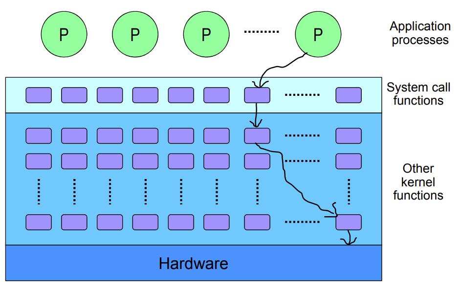

## Operating System

### Definition

- Manage Computer HW & SW Resources
- Provide Common Service for Programs - System Calls

### System Organization

## OS Classification

### Criteria

- Number of Concurrent Users
  - Single-User System
  - Multi-User System
- Number of Concurrent Processes
  - Single-Tasking System
  - Multi-Tasking System (Multiprogramming System)

- Job Processing Mechanism (Computing Paradigm)
  - Batch Systems
  - Interactive Systems
  - Personal Computing
  - Parallel / Distributed Computing
  - Real-Time System
  - Embedded System
  - Mobile Computing
  - Cloud Computing

### Multi-User System

- 여러 User가 동시에 시스템을 사용할 수 있는 경우
- Protection Mechanism 필요
  - For Control Access to System Resources
- Multi-Tasking 가능해야 함

### Multi-Tasking System

- 시스템에 다수의 프로세스들이 동시에 위치할 수 있는 경우
- Concurrency Control & Synchronization 필요

## OS Structure

### Kernel

- Booting 이후 Memory Resident
- Support Resource Management Functions
- Support the Functions Used for Applications

### Utility

- Non-Resident Program

  특정 서비스 실행 요청 받으면 Disk에서 Memory로 올림

  해당 서비스가 종료되면 Memory에서 Disk로 내림

- Support Service Functions

### Bootstrap Loader

- 컴퓨터가 동작하기 시작하면 실행되는 Initial Program

- OS Kernel을 Disk에서 Memory로 Locate & Load 하기 위함

- Firmware 형태로 ROM에 보관되어 있음

- Two-Step Process

  1. ROM에 위치한 Firmware가 Boot Code를 Memory에 올림

     일반적으로 Disk 첫 블록에 Boot Code가 저장되어 있음

  2. Memory에 올려진 Boot Code가 Kernel을 Memory에 올림

## OS Functions

### User Interface

- System Call Interface

### Resource Management

- HW Resource Management
  - Processor
  - Memory
  - I/O Devices
  - Network Devices
- SW Resource Management
  - Files
  - Messages
  - Processes

### Process Management

- Process

  Computer System에 실행하라는 명령이 들어온 상태인 Program

- Management Functions

  - Creation, Deletion
  - Dispatch, Preemption, Block
  - Suspension, Resumption
  - Process Synchronization, Inter-Process Communication
  - Deadlock Handling

- Process Control Block

  - Data Structure for Process Management
  - PCB per Each Process

### Processor Management

- Process Scheduling

  

  한 Processor가 수행할 Process 순서를 결정

- Processor Assignment

  

  각 Processor를 Process에게 위치시킴

### Memory Management

- Multi-User & Multi-Tasking System 인 경우 요구됨
  - Memory Allocation, Deallocation
  - Free Space Management
  - Memory Protection
- Allocation Schemes
  - Total Contiguous Allocation
  - Virtual Memory System

### File Management

- File

  Logical Storage Unit

- Support Hierarchical Directory Structure

- Management Functions

  - Creation, Deletion of Files and Directories

  - Support of Primitives for File, Directory Manipulation

    Read, Write, Seek, etc

  - Mapping of Files onto Disk Storage

  - Free Space Management

### I/O Management

- I/O Process

  

  

  - IOCS, Input Output Control System

  - Buffer Pool

    Applications과 I/O Devices 사이의 Data 전송을 위함

    HDD와 같이 대용량 블록 단위로 이동하는 경우 Buffer Pool 사용이 유리함

### Secondary Storage Management

- Disk Management

### Other Management Functions

- Networking
- Security & Protection

## Mode Operations

### Dual Mode

- User Mode

  On Behalf of User Application

- Kernel Mode

  On Behalf of OS

- Mode Change

  Interrupt or Trap Occurs $\rightarrow$ HW switches Mode

### Interrupt

- Unexpected External Event

  주로 I/O Devices에서 발생

- From HW or SW

### Trap

- SW Generated Interrupt by
  - Exception - An Error of the Running Program
  - System Call - A Specific Request from a User Program

### System Call Interface

- Interface between OS and Applications / Processes
- Executed by a Generic Trap Instruction

## Virtualization

### Concept

- Server Virtualization Method which for Multiple isolated User-Space Instances

- Program이 Virtual Partitions에 분리되어 위치

  Emulator or Virtual Machine 등을 통해서가 아닌 일반적인 OS System Call 이용

### Benefits

- Server Consolidation with Isolation
  - Less Worry about Underutilized
  - Cost Savings
- Simplified Management
  - Provisioning & Monitoring
  - Dynamic Load Balancing
- Improved Availability / Reliability
  - Automatic Restart
  - Fault Tolerance
  - Disaster Recovery
- SW Development
  - Testing

