## Concepts

### Asleep State vs. Deadlock State

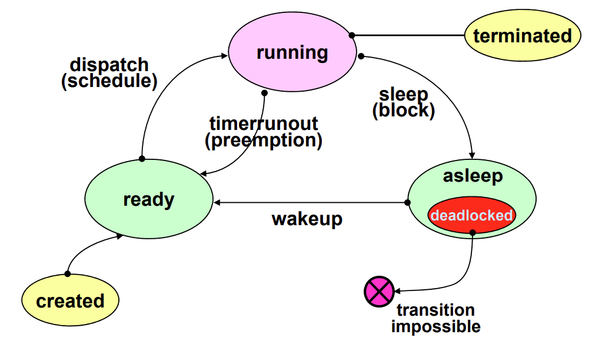

- Asleep
  - 특정 Event를 기다리는 Process
  - 할당 요청을 보낸 Resource를 기다리는 Process
- Deadlock
  - 앞으로 일어나지 않을 Event를 기다리는 Process

### Resource Types

|              Type               | Example                                     |
| :-----------------------------: | ------------------------------------------- |
|      Preemptible Resource       | Processor, Memory, ...                      |
|    Non-Preemptible Resource     | Magnetic Tape Drive, ...                    |
|    Total Allocation Resource    | Processor, Magnetic Tape Drive, ...         |
| Partitioned Allocation Resource | Memory, ...                                 |
|  Exclusive Allocation Resource  | Processor, Memory, Magnetic Tape Drive, ... |
|   Shared Allocation Resource    | Programs, Shared Data, ...                  |
|   Serially-Reusable Resource    | Processor, Memory, Magnetic Tape Drive, ... |
|       Consumable Resource       | Signal, Message, ...                        |

- For Deadlock Model
  - Non-Preemptible Resource
  - Exclusive Allocation Resource
  - Serially Reusable Resource

### Example Deadlock

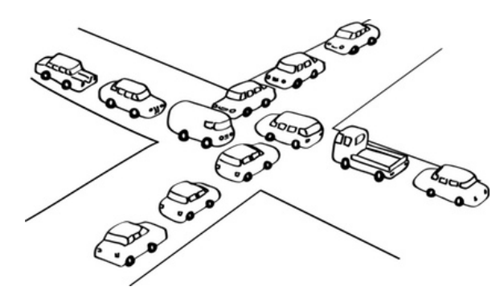

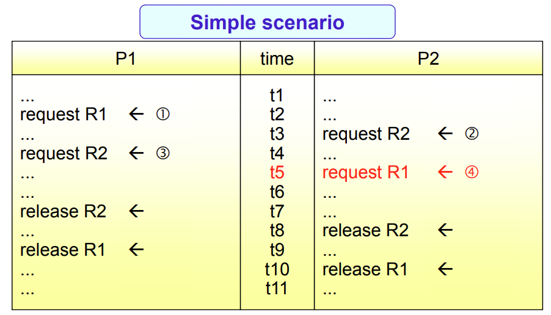

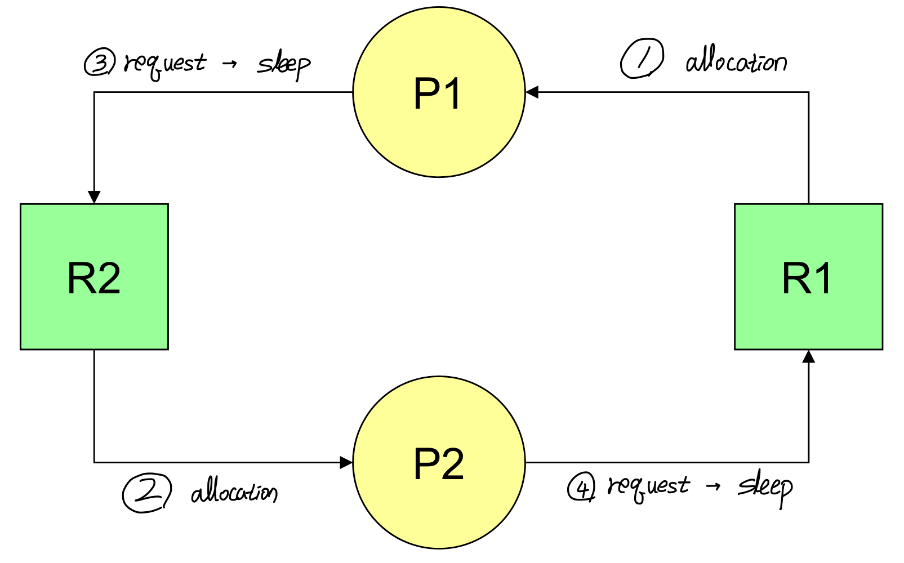

## Models

### Graph Model

- Node

  - Process Node $P_i$
  - Resource Node $R_j$

- Edge

  - Allocation Edge $R_j \rightarrow P_i$
  - Request Edge $P_i \rightarrow R_j$

- Example

  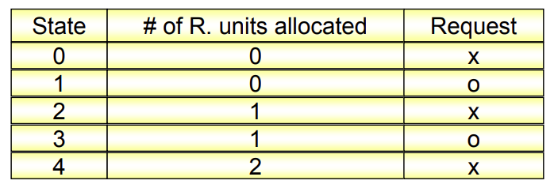

  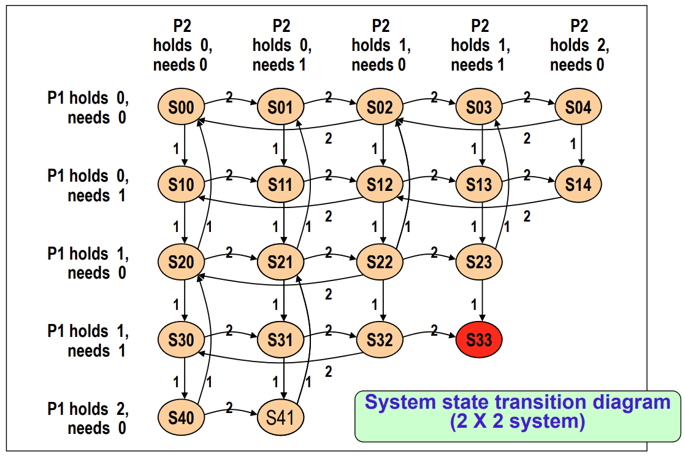

### Deadlock Necessary Conditions

- Exclusive Use of Resources
- Non-Preemptible Resources
- Hold and Wait (Partial Allocation)
- Circular Wait (Cycle)

## Prevention

### Concept

- Deny one of Necessary Conditions for Deadlock
- Deadlock cannot Occur
- Resource Wasteful
- Not Practical

### Deny "Exclusive Use of Resources"

- Make All Resources Sharable

  불가능한 이야기

### Deny "Non-Preemptible Resources"

- All Resources in Preemptible Fashion

- Detour Method 1

  다른 Resource를 Hold한 Process가 또 다른 Resource를 요청한 경우, 기존에 Hold 중이었던 Resource들을 모두 Release하도록 함

- Detour Method 2

  다른 Process가 Hold 중인 Resource를 또 다른 Process가 요청한 경우, 해당 Resource를 현재 Hold 중인 Process를 Preemption 함

- Disadvantage

  - 기본적으로 적용 불가능
  - Serious Resource Wasteful

### Deny "Hold and Wait (Partial Allocation)"

- Method 1

  Total Allocation

  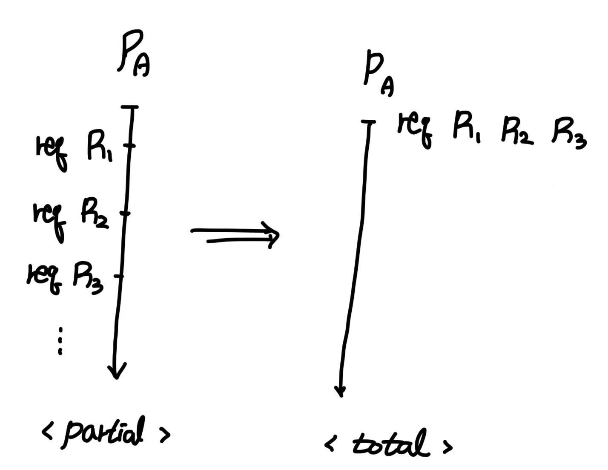

- Method 2

  Hold 중인 Resource가 없는 Process만이 Resource를 요청할 수 있음

  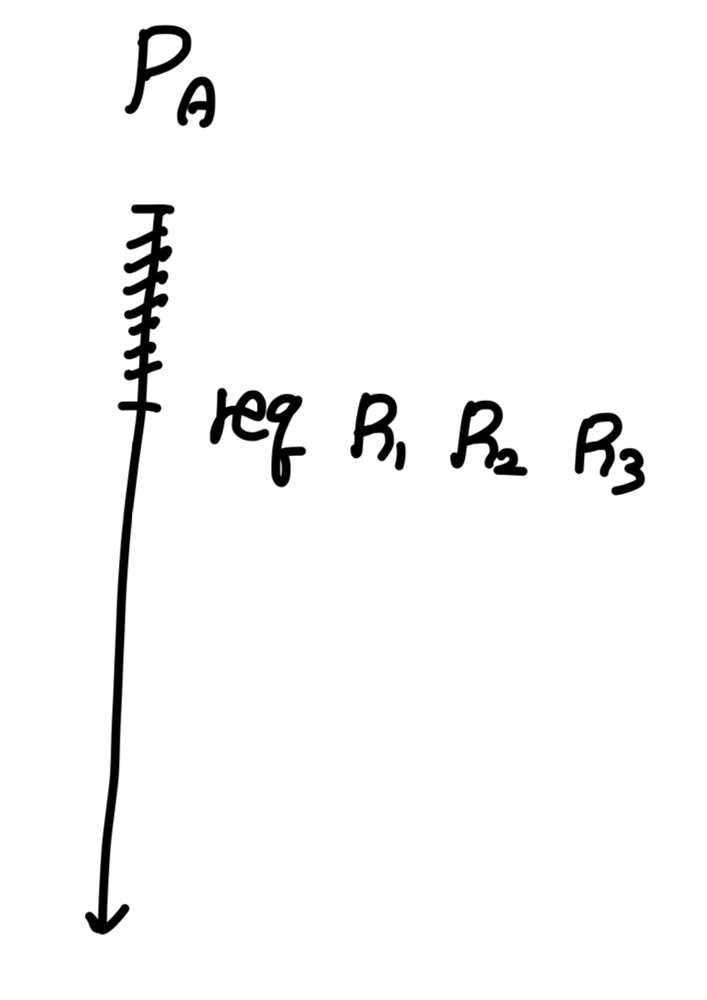

- Disadvantage
  - Resource Wasteful

### Deny "Circular Wait (Cycle)"

- Total Allocation Scheme의 Generalization
- Process는 Hold 중인 Resource Group보다 같거나 낮은 Group의 Resource를 요청할 수 없음

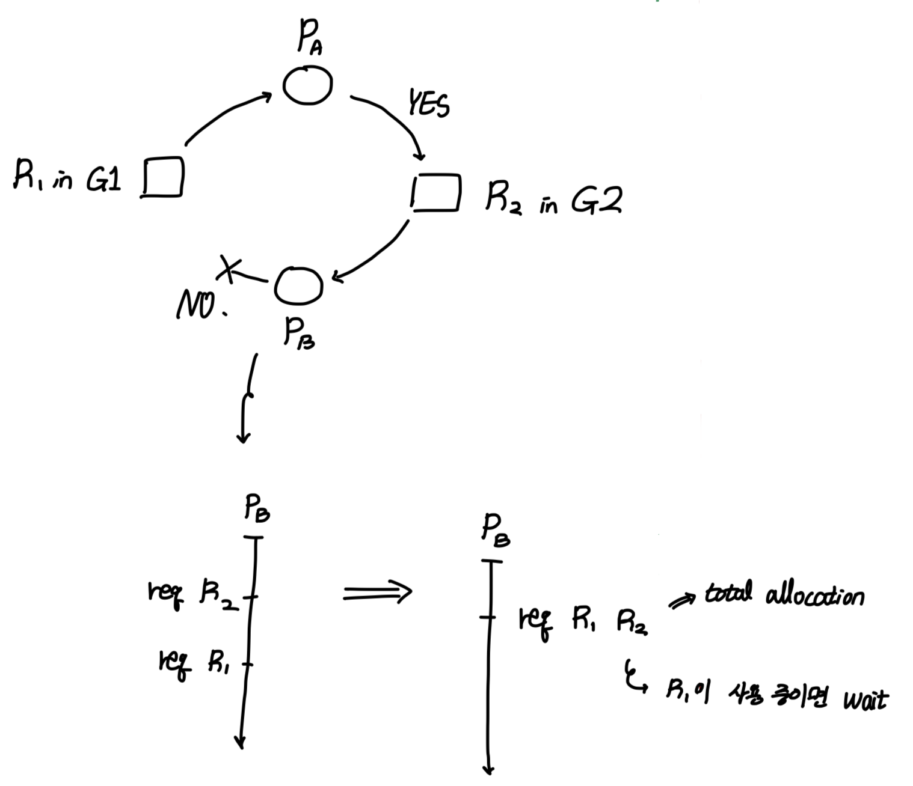

## Avoidance

### Concept

- Monitor System States Continuously

- System Always be in Safe States

  - Safe State

    모든 Process는 Finite Time 내에 정상적으로 종료될 수 있어야 함

  - Unsafe State라고 해서 Deadlock 발생 보장을 의미하지는 않음\

- Assumptions
  - Fixed Number of Processes
  - Fixed Number of Resource Types and Resource Units
  - Maximum Resource Need of Process be Known a Priori
  - Process Release Acquired Resources

### Dijkstra's Algorithm

- 1 Resource Type, Multiple Units

- Safe Example

  - Assumptions

    1 Resource Type $R$, 10 Resource Units, 3 Processes

  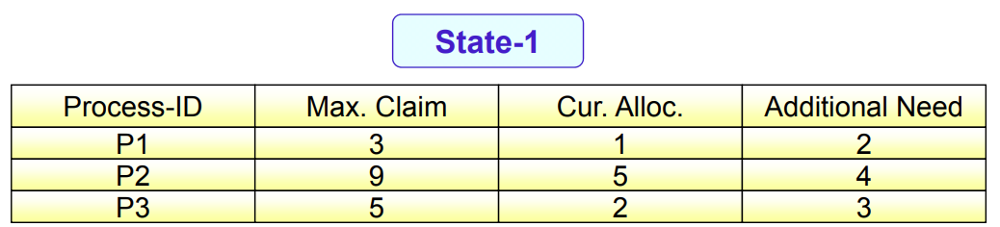

  - Available Resource Unit: 2
  - Safe Sequence: $P1 \rightarrow P3 \rightarrow P2$
  - In Safe State

- Unsafe Example

  - Assumptions

    1 Resource Type $R$, 10 Resource Units, 3 Processes

  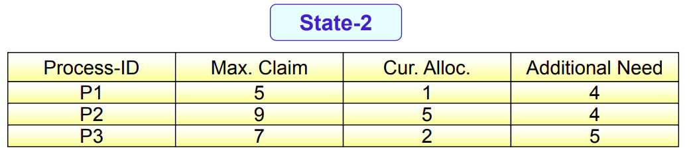

  - Available Resource Unit: 2
  - Safe Sequence: None
  - In Unsafe State

### Habermann's Algorithm

- Multiple Resource Types & Multiple Resource Units

- Example Assumptions

  - 3 Types of Resource
  - Resource Units: (10, 5, 7)
  - 5 Processes

  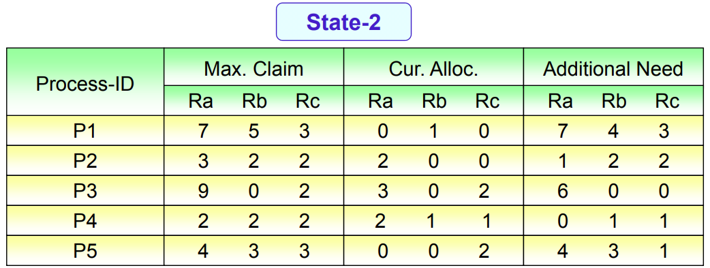

  - Available Resource Units: (3, 3, 2)
  - Safe Sequence: $P2 \rightarrow P4 \rightarrow P1 \rightarrow P3 \rightarrow P5$
  - In Safe State

- Safe Example

  - P2 Request (1, 0, 2)
  - Safe Sequence: $P2 \rightarrow P4 \rightarrow P1 \rightarrow P3 \rightarrow P5$
  - Accept Request

- Unsafe Example

  - P1 Request (0, 3, 0)
  - Safe Sequence: None
  - Reject Request

## Detection

### Concept

- No Preprocessing

- Check Periodically or Aperiodically

- Use Resource Allocation Graph

  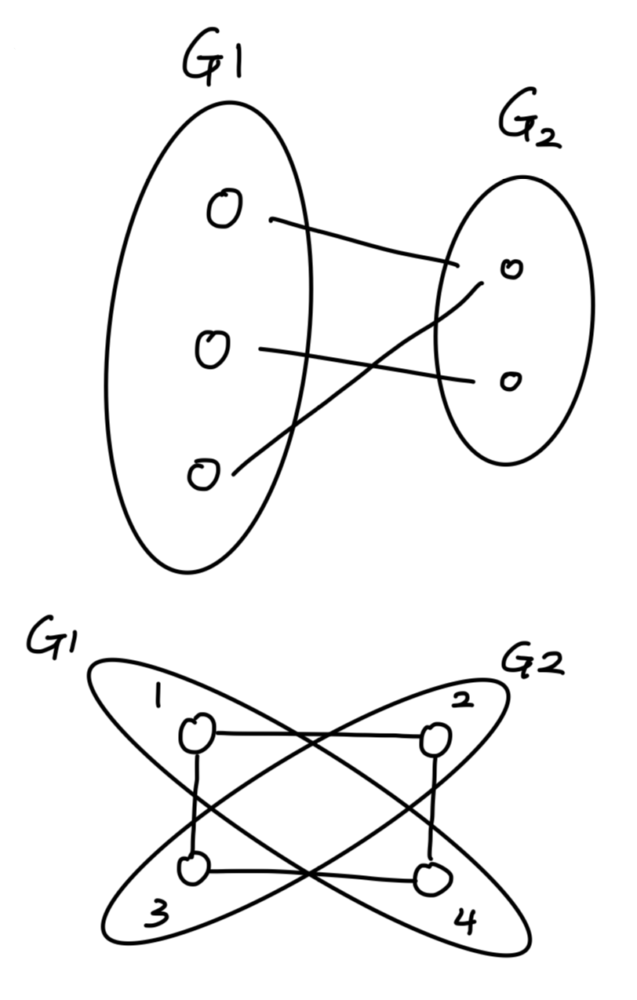

  - Directed Bipartite Graph

- Example

  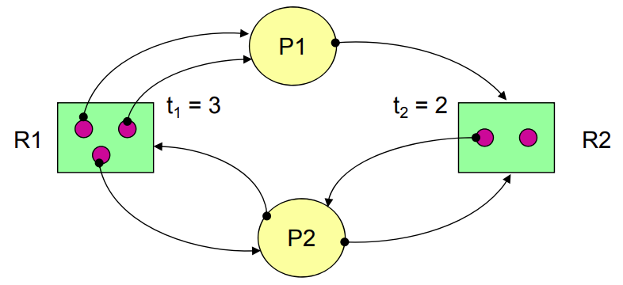

  - Allocation Edge는 Resource Unit에 표시
  - Request Edge는 Resource Type까지만 표시
  - 현재 Deadlock 상태가 아니므로 계속 진행 가능

### Graph Reduction

- Criteria

  - Possible Completely Reduced
    - No Deadlock Process
  - Irreducible
    - One or More Deadlock Process

- Unblocked Process

  해당 Process가 요청한 모든 Resource를 할당받을 수 있는 경우

- Non-Deadlock Example

  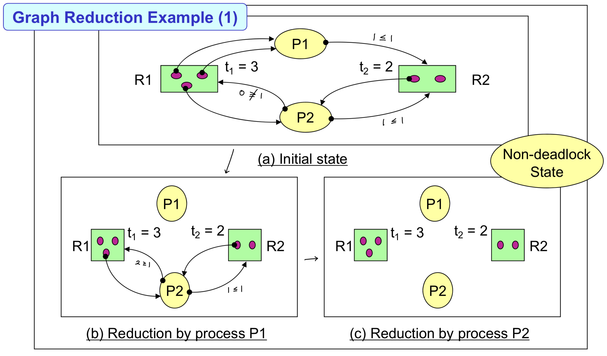

- Deadlock Example

  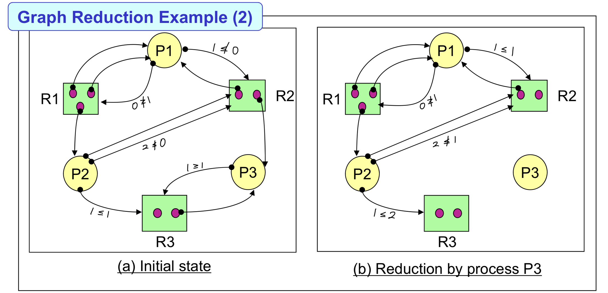

### Avoidance vs. Detection

- Avoidance
  - Consider Worst Case
  - Max Claim 정보 필요
- Detection
  - Consider Most Favorable Case

## Recovery

### Concept

- Detection 이후 Deadlock 제거

### Process Termination

- Terminate One or More Processes to Break the Circular Wait

- Need Termination Cost Model

  - Process Priority, Process Type, Execution Time, Remaining Time, ...

- Policy

  - Lowest Termination Cost Process First

    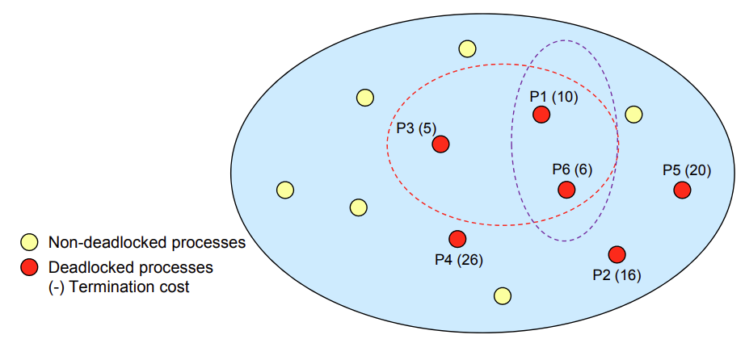

    - P1과 P6만 Termination시켜도 Deadlock을 벗어날 수 있으나 P3까지 Termination시켜야 함

      즉, 최적의 방법을 찾지 못함

  - Minimum Cost Recovery

    - $2^n$ 개의 부분 집합를 모두 찾아봐야 함

      High Overhead

### Resource Preemption

- Select Victim

  - Need Preemption Cost Model
  - Use Minimum Cost Recovery Method

- Rollback Resource

  - Partial Rollback

    Overhead to Keep Process State Information

  - Total Rollback

    Abort and Restart

- Starvation

