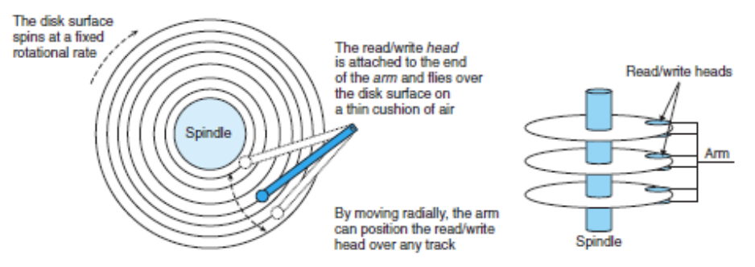

## Disk System

### HDD

- Disk Pack

  

  - Sector
  - Track
  - Surface
  - Platter
  - Cylinder

- Disk Drive

  

  - Head
  - Arm
  - Positioner
  - Spindle

- Data Access

  1. Seek Time

     Head를 원하는 Track으로 위치시키는 데 걸리는 시간

  2. Rotational Delay (Latency Time)

     Head를 원하는 Sector로 위치시키는 데 걸리는 시간

  3. Data Transmission Time

- Disk Capacity

  $Capacity=(\# \ Bytes \ per Sector) * (avg. \ \# \ Sectors \ per \ Track) * (\# \ Tracks \ per \ Surface) * (\# \ Surfaces \ per \ Platter) * (\# \ Platters \ per \ Disk)$

- Chacaterisitic

  - In-Place Writing
  - Direct Access

### SDD

- FTL, Flash Translation Layer

  - Disk Controller의 역할을 수행
  - Logical Block 요청을 Physical Device에 맞게 변환

- Characteristic

  - Access Data in Unit of Pages

  - In-Place Write 불가

    - Block이 완전히 지워진 상태이어야만 Page에 Write 가능
    - Data Write는 Page 단위이지만 Erase는 Block 단위

  - Read보다 느린 Write

    (HDD는 Read와 Write 모두 비슷)

## File

### Concept

- Named Collection of Related Information on Secondary Storage
- Metadata in FCB, File Control Block

### Open File Operation

- Purpose

  Avoid Constant Directory Searching

- Procedure

  1. Take Filename
  2. Search Directory
  3. Copy Metadata into Open-File Table
  4. Return Open-File Table Entry Pointer

- Example in Unix

  

### Protection

- Access Matrix

  

## File System

### View

- User View

  Hierarchical Directory Structure

- Kernel View

  Logical Sequence of Blocks

- Device View

  - $(Cylinder \ \#, \ Surface \ \#, \ Sector \ \#)$ in HDD
  - $(Block \ \#, \ Page \ \#)$ in SSD

### Directory Structure

- Flat Directory Structure

  

  - All Files in Same Directory

- 2 Level Directory Structure

  

  - Separate for Each User
  - Not Support Cooperation of Users

- Hierarchical Directory Structure

  

  - Tree of Arbitrary Height

- Acyclic Graph Directory Structure

  

  - Generalization of Tree Structure
  - Allow to Share Subdirectory

- General Graph Directory Structure

  

  - Generalization of Acyclic Graph Structure
  - Permit Cycle

## Consistently Sharing

### Semantics

- Modifications of Data by One User are Observable by Another User

### Unix Semantics

- Writes to Open File are Visible Immediately to Other Users

### Session Semantics

- Writes to Open File are Not Visible Until File is Closed

### Immutable-Shared-File Semantics

- Once File is Declared as Shared, Cannot be Modified