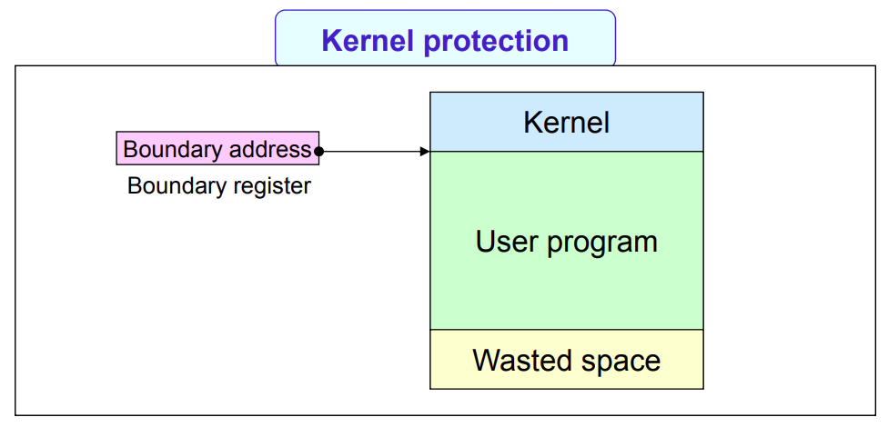

## Background

### Memory Type

- Processor Register
- Cache Memory
- Main Memory
- Auxiliary Storage

- Data Transfer Unit

  - Word

    CPU와 Primary Memory 사이의 Data Transfer Unit

  - Block

    Primary Memory와 Secondary Storage 사이의 Data Transfer Unit

- Access Time

  - Register

    0~1 CPU Clock Cycle

  - Memory

    50~200 CPU Clock Cycle

### Address Binding

- Compile-time Binding

  

  - Absolute Code 생성
  - Recompilation 경우, Memory 시작점을 변경해야 함

- Load-time Binding

  

  - Compiler는 Relocatable Code를 생성해야 함
  - Memory 시작점 변경을 위해서 Reloading과 Relocation을 거쳐야 함

- Run-time Binding

  

  - Logical Address에서 Physical Address 맵핑을 위해 MMU, Memory Management Unit 필요

### Dynamic Linking

- Stub Concept 활용
- Shared Library와 같은 Code Share 가능

### Overlay Structure

- 해당 시점에 필요한 이미지만을 Memory에 상주시키는 구조

### Swapping

- 효율적인 CPU Utilization을 위해 Time Quantum > Swap Time 이어야 함
- Swap Device
  - Disk의 일부
  - Process Image를 Contiguous Allocation

## Contiguous Allocation

### Policy for Organization

- Number of Processes in Memory
- Amount of Allocated Memory Space for Each Process
- Memory Partition Method

### Uniprogramming

- If Program Size > Memory Size

  Overlay Structure 필요

  이를 위해Compiler, Linker, Loader Support 필요

- Kernel Protection

  

- Low System Resource Utilization

### FPM, Fixed Partition Multiprogramming

- Concept

  

  - Memory를 Fixed-Size Partition으로 나눔
  - Process와 Partition은 1대1 맵핑
  - Low Memory Management Overhead

- Partition Bound Protection

  

  

  - During Context Switching

- Waste of Storage Space
  - Internal Fragmentation
  - External Fragmentation

### VPM, Variable Partition Multiprogramming

- Concept

  

  - 동적으로 Memory Partition State 변화
  - No Internal Fragmentation

- Placement Strategy

  - First-Fit

    - Simple & Low Overhead

  - Best-Fit

    - Long Search Time

    - External Fragmentation 가속화

  - Worst-Fit

  - Next-Fit

    - Circular Search
    - Low Overhead

- Coalescing Hole

  

  - Merge Adjacent Free Partition

- Storage Compaction

  

  - Place All Free Memory Together
  - Consume Long CPU Time

## Discontiguous Allocation

### Paging

- Concept

  

  - Page

    Logical Memory into Fixed-Size Blocks

  - Frame

    Physical Memory into Fixed-Size Blocks

  - Logical Address

    $v=(p,d)$

    - Page Number $p$
    - Page Displacement $d$

- Address Mapping

  

  - From Logical Address To Physical Address
  - Use Page Table for Each Process

### Segmentation

- Concept

  

  - Memory를 Variable-Sized Segment Collection으로 취급

  - Program을 Various Object Collection으로 취급

    Code, Global Variables, Heap, Stack, ...

  - Logical Address

    $v=(s,d)$

    - Segment Number $s$
    - Displacement $d$

- Address Mapping

  

## Virtual Memory