## Process Concept

### Job vs. Process

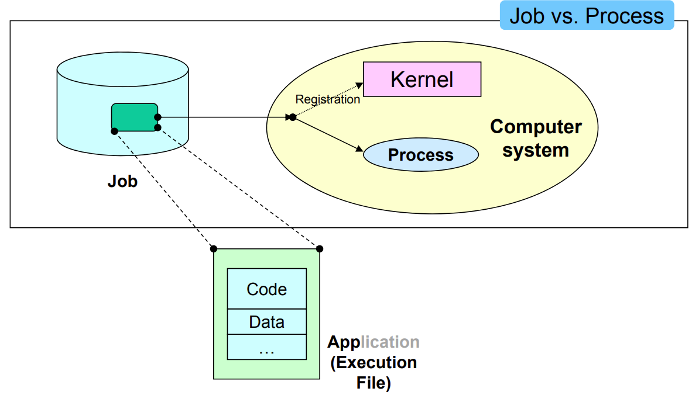

- Job
  - Also Called App, Image File
  - 실행될 Program & Data 번들
  - 실행을 위해 Kernel에 제출 전 Entity
  - Static Entity

- Process
  - 실행을 위해 Kernel에 등록된 Entity
  - PCB, Process Control Block에 할당된 Entity
  - Active Entity

### Process vs. Thread

- Process

  - 독립적인 실행 단위로, 자체 Memory 공간, File Descriptor, System Resource 소유
  - 다른 Process와는 완전히 격리되어 있음
  - 각 Process는 별도의 Program Instance로 간주

- Thread

  - 하나의 Process 내에서 실행되는 작업 단위

    한 Process가 여러 Thread를 가질 수 있음

  - Thread는 부모 Process의 Memory 공간을 공유하므로 Thread 간 통신이 수월함

  - Thread Context Switching이 Process보다 빠름

### Process Context

- Process는 고유 Context를 가짐
  - Program Code (Text)
  - Global Data (Text)
  - Temporary Data (Stack)
  - Heap Data
  - Values of Processor Registers
  - ...Etc

### PCB

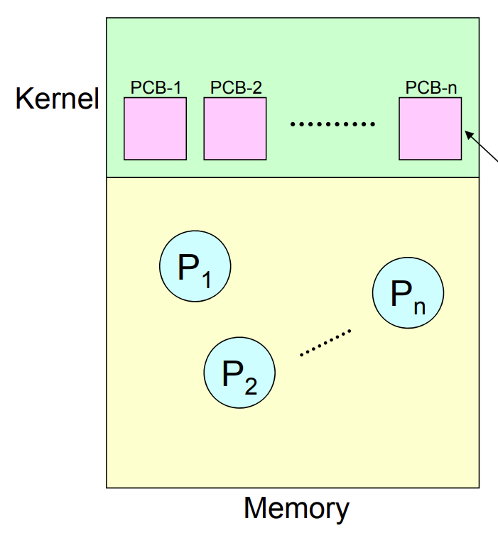

- Process Control Block

- 각 Process에 대한 정보를 Memory Kernel Space에 보관

  - PID, Process Identification Number

  - Process State

    e.g., Use CPU or Use I/O or Waiting

  - Scheduling Information

    e.g., Process Priority, Scheduling Parameters

  - Memory Management Information

    e.g., Base Registers, Page Tables, Segment Tables

  - I/O Status Information

    e.g., I/O Devices Allocated List, Open Files List

  - Account Information

  - Context Save Area

    Process의 Register Context 저장을 위한 공간

## Process States

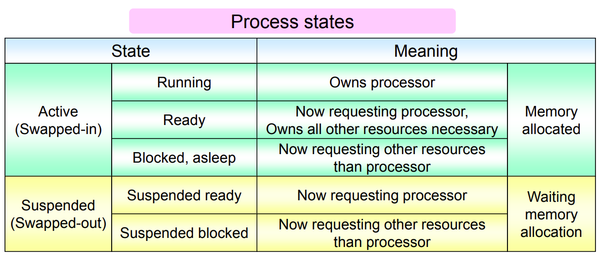

- Process와 Resource 간의 상호 작용 상태에 따라 결정됨

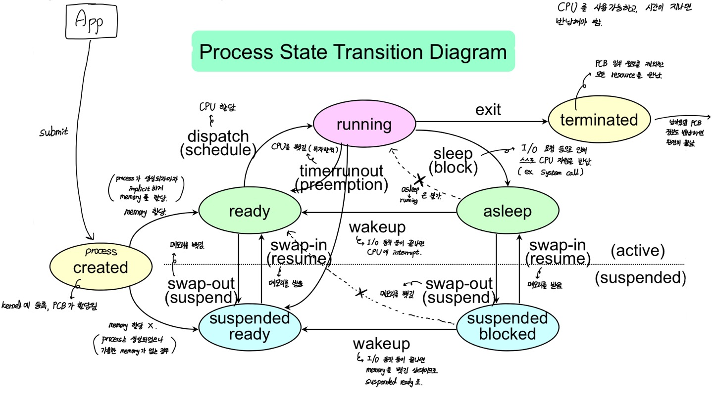

### Crated State

- 유저의 Job 요청이 Kernel에 등록
- PCB 할당
- 새로운 Process 생성, 트리 형태의 계층 구조
- 이때 Kernel은 가용한 메모리 공간 확인 후, Process를 다음 State로 변경

### Ready State

- Processor를 제외하고 필요한 Resource를 모두 할당받은 상태
- Dispatch (Schedule)
  - Ready State에서 Running State로 전환

### Running State

- Processor에서 Program이 동작 중인 상태
- Preemption
  - Time Quantum 만료 또는 더 높은 우선순위의 Process 등장으로 인해 발생
  - Running State에서 Ready State로 전환
- Block (Asleep)
  - 추가 Resource 할당을 위해 Process가 스스로 Processor를 Release
  - Running State에서 Asleep State로 전환

### Blocked State

- Processor와 Memory를 제외한 다른 Resource를 요청하고 대기 중인 상태
- Wakeup
  - I/O Device에서의 Interrupt등을 통해 Resource 할당으로 인해 발생
  - Asleep State에서 Ready State로 전환

### Suspended Ready State

- Ready State에서 Memory Swap Out 상태
- Memory Image는 Swap Device로 이동됨
  - Swap Device는 보통 HDD 일부 특수 저장 공간

### Suspended Asleep State

- Asleep State에서 Memory Swap Out 상태

### Termination State

- Process 실행을 완료한 상태
- 할당된 모든 Resource들을 Release
- PCB 내의 일부 정보만 소유

## Scheduler

### Ready Queue

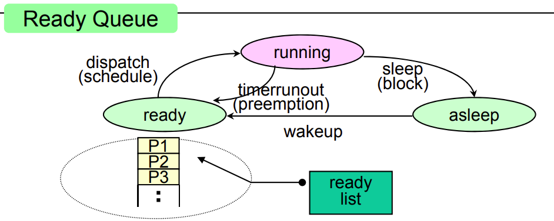

- Ready State인 Process을 관리

- Ready List

  Priority Queue 구조

### I/O Queue

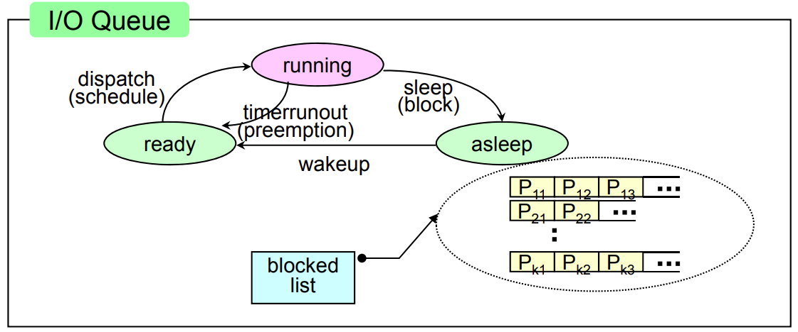

- Asleep State인 Process을 관리

  각 Process는 서로 다른 Resource를 요청 중인 상태

- Block List

  각 Resource마다 List 존재

### Classification

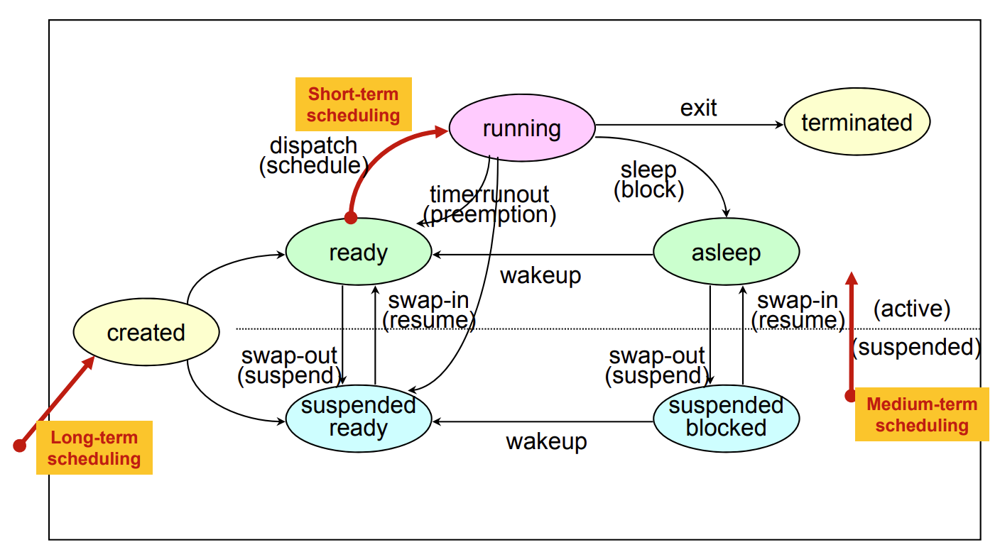

- Long-Term Scheduler, Job Scheduler

  - Multiprogramming Degree를 관리

    CPU Bound와 I/O Bound 간의 균형 조절

- Medium-Term Scheduler

  - Memory Swapping

- Short-Term Scheduler, Process Scheduler

  - 여러 성능 지표들을 토대로 고려
    - Throughput
    - Response Time

## Interrupt

- Processor 입장에서 Unexpected Event
  - I/O Interrupt
  - Clock Interrupt
  - Console Interrupt
  - Machin Check Interrupt
  - Inter-Process Communication Interrupt
  - ...ETC

### Handling Process

1. Interrupt from External Source
2. Pause Process Execution
3. Interrupt Handling
   - Handler는 Kernel에 위치
4. Check Interrupt Source & Reason
5. Decision for Interrupt Service
   - 기존 작업과 Interrupt 우선 순위를 비교
6. Invoke ISR, Interrupt Service Routine

- Example

  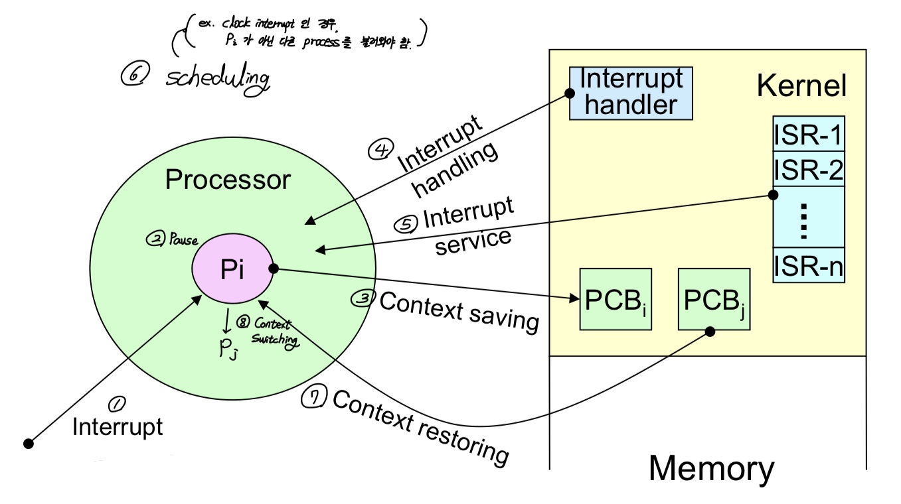

  1. Interrupt Occur
  2. Pause Running
  3. Context Saving to PCB
  4. Interrupt Handling
  5. Invoke Interrupt Service Routine
  6. Re-Schedule
  7. Context Restoring from PCB

## Context Switching

- Context

  - User-Level

    e.g., Text, Data, Stack, Heap

  - System-Level

    e.g., PCB

  - Register-Level

    e.g., CPU Register

- Context Switching

  - Context Saving

    Register Context를 Save

  - Context Restoring

    이어 실행할 Process의 Register Context를 Reload

## Inter-Process Communication

- For Process Cooperation
  - Information Sharing
  - Computation Speedup
  - Modularity
  - Convenience

### Message Passing

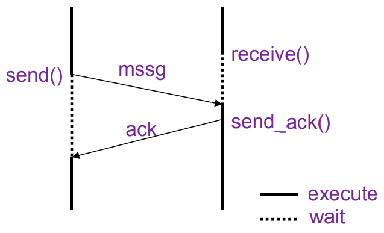

- Direct or Indirect Communication
- Synchronization Mechanism 필요
- Buffering Mechanism 필요

### Shared Memory

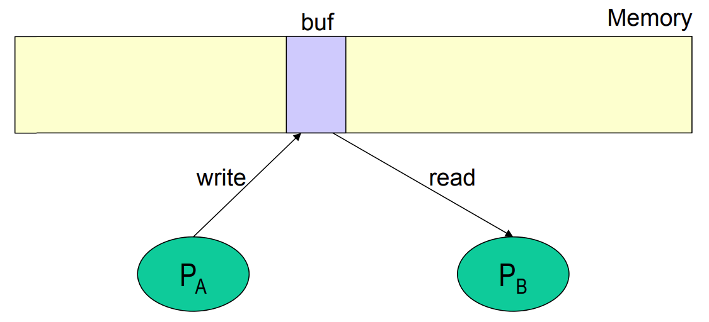

- Indirect Communication

### RPC, Remote Procedure Call

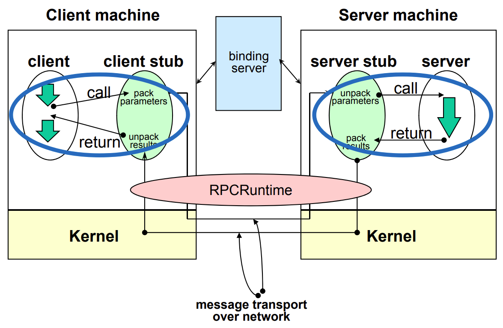

- Procedure Call Mechanism을 추상화시킨 것
- Message Passing 프레임워크 상에서 동작

### DSM, Distributed Shared Memory

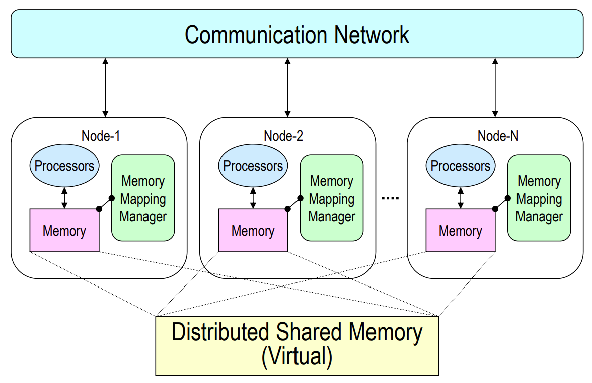

- 느슨히 결합된 Distributed Memory System에 적용되는 Shared Memory 패러다임
- Message Passing 프레임워크 상에서 동작