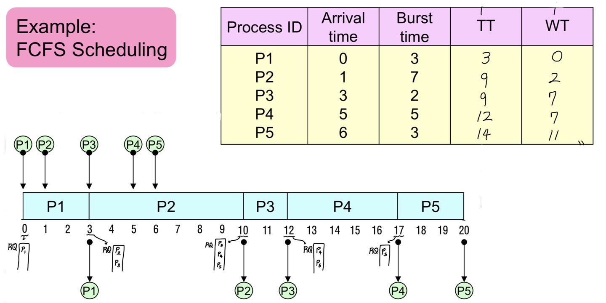
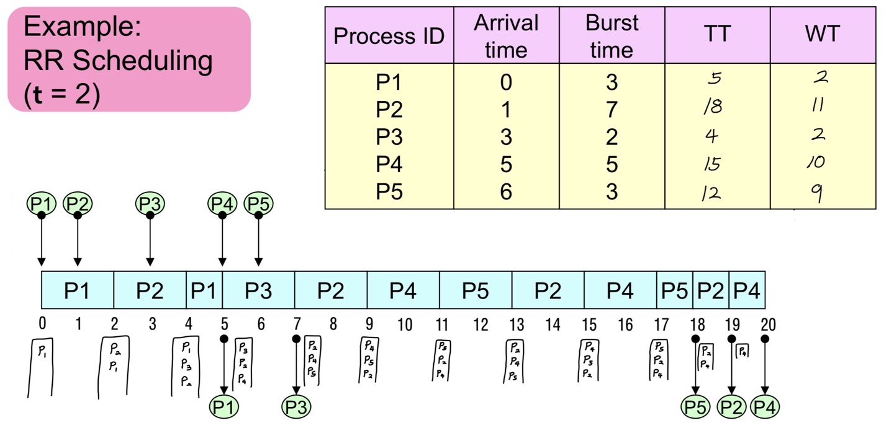
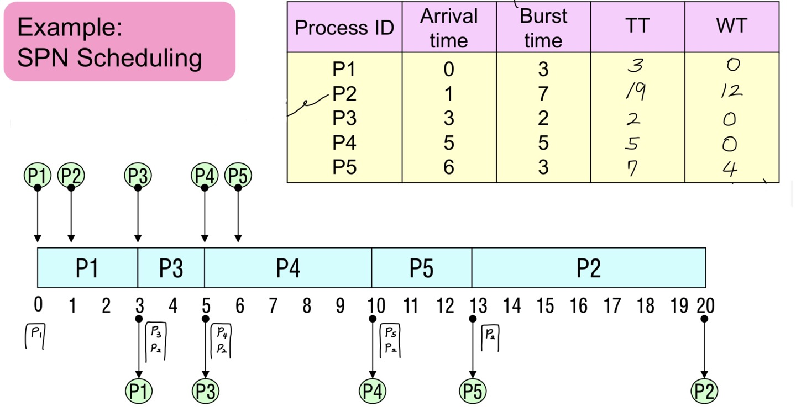
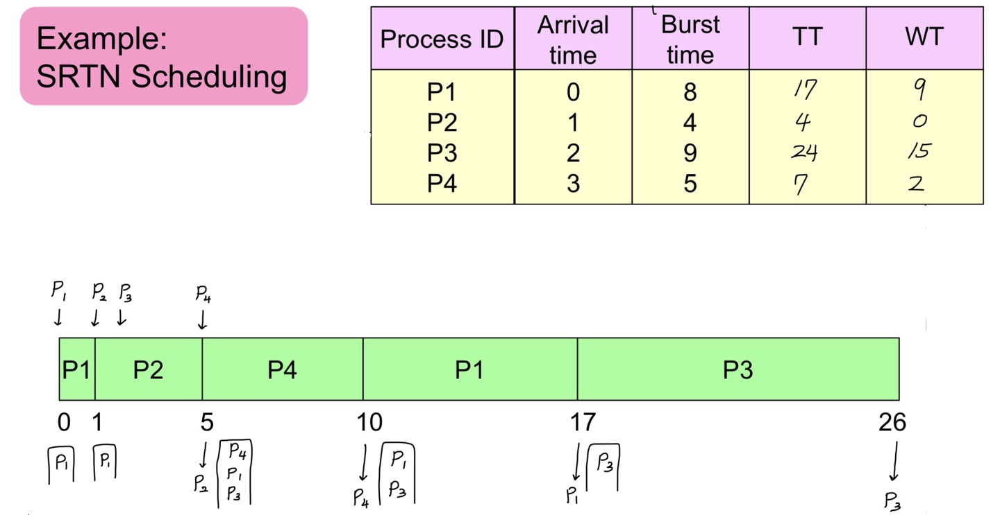
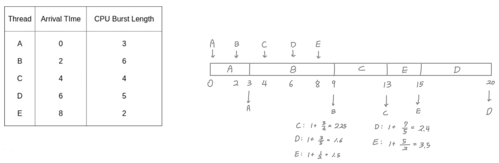
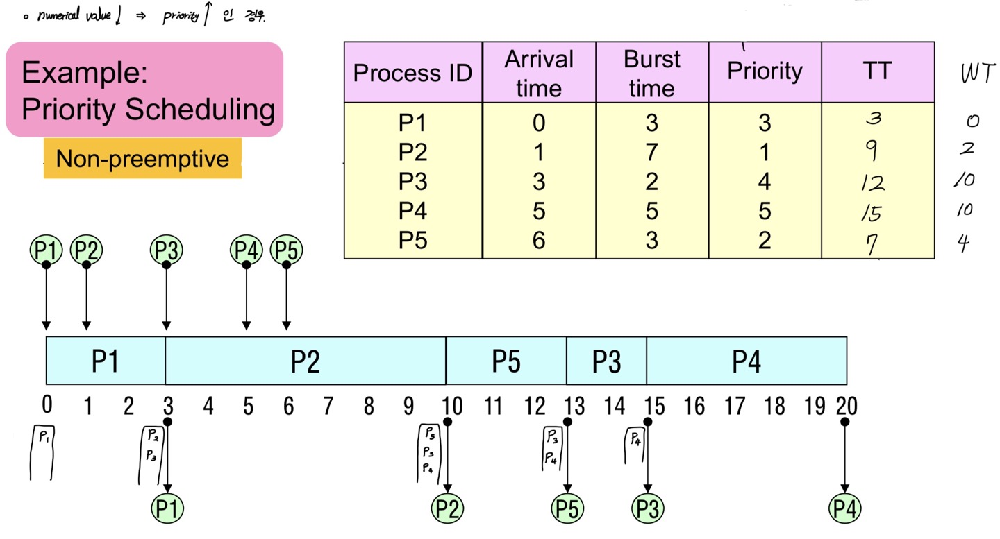
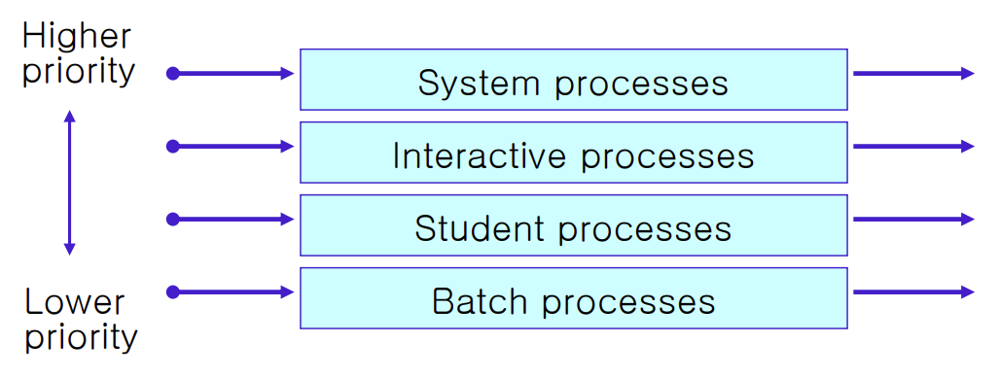
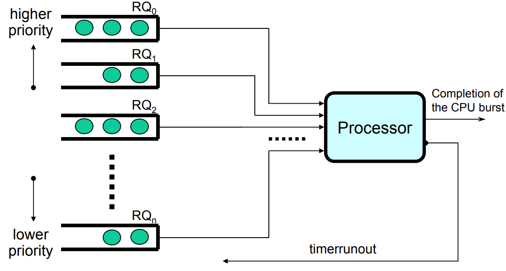

## About Multiprogramming

- Process를 효과적으로 관리하여 Processor Utilization 증가
- Resource for Time Sharing
  - 여러 Process가 Resource를 Time-Shared Manner로 사용
  - Processor
- Resource for Space Sharing
  - Resource를 분할하여 각 Process애게 할당된 공간을 사용
  - Memory

## About Scheduling

### Goal

- Process 상태에 유의하며 System Performance 높이기

  - 평균 Response Time

    요청한 후부터 첫 응답이 올때까지의 시간

  - Throughput

    Time Unit 동안 완료된 Process의 수

  - Resource Utilization

  - Turnaround Time

    요청한 후부터 완료될 때까지의 시간

  - Waiting Time

    Ready Queue에서 기다리는 시간

### Scheduling Criteria

- Process Characteristics
  - Compute Bound or I/O Bound
  - Batch or Interactive (Background or Foreground)
- Urgency of Process
- Process Importance & Domain
- CPU Burst Time
- Process Priority

### Scheduling Level

- Long-Term Scheduling
  - Job Scheduling
  - Control Multiprogramming Degree
  - Select Process Mix (Compute Bound or I/O Bound)
- Medium-Term Scheduling
  - Memory Allocation (Swapping)
- Short-Term Scheduling
  - Process Scheduler

### Scheduling Policy

- Preemptive Scheduling
  - 높은 Context Switching Overhead
  - Shared Data 접근으로 인해 Cost 야기
- Non-Preemptive Scheduling
  - 빈번한 우선순위 역전 현상
  - 평균 Response Time 증가
- Static Priority
  - External Priority
  - Process Creation 시기에 결정
  - System 내부 상태에 영향을 받지 않음
- Dynamic Priority
  - Internal Priority
  - System과 Process 상태에 따라 달라짐

## Scheduling Scheme

### FCFS, First Come First Service

- Non-Preemptive

- Criteria: Arrival Time

  먼저 Ready Queue에 들어온 Process 먼저 처리

- Pros

  - High Resource Utilization (Low Overhead)

- Cons

  - Convoy Effect 발생 가능

    

  - 평균 Response Time 증가

### RR, Round Robin

- Preemptive

  각 Process마다 Time Quantum 존재

  - Very Large Time Quantum - FCFS
  - Very Small Time Quantum - Processor Sharing

- Criteria: Arrival Time

  먼저 Ready Queue에 들어온 Process 먼저 처리

- Pros

  - Convoy Effect 해소

- Cons

  - High Context Switching Overhead

### SPN, Shortest Process Next

- Non-Preemptive

- Criteria: CPU Burst Time

- Pros

  - 대부분의 Process에 있어서 빠른 Response

  - 평균 Waiting Time 최소화

  - Number of Process 최소화

    Overall Space 감소

- Cons

  - Starvation

    Long CPU Burst Time Process는 계속해서 대기 상태일 수 있음

  - Next CPU Burst Time을 정확히 알 수 있는 방법이 전무함

    Burst Time Estimation Overhead

### SRTN, Shortest Remaining Time Next

- Preemptive
- Criteria: CPU Burst Time
- Pros
  - SPN과 유사
- Cons
  - Burst Time Estimation Overhead
  - Remaining Time Trace Overhead
  - High Context Switching Overhead

### HRRN, High Response Ratio Next

- Non-Preemptive

- Criteria: High Response Ratio

  $Response \ Ratio=\frac{Waiting \ Time + Burst \ Time}{Burst \ Time}$

- Pros

  - Starvation 방지

    Aging 방식 도입

  - SPN과 유사

- Cons

  - Burst Time Estimation Overhead

### Priority

- Either Preemptive or Non-Preemptive

- Criteria: Priority

  Tie Breaking: FCFS

- Cons

  - Starvation

### MLQ, Multi Level Queue

- Fixed-Priority Preemptive (일반적으로)

- Ready Queue를 여러 개로 나누어 각각 우선순위를 부여

  각 Queue는 고유한 Scheduling Mechanism 보유

- Process Creation 시기에 영구적인 우선순위를 부여 받음

### MFQ, Multi Level Feedback Queue

- Preemptive
- Goal
  - Favor Short CPU Burst Time Process
  - Favor I/O Bound Process
  - Improve Adaptability
- Process에 대한 아무 정보없이 동작 가능
- 별개의 우선순위를 부여한 Multiple Ready Queue

- Process는 동작 과정에서 Feedback에 따라 우선순위가 변동

  - Running Process가 Sleep으로 Processor를 반납했다면, Wake Up 후 기존 Ready Queue로
  - Running Process가 Preempt 되었다면, 한 단계 낮은 우선순위의 Ready Queue로

- Cons

  - High Context Switching Overhead
  - Starvation

- Variation of MFQ

  - 각 Ready Queue마다 다른 Time Quantum 설정

    Overhead 감소 목적

  - Aging

    Starvation 방지 목적

  - Promotion I/O Bound Process

    Adaptability 증가 목적

