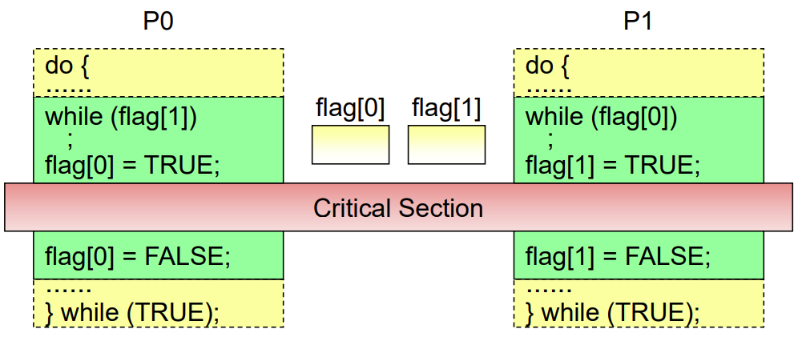
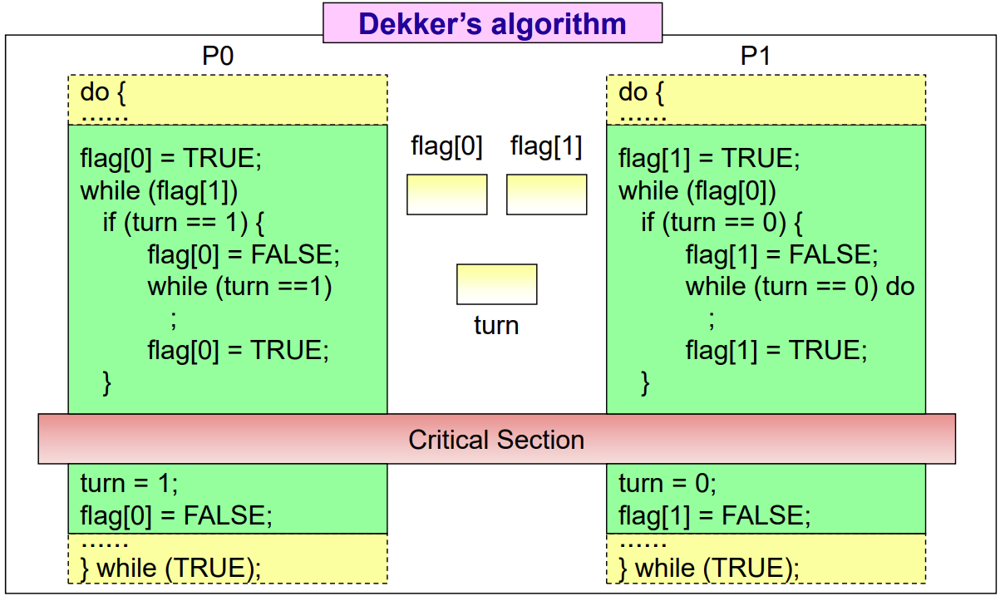
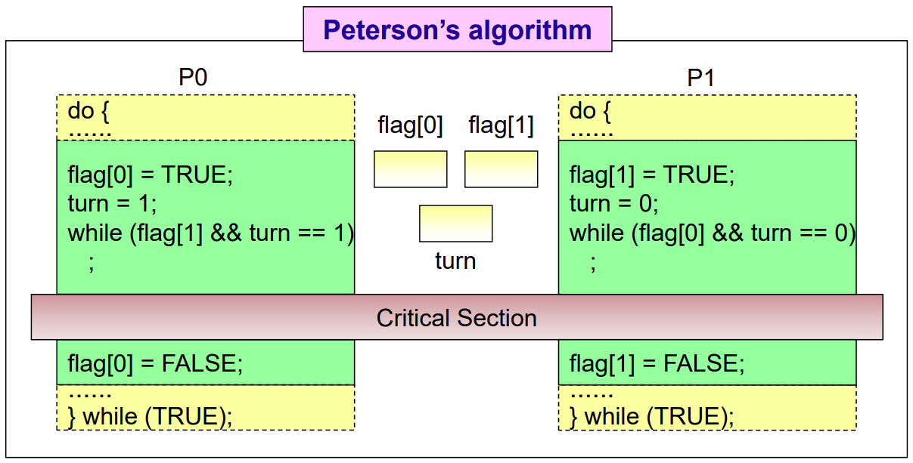
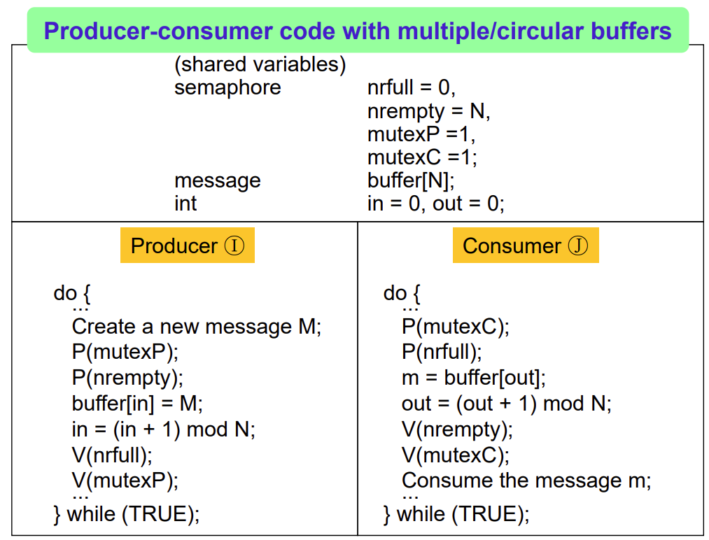

## About Synchronization

### Inherent Characteristics of Process

- Concurrent

  Exist Multiple Processes in System at the Same Time

- Asynchronous

  Each Process has No Information about another

### Concept

- Multiple Processes의 Independent Execution으로 인해 Data Inconsistency
  - Access Shared Resource / Data Independently in Kernel Space
  - Directly Share a Logical Address Space
- Process Synchronization Mechanism 필요
  - `Synchronized` 상대방에 대한 정보를 알고 있고, 내 정보를 상대방에게 알려주는 것


## Race Condition

### Characteristics of Machine Instruction

- Atomicity, Indivisibility
- No Interrupt During Execution of a Machine Instruction
- Machine Instruction Cycle
  1. Instruction Fetch
  2. Instruction Decode
  3. Operand Fetch
  4. Execute
  5. Interrupt Check

### Concept


- Order of Execution: ① ② Interrupt ❶ ❷ ❸ ③

  `count` = 1, Race Condition 발생


## Critical Section Problem

### Critical Section

- Shared Data에 Access하는 Code Segment 

### Mutual Exclusion

- 여러 Process가 동시에 Critical Section 구동을 방지하는 것

- Race Condition 발생하지 않기 위해 Process Synchronization Mechanism 필요

- Primitives

  

  - `enterCS()`

    현재 다른 Process가 Critical Section에 존재하는지 확인

  - `exitCS()`

    현재 Running Process가 Critical Section을 벗어났다고 알림

### Requirements for Mutual Exclusion Primitives

- Mutual Exclusion

  Critical Section을 어느 한 Process가 구동 중이면 다른 Process는 구동할 수 없음

- Progress

  Process가 Critical Section 구동을 위해 대기하는 경우, 다른 Process가 Mutual Exclusion을 해제하고 진행할 수 있어야 함

  즉, 한 Process가 Mutual Exclusion을 얻지 못하고 영원히 대기하지 않도록 해야 함

- Bounded Waiting

  각 Process는 유한한 시간 내에 Critical Section을 구동시킬 수 있어야 함

### Two Process Mutual Exclusion

- Version 1

  

  - Satisfy Mutual Exclusion Requirement

    두 Process가 동시에 Critical Section에 접근할 경우는 없음

  - Not Satisfy Progress Requirement

    P1이 먼저 Critical Section에 접근 시도하는 경우, Progress 조건이 만족되지 않음

- Version 2

  

  - Not Satisfy Mutual Exclusion Requirement

    P0의 `flag[0]=TRUE` 직전에 Preemption 된 후, P1이 Critical Section 접근 도중에 Preemption 된다면 P0도 Critical Section에 접근 가능하게 됨

- Version 3

  

  - Satisfy Mutual Exclusion Requirement

  - Not Satisfy Progress Requirement

    P0의 `flag[0]=TRUE` 직후 Preemption 되고 P1의 `while (flag[0])` 중 Preemption 되면, P0도 `while (flag[1])` 실행하게 되어 두 Process 모두 무한 루프에 걸리게 됨

- Dekker's Algorithm

  

- Peterson's Algorithm

  

### N Process Mutual Exclusion

- Dijkstra's Algorithm

  

  - Value `flag[]`

    - `IDLE`

      Process Not Try to Enter Critical Section

    - `WANT_IN`

      Process is in Stage 1 for Critical Section Entrance

    - `IN_CS`

      Process is in Stage 2 for Critical Section or in Critical Section

  - Not Satisfy Bounded Waiting Requirement

- Knuth's Algorithm

- Eisenberg & McGuire's Algorithm

- Lamport's Algorithm

- Bakery Algorithm


## HW Solution

### Problem of SW Solution

- Low Speed
- Preemption During Mutual Exclusion Primitives

### HW Support in Uniprocessor

- By Enable / Disable Interrupt when Access Critical Section

### HW Support in Multiprocessor

- `TS()` Instruction (Test and Set)

  ```c++
  bool TS(bool *target) {
      bool rv = *target;
      *taret = true;
      return rv;
  }
  ```

  

  - Not Satisfy Bounded Waiting Requirement

    어느 한 Process는 계속 루프를 돌고 있을 수 있음

- `Swap()` Instruction

  ```c++
  void swap(bool *a, bool *b) {
      bool tmp = *a;
      *a = *b;
      *b = tmp;
  }
  ```

  

  - Not Satisfy Bounded Waiting Requirement


## Intermediate Summary

- Problem of Mutual Exclusion Algorithms
  - Busy Waiting
  - Inefficiency
- Let Process Go to Asleep State If Cannot Enter Critical Section Immediately


## Semaphore

- Solution for Busy Waiting Problem

### Definition

- Integer Variable

- Encapsulation by `P()`, `V()`, and Initialization

  - `P()`는 Indivisible Wait 동작

    ```pseudocode
    if (S>0)
    	then S <- S-1;
    	else wait on the queue Q;
    ```

    ```pseudocode
    P (semaphore *S) {
    	S->value--;
    	if (S->value < 0) {
    		add this process to S->list;
    		block();
    	}
    }
    ```

  - `V()`는 Indivisible Signal 동작

    ```pseudocode
    if (exist waiting processes on Q)
    	then wakeup one of them;
    	else s <- S+1;
    ```

    ```pseudocode
    V (semaphore *S) {
    	S->value++;
    	if (S->value <= 0) {
    		remove a process P from S->list;
    		wakeup(P);
    	}
    }
    ```

### Mutual Exclusion Problem

- Binary Semaphore


- Not Satisfy Bounded Waiting Requirement

  `V()`가 Pop하는 방식이 명확하지 않음

### Process Synchronization Problem

- Binary Semaphore


### Producer-Consumer Problem

- Counting Semaphore


- Case of Single Buffer

  

- Case of Multiple Buffers

  

  

### Reader-Writer Problem

- Counting Semaphore
- Readers can Simultaneously Access


### Dining Philosopher Problem

- Counting Semaphore

```pseudocode
process() {
	do {
		pickup(i);
		eating;
		putdown(i);
		thinking;
	} while (TRUE);
}
```

- Code for Each Philosopher Process

```pseudocode
process() {
	do {
		P(i);
		P( (i+1) mod n );
		eating;
		v(i);
		V( (i+1) mod n );
		thinking;
	} while (TRUE);
}
```

- 각 수저 한 쌍을 하나의 Semaphore라고 하면, 크기가 `n`인 Semaphore 배열 `forks[]`이 존재

### Characteristics of Semaphore Solution

- No Busy Waiting

- No Scheduling for Wakeup

  Starvation Problem 발생


## Spinlock

- No Sleep Queue

  Allow Busy Waiting

### Definition

- Integer Variable

- Encapsulation by `P()`, `V()`, and Initialization

  - `P()`

    ```pseudocode
    P(S) {
    	while (S <= 0)
    		;
        S--;
    }
    ```

  - `V()`

    ```pseudocode
    V(S) {
    	S++;
    }
    ```

### Mutual Exclusion Problem


### Characteristics of Spinlock

- Busy Waiting

  No Context Switching

- Useful when Expected for Short Time Lock Periods


## Sequencer, Event Count

### Definition

- Sequencer

  - Integer Value
  - Init 0, Monotonically Increasing
  - Keeps Event Order
  - Encapsulation by `ticket(S)`
    - Indivisible Operation
    - Add Sequencer Variable and Return Number of Calls to `ticker()` up to Now

- Event Count

  - Integer Variable

  - Init 0, Monotonically Increasing

  - Records Number of Events

  - Encapsulation by `read()`, `advance()`, `await()`

    - `read(E)`

      ```pseudocode
      read(E) {
      	return current value of E;
      }
      ```

    - `advance(E)`

      ```pseudocode
      advance(E) {
      	E <- E+1;
      	wakeup process waiting for E's value;
      }
      ```

    - `await(E, v)`

      ```pseudocode
      await(E, v) {
      	if (E < v) {
      		place executing process in waiting queue associated with E;
      	}
      }
      ```

### Mutual Exclusion Problem


### Characteristics of Sequencer, Event Count

- No Busy Waiting

- Schedule Sleep Queue

  Prevent Starvation