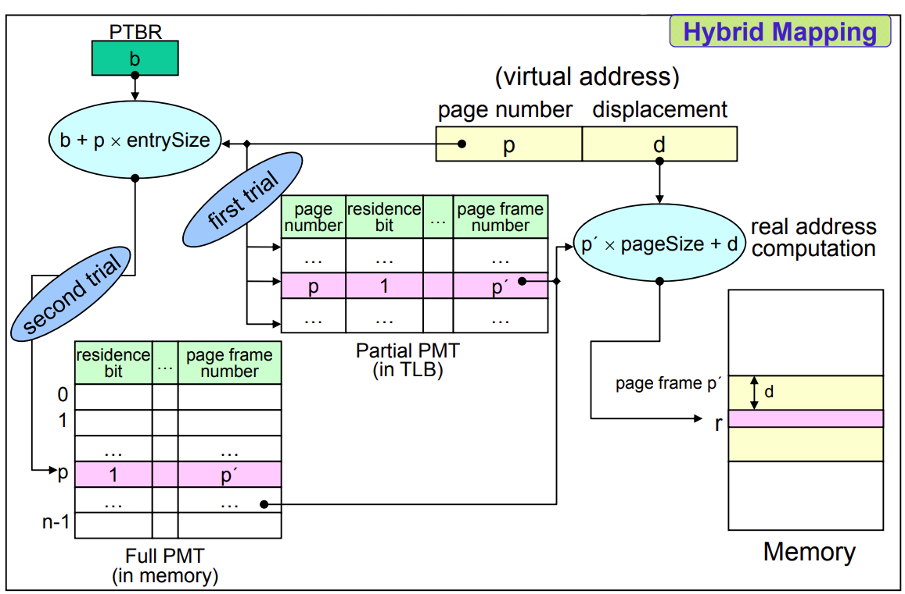
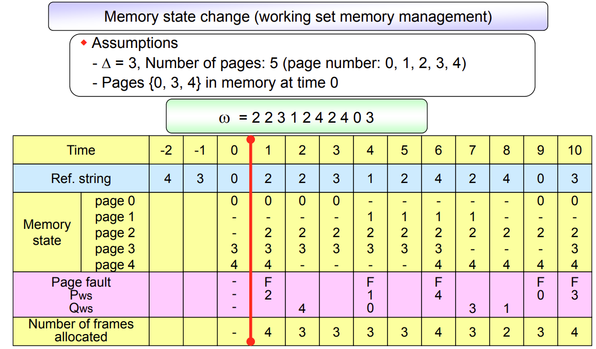

## About Virtual Memory

### Concept

- Execution Process를 온전히 Memory에 Load하지 않고 일부만 하는 것

  일부 Partition은 Execution 중 필요한 것만 Load

### Benefit

- Easier Programming

- Higher Multiprogramming Degree

  Increase CPU Utilization and Throughput

- Less I/O for Loading & Swapping

### Drawback

- Overhead of Address Mapping
- Overhead of Page Fault Handling

## Address Mapping

### Contiguous Allocation

- Relative Address
- Relocation

### Noncontiguous Allocation

- Transformation At Run-time from Virtual Address to Read Address

### Block Mapping

- Partition Program into Blocks

- Virtual Address $v=(b, d)$

  

  - Block Number $b$
  - Displacement in a Block $d$

- Need BMT, Block Map Table

  

  - One BMT for Each Process

- Procedure Example

  

  1. Access BMT of Process

  2. Find Entry for block $b$ in BMT

  3. Check Residence Bit of Entry

     1. Residence Bit == 0

        - Page Fault

        - Context Switching

          Load Block from Swap Device

     2. Residence Bit == 1

        - Extract Read Address from Entry

  4. Compose Real Address $r$

  5. Access Memory with Read Address $r$

## Demand Paging

### Concept

- Partition Program into Same Size Blocks, Pages
- Pre-Partitioned Memory, Page Frames
- During Execution, Load Demanded Pages
- No Logical Partition
- Complex for Sharing & Protection

### PMT, Page Map Table

- PMT for Each Process

### Direct Mapping

- Double Memory Access

  Memory Access를 위해 PMT에 Access

1. Access PTBR, Page Table Base Register of Process

2. Find Entry for Page $p$ in PMT

3. Check Residence Bit of Entry

   1. Residence Bit == 0

      - Page Fault

      - Context Switching

        Load Page into Memory from Swap Device

      - Update PMT

   2. Residence Bit == 1

      - Extract Page Frame Number $p'$ from Entry

4. Compose Read Address $r$ with Page Frame Number $p'$ and Displacement $d$

5. Access Memory with Read Address $r$

### Associative Mapping

- TLB, Translation Lock-aside Buffer
- Low Overhead, but Expensive HW

### Hybrid Direct / Associative Mapping

- Small TLB
  - Full PMT in Memory Kernel Space
  - Subset of PMT in TLB

### Issue

- Sharable Data Page

  

- Sharable Procedure Page

  

  

- Page Fault Handling

  Machine Instruction은 Atomic하기 때문에 중간에 Block될 경우 다음 Instruction을 실행하게 됨

  그러나 Page Fault의 경우 로직에 실질적인 문제가 아니므로, 이후 Instruction을 재실행시켜야 함

## Segmentation

### Concept

- Partition Program into Logical Blocks with Different Size
- Easy Segment Sharing & Protection
- Larger Overhead

### SMT, Segment Map Table

- Segment Length

  Block Size가 다를 수 있기 때문에 필요

- Protection Bits

  Logical Partition이기 때문에 필요

### Direct Mapping

1. Access SMT Base Address of Process
2. Find Entry for Segment $s$ in SMT
3. Check Followings
   1. Residence Bit == 0
      - Segment Fault
      - Load Segment from Swap Device
      - Update SMT
   2. $d>l_s$
      - Segment Overflow Exception
   3. Violate Protection Policy
      - Segment Protection Exception
4. Extract Real Address $r$ of Segment $a_s$ and Displacement $d$
5. Access Memory with Read Address $r$

## Hybrid Paging / Segmentation

### Concept

- Partition Program into Logical Segments
- Partition Segment into Pages

### SMT and PMT

- SMT

  

  - No Residence Bit Field

- PMT

  

- Tables

  

  - One SMT for Each Process
  - One PMT for Each Segment

### Direct Mapping

## Performance Improvement

### Locality

- Temporal Locality

  

- Spatial Locality

  

### Cost Model

- Purpose

  Designed to Reduce Number of Page Faults

- Goal

  Reduce of Context Switching Overhead or Kernel Intervention Overhead

### Page Reference Model

- Sequence of Referenced Page Numbers in Execution

  $\omega=r_1 r_2 \cdots r_i \cdots r_T$

  - Page Number $r_i$
  - Total Number of Memory Access $T$

### HW Components

- Address Translation Device

  - Dedicated PTBR, Page Table Base Register
  - Cache Memory
  - TLB, Translation Lock-aside Buffer

- Bit Vectors

  

  - Reference Bits

    

    - 특정 주기마다 모든 Bit를 Reset 함

  - Update Bits

    - 주기적인 Reset 과정 없음
    - Necessary Write-Back to Disk

### SW Components

- Allocation Strategies

  - How Much Space to Allocate

    - Fixed Allocation

    - Variable Allocation

  - Consideration
    - If Too Much Allocation, Memory Waste
    - If Too Small Allocation, Increase of Page Fault Rate

- Fetch Strategies

  - When to Bring a Page

    - Demand Fetch

      Page Fault Overhead 발생

    - Anticipatory Fetch

      Prediction Overhead 발생

- Placement Strategies

  - Where to Place Incoming Page
    - First-Fit
    - Best-Fit
    - Worst-Fit
    - Next-Fit

- Replacement Strategies

  - Which Victim to Displace for Incoming Page

    - Local Fixed Allocation

      Victim from Only its Own Set of Allocated Frames

    - Global Variable Allocation

      Victim from Set of All Frames

- Cleaning Strategies

  - When to Write-Back Updated Page
    - Demand Cleaning
    - Anticipatory Cleaning

- Load Control Strategies

  - How many Multiprogramming Degree

  

  - Underloaded

    System Resource Waste & Performance Degradation

  - Overloaded

    System Resource Contention & Performance Degradation

  - Thrashing

    Excessive Paging Activity

## Page Replacement Strategy

### MIN Algorithm

- Local Fixed Allocation

- Scheme

  Select Victim will not be Used for Longest Period of Time

- Process Reference String is Known a priori

- Use for Performance Measurement Tool

### Random Algorithm

- Local Fixed Allocation

- Scheme

  Select Victim Randomly

- Low Overhead

### FIFO, First In First Out Algorithm

- Local Fixed Allocation

- Scheme

  Select Victim for Oldest Page

- Replace Frequently Used Page 상황 가능

- Require Timestamping

- FIFO Anomaly

  

  더 많은 Memory Frame이더라도 Page Fault Frequency가 여전히 증가하는 현상

### LRU, Least Recently Used Algorithm

- Local Fixed Allocation

- Scheme

  Select Victim which Has Not Been Used for Longest Period of Time

- Based on Program Locality

- Require Timestamping

- Executing Large Loop with Insufficient Allocated Memory, Increase Steeply Page Faults

  

### LFU, Least Frequently Used Algorithm

- Local Fixed Allocation

- Scheme

  Select Victim with Smallest Reference Counts

- Less Overhead than LRU

- Replace Recently Loaded Page 상황 가능

- Require Reference Count

### NUR, Not Used Recently Algorithm

- Local Fixed Allocation

- Scheme

  Select Victim in Following Order

  Reference Bit $r$, Update Bit $m$

  1. $(r, m)=(0, 0)$
  2. $(r, m)=(0, 1)$
  3. $(r, m)=(1, 0)$
  4. $(r, m)=(1, 1)$

- Use Bit Vectors

  - Reference Bits
  - Update Bits

- Low Overhead than LRU

### Clock Algorithm

- Local Fixed Allocation
- Scheme
  1. Check Reference Bit $r$ of Pointer
  2. If $r==0$, Select Page as a Victim
  3. If $r==1$, Reset $r$ & Advance Pointer Clockwise & Go to Step 1
- Use Reference Bits without Periodical Reset

### Enhanced Clock Algorithm

- Local Fixed Allocation
- Scheme
  1. Check $(r, m)$ of Pointer
  2. If $(0, 0)$, Select Page as a Victim & Advance Pointer
  3. If $(0, 1)$, Set to $(0, 0)$ & Put Page on Cleaning List & Advance Pointer & Go to Step 1
  4. If $(1, 0)$, Set to $(0, 0)$ & Advance Pointer & Go to Step 1
  5. If $(1, 1)$, Set to $(0, 1) & Advance Pointer & Go to Step 1

### Working Set Algorithm

- Global Variable Allocation

- Scheme

  Let Working Set to Reside in Memory Every Time

- Based on Locality

- Overhead for Update Residence Set for Every Page Reference

  Update Residence Set is Independent of Page Faults

## Other Consideration

### Page Size

- General Page Size

  $2^7 \ (128)$ Bytes ~ $2^{22} \ (4M)$ Bytes

- Smaller Page Size

  - Smaller Internal Fragmentation
  - Match Locality More Accurately
  - Larger Page Table
  - Increase I/O Time
  - Increase Number of Page Faults

### Program Restructuring

- Aware Paged Nature of Memory or Demand Paging System
- By User or Compiler / Linker / Loader

### TLB Hit-Ratio

- TLB Reach $(Number \ of \ Entries) * (Page \ Size)$

- Increase Hit-Ratio

  - Increase TLB Size

    Expensive

  - Increase Page Size
