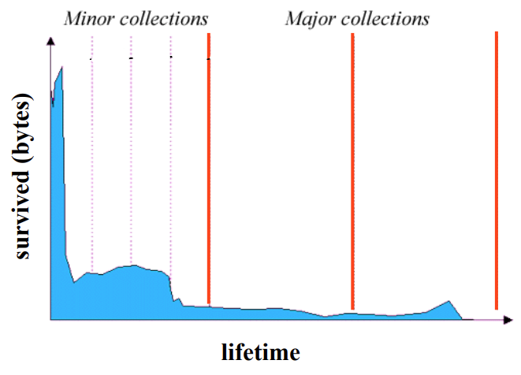

## Goal

- Primary

  - Good Time Performance

    메모리를 할당하고 반환하는 데에 Constant 혹은 Linear Time 소요를 목표로 함

  - Good Space Utilization

    Fragmentation 최소화를 목표로 함

- Others

  - Good Locality Properties

    주로 같이 접근하거나 유사한 Object에 대해 서로 근처의 메모리 주소에 할당함을 목표로 함

  - Robust

    특정 메모리 주소에 대해 현재 사용 중인지 혹은 반환되었는 지 등을 확인할 수 있음을 목표로 함

## Internal Fragmentation

- Block 크기와 Payload 크기 간의 차이로 인해 발생

  - 메모리 요청 크기보다 큰 Block이 할당되어 낭비가 발생하거나, 해제된 메모리 블록이 연속적으로 배치되지 않아 작은 여러 공간에 흩어질 수 있음

  - 메모리 할당 정책에 따라 일어날 수 있음

    예를 들어 Best Fir 정책의 경우 작은 메모리 공간도 활용하려다 보니 작은 조각들이 쌓여서 내부 단편화를 유발할 수 있음

  - 메모리 Alignment를 위해 Padding이 필요하여 일어날 수 있음

- 직전의 요청 패턴에 따라 내부 단편화 발생을 알아챌 수 있기 때문에 핸들링하기 비교적 쉬움

## External Fragmentation

- 전체 Heap 메모리에는 여유 공간이 있지만, 연속적으로 할당가능한 Block이 없는 경우를 가리킴
- 미래의 메모리 요청에 따라 외부 단편화 발생 여부가 결정되기 때문에 예측 및 핸들링하기 어려움

### How Much to Free

- 가장 스탠다드한 방법은 Block 앞에 Block의 길이를 기록해두는 방안

  추가로 필요한 Word를 Header라고 부름

### Which Blocks can be Free

#### Implicit List

- 각 Block에 대해 할당 여부를 확인할 수 있어야 하므로, Block 크기를 기록하는 Word에 1 Bit를 사용해서 나타냄

  

  - Block 크기가 항상 $2^n$이라면 마지막 1 Bit는 사용되지 않기 때문에 이를 활용
  - $a$ 값이 1이면 할당된 Block임을, 0이면 반환된 Block임을 나타냄
  - Forward / Backward 방향으로 List를 순회하기 위해 Header와 Footer 모두 존재

- 각 Block을 확인해가며 반환된 곳을 찾아냄

  - First Fit Policy
    - 맨 앞에서부터 Block에 접근하며 요청에 맞는 공간을 찾아냄
    - Linear Time 소요
    - List의 앞부분을 우선으로 할당하기 때문에 공간이 잘게 쪼개지는 현상 (Splinters) 이 발생
  - Next Fit Policy
    - First Fit Policy와 유사하나, 이전의 탐색 위치에서 시작하여 요청에 맞는 공간을 찾아냄
    - Splinters 현상을 피할 수 있음
  - Best Fit Policy
    - 요청 크기에 가장 근접한 공간을 찾아냄
    - 일반적으로 First Fit Policy보다 더 많은 시간이 소요됨
    - Fragment를 최소화할 수 있음

#### Explicit List

- 반환된 Block끼리만 연결하여 리스트가 구성됨

  주로 Doubly Linked List 구조

- Block을 잇는 Link는 꼭 메모리 주소 순서대로 가리켜야 하는 것은 아님

  - LIFO (Last In First Out) Policy
    - 반환된 Block을 List 가장 앞부분에 삽입
    - Address-Ordered Policy 보다 Fragmentation 현상이 더 많이 발생함
  - Address-Ordered Policy
    - 반환된 Block을 메모리 주소 순서대로 삽입
    - LIFO Policy 보다 Fragmentation 현상이 덜 발생함

#### Segregated List

- Block 크기에 따라 구분지어 리스트가 구성됨
  - 작은 크기에 대해서는 각각의 그룹이 존재
  - 큰 크기에 대해서는 $2^n$ 그룹이 존재

## Garbage Collection

### Intro

- 프로그램 실행에 필요한 Value들은 컴퓨터의 물리적 메모리에 보관되며, 이 메모리는 한정된 자원
- 따라서 메모리는 잘 관리 및 재활용할 수 있어야 함
- GC는 프로그램 관점에서 더 이상 필요없는 메모리를 식별해내어 재활용해내는 시스템

### Liveness

- Root Set

  - Global Variables
  - Local Variables
  - Registers Used by Active Procedures

- Live Objects

  - Object Graph에서 Directed Path가 존재하는 Object

    

### Phases

1. Garbage Detection
2. Reclamation Garbage Storage

## GC Methods

### Reference Counting

- 각 Record에 대해 자신을 가리키는 포인터가 몇 개인지 기록해놓는 방법

- 사이클이 형성되는 경우 Reclaim에 실패할 수 있음

  

### Mark-Sweep Collection

1. Garbage Detection Phase

   포인터 관계를 나타내는 그래프를 순회하며 Reachable Object들을 표시함 (Mark)

2. Reclamation Phase

   표시되지 않은 Object들을 반환함 (Sweep)

- Problems
  - Fragmentation 현상 발생 가능
  - Heap 크기에 따라 Collection 비용이 크게 증가할 수 있음
  - Reference Locality가 낮음

### Mark-Compact Collection

- Mark-Sweep Collection의 Detection 단계는 유사함
- Live Object를 연속적인 메모리 공간으로 이동하는 과정을 추가로 거침 (Compact)
- 일반적으로 Mark-Sweep 방식보다 느림

### Copying Collection

- Heap 공간을 인접한 두 개의 Semi Spaces로 나눔
- Live Object를 구분된 Space로 이동
  - Object Traversal 과 Copying Process 동시 진행

## Incremental Tracing Collection

- 프로그램 실행 중 Interleaved GC
- Real-Time 애플리케이션에 적합
- Mark-Sweep Collection 혹은 Copying Collection은 Incremental로 가능
- Difficulties
  - Tracing Reachable Object이 프로그램 실행 중에 따라 Graph가 변동될 수 있음

## Generational Collection

- Infant Mortality

  - 대부분의 Object는 수명이 길지 않음

    따라서 전체 Heap 공간을 매번 Mark 하는 것은 효율적이지 않음

- Old Object는 수명이 긴 경우가 많으므로, 매번 반복적인 Collection 과정을 거치지 않고 Young Object를 집중적으로 핸들링함

