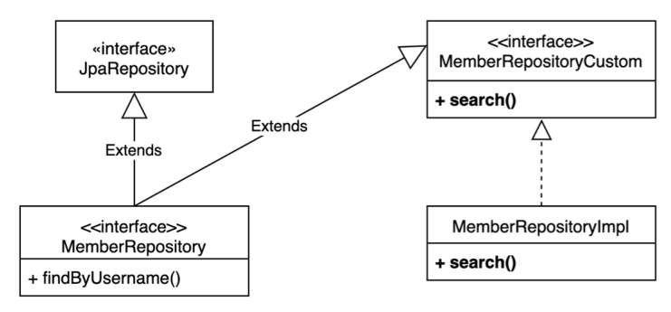

# QueryDSL 강의 정리


## 프로젝트 환경 설정

[스프링 부트 스타터](https://start.spring.io)를 이용해서 Gradle 프로젝트를 만들자.


### Querydsl 설정과 검증

```gradle
plugins {
    id 'org.springframework.boot' version '2.5.0'
    id 'io.spring.dependency-management' version '1.0.11.RELEASE'

    // querydsl 추가 시작
    id "com.ewerk.gradle.plugins.querydsl" version "1.0.10"
    // querydsl 추가 끝

    id 'java'
}

group = 'study'
version = '0.0.1-SNAPSHOT'
sourceCompatibility = '11'

configurations {
    compileOnly {
        extendsFrom annotationProcessor
    }
}

repositories {
    mavenCentral()
}

dependencies {
    implementation 'org.springframework.boot:spring-boot-starter-data-jpa'
    implementation 'org.springframework.boot:spring-boot-starter-web'

    // querydsl 추가 시작
    implementation 'com.querydsl:querydsl-jpa'
    // querydsl 추가 끝

    // SQL 실행 파라미터 로그 기능 추가 시작
    implementation 'com.github.gavlyukovskiy:p6spy-spring-boot-starter:1.5.8'
    // SQL 실행 파라미터 로그 기능 추가 끝

    compileOnly 'org.projectlombok:lombok'
    runtimeOnly 'com.h2database:h2'
    annotationProcessor 'org.projectlombok:lombok'
    testImplementation 'org.springframework.boot:spring-boot-starter-test'
}

test {
    useJUnitPlatform()
}

// querydsl 설정 추가 시작
def querydslDir = "$buildDir/generated/querydsl"
querydsl {
    jpa = true
    querydslSourcesDir = querydslDir
}
sourceSets {
    main.java.srcDir querydslDir
}
configurations {
    querydsl.extendsFrom compileClasspath
}
compileQuerydsl {
    options.annotationProcessorPath = configurations.querydsl
}
// querydsl 설정 추가 끝

```

먼저 querydsl 플러그인을 추가하고, 의존성을 넣어준다. 그리고 파일 하단에 querydsl 구동 환경 설정을 한다.

그리고 잘 동작하는지 확인하기 위해 검증용 엔티티를 만들어서 확인해보자.

```java
@Entity
@Getter @Setter
public class Hello {

    @Id @GeneratedValue
    private Long id;

}
```

엔티티를 만들고 `Gradle -> Tasks -> other -> compileQuerydsl` 혹은 `Gradle -> Tasks -> build -> clean`를 실행시키면 `build.gradle` 파일에 설정한 querydsl 정보에 맞춰서 Q 타입이 생성된다. 현재 프로젝트에서는 `"$buildDir/generated/querydsl"` 경로에 생성된다.

```java
/**
 * QHello is a Querydsl query type for Hello
 */
@Generated("com.querydsl.codegen.EntitySerializer")
public class QHello extends EntityPathBase<Hello> {

    private static final long serialVersionUID = 1910216155L;

    public static final QHello hello = new QHello("hello");

    public final NumberPath<Long> id = createNumber("id", Long.class);

    public QHello(String variable) {
        super(Hello.class, forVariable(variable));
    }

    public QHello(Path<? extends Hello> path) {
        super(path.getType(), path.getMetadata());
    }

    public QHello(PathMetadata metadata) {
        super(Hello.class, metadata);
    }

}
```

해당 경로를 확인해보면 만들어 놓은 `Hello` 엔티티를 기반으로 Q 타입이 만들어 진 것을 확인할 수 있다.

추가로, 테스트 케이스를 작성해서 실행을 검증해보자.

```java
@SpringBootTest
@Transactional
class QuerydslApplicationTests {
    
    @Autowired
    EntityManager em;

    @Test
    void contextLoads() {
        Hello hello = new Hello();
        em.persist(hello);

        JPAQueryFactory query = new JPAQueryFactory(em);
        QHello qHello = QHello.hello;

        Hello result = query.selectFrom(qHello)
                .fetchOne();

        assertThat(result).isEqualTo(hello);
        assertThat(result.getId()).isEqualTo(hello.getId());
    }

}
```

위처럼 문자 그대로의 JPQL이 아닌, 자바 문법 형식의 Querydsl을 이용해 객체를 가져올 수 있다.


## 예제 도메인 모델


위의 도메인에 맞게 엔티티 클래스를 작성하자.

```java
@Entity
@Getter @Setter
@NoArgsConstructor(access = AccessLevel.PROTECTED)
@ToString(of = {"id", "username", "age"})
public class Member {

    @Id @GeneratedValue
    @Column(name = "member_id")
    private Long id;

    private String username;

    private int age;

    @ManyToOne(fetch = FetchType.LAZY)
    @JoinColumn(name = "team_id")
    private Team team;

    public Member(String username) {
        this(username, 0);
    }

    public Member(String username, int age) {
        this(username, age, null);
    }

    public Member(String username, int age, Team team) {
        this.username = username;
        this.age = age;
        if (team != null) {
            changeTeam(team);
        }
    }

    public void changeTeam(Team team) {
        this.team = team;
        team.getMembers().add(this);
    }

}
```

- `@ToString`을 사용할 때는 연관 관계가 아닌 필드만 적용해야 한다.

  만약 `Team` 필드에 적용한다면, `Team` 엔티티에서 `members` 필드가 있기 때문에 무한 참조가 발생하게 되기 때문이다.

- `changeTeam()`과 같은 연관 관계 편의 메서드를 만들어서 양방향 연관 관계를 한 번에 처리하도록 한다.

```java
@Entity
@Getter @Setter
@NoArgsConstructor(access = AccessLevel.PROTECTED)
@ToString(of = {"id", "name"})
public class Team {

    @Id @GeneratedValue
    @Column(name = "team_id")
    private Long id;

    private String name;

    @OneToMany(mappedBy = "team")
    List<Member> members = new ArrayList<>();

    public Team(String name) {
        this.name = name;
    }

}
```


## 기본 문법


### JPQL 과 Querydsl

```java
@SpringBootTest
@Transactional
public class QuerydslBasicTest {

    @Autowired
    EntityManager em;

    JPAQueryFactory queryFactory;
    
    @BeforeEach
    public void before() {
        /* ... */
    }
    
    @Test
    public void startJPQL() {
        String jpqlString = "select m from Member m where m.username = :username";
        Member findMember = em.createQuery(jpqlString, Member.class)
                .setParameter("username", "member1")
                .getSingleResult();

        assertThat(findMember.getUsername()).isEqualTo("member1");
    }

    @Test
    public void startQuerydsl() {
        QMember m = new QMember("m");
        Member findMember = queryFactory
                .select(m)
                .from(m)
                .where(m.username.eq("member1"))
                .fetchOne();

        assertThat(findMember.getUsername()).isEqualTo("member1");
    }
    
}
```

- Querydsl는 JPQL의 빌더 역할을 해준다.

  JPQL의 경우, 문자 그대로이므로 런타임 오류가 발생하며 파라미터 바인딩을 직접해야 한다.

  Querydsl의 경우, 자바 코드이므로 컴파일 시점 오류가 발생하며 파라미터 바인딩을 자동으로 처리해준다.

- Q-Type를 이용해서 Querydsl 쿼리를 빌드한다.

  Q-Type 생성할 때는 alias가 필요하다.

- `JPAQueryFactory`를 클래스의 필드로 제공하더라도 동시성 문제는 발생하지 않는다.

  애초에 `EntityManager`가 쓰레드에 안전한 클래스이기 때문에 여러 트랜잭션이 발생하더라도 별도의 영속성 컨텍스트가 제공되어 동시성 문제가 일어나지 않는다.

```java
spring.jpa.properties.hibernate.use_sql_comments: true
```

- 추가로, 위의 설정을 추가하면 실행되는 JPQL을 볼 수 있다.


### Q-Type 활용

```java
QMember qMember = new QMember("m");	//별칭 직접 지정
QMember qMember = QMember.member;	//기본 인스턴스 사용
```

- 두가지 방법으로 Q-Type을 활용할 수 있다.
- 같은 테이블을 조인해서 쿼리를 날리는 경우, 즉 서로 다른 alias를 설정하여 테이블 구분이 필요한 경우가 아니라면 기본 인스턴스를 사용해서 코드를 깔끔히 하는 편이 좋다.


### 검색 조건 쿼리

```java
@Test
public void search() {
    Member findMember = queryFactory
            .selectFrom(member)
            .where(member.username.eq("member1")
                    .and(member.age.eq(10)))
            .fetchOne();

    assertThat(findMember.getUsername()).isEqualTo("member1");
}
```

- 검색 조건은 `and()`, `or()` 등을 메서드 체인으로 연결 가능하다.
- `select()`와 `from()`의 대상이 같은 경우 `selectFrom()`으로 합쳐 사용할 수 있다.

```java
member.username.eq("member1") // username = 'member1'
member.username.ne("member1") //username != 'member1'
member.username.eq("member1").not() // username != 'member1'
    
member.username.isNotNull() //이름이 is not null
    
member.age.in(10, 20) // age in (10,20)
member.age.notIn(10, 20) // age not in (10, 20)
member.age.between(10,30) //between 10, 30
    
member.age.goe(30) // age >= 30
member.age.gt(30) // age > 30
member.age.loe(30) // age <= 30
member.age.lt(30) // age < 30
    
member.username.like("member%") //like 검색
member.username.contains("member") // like ‘%member%’ 검색
member.username.startsWith("member") //like ‘member%’ 검색
...
```

- JPQL이 제공하는 모든 검색 조건을 제공한다.

```java
@Test
public void searchWithParam() {
    List<Member> result = queryFactory
            .selectFrom(member)
            .where(
                    member.username.eq("member1"),
                    member.age.eq(10)
            )
            .fetch();

    assertThat(result.size()).isEqualTo(1);
}
```

- `where()`에 파라미터로 검색 조건을 추가하면 `AND` 조건이 추가된다.

  이 경우, 파라미터의 값이 `null`이면 자동으로 무시한다. 이를 이용해서 동적 쿼리를 깔끔하게 만들 수 있다.


### 결과 조회

```java
@Test
public void resultFetch() {
    List<Member> fetch = queryFactory
            .selectFrom(member)
            .fetch();

    Member fetchOne = queryFactory
            .selectFrom(member)
            .where(member.username.eq("member1"))
            .fetchOne();

    Member fetchFirst = queryFactory
            .selectFrom(member)
            .fetchFirst();

    QueryResults<Member> fetchResults = queryFactory
            .selectFrom(member)
            .fetchResults();

    long fetchCount = queryFactory
            .selectFrom(member)
            .fetchCount();
}
```

- `fetch()`

  리스트로 조회한다. 데이터가 없다면 빈 리스트를 반환한다.

- `fetchOne()`

  단 건을 조회한다.

  결과가 없다면 `null`을 반환하며, 두 건 이상이면 `NonUniqueResultException`이 발생한다.

- `fetchFirest()`

  `limit(1).fetchOne()`과 동일하다.

- `fetchResults()`

  페이징 정보를 포함해서 조회한다.

  `total count` 쿼리를 추가 실행해서, 두 번의 쿼리가 발생한다.

- `fetchCount()`

  `count` 쿼리로 변경해서 `count` 수를 조회한다.


### 정렬

```java
@Test
public void sort() {
    em.persist(new Member(null, 100));
    em.persist(new Member("member5", 100));
    em.persist(new Member("member6", 100));

    List<Member> result = queryFactory
            .selectFrom(member)
            .where(member.age.eq(100))
            .orderBy(member.age.desc(), member.username.asc().nullsLast())
            .fetch();

    Member member5 = result.get(0);
    Member member6 = result.get(1);
    Member memberNull = result.get(2);

    assertThat(member5.getUsername()).isEqualTo("member5");
    assertThat(member6.getUsername()).isEqualTo("member6");
    assertThat(memberNull.getUsername()).isNull();
}
```

- `nullsFirst()`, `nullsLast()`등으로 `null`값인 경우에 대한 정렬 조건을 명시한다.


### 페이징

```java
@Test
public void paging1() {
    List<Member> result = queryFactory
            .selectFrom(member)
            .orderBy(member.username.desc())
            .offset(1)
            .limit(2)
            .fetch();

    assertThat(result.size()).isEqualTo(2);
}
```

- `offset`를 설정해서 스킵할 데이터를 설정한다. `offset` 값은 0부터 시작한다.
- `limit`를 설정해서 조회할 건 수를 설정한다.

```java
@Test
public void paging2() {
    QueryResults<Member> queryResults = queryFactory
            .selectFrom(member)
            .orderBy(member.username.desc())
            .offset(1)
            .limit(2)
            .fetchResults();

    assertThat(queryResults.getTotal()).isEqualTo(4);
    assertThat(queryResults.getLimit()).isEqualTo(2);
    assertThat(queryResults.getOffset()).isEqualTo(1);
    assertThat(queryResults.getResults().size()).isEqualTo(2);
}
```

- 전체 조회 수가 필요하다면 위처럼 쿼리를 작성할 수 있다.

- 다만, 추가적인 `count` 쿼리가 실행되어 성능을 저하시킬 수 있다.

  실무에서 페이징 쿼리를 작성할 때, 데이터를 조회하는 쿼리는 여러 테이블을 조인해야 하지만 `count` 쿼리를 조인이 필요 없는 경우도 있다. 그런데 이렇게 자동화된 `count` 쿼리는 원본 쿼리와 동일하게 모두 조인을 해버리기 때문에 성능이 좋지 않을 수 있다. 따라서 단순한 쿼리라면 문제가 없을 수 있지만, `count` 쿼리에 성능 최적화가 필요한 경우라면 별도 쿼리를 작성해야 한다.


### 집합

```java
@Test
public void aggregation() {
    List<Tuple> result = queryFactory
            .select(
                    member.count(),
                    member.age.sum(),
                    member.age.avg(),
                    member.age.max(),
                    member.age.min()
            )
            .from(member)
            .fetch();

    Tuple tuple = result.get(0);

    assertThat(tuple.get(member.count())).isEqualTo(4);
    assertThat(tuple.get(member.age.sum())).isEqualTo(100);
    assertThat(tuple.get(member.age.avg())).isEqualTo(25);
    assertThat(tuple.get(member.age.max())).isEqualTo(40);
    assertThat(tuple.get(member.age.min())).isEqualTo(10);
}
```

- JPQL이 제공하는모든 집합 함수를 제공한다.

```java
@Test
public void group() {
    List<Tuple> result = queryFactory
            .select(team.name, member.age.avg())
            .from(member)
            .join(member.team, team)
            .groupBy(team.name)
            .having(team.members.isNotEmpty())
            .fetch();

    Tuple teamA = result.get(0);
    Tuple teamB = result.get(1);

    assertThat(teamA.get(team.name)).isEqualTo("teamA");
    assertThat(teamA.get(member.age.avg())).isEqualTo(15);
    assertThat(teamB.get(team.name)).isEqualTo("teamB");
    assertThat(teamB.get(member.age.avg())).isEqualTo(35);
}
```

- 결과를 그룹화 하는 `groupBy()`와 그룹화된 결과를 제한하는 `having()`절 또한 제공한다.


### Join - 기본

```sql
join(조인 대상, 별칭으로 사용할 Q타입)
```

- `join()`의 기본 문법은 첫 번째 파라미터에 `join` 대상을 지정하고, 두 번째 파라미터에 alias으로 사용할 Q-Type을 지정하면 된다.

```java
@Test
public void join() {
    QMember member = QMember.member;
    QTeam team = QTeam.team;

    List<Member> result = queryFactory
            .selectFrom(member)
            .join(member.team, team)
            .where(team.name.eq("teamA"))
            .fetch();

    assertThat(result)
            .extracting("username")
            .containsExactly("member1", "member2");
}
```

- `join()`, `innerJoin()`

  내부 조인을 수행한다. 위의 둘은 동일하게 작동한다.

- `leftJoin()`

  left 외부 조인을 수행한다.

- `rightJoin()`

  right 외부 조인을 수행한다.

- JPQL의 `on`과 성능 최적화를 위한 `fetchJoin`을 제공한다.

```java
@Test
public void thetaJoin() {
    em.persist(new Member("teamA"));
    em.persist(new Member("teamB"));

    List<Member> result = queryFactory
            .select(member)
            .from(member, team)
            .where(member.username.eq(team.name))
            .fetch();

    assertThat(result)
            .extracting("username")
            .containsExactly("teamA", "teamB");
}
```

- 연관 관계가 없는 필드로 조인하는 세타 조인

- `from` 절에 여러 엔티티를 선택해서 세터 조인을 수행한다.

- 기본적으로는 외부 조인이 불가능하다.

  `join`의 `on`절을 사용하면 가능해진다.


### Join - On 절

```java
@Test
public void joinOnFiltering() {
    /*
     * JPQL: SELECT m, t FROM Member m LEFT JOIN m.team t on t.name = 'teamA'
     * SQL: SELECT m.*, t.* FROM Member m LEFT JOIN Team t ON m.TEAM_ID=t.id and t.name='teamA'
     */
    List<Tuple> result = queryFactory
            .select(member, team)
            .from(member)
            .leftJoin(member.team, team).on(team.name.eq("teamA"))
            .fetch();

    for (Tuple tuple : result) {
        System.out.println("tuple = " + tuple);
    }
}
```

```
[결과]
t=[Member(id=3, username=member1, age=10), Team(id=1, name=teamA)]
t=[Member(id=4, username=member2, age=20), Team(id=1, name=teamA)]
t=[Member(id=5, username=member3, age=30), null]
t=[Member(id=6, username=member4, age=40), null]
```

- `on`을 활용한 조인 대상 필터링
- 만약 외부 조인이 아니라 내부 조인을 사용하면 `where`절에서 필터링하는 것과 기능이 동일하다. 따라서 `on`절을 활용한 조인 대상 필터링을 사용할 때, 내부 조인이면 익숙한 `where` 절로 해결하고, 정말 외부 조인이 필요한 경우에만 이 기능을 사용하는 편이 좋다.

```java
@Test
public void joinOnNoRelation() {
    /*
     * JPQL: SELECT m, t FROM Member m LEFT JOIN Team t on m.username = t.name
     * SQL: SELECT m.*, t.* FROM Member m LEFT JOIN Team t ON m.username = t.name
     */
    em.persist(new Member("teamA"));
    em.persist(new Member("teamB"));

    List<Tuple> result = queryFactory
            .select(member, team)
            .from(member)
            .leftJoin(team).on(member.username.eq(team.name))
            .fetch();

    for (Tuple tuple : result) {
        System.out.println("tuple = " + tuple);
    }
}
```

```
[결과]
t=[Member(id=3, username=member1, age=10), null]
t=[Member(id=4, username=member2, age=20), null]
t=[Member(id=5, username=member3, age=30), null]
t=[Member(id=6, username=member4, age=40), null]
t=[Member(id=7, username=teamA, age=0), Team(id=1, name=teamA)]
t=[Member(id=8, username=teamB, age=0), Team(id=2, name=teamB)]
```

- `on`을 활용한 연관 관계없는 엔티티 외부 조인
- 일반 조인과는 다르게 `leftJoin()` 부분에 엔티티가 하나만 들어간다.


### Join - Fetch Join

페치 조인은 SQL에서 제공하는 기능은 아니다. SQL Join을 활용해서 연관된 엔티티를 SQL 한 번에 조회하는 기능이다. 주로 성능 최적화에 사용하는 방법이다.

```java
@Test
public void fetchJoinNonUse() {
    em.flush();
    em.clear();

    Member findMember = queryFactory
            .selectFrom(member)
            .where(member.username.eq("member1"))
            .fetchOne();

    boolean loaded = emf.getPersistenceUnitUtil().isLoaded(findMember.getTeam());

    assertThat(loaded).as("페치 조인 미적용").isFalse();
}
```

- 페치 조인을 미적용한 경우로, Lazy Loading으로 `Member`, `Team` SQL 쿼리가 각각 실행된다.

```java
@Test
public void fetchJoinUse() {
    em.flush();
    em.clear();

    Member findMember = queryFactory
            .selectFrom(member)
            .join(member.team, team).fetchJoin()
            .where(member.username.eq("member1"))
            .fetchOne();

    boolean loaded = emf.getPersistenceUnitUtil().isLoaded(findMember.getTeam());

    assertThat(loaded).as("페치 조인 적용").isTrue();
}
```

- 페치 조인을 적용한 경우로, Eager Loading으로 `Member`, `Team` SQL 쿼리 조인으로 한 번에 조회한다.
- `join()`, `leftJoin()` 등 조인 기능 뒤에 `fetchJoin()`을 추가하면 사용할 수 있다.


### 서브 쿼리

```java
@Test
public void subQuery() {
    QMember memberSub = new QMember("memberSub");

    List<Member> result = queryFactory
            .selectFrom(member)
            .where(member.age.eq(
                    JPAExpressions
                            .select(memberSub.age.max())
                            .from(memberSub)
            ))
            .fetch();

    assertThat(result)
            .extracting("age")
            .containsExactly(40);
}
```

- `where` 절의 `eq()` 내에 `JPAExpressions`를 활용해 서브 쿼리를 넣은 경우
- 서브 쿼리에서 같은 엔티티 alias를 쓰면 충돌이 발생하므로 별도의 Q-Type을 사용한다.

```java
@Test
public void subQueryGoe() {
    QMember memberSub = new QMember("memberSub");

    List<Member> result = queryFactory
            .selectFrom(member)
            .where(member.age.goe(
                    JPAExpressions
                            .select(memberSub.age.avg())
                            .from(memberSub)
            ))
            .fetch();

    assertThat(result)
            .extracting("age")
            .containsExactly(30, 40);
}
```

- `where` 절의 `goe()` 내에 `JPAExpressions`를 활용해 서브 쿼리를 넣은 경우

```java
@Test
public void subQueryIn() {
    QMember memberSub = new QMember("memberSub");

    List<Member> result = queryFactory
            .selectFrom(member)
            .where(member.age.in(
                    JPAExpressions
                            .select(memberSub.age)
                            .from(memberSub)
                            .where(memberSub.age.gt(10))
            ))
            .fetch();

    assertThat(result)
            .extracting("age")
            .containsExactly(20, 30, 40);
}
```

- `where` 절의 `in()` 내에 `JPAExpressions`를 활용해 서브 쿼리를 넣은 경우
- 서브 쿼리 여러 건을 처리할 수 있다.

```java
@Test
public void selectSubQuery() {
    QMember memberSub = new QMember("memberSub");

    List<Tuple> result = queryFactory
            .select(
                    member.username,
                    JPAExpressions
                            .select(memberSub.age.avg())
                            .from(memberSub)
            ).from(member)
            .fetch();

    for (Tuple tuple : result) {
        System.out.println("username = " + tuple.get(member.username));
        System.out.println("age = " + tuple.get(JPAExpressions.select(memberSub.age.avg())
                        .from(memberSub)));
    }
}
```

- `select` 절 내에 `JPAExpressions`를 활용해 서브 쿼리를 넣은 경우

하이버네이트 구현체를 사용하면 `select` 절의 서브 쿼리는 지원한다. 하지만 JPA JPQL 서브 쿼리의 한계점으로 `from` 절의 서브 쿼리 (인리인 뷰) 는 지원하지 않는다. 따라서 다음의 우선 순위대로 방안을 시도해봐야 한다.

1. 서브 쿼리를 `join`으로 변경한다. (대부분의 경우 가능하지만, 불가능한 상황도 있다.)
2. 애플리케이션에서 쿼리를 2번 분리해서 실행한다.
3. Native SQL을 사용한다.


### Case 문

```java
@Test
public void caseSimple() {
    List<String> result = queryFactory
            .select(member.age
                    .when(10).then("열살")
                    .when(20).then("스무살")
                    .otherwise("기타"))
            .from(member)
            .fetch();

    for (String s : result) {
        System.out.println("s = " + s);
    }
}
```

- `when().then()`을 활용해 case 처리 가능하다.

```java
@Test
public void caseComplicate() {
    List<String> result = queryFactory
            .select(new CaseBuilder()
                    .when(member.age.between(0, 20)).then("0~20살")
                    .when(member.age.between(21, 30)).then("21~30살")
                    .otherwise("기타"))
            .from(member)
            .fetch();

    for (String s : result) {
        System.out.println("s = " + s);
    }
}
```

- 조금 복잡한 case의 경우 `CaseBuilder`를 활용해 표현한다.

```java
@Test
public void caseWithOrderBy() {
    NumberExpression<Integer> rankPath = new CaseBuilder()
            .when(member.age.between(0, 20)).then(2)
            .when(member.age.between(21, 30)).then(1)
            .otherwise(3);

    List<Tuple> result = queryFactory
            .select(member.username, member.age, rankPath)
            .from(member)
            .orderBy(rankPath.desc())
            .fetch();

    for (Tuple tuple : result) {
        String username = tuple.get(member.username);
        Integer age = tuple.get(member.age);
        Integer rank = tuple.get(rankPath);
        System.out.println("username = " + username + " age = " + age + " rank = " + rank);
    }
}
```

```
[결과]
username = member4 age = 40 rank = 3
username = member1 age = 10 rank = 2
username = member2 age = 20 rank = 2
username = member3 age = 30 rank = 1
```

- Querydsl은 자바 코드로 작성하기 때문에 `rankPath`처럼 복잡한 조건을 변수로 선언해서 `select` 절, `orderBy` 절에서 함께 사용할 수 있다.


### 상수, 문자 더하기

```java
@Test
public void constant() {
    Tuple result = queryFactory
            .select(member.username, Expressions.constant("A"))
            .from(member)
            .fetchFirst();

    System.out.println("result = " + result);
}
```

- 상수를 덧붙여 써야해야 한다면, `Expressions.constant()`를 사용한다.

```java
@Test
public void concat() {
    String result = queryFactory
            .select(member.username.concat("_").concat(member.age.stringValue()))
            .from(member)
            .where(member.username.eq("member1"))
            .fetchOne();

    System.out.println("result = " + result);
}
```

- 문자를 덧붙여 써야하는 경우, `concat()`를 활용한다.
- 이때 문자 타입이 아닌 경우 `stringValue()` 등을 이용해 타입 캐스팅이 필요하다. `ENUM` 타입처리할 때 많이 사용한다.


## 중급 문법

### 프로젝션과 결과 반환 - 기본

DB 상에서 프로젝션은 `select` 대상을 지정함을 의미한다.

```java
@Test
public void simpleProjection() {
    List<String> result = queryFactory
            .select(member.username)
            .from(member)
            .fetch();

    System.out.println("result = " + result);
}
```

- 프로젝션 대상이 하나이면 타입을 명확하게 지정할 수 있다.
- 프로젝션 대상이 둘 이상이면 `Tuple`이나 DTO로 조회해야 한다.

```java
@Test
public void tupleProjection() {
    List<Tuple> result = queryFactory
            .select(member.username, member.age)
            .from(member)
            .fetch();

    for (Tuple tuple : result) {
        String username = tuple.get(member.username);
        System.out.println("username = " + username);
        Integer age = tuple.get(member.age);
        System.out.println("age = " + age);
    }
}
```

- 프로젝션 대상이 둘 이상인 경우 `querydsl.core` 패키지에서 제공하는 `Tuple`을 사용할 수 있다.


### 프로젝션과 결과 반환 - DTO 조회

아래의 DTO 형태로 조회하는 경우를 생각해보자.

```java
@Data
public class MemberDto {

    private String username;
    private int age;

    public MemberDto() {
    }

    public MemberDto(String username, int age) {
        this.username = username;
        this.age = age;
    }

}
```

먼저 JPQL에서 DTO 조회하는 코드를 살펴보자.

```java
@Test
public void findDtoByJPQL() {
    List<MemberDto> result = em.createQuery("select new study.querydsl.dto.MemberDto(m.username, m.age) from Member m", MemberDto.class)
            .getResultList();

    for (MemberDto memberDto : result) {
        System.out.println("memberDto = " + memberDto);
    }
}
```

- 쿼리문에서 `new` 명령어를 사용해 조회 가능하다.
- 하지만 DTO의 패키지 명을 적어야 하는 단점이 있으며, 생성자를 활용한 조회만 가능하다.

Querydsl 에서는 3가지 방법을 지원한다.

- 프로퍼티 접근

  ```java
  @Test
  public void findDtoBySetter() {
      List<MemberDto> result = queryFactory
              .select(Projections.bean(MemberDto.class,
                      member.username,
                      member.age))
              .from(member)
              .fetch();
  
      for (MemberDto memberDto : result) {
          System.out.println("memberDto = " + memberDto);
      }
  }
  ```

  `MemberDto`의 기본 생성자로 객체를 생성 후, 동일한 필드명을 가진 파라미터에 한해 `Setter`로 값을 세팅한다.

- 필드 직접 접근

  ```java
  @Test
  public void findDtoByField() {
      List<MemberDto> result = queryFactory
              .select(Projections.fields(MemberDto.class,
                      member.username,
                      member.age))
              .from(member)
              .fetch();
  
      for (MemberDto memberDto : result) {
          System.out.println("memberDto = " + memberDto);
      }
  }
  ```

  `Setter`나 생성자를 사용하지 않고 바로 필드에 값을 주입한다. 역시 필드명이 동일한 파리미터에 한해 동작한다.

- 생성자 사용

  ```java
  @Test
  public void findDtoByConstructor() {
      List<MemberDto> result = queryFactory
              .select(Projections.constructor(MemberDto.class,
                      member.username,
                      member.age))
              .from(member)
              .fetch();
  
      for (MemberDto memberDto : result) {
          System.out.println("memberDto = " + memberDto);
      }
  }
  ```

  `MemberDto`의 생성자를 이용해 객체를 세팅한다. 만약 파라미터에 맞는 생성자가 없는 경우, 런타입 에러가 발생한다.

만약 필드명과 파라미터 명이 다른 경우에는 `as()`를 사용해서 alias를 세팅해주어야 한다. 만약 아래의 `MemberDto`와 필드명이 다른 `UserDto`를 조회한다고 해보자.

```java
@Data
public class UserDto {

    private String name;
    private int age;

    public UserDto() {
    }

    public UserDto(String name, int age) {
        this.name = name;
        this.age = age;
    }

}
```

```java
@Test
public void findUserDto() {
    QMember memberSub = new QMember("memberSub");
    List<UserDto> result = queryFactory
            .select(Projections.fields(UserDto.class,
                    member.username.as("name"),
                    ExpressionUtils.as(
                            JPAExpressions
                                    .select(memberSub.age.max())
                                    .from(memberSub),
                            "age"
                    )))
            .from(member)
            .fetch();

    for (UserDto userDto : result) {
        System.out.println("memberDto = " + userDto);
    }
}
```

- `membe.username.as("name")` 처럼 필드명이 일치하도록 세팅한다.
- `ExpressionUtils.as()` 부분은 특정 값을 DTO 필드에 세팅하려 할 때 이용할 수 있는 방법이다.
- 위와 같이 `as()`는 `Setter`를 통해 DTO를 세팅하는 경우나 필드 주입하는 경우 사용한다. 생성자를 통해 DTO 조회는 필드명과는 관계없이 생성자 파라미터의 순서와 타입을 기준으로 세팅하기 때문이다.


### 프로젝션과 결과 반환 - @QueryProjection

위의 세 가지 방법보다 보다 코드가 깔끔한 방법으로, DTO 생성자와 `@QueryProjection`를 사용하는 방법이 있다.

```java
@Data
public class MemberDto {

    private String username;
    private int age;

    public MemberDto() {
    }

    @QueryProjection
    public MemberDto(String username, int age) {
        this.username = username;
        this.age = age;
    }

}
```

- DTO 생성자에 `@QueryProjection`을 붙이고 그래들에서 `complieQuerydsl`을 하면 `QMemberDto`가 생성되며 그 안에는 `@QueryProjection`이 붙어 있는 생성자에 한해 동일한 생성자가 만들어져 있다.

```java
@Test
public void findDtoByQueryProjection() {
    List<MemberDto> result = queryFactory
            .select(new QMemberDto(member.username, member.age))
            .from(member)
            .fetch();

    for (MemberDto memberDto : result) {
        System.out.println("memberDto = " + memberDto);
    }
}
```

- `QMemberDto`에 만들어져 있는 생성자를 사용해 조회하면 되므로 훨씬 코드가 깔끔하다는 장점이 있으며, 코드를 입력하면서 파라미터 체크가 가능하다.
- 다만 DTO 레이어가 Querydsl 를 의존한다는 점과 DTO 파일까지 Q-Type을 생성해야한다는 단점이 있다.


### 동적 쿼리 - BooleanBuilder 사용

```java
@Test
public void dynamicQueryByBooleanBuilder() {
    String usernameParam = "member1";
    Integer ageParam = 10;

    List<Member> result = searchMember1(usernameParam, ageParam);

    assertThat(result.size()).isEqualTo(1);
}

private List<Member> searchMember1(String usernameCond, Integer ageCond) {
    BooleanBuilder builder = new BooleanBuilder();
    if (usernameCond != null) {
        builder.and(member.username.eq(usernameCond));
    }
    if (ageCond != null) {
        builder.and(member.age.eq(ageCond));
    }
    return queryFactory
            .selectFrom(member)
            .where(builder)
            .fetch();
}
```

- `new BooleanBuilder()`를 이용해 조건에 맞게 `where`절을 조절할 수 있다.


### 동적 쿼리 - Where 다중 파라미터 사용

```java
@Test
public void dynamicQueryByWhereParam() {
    String usernameParam = "member1";
    Integer ageParam = 10;

    List<Member> result = searchMember2(usernameParam, ageParam);

    assertThat(result.size()).isEqualTo(1);
}

private List<Member> searchMember2(String usernameCond, Integer ageCond) {
    return queryFactory
            .selectFrom(member)
            .where(usernameEq(usernameCond), ageEq(ageCond))
            .fetch();
}

private BooleanExpression usernameEq(String usernameCond) {
    return usernameCond != null ? member.username.eq(usernameCond) : null;
}

private BooleanExpression ageEq(Integer ageCond) {
    return ageCond != null ? member.age.eq(ageCond) : null;
}
```

- `where`절에 다중 파라미터를 사용하는 방법이다.
- 이는 `where`절에 `null`값이 들어올 경우 무시하는 특성을 이용한다.
- 메서드를 재사용할 수 있고, 쿼리 자체 가독성이 높아지는 장점이 있다.

더불어 아래처럼 여러 조건들을 조합해 하나의 메서드로 묶을 수도 있다.

```java
private BooleanExpression allEq(String usernameCond, Integer ageCond) {
    return usernameEq(usernameCond).and(ageEq(ageCond));
}
```


### 수정, 삭제 Bulk 연산

```java
@Test
public void bulkUpdate() {
    long count1 = queryFactory
            .update(member)
            .set(member.username, "비회원")
            .where(member.age.lt(28))
            .execute();
    em.flush();
    em.clear();

    List<Member> result1 = queryFactory
            .selectFrom(member)
            .fetch();
    for (Member member : result1) {
        System.out.println("member = " + member);
    }

    long count2 = queryFactory
            .update(member)
            .set(member.age, member.age.add(1))
            .execute();
    em.flush();
    em.clear();

    List<Member> result2 = queryFactory
            .selectFrom(member)
            .fetch();
    for (Member member : result2) {
        System.out.println("member = " + member);
    }
}
```

```java
@Test
public void bulkDelete() {
    long count = queryFactory
            .delete(member)
            .where(member.age.lt(28))
            .execute();
    em.flush();
    em.clear();

    List<Member> result = queryFactory
            .selectFrom(member)
            .fetch();
    for (Member member : result) {
        System.out.println("member = " + member);
    }
}
```

- JPQL 배치와 마찬가지로, Bulk 연산은 영속성 컨텍스트에 있는 엔티티를 무시하고 곧바로 DB에 실행되기 때문에 배치 쿼리를 실행하고 나면 영속성 컨텍스트를 초기화하는 것이 안전하다.


### SQL Function 호출

JPA와 같이 Dialect에 등록된 내용들을 호출할 수 있다. 본 강의에서 사용하는 H2 DB의 경우, `H2Dialect`에서 목록을 살펴볼 수 있다.

```java
@Test
public void sqlFunction() {
    String result1 = queryFactory
            .select(Expressions.stringTemplate(
                    "function('replace', {0}, {1}, {2})",
                    member.username, "member", "M"))
            .from(member)
            .fetchFirst();
    System.out.println("result1 = " + result1);

    String result2 = queryFactory
            .select(member.username)
            .from(member)
            .where(member.username.eq(
                    Expressions.stringTemplate(
                            "function('lower', {0})",
                            member.username
                    )
            ))
            .fetchFirst();
    System.out.println("result2 = " + result2);

    String result3 = queryFactory
            .select(member.username)
            .from(member)
            .where(member.username.eq(member.username.lower()))
            .fetchFirst();
    System.out.println("result3 = " + result3);
}
```

- `Expressions.stringTemplate()` 혹은 `Expressions.numberTemplate()` 등을 통해 SQL Function을 사용할 수 있다.
- `member.username.lower()`처럼 대부분의 Dialect에서 지원하는 Function인 경우 `querydsl.core` 패키지에서 제공한다.


## 순수 JPA 와 Querydsl


### 기본 세팅

```java
@Component
public class MyJPAQueryFactory {

    @Bean
    JPAQueryFactory jpaQueryFactory(EntityManager em) {
        return new JPAQueryFactory(em);
    }

}
```

```java
@Repository
@RequiredArgsConstructor
public class MemberJpaRepository {

    private final EntityManager em;
    private final JPAQueryFactory queryFactory;

    public void save(Member member) {
        em.persist(member);
    }

    public Optional<Member> findById(Long id) {
        Member findMember = em.find(Member.class, id);
        return Optional.ofNullable(findMember);
    }

    public List<Member> findAll() {
        return em.createQuery("select m from Member m", Member.class)
                .getResultList();
    }

    public List<Member> findAllQuerydsl() {
        return queryFactory.selectFrom(member)
                .fetch();
    }

    public List<Member> findByUsername(String username) {
        return em.createQuery("select m from Member m where m.username= :username", Member.class)
                .setParameter("username", username)
                .getResultList();
    }

    public List<Member> findByUsernameQuerydsl(String username) {
        return queryFactory.selectFrom(member)
                .where(member.username.eq(username))
                .fetch();
    }

}
```

- 순수 JPA Repository에 JPQL 방식과 Querydsl 방식 메서드를 구현

- JPAQueryFactory 를 스프링 빈으로 등록하여 주입받도록 구현했다.

  스프링에 의해 EntityManager 가 싱글톤으로 관리되어 동시성 문제가 발생한다고 생각할 수 있지만, 여기서 스프링이 주입해주는 EntityManager 는 사실 실제 엔티티 매니저를 찾아주는 프록시 용도이다. 실제 엔티티 매니저는 트랜잭션 단위로 영속성 컨텍스트를 할당해주기 때문에 동시성 문제는 걱정하지 않아도 된다.

```java
@Test
public void basicTest() {
    Member member = new Member("member1", 10);
    memberJpaRepository.save(member);

    Member findMember = memberJpaRepository.findById(member.getId()).get();
    assertThat(findMember).isEqualTo(member);

    List<Member> result1 = memberJpaRepository.findAll();
    assertThat(result1).containsExactly(member);

    List<Member> result2 = memberJpaRepository.findByUsername("member1");
    assertThat(result2).containsExactly(member);
}
```
```java
@Test
public void basicQuerydslTest() {
    Member member = new Member("member1", 10);
    memberJpaRepository.save(member);

    Member findMember = memberJpaRepository.findById(member.getId()).get();
    assertThat(findMember).isEqualTo(member);

    List<Member> result1 = memberJpaRepository.findAllQuerydsl();
    assertThat(result1).containsExactly(member);

    List<Member> result2 = memberJpaRepository.findByUsernameQuerydsl("member1");
    assertThat(result2).containsExactly(member);
}
```


### Builder 를 사용한 동적 쿼리와 성능 최적화 조회

```java
@Data
public class MemberTeamDto {

    private Long memberId;
    private String username;
    private int age;
    private Long teamId;
    private String teamName;

    @QueryProjection
    public MemberTeamDto(Long memberId, String username, int age, Long teamId, String teamName) {
        this.memberId = memberId;
        this.username = username;
        this.age = age;
        this.teamId = teamId;
        this.teamName = teamName;
    }

}
```

- 조회 용도의 DTO 구현
- `@QueryProjection` 을 사용하므로 Gradle 의 `complieQuerydsl`을 해서 `QMemberTeamDto`를 만들어 놓아야 한다.

```java
@Data
public class MemberSearchCondition {

    private String username;
    private String teamName;
    private Integer ageGoe;
    private Integer ageLoe;

}
```

- 회원 검색 조건 용도의 클래스 구현

```java
@Repository
@RequiredArgsConstructor
public class MemberJpaRepository {
    
    /* ... */
    
    public List<MemberTeamDto> searchByBuilder(MemberSearchCondition condition) {
        BooleanBuilder builder = new BooleanBuilder();
        if (hasText(condition.getUsername())) {
            builder.and(member.username.eq(condition.getUsername()));
        }
        if (hasText(condition.getTeamName())) {
            builder.and(team.name.eq(condition.getTeamName()));
        }
        if (condition.getAgeGoe() != null) {
            builder.and(member.age.goe(condition.getAgeGoe()));
        }
        if (condition.getAgeLoe() != null) {
            builder.and(member.age.loe(condition.getAgeLoe()));
        }

        return queryFactory
                .select(new QMemberTeamDto(
                        member.id,
                        member.username,
                        member.age,
                        team.id,
                        team.name))
                .from(member)
                .leftJoin(member.team, team)
                .where(builder)
                .fetch();
    }
    
}
```

- Builder 를 사용한 동적 쿼리 생성 메서드 구현
- `QMemberTeamDto`는 생성자를 사용하기 때문에 필드명을 맞출 필요가 없다.

```java
@Test
public void searchByBuilderTest() {
    Team teamA = new Team("teamA");
    Team teamB = new Team("teamB");
    em.persist(teamA);
    em.persist(teamB);

    Member member1 = new Member("member1", 10, teamA);
    Member member2 = new Member("member2", 20, teamA);
    Member member3 = new Member("member3", 30, teamB);
    Member member4 = new Member("member4", 40, teamB);
    em.persist(member1);
    em.persist(member2);
    em.persist(member3);
    em.persist(member4);

    MemberSearchCondition condition = new MemberSearchCondition();
    condition.setAgeGoe(35);
    condition.setAgeLoe(40);
    condition.setTeamName("teamB");

    List<MemberTeamDto> result = memberJpaRepository.searchByBuilder(condition);
    assertThat(result).extracting("username").containsExactly("member4");
}
```


### Where 절 파라미터를 사용한 동적 쿼리와 성능 최적화 조회

```java
@Repository
@RequiredArgsConstructor
public class MemberJpaRepository {
    
    /* ... */
    
    public List<MemberTeamDto> search(MemberSearchCondition condition) {
        return queryFactory
                .select(new QMemberTeamDto(
                        member.id,
                        member.username,
                        member.age,
                        team.id,
                        team.name
                ))
                .from(member)
                .leftJoin(member.team, team)
                .where(
                        usernameEq(condition.getUsername()),
                        teamNameEq(condition.getTeamName()),
                        ageGoe(condition.getAgeGoe()),
                        ageLoe(condition.getAgeLoe())
                )
                .fetch();
    }

    private BooleanExpression usernameEq(String username) {
        return isEmpty(username) ? null : member.username.eq(username);
    }

    private BooleanExpression teamNameEq(String teamName) {
        return isEmpty(teamName) ? null : team.name.eq(teamName);
    }

    private BooleanExpression ageGoe(Integer ageGoe) {
        return ageGoe == null ? null : member.age.goe(ageGoe);
    }

    private BooleanExpression ageLoe(Integer ageLoe) {
        return ageLoe == null ? null : member.age.loe(ageLoe);
    }
    
    public List<Member> findMember(MemberSearchCondition condition) {
        return queryFactory
                .selectFrom(member)
                .leftJoin(member.team, team)
                .where(
                        usernameEq(condition.getUsername()),
                        teamNameEq(condition.getTeamName()),
                        ageGoe(condition.getAgeGoe()),
                        ageLoe(condition.getAgeLoe())
                )
                .fetch();
    }
    
}
```

- Builder 를 사용한 메서드보다 훨씬 가독성도 좋고, 별도의 메서드로 분리된 조건 판단 메서드들을 재사용 및 조합하여 사용할 수도 있다.

```java
@Test
public void searchTest() {
    Team teamA = new Team("teamA");
    Team teamB = new Team("teamB");
    em.persist(teamA);
    em.persist(teamB);

    Member member1 = new Member("member1", 10, teamA);
    Member member2 = new Member("member2", 20, teamA);
    Member member3 = new Member("member3", 30, teamB);
    Member member4 = new Member("member4", 40, teamB);
    em.persist(member1);
    em.persist(member2);
    em.persist(member3);
    em.persist(member4);

    MemberSearchCondition condition = new MemberSearchCondition();
    condition.setAgeGoe(35);
    condition.setAgeLoe(40);
    condition.setTeamName("teamB");

    List<MemberTeamDto> result = memberJpaRepository.search(condition);
    assertThat(result).extracting("username").containsExactly("member4");
}
```

```java
@Test
public void findMemberTest() {
    Team teamA = new Team("teamA");
    Team teamB = new Team("teamB");
    em.persist(teamA);
    em.persist(teamB);

    Member member1 = new Member("member1", 10, teamA);
    Member member2 = new Member("member2", 20, teamA);
    Member member3 = new Member("member3", 30, teamB);
    Member member4 = new Member("member4", 40, teamB);
    em.persist(member1);
    em.persist(member2);
    em.persist(member3);
    em.persist(member4);

    MemberSearchCondition condition = new MemberSearchCondition();
    condition.setAgeGoe(35);
    condition.setAgeLoe(40);
    condition.setTeamName("teamB");

    List<Member> result = memberJpaRepository.findMember(condition);
    assertThat(result).extracting("username").containsExactly("member4");
}
```


### 조회 API 컨트롤러

먼저 샘플 데이터를 추가하자. 테스트 케이스 실행 시 영향을 주지 않도록 다음처럼 프로파일 설정을 한다.

`src/main/resources/application.yml`

```yaml
spring:
  profiles:
    active: local
    
# ...
```

`src/test/resources/application.yml`

```yaml
spring:
  profiles:
    active: local
    
# ...
```

그리고 `local` 프로파일에서 샘플 데이터를 만들어 주는 클래스를 구현하자.

```java
@Profile("local")
@Component
@RequiredArgsConstructor
public class InitMember {

    private final InitMemberService initMemberService;

    @PostConstruct
    public void init() {
        initMemberService.init();
    }

    @Component
    static class InitMemberService {

        @PersistenceContext
        private EntityManager em;

        @Transactional
        public void init() {
            Team teamA = new Team("teamA");
            Team teamB = new Team("teamB");
            em.persist(teamA);
            em.persist(teamB);

            for (int i = 0; i < 100; i++) {
                Team selectedTeam = i % 2 == 0 ? teamA : teamB;
                em.persist(new Member("member" + i, i, selectedTeam));
            }
        }

    }

}
```

이제 이렇게 만들어 놓은 데이터를 조회할 수 있는 컨트롤러를 구현하자.

```java
@RestController
@RequiredArgsConstructor
public class MemberController {

    private final MemberJpaRepository memberJpaRepository;

    @GetMapping("v1/members")
    public List<MemberTeamDto> searchMemberV1(MemberSearchCondition condition) {
        return memberJpaRepository.search(condition);
    }

}
```

- 포스트맨에 `http://localhost:8080/v1/members?teamName=teamB&ageGoe=31&ageLoe=35` 경로로 GET 요청을 보내면 조건에 맞는 데이터를 반환받을 수 있다.


## 스프링 데이터 JPA 와 Querydsl


### 기본 세팅

범용적인 기능의 메서드들을 기본 제공하는 스프링 데이터 JPA Repository를 만들자.

```java
public interface MemberRepository extends JpaRepository<Member, Long>, MemberRepositoryCustom {

    List<Member> findByUsername(String username);

}
```

```java
@Test
public void basicTest() {
    Member member = new Member("member1", 10);
    memberRepository.save(member);

    Member findMember = memberRepository.findById(member.getId()).get();
    assertThat(findMember).isEqualTo(member);

    List<Member> result1 = memberRepository.findAll();
    assertThat(result1).containsExactly(member);

    List<Member> result2 = memberRepository.findByUsername("member1");
    assertThat(result2).containsExactly(member);
}
```

- 일반적인 쿼리 메서드는 메서드 이름으로부터 바인딩을 해서 동작 가능하다.
- 그러나 세부 로직이 필요한 메서드는 기본 제공하지 않으므로 직접 정의해야 한다.


### 사용자 정의 Repository



커스텀이 필요한 메서드 정의를 `MemberRepositoryCustom` 인터페이스에 정의하고, `MemberRepositoryImpl`에서 구현체를 작성한다.

```java
public interface MemberRepositoryCustom {

    List<MemberTeamDto> search(MemberSearchCondition condition);

}
```
- 커스텀이 필요한 메서드를 정의한 인터페이스

```java
public interface MemberRepository extends JpaRepository<Member, Long>, MemberRepositoryCustom {

    List<Member> findByUsername(String username);

}
```

- `MemberRepository`는 스프링 데이터 JPA가 제공하는 인터페이스와 사용자 정의 인터페이스 모두를 상속받는다.

```java
@RequiredArgsConstructor
public class MemberRepositoryImpl implements MemberRepositoryCustom {

    private final JPAQueryFactory queryFactory;

    @Override
    public List<MemberTeamDto> search(MemberSearchCondition condition) {
        return queryFactory
                .select(new QMemberTeamDto(
                        member.id,
                        member.username,
                        member.age,
                        team.id,
                        team.name
                ))
                .from(member)
                .leftJoin(member.team, team)
                .where(
                        usernameEq(condition.getUsername()),
                        teamNameEq(condition.getTeamName()),
                        ageGoe(condition.getAgeGoe()),
                        ageLoe(condition.getAgeLoe())
                )
                .fetch();
    }

    private BooleanExpression usernameEq(String username) {
        return isEmpty(username) ? null : member.username.eq(username);
    }

    private BooleanExpression teamNameEq(String teamName) {
        return isEmpty(teamName) ? null : team.name.eq(teamName);
    }

    private BooleanExpression ageGoe(Integer ageGoe) {
        return ageGoe == null ? null : member.age.goe(ageGoe);
    }

    private BooleanExpression ageLoe(Integer ageLoe) {
        return ageLoe == null ? null : member.age.loe(ageLoe);
    }

}
```
- 사용자 정의 Repository 구현체는 `[Repository 이름] + Impl` 네이밍 규칙을 지켜야 한다.
- Querydsl 를 사용해 세부 기능이 구현된 메서드를 작성한다.

```java
@Test
public void searchTest() {
    Team teamA = new Team("teamA");
    Team teamB = new Team("teamB");
    em.persist(teamA);
    em.persist(teamB);

    Member member1 = new Member("member1", 10, teamA);
    Member member2 = new Member("member2", 20, teamA);
    Member member3 = new Member("member3", 30, teamB);
    Member member4 = new Member("member4", 40, teamB);
    em.persist(member1);
    em.persist(member2);
    em.persist(member3);
    em.persist(member4);

    MemberSearchCondition condition = new MemberSearchCondition();
    condition.setAgeGoe(35);
    condition.setAgeLoe(40);
    condition.setTeamName("teamB");

    List<MemberTeamDto> result = memberRepository.search(condition);
    assertThat(result).extracting("username").containsExactly("member4");
}
```


### Querydsl 페이징 연동

스프링 데이터의 `Page`와 `Pageable`을 활용해, 전체 데이터와 카운트를 한 번에 조회하는 방법과 데이터와 카운트를 별도로 조회화는 방법을 구현해보자.

```java
public interface MemberRepositoryCustom {

    /* ... */

    Page<MemberTeamDto> searchPageSimple(MemberSearchCondition condition, Pageable pageable);
    Page<MemberTeamDto> searchPageComplex(MemberSearchCondition condition, Pageable pageable);

}
```

```java
@RequiredArgsConstructor
public class MemberRepositoryImpl implements MemberRepositoryCustom {

    /* ... */

    @Override
    public Page<MemberTeamDto> searchPageSimple(MemberSearchCondition condition, Pageable pageable) {
        QueryResults<MemberTeamDto> results = queryFactory
                .select(new QMemberTeamDto(
                        member.id,
                        member.username,
                        member.age,
                        team.id,
                        team.name
                ))
                .from(member)
                .leftJoin(member.team, team)
                .where(
                        usernameEq(condition.getUsername()),
                        teamNameEq(condition.getTeamName()),
                        ageGoe(condition.getAgeGoe()),
                        ageLoe(condition.getAgeLoe())
                )
                .offset(pageable.getOffset())
                .limit(pageable.getPageSize())
                .fetchResults();

        List<MemberTeamDto> content = results.getResults();
        long total = results.getTotal();

        return new PageImpl<>(content, pageable, total);
    }
    
}
```

```java
@Test
public void searchPageSimpleTest() {
    Team teamA = new Team("teamA");
    Team teamB = new Team("teamB");
    em.persist(teamA);
    em.persist(teamB);

    Member member1 = new Member("member1", 10, teamA);
    Member member2 = new Member("member2", 20, teamA);
    Member member3 = new Member("member3", 30, teamB);
    Member member4 = new Member("member4", 40, teamB);
    em.persist(member1);
    em.persist(member2);
    em.persist(member3);
    em.persist(member4);

    MemberSearchCondition condition = new MemberSearchCondition();
    PageRequest pageRequest = PageRequest.of(0, 3);

    Page<MemberTeamDto> result = memberRepository.searchPageSimple(condition, pageRequest);
    assertThat(result.getNumberOfElements()).isEqualTo(3);
    assertThat(result.getContent()).extracting("username").containsExactly("member1", "member2", "member3");
}
```

- Querydsl 이 제공하는 `fetchResults()`를 사용하면 데이터와 전체 카운트를 한 번에 조회할 수 있다.

  (실제 쿼리는 2번 호출된다.)

- 만약 쿼리문에 `orederBy()`가 있었다면, 카운트 쿼리가 실행될 때는 정렬 조건이 필요없으므로 무시하고 실행하여 약간의 성능 최적화가 이뤄진다.

```java
@RequiredArgsConstructor
public class MemberRepositoryImpl implements MemberRepositoryCustom {

    /* ... */
    
    @Override
    public Page<MemberTeamDto> searchPageComplex(MemberSearchCondition condition, Pageable pageable) {
        List<MemberTeamDto> content = queryFactory
                .select(new QMemberTeamDto(
                        member.id,
                        member.username,
                        member.age,
                        team.id,
                        team.name
                ))
                .from(member)
                .leftJoin(member.team, team)
                .where(
                        usernameEq(condition.getUsername()),
                        teamNameEq(condition.getTeamName()),
                        ageGoe(condition.getAgeGoe()),
                        ageLoe(condition.getAgeLoe())
                )
                .offset(pageable.getOffset())
                .limit(pageable.getPageSize())
                .fetch();

        long total = queryFactory
                .select(member)
                .from(member)
                .leftJoin(member.team, team)
                .where(
                        usernameEq(condition.getUsername()),
                        teamNameEq(condition.getTeamName()),
                        ageGoe(condition.getAgeGoe()),
                        ageLoe(condition.getAgeLoe())
                )
                .fetchCount();
        
        return new PageImpl<>(content, pageable, total);
    }
    
}
```

- Querydsl 의 `fetchResults()`는 카운트 쿼리를 날릴 때에도 조인 절이 적용되기 때문에 최적화 가능성이 있는 경우 데이터 조회 쿼리와 전체 카운트 쿼리를 분리하는 것이 좋다.
- 위의 코드 경우, 별도의 최적화가 이뤄지지 않은 상태로 단순히 쿼리를 분리시켜 날리는 상태이다.


### Count Query 최적화

```java
@RequiredArgsConstructor
public class MemberRepositoryImpl implements MemberRepositoryCustom {

    /* ... */
    
    @Override
    public Page<MemberTeamDto> searchPageComplex(MemberSearchCondition condition, Pageable pageable) {
        List<MemberTeamDto> content = queryFactory
                .select(new QMemberTeamDto(
                        member.id,
                        member.username,
                        member.age,
                        team.id,
                        team.name
                ))
                .from(member)
                .leftJoin(member.team, team)
                .where(
                        usernameEq(condition.getUsername()),
                        teamNameEq(condition.getTeamName()),
                        ageGoe(condition.getAgeGoe()),
                        ageLoe(condition.getAgeLoe())
                )
                .offset(pageable.getOffset())
                .limit(pageable.getPageSize())
                .fetch();

        JPAQuery<Member> countQuery = queryFactory
                .selectFrom(member)
                .leftJoin(member.team, team)
                .where(
                        usernameEq(condition.getUsername()),
                        teamNameEq(condition.getTeamName()),
                        ageGoe(condition.getAgeGoe()),
                        ageLoe(condition.getAgeLoe())
                );

        return PageableExecutionUtils.getPage(content, pageable, countQuery::fetchCount);
    }
    
}
```

- 스프링 데이터 라이브러리가 제공하는 기능을 사용하면 카운트 쿼리를 생략할 수 있는 경우 쿼리가 날라가지 않는다.
  - 페이지 시작이면서 컨텐츠 사이즈가 페이지 사이즈보다 작은 경우
  - 마지막 페이지인 경우 (`offset`과 컨텐츠 사이즈를 더해서 전체 카운트를 계산)

```java
@Test
public void searchPageComplexTest() {
    Team teamA = new Team("teamA");
    Team teamB = new Team("teamB");
    em.persist(teamA);
    em.persist(teamB);

    Member member1 = new Member("member1", 10, teamA);
    Member member2 = new Member("member2", 20, teamA);
    Member member3 = new Member("member3", 30, teamB);
    Member member4 = new Member("member4", 40, teamB);
    em.persist(member1);
    em.persist(member2);
    em.persist(member3);
    em.persist(member4);

    MemberSearchCondition condition = new MemberSearchCondition();
    PageRequest pageRequest = PageRequest.of(1, 3);

    Page<MemberTeamDto> result = memberRepository.searchPageComplex(condition, pageRequest);

    assertThat(result.getNumberOfElements()).isEqualTo(1);
    assertThat(result.getContent()).extracting("username").containsExactly("member4");
}
```

- 위의 테스트에서 DB에 있는 총 데이터 수는 4개인데, 쿼리에서는 마지막 페이지를 조회하고 있으므로 별도의 카운트 쿼리없이 컨텐츠 조회 쿼리만 날라간다.


### 조회 API 컨트롤러

```java
@RestController
@RequiredArgsConstructor
public class MemberController {

    /* ... */

    @GetMapping("/v2/members")
    public Page<MemberTeamDto> searchMemberV2(MemberSearchCondition condition, Pageable pageable) {
        return memberRepository.searchPageSimple(condition, pageable);
    }

    @GetMapping("/v3/members")
    public Page<MemberTeamDto> searchMemberV3(MemberSearchCondition condition, Pageable pageable) {
        return memberRepository.searchPageComplex(condition, pageable);
    }

}
```

- 포스트맨을 이용해 `http://localhost:8080/v2/members?page=2&size=5`로 GET 요청을 보내면 페이징이 적용되어 알맞은 데이터가 반환된다.
- 만약 DB에 있는 총 데이터 수가 100개인데, `http://localhost:8080/v3/members?page=0&size=101`로 GET 요청을 보내면 첫 페이지이면서 컨텐츠 사이즈 (100개) 가 페이지 사이즈 (101개) 보다 작으므로 전체 카운트 쿼리는 날라가지 않는다.


## 스프링 데이터 JPQ가 제공하는 Querydsl 기능


### 인터페이스 QuerydslPredicateExecutor 지원

```java
public interface QuerydslPredicateExecutor<T> {
    Optional<T> findOne(Predicate predicate);
    Page<T> findAll(Predicate predicate, Pageable pageable);
    long count(Predicate predicate);
    boolean exists(Predicate predicate);
    
    // ... more
}
```

- Querydsl 의 `Predicate`를 지원
- [Official Docs](https://docs.spring.io/spring-data/jpa/docs/2.2.3.RELEASE/reference/html/#core.extensions.querydsl)

```java
public interface MemberRepository extends JpaRepository<Member, Long>, MemberRepositoryCustom, QuerydslPredicateExecutor<Member> {
    /* ... */
}
```

- Repository 에서 QuerydslPreicateExecutor 인터페이스를 상속받아서 적용

```java
@Test
public void querydslPredicateExecutorTest() {
    Team teamA = new Team("teamA");
    Team teamB = new Team("teamB");
    em.persist(teamA);
    em.persist(teamB);

    Member member1 = new Member("member1", 10, teamA);
    Member member2 = new Member("member2", 20, teamA);
    Member member3 = new Member("member3", 30, teamB);
    Member member4 = new Member("member4", 40, teamB);
    em.persist(member1);
    em.persist(member2);
    em.persist(member3);
    em.persist(member4);

    Iterable<Member> result = memberRepository.findAll(
            member.age.between(20, 40)
            .and(member.username.eq("member3"))
    );
    
    for (Member member : result) {
        System.out.println("member = " + member);
    }
}
```

- 단일 DB 테이블에 접근할 경우 유용하며, Pageable 과 Sort 도 정상 동작한다.

- 묵시적 조인은 가능하지만 Left Join이 불가능하므로 RDB를 사용하는 대부분의 프로젝트에 적용하기에는 한계가 있다.

- 클라이언트 코드가 Querydsl 의 Predicate 를 알고 있어야 하는 등, 의존성이 추가된다.

  서비스 계층에서 Querydsl 이라는 구현 기술에 의존하고 있다면, 이후에 Querydsl 라이브러리를 제외시키기 위해서는 Repository 계층 뿐만이 아닌 타 계층도 손을 봐야만 한다.


### 리포지토리 QuerydslRepositorySupport 지원

Querydsl 기능을 Repository에 쉽게 적용할 수 있는 추상 클래스 `QuerydslRepositorySupport`

```java
@Repository
public abstract class QuerydslRepositorySupport {
    
    private EntityManager entityManager;
	private Querydsl querydsl;
    
    protected EntityManager getEntityManager() {/* ... */}
    protected JPQLQuery<Object> from(EntityPath<?>... paths) {/* ... */}
    protected Querydsl getQuerydsl() {/* ... */}
    
    // ... more
    
}
```

- 스프링 데이터가 제공하는 일종의 유틸리티 클래스는 `Querydsl`을 통해 편의 기능을 제공한다.

- `EntityManager`를 관리해준다.

- `getQuerydsl().applyPagination()`으로 스프링 데이터가 제공하는 페이징을 Querydsl 으로 편리하게 변환 가능하다.

  (단 Sort 는 아직 일종의 버그로, 오류가 발생)

```java
@RequiredArgsConstructor
public class MemberRepositoryImpl extends QuerydslRepositorySupport implements MemberRepositoryCustom {

    public MemberRepositoryImpl() {
        super(Member.class);
    }

    @Override
    public List<MemberTeamDto> search(MemberSearchCondition condition) {
        return from(member)
                .leftJoin(member.team, team)
                .where(
                        usernameEq(condition.getUsername()),
                        teamNameEq(condition.getTeamName()),
                        ageGoe(condition.getAgeGoe()),
                        ageLoe(condition.getAgeLoe())
                )
                .select(new QMemberTeamDto(
                        member.id,
                        member.username,
                        member.age,
                        team.id,
                        team.name
                ))
                .fetch();
    }

    @Override
    public Page<MemberTeamDto> searchPageSimple(MemberSearchCondition condition, Pageable pageable) {
        JPQLQuery<MemberTeamDto> baseQuery = from(member)
                .leftJoin(member.team, team)
                .where(
                        usernameEq(condition.getUsername()),
                        teamNameEq(condition.getTeamName()),
                        ageGoe(condition.getAgeGoe()),
                        ageLoe(condition.getAgeLoe())
                )
                .select(new QMemberTeamDto(
                        member.id,
                        member.username,
                        member.age,
                        team.id,
                        team.name
                ));
        JPQLQuery<MemberTeamDto> query = getQuerydsl().applyPagination(pageable, baseQuery);
        QueryResults<MemberTeamDto> results = query.fetchResults();

        List<MemberTeamDto> content = results.getResults();
        long total = results.getTotal();

        return new PageImpl<>(content, pageable, total);
    }
    
    /* ... */

}
```

- `search()` 메서드을 통해 `QuerydslRepositorySupport`의 기본적인 사용법을 참고하면 된다.
- `searchPageSimple()` 메서드를 통해 페이징을 `QuerydslRepositorySupport`의 `getQuerydsl().applyPagination()`을 통해 간편하게 위임할 수 있다.
- 그러나 메서드 체인이 끊겨 코드 가독성이 떨어진다는 단점이 있다.
- 이외에도, 다음과 같은 한계점이 있다.
  - Querydls 3.x 버전을 대상으로 만들어, `from()`으로 쿼리를 시작해야 한다.
  - Query 4.x에 나온 JPAQueryFactory 로 시작할 수 없다.
  - `QueryFactory`를 제공하지 않는다.
  - 스프링 데이터 Sort 기능이 정상 동작하지 않는다.


### Querydsl 지원 클래스 직접 구현

위의 `QuerydslRepositorySupport`가 지닌 한계 극복을 위한 지원 클래스를 직접 구현해보자.

```java
/**
 * Querydsl 4.x 버전에 맞춘 Querydsl 지원 라이브러리
 *
 * @author Younghan Kim
 * @see org.springframework.data.jpa.repository.support.QuerydslRepositorySupport
 */
@Repository
public abstract class Querydsl4RepositorySupport {

    private final Class domainClass;
    private Querydsl querydsl;
    private EntityManager entityManager;
    private JPAQueryFactory queryFactory;

    public Querydsl4RepositorySupport(Class<?> domainClass) {
        Assert.notNull(domainClass, "Domain class must not be null!");
        this.domainClass = domainClass;
    }

    @Autowired
    public void setEntityManager(EntityManager entityManager) {
        Assert.notNull(entityManager, "EntityManager must not be null!");

        JpaEntityInformation entityInformation = JpaEntityInformationSupport.getEntityInformation(domainClass, entityManager);
        SimpleEntityPathResolver resolver = SimpleEntityPathResolver.INSTANCE;
        EntityPath path = resolver.createPath(entityInformation.getJavaType());

        this.entityManager = entityManager;
        this.querydsl = new Querydsl(
                entityManager,
                new PathBuilder<>(path.getType(), path.getMetadata())
        );
        this.queryFactory = new JPAQueryFactory(entityManager);
    }

    @PostConstruct
    public void validate() {
        Assert.notNull(entityManager, "EntityManager must not be null!");
        Assert.notNull(querydsl, "Querydsl must not be null!");
        Assert.notNull(queryFactory, "QueryFactory must not be null!");
    }

    protected JPAQueryFactory getQueryFactory() {
        return queryFactory;
    }

    protected Querydsl getQuerydsl() {
        return querydsl;
    }

    protected EntityManager getEntityManager() {
        return entityManager;
    }

    protected <T> JPAQuery<T> select(Expression<T> expr) {
        return getQueryFactory().select(expr);
    }

    protected <T> JPAQuery<T> selectFrom(EntityPath<T> from) {
        return getQueryFactory().selectFrom(from);
    }

    protected <T> Page<T> applyPagination(
            Pageable pageable,
            Function<JPAQueryFactory, JPAQuery> contentQuery
    ) {
        JPAQuery jpaQuery = contentQuery.apply(getQueryFactory());
        List<T> content = getQuerydsl().applyPagination(pageable, jpaQuery)
                .fetch();

        return PageableExecutionUtils.getPage(
                content, pageable, jpaQuery::fetchCount
        );
    }

    protected <T> Page<T> applyPagination(
            Pageable pageable,
            Function<JPAQueryFactory, JPAQuery> contentQuery,
            Function<JPAQueryFactory,JPAQuery> countQuery
    ) {
        JPAQuery jpaContentQuery = contentQuery.apply(getQueryFactory());
        List<T> content = getQuerydsl().applyPagination(pageable, jpaContentQuery)
                .fetch();
        JPAQuery countResult = countQuery.apply(getQueryFactory());

        return PageableExecutionUtils.getPage(
                content, pageable, countResult::fetchCount
        );
    }
    
}
```

- 스프링 데이터가 제공하는 페이징을 편리하게 변환 가능하다.
- 페이징과 카운트 쿼리를 분리 가능하다.
- 스프링 데이터 Sort 기능이 정상 동작한다.
- `select()` 으로 시작 가능하다.
- `EntityManger` 와 `QueryFactory` 를 제공한다.

```java
public class MemberTestRepository extends Querydsl4RepositorySupport {

    public MemberTestRepository() {
        super(Member.class);
    }

    public List<Member> basicSelect() {
        return select(member)
                .from(member)
                .fetch();
    }

    public List<Member> basicSelectFrom() {
        return selectFrom(member)
                .fetch();
    }

    public Page<Member> searchPageByApplyPage(MemberSearchCondition condition, Pageable pageable) {
        JPAQuery<Member> query = selectFrom(member)
                .leftJoin(member.team, team)
                .where(
                        usernameEq(condition.getUsername()),
                        teamNameEq(condition.getTeamName()),
                        ageGoe(condition.getAgeGoe()),
                        ageLoe(condition.getAgeLoe())
                );

        List<Member> content = getQuerydsl().applyPagination(pageable, query)
                .fetch();

        return PageableExecutionUtils.getPage(content, pageable, query::fetchCount);
    }

    public Page<Member> applyPagination1(MemberSearchCondition condition, Pageable pageable) {
        return applyPagination(pageable, contentQuery -> contentQuery
                .selectFrom(member)
                .leftJoin(member.team, team)
                .where(
                        usernameEq(condition.getUsername()),
                        teamNameEq(condition.getTeamName()),
                        ageGoe(condition.getAgeGoe()),
                        ageLoe(condition.getAgeLoe())
                )
        );
    }

    public Page<Member> applyPagination2(MemberSearchCondition condition, Pageable pageable) {
        return applyPagination(
                pageable,
                contentQuery -> contentQuery
                        .selectFrom(member)
                        .leftJoin(member.team, team)
                        .where(
                                usernameEq(condition.getUsername()),
                                teamNameEq(condition.getTeamName()),
                                ageGoe(condition.getAgeGoe()),
                                ageLoe(condition.getAgeLoe())
                        ),
                countQuery -> countQuery
                        .selectFrom(member)
                        .leftJoin(member.team, team)
                        .where(
                                usernameEq(condition.getUsername()),
                                teamNameEq(condition.getTeamName()),
                                ageGoe(condition.getAgeGoe()),
                                ageLoe(condition.getAgeLoe())
                        )
        );
    }

    /* ... */

}
```

- `searchPageByApplyPage()` 메서드를 통해 기존 `QuerydslRepositorySupport`에서 제공하는 `getQuerydsl().applyPagination()` 기능을 제공하면서도 `select()`으로 시작할 수 있음을 참고하면 된다.
- `applyPagination1()` 메서드를 통해 기존 `MemberRepositoryImpl`의 `searchPageComplex()` 메서드과 유사하게 동작하면서도 코드를 깔끔히 정리할 수 있음을 참고하면 된다.
- `applyPagination2()` 메서드를 통해 카운트 쿼리도 커스텀할 수 있음을 참고하면 된다.

