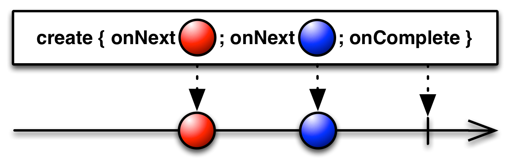
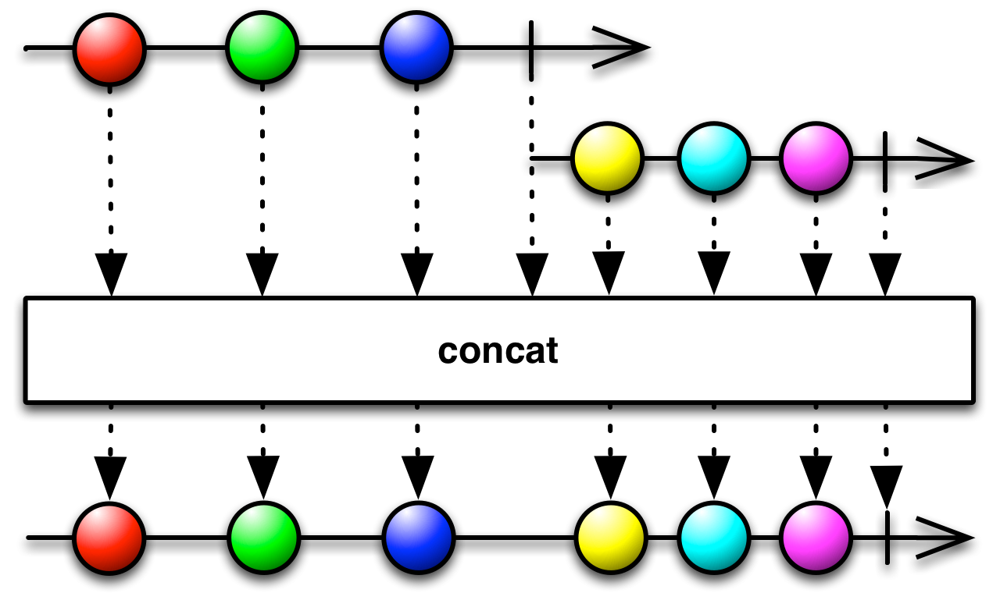

# 리액티브 프로그래밍

개발을 하다 보면 그런 날이 온다. 여러가지 API 요청을 합쳐서 다시 하나의 응답으로 만들어 내보내 주고자 하는데, 응답 시간도 오래 걸리고 코드를 이해하기 어려워지는 때가. 그래서 리액티브 프로그래밍을 알아보고자 한다.

## 간략한 배경

<모던 자바 인 액션>에서는 리액티브 프로그래밍이 등장한 배경을 간략하게 설명한다. 수년 전까지 가까운 과거에 일반적으로 생각하는 대규모 애플리케이션은 그냥 수십대의 서버를 운용하고, GB 정도의 데이터를 다루며, 몇초 정도 걸리는 응답시간이 걸리는 것이 당연했다. 하지만 최근에는 그저 수초의 응답이 걸리는 페이지는 그냥 닫아 버린다. 이렇게 변한 이유를 3가지로 뽑아본다면,

- 빅데이터

  최근의 데이터들은 PB 단위로 구성되고, 점점 증가하는 추세이다.

- 다양한 환경

  작은 모바일 디바이스부터 수천 개의 멀티 코어 프로세서로 실행되는 클라우드 클러스터까지 다양한 환경에 애플리케이션이 배포된다.

- 사용 패턴

  사용자는 1년 내내 항상 서비스를 사용할 수 있고, ms 단위의 응답 시간을 기대한다.

이런 문제를 리액티브 프로그래밍에서는 비동기적으로 다양한 데이터 흐름을 합쳐서 해결한다.

[우아한 형제들 기술 블로그](https://techblog.woowahan.com/2619/)에서는 간단한 예제로 사용 이유를 설명한다.

> 여러 API를 취합해서 전달해야하는 시스템에서는 SUM ([각 API들의 경과 시간]) 만큼 필요합니다. 리액티브로 진행할 경우, 여러 API 중 MAX ([각 API들 경과 시간]) 이 필요합니다.


## 리액티브 매니페스토 (선언)

[리액티브 선언문](https://www.reactivemanifesto.org/ko)는 리액티브 애플리케이션과 시스템 개발의 원칙을 정의한다.

- 반응성 (Responsive)

  리액티브 시스템은 빠를 분 아니라, 일정하고 예상 가능한 반응 시간을 제공한다.

- 회복성 (Resilient)

  장애가 발생해도 시스템은 반응해야 한다. 여러 컴포넌트의 시간과 공간 분리 (즉, 컴포넌트가 각각 독립적인 생명주기를 갖고 다른 프로세스에서 실행), 비동기적으로 작업 위임하는 등의 기법이 있다.

- 유연성 (Elastic)

  애플리케이션의 생명주기 동안 다양한 부하를 받는데, 리액티브 시스템에서는 자동으로 관련 컴포넌트에 할당된 자원 수를 늘린다.

- 메시지 주도 (Message-Driven)

  회복성과 탄력성을 지원하려면 약한 결합, 고립 위치 튀명성 등을 지원하도록 경계를 명확히 한다. 또한 비동기 메시지를 전달해 컴포넌트 간 통신이 이뤄진다.


## Async / Sync vs Blocking / Non-blocking

짧게 생각해보면 Async와 Non-blocking이 동일한 개념이고, Sync와 Blocking이 같은 개념처럼 느껴진다. 비동기로 일을 던져주면, 호출한 함수 A는 호출된 함수 B가 응답할 때까지 기다리지 않고 일을 할 수 있으니깐. 반대로 동기로 일을 던지면 호출된 함수가 B가 다시 결과값을 넘겨줄 때까지 호출한 함수 A는 기다리는 상태가 된다.

하지만 이 두가지 개념은 관점의 차이가 있다.


먼저 Async와 Sync는 호출되는 함수 B의 작업 완료 여부를 누가 신경쓰느냐가 주제다.

- 호출하는 함수 A가 호출된 함수 B의 작업 완료 후 리턴을 기다리거나, 혹은 바로 리턴 받더라도 작업 완료 여부를 A가 직접 신경쓰면 Sync
- 호출되는 함수 B에게 Callback을 전달해서 B의 작업이 완료될 때 Callback을 실행하고, 함수 A는 그떄서야 받는 구조, 즉 A가 작업의 완료 여부를 신경쓰지 않으면 Async


Blocking과 Non-blocking은 호출되는 함수로 바로 리턴하느냐, 마느냐가 주제다.

- 호출된 함수 B가 바로 리턴해서 A에게 다시 제어권을 넘겨주고 A가 다른 일할 기회를 준다면 Non-blocking
- 호출된 함수가 자신의 작업을 마칠 때까지 대기하게 만든다면 Blocking


## 애플리케이션 수준에서

애플리케이션 수준 컴포넌트의 리액티브 프로그래밍의 기능은 **비동기**로 작업을 수행할 수 있다는 점이다. 이벤트 스트림을 블록하지 않고 비동기로 처리하는 것이 최신 멀티코어 CPU의 사용률을 극대화할 수 있는 방법이다. 오랫도안 자바 스프링 개발자에게 동시성은 곧 많은 쓰레드를 의미했다. 쓰레드 별로 다른 일을 하도록 하면 그 수만큼 동시에 여러 일을 처리할 수 있었으니깐. 그러나 시스템이 점점 분산되고 (MSA 구조), API 호출과 데이터 액세스 등의 이유로 I/O 수행 시간이 늘어나게 되어 쓰레드 점유 시간이 길어졌다.

많은 쓰레드로 해결하고자 할 때는 몇가지 문제가 있을 수 있다. CPU와 메모리가 충분해도 쓰레드가 부족하면 처리율이 내려가고, 쓰레드를 늘리면 CPU와 메모리에 엄청난 부하가 간다. 쓰레드를 변경할 때 사용되는 오버헤드 또한 CPU에 부하를 주기 때문에 이 역시 문제다. 그래서 상대적으로 비싸고 희귀한 자원이다.


## 시스템 수준에서

리액티브 시스템은 여러 애플리케이션이 하나의 일관적이며 회복 가능한 플랫폼을 구성하는 아키텍처를 말한다. 시스템 수준에서는 애플리케이션을 조립하고 상호 소통을 조절한다. 이 과정에서 메시지 주도 (Message-Driven) 을 활용한다.

메시지는 정의된 목적지 하만 바라보고 가는 반면, 이벤트는 옵저버들이 모두 수신하다는게 다른점이다. 리액티브 시스템에서는 수신자, 발신자가 수신 메시지, 발신 메시지와 강하게 결합하지 않고 독립적인 구조를 유지하도록 메시지를 비동기로 처리한다. 그래야 시스템이 (장애로부터의) 회복성과 (높은 부하로부터의) 탄력성에서도 반응성을 유지할 수 있다.

시스템에서 장애가 발생했을 때, 리액티브 시스템은 성능이 저하되는 것이 아니라 문제를 완전히 고립시켜서 시스템을 복구한다. 예를 들어 에러 전파를 방지하고, 메시지 방향성을 바꾸어 다른 컴포넌트로 보내는 등, 감독자 역할을 수행해서 문제를 고립시킬 수 있다. 이렇게 햇 컴포넌트 자체로 문제가 한정되고, 외부로는 안정성을 보장할 수 있다.

회복성은 **고립**, **비결합**이 핵심이다. 그리고 탄력성의 핵심은 **위치 투명성**이다. 위치 투명성은 리액티브 시스템의 모든 컴포넌트가 다른 모든 서비스와 통신할 수 있음을 의미한다. 위치와 상관업이 모두 서로 통신이 가능하기 때문에 시스템을 복제할 수 있으며, 작업 부하에 따라 자동으로 애플리케이션을 확장할 수 있다.


## 프로그래밍 수준에서

리액티브 프로그래밍은 리액티브 스트림을 사용하는 프로그래밍이다. 스트림은 무한 (이라고 생각할만한) 의 비동기 데이터가 순서대로, 그리고 블록하지 않는 역압력 (Backpressure) 를 전제하여 처리하는 표준 기술이다. 역압력은 Publisher-Subsriber 프로토콜에서 이벤트 스트림의 Subscriber가 이벤트를 소비하는 속도보다 Pusblisher가 이벤트를 발행하는 속도가 더 빠름을 보장해서 문제가 발생하지 않도록 하는 장치를 말한다. 이렇게 해야, 부하가 발생한 컴포넌트가 완전 불능이 되거나 예기치 않게 이벤트를 잃어버리는 등의 문제가 발생하지 않는다. 이런 기법은 Subscriber가 쓰레드를 블록하지 않고도 감당 못할 만큼의 데이터를 받는 일을 방지한다.


## RxGo

### 개요

RxGo (ReactiveX Go Implementation) 은 리액티브 프로그래밍를 Go언어로 할 수 있도록 도와주는 프레임워크다. ReactiveX에는 Observable과 Observer라는 두 가지 주요 개념이 있다. 간단히 말하면, **Observable**는 발생하는 이벤트들의 Stream을 의미하며**Observer**는 Observable를 구독하고 있다가 발생하는 이벤트에 맞춰 행동 (반응) 한다.

RxGo는 [파이프라인](https://go.dev/blog/pipelines) 개념을 기반으로 구현되어 있다. Pipeline은 일련의 Stage들로 이루어져 있고, 각 Stage는 동일한 함수를 실행하는 고루틴들의 집합이며 채널 (Go언어의 `channel` 의미) 을 통해 연결되어 있다.

### 개념 예제


위의 예제 그림에서 네모난 박스가 하나의 Stage를 의미하며, 원통이 Stage들을 연결해주는 채널이다. 여기서 네모난 박스 각각은 하나의 **operator**이다. 세 가지 Stage를 다음과 같이 생각할 수 있다.

- `Just` operator를 이용해 정적인 Observable을 만든다.
- `Map` operator를 이용해 각 아이템을 손본다. (예를 들어, 원형 꼴에서 사각형으로 변경)
- `Filter` operator를 이용해 특정 아이템을 걸러낸다. (예를 들어, 노란색을 필터링)

이 과정을 거친 후, 마지막까지 남은 아이템들은 Consumer가 접근할 수 있도록 채널에 보내진다.

RxGo의 간단한 개념을 생각해봤다. 이 패러다임 (프레임워크) 가 하고자 하는 것은 ReactiveX 개념을 명확히 구현함과 동시에 Go언어 동시성 프로그래밍의 강점을 더해, 더욱 유연하고 강력한 툴이 되고자 한다.

### 코드를 통한 간단 예제

```go
type customer struct {
	id     int
	name   string
	age    int
	taxNum string
}
```

```go
ch := make(chan rxgo.Item)  // create the input channel
go producer(ch)  // data producer
observable := rxgo.FromChannel(ch)  // create an observable
```

고객 정보를 담당하는 구조체가 있고, 테스트를 위한 더미 데이터로 100번 반복하며 인스턴스를 만들어, 채널로 넣어준다. 그리고 만약 성인인 고객에 대해 `taxNum`을 알고자 한다. 이때 `taxNum`을 구하는 과정 중에 네트워크 I/O가 발생한다고 가정해보자. 성능을 끌어올리기 위해서 병렬 처리를 해주면 좋다.

```go
observable.
	Filter(func(item interface{}) bool {
		customer := item.(Customer)
		return customer.Age > 18
	}).
	Map(func(_ context.Context, item interface{}) (interface{}, error) {
		customer := item.(Customer)
		taxNumber, err := getTaxNumber(customer) // Enrich operation
		if err != nil {
			return nil, err
		}
		customer.TaxNumber = taxNumber
		return customer, nil
	},
		rxgo.WithPool(pool), // Create multiple instances of the map operator
		rxgo.Serialize(func(item interface{}) int { // Serialize the items emitted by their Customer.ID
			customer := item.(Customer)
			return customer.ID
		}), 
	    	rxgo.WithBufferedChannel(1)) // Create a buffered channel as the destination
```

그리고 Observe로 아이템들을 가져오면 된다.

```go
for customer := range observable.Observe() {
	if customer.Error() {
		return err
	}
	fmt.Println(customer.V)
}
```

### Hot vs Cold Observables

Rx 에서 Observable들은 Hot 성질 혹은 Cold 성질을 갖는다. 만약 아이템이 Observable 스스로가 아닌 외부에서 만들어진다면 Hot 성질이고, 아이템이 Observable 스스로 만든다면 Cold 성질을 갖는다. (이렇게만 보면 전혀 와닿지 않는다..) 예제 코드로 살펴보자.

```go
func SampleProducer() rxgo.Producer {
	return func(ctx context.Context, ch chan<- rxgo.Item) {
        items := []string{"abc", "def", "ghi"}
        
        // send items to channel and indicate a strategy on whether to close channel once the function completes
		rxgo.SendItems(ctx, ch, rxgo.LeaveChannelOpen, items)
	}
}
```

- 샘플 데이터를 넣어주는 Producer 역할의 함수이다.

```go
func SampleCreate() rxgo.Observable {
    return rxgo.Create([]rxgo.Producer{
        SampleProducer()
    })
}

func SampleDefer(page int) rxgo.Observable {
	return rxgo.Defer([]rxgo.Producer{
		SampleProducer(),
	})
}

func SampleMerge() rxgo.Observable {
	return rxgo.Merge([]rxgo.Observable{
        SampleCreate(),
        SampleDefer(),
	})
}

func SampleConcat() rxgo.Observable {
	return rxgo.Concat([]rxgo.Observable{
        SampleCreate(),
        SampleDefer(),
	})
}
```

- Create Operator

  

  Observable를 만들 내는 가장 기본적인 형태의 메서드이다. 파라미터로 받는 Producer 함수를 구동시켜 반환되는 아이템을 채널에 넣어준다. Hot 성질을 갖는 Observable를 만들어낸다.

  ```go
  observable := SampleCreate()
  fmt.Println("### 01")
  for item := range observable.Observe() {
      fmt.Println(item.V)
  }
  fmt.Println("### 02")
  for item := range observable.Observe() {
      fmt.Println(item.V)
  }
  ```

  ```go
  ### 01
  abc
  def
  ghi
  ### 02
  ```

- Defer Operator

  

  Create와 유사하지만, Cold 성질을 갖는 Observable를 만들어낸다. 파라미터로 전달된 Producer 함수를 구동시켜 반환되는 아이템을 채널에 넣는 것은 동일하나, 만들어진 Observable를 Observe하는 각 Observer마다 독립적인 Observable을 반환한다. 즉 아래처럼 Output이 나오게 된다.

  ```go
  observable := SampleDefer()
  fmt.Println("### 01")
  for item := range observable.Observe() {
      fmt.Println(item.V)
  }
  fmt.Println("### 02")
  for item := range observable.Observe() {
      fmt.Println(item.V)
  }
  ```

  ```
  ### 01
  abc
  def
  ghi
  ### 02
  abc
  def
  ghi
  ```

- Merge Operator

  

  Merge는 여러 개의 Observable들을 하나의 Observable로 합치는 역할을 수행한다. 기본적으로 각 Observable가 병렬로 처리되기 때문에, Observable들을 합치는 과정에서 Lock & Unlock 하는 과정을 거쳐야 한다.

- Concat Operator

  

  Concat은 Merge와 유사하지만 굳이 여러 개의 Observable들을 하나로 합치지 않고 그저 각 Observable들에 있는 아이템들을 한번에 Emit할 수 있도록 한다. 따라서 Lock & Unlock 과정을 거치지 않는다.

## 참고 블로그

- [Juneyr Post](https://juneyr.dev/reactive-programming)
- [Teivah Medium Post](https://teivah.medium.com/introducing-rxgo-v2-e7e369faa99a)
- [RxGo Github](https://github.com/ReactiveX/RxGo)

