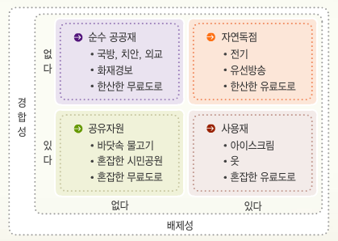

> 이 포스팅은 E. Glen Well, Puja Ohlhaver, Vitalik Buterin이 공동 작성한 [Decentrialized Soceity: Finding Web3's Soul](https://papers.ssrn.com/sol3/papers.cfm?abstract_id=4105763) 논문을 토대로 작성되었음을 알린다.

## Unsustainable Web3 without Web2 Infra

사회적 정체성의 부재는 탈중앙화의 실현을 목표로 태동한 웹3 생태계가 그 자체로 구동하지 못하게 만들며, 중앙화된 웹2 인프라에 의존하게 만드는 역설적인 결과를 초래한다.

- 대부분의 NFT 아티스트는 Opensea나 Twitter 등의 중앙화된 플랫폼에 의존하여, 작품의 희소성과 진위를 증명한다.

  

- 많은 DAO들이 시빌 공격 ([Sybil Attack](http://wiki.hash.kr/index.php/%EC%8B%9C%EB%B9%8C%EA%B3%B5%EA%B2%A9); 한 명의 사용자가 여러 개의 다중 계정을 만들고 악의적으로 사용함으로써 의사결정에 혼란을 주는 행위) 를 예방하기 위해 코인 투표 외의 활동을 웹2 인프라 (e.g., Discord) 에 의존하여 진행한다.

- 많은 웹3 참여자는 탈중앙화 지갑 관리 방법에 익숙지 않거나 분실 가능성 때문에 코인베이스, 바이낸스 등의 중앙화된 거래소가 관리하는 커스터디 지갑에 자산을 보관한다.

상기한 사례 외에도 같은 원인으로 인해 저담보 대출이나 단순 계약과 같은 기본적인 경제 활동을 수행할 수 없는 한계가 웹3 생태계에 만연하고 있다. SBT가 웹3 생태계에 **사회적 정체성 도입**을 성공적으로 실현한다면, 웹2 의존성을 국복하고 생태계 확장을 유도할 수 있을 것이다. 이를 위해 비탈릭 부테린 등 3명이 발간한 SBT에 대한 논문을 들여다보면서 SBT의 기대효과와 적용 사례에 대해 알아보고자 한다.

## Glossary

- Soul

  SBT 토큰을 보유하고 있으며, 그로부터 특성이 부여되는 지갑 혹은 계정

- DeSoc (Decentrialized Society)

  SBT가 웹3 생태계에 사회적 정체성을 주입하여 혁신된 다원적 사회 체계로 탈중앙화 사회라고 명명

## Outline

SBT를 통한 웹3 정체성의 도입이 가져올 기대효과로는 다음의 항목을 생각해 볼 수 있으며, 이는 DeSoc가 달성하고자 하는 비전과 밀접하다.

- 신원 및 출신의 증명
- 신용 평가를 통한 저담보 대출 시장 형성
- 지갑 키에 대한 탈중앙화된 관리 감독 가능
- 상황에 따른 전략적 행동 억제 혹은 촉진
- 탈중앙화 정도의 계량화 및 평가
- 공유 권한 및 승인 필요한 시장 개척

## Stairway to DeSoc

### Soul Fall in Art

SBT의 도입은 아티스트가 Soul을 통해서 자신의 작품에 더욱 풍부한 이야기를 담는 것을 가능하게 한다. Soul이 가진 명성, 소속 등의 특성이 작품에 투영되며, 구매자로 하여금 해당 NFT의 진위나 희소성을 더욱 쉽게 판별할 수 있다.

특정 작업이 이루어진 시점에 대한 정보만을 다루는 현 블록체인 기술이 창작물을 다룰 때, 그것을 사회적 맥락과 분리시켰던 것과 달리 SBT는 사회적 신원을 추적할 수 있도록 만드는 요소이기 때문에 창작물을 사회적 맥락과 재연결시켜 더욱 풍부한 서사를 창조하고 그 가치가 신뢰받는 커뮤니티에 의해 뒷받침되도록 만든다.

또한 SBT의 특징을 살려, 진위 여부 및 평판의 평가를 통해 형성할 수 있는 새로운 시장 (e.g., 대여 서비스) 을 개척할 수 있는 가능성도 존재한다.

### Lending via Soul

평판, 혹은 신용 평가를 통해 창출해낼 수 있는 금융 가치 중 가장 큰 것은 아마 신용 (Credit) 및 무담보 (Uncollateralized) 대출 시장일 것이다. 이러한 개념들은 대개 중앙화된 방식으로 책정된 고객의 신용 평가 점수에 의존한다. 하지만 이 방식은 충분한 신용 데이터를 쌓지 못한 사람들과 가난한 자들에게 일반적으로 불리한 점수를 부여하며, 사회적 차별을 강화시키는 요소로 동작하기도 한다.

이에 반해, SBT를 중심으로 형성되는 신용 생태계는 검열 저항성을 지닌, Bottom-Up (상향식) 의 사회적 신용 시스템을 구축한다. 학위 증명, 이력, 대출 기록 등을 나타내는 SBT를 통해서 Soul은 명성을 쌓아나갈 수 있으며, 대출에 필요한 필요 담보물의 크기를 줄여나갈 수 있다. 또한 SBT와 부채 간의 상관성을 계산할 수 있다는 점은 오픈소스 대출 시장을 형성하며, SBT와 상환 리스크 간의 데이터를 분석하여 신용도를 예측하는 등의 더욱 진보한 대출 알고리즘의 탄생을 촉진시킬 수 있다.

이러한 대출 시장의 혁신은 중앙화된 신용 평가 인프라의 역할을 감소시키고, 커뮤니티의 역할을 증대시켜 상환 과정에 대한 관리가 부족했던 기존의 "Lend-it-and-Forget" 방식에서 커뮤니티가 대출자의 상환 과정을 관리하는 "Lend-it-and-Help-it" 대출 방식으로의 패러다임 전환 또한 생각해 볼 수 있다.

### Sticky Soul

현재 메타마스크 등의 탈중앙화 지갑의 도난 혹은 분실 사고에 대한 대처 방법으로 니모닉 키 (Mnemonic Key), 혹은 멀티시그 (Multisig) 에 의한 복구 방법이 행해지고 있다. 하지만 신원 정보를 취급하는 SBT가 담기 Soul에 대한 복구가 필요한 경우에는 상기 방법으로는 충분하지 않을 것이다. Soul을 복구한 자가 SBT와 일치하는 신원을 가진 자임을 확인하는 과정이 추가적으로 필요하기 때문이다.

비탈릭은 논문에서 SBT 도입 시 Soul 복구 방법이 변화해야 한다고 말하며, 대안으로써 **Community Recovery**를 제시한다. 커뮤니티 기반 복구 방법은 단일 장애점 (Single Point of Failure; 구성 요소 중 어느 한 곳이 동작하지 않으면 전체가 중단되는 현상) 문제가 생길 수 있는 Social Recovery 방식을 개선한 것으로, Soul이 속해 있는 각 커뮤니티에 복구 권한을 위임하고 복구 요청이 제기되었을 때 과반수 동의를 통해서 진행하는 방법을 말한다.

20세기 사회학자인 게오르크 지멜이 주장한 ["개인성 (Individuality) 은 사회 집단의 교차점에서 발생한다"](https://repository.law.umich.edu/mlr_online/vol117/iss1/9/)는 정체성 이론에 기반한 방법으로, 사회성에 보안을 내장하여 어떠한 상황에서도 안전한 Soul의 복구를 실현할 수 있다. 더하여, Soul이 도난당할 시에 판매자는 Soul의 복구 가능성에 대해 증명하는 절차를 거쳐야 하기 때문에, 도난 시도 자체를 억제하는 효과도 지닌다.

### SoulDrop

웹3 서비스에서 토큰을 발행하여 특정 조건을 만족하거나 생태계에 기여한 이들에게 토큰을 무상으로 분배해주는 것을 에어드롭 (AirDrop) 이라고 한다. 에어드롭 대상은 각각의 지갑들로, 이를 노려 일부 악의적인 홀더들은 대량의 토큰을 에어드롭받아서 시빌 공격을 하기도 한다. 이러한 에어드롭 개념에 일반 토큰이 아닌 SBT를 분배하는 것을 소울드롭 (SoulDrop) 이라고 한다.

예를들어, 한 DAO가 개최한 세미나에 많이 참석한 이들에게 SBT 토큰, 혹은 POAP (Proof of Attendance Protocol) 을 분배하여 이 토큰을 소유한 이들로 구성된 커뮤니티를 형성하는 데 사용될 수 있다. 또한 Soul이 소유한 SBT 토큰들을 조합하여 이를 토대로 토큰을 분배할 수도 있다.

그리고 분배된 SBT 토큰은 분배받은 특정 시간동안만 이전 가능 (Transfer-able) 하거나, 그 반대 형태로도 커스텀할 수 있다. 이 특성을 이용하면 특정 기간동안 SBT 토큰을 소유한 Soul을 대상으로 거버넌스 의결권을 행사하도록 하는 것과 같이, 커뮤니티 기여를 위한 다양한 가능성으로 확장될 수 있다.

### DAO of Soul

[시빌 공격 (Sybil Attack)](http://wiki.hash.kr/index.php/%EC%8B%9C%EB%B9%8C%EA%B3%B5%EA%B2%A9) 이란 개인 사용자가 다수의 가명 ID를 생산하여 특정 네트워크 서비스에 불균형적으로 큰 영향력을 발휘하여 시스템에 대하여 공격을 실시하는 행위를 말한다. 예를 들어 특정 프로토콜의 거버넌스 토큰을 집중적으로 매수하여 51% 공격을 실행하여 프로토콜의 방향을 조작하는 등의 사례가 다수 존재한다. 아래 항목들로 DAO는 SBT를 활용하여 시빌 공격의 위험을 완화할 수 있다.

- Soul이 가진 SBT를 분석하여, 봇으로 보이는 Soul에 대한 투표권을 부정하고 시빌의 출현을 억제한다.
- 평판이 좋은 SBT를 더 많이 가지고 있는 Soul에 대해 더 많은 투표권을 인정한다.
- 개인 증명 (Proof of Personhood) SBT를 발행하여 시빌 저항력을 증진시킨다.
- 특정 투표를 지지하는 Soul이 보유한 SBT를 분석하고, 상관관계가 높은 유권자들에게 낮은 투표 가중치를 적용한다.

모두 같은 SBT를 공유하는 많은 Soul에 의한 투표는 시빌 공격일 확률이 높으므로, 위의 방법들로 DAO의 탈중앙화를 증진하고 지속 가능성을 높이는 방안으로 활용될 수 있다. 여기서 유의해야 할 점은 합리적인 악의적인 행동 (투표) 에 대한 판단 기준의 유무이다.

### Measuring through Pluralism

SBT 도입 시에 실현 가능해지는 중요한 요소는 탈중앙성에 대한 계량적 평가가 가능해진다는 점이다. 기존에 나카모토 계수 (특정 블록체인의 성능 저하나 정지를 일으킬 수 있는 밸리데이터의 숫자, 높을 수록 탈중앙성이 높다고 평가) 와 허핀달-허쉬만 지수 (특정 기업의 시장 집중도를 평가하여 독과점 정도를 산출) 등이 평가 지표로 활용되었으나, 실체의 진위 여부를 판단하지 못하고 담합 등의 전략적 행동에 취약하다는 단점이 존재했다. 그러나 SBT 도입 후 Soul들의 상관관계 분석이 가능해진다면, 이를 통해 도출되는 지표를 활용하여 DAO 운영 시에 효과적인 탈중앙화 실현이 가능해질 것으로 예상된다.

### Plural Property

사전적으로 Plural은 `복수의, 다원적인`이라는 의미를 지닌다. 이 챕터에서 말하는 Plural Property는 결국 특정 권리를, 특히 재산권을 세분화된 여러 권리로 나누겠다는 것이다. 로마법에서 정의된 재산권은 사용권 (*usus*), 파괴권 혹은 변경권 (*abusus*), 수익권 (*fructus*) 으로 구성된다. 예를 들어 아파트 임대 시에 임차인에게 사용권만이 부여되는 것과 같이, 이 세 가지의 권리가 항상 같은 소유자에게 귀속되는 것은 아니다. 이처럼 현실에서 재산권은 분해되어 적용되는 것이 일반적이다.

그러나 블록체인 상의 재산은 기본적으로 이전 가능한 자산만을 취급하고, 대표적인 자산 중 하나인 NFT는 세 가지 권리 모두 소유자가 통제하는 형태이다. On-Chain 자산 혁신의 미래는 현실 체계의 특징과 일치하도록 재산권을 분해하고 이를 다룰 수 있는 정교한 코딩이 가능한 지에 달려있다. SBT 적용 시 다음과 같은 재산권 분해 사례가 가능할 것으로 기대된다.

- 사적 및 공용 재산에 대한 접근 허가

- 데이터 협동 조합

  연구자에게 데이터 접근 권한을 승인하고 연구 결과 발생한 지적 재산권에 대한 권리를 협상

- 특정 지역이나 커뮤니티의 Soul만이 사용 가능한 지역 통화 구축

- 특정 자격을 유지하기 위해 세금을 지불하는 등의 마켓 디자인 설계

- 민주주의 메커니즘 시도

  SBT 홀더들은 인센티브나 세율에 대해 Quadratic 투표를 진행. 궁극적으로 시장과 정치를 잇는 장치로 SBT가 활용

### Sharing Economy Paradigm Shift

재화의 종류로 사유재, 공공재, 공유 자원, 자연 독점 네 가지가 있다. 이 중 공공재는 비경합성과 비배제성의 특성을 갖는 재화를 말한다. 즉, 한 사람의 소비가 다른 사람의 소비 가능성에 영향을 주지 않고 (비경합성), 비용을 지불하지 않은 자의 공공재 소비를 막을 수 없는 (비배제성) 것이다. 이 특성으로 인해 여러 공공재 중 하나를 선택하여 생산해야할 때, 어떤 요소를 기준으로 판단하는 것이 가장 정의로운지 쉽게 알 수 없다. 공공재 생산에 기여한 투자금을 중심으로 판단한다면 자본이 많은 개인의 선호가 과대 반영될 수 있고, 반대로 1인 1투표제를 실시할 경우 선호의 강도를 반영하지 못하여 공공재에 대한 미약한 선호를 가진 개인의 선호를 과대 반영할 수 있는 가능성이 있다.

DAO 거버넌스도 마찬가지의 문제에 직면하곤 한다. 토큰의 양을 기준으로 거버넌스를 결정한다면 자본이 많은 개인의 투표권이 과대 반영될 수 있고, 투표에 참여한 지갑 주소를 기준으로 판단한다면 선호를 반영할 수 없어 미약한 선호를 가진 개인의 투표권이 과대 반영되거나 시빌 공격의 위험에 노출될 수 있다. 비탈릭은 Quadratic Vote 방식으로 상기 문제를 해결할 수 있다고 [밝힌 바](https://vitalik.ca/general/2019/12/07/quadratic.html) 있다. Quadratic Vote 방식이란 투표 비용이 투표 수의 제곱만큼 증가하도록 설정하여 안건에 대한 선호의 강도를 측정함과 동시에 투표 참여 인원에 더욱 방점을 둔 방식이다. 이 방식을 토대로 공공재 최적 펀딩 모델인 Quadratic Funding 방식을 주장하기도 했다.

Quadratic Funding 방식을 통해 공공재 생산 시 좀 더 사람들의 선호를 공정하게 반영할 수 있지만, 여전히 다른 이들의 투표권을 매수하거나 담합하는 경우에 공공재 선호가 왜곡될 수 있다는 단점을 가진다. 심지어 온체인에서는 개인이 복수의 지갑을 통해 투표를 시행할 수 있기에 이러한 단점은 더욱 두드러진다. 이 지점에서 SBT의 도입은 각 Soul의 정체성과 Soul 간의 상관관계를 파악할 수 있기에 담합 등의 전략 행동을 최대한 배제하여 복수의 생산 주체들이 참여하는 진실된 공공재의 생산을 가능케 한다. 또한 SBT는 자격 혹은 신원을 나타내기 때문에, 특정 SBT를 가진 Soul만이 참여 및 이용 가능한 공공재, 즉 공유재화의 실현을 가능하게 한다.

## Reference

- [Vitalik Buterin, "Recovery"](https://vitalik.ca/general/2021/01/11/recovery.html)
- [Do Dive, "SBT(Soulbound Token) 논문 톺아보기 1"](https://medium.com/despread-creative/sbt-soulbound-token-%EB%85%BC%EB%AC%B8-%ED%86%BA%EC%95%84%EB%B3%B4%EA%B8%B0-%E2%91%A0-30495441dcf6)

