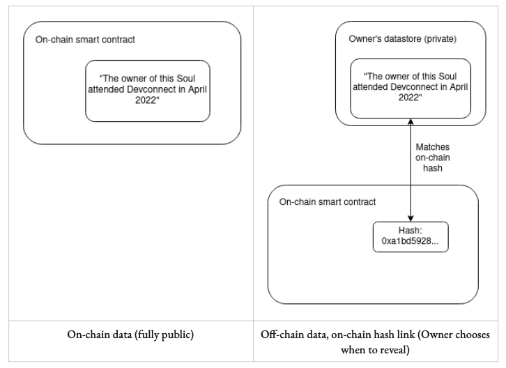

> 이 포스팅은 E. Glen Well, Puja Ohlhaver, Vitalik Buterin이 공동 작성한 [Decentrialized Soceity: Finding Web3's Soul](https://papers.ssrn.com/sol3/papers.cfm?abstract_id=4105763) 논문을 토대로 작성되었음을 알린다.

## Plural Sense-Making

SBT의 도입으로 Soul의 특성을 수치화하고 측정할 수 있게 되어, 각 사용자가 제공하는 데이터의 신뢰성 혹은 평판을 평가할 수 있게 만든다. 이를 토대로 사회적 맥락을 고려하는 방향으로 예측의 생산을 유도하거나, 제공한 데이터의 예측 적합도를 평가하고 Quadratic 메커니즘을 사용하여 각 참여자가 받는 보상을 균등하게 분배하는 방식을 적용할 수 있다.

위와 같은 방식은 기존 예측 모델이 가지고 있던 사회적 맥락의 배제, 데이터 자주권 박탈, 편향된 표본 형성, 데이터 공유 유인의 부족 등의 맹점을 극복하고 공유 지능의 형성을 가능하게 한다. 논문 5장에 훨씬 자세하게 서술되어 있으므로, 상세 내용은 원문을 참고하길 바란다.

## So... What SBTs Do

### DeSoc

웹3가 궁극적으로 지향하는 바는, 단순히 금융 시스템을 혁신하고자 하는 것 뿐만 아니라, 전반적인 사회 형태로 탈바꿈되는 것이다. 그러나 오늘날의 사회 구성 요소들은 실제 사람들의 소울과 상호 간의 관계를 기반으로 하며, 이러한 영향으로 메타버스 세상은 비교적 무의미하다고 느껴지기 까지도 한다. 이 둘 간의 괴리를 SBT를 통해 해소하고자 하며, 이러한 사회 형태를 **Decentralized Society (DeSoc)**라고 한다. 원문에서는 이를 "Soul과 커뮤니티가 다양한 규모에 걸쳐 공동의 네트워크 재화를 생산하기 위한 속성으로써, 상향식 소집되는 공동 결정 사회"로 정의한다.

DeSoc에서 주요한 기능 중 하나가 세분화 가능한 네트워크 재화 (Plural Network Goods) 이다. **네트워크 재화 (Network Goods)**란 네트워크 효과 (Network Effect; 한 사람의 수요 행동이 다른 사람의 수요에 영향을 미치는 현상)  가 나타나는, 수요의 외부 효과를 발생시키는 재화를 말한다. 예를 들어 무선 통신 서비스, 유튜브의 알고리즘 영상 추천과 같은 예측 모델 등은 서비스 참여자가 많아질 수록 서비스의 질이 상승한다. SBT 도입으로 재화의 사용권 (*usus*), 파괴권 혹은 변경권 (*abusus*), 수익권 (*fructus*) 으로 권리를 세분화할 수 있기에, 네트워크 재화들이 세분화된 권리로 나뉘어 공유되는 사회가 되고자 한다.

사적 재화 (Private Goods) 혹은 공공재 (Public Goods) 등으로 재화를 분류하는 현대의 신고전주의 경제학에서는 기본적으로 추가 투입 단위에 대한 산출량 감소를 가정한다. 그러나 네트워크 재화는 다른 특성을 갖고 있기 때문에, 비탈릭은 아래의 항목들을 고려하여 다른 소유권 체계 및 의사 결정 체계가 필요하다고 주장한다.

- 네트워크 재화는 추가 투입 단위에 따라 산출량이 증가하기 때문에, 일반적인 재화를 사적 재화와 공공재로 나누는 이분법에서 벗어나 새로운 체계가 필요하다.
- 네트워크 재화를 사적 재화로 취급 시, 민간 주체에 의한 독점 (e.g., 웹2 독점 기업) 혹은 강력한 정부에 의한 독점 (e.g., 중국 공산당) 에 취약하며 과도한 사용료 징수로 인해 과소 생산의 문제에 봉착한다.
- 네트워크 재화를 공공재로 취급 시, 규제의 문제 혹은 자금 조달 실패 등을 이유로 과소 생산의 문제에 봉착한다.

### Crossroad where Heaven... or Hell

지금껏 잠재력 있고 유망한 기술들이 그러했듯이, DeSoc 개념 또한 정반대의 결과를 초래할 수 있다. 특정 SBT를 소유한 Soul 그룹을 자동적으로 금융 신뢰가 부족한 이들로 간주하여 금융 서비스를 보류하는 차별적 관행 (Red-Lining) 을 일삼거나, SBT를 통해 사회적 약자를 구분해내어 이들을 이용하여 대출을 실행하는 등 디스토피아적 성향의 일들도 발생할 수 있다.

## Implantation Challenge

### Private Souls

Public SBT들은 Soul에 대한 너무 많은 정보를 노출시켜, 많은 사회적 문제를 야기할 수 있다. 블록체인 원장은 태생적으로 공개적이기 때문에 프라이버시 보호 조치가 취해져야 한다. 앞서 간략히 언급한 예측 모델 사례에서도 각 개인의 SBT 데이터에 접근할 수 있어야 공유 지능의 형성이 가능하므로, 데이터 프라이버스 문제에 대한 질문을 떠올리게 한다. 데이터가 사유 재산과 같은 개념이라면, 데이터가 언제 그리고 누구에서 공개될 것인 지는 사용자 개인이 정할 수 있어야 한다.

비탈릭은 데이터를 사유 재산으로 보는 관점을 극복하고 프로그래밍 가능한 권리의 묶음으로 보아야 한다고 주장한다. 즉 데이터를 일괄적으로 사유 재산으로 취급하기 보다는, 정보 공유에 관한 상황에 따라 공개 한도를 조정 및 재산권 내용을 다르게 규정할 수 있어야 한다는 것이다. 예를 들어 여권이나 의료 기록 등의 정보는 사유 재산처럼 취급되어야 하나, 학위나 특정 커뮤니티 멤버십 등의 기록은 적격한 인물이나 집단에게 접근 권한을 부여하고, 데이터 이용에 따른 보상을 수취하는 등의 메커니즘 설계로 나아가야 한다는 것이다.

관련하여 가능한 해결책 중 하나는, 실 데이터는 Off-Chain (e.g., 사용자 소유의 Device) 에 보관하고 이를 가르키는 해시 값을 On-Chain에 기록하는 것이다. 하지만 보다 확장성 있고 세분화 가능한 재산권을 위해서 다수의 단체에서 SBT에 Read 접근하거나 Write 요청을 하는 경우도 고려해 보아야 한다.

영지식 증명 (Zero-Knowledge Proof) 기술이 이러한 메커니즘의 실현 방안으로 사용될 수 있다. 영지식 증명은 증명자가 자신이 가진 지식이나 자격 등의 내용을 공개하지 않고 검증자에게 그것을 가지고 있다는 것을 증명할 수 있는 시스템을 말한다. 이를 통해 증명자의 임의적인 진술을 구체적인 내용 공개 없이 증명 가능하므로, SBT를 취급하는 과정에서 프라이버시를 보존할 수 있다.

영지식 증명과 데이터 저장로써 Off-Chain 활용은 결국, 프라이버시를 보존함과 동시에 재산의 각 영역인 이용권, 변경권, 수익권을 어떻게 분리하고 프로그래밍하느냐의 문제와 관련이 깊다.

### Cheating Souls

SBT의 도입을 통해 기존에 존재하던 시빌 공격 등의 부정 행위에서 자유로울 수 있으나, SBT가 특정 커뮤니티의 접근 권한 등의 자격을 부여한다면 여전히 뇌물 공여나 Soul 자체를 매매하난 등의 부정 행위의 문제에서 자유로울 수 없다. 따라서 비탈릭은 다음과 같은 방안들을 통해서 부정 행위 내지는 전략적 행동을 예방해야 한다고 말한다.

- 신뢰성 짙은 오프라인 커뮤니티를 기반으로 SBT 생태계를 구성 (e.g., 교회, 직장, 학교)
- 잠재적인 담합 가능성이 있는 경우, 각 참여자들이 속한 사회적 맥락을 가늠할 수 있는 SBT를 자격 요건을 요구 (e.g., 특정 시에서 보조금 분배 투표를 진행할 경우, 각 참여자는 자신의 거주지를 나타내는 SBT를 보유해야 함)
- SBT의 공개성과 분석 가능성을 활용하여 담합 등의 부적절한 행동을 처벌 수 있음 (e.g., Gitcoin의 Quadratic Funding 메커니즘은 이미 잠합 집단을 선별하는 데에 쓰이고 있음)
- 영지식 증명 기술을 이용하여 타인으로 하여금 SBT 증명 내용을 확인할 수 없게 만들어, 증명에 대한 매매 행위를 억제
- 담합의 패턴을 읽어내고 벌하는 방향으로 내부 고발자를 양성, 일정 규모 이상의 담합의 발생을 억제
- 피어 예측 메커니즘, 즉 어떤 사실에 대해 참여자 서로가 상대방을 증명해주는 방법을 사용해 담합 비용 증대를 유도
- SBT 간의 상관관계 점수의 사용을 참여자들이 정직하게 행동하는 방향으로 설계

## Reference

- [Do Dive, "SBT(Soulbound Token) 논문 톺아보기 2"](https://medium.com/despread-creative/sbt-soulbound-token-%EB%85%BC%EB%AC%B8-%ED%86%BA%EC%95%84%EB%B3%B4%EA%B8%B0-%E2%91%A1-40fdf433a162)

