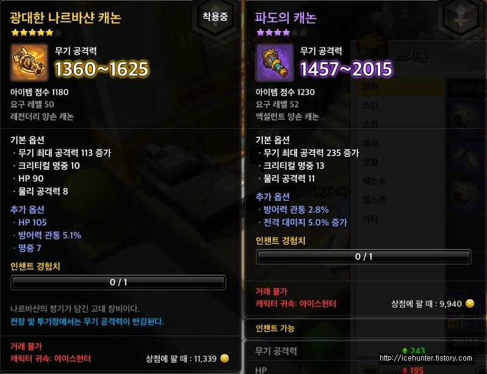
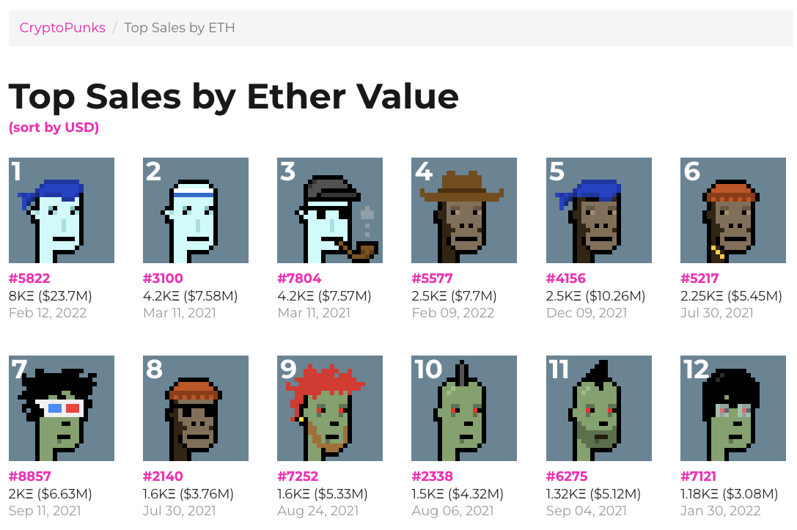
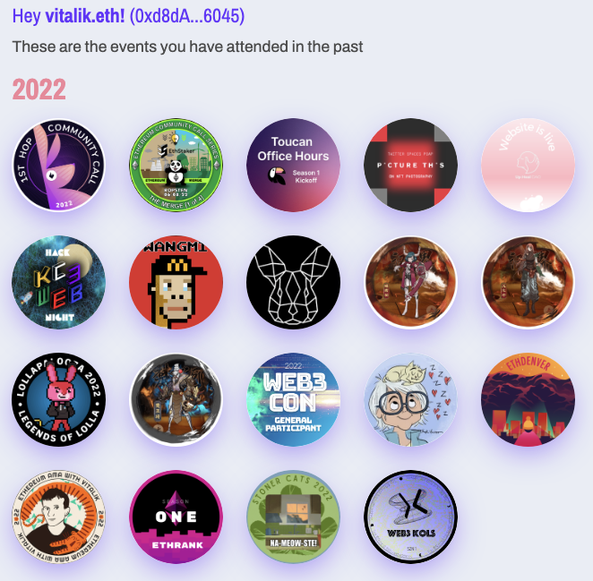

## Soul? 영혼...?

웹3 생태계는 탈중앙화를 핵심 가치로 여기며 공개 키 암호 (Public Key Cryptography), 스마트 컨트랙트 (Smart Contract), 작업 증명 (Proof of Work), 지분 증명 (Proof of Stake) 등의 개념을 쏟아내며 독자적인 개방 생태계를 구축해 나가고 있다. 다만, 웹3는 신뢰를 중심으로 하는 사회적 관계를 포현하기보다는 이전 가능한 (Trasnfer-able) 금융 자산을 표현하는 데에 집중하여 발전했다. 거래를 통해 생성되는 경제적 가치가 거래 참여자 자체와 서로 간의 상호작용에서 기원한다는 점을 고려했을 때, 웹3 생태계가 더 이상 성장하지 못하고 한계에 부딪히는 예상 가능한 미래를 떠올리게 한다.

이더리움의 창시자인 비탈릭 부테린은 사회적 정체성을 표현하기 어려운 (사실상 거의 불가능에 가까운) 웹3의 결점을 보완하고, 다음 단계 (Decentrialzed Socienty, DeSoc) 로 나아가기 위해서 **Soul Bound Token (SBT)** 개념을 제시했다. SBT는 World of Warcraft 게임에서의 Soul Bound 아이템에서 유래한 개념이다. 개인적으로 저 게임을 해본 적이 없어서, 메이플스토리의 캐릭터 귀속 장비의 개념이 더 와 닿았다. 해당 장비를 착용하는 순간, 그 장비는 착용한 캐릭터에게 귀속되어서, 거래를 할 수 없게 된다.

## What If NFTs be Soul Bound

현 NFT의 형태는 MMORPG 게임에서의 희귀 혹은 전설 아이템과 비슷한 속성을 갖고 있다. 커뮤니티 기반의 사회적인 가치를 지니고 있기에, 이러한 아이템을 착용하고 소지하는 것만으로도 일종의 지위가 형성되며, 자랑하는 효과도 있다. 트위터나 인스타그램 등에서 자신 소유의 NFT를 프로필 사진으로 설정할 수 있게 하여 사람들에게 전시할 수 있게 한다고도 한다.

여기서 NFT가 정확히 **어떠한 사회적 정체성**을 드러내는 것인지 한번 생각해보자. NFT를 얻기 위해 필요한 스킬에 숙련된, 혹은 조건들에 부합하는 사람이라는 것을 보여줄 수 있다. 하지만 현 NFT는 거래가 가능한 아이템이므로, 사실 가장 큰 내재 의미는 바로 **부 (Wealth)**이다.

만약 누군가가 X라는 행위를 통해 얻을 수 있는 NFT를 갖고 있다면, 그들이 실제로 그 X란 행위를 직접 해서 얻은 것인지, 혹은 남이 X를 하여 얻은 NFT를 단순 구매한 것인지 전혀 알 수 없다. 이 점이 문제되지 않는 경우라면 괜찮지만, 단순히 돈을 많이 가진 자들이 소유할 수 있는 NFT가 아니라 실제로 어떠한 의미를 함축하거나 표지할 수 있는 NFT를 만들고 싶다면 어떻게 해야할까?

## What If Governance Rights be Soul Bound

현실에서의 투표처럼, 거버넌스 의결권은 자신의 의견을 커뮤니티에 전달하거나, 서비스의 방향성을 결정하는 중요한 권리이다. 하지만 소유한 토큰 수량에 비례해 의결권을 분배하고, 더 나아가 이를 위임하여 (간접 투표 형식) 진행되는 것이 현실이다. 계속해서 지금처럼 쉽게 누군가에게 권리를 넘겨줄 수 있는 형태라면 이는 악의적인 결과가 일어날 여지를 쉽게 만들어 줄 것이다.

- 만약 거버넌스 의결권의 목적이 최대한 많은 사람들에게 주어지는 것이라면, 소유권 이전의 가능성은 역효과를 낳는다. 이해관계에 직접적으로 연관된 사람들이 쉽게 다른 이들로부터 의결권을 구매해버리면 그만이기 때문이다.
- 만약 거버넌스 의결권의 목적이 적임자에게 이를 쥐어주는 것이어도 유사하다. 적임자는 아니지만, 이 시스템에 목소리를 내고 싶어하는 이들이 적극적으로 의결권을 구매할 것이기 때문이다.

"가장 사람들을 지배하고자 하는 사람들은 보통 가장 그 일에 부적합한 사람들이다." 라는 격언을 고찰해 볼 필요가 있다.

## POAP

위의 배경에서 나온 프로젝트 중 가장 좋은 예시로, [POAP (Proof of Attendance Protocol)](https://poap.xyz/) 이 있다. POAP는 NFT에 **귀속**이라는 특성을 더하기 위해 등장한 프로젝트이다. 단순하게 말하자면, 출석 인증 뱃지와 유사한 개념이다. 이 애플리케이션의 목적은 행사 참여자에게 참여 인증 뱃지를 제공하고, 컬랙션으로 만들 수 있게 해준다.

## From Here to There

현 웹3 업계가 많이 받는 비판 중 하나는 이들이 구축한 것 중 돈이 중심이 되지 않는 영역이 없다는 점이다. 이러한 양상은 웹3 생태계의 장기적인 지속 가능성과 매력을 현저히 감소시킨다. 크립토 세계의 많은 것들이 귀속 아이템이 되는 것이 하나의 대안책이 될 수 있을 것이다. SBT는 당신이 무엇을 구매할 수 있는 가보다, 당신이 실제로 누구인 가에 대해 더 많은 것을 함의할 수 있게 되기 때문이다.

소유권 이전의 가능성을 극대화하기 위해 모든 기준이 설계되어 있는 현 블록체인 생태계에서 이를 제한하려는 노력은 쉽지 않을 것이다. 그러나 이것이 가능해져야만 자본 중심적이지 않은, 사회적인 웹3 세상에서 블록체인이 자리 잡을 수 있게 될 것이다.

## Reference

- [Vitalik Buterin, "Soulbound"](https://vitalik.ca/general/2022/01/26/soulbound.html)
- [Do Dive, "SBT(Soulbound Token) 논문 톺아보기 1"](https://medium.com/despread-creative/sbt-soulbound-token-%EB%85%BC%EB%AC%B8-%ED%86%BA%EC%95%84%EB%B3%B4%EA%B8%B0-%E2%91%A0-30495441dcf6)

