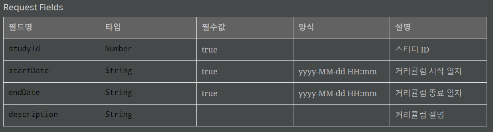

# Spring Rest Docs를 이용한 API 문서 자동화


## Swagger ? Spring Rest Docs ?

API 문서를 작성하는 데 사용하는 라이브러리는 크게 Swagger와 Spring Rest Docs 두 종류가 있는 것 같다. 여러 차이점들이 있지만 Swagger는 프로덕션 코드에 문서화를 위한 애노테이션을 추가해야 하지만, Spring Rest Docs는 테스트 케이스를 통해 문서화가 된다는 점만으로도 Spring Rest Docs가 보다 낫다는 판단이 섰다.

```java
@ApiOperation(value = "View a list of available products", response = Iterable.class)
@ApiResponses(value = {
        @ApiResponse(code = 200, message = "Successfully retrieved list"),
        @ApiResponse(code = 401, message = "You are not authorized to view the resource"),
        @ApiResponse(code = 403, message = "Accessing the resource you were trying to reach is forbidden"),
        @ApiResponse(code = 404, message = "The resource you were trying to reach is not found")
}
)
@RequestMapping(value = "/list", method= RequestMethod.GET, produces = "application/json")
public Iterable list(Model model){
    Iterable productList = productService.listAllProducts();
    return productList;
}
```

[위의 코드](https://springframework.guru/spring-boot-restful-api-documentation-with-swagger-2/)는 실제 프로덕션의 컨트롤러 계층 코드에 Swagger를 적용한 예제이다. 애노테이션을 사용해서 편리하게 문서를 생성해주지만, 이 부분이 약점이 될 수 있다. 마치 주석처럼 실제 로직에 영향을 주지 않기 때문에 로직이 변경되더라도 문서가 갱신되지 않을 수 있으며, 로직을 위한 애노테이션 및 코드와 문서화를 위한 애노테이션과 코드가 뒤섞여 있어 가독성이 떨어진다. 이러한 이유 때문에 Spring Rest Docs를 적용하고자 했다.

Spring Rest Docs의 구동 순서를 요약하면 다음과 같다.

- `mvc package` 실행
- 테스트 코드를 수행하는 데 필요한 요청/응답에 대한 snippet을 `/target/generated-snippets` (기본값) 에 생성
- 배포할 API 문서를 적절한 위치에 작성하고, 해당 문서에 위에서 생성된 snipppet을 `include`하여 병합
- 패키징된 문서 결과물이 `/target/generated-docs` (기본값) 에 생성


## 프로젝트 구성

먼저 필요한 의존성과 플러그인을 추가하고, 필요한 설정 정보를 주입하자.


### 의존성 추가

`pom.xml`에 `restdocs-mockmvc` 의존성을 추가한다.

```xml
<dependency>
    <groupId>org.springframework.restdocs</groupId>
    <artifactId>spring-restdocs-mockmvc</artifactId>
    <scope>test</scope>
</dependency>
```

- Mock MVC와 Rest Docs를 함께 결합하기 때문에, 이에 필요한 의존성을 추가한다.
- 테스트 케이스에서만 사용하므로 `scope`는 `test`로 설정한다.


### 플러그인 추가 및 설정

크게 두 가지 플러그인을 추가한다.

- 빌드 설정을 위한 플러그인

- 문서 패키징을 위한 플러그인


먼저 첫번째 플러그인 설정 정보이다.

```xml
<plugin>
    <groupId>org.asciidoctor</groupId>
    <artifactId>asciidoctor-maven-plugin</artifactId>
    <version>2.1.0</version>
    <dependencies>
        <dependency>
            <groupId>org.springframework.restdocs</groupId>
            <artifactId>spring-restdocs-asciidoctor</artifactId>
            <version>2.0.5.RELEASE</version>
        </dependency>
    </dependencies>
    <executions>
        <execution>
            <id>generate-docs</id>
            <!-- "prepare-package" 옵션은 jar 패키지 내에 API 문서를 포함할 수 있도록 한다. -->
            <phase>prepare-package</phase>
            <goals>
                <goal>process-asciidoc</goal>
            </goals>
            <configuration>
                <backend>html5</backend>
                <doctype>book</doctype>
                <attributes>
                    <!-- 문서 조각들이 생성되는 디렉터리를 설정한다. -->
                    <snippets>${project.build.directory}/generated-snippets</snippets>
                </attributes>
                <!-- 문서 패키징의 기준이 되는 파일의 디렉터리 위치를 설정한다. -->
                <sourceDirectory>${basedir}/src/main/docs/asciidocs</sourceDirectory>
                <!-- 문서 패키징이 생성되는 디렉터리를 설정한다. -->
                <outputDirectory>${project.build.directory}/generated-docs</outputDirectory>
            </configuration>
        </execution>
    </executions>
</plugin>
```

이어서 다음 플러그인 설정 정보이다. 이 플러그인을 통해 jar 파일이 만들어지기 전에 API 문서들이 생성되고, 생성된 문서가 jar 파일 내에 포함되도록 설정된다.

```xml
<plugin> 
	<groupId>org.asciidoctor</groupId>
	<artifactId>asciidoctor-maven-plugin</artifactId>
	<!-- ... -->
</plugin>
<plugin>
    <artifactId>maven-resources-plugin</artifactId>
    <version>2.7</version>
    <executions>
        <execution>
            <id>copy-resources</id>
            <phase>prepare-package</phase>
            <goals>
                <goal>copy-resources</goal>
            </goals>
            <configuration>
                <outputDirectory>${basedir}/src/main/resources/static/html/docs</outputDirectory>
                <resources>
                    <resource>
                        <directory>${project.build.directory}/generated-docs</directory>
                    </resource>
                </resources>
            </configuration>
        </execution>
    </executions>
</plugin>
```

- 중간중간에 있는 `<version>`은 포스팅 작성 기준 최신 버전이므로, 적용할 시점에 맞는 버전을 사용하면 된다.


## 구성 환경

### `@WebMvcTest` VS `@SpringBootTest`

@SpringBootTest 로 수행하는 테스트 케이스는 보다 직관적이지만, 전체 컨텍스트를 로드하여 빈을 주입받아야 하기 때문에 속도가 조금 느린 단점이 있다.

@WebMvcTest 로 수행하면 일반적으로 서비스 계층은 Mocking을 하여 작성한다. 실제 로직과 다를 수 있지만, 컨트롤러 계층만 테스트하기 때문에 보다 속도가 빠른 장점이 있다.

통합 테스트를 할 때는 @SpringBootTest를, 단순히 API 문서 작성을 위할 때는 @WebMvcTest를 사용하는 것이 나은 선택이 될 것 같다.


### AsciiDoc VS MarkDown

친근한 마크다운이 보다 작성하기 편하지만, 여러 파일들이 있을 경우 `include`가 되지 않는 단점이 있다. 테스트 케이스를 실행하면 문서 조각들이 생성되고 여러 조각들을 패키징해서 하나의 파일로 만들어야 하기 때문에 `include` 기능이 필수적이다. 따라서 이 기능을 제공하는 AsciiDoc이 보다 나은 형식이 될 것 같다.


## API 문서화 Payload 설정

요청 및 응답에 필요한 요소에 대한 설명을 세팅한다.


### Request and Response Body 

요청 및 응답 바디에 대한 Snippets들을 생성해준다. 각각 `request-body.adoc` 과 `response-body.adco` 파일명으로 생성된다. [Docs Reference](https://docs.spring.io/spring-restdocs/docs/current/reference/html5/#documenting-your-api-request-response-payloads-fields)

예를 들어 아래 Payload 정보로 요청을 보낸다면,

```json
{
	"contact": {
		"name": "Jane Doe",
		"email": "jane.doe@example.com"
	}
}
```

테스트 코드는 다음과 같다.

```java
this.mockMvc.perform(get("/user/5").accept(MediaType.APPLICATION_JSON))
    .andExpect(status().isOk())
    .andDo(document("index", responseFields(
                fieldWithPath("contact.email").description("The user's email address"), 
                fieldWithPath("contact.name").description("The user's name")
    )));
```

다음은 JSON 형태의 Payload를 표현하는 예시이다.

```json
{
	"a":{
		"b":[
			{
				"c":"one"
			},
			{
				"c":"two"
			},
			{
				"d":"three"
			}
		],
		"e.dot" : "four"
	}
}
```

아래 표는 위의 JSON 파일 기준으로 `fieldWithPath()`에 인자로 전달해야 하는 형식이다.

| Path             | Value                               |
| :--------------- | :---------------------------------- |
| `a`              | 요소 `b` 를 포함                    |
| `a.b`            | 세가지 요소를 포함하는 배열         |
| `['a']['b']`     | 세가지 요소를 포함하는 배열         |
| `a['b']`         | 세가지 요소를 포함하는 배열         |
| `['a'].b`        | 세가지 요소를 포함하는 배열         |
| `a.b[]`          | 세가지 요소를 포함하는 배열         |
| `a.b[].c`        | 문자열 `one`, `two`를 포함하는 배열 |
| `a.b[].d`        | 문자열 `three`                      |
| `a['e.dot']`     | 문자열 `four`                       |
| `['a']['e.dot']` | The string `four`                   |


> 주의할 점!
>
> 컨트롤러에서 객체를 반환하지 않는데 `responseFields`를 사용한다면 `ClassCastException` 예외가 발생할 수 있다.
>
> 추가로 컨트롤러에서 `String` 객체를 반환하면 `content as it could not be parsed as JSON or XML` 오류가 발생한다.
>
> 두 경우 모두 일반적인 객체를 반환하도록 설정해주어야 한다.


### Request Parameters

요청 파라미터로 넘겨야 하는 정보들을 세팅할 수 있다. `request-parameters.adoc` 파일이 생성된다. [Docs Reference](https://docs.spring.io/spring-restdocs/docs/current/reference/html5/#documenting-your-api-request-parameters)

GET 요청에 대한 예제 코드이다.

```java
this.mockMvc.perform(get("/users?page=2&per_page=100")) 
	.andExpect(status().isOk())
	.andDo(document("users", requestParameters( 
			parameterWithName("page").description("The page to retrieve"), 
			parameterWithName("per_page").description("Entries per page") 
	)));
```

POST 요청에 대한 예제 코드이다.

```java
this.mockMvc.perform(post("/users").param("username", "Tester")) 
	.andExpect(status().isCreated())
	.andDo(document("create-user", requestParameters(
			parameterWithName("username").description("The user's username")
	)));
```


### Path Parameters

Path 파라미터로 넘어오는 값들에 대한 세팅을 할 수 있다. `path-parameters.adco` 파일이 생성된다. [Docs Reference](https://docs.spring.io/spring-restdocs/docs/current/reference/html5/#documenting-your-api-path-parameters)

```java
this.mockMvc.perform(get("/locations/{latitude}/{longitude}", 51.5072, 0.1275)) 
	.andExpect(status().isOk())
	.andDo(document("locations", pathParameters( 
			parameterWithName("latitude").description("The location's latitude"), 
			parameterWithName("longitude").description("The location's longitude") 
	)));
```


### Request Parts

Multipart 요청에 대한 설정을 할 수 있다. `request-parts.adoc` 파일이 생성된다. [Docs Reference](https://docs.spring.io/spring-restdocs/docs/current/reference/html5/#documenting-your-api-request-parts)

```java
this.mockMvc.perform(multipart("/upload").file("file", "example".getBytes())) 
	.andExpect(status().isOk())
	.andDo(document("upload", requestParts( 
			partWithName("file").description("The file to upload")) 
));
```


### Request Part Payloads

Multipart 와 더불어 Request Payload 에 대한 설정을 할 수 있다. [Docs Reference](https://docs.spring.io/spring-restdocs/docs/current/reference/html5/#documenting-your-api-request-parts-payloads)

Request Part 의 Body 에 대한 예제이다. `request-part-${part-name}-body.adoc` 파일이 생성된다.

```java
MockMultipartFile image = new MockMultipartFile("image", "image.png", "image/png",
		"<<png data>>".getBytes());
MockMultipartFile metadata = new MockMultipartFile("metadata", "",
		"application/json", "{ \"version\": \"1.0\"}".getBytes());

this.mockMvc.perform(fileUpload("/images").file(image).file(metadata)
			.accept(MediaType.APPLICATION_JSON))
	.andExpect(status().isOk())
	.andDo(document("image-upload", requestPartBody("metadata")));
```

Request Part 의 Field 에 대한 예제이다. `request-part-${part-name}-fields.adoc` 파일이 생성된다.

```java
MockMultipartFile image = new MockMultipartFile("image", "image.png", "image/png",
		"<<png data>>".getBytes());
MockMultipartFile metadata = new MockMultipartFile("metadata", "",
		"application/json", "{ \"version\": \"1.0\"}".getBytes());

this.mockMvc.perform(fileUpload("/images").file(image).file(metadata)
			.accept(MediaType.APPLICATION_JSON))
	.andExpect(status().isOk())
	.andDo(document("image-upload", requestPartFields("metadata", 
			fieldWithPath("version").description("The version of the image"))));
```


### HTTP Headers

요청 및 응답 헤더에 대한 세팅을 할 수 있다. 각각 `request-headers.adoc` 과 `response-headers.adoc` 파일이 생성된다. [Docs Reference](https://docs.spring.io/spring-restdocs/docs/current/reference/html5/#documenting-your-api-http-headers)

```java
this.mockMvc
	.perform(get("/people").header("Authorization", "Basic dXNlcjpzZWNyZXQ=")) 
	.andExpect(status().isOk())
	.andDo(document("headers",
			requestHeaders( 
					headerWithName("Authorization").description(
							"Basic auth credentials")), 
			responseHeaders( 
					headerWithName("X-RateLimit-Limit").description(
							"The total number of requests permitted per period"),
					headerWithName("X-RateLimit-Remaining").description(
							"Remaining requests permitted in current period"),
					headerWithName("X-RateLimit-Reset").description(
							"Time at which the rate limit period will reset"))));
```


## 예제

### ApiDocumentUtils.class

```java
public class ApiDocumentUtil {

    public static OperationRequestPreprocessor getDocumentRequest() {
        return preprocessRequest(
                modifyUris()
                        .scheme("https")
                        .host("docs.api.com")
                        .removePort(),
                prettyPrint()
        );
    }

    public static OperationResponsePreprocessor getDocumentResponse() {
        return preprocessResponse(prettyPrint());
    }

}
```

- `/test`에 위치
- 문서 Uri를 기본값 (`http://localhost:8080`) 를 커스텀하기 위해 사용
- 문서의 `request` 와 `response` 를 보다 정돈되게 출력하기 위해 사용


### 테스트 코드

```java
@SpringBootTest
@AutoConfigureMockMvc
@AutoConfigureRestDocs
class ControllerTest {
    
    @Autowired
    private MockMvc mockMvc;
    
    /* ... */
    
}
```

- 스프링 부트를 사용한다면, `@AutoConfigureMockMvc` 와 `@AutoConfigureRestDocs` 애노테이션을 사용하고 `MockMvc`를 주입받으면 Rest Docs 의 자동 설정을 할 수 있다.
- `@AutoConfigureRestDocs`에는 `value()`, `outputDir()`, `uriScheme()`, `uriHost()`, `uriPosrt()` 등을 설정할 수 있다.

```java
@Test
@DisplayName("스터디 커리큘럼 등록: 일반적인 요청인 경우")
public void enrollCurriculumTest() throws Exception {
    
    /* ... Set up enroll from ... */

    mockMvc.perform(post("/study/setting/curriculum")
            .headers(headers)
            .contentType(MediaType.APPLICATION_JSON)
            .content(json))
            .andDo(print())
            .andDo(document(
                    "enroll-curriculum",
                    getDocumentRequest(),
                    getDocumentResponse(),
                    requestFields(
                            fieldWithPath("studyId").type(JsonFieldType.NUMBER).description("스터디 ID"),
                            fieldWithPath("startDate").type(JsonFieldType.STRING).attributes(getDateFormat()).description("커리큘럼 시작 일자"),
                            fieldWithPath("endDate").type(JsonFieldType.STRING).attributes(getDateFormat()).description("커리큘럼 종료 일자"),
                            fieldWithPath("description").type(JsonFieldType.STRING).description("커리큘럼 설명").optional()
                    ),
                    responseFields(
                            fieldWithPath("id").type(JsonFieldType.NUMBER).description("커리큘럼 ID"),
                            fieldWithPath("startDate").type(JsonFieldType.STRING).description("커리큘럼 시작 일자"),
                            fieldWithPath("endDate").type(JsonFieldType.STRING).description("커리큘럼 종료 일자"),
                            fieldWithPath("description").type(JsonFieldType.STRING).description("커리큘럼 설명")
                    )
            ))
            .andExpect(status().isOk());
}
```

- 주입받은 `MockMvc`로 컨트롤러 테스트를 할 때, `.andDo(document())` 부분을 통해 snippets 들을 생성한다.

- API 문서 식별자 (e.g. `"enroll-curriculum"`)

  해당 테스트 케이스의 식별자로, 이 식별자로 디렉터리가 생성되어 그곳에 snippets들이 만들어진다.

- Request / Response Proccessor (e.g. `getDocumentRequest()` 와 `getDocumentResponse()`)

  위의 `ApiDocumentUtils`에서 세팅해놓은 설정으로 문서의 `request` 와 `response` 부분을 세팅한다.

- Snippet Payload

  컨트롤러에서 요구 및 응답하는 Payload 형식에 맞게 세팅값을 명시한다.


### 추가 기능

더불어, Payload 에 필수값 여부, 입력 포맷 등의 추가 기능을 설정할 수 있다.

- `optional()`

  필수가 아닌 필드인 경우 `fieldWithPath().optional()` 형태로 명시할 수 있다.

  다만 기본적으로 제공하는 snippets 에는 `optional()` 필드가 없기 때문에 커스터마이징 해야 한다.
  `src/test/resources/org/springframework/restdocs/templates` 경로에 `request-fields.snippet`을 생성해서 mustache 문법으로 원하는 형식을 지정하자.

  ```mustache
  ===== Request Fields
  |===
  |필드명|타입|필수값|설명
  
  {{#fields}}
  |{{#tableCellContent}}`+{{path}}+`{{/tableCellContent}}
  |{{#tableCellContent}}`+{{type}}+`{{/tableCellContent}}
  |{{#tableCellContent}}{{^optional}}true{{/optional}}{{/tableCellContent}}
  |{{#tableCellContent}}{{description}}{{/tableCellContent}}
  
  {{/fields}}
  
  |===
  ```

  이렇게 만들고 테스트 코드를 실행 후 생성된 `request-fields.snippet`를 보면 커스터마이징된 것을 확인할 수 있다.

- `attributes(getDateFormat())`

  입력받는 데이터 중, 날짜와 같이 형식을 지켜야 하는 경우 사용한다.

  아래와 같은 형식 지정 클래스 및 메서드를 만들고,

  ```java
  public interface DocumentFormatGenerator {
  
      static Attributes.Attribute getDateFormat() {
          return key("format").value("yyyy-MM-dd HH:mm");
      }
  
  }
  ```

  테스트 코드에서 `fieldWithPath().attributes(getDateFormat())` 형태로 명시할 수 있다.

  이 경우도 마찬가지로 `request-fields.snippet`을 커스터마이징 해야 한다. 동일한 경로에 파일을 생성하고

  ```mustache
  ===== Request Fields
  |===
  |필드명|타입|필수값|양식|설명
  
  
  {{#fields}}
  |{{#tableCellContent}}`+{{path}}+`{{/tableCellContent}}
  |{{#tableCellContent}}`+{{type}}+`{{/tableCellContent}}
  |{{#tableCellContent}}{{^optional}}true{{/optional}}{{/tableCellContent}}
  |{{#tableCellContent}}{{#format}}{{.}}{{/format}}{{/tableCellContent}}
  |{{#tableCellContent}}{{description}}{{/tableCellContent}}
  
  {{/fields}}
  
  |===
  ```

  테스트 케이스를 실행시켜 보면 커스터마이징된 것을 확인할 수 있다.




### 추가 예제

MultipartFile 를 업로드하는 컨트롤러에 대한 테스트 코드이다. 별다른 설명은 생략하겠다.

```java
@Test
@DisplayName("스터디 커버 이미지 변경: 일반적인 요청인 경우")
public void updateCoverImageTest() throws Exception {
    
    /* ... Set up MultipartFile (mockMultipartFile) ... */
    /* ... Set up RequestForm (metadata) ... */

    mockMvc.perform(multipart("/study/setting/cover-image")
            .file(mockMultipartFile)
            .file(metadata)
            .headers(headers)
            .contentType("multipart/form-data")
            .accept(MediaType.APPLICATION_JSON)
            .characterEncoding("UTF-8"))
            .andDo(print())
            .andDo(document(
                    "update-cover-image",
                    getDocumentRequest(),
                    getDocumentResponse(),
                    requestParts(
                            partWithName("multipartFile").description("스터디 커버 이미지"),
                            partWithName("requestForm").description("스터디 커버 이미지 변경 폼")
                    ),
                    requestPartFields(
                            "requestForm",
                            fieldWithPath("studyId").type(JsonFieldType.NUMBER).description("스터디 ID"),
                            fieldWithPath("coverImageId").type(JsonFieldType.NUMBER).description("스터디 커버 이미지 ID").optional()
                    ),
                    responseFields(
                            fieldWithPath("id").type(JsonFieldType.NUMBER).description("스터디 커버 이미지 ID"),
                            fieldWithPath("filename").type(JsonFieldType.STRING).description("스터디 커버 이미지 이름"),
                            fieldWithPath("filePath").type(JsonFieldType.STRING).description("스터디 커버 이미지 링크")
                    )
            ))
            .andExpect(status().isOk()));
}
```


### maven package

이제 생성된 snippets를 패키징하면 API 문서 자동화가 끝난다.
각 테스트 케이스마다 생성된 snippets 들을 어떻게 보여줄 지 명시해야 메이븐 패키징을 하면서 API 문서가 생성된다.
해당 형식은 `src/main/docs/asciidocs` 경로에 `*.adoc` 형식으로 생성하자. 이때 파일명이 API 문서 이름이 된다.

다음은 별다른 설정없이 생성된 snippets들을 `include`하는 문서 `rest-enroll-curriculum.adoc` 파일 예시이다.

```adoc
= RESTful Notes API Guide
:doctype: book
:icons: font
:source-highlighter: highlightjs
:toc: left
:toclevels: 4
:sectlinks:

include::{snippets}/enroll-curriculum/curl-request.adoc[]

include::{snippets}/enroll-curriculum/http-request.adoc[]

include::{snippets}/enroll-curriculum/http-response.adoc[]

include::{snippets}/enroll-curriculum/httpie-request.adoc[]

include::{snippets}/enroll-curriculum/request-body.adoc[]

include::{snippets}/enroll-curriculum/response-body.adoc[]

include::{snippets}/enroll-curriculum/response-fields.adoc[]
```

이렇게 개발 문서 초안을 만들고, `mvn package` 수행이 끝나면 `target/generated-docs` 와 `src/main/resources/static/html/docs` 에 `*.html` 문서가 생성된다. (파일명은 위에서 정한 파일명과 동일)


## Reference

[Spring Rest Docs Document](https://docs.spring.io/spring-restdocs/docs/current/reference/html5/)

[우아한형제들 기술 블로그](https://woowabros.github.io/experience/2018/12/28/spring-rest-docs.html)

