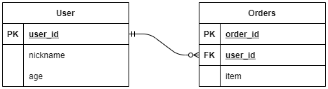

## 테스트 케이스에서의 @Transactional

스프링과 JPA를 사용하여 애플리케이션을 개발하는 경우, 코드 로직에 대한 검증을 위해 테스트 케이스를 작성한다.

보통 서비스 레이어에 대해 테스트를 한다면 DB에 관련된 (접근하는) 테스트 코드를 작성하게 된다. 이렇게 되면 테스트에 사용된 데이터들이 DB에 남기 때문에 `@Transactional`을 테스트 클래스에 적용해서 롤백하곤 한다. 스프링이 제공하는 테스트 코드에서의 `@Transactional`은 별도의 코드 없이 테스트 케이스 종료 후 이전의 DB 상태로 돌아가기 때문에 굉장히 편리하다는 장점이 있다.

그러나 `@Transactional`은 단순히 롤백 기능만을 제공하는 것이 아니기 때문에, 테스트 코드에서 단지 롤백을 위해 사용하는 경우 조심해야할 부분이 있다.


## 예제

다음과 같은 도메일 모델을 가진 예제를 통해 살펴보자.



```java
@Entity
@Getter
@NoArgsConstructor(access = AccessLevel.PROTECTED)
public class User {

    @Id @GeneratedValue
    @Column(name = "user_id")
    private Long id;

    private String nickname;

    private int age;

    @OneToMany(mappedBy = "user")
    private List<Orders> ordersList = new ArrayList<>();

    public User(String nickname, int age) {
        this.nickname = nickname;
        this.age = age;
    }

    public void modifyNickname(String nickname) {
        this.nickname = nickname;
    }

}
```

```java
@Entity
@Getter
@NoArgsConstructor(access = AccessLevel.PROTECTED)
public class Orders {

    @Id @GeneratedValue
    @Column(name = "orders_id")
    private Long id;

    private String item;

    @ManyToOne(fetch = FetchType.LAZY)
    @JoinColumn(name = "user_id")
    private User user;

    public Orders(String item) {
        this.item = item;
    }

    public void addUser(User user) {
        this.user = user;
        user.getOrdersList().add(this);
    }

}
```

```java
@Service
@RequiredArgsConstructor
public class UserService {

    private final UserRepository userRepository;
    private final OrderRepository orderRepository;

    @Transactional(readOnly = true)
    public User loadById(Long id) {
        return userRepository.findById(id).orElseThrow(() -> {
            throw new RuntimeException("User is not exist");
        });
    }

    @Transactional
    public User save(String nickname, int age) {
        User newUser = new User(nickname, age);
        
        return userRepository.save(newUser);
    }

    @Transactional
    public User orderAsLazyLoading(Long userId, String item) {
        User findUser = loadById(userId);

        Orders orders = new Orders(item);
        orders.addUser(findUser);
        orderRepository.save(orders);

        return findUser;
    }

}
```

- 서비스 계층에서 데이터 변경이 일어나는 곳은 `@Transcational`을 사용해서 영속성 컨텍스트를 활용하도록 설정하고, 데이터를 가져오기만 하는 곳은 `@Transcational(readonly = true)`를 사용해서 약간의 성능 이점을 가질 수 있도록 했다.

```java
@SpringBootTest
class UserServiceTest {

    @Autowired
    UserService userService;

    User setUpUser;

    @BeforeEach
    void setUp() {
        String nickname = "set-up-nickname";
        int age = 20;
        setUpUser = userService.save(nickname, age);
    }
    
    @Test
    @Transactional
    void orderAsLazyLoadingTest() {
        User orderedUser = userService.orderAsLazyLoading(setUpUser.getId(), "sample-item");

        List<Orders> ordersList = orderedUser.getOrdersList();
        for (Orders orders : ordersList) {
            System.out.println("order = " + orders);
        }
    }
    
}
```

- 테스트 케이스에서 `@Transactional`을 사용하고 있으므로, 해당 메서드가 종료될 때까지 영속성 컨텍스트를 공유한다.
- 따라서 Lazy Loading으로 가져와야 하는 `ordersList`가 잘 조회된다.
- 이후 정상적으로 테스트가 종료되면 DB 롤백도 잘 동작한다.

이렇게 테스트 케이스를 작성하고 검증을 마치면 실제 프로덕션에서 에러가 발생할 수 있다. 만약 서비스 계층에서 `@Transcaional` 사용을 빼먹었을 경우 어떻게 될까?

```java
@Service
@RequiredArgsConstructor
public class UserService {

    /* ... */

//    @Transactional
    public User orderAsLazyLoading(Long userId, String item) {
        User findUser = loadById(userId);

        Orders orders = new Orders(item);
        orders.addUser(findUser);
        orderRepository.save(orders);

        return findUser;
    }

}
```

```java
@SpringBootTest
class UserServiceTest {

    /* ... */
    
    @Test
    @Transactional
    void orderAsLazyLoadingTest() {
        User orderedUser = userService.orderAsLazyLoading(setUpUser.getId(), "sample-item");

        List<Orders> ordersList = orderedUser.getOrdersList();
        for (Orders orders : ordersList) {
            System.out.println("order = " + orders);
        }
    }
    
}
```

- 테스트 코드는 여전히 잘 통과한다. `@Transactional`을 사용 중인 테스트 메서드에서 `userService`가 호출되고 있으므로, 동일한 트랜잭션에 속하기 때문이다.
- 그러나 해당 코드를 실제 프로덕션에서 실행하면, 즉 테스트 코드에서 `@Transcactional`을 지우고 실행하면 `LazyInitializationException`가 발생한다. 이는 런타임 오류로, 서비스 동작 중에만 캐치할 수 있는 에러다.

위처럼 테스트 코드를 작성하면 놓칠 수 있는 부분이 생기므로, 검증을 위한 테스트 코드라고 할 수 없다. 따라서 테스트 케이스에는 `@Transcational`을 사용하지 않고 잘 동작하는지 확인하는 것이 실제 프로덕션과 유사한 검증 코드이다.

```java
public interface UserRepository extends JpaRepository<User, Long> {

    @EntityGraph(attributePaths = {"ordersList"})
    Optional<User> findUserWithOrdersListById(Long id);

}
```

```java
@Service
@RequiredArgsConstructor
public class UserService {

    /* ... */

    @Transactional(readOnly = true)
    public User loadWithOrdersById(Long id) {
        return userRepository.findUserWithOrdersListById(id).orElseThrow(() -> {
            throw new RuntimeException("User is not exits");
        });
    }

    @Transactional
    public User orderAsFetchJoin(Long userId, String item) {
        User findUser = loadWithOrdersById(userId);

        Orders orders = new Orders(item);
        orders.addUser(findUser);
        orderRepository.save(orders);

        return findUser;
    }

}
```

```java
@SpringBootTest
class UserServiceTest {

    /* ... */
    
    @Test
    void orderAsFetchJoinTest() {
        User orderedUser = userService.orderAsFetchJoin(setUpUser.getId(), "sample-item");

        List<Orders> ordersList = orderedUser.getOrdersList();
        for (Orders orders : ordersList) {
            System.out.println("order = " + orders);
        }
    }
    
}
```

- 위처럼 테스트 케이스에서는 `@Transactional`을 지우고, 서비스 계층에서는 Fetch Join을 하도록 로직을 변경하면 테스트 코드가 제대로 된 검증 역할을 수행한다.

더불어서, 테스트 케이스에서 `@Transcational`을 사용하지 않으면 DB 롤백이 일어나지 않기 때문에 데이터를 지우는 로직이 필요하다. 먼저 추가로 필요한 라이브러리 의존성을 위해 `pom.xml`에 추가하자.

```xml
<dependency>
    <groupId>com.google.guava</groupId>
    <artifactId>guava</artifactId>
    <version>30.1.1-jre</version>
</dependency>
```

그리고 테스트 케이스가 종료될 때마다 @AfterEach 메서드에서 DB 테이블을 초기 상태로 되돌리는 역할을 수행하는 `DatabaseCleanUp` 객체를 구현하자.

```java
@Service
@RequiredArgsConstructor
public class DatabaseCleanUp implements InitializingBean {

    private final EntityManager entityManager;

    private List<String> tableNames;

    @Override
    public void afterPropertiesSet() {
        tableNames = entityManager.getMetamodel().getEntities().stream()
                .filter(entityType -> entityType.getJavaType().getAnnotation(Entity.class) != null)
                .map(entityType -> CaseFormat.UPPER_CAMEL.to(CaseFormat.LOWER_UNDERSCORE, entityType.getName()))
                .collect(Collectors.toList());
    }

    @Transactional
    public void truncateAllEntity() {
        entityManager.flush();
        entityManager.createNativeQuery("SET FOREIGN_KEY_CHECKS = 0").executeUpdate();
        for (String tableName : tableNames) {
            entityManager.createNativeQuery("TRUNCATE TABLE " + tableName).executeUpdate();
        }
        entityManager.createNativeQuery("SET FOREIGN_KEY_CHECKS = 1").executeUpdate();
    }

}
```

- `afterPropertiesSet()` 메서드는 해당 객체가 처음 빈으로 등록될 때 동작하는 메서드로, 프로젝트에서 사용중인 `@Entity`를 기준으로 DB 테이블 이름을 저장한다.
- `truncateAllEntity()` 메서드는 테스트 케이스 종료 후 `@AfterEach` 메서드에서 호출될 메서드로, 각 DB 테이블을 초기 상태로 되돌린다.

```java
@SpringBootTest
class UserServiceTest {

    /* ... */
    
    @Autowired
    DatabaseCleanUp databaseCleanUp;
    
    @AfterEach
    void tearDown() {
        databaseCleanUp.truncateAllEntity();
    }
    
    @Test
    void orderAsFetchJoinTest() {
        User orderedUser = userService.orderAsFetchJoin(setUpUser.getId(), "sample-item");

        List<Orders> ordersList = orderedUser.getOrdersList();
        for (Orders orders : ordersList) {
            System.out.println("order = " + orders);
        }
    }
    
}
```

- 이제 각 테스트 메서드가 종료되면, 테스트 수행 간에 생성 및 변경된 데이터들이 다른 테스트 케이스에 영향을 미치지 않도록 모두 날려버린다.
- 따라서 테스트 케이스에서 `@Transcational`을 사용하지 않음으로써 실제 프로덕션과 보다 유사한 환경으로 실행할 수 있고, DB 롤백이 되지 않는 문제도 해결하였다.


## 삽질의 기록

처음에는 `@Transcational`의 `propagation` 속성을 잘 설정하면  트랜잭션 범위에 따라서 DB 롤백이 되도록 세팅할 수 있지 않을까 해서 `propagation` 속성을 살펴봤다. 하지만 테스트 케이스가 끝날 때 DB 롤백이 되어야 하므로, 트랜잭션이 테스트 케이스에 의존적일 수 밖에 없다는 결론을 내렸다.

```java
@Service
@RequiredArgsConstructor
public class UserService {
    
    /* ... */

    private final UserRepository userRepository;

    @Transactional(readOnly = true)
    public User loadById(Long id) {
        return userRepository.findById(id).orElseThrow(() -> {
            throw new RuntimeException("User is not exist");
        });
    }

    @Transactional
    public User changeNickname(Long userId, String newNickname) {
        User findUser = loadById(userId);
        findUser.modifyNickname(newNickname);

        return findUser;
    }

}
```

```java
@SpringBootTest
class UserServiceTest {
    
    /* ... */

    @Autowired
    UserService userService;

    User setUpUser;

    @BeforeEach
    void setUp() {
        setUpUser = userService.save("set-up-nickname", 20);
    }

    @Test
    @DisplayName("Non Transactional")
    void changeNicknameTest() {
        String nickname = "sample-nickname";
        int age = 20;
        User savedUser = userService.save(nickname, age);

        /*
        * INSERT USER
        * */

        String newNickname = "new-nickname";
        User findUser = userService.changeNickname(savedUser.getId(), newNickname);

        /*
        * UPDATE USER
        * */

        /*
        * savedUser = {User@9086}
        *   id = 9
        *   nickname = "sample-nickname"
        *   age = 20
        *
        * findUser = {User@9146}
        *   id = 9
        *   nickname = "new-nickname"
        *   age = 20
        * */

        assertEquals(newNickname, findUser.getNickname());
        assertNotEquals(newNickname, savedUser.getNickname());
        assertEquals(findUser.getId(), savedUser.getId());
        assertNotEquals(findUser, savedUser);

        /*
        * No Rollback
        * */
    }

    @Test
    @DisplayName("Propagation: Required (기본 세팅 값. 현재 트랜잭션이 존재하면 이어서 받아들이고, 존재하지 않는다면 새로운 트랜잭션을 시작)")
    @Transactional
    void changeNicknameAsRequiredTransactionalTest() {
        String nickname = "sample-nickname";
        int age = 20;
        User savedUser = userService.save(nickname, age);

        /*
        * No INSERT USER
        * */

        String newNickname = "new-nickname";
        User findUser = userService.changeNickname(savedUser.getId(), newNickname);

        /*
        * No UPDATE USER
        * */

        /*
        * savedUser = {User@9055}
        *   id = 11
        *   nickname = "new-nickname"
        *   age = 20
        *
        * findUser = {User@9055}
        *   id = 11
        *   nickname = "new-nickname"
        *   age = 20
        * */

        assertEquals(findUser, savedUser);

        /*
        * Rollback Well
        * */
    }

    @Test
    @DisplayName("Propagation: Supports (현재 트랜잭션이 존재하면 이어서 받아들이고, 존재하지 않는다면 굳이 생성하지 않고 Non-트랜잭션 상태로 실행)")
    @Transactional(propagation = Propagation.SUPPORTS)
    void changeNicknameAsSupportsTransactionalTest() {
        String nickname = "sample-nickname";
        int age = 20;
        User savedUser = userService.save(nickname, age);

        /*
        * INSERT USER
        * */

        String newNickname = "new-nickname";
        User findUser = userService.changeNickname(savedUser.getId(), newNickname);

        /*
        * UPDATE USER
        * */

        /*
        * savedUser = {User@9086}
        *   id = 6
        *   nickname = "sample-nickname"
        *   age = 20
        *
        * findUser = {User@9151}
        *   id = 6
        *   nickname = "new-nickname"
        *   age = 20
        * */

        assertEquals(newNickname, findUser.getNickname());
        assertNotEquals(newNickname, savedUser.getNickname());
        assertEquals(findUser.getId(), savedUser.getId());
        assertNotEquals(findUser, savedUser);

        /*
        * No Rollback
        * */
    }

    /*
    * 현재 트랜잭션이 존재하면 이어서 받아들이고, 존재하지 않는다면 예외를 던진다.
    * */
    @Test
    @DisplayName("Propagation - Mandatory")
    @Transactional(propagation = Propagation.MANDATORY)
    void changeNicknameAsMandatoryTransactionalTest() {
        /*
        * IllegalTransactionStateException 발생
        * */
        System.out.println("실행 될까?");
    }

    @Test
    @DisplayName("Propagation: Requires New (현재 트랜잭션이 존재하면 중단하고, 새로운 트랜잭션을 시작)")
    @Transactional(propagation = Propagation.REQUIRES_NEW)
    void changeNicknameAsRequiresNewTransactionalTest() {
        String nickname = "sample-nickname";
        int age = 20;
        User savedUser = userService.save(nickname, age);

        /*
        * No INSERT USER
        * */

        String newNickname = "new-nickname";
        User findUser = userService.changeNickname(savedUser.getId(), newNickname);

        /*
        * No UPDATE USER
        * */

        /*
        * savedUser = {User@9055}
        *   id = 8
        *   nickname = "new-nickname"
        *   age = 20
        *
        * findUser = {User@9055}
        *   id = 8
        *   nickname = "new-nickname"
        *   age 20
        * */

        assertEquals(findUser, savedUser);

        /*
        * Rollback Well
        * */
    }

    @Test
    @DisplayName("Propagation: Not Supported (현재 트랜잭션이 존재하면 중단시키고, Non-트랜잭션 상태로 실행)")
    @Transactional(propagation = Propagation.NOT_SUPPORTED)
    void changeNicknameAsNotSupportedTransactionalTest() {
        String nickname = "sample-nickname";
        int age = 20;
        User savedUser = userService.save(nickname, age);

        /*
         * INSERT USER
         * */

        String newNickname = "new-nickname";
        User findUser = userService.changeNickname(savedUser.getId(), newNickname);

        /*
         * UPDATE USER
         * */

        /*
         * savedUser = {User@9086}
         *   id = 15
         *   nickname = "sample-nickname"
         *   age = 20
         *
         * findUser = {User@9145}
         *   id = 15
         *   nickname = "new-nickname"
         *   age = 20
         * */

        assertEquals(newNickname, findUser.getNickname());
        assertNotEquals(newNickname, savedUser.getNickname());
        assertEquals(findUser.getId(), savedUser.getId());
        assertNotEquals(findUser, savedUser);

        /*
         * No Rollback
         * */
    }

    @Test
    @DisplayName("Propagation: Never (현재 트랜잭션이 존재하면 예외를 던지고, Non-트랜잭션 상태로 실행)")
    @Transactional(propagation = Propagation.NEVER)
    void changeNicknameAsNeverTransactionalTest() {
        String nickname = "sample-nickname";
        int age = 20;
        User savedUser = userService.save(nickname, age);

        /*
         * INSERT USER
         * */

        String newNickname = "new-nickname";
        User findUser = userService.changeNickname(savedUser.getId(), newNickname);

        /*
         * UPDATE USER
         * */

        /*
         * savedUser = {User@9086}
         *   id = 16
         *   nickname = "sample-nickname"
         *   age = 20
         *
         * findUser = {User@9145}
         *   id = 16
         *   nickname = "new-nickname"
         *   age = 20
         * */

        assertEquals(newNickname, findUser.getNickname());
        assertNotEquals(newNickname, savedUser.getNickname());
        assertEquals(findUser.getId(), savedUser.getId());
        assertNotEquals(findUser, savedUser);

        /*
         * No Rollback
         * */
    }

    @Test
    @DisplayName("Propagation: Nested (현재 트랜잭션이 존재하면 중첩된 트랜잭션을 생성하여 실행하고, 현재 트랜잭션이 존재하지 않으면 Required와 동일하게 동작)")
    @Transactional(propagation = Propagation.NESTED)
    void changeNicknameAsNestedTransactionalTest() {
        String nickname = "sample-nickname";
        int age = 20;
        User savedUser = userService.save(nickname, age);

        /*
         * No INSERT USER
         * */

        String newNickname = "new-nickname";
        User findUser = userService.changeNickname(savedUser.getId(), newNickname);

        /*
         * No UPDATE USER
         * */

        /*
         * savedUser = {User@9055}
         *   id = 17
         *   nickname = "new-nickname"
         *   age = 20
         *
         * findUser = {User@9055}
         *   id = 17
         *   nickname = "new-nickname"
         *   age 20
         * */

        assertEquals(findUser, savedUser);

        /*
         * Rollback Well
         * */
    }

}
```

- 추가로, 테스트 케이스를 실행하면 `@BeforeEach` 혹은 `@AfterEach`는 `@Transcational`이 자동으로 적용된다고 잘못 생각하고 있었다. 클래스 레벨에 `@Transactional`이 적용되어 있다면, 해당 클래스에 속한 메서드에는 모두 적용되는 것이 당연하지만, 클래스 레벨이 아닌 테스트 메서드 레벨에 `@Transcational`을 적용해서 실행하면 `@BeforeEach` 메서드에는 `@Transactional`이 적용되지 않는다. [Spring Docs: Enabling and Disabling Transactions](https://docs.spring.io/spring-framework/docs/current/reference/html/testing.html#testcontext-tx-enabling-transactions)

